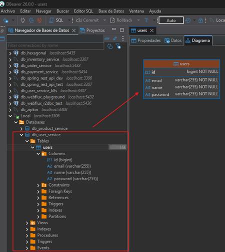

# 📂 Sección 02: Microservicio de Usuarios

En este módulo daremos vida al primer componente de nuestra arquitectura, aplicando un stack moderno pero manteniendo el
control manual de la configuración.

---

## 🛠️ Creación del microservicio usuarios `(user-service)`

### 🧩 Dependencias

Iniciamos mostrando las dependencias que serán utilizadas en el `user-service`. La única dependencia que agregamos
manualmente fue `MapStruct`, las demás dependencias las agregamos desde
[Spring Initializr (ver dependencias)](https://start.spring.io/#!type=maven-project&language=java&platformVersion=4.0.3&packaging=jar&configurationFileFormat=yaml&jvmVersion=25&groupId=dev.magadiflo&artifactId=user-service&name=user-service&description=Demo%20project%20for%20Spring%20Boot&packageName=dev.magadiflo.user.app&dependencies=web,validation,data-jpa,mysql,lombok,actuator,cloud-starter).

````xml
<!--Spring Boot 4.0.3-->
<!--Spring Cloud 2025.1.0-->
<!--Java 25-->
<!--org.mapstruct.version 1.6.3-->
<!--lombok-mapstruct-binding.version 0.2.0-->
<dependencies>
    <dependency>
        <groupId>org.springframework.boot</groupId>
        <artifactId>spring-boot-starter-actuator</artifactId>
    </dependency>
    <dependency>
        <groupId>org.springframework.boot</groupId>
        <artifactId>spring-boot-starter-data-jpa</artifactId>
    </dependency>
    <dependency>
        <groupId>org.springframework.boot</groupId>
        <artifactId>spring-boot-starter-validation</artifactId>
    </dependency>
    <dependency>
        <groupId>org.springframework.boot</groupId>
        <artifactId>spring-boot-starter-webmvc</artifactId>
    </dependency>
    <dependency>
        <groupId>org.springframework.cloud</groupId>
        <artifactId>spring-cloud-starter</artifactId>
    </dependency>

    <!--Agregado manualmente-->
    <dependency>
        <groupId>org.mapstruct</groupId>
        <artifactId>mapstruct</artifactId>
        <version>${org.mapstruct.version}</version>
    </dependency>
    <!--/Agregado manualmente-->
    <dependency>
        <groupId>com.mysql</groupId>
        <artifactId>mysql-connector-j</artifactId>
        <scope>runtime</scope>
    </dependency>
    <dependency>
        <groupId>org.projectlombok</groupId>
        <artifactId>lombok</artifactId>
        <optional>true</optional>
    </dependency>
    <dependency>
        <groupId>org.springframework.boot</groupId>
        <artifactId>spring-boot-starter-actuator-test</artifactId>
        <scope>test</scope>
    </dependency>
    <dependency>
        <groupId>org.springframework.boot</groupId>
        <artifactId>spring-boot-starter-data-jpa-test</artifactId>
        <scope>test</scope>
    </dependency>
    <dependency>
        <groupId>org.springframework.boot</groupId>
        <artifactId>spring-boot-starter-validation-test</artifactId>
        <scope>test</scope>
    </dependency>
    <dependency>
        <groupId>org.springframework.boot</groupId>
        <artifactId>spring-boot-starter-webmvc-test</artifactId>
        <scope>test</scope>
    </dependency>
</dependencies>
````

Notar que he agregado la dependencia `spring-cloud-starter`, la misma que se encuentra en `Spring Initializr` como
`Cloud Bootstrap`. Esta dependencia la incluí con el objetivo de permitir que `Spring Initializr` o el sistema de
gestión de dependencias (Maven/Gradle) establezca automáticamente la versión correcta y compatible de `Spring Cloud`
según la versión de `Spring Boot` utilizada en este proyecto.

> ⚠️ `Nota`: Esta dependencia no aporta funcionalidad concreta por sí sola. Su inclusión es estratégica para
> inicializar correctamente el entorno de `Spring Cloud` y facilitar futuras incorporaciones de componentes.
> Puede ser removida posteriormente si se definen starters específicos de `Spring Cloud` según las necesidades del
> proyecto.

### ⚙️ Procesadores de Anotaciones (Annotation Processors)

**Referencias**

- [Using MapStruct with Maven and Lombok.](https://bootify.io/spring-data/mapstruct-with-maven-and-lombok.html)
- [Using MapStruct With Lombok](https://www.baeldung.com/java-mapstruct-lombok)

Como vamos a trabajar con `MapStruct` necesitamos ampliar el `maven-compiler-plugin` para activar la generación de
código de `MapStruct`. Observar que nuestro primer procesador de anotaciones es `Lombok`, seguido directamente por
`MapStruct`. Se requiere otra referencia a `lombok-mapstruct-binding` para que estas dos bibliotecas funcionen juntas.
Sin `Lombok`, solo se necesitaría el `mapstruct-processor` en este momento.

````xml

<plugins>
    <!--MapStruct-->
    <plugin>
        <groupId>org.apache.maven.plugins</groupId>
        <artifactId>maven-compiler-plugin</artifactId>
        <version>${maven-compiler-plugin.version}</version>
        <configuration>
            <source>${java.version}</source>
            <target>${java.version}</target>
            <annotationProcessorPaths>
                <path>
                    <groupId>org.projectlombok</groupId>
                    <artifactId>lombok</artifactId>
                    <version>${lombok.version}</version>
                </path>
                <path>
                    <groupId>org.mapstruct</groupId>
                    <artifactId>mapstruct-processor</artifactId>
                    <version>${org.mapstruct.version}</version>
                </path>
                <path>
                    <groupId>org.projectlombok</groupId>
                    <artifactId>lombok-mapstruct-binding</artifactId>
                    <version>${lombok-mapstruct-binding.version}</version>
                </path>
            </annotationProcessorPaths>
        </configuration>
    </plugin>
    <!--/MapStruct-->
</plugins>
````

Es fácil cometer errores aquí, ya que los procesadores de anotaciones son una función avanzada. El principal error es
olvidar que nuestro entorno de ejecución buscará procesadores de anotaciones en el `path` o en el `classpath`, pero no
en ambas.

Debemos tener en cuenta que, para la versión `1.18.16 de Lombok y superiores`, necesitamos agregar tanto la dependencia
`lombok-mapstruct-binding` de `Lombok` como la dependencia `mapstruct-processor` en el elemento
`annotationProcessorPaths`. Si no lo hacemos, podríamos obtener un error de compilación:
`“Propiedad desconocida en el tipo de resultado…”`.

Necesitamos la dependencia `lombok-mapstruct-binding` para que `Lombok` y `MapStruct` funcionen juntos. En esencia, le
indica a `MapStruct` que espere hasta que `Lombok` haya completado todo el procesamiento de anotaciones antes de generar
clases de mapeador para los beans mejorados con `Lombok`.

## 🗄️ Configuración del Contexto de Persistencia `(JPA/Hibernate)`

En esta etapa inicial, configuraremos el microservicio para que se comunique con una base de datos `MySQL` externa.

### ⚙️ Archivo: `application.yml` en `user-service`

Hemos definido una configuración explícita, priorizando la visibilidad de las operaciones de base de datos en la
consola para facilitar el aprendizaje.

````yml
server:
  port: 8001
  error:
    include-message: always

spring:
  application:
    name: user-service
  datasource:
    url: jdbc:mysql://localhost:3306/db_user_service
    username: admin
    password: magadiflo
  jpa:
    hibernate:
      ddl-auto: update
    properties:
      hibernate:
        format_sql: true

logging:
  level:
    dev.magadiflo.user.app: debug
    org.hibernate.SQL: debug
````

💡 Entorno de Base de Datos
> Actualmente, el microservicio `user-service` apunta a `localhost:3306`. Por lo tanto, quiero dejar en claro que
> por el momento trabajaremos con `mysql` instalada en mi `máquina local`. Además, tengamos en cuenta que, cuando
> movamos este servicio a Docker, el `localhost` dejará de funcionar (ya que se referirá al contenedor mismo). En ese
> punto, deberemos cambiar la URL para apuntar al nombre del contenedor de `MySQL` o al host de la red de Docker.

## 👤 Modelo de Datos: Entidad `User`

La entidad `User` es el corazón del microservicio. Utilizaremos **JPA (Java Persistence API)** para el mapeo
objeto-relacional y **Lombok** para mantener un código limpio y conciso.

### 📄 Clase de Entidad: `User.java`

Esta clase define la estructura de la tabla `users` en `MySQL`.

````java

@ToString
@AllArgsConstructor
@NoArgsConstructor
@Builder
@Setter
@Getter
@Entity
@Table(name = "users")
public class User {
    @Id
    @GeneratedValue(strategy = GenerationType.IDENTITY)
    private Long id;

    @Column(nullable = false)
    private String name;

    @Column(nullable = false, unique = true)
    private String email;

    @Column(nullable = false)
    private String password;
}
````

## 🏗️ Construcción de la tabla `users` a partir de la entidad

Gracias a la propiedad `spring.jpa.hibernate.ddl-auto: update` que configuramos previamente en nuestro
`application.yml`, Spring Boot se encarga de sincronizar nuestro modelo de objetos con el esquema de la base de datos de
forma automática al iniciar la aplicación.

### 🏁 Verificación de la Persistencia

Al ejecutar el microservicio `user-service` por primera vez, Hibernate detecta la ausencia de la tabla `users` y
ejecuta las sentencias `DDL` necesarias para crearla, respetando las restricciones de integridad
(`NOT NULL`, `UNIQUE`, etc.) que definimos mediante anotaciones en nuestra entidad.



### 💡 Nota

> `Persistencia Local`: Recuerda que en este momento estamos conectados a la base de datos instalada físicamente en
> el sistema operativo (`localhost`). Asegúrate de que el servicio de `MySQL` esté corriendo antes de iniciar la
> aplicación de `Spring Boot 4` para evitar excepciones de conexión en el arranque.

## 🚀 Implementando el componente repository para el acceso a datos

Creamos un repositorio para la entidad `User` que extienda de `JpaRepository`, donde le definiremos un método
personalizado para consultar por la existencia de un email.

````java
public interface UserRepository extends JpaRepository<User, Long> {
    boolean existsByEmail(String email);
}
````

````java
public interface UserRepository extends JpaRepository<User, Long> {
    /**
     * Consulta derivada para verificar la existencia de un usuario por su email.
     *
     * @param email Correo a validar
     * @return true si el email ya está registrado
     */
    boolean existsByEmail(String email);
}
````

`Query Methods (Consultas Derivadas)`: El método `existsByEmail(...)` es interpretado por `Spring Data` en tiempo
de ejecución. Genera internamente una consulta `SQL` de tipo `SELECT count(*) > 0` filtrando por la columna email.
Es mucho más eficiente que traer toda la entidad solo para validar su existencia.

## 📦 Definiendo DTOs e Interfaz de Mapeo

Para mantener una arquitectura limpia, utilizaremos **Java Records** como DTOs. Esta es la forma más moderna de manejar
datos inmutables en **Java 25**, permitiendo una transferencia de información eficiente entre el cliente y nuestro
microservicio.

### 📥 Entrada de Datos: `UserRequest` (Record)

Este DTO captura la información del cliente. Aplicamos validaciones de `Jakarta Bean Validation` para asegurar que los
datos sean correctos antes de procesarlos en el servicio.

````java
public record UserRequest(@NotBlank
                          String name,

                          @NotBlank
                          @Email
                          String email,

                          @NotBlank
                          String password) {
}
````

### 📤 Salida de Datos: UserResponse (Record)

Definimos este objeto para controlar qué datos retornamos al exterior, protegiendo campos sensibles si fuera necesario.

````java
public record UserResponse(Long id,
                           String name,
                           String email,
                           String password) {
}
````

### 🔄 Mapeo de Objetos con MapStruct

Para transformar los datos de forma eficiente entre nuestras Entidades y DTOs, implementamos una interfaz de mapeo con
MapStruct.

````java

@Mapper(componentModel = MappingConstants.ComponentModel.SPRING)
public interface UserMapper {
    UserResponse toUserResponse(User user);

    User toUser(UserRequest request);

    @Mapping(target = "id", ignore = true)
    User toUpdateUser(@MappingTarget User user, UserRequest request);
}
````

#### 🛠️ Desglose de Anotaciones Clave

- `@Mapper(componentModel = ...)`: Indica que la interfaz es un mapeador de `MapStruct`. Al usar el modelo `SPRING`,
  MapStruct genera una implementación que se registra como un Bean en el contenedor de Spring, permitiendo su inyección
  mediante constructor o `@Autowired`.
- `@Mapping(target = "id", ignore = true)`: Instrucción crítica para procesos de actualización. Indica que el campo `id`
  del objeto destino no debe ser modificado, protegiendo el identificador original de la base de datos.
- `@MappingTarget`: Define que el parámetro `User user` es el objeto que recibirá los cambios. En lugar de crear
  un objeto nuevo, `MapStruct` actualiza el estado del objeto existente con los datos del `UserRequest`.

## ⚠️ Manejo Global de Excepciones

Para que nuestro microservicio sea profesional, debemos garantizar que el cliente siempre reciba un formato de error
consistente, independientemente del fallo ocurrido.

### 📄 Estandarización de la Respuesta: `ErrorResponse` (Record)

Utilizamos un `record` para definir un contrato de error único. Aplicamos anotaciones de **Jackson** para optimizar la
salida JSON.

````java

@JsonInclude(JsonInclude.Include.NON_NULL)
public record ErrorResponse(int status,
                            String error,
                            String message,
                            String path,
                            Map<String, List<String>> errors) {
    @JsonProperty
    public LocalDateTime timestamp() {
        return LocalDateTime.now().truncatedTo(ChronoUnit.SECONDS);
    }
}
````

**Dónde**

- `@JsonInclude(JsonInclude.Include.NON_NULL)`, cuando colocamos a nivel de clase (record o clase normal), le indicamos
  a `Jackson` que debe omitir en la serialización cualquier campo cuyo valor sea `null`, para todos los campos de ese
  tipo (no necesitamos anotar uno por uno los campos que posiblemente puedan ser `null`).
- La anotación `@JsonProperty` le dice a `Jackson` que debe incluir este método como una propiedad en el `JSON` de
  salida, aunque no sea parte del constructor del `record`.

### 🛡️ Definición de Excepciones Personalizadas

Creamos una jerarquía de excepciones para manejar errores de negocio específicos.

#### 🔍 `NotFoundException` & `UserNotFoundException`

Base para recursos no encontrados y su implementación específica para usuarios.

````java
public class NotFoundException extends RuntimeException {
    public NotFoundException(String message) {
        super(message);
    }
}
````

Creamos la excepción `UserNotFound` que extenderá de la clase anterior.

````java
public class UserNotFoundException extends NotFoundException {
    public UserNotFoundException(Long userId) {
        super("No se encuentra el usuario con id [%d]".formatted(userId));
    }
}
````

#### 📧 `EmailAlreadyExistsException`

Lanzada cuando se intenta registrar un correo que ya existe en la base de datos.

````java
public class EmailAlreadyExistsException extends RuntimeException {
    public EmailAlreadyExistsException(String email) {
        super("El correo [%s] ya está asociado a otro usuario".formatted(email));
    }
}
````

#### 🌍 El Orquestador: `GlobalExceptionHandler`

Utilizamos `@RestControllerAdvice` para capturar las excepciones en cualquier punto de la aplicación y transformarlas en
nuestra `ErrorResponse`.

````java

@Slf4j
@RestControllerAdvice
public class GlobalExceptionHandler {

    @ExceptionHandler(UserNotFoundException.class)
    public ResponseEntity<ErrorResponse> handleNotFoundException(UserNotFoundException ex, HttpServletRequest request) {
        log.error("Usuario no encontrado: {}", ex.getMessage());
        var errorResponse = this.buildErrorResponse(
                HttpStatus.NOT_FOUND,
                ex.getMessage(),
                request.getRequestURI(),
                null
        );
        return ResponseEntity
                .status(HttpStatus.NOT_FOUND)
                .body(errorResponse);
    }

    @ExceptionHandler(EmailAlreadyExistsException.class)
    public ResponseEntity<ErrorResponse> handleEmailAlreadyExistsException(EmailAlreadyExistsException ex, HttpServletRequest request) {
        log.error("El email ya existe: {}", ex.getMessage());
        var errorResponse = this.buildErrorResponse(
                HttpStatus.BAD_REQUEST,
                ex.getMessage(),
                request.getRequestURI(),
                null
        );
        return ResponseEntity
                .status(HttpStatus.BAD_REQUEST)
                .body(errorResponse);
    }

    @ExceptionHandler(MethodArgumentNotValidException.class)
    public ResponseEntity<ErrorResponse> handleMethodArgumentNotValidException(MethodArgumentNotValidException ex, HttpServletRequest request) {
        log.error("Error en argumentos: {}", ex.getMessage());

        Map<String, List<String>> errors = new HashMap<>();
        ex.getBindingResult().getFieldErrors().forEach(fieldError -> {
            String field = fieldError.getField();
            String defaultMessage = fieldError.getDefaultMessage();
            errors.computeIfAbsent(field, k -> new ArrayList<>()).add(defaultMessage);
        });

        var errorResponse = this.buildErrorResponse(
                HttpStatus.BAD_REQUEST,
                "Falló la validación en los campos",
                request.getRequestURI(),
                errors
        );
        return ResponseEntity
                .status(HttpStatus.BAD_REQUEST)
                .body(errorResponse);
    }

    @ExceptionHandler(Exception.class)
    public ResponseEntity<ErrorResponse> handleGenericException(Exception exception, HttpServletRequest request) {
        log.error("Error genérico: {}", exception.getMessage());
        var errorResponse = this.buildErrorResponse(
                HttpStatus.INTERNAL_SERVER_ERROR,
                exception.getMessage(),
                request.getRequestURI(),
                null
        );
        return ResponseEntity
                .status(HttpStatus.INTERNAL_SERVER_ERROR)
                .body(errorResponse);
    }

    private ErrorResponse buildErrorResponse(HttpStatus httpStatus, String message, String requestURI, Map<String, List<String>> errors) {
        return new ErrorResponse(
                httpStatus.value(),
                httpStatus.getReasonPhrase(),
                message,
                requestURI,
                errors
        );
    }
}
````

## 🧠 Implementando el componente Service

La capa de servicio orquesta la lógica de negocio, comunicando el repositorio con los mappers y gestionando la
integridad de los datos mediante excepciones personalizadas.

### 📋 Interfaz de Negocio: `UserService.java`

Definimos un contrato claro para las operaciones de nuestro microservicio.

````java
public interface UserService {
    List<UserResponse> findAllUsers();

    UserResponse findUser(String userId);

    UserResponse saveUser(UserRequest userRequest);

    UserResponse updateUser(Long userId, UserRequest userRequest);

    void deleteUser(Long userId);
}
````

### 🛠️ Implementación del Servicio: `UserServiceImpl.java`

En la implementación, aplicamos un enfoque transaccional para asegurar la consistencia en la base de datos.

- 🛡️ `@Transactional(readOnly = true)`: Optimizamos el rendimiento a nivel de clase para las consultas de solo lectura.
  Sobrescribimos con `@Transactional` solo en los métodos que modifican datos (`save`, `update`, `delete`).

````java

@RequiredArgsConstructor
@Service
@Transactional(readOnly = true)
public class UserServiceImpl implements UserService {

    private final UserRepository userRepository;
    private final UserMapper userMapper;

    @Override
    public List<UserResponse> findAllUsers() {
        return this.userRepository.findAll()
                .stream()
                .map(this.userMapper::toUserResponse)
                .toList();
    }

    @Override
    public UserResponse findUser(Long userId) {
        return this.userRepository.findById(userId)
                .map(this.userMapper::toUserResponse)
                .orElseThrow(() -> new UserNotFoundException(userId));
    }

    @Override
    @Transactional
    public UserResponse saveUser(UserRequest userRequest) {
        if (this.userRepository.existsByEmail(userRequest.email())) {
            throw new EmailAlreadyExistsException(userRequest.email());
        }

        User savedUser = this.userRepository.save(this.userMapper.toUser(userRequest));
        return this.userMapper.toUserResponse(savedUser);
    }

    @Override
    @Transactional
    public UserResponse updateUser(Long userId, UserRequest userRequest) {
        return this.userRepository.findById(userId)
                .map(foundUser -> {
                    // 📧 Validación: Si el email cambia, verificamos que no exista ya
                    if (!userRequest.email().equalsIgnoreCase(foundUser.getEmail()) &&
                        this.userRepository.existsByEmail(userRequest.email())) {
                        throw new EmailAlreadyExistsException(userRequest.email());
                    }
                    return this.userMapper.toUpdateUser(foundUser, userRequest);
                })
                .map(this.userRepository::save)
                .map(this.userMapper::toUserResponse)
                .orElseThrow(() -> new UserNotFoundException(userId));
    }

    @Override
    @Transactional
    public void deleteUser(Long userId) {
        User foundUser = this.userRepository.findById(userId)
                .orElseThrow(() -> new UserNotFoundException(userId));
        this.userRepository.delete(foundUser);
    }
}
````

## 🎮 Implementando el controlador RestController y los métodos handler

El controlador actúa como el punto de entrada de nuestro microservicio. Hemos implementado un diseño RESTful completo,
asegurando que las respuestas sigan los estándares HTTP adecuados.

### 📄 Clase del Controlador: `UserController.java`

````java

@RequiredArgsConstructor
@RestController
@RequestMapping(path = "/api/{version}/users", version = "1")
public class UserController {

    private final UserService userService;

    @GetMapping
    public ResponseEntity<List<UserResponse>> findAllUsers() {
        return ResponseEntity.ok(this.userService.findAllUsers());
    }

    @GetMapping(path = "/{userId}")
    public ResponseEntity<UserResponse> findUser(@PathVariable Long userId) {
        return ResponseEntity.ok(this.userService.findUser(userId));
    }

    @PostMapping
    public ResponseEntity<UserResponse> saveUser(@Valid @RequestBody UserRequest userRequest) {
        UserResponse userResponse = this.userService.saveUser(userRequest);
        URI location = ServletUriComponentsBuilder.fromCurrentRequest()
                .path("/{userId}")
                .buildAndExpand(userResponse.id())
                .toUri();
        return ResponseEntity.created(location).body(userResponse);
    }

    @PutMapping(path = "/{userId}")
    public ResponseEntity<UserResponse> updateUser(@PathVariable Long userId, @Valid @RequestBody UserRequest userRequest) {
        return ResponseEntity.ok(this.userService.updateUser(userId, userRequest));
    }

    @DeleteMapping(path = "/{userId}")
    public ResponseEntity<Void> deleteUser(@PathVariable Long userId) {
        this.userService.deleteUser(userId);
        return ResponseEntity.noContent().build();
    }
}
````

### 🔍 Análisis del Diseño REST

- 📮 `ResponseEntity.created(location)`: Al crear un recurso, no solo devolvemos el objeto, sino también la cabecera
  Location con la URL para acceder a dicho recurso. Es el estándar de oro en APIs maduras.
- 🛡️ `@Valid`: Dispara la validación de los campos definidos en nuestro `UserRequest (record)`. Si falla, el
  `GlobalExceptionHandler` que creamos antes capturará el error automáticamente.
- 🔗 `path-segment: 1`: Esta configuración en el `YAML` debe coincidir exactamente con el lugar donde colocamos
  `{version}` en nuestro `@RequestMapping`.

## 🛠️ Configura el API Versioning (Spring Boot 4)

Una de las mejoras más potentes en `Spring Boot 4` es el soporte nativo para el versionado de APIs, eliminando la
necesidad de librerías externas o configuraciones complejas de filtrado manual.

### ⚙️ Archivo de Configuración: `application.yml`

Añadimos las siguientes propiedades para habilitar y restringir el uso de versiones en nuestras rutas.

````yml
spring:
  # API Versioning (Spring Boot 4)
  mvc:
    api-version:
      # Obliga a que todas las peticiones incluyan una versión.
      # Si el cliente no la envía, la solicitud fallará (generalmente con un 400 Bad Request).
      required: true

      # Define qué versiones son válidas en tu aplicación.
      # En este caso, solo aceptará peticiones marcadas como versión 1 o 2.
      supported: 1,2
      use:
        # Indica que la versión se debe extraer de un segmento de la ruta (URL).
        # El valor 0 es el índice del segmento de ruta donde se espera la versión. Por ejemplo:
        # Para una estructura de URL como /{versión}/resource, use 0.
        # Para una estructura de URL como /api/{versión}/resource, use 1.
        path-segment: 1
````

## 🧪 Probando la API REST de Usuarios

Con la aplicación corriendo y conectada a nuestra base de datos `MySQL local`, procedemos a validar los endpoints.
Utilizaremos `curl` para las peticiones y `jq` para formatear las respuestas JSON en consola.

### 📑 Listar todos los usuarios

Verificamos que la solicitud nos retorna un arreglo con todos los usuarios registrados.

````bash
$ curl -v http://localhost:8001/api/v1/users | jq
>
< HTTP/1.1 200
< Content-Type: application/json
< Transfer-Encoding: chunked
< Date: Thu, 12 Mar 2026 21:11:43 GMT
<
[
  {
    "id": 1,
    "name": "Martin",
    "email": "martin@gmail.com",
    "password": "123456"
  },
  {
    "id": 2,
    "name": "Melissa",
    "email": "meli@gmail.com",
    "password": "123456"
  },
  {
    "id": 3,
    "name": "Lesly",
    "email": "lesly@gmail.com",
    "password": "123456"
  }
]
````

### 🎯 Encontrar un usuario por su ID

Validamos la recuperación de un recurso específico.

````bash
$ curl -v http://localhost:8001/api/v1/users/2 | jq
>
< HTTP/1.1 200
< Content-Type: application/json
< Transfer-Encoding: chunked
< Date: Thu, 12 Mar 2026 21:12:12 GMT
<
{
  "id": 2,
  "name": "Melissa",
  "email": "meli@gmail.com",
  "password": "123456"
}
````

### 🆕 Registrar un nuevo usuario

Probamos el método POST y la generación de la cabecera Location.

````bash
$ curl -v -X POST -H "Content-Type: application/json" -d "{\"name\": \"Nicol\", \"email\": \"nicol@gmail.com\", \"password\": \"123456\"}" http://localhost:8001/api/v1/users | jq
>
< HTTP/1.1 201
< Location: http://localhost:8001/api/v1/users/4
< Content-Type: application/json
< Transfer-Encoding: chunked
< Date: Thu, 12 Mar 2026 21:12:57 GMT
<
{
  "id": 4,
  "name": "Nicol",
  "email": "nicol@gmail.com",
  "password": "123456"
}
````

### 🔄 Actualizar un usuario

Validamos el método PUT y la lógica de actualización en el servicio.

````bash
$ curl -v -X PUT -H "Content-Type: application/json" -d "{\"name\": \"Katherine\", \"email\": \"katherine@gmail.com\", \"password\": \"123456\"}" http://localhost:8001/api/v1/users/4 | jq
>
< HTTP/1.1 200
< Content-Type: application/json
< Transfer-Encoding: chunked
< Date: Thu, 12 Mar 2026 21:13:43 GMT
<
{
  "id": 4,
  "name": "Katherine",
  "email": "katherine@gmail.com",
  "password": "123456"
}
````

### 🗑️ Eliminar un usuario

Validamos la eliminación lógica y física en la base de datos.

````bash
$ curl -v -X DELETE http://localhost:8001/api/v1/users/4 | jq
>
< HTTP/1.1 204
< Date: Thu, 12 Mar 2026 21:14:28 GMT
<
````

## 🛡️ Pruebas de Validación y Errores (Robustez)

### ❌ Validación de campos vacíos

Al enviar un `JSON` vacío `{}`, el sistema debe disparar las validaciones de `@NotBlank` definidas en nuestro
`UserRequest`.

````bash
$ curl -v -X PUT -H "Content-Type: application/json" -d "{}" http://localhost:8001/api/v1/users/2 | jq
>
< HTTP/1.1 400
< Content-Type: application/json
< Transfer-Encoding: chunked
< Date: Thu, 12 Mar 2026 21:14:55 GMT
< Connection: close
<
{
  "status": 400,
  "error": "Bad Request",
  "message": "Falló la validación en los campos",
  "path": "/api/v1/users/2",
  "errors": {
    "password": [
      "must not be blank"
    ],
    "name": [
      "must not be blank"
    ],
    "email": [
      "must not be blank"
    ]
  },
  "timestamp": "2026-03-12T16:14:55"
}
````

### 📧 Duplicidad de Email

Intentamos actualizar un usuario con un correo que ya pertenece a otro.

````bash
$ curl -v -X PUT -H "Content-Type: application/json" -d "{\"name\": \"Melissa\", \"email\": \"martin@gmail.com\", \"password\": \"123456\"}" http://localhost:8001/api/v1/users/2 | jq
>
< HTTP/1.1 400
< Content-Type: application/json
< Transfer-Encoding: chunked
< Date: Thu, 12 Mar 2026 21:15:37 GMT
< Connection: close
<
{
  "status": 400,
  "error": "Bad Request",
  "message": "El correo [martin@gmail.com] ya está asociado a otro usuario",
  "path": "/api/v1/users/2",
  "timestamp": "2026-03-12T16:15:37"
}
````

### 🔍 Recurso No Encontrado

Buscamos un ID que no existe en la base de datos.

````bash
$ curl -v http://localhost:8001/api/v1/users/40 | jq
>
< HTTP/1.1 404
< Content-Type: application/json
< Transfer-Encoding: chunked
< Date: Thu, 12 Mar 2026 21:17:00 GMT
<
{
  "status": 404,
  "error": "Not Found",
  "message": "No se encuentra el usuario con id [40]",
  "path": "/api/v1/users/40",
  "timestamp": "2026-03-12T16:17:00"
}
````
