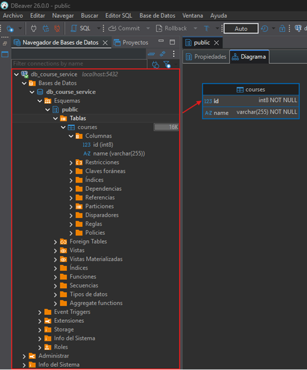

# 📂 Sección 03: Microservicio Cursos

En este módulo daremos vida al segundo componente de nuestra arquitectura. A diferencia del primer servicio, aquí
utilizaremos `PostgreSQL` para diversificar nuestro stack de persistencia, manteniendo el enfoque de configuración
manual.

---

## 🛠️ Creación del microservicio `course-service`

### 🧩 Dependencias

Iniciamos mostrando las dependencias que serán utilizadas en el `course-service`. La única dependencia que agregamos
manualmente fue `MapStruct`, las demás dependencias las agregamos desde
[Spring Initializr (ver dependencias)](https://start.spring.io/#!type=maven-project&language=java&platformVersion=4.0.3&packaging=jar&configurationFileFormat=yaml&jvmVersion=25&groupId=dev.magadiflo&artifactId=course-service&name=course-service&description=Demo%20project%20for%20Spring%20Boot&packageName=dev.magadiflo.course.app&dependencies=actuator,web,validation,data-jpa,lombok,postgresql,cloud-starter).

````xml
<!--Spring Boot 4.0.3-->
<!--Spring Cloud 2025.1.0-->
<!--Java 25-->
<!--org.mapstruct.version 1.6.3-->
<!--lombok-mapstruct-binding.version 0.2.0-->
<dependencies>
    <dependency>
        <groupId>org.springframework.boot</groupId>
        <artifactId>spring-boot-starter-actuator</artifactId>
    </dependency>
    <dependency>
        <groupId>org.springframework.boot</groupId>
        <artifactId>spring-boot-starter-data-jpa</artifactId>
    </dependency>
    <dependency>
        <groupId>org.springframework.boot</groupId>
        <artifactId>spring-boot-starter-validation</artifactId>
    </dependency>
    <dependency>
        <groupId>org.springframework.boot</groupId>
        <artifactId>spring-boot-starter-webmvc</artifactId>
    </dependency>
    <dependency>
        <groupId>org.springframework.cloud</groupId>
        <artifactId>spring-cloud-starter</artifactId>
    </dependency>

    <!--Agregado manualmente-->
    <dependency>
        <groupId>org.mapstruct</groupId>
        <artifactId>mapstruct</artifactId>
        <version>${org.mapstruct.version}</version>
    </dependency>
    <!--/Agregado manualmente-->
    <dependency>
        <groupId>org.postgresql</groupId>
        <artifactId>postgresql</artifactId>
        <scope>runtime</scope>
    </dependency>
    <dependency>
        <groupId>org.projectlombok</groupId>
        <artifactId>lombok</artifactId>
        <optional>true</optional>
    </dependency>
    <dependency>
        <groupId>org.springframework.boot</groupId>
        <artifactId>spring-boot-starter-actuator-test</artifactId>
        <scope>test</scope>
    </dependency>
    <dependency>
        <groupId>org.springframework.boot</groupId>
        <artifactId>spring-boot-starter-data-jpa-test</artifactId>
        <scope>test</scope>
    </dependency>
    <dependency>
        <groupId>org.springframework.boot</groupId>
        <artifactId>spring-boot-starter-validation-test</artifactId>
        <scope>test</scope>
    </dependency>
    <dependency>
        <groupId>org.springframework.boot</groupId>
        <artifactId>spring-boot-starter-webmvc-test</artifactId>
        <scope>test</scope>
    </dependency>
</dependencies>
````

### ⚙️ Procesadores de Anotaciones (Annotation Processors)

Mantenemos la configuración del `maven-compiler-plugin` para asegurar que `Lombok` y `MapStruct` colaboren
correctamente en la generación de código.

````xml

<plugins>
    <!--MapStruct-->
    <plugin>
        <groupId>org.apache.maven.plugins</groupId>
        <artifactId>maven-compiler-plugin</artifactId>
        <version>${maven-compiler-plugin.version}</version>
        <configuration>
            <source>${java.version}</source>
            <target>${java.version}</target>
            <annotationProcessorPaths>
                <path>
                    <groupId>org.projectlombok</groupId>
                    <artifactId>lombok</artifactId>
                    <version>${lombok.version}</version>
                </path>
                <path>
                    <groupId>org.mapstruct</groupId>
                    <artifactId>mapstruct-processor</artifactId>
                    <version>${org.mapstruct.version}</version>
                </path>
                <path>
                    <groupId>org.projectlombok</groupId>
                    <artifactId>lombok-mapstruct-binding</artifactId>
                    <version>${lombok-mapstruct-binding.version}</version>
                </path>
            </annotationProcessorPaths>
        </configuration>
    </plugin>
    <!--/MapStruct-->
</plugins>
````

## 🗄️ Configuración del Contexto de Persistencia `(JPA/Hibernate)`

En esta etapa inicial, configuraremos el microservicio para que se comunique con una base de datos `PostgreSQL`
instalada en nuestra máquina local.

### ⚙️ Archivo: `application.yml` en `course-service`

Hemos definido una configuración explícita, priorizando la visibilidad de las operaciones de base de datos en la
consola para facilitar el aprendizaje.

````yml
server:
  port: 8002
  error:
    include-message: always

spring:
  application:
    name: course-service
  # API Versioning (Spring Boot 4). Ver información en user-service
  mvc:
    api-version:
      required: true
      supported: 1,2
      use:
        path-segment: 1
  datasource:
    url: jdbc:postgresql://localhost:5432/db_course_service
    username: postgres
    password: magadiflo
  jpa:
    hibernate:
      ddl-auto: update
    properties:
      hibernate:
        format_sql: true

logging:
  level:
    dev.magadiflo.course.app: debug
    org.hibernate.SQL: debug
````

💡 Entorno de Base de Datos
> Actualmente, el microservicio `course-service` apunta a `localhost:5432`. Por lo tanto, quiero
> dejar en claro que por el momento trabajaremos con `postgres` instalada en mi `máquina local`. Además,
> tengamos en cuenta que, cuando movamos este servicio a Docker, el `localhost` dejará de funcionar
> (ya que se referirá al contenedor mismo). En ese punto, deberemos cambiar la URL para apuntar al nombre del
> contenedor de `PostgreSQL` o al host de la red de Docker.

## 👤 Modelo de Datos: Entidad `Course`

La entidad `Course` representa la unidad básica de información en este microservicio. Al igual que en el servicio
anterior, utilizamos `JPA` y `Lombok` para maximizar la legibilidad y minimizar el código repetitivo.

### 📄 Clase de Entidad: `Course.java`

De momento nuestra entidad `Course` lucirá únicamente dos campos: `id` y `name`. Más adelante, cuando establezcamos
la comunicación con el microservicio `user-service` nos veremos en la necesidad de agregar nuevos campos, pero eso
lo veremos más adelante.

````java

@ToString
@AllArgsConstructor
@NoArgsConstructor
@Builder
@Setter
@Getter
@Entity
@Table(name = "courses")
public class Course {
    @Id
    @GeneratedValue(strategy = GenerationType.IDENTITY)
    private Long id;

    @Column(nullable = false, unique = true)
    private String name;
}
````

## 🏗️ Construcción de la tabla `courses` a partir de la entidad

Gracias a la propiedad `spring.jpa.hibernate.ddl-auto: update` que configuramos previamente en nuestro
`application.yml`, Spring Boot se encarga de sincronizar nuestro modelo de objetos con el esquema de la base de datos
de forma automática al iniciar la aplicación.

### 🏁 Verificación de la Persistencia

Al ejecutar el microservicio `course-service` por primera vez, Hibernate detecta la ausencia de la tabla `courses` y
ejecuta las sentencias `DDL` necesarias para crearla, respetando las restricciones de integridad
(`NOT NULL`, `UNIQUE`, etc.) que definimos mediante anotaciones en nuestra entidad.



## 🗄️ Implementando el componente repository para el acceso a datos

Para la persistencia del microservicio de cursos, utilizamos Spring Data JPA. Esta interfaz nos proporciona una
abstracción de alto nivel sobre `PostgreSQL`, permitiéndonos realizar operaciones CRUD de forma inmediata.

### 📄 Interfaz: `CourseRepository.java`

````java
public interface CourseRepository extends JpaRepository<Course, Long> {
    // Al extender de JpaRepository, ya contamos con los métodos:
    // save(), findById(), findAll(), deleteById(), etc.
}
````

## 📦 Definiendo DTOs e Interfaz de Mapeo

Implementamos el patrón DTO para desacoplar nuestra API del modelo de persistencia. Gracias a `MapStruct`,
la conversión entre objetos es eficiente y se realiza en tiempo de compilación.

### 📥 Entrada de Datos: `CourseRequest` (Record)

Este DTO captura el nombre del curso enviado por el cliente. Es sencillo pero vital para la integridad de los datos.

````java
public record CourseRequest(@NotBlank
                            String name) {
}
````

### 📤 Salida de Datos: `CourseResponse` (Record)

Define la estructura de respuesta que recibirá el cliente al consultar información de los cursos.

````java
public record CourseResponse(Long id,
                             String name) {
}
````

### 🔄 Mapeo de Objetos con MapStruct

Utilizamos una interfaz dedicada para gestionar las conversiones. Al estar integrada con Spring, podemos inyectarla
donde sea necesario.

````java

@Mapper(componentModel = MappingConstants.ComponentModel.SPRING)
public interface CourseMapper {
    CourseResponse toCourseResponse(Course course);

    Course toCourse(CourseRequest request);

    @Mapping(target = "id", ignore = true)
    Course toUpdateCourse(@MappingTarget Course course, CourseRequest request);
}
````

#### 🔍 Análisis de la Implementación

- 🧩 `Modelado Consistente`: El uso de `MappingConstants.ComponentModel.SPRING` permite que Spring gestione el ciclo de
  vida del mapper, facilitando la inyección de dependencias por constructor en la capa de servicio.
- 🛡️ `Protección del Identificador`: La anotación `@Mapping(target = "id", ignore = true)` es nuestra red de seguridad
  en el método `toUpdateCourse(...)`, asegurando que el ID original de la base de datos permanezca inalterado durante
  las actualizaciones.

## ⚠️ Manejo Global de Excepciones

Para que nuestro microservicio sea profesional, debemos garantizar que el cliente siempre reciba un formato de error
consistente, independientemente del fallo ocurrido.

### 📄 Estandarización de la Respuesta: `ErrorResponse` (Record)

Utilizamos un record para definir un contrato de error único. Aplicamos anotaciones de Jackson para optimizar la salida
JSON y evitar datos innecesarios.

````java

@JsonInclude(JsonInclude.Include.NON_NULL)
public record ErrorResponse(int status,
                            String error,
                            String message,
                            String path,
                            Map<String, List<String>> errors) {
    @JsonProperty
    public LocalDateTime timestamp() {
        return LocalDateTime.now().truncatedTo(ChronoUnit.SECONDS);
    }
}
````

**Dónde**

- 🚫 `@JsonInclude(NON_NULL)`: Indica a Jackson que omita campos nulos. Si un error no tiene un mapa de detalles
  (como un `404`), el campo errors no aparecerá en el JSON final.
- 📅 `@JsonProperty`: Fuerza la inclusión del método `timestamp()` como una propiedad del JSON, permitiendo añadir
  metadatos temporales de forma dinámica.

### 🛡️ Definición de Excepciones Personalizadas

Implementamos una jerarquía de excepciones para gestionar los errores de negocio de forma semántica.

#### 🔍 `NotFoundException` & `CourseNotFoundException`

Base para recursos no encontrados y su implementación específica para cursos, utilizando las bondades de interpolación
de Strings de Java.

````java
public class NotFoundException extends RuntimeException {
    public NotFoundException(String message) {
        super(message);
    }
}
````

Creamos la excepción `CourseNotFoundException` que extenderá de la clase anterior.

````java
public class CourseNotFoundException extends NotFoundException {
    public CourseNotFoundException(Long courseId) {
        super("No se encuentra el curso con id [%d]".formatted(courseId));
    }
}
````

#### 🌍 El Orquestador: `GlobalExceptionHandler`

Utilizamos `@RestControllerAdvice` para capturar las excepciones en cualquier punto de la aplicación y transformarlas
en nuestra `ErrorResponse`.

````java


@Slf4j
@RestControllerAdvice
public class GlobalExceptionHandler {

    @ExceptionHandler(CourseNotFoundException.class)
    public ResponseEntity<ErrorResponse> handleNotFoundException(CourseNotFoundException ex, HttpServletRequest request) {
        log.error("Curso no encontrado: {}", ex.getMessage());
        var errorResponse = this.buildErrorResponse(
                HttpStatus.NOT_FOUND,
                ex.getMessage(),
                request.getRequestURI(),
                null
        );
        return ResponseEntity
                .status(HttpStatus.NOT_FOUND)
                .body(errorResponse);
    }

    @ExceptionHandler(MethodArgumentNotValidException.class)
    public ResponseEntity<ErrorResponse> handleMethodArgumentNotValidException(MethodArgumentNotValidException ex, HttpServletRequest request) {
        log.error("Error en argumentos: {}", ex.getMessage());

        Map<String, List<String>> errors = new HashMap<>();
        ex.getBindingResult().getFieldErrors().forEach(fieldError -> {
            String field = fieldError.getField();
            String defaultMessage = fieldError.getDefaultMessage();
            errors.computeIfAbsent(field, k -> new ArrayList<>()).add(defaultMessage);
        });

        var errorResponse = this.buildErrorResponse(
                HttpStatus.BAD_REQUEST,
                "Falló la validación en los campos",
                request.getRequestURI(),
                errors
        );
        return ResponseEntity
                .status(HttpStatus.BAD_REQUEST)
                .body(errorResponse);
    }

    @ExceptionHandler(Exception.class)
    public ResponseEntity<ErrorResponse> handleGenericException(Exception exception, HttpServletRequest request) {
        log.error("Error genérico: {}", exception.getMessage());
        var errorResponse = this.buildErrorResponse(
                HttpStatus.INTERNAL_SERVER_ERROR,
                exception.getMessage(),
                request.getRequestURI(),
                null
        );
        return ResponseEntity
                .status(HttpStatus.INTERNAL_SERVER_ERROR)
                .body(errorResponse);
    }

    private ErrorResponse buildErrorResponse(HttpStatus httpStatus, String message, String requestURI, Map<String, List<String>> errors) {
        return new ErrorResponse(
                httpStatus.value(),
                httpStatus.getReasonPhrase(),
                message,
                requestURI,
                errors
        );
    }
}
````

## 🧠 Implementando el componente Service

La capa de servicio centraliza la lógica de negocio para la gestión de cursos. Al utilizar la interfaz `CourseService`,
desacoplamos la definición de las operaciones de su implementación concreta.

### 📋 Interfaz de Negocio: `CourseService.java`

````java
public interface CourseService {
    List<CourseResponse> findAllCourses();

    CourseResponse findCourse(Long courseId);

    CourseResponse saveCourse(CourseRequest courseRequest);

    CourseResponse updateCourse(Long courseId, CourseRequest courseRequest);

    void deleteCourse(Long courseId);
}
````

### 🛠️ Implementación del Servicio: `CourseServiceImpl.java`

Aplicamos un enfoque transaccional optimizado, donde las operaciones de lectura son rápidas y las de escritura
garantizan la integridad de los datos en `PostgreSQL`.

````java

@RequiredArgsConstructor
@Service
@Transactional(readOnly = true)
public class CourseServiceImpl implements CourseService {

    private final CourseRepository courseRepository;
    private final CourseMapper courseMapper;

    @Override
    public List<CourseResponse> findAllCourses() {
        return this.courseRepository.findAll()
                .stream()
                .map(this.courseMapper::toCourseResponse)
                .toList();
    }

    @Override
    public CourseResponse findCourse(Long courseId) {
        return this.courseRepository.findById(courseId)
                .map(this.courseMapper::toCourseResponse)
                .orElseThrow(() -> new CourseNotFoundException(courseId));
    }

    @Override
    @Transactional
    public CourseResponse saveCourse(CourseRequest courseRequest) {
        Course savedCourse = this.courseRepository.save(this.courseMapper.toCourse(courseRequest));
        return this.courseMapper.toCourseResponse(savedCourse);
    }

    @Override
    @Transactional
    public CourseResponse updateCourse(Long courseId, CourseRequest courseRequest) {
        return this.courseRepository.findById(courseId)
                .map(foundCourse -> this.courseMapper.toUpdateCourse(foundCourse, courseRequest))
                .map(this.courseRepository::save)
                .map(this.courseMapper::toCourseResponse)
                .orElseThrow(() -> new CourseNotFoundException(courseId));
    }

    @Override
    @Transactional
    public void deleteCourse(Long courseId) {
        Course foundCourse = this.courseRepository.findById(courseId)
                .orElseThrow(() -> new CourseNotFoundException(courseId));
        this.courseRepository.delete(foundCourse);
    }
}
````

#### 🔍 Análisis de la Lógica de Cursos

- 🎯 `Optional Chaining`: El uso de `.map()` encadenado en `updateCourse` permite realizar la búsqueda, el mapeo
  y la persistencia en una sola expresión fluida y segura.
- 🛡️ `Gestión de Transacciones`: La anotación `@Transactional(readOnly = true)` a nivel de clase asegura que las
  consultas a `PostgreSQL` no generen bloqueos innecesarios ni overhead de gestión de estados de Hibernate,
  mientras que los métodos de modificación sobrescriben esta regla para permitir la escritura.

## 🎮 Implementando el controlador RestController y los métodos handler

El controlador actúa como el punto de entrada de nuestro microservicio. Hemos implementado un diseño RESTful completo,
asegurando que las respuestas sigan los estándares HTTP adecuados y el versionado nativo de `Spring Boot 4`.

### 📄 Clase del Controlador: `CourseController.java`

````java

@RequiredArgsConstructor
@RestController
@RequestMapping(path = "/api/{version}/courses", version = "1")
public class CourseController {

    private final CourseService courseService;

    @GetMapping
    public ResponseEntity<List<CourseResponse>> findAllCourses() {
        return ResponseEntity.ok(this.courseService.findAllCourses());
    }

    @GetMapping(path = "/{courseId}")
    public ResponseEntity<CourseResponse> findCourse(@PathVariable Long courseId) {
        return ResponseEntity.ok(this.courseService.findCourse(courseId));
    }

    @PostMapping
    public ResponseEntity<CourseResponse> saveCourse(@Valid @RequestBody CourseRequest request) {
        CourseResponse courseResponse = this.courseService.saveCourse(request);
        URI location = ServletUriComponentsBuilder.fromCurrentRequest()
                .path("/{courseId}")
                .buildAndExpand(courseResponse.id())
                .toUri();
        return ResponseEntity.created(location).body(courseResponse);
    }

    @PutMapping(path = "/{courseId}")
    public ResponseEntity<CourseResponse> updateCourse(@PathVariable Long courseId, @Valid @RequestBody CourseRequest request) {
        return ResponseEntity.ok(this.courseService.updateCourse(courseId, request));
    }

    @DeleteMapping(path = "/{courseId}")
    public ResponseEntity<Void> deleteCourse(@PathVariable Long courseId) {
        this.courseService.deleteCourse(courseId);
        return ResponseEntity.noContent().build();
    }
}
````

#### 🔍 Análisis del Controlador

- 🛠️ `Versionado Nativo`: Al usar `version = "1"` en el `@RequestMapping`, `Spring Boot 4` valida automáticamente que la
  petición coincida con nuestras políticas del `application.yml`.
- 📮 Semántica HTTP:
    - `201 Created`: Devuelto en el registro junto con la cabecera Location.
    - `204 No Content`: Devuelto en la eliminación exitosa.
    - `200 OK`: Devuelto en consultas y actualizaciones.
- 🛡️ `Bean Validation`: La anotación `@Valid` asegura que el `CourseRequest` cumpla con las restricciones (como el
  `@NotBlank` del nombre) antes de entrar a la lógica de negocio.
