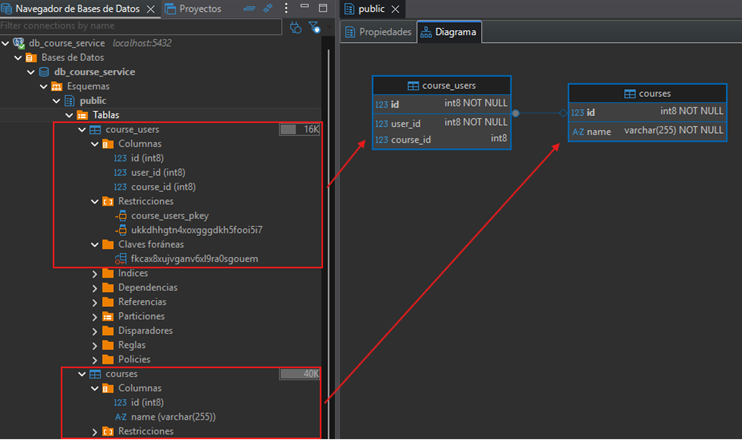

# 📂 Sección 05: RestClient: Comunicación entre microservicios

En esta etapa, daremos el paso fundamental de transformar aplicaciones aisladas en un ecosistema distribuido. Aunque el
estándar tradicional ha sido `Feign`, utilizaremos `RestClient`, la interfaz fluida introducida por `Spring`
a partir de la versión `Spring Boot 3.2` para modernizar la comunicación síncrona entre microservicios.

| Tecnología       | Versión donde aparece `RestClient` |
|------------------|------------------------------------|
| Spring Framework | **6.1**                            |
| Spring Boot      | **3.2**                            |

---

## 🚀 Introducción: Conectando microservicios

En esta sección veremos cómo relacionar nuestros dos microservicios `user-service` y `course-service`. Luego,
agregaremos funcionalidades en ambos microservicios que nos ayudarán a establecer la comunicación.

En la siguiente imagen vemos un panorama general de lo que realizaremos en esta sección:


## 🏗️ Creación de la Entidad JPA: `CourseUser`

Hasta este punto tenemos creado nuestros dos microservicios `course-service` y `user-service`, cada uno manejando su
propia base de datos.


Ahora, imaginemos por un momento que las tablas `courses` y `users` están en una sola base de datos. La relación de
`Uno a Muchos` **(un curso con muchos usuarios, un usuario en un solo curso)** se vería de la siguiente manera:


Ahora volvamos a la realidad, porque estamos trabajando en un entorno de microservicios, donde cada microservicio tiene
su propia base de datos. Eso significa que la integridad referencial física `(Foreign Keys)` desaparece entre bases de
datos distintas.

Para resolver la relación `Uno a Muchos` **(un curso con muchos usuarios, un usuario en un solo curso)**,
implementaremos una `tabla espejo` o de asociación dentro de `course-service`.

### 🧩 Estrategia de Persistencia Distribuida

Como el `course-service` es el que gestiona la existencia de los cursos, es él quien debe llevar el control de qué
alumnos están inscritos. Creamos la tabla `course_users` para actuar como puente:

- `user_id`: No es una FK física, sino una referencia lógica al ID que reside en el microservicio `user-service`.
- `course_id`: Es una FK física real hacia nuestra tabla local `courses`.


### 📄 Clase de Entidad: `CourseUser.java`

Esta entidad representa la inscripción. Es vital la restricción de unicidad en `user_id` para cumplir la regla de
negocio: `"Un alumno solo puede estar en un curso"`.

````java

@ToString
@AllArgsConstructor
@NoArgsConstructor
@Builder
@Setter
@Getter
@Entity
@Table(name = "course_users")
public class CourseUser {
    @Id
    @GeneratedValue(strategy = GenerationType.IDENTITY)
    private Long id;

    @Column(nullable = false, unique = true)
    private Long userId;

    @Override
    public boolean equals(Object o) {
        if (o == null || getClass() != o.getClass()) return false;
        CourseUser that = (CourseUser) o;
        return Objects.equals(getUserId(), that.getUserId());
    }

    @Override
    public int hashCode() {
        return Objects.hashCode(getUserId());
    }
}
````

### ⚖️ La importancia de `equals()` y `hashCode()`

Cuando trabajamos con JPA y colecciones (como un `Set<CourseUser>` dentro de la clase `Course`), Hibernate necesita
saber cuándo un objeto es "el mismo" que otro, especialmente antes de persistir o al eliminar de una lista.

1. `Identidad basada en Negocio`: Hemos decidido que dos `CourseUser` son iguales si su `userId` es el mismo. Esto
   refuerza la regla de que un usuario no puede duplicarse en la tabla.

2. `Contrato de Hash`:
    - Si `equals()` dice que dos objetos son iguales, su `hashCode()` debe ser el mismo.
    - Si dos objetos tienen el mismo valor de `hashCode()`, no necesariamente son iguales según `equals()`.
    - Si no sobrescribimos ambos, colecciones como `HashSet` podrían permitir "duplicados lógicos" porque los objetos
      tendrían diferentes direcciones de memoria, rompiendo nuestra regla de negocio.

## 📄 Asociación Unidireccional OneToMany: `Course` y `CourseUser`

Para materializar la relación en el código, actualizamos la entidad `Course`. Hemos optado por una lista de tipo
`ArrayList` para manejar la colección de usuarios inscritos.

````java

@ToString
@AllArgsConstructor
@NoArgsConstructor
@Builder
@Setter
@Getter
@Entity
@Table(name = "courses")
public class Course {
    @Id
    @GeneratedValue(strategy = GenerationType.IDENTITY)
    private Long id;

    @Column(nullable = false, unique = true)
    private String name;

    @Builder.Default // 💡 Indica a Lombok que use esta inicialización como valor por defecto en el builder
    @JoinColumn(name = "course_id")
    @OneToMany(cascade = CascadeType.ALL, orphanRemoval = true)
    private List<CourseUser> courseUsers = new ArrayList<>();
}
````

#### 🔬 Análisis Técnico de las Anotaciones

1. `@JoinColumn(name = "course_id")`  
   En una relación unidireccional `@OneToMany`, esta anotación es fundamental para evitar la creación de una
   `tabla intermedia` innecesaria.
    - `name = "course_id"`: Define el nombre de la columna física que se creará en la tabla hija `(course_users)`.
      Esta columna actuará como la `Foreign Key (FK)` que apunta hacia la tabla de cursos.
    - `Funcionamiento`: Le indica a JPA que la relación se gestiona mediante una columna en la tabla del lado `Muchos`,
      permitiendo que el modelo de base de datos sea limpio y eficiente.


2. `@OneToMany(cascade = CascadeType.ALL, orphanRemoval = true)`  
   Esta anotación define cómo se comportan los elementos de la lista cuando la entidad padre `(Course)` sufre cambios.
    - `cascade = CascadeType.ALL`: Propaga todas las operaciones de persistencia. Si guardas, actualizas o eliminas
      un `Course`, automáticamente se guardarán, actualizarán o eliminarán sus `CourseUser` asociados.
    - `orphanRemoval = true`: Es el "recolector de basura" de la relación. Si eliminas un objeto `CourseUser` de la
      lista `courseUsers`, JPA detectará que ese registro ha quedado "huérfano" y lo eliminará físicamente de la base
      de datos de forma automática.

### 🏁 Ejecución y Verificación en PostgreSQL

Al iniciar el microservicio` course-service`, Hibernate procesa las nuevas definiciones de las entidades `Course` y
`CourseUser`. Gracias a la configuración de las anotaciones JPA, el motor genera automáticamente el esquema relacional
optimizado.



#### 📝 Observaciones tras la creación:

- Tabla `course_users`: Se ha creado con éxito, incluyendo la restricción `UNIQUE` sobre la columna `user_id`.
- `Integridad Referencial`: La columna `course_id` se ha establecido correctamente como `Foreign Key (FK)`,
  vinculando cada registro de inscripción con su curso correspondiente.
- `Sincronización`: Al usar `ddl-auto: update`, Hibernate ha mantenido los datos existentes en la tabla `courses` y
  simplemente ha extendido el esquema para soportar la nueva relación.

## Crea repositorio para `CourseUser`

Recordemos que en este microservicio `course-service` hemos creado la entidad `CourseUser` que nos está permitiendo
manejar la relación con los usuarios. Más adelante, veremos que es necesario tener un repositorio que nos permita
interactuar con esta entidad. Por ejemplo, necesitaremos crear el siguiente método `deleteByUserId(Long userId)` para
poder eliminar la relación del usuario con el curso.

````java
public interface CourseUserRepository extends JpaRepository<CourseUser, Long> {
    /**
     * 🗑️ Elimina la asociación de un usuario con cualquier curso.
     * Útil cuando un usuario es dado de baja en el user-service y 
     * debemos limpiar su rastro en el sistema de inscripciones.
     */
    void deleteByUserId(Long userId);
}
````

## 🛰️ Configuración del Cliente HTTP: `RestClient` en `course-service`

Para que el `course-service` pueda comunicarse con el `user-service`, necesitamos un cliente HTTP robusto.
Hemos optado por `RestClient`, introducido en `Spring Boot 3.2`, que ofrece una API fluida y moderna. Sin embargo,
existen otros clientes http que podríamos haber utilizado como: `WebClient`, `Feign Client` o `RestTemplate`.

### ⚙️ Clase de Configuración: `RestClientConfig.java`

Centralizamos la creación del cliente en un Bean para que pueda ser inyectado y reutilizado en toda la aplicación,
manteniendo la URL base parametrizada para facilitar el despliegue en diferentes entornos (`Docker`, `Kubernetes`,
`Cloud`).

````java

@Configuration
public class RestClientConfig {

    @Value("${custom.user-service.base-url}")
    private String userServiceBaseUrl;

    @Bean
    public RestClient userServiceRestClient() {
        return RestClient.builder()
                .baseUrl(this.userServiceBaseUrl)
                .build();
    }
}
````

### 📄 Parametrización: `application.yml`

Definimos la propiedad personalizada para evitar tener `Hardcoded Values` en nuestro código Java.

````yml
custom:
  user-service:
    base-url: http://localhost:8001/api/v1/users
````

### 🔍 Análisis de la Implementación

- `Inyección Dinámica`: El uso de `@Value` permite que, al pasar a producción o contenedores, podamos cambiar la URL (
  por ejemplo, a `http://user-service:8001/...`) simplemente modificando una variable de entorno, sin tocar el código.
- `Builder Pattern`: `RestClient.builder()` nos permite, en el futuro, agregar interceptores (para logs o seguridad),
  configuraciones de timeout o headers por defecto de manera centralizada.
- `Preparado para Java 25`: Al ser un cliente síncrono bloqueante, se beneficia directamente de los `Virtual Threads` (
  Project Loom), permitiendo manejar miles de peticiones simultáneas con una latencia mínima y sin la complejidad de la
  programación reactiva.

## ⚠️ Gestión de Excepciones para Comunicación Remota

En sistemas distribuidos, las fallas son inevitables. Estas excepciones personalizadas nos permiten capturar y
tipificar los errores que ocurren durante las llamadas vía `RestClient`, facilitando la depuración y permitiendo
que nuestro `GlobalExceptionHandler` devuelva respuestas precisas al cliente final.

### 🔍 RemoteUserNotFoundException

Esta excepción se dispara específicamente cuando el microservicio de usuarios responde con un código `404 Not Found`.

````java
/**
 * Excepción lanzada cuando un ID de usuario es válido sintácticamente
 * pero no existe en la base de datos maestra del user-service.
 */
public class RemoteUserNotFoundException extends RuntimeException {
    public RemoteUserNotFoundException(Long userId) {
        super("El usuario con id [%d] no fue encontrado en el [user-service]".formatted(userId));
    }
}
````

### 🔌 CommunicationException

Esta es una excepción de propósito más general, diseñada para envolver cualquier error técnico o de lógica de negocio
que el servicio remoto devuelva (códigos `4xx` o `5xx`) y que no sea un simple "No encontrado".

````java
/**
 * Excepción lanzada cuando ocurre un fallo técnico, de red, o una
 * validación fallida en el microservicio remoto.
 */
public class CommunicationException extends RuntimeException {
    public CommunicationException(String message) {
        super("Se produjo un error en el [user-service]: %s".formatted(message));
    }
}
````

## 🛰️ Implementación del Cliente: UserServiceClient

El `UserServiceClient` encapsula la complejidad técnica del `RestClient`. Al centralizar aquí las llamadas hacia el
`user-service`, garantizamos que cualquier cambio en la API externa solo impacte en este componente y no en toda
nuestra lógica de negocio.

### 📄 Clase Técnica: `UserServiceClient.java`

````java

@Slf4j
@RequiredArgsConstructor
@Component
public class UserServiceClient {

    private final RestClient restClient;

    /**
     * 🔍 Recupera un usuario específico del microservicio remoto.
     * Utiliza .exchange() para un control granular sobre los códigos de estado HTTP.
     */
    public UserResponse getUserFromUserService(Long userId) {
        log.info("Consultando el servicio [user-service] por el usuario con id: {}", userId);

        UserResponse userResponse = this.restClient
                .get()
                .uri("/{userId}", userId)
                .exchange((clientRequest, clientResponse) -> {
                    HttpStatusCode statusCode = clientResponse.getStatusCode();
                    if (statusCode == HttpStatus.OK) {
                        return clientResponse.bodyTo(UserResponse.class);
                    }

                    if (statusCode == HttpStatus.NOT_FOUND) {
                        throw new RemoteUserNotFoundException(userId);
                    }

                    // Captura de errores estructurados provenientes del GlobalExceptionHandler remoto
                    ErrorResponse errorResponse = clientResponse.bodyTo(ErrorResponse.class);
                    String message = Optional.ofNullable(errorResponse)
                            .map(ErrorResponse::error)
                            .orElseGet(() -> "Error desconocido al consultar el user-service");

                    log.info("Mensaje de error desde el user-service: {}", message);
                    throw new CommunicationException(message);
                });

        log.info("El servicio [user-service] encontró al usuario buscado: {}", userResponse);
        return userResponse;
    }

    /**
     * 🆕 Registra un nuevo usuario delegando la persistencia al user-service.
     */
    public UserResponse createUserInUserService(UserRequest userRequest) {
        log.info("Usuario a registrar en el [user-service]: {}", userRequest);

        UserResponse userResponse = this.restClient
                .post()
                .body(userRequest)
                .retrieve()
                .body(UserResponse.class);

        log.info("Usuario registrado con éxito en el [user-service]: {}", userResponse);
        return userResponse;
    }
}
````

### 🛠️ Análisis de Capacidades Avanzadas

#### 1. Control mediante `.exchange()` vs `.retrieve()`

En esta implementación hemos utilizado dos enfoques distintos según la necesidad:

- `.exchange()`: Lo usamos en la búsqueda por ID porque necesitamos inspeccionar el clientResponse manualmente. Esto nos
  permite interceptar el `404 Not Found` del servicio remoto y lanzarlo como una excepción propia
  `(RemoteUserNotFoundException)`, evitando que el sistema falle con un error genérico.
- `.retrieve()`: Utilizado en el método `POST`. Es una alternativa más concisa y simplificada para cuando solo esperamos
  el cuerpo de la respuesta o queremos manejar errores de forma declarativa con `.onStatus()`.

#### 2. Mapeo de Errores Distribuidos

Una ventaja crítica de este diseño es que el `UserServiceClient` es capaz de entender el `ErrorResponse` que
configuramos en la `Sección 04`. Si el `user-service` lanza una validación fallida o un error interno, este cliente
deserializa el JSON de error, extrae el mensaje y lo propaga mediante una `CommunicationException`, manteniendo la
trazabilidad del fallo a través de los logs.

#### 3. Trazabilidad con Slf4j

Cada petición genera logs informativos `(log.info)` y de error `(log.error)`. Esto es vital en arquitecturas de
microservicios para identificar rápidamente en qué punto de la cadena de llamadas se produjo una latencia o una
interrupción.

## 📦 Definición de DTOs para la Comunicación Inter-Servicios

Para que el `course-service` pueda interpretar la información que viaja desde el `user-service`, necesitamos definir
estructuras de datos `(Records)` que actúen como espejos de la API remota.

### 👥 DTOs de Usuario (Espejos de `user-service`)

Estos records permiten capturar la información del usuario obtenida mediante `RestClient`.

````java
// Respuesta que viene del User-Service
public record UserResponse(Long id,
                           String name,
                           String email,
                           String password) {
}
````

````java
// Petición que va hacia el User-Service
public record UserRequest(@NotBlank
                          String name,
                          @NotBlank
                          @Email
                          String email,
                          @NotBlank
                          String password) {
}
````

### ⚖️ El Dilema de la Validación: ¿Validar en uno o en ambos?

Al agregar anotaciones como `@NotBlank` o `@Email` en el dto `UserRequest` del `course-service`, estamos aplicando una
estrategia de validación temprana.

#### Escenario A: Validación en Ambos (Elegida)

- `Ventaja`: Ahorro de recursos. No se realiza una llamada HTTP costosa si sabemos de antemano que los datos están mal
  formados.
- `Desventaja`: Duplicidad de código. Si la regla de negocio cambia (ej. el password ahora debe tener 10 caracteres),
  hay que actualizar ambos microservicios.

#### Escenario B: Validación Única en el Origen (user-service)

- `Ventaja`: Centralización total. El `user-service` es el único dueño de la verdad sobre qué es un "usuario válido".
- `Desventaja`: El `course-service` gastará ancho de banda y tiempo de procesamiento enviando peticiones destinadas al
  fracaso.

### 🎓 Evolución del DTO de Respuesta: `CourseResponse`

Actualizamos el record `CourseResponse` (creado originalmente en la `Sección 03`) para incluir la `lista de usuarios`.
Utilizamos `@JsonInclude` para mantener la respuesta limpia cuando el curso no tenga inscritos.

````java
public record CourseResponse(Long id,
                             String name,
                             @JsonInclude(JsonInclude.Include.NON_NULL)
                             List<UserResponse> users) {
}
````
