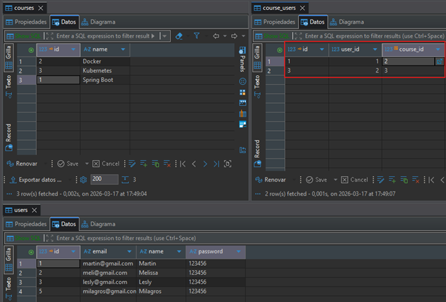

# 📂 Sección 05: RestClient: Comunicación entre microservicios

En esta etapa, daremos el paso fundamental de transformar aplicaciones aisladas en un ecosistema distribuido. Aunque el
estándar tradicional ha sido `Feign`, utilizaremos `RestClient`, la interfaz fluida introducida por `Spring`
a partir de la versión `Spring Boot 3.2` para modernizar la comunicación síncrona entre microservicios.

| Tecnología       | Versión donde aparece `RestClient` |
|------------------|------------------------------------|
| Spring Framework | **6.1**                            |
| Spring Boot      | **3.2**                            |

---

## 🚀 Introducción: Conectando microservicios

En esta sección veremos cómo relacionar nuestros dos microservicios `user-service` y `course-service`. Luego,
agregaremos funcionalidades en ambos microservicios que nos ayudarán a establecer la comunicación.

En la siguiente imagen vemos un panorama general de lo que realizaremos en esta sección:


## 🏗️ Creación de la Entidad JPA: `CourseUser`

Hasta este punto tenemos creado nuestros dos microservicios `course-service` y `user-service`, cada uno manejando su
propia base de datos.


Ahora, imaginemos por un momento que las tablas `courses` y `users` están en una sola base de datos. La relación de
`Uno a Muchos` **(un curso con muchos usuarios, un usuario en un solo curso)** se vería de la siguiente manera:


Ahora volvamos a la realidad, porque estamos trabajando en un entorno de microservicios, donde cada microservicio tiene
su propia base de datos. Eso significa que la integridad referencial física `(Foreign Keys)` desaparece entre bases de
datos distintas.

Para resolver la relación `Uno a Muchos` **(un curso con muchos usuarios, un usuario en un solo curso)**,
implementaremos una `tabla espejo` o de asociación dentro de `course-service`.

### 🧩 Estrategia de Persistencia Distribuida

Como el `course-service` es el que gestiona la existencia de los cursos, es él quien debe llevar el control de qué
alumnos están inscritos. Creamos la tabla `course_users` para actuar como puente:

- `user_id`: No es una FK física, sino una referencia lógica al ID que reside en el microservicio `user-service`.
- `course_id`: Es una FK física real hacia nuestra tabla local `courses`.


### 📄 Clase de Entidad: `CourseUser.java`

Esta entidad representa la inscripción. Es vital la restricción de unicidad en `user_id` para cumplir la regla de
negocio: `"Un alumno solo puede estar en un curso"`.

````java

@ToString
@AllArgsConstructor
@NoArgsConstructor
@Builder
@Setter
@Getter
@Entity
@Table(name = "course_users")
public class CourseUser {
    @Id
    @GeneratedValue(strategy = GenerationType.IDENTITY)
    private Long id;

    @Column(nullable = false, unique = true)
    private Long userId;

    @Override
    public boolean equals(Object o) {
        if (o == null || getClass() != o.getClass()) return false;
        CourseUser that = (CourseUser) o;
        return Objects.equals(getUserId(), that.getUserId());
    }

    @Override
    public int hashCode() {
        return Objects.hashCode(getUserId());
    }
}
````

### ⚖️ La importancia de `equals()` y `hashCode()`

Cuando trabajamos con JPA y colecciones (como un `Set<CourseUser>` dentro de la clase `Course`), Hibernate necesita
saber cuándo un objeto es "el mismo" que otro, especialmente antes de persistir o al eliminar de una lista.

1. `Identidad basada en Negocio`: Hemos decidido que dos `CourseUser` son iguales si su `userId` es el mismo. Esto
   refuerza la regla de que un usuario no puede duplicarse en la tabla.

2. `Contrato de Hash`:
    - Si `equals()` dice que dos objetos son iguales, su `hashCode()` debe ser el mismo.
    - Si dos objetos tienen el mismo valor de `hashCode()`, no necesariamente son iguales según `equals()`.
    - Si no sobrescribimos ambos, colecciones como `HashSet` podrían permitir "duplicados lógicos" porque los objetos
      tendrían diferentes direcciones de memoria, rompiendo nuestra regla de negocio.

## 📄 Asociación Unidireccional OneToMany: `Course` y `CourseUser`

Para materializar la relación en el código, actualizamos la entidad `Course`. Hemos optado por una lista de tipo
`ArrayList` para manejar la colección de usuarios inscritos.

````java

@ToString
@AllArgsConstructor
@NoArgsConstructor
@Builder
@Setter
@Getter
@Entity
@Table(name = "courses")
public class Course {
    @Id
    @GeneratedValue(strategy = GenerationType.IDENTITY)
    private Long id;

    @Column(nullable = false, unique = true)
    private String name;

    @Builder.Default // 💡 Indica a Lombok que use esta inicialización como valor por defecto en el builder
    @JoinColumn(name = "course_id")
    @OneToMany(cascade = CascadeType.ALL, orphanRemoval = true)
    private List<CourseUser> courseUsers = new ArrayList<>();
}
````

#### 🔬 Análisis Técnico de las Anotaciones

1. `@JoinColumn(name = "course_id")`  
   En una relación unidireccional `@OneToMany`, esta anotación es fundamental para evitar la creación de una
   `tabla intermedia` innecesaria.
    - `name = "course_id"`: Define el nombre de la columna física que se creará en la tabla hija `(course_users)`.
      Esta columna actuará como la `Foreign Key (FK)` que apunta hacia la tabla de cursos.
    - `Funcionamiento`: Le indica a JPA que la relación se gestiona mediante una columna en la tabla del lado `Muchos`,
      permitiendo que el modelo de base de datos sea limpio y eficiente.


2. `@OneToMany(cascade = CascadeType.ALL, orphanRemoval = true)`  
   Esta anotación define cómo se comportan los elementos de la lista cuando la entidad padre `(Course)` sufre cambios.
    - `cascade = CascadeType.ALL`: Propaga todas las operaciones de persistencia. Si guardas, actualizas o eliminas
      un `Course`, automáticamente se guardarán, actualizarán o eliminarán sus `CourseUser` asociados.
    - `orphanRemoval = true`: Es el "recolector de basura" de la relación. Si eliminas un objeto `CourseUser` de la
      lista `courseUsers`, JPA detectará que ese registro ha quedado "huérfano" y lo eliminará físicamente de la base
      de datos de forma automática.

### 🏁 Ejecución y Verificación en PostgreSQL

Al iniciar el microservicio` course-service`, Hibernate procesa las nuevas definiciones de las entidades `Course` y
`CourseUser`. Gracias a la configuración de las anotaciones JPA, el motor genera automáticamente el esquema relacional
optimizado.


#### 📝 Observaciones tras la creación:

- Tabla `course_users`: Se ha creado con éxito, incluyendo la restricción `UNIQUE` sobre la columna `user_id`.
- `Integridad Referencial`: La columna `course_id` se ha establecido correctamente como `Foreign Key (FK)`,
  vinculando cada registro de inscripción con su curso correspondiente.
- `Sincronización`: Al usar `ddl-auto: update`, Hibernate ha mantenido los datos existentes en la tabla `courses` y
  simplemente ha extendido el esquema para soportar la nueva relación.

## Crea repositorio para `CourseUser`

Recordemos que en este microservicio `course-service` hemos creado la entidad `CourseUser` que nos está permitiendo
manejar la relación con los usuarios. Más adelante, veremos que es necesario tener un repositorio que nos permita
interactuar con esta entidad. Por ejemplo, necesitaremos crear el siguiente método `deleteByUserId(Long userId)` para
poder eliminar la relación del usuario con el curso.

````java
public interface CourseUserRepository extends JpaRepository<CourseUser, Long> {
    /**
     * 🗑️ Elimina la asociación de un usuario con cualquier curso.
     * Útil cuando un usuario es dado de baja en el user-service y 
     * debemos limpiar su rastro en el sistema de inscripciones.
     */
    void deleteByUserId(Long userId);
}
````

## 🛰️ Configuración del Cliente HTTP: `RestClient` en `course-service`

Para que el `course-service` pueda comunicarse con el `user-service`, necesitamos un cliente HTTP robusto.
Hemos optado por `RestClient`, introducido en `Spring Boot 3.2`, que ofrece una API fluida y moderna. Sin embargo,
existen otros clientes http que podríamos haber utilizado como: `WebClient`, `Feign Client` o `RestTemplate`.

### ⚙️ Clase de Configuración: `RestClientConfig.java`

Centralizamos la creación del cliente en un Bean para que pueda ser inyectado y reutilizado en toda la aplicación,
manteniendo la URL base parametrizada para facilitar el despliegue en diferentes entornos (`Docker`, `Kubernetes`,
`Cloud`).

````java

@Configuration
public class RestClientConfig {

    @Value("${custom.user-service.base-url}")
    private String userServiceBaseUrl;

    @Bean
    public RestClient userServiceRestClient() {
        return RestClient.builder()
                .baseUrl(this.userServiceBaseUrl)
                .build();
    }
}
````

### 📄 Parametrización: `application.yml`

Definimos la propiedad personalizada para evitar tener `Hardcoded Values` en nuestro código Java.

````yml
custom:
  user-service:
    base-url: http://localhost:8001/api/v1/users
````

### 🔍 Análisis de la Implementación

- `Inyección Dinámica`: El uso de `@Value` permite que, al pasar a producción o contenedores, podamos cambiar la URL (
  por ejemplo, a `http://user-service:8001/...`) simplemente modificando una variable de entorno, sin tocar el código.
- `Builder Pattern`: `RestClient.builder()` nos permite, en el futuro, agregar interceptores (para logs o seguridad),
  configuraciones de timeout o headers por defecto de manera centralizada.
- `Preparado para Java 25`: Al ser un cliente síncrono bloqueante, se beneficia directamente de los `Virtual Threads` (
  Project Loom), permitiendo manejar miles de peticiones simultáneas con una latencia mínima y sin la complejidad de la
  programación reactiva.

## ⚠️ Gestión de Excepciones para Comunicación Remota

En sistemas distribuidos, las fallas son inevitables. Estas excepciones personalizadas nos permiten capturar y
tipificar los errores que ocurren durante las llamadas vía `RestClient`, facilitando la depuración y permitiendo
que nuestro `GlobalExceptionHandler` devuelva respuestas precisas al cliente final.

### 🔍 RemoteUserNotFoundException

Esta excepción se dispara específicamente cuando el microservicio de usuarios responde con un código `404 Not Found`.

````java
/**
 * Excepción lanzada cuando un ID de usuario es válido sintácticamente
 * pero no existe en la base de datos maestra del user-service.
 */
public class RemoteUserNotFoundException extends RuntimeException {
    public RemoteUserNotFoundException(Long userId) {
        super("El usuario con id [%d] no fue encontrado en el [user-service]".formatted(userId));
    }
}
````

## 🛰️ Implementación del Cliente: UserServiceClient

El `UserServiceClient` encapsula la complejidad técnica del `RestClient`. Al centralizar aquí las llamadas hacia el
`user-service`, garantizamos que cualquier cambio en la API externa solo impacte en este componente y no en toda
nuestra lógica de negocio.

### 📄 Clase Técnica: `UserServiceClient.java`

````java

@Slf4j
@RequiredArgsConstructor
@Component
public class UserServiceClient {

    private final RestClient restClient;

    /**
     * Recupera un usuario del microservicio remoto.
     * <p>
     * Se utiliza .exchange() para interceptar el flujo de respuesta y realizar un
     * mapeo de excepciones basado en el código de estado HTTP (HttpStatusCode).
     *
     * @param userId Identificador único del usuario en el servicio central (user-service).
     * @return UserResponse DTO con la información del usuario.
     * @throws RemoteUserNotFoundException Si el servicio remoto devuelve un 404.
     * @throws RestClientResponseException Generada por {@code clientResponse.createException()}
     *                                     para cualquier otro error 4xx o 5xx proveniente del servidor.
     */
    public UserResponse getUserFromUserService(Long userId) {
        log.info("Consultando el servicio [user-service] por el usuario con id: {}", userId);

        UserResponse userResponse = this.restClient
                .get()
                .uri("/{userId}", userId)
                .exchange((clientRequest, clientResponse) -> {
                    HttpStatusCode statusCode = clientResponse.getStatusCode();

                    // 1. Éxito (2xx): Deserialización directa del cuerpo de la respuesta.
                    if (statusCode.is2xxSuccessful()) {
                        return clientResponse.bodyTo(UserResponse.class);
                    }

                    // 2. Negocio (404): El usuario no existe en el sistema maestro.
                    // Lanzamos una excepción personalizada para un manejo semántico en el CourseService.
                    if (statusCode == HttpStatus.NOT_FOUND) {
                        log.warn("El usuario con id [{}] no existe en el servicio remoto", userId);
                        throw new RemoteUserNotFoundException(userId);
                    }

                    log.error("Error no controlado. Status: {}", statusCode);
                    // 3. Infraestructura (Otros 4xx, 5xx): Delegación al framework.
                    // clientResponse.createException() genera una excepción que encapsula el body,
                    // los headers y el status real, permitiendo que el GlobalExceptionHandler
                    // la capture como una RestClientResponseException.
                    throw clientResponse.createException();
                });

        log.info("El servicio [user-service] encontró al usuario buscado: {}", userResponse);
        return userResponse;
    }

    /**
     * 🆕 Registra un nuevo usuario delegando la persistencia al user-service.
     */
    public UserResponse createUserInUserService(UserRequest userRequest) {
        log.info("Usuario a registrar en el [user-service]: {}", userRequest);

        UserResponse userResponse = this.restClient
                .post()
                .body(userRequest)
                .retrieve()
                .body(UserResponse.class);

        log.info("Usuario registrado con éxito en el [user-service]: {}", userResponse);
        return userResponse;
    }
}
````

### 🛠️ Análisis de Capacidades Avanzadas

#### 1. Control mediante `.exchange()` vs `.retrieve()`

En esta implementación hemos utilizado dos enfoques distintos según la necesidad:

- `.exchange()`: Lo usamos en la búsqueda por ID porque necesitamos inspeccionar el clientResponse manualmente. Esto nos
  permite interceptar el `404 Not Found` del servicio remoto y lanzarlo como una excepción propia
  `(RemoteUserNotFoundException)`, evitando que el sistema falle con un error genérico.
- `.retrieve()`: Utilizado en el método `POST`. Es una alternativa más concisa y simplificada para cuando solo esperamos
  el cuerpo de la respuesta o queremos manejar errores de forma declarativa con `.onStatus()`.

#### 2. Trazabilidad con Slf4j

Cada petición genera logs informativos `(log.info)` y de error `(log.error)`. Esto es vital en arquitecturas de
microservicios para identificar rápidamente en qué punto de la cadena de llamadas se produjo una latencia o una
interrupción.

## 📦 Definición de DTOs para la Comunicación Inter-Servicios

Para que el `course-service` pueda interpretar la información que viaja desde el `user-service`, necesitamos definir
estructuras de datos `(Records)` que actúen como espejos de la API remota.

### 👥 DTOs de Usuario (Espejos de `user-service`)

Estos records permiten capturar la información del usuario obtenida mediante `RestClient`.

````java
// Respuesta que viene del User-Service
public record UserResponse(Long id,
                           String name,
                           String email,
                           String password) {
}
````

````java
// Petición que va hacia el User-Service
public record UserRequest(@NotBlank
                          String name,
                          @NotBlank
                          @Email
                          String email,
                          @NotBlank
                          String password) {
}
````

### ⚖️ El Dilema de la Validación: ¿Validar en uno o en ambos?

Al agregar anotaciones como `@NotBlank` o `@Email` en el dto `UserRequest` del `course-service`, estamos aplicando una
estrategia de validación temprana.

#### Escenario A: Validación en Ambos (Elegida)

- `Ventaja`: Ahorro de recursos. No se realiza una llamada HTTP costosa si sabemos de antemano que los datos están mal
  formados.
- `Desventaja`: Duplicidad de código. Si la regla de negocio cambia (ej. el password ahora debe tener 10 caracteres),
  hay que actualizar ambos microservicios.

#### Escenario B: Validación Única en el Origen (user-service)

- `Ventaja`: Centralización total. El `user-service` es el único dueño de la verdad sobre qué es un "usuario válido".
- `Desventaja`: El `course-service` gastará ancho de banda y tiempo de procesamiento enviando peticiones destinadas al
  fracaso.

### 🎓 Evolución del DTO de Respuesta: `CourseResponse`

Actualizamos el record `CourseResponse` (creado originalmente en la `Sección 03`) para incluir la `lista de usuarios`.
Utilizamos `@JsonInclude` para mantener la respuesta limpia cuando el curso no tenga inscritos.

````java
public record CourseResponse(Long id,
                             String name,
                             @JsonInclude(JsonInclude.Include.NON_NULL)
                             List<UserResponse> users) {
}
````

## 🔄 Transformación de Datos: `CourseUserMapper`

En el microservicio `course-service`, la entidad `CourseUser` actúa como un puente lógico. Sin embargo,
cuando consultamos al `user-service`, recibimos un objeto `UserResponse`. El desafío reside en que el ID que para el
servicio de usuarios es su clave primaria, para nuestro servicio de cursos representa simplemente un atributo de
referencia llamado `userId`.

### 📄 Interfaz del Mapper: `CourseUserMapper.java`

Utilizamos las capacidades de generación de código de `MapStruct` para definir las reglas de conversión entre el DTO
remoto y nuestra entidad local.

````java

@Mapper(componentModel = MappingConstants.ComponentModel.SPRING)
public interface CourseUserMapper {

    /**
     * Convierte la respuesta del servicio externo en una entidad local.
     *
     * @param userResponse DTO proveniente del user-service (puerto 8001).
     * @return Entidad CourseUser lista para ser asociada a un curso en PostgreSQL (puerto 8002).
     */
    @Mapping(target = "id", ignore = true)
    @Mapping(target = "userId", source = "id")
    CourseUser toCourseUser(UserResponse userResponse);

}
````

### 🔬 Análisis de las Reglas de Mapeo

La configuración de `@Mapping` en este componente es vital para evitar colisiones de identificadores y asegurar que la
lógica de negocio se mantenga coherente:

#### 1. 🎯 El origen: `source = "id"`

En el `UserResponse`, el campo `id` representa la identidad única del usuario en el sistema global. Al mapearlo hacia
el campo `userId` de nuestra entidad, estamos estableciendo correctamente la referencia lógica que explicamos
en el diagrama ER.

#### 2. 🛡️ El destino: `target = "id", ignore = true`

Este es un punto crítico. La entidad `CourseUser` tiene su propio id (Clave Primaria autoincremental en PostgreSQL).

- `Por qué ignorarlo`: Si no lo ignoramos, `MapStruct` intentará asignar el ID del usuario al ID de la tabla de
  asociación.
- `Resultado esperado`: Queremos que la base de datos local genere su propia secuencia (1, 2, 3...) para la tabla
  `course_users`, manteniendo el ID del usuario externo resguardado en la columna `user_id`.

#### 3. 🏗️ Component Model: `SPRING`

Al definir `MappingConstants.ComponentModel.SPRING`, `MapStruct` genera una implementación de la interfaz decorada con
`@Component`. Esto nos permite inyectar el mapper mediante `@Autowired` o `constructor` en nuestros servicios,
manteniendo el estándar de Inyección de Dependencias de Spring Boot 4.

## 🛡️ Gestión Global de Errores Distribuidos

Al introducir `RestClient`, nuestro sistema ahora está expuesto a fallos de red, tiempos de espera (timeouts) y errores
lógicos del microservicio remoto. Mediante `@RestControllerAdvice`, interceptamos estas situaciones para transformar
excepciones técnicas complejas en respuestas HTTP semánticas y legibles.

### 📄 Implementación: `GlobalExceptionHandler.java`

Hemos extendido nuestro manejador para cubrir escenarios críticos de la comunicación inter-servicios:

````java

@Slf4j
@RestControllerAdvice
public class GlobalExceptionHandler {

    /* other code */

    /**
     * Manejo de usuario inexistente en el servicio remoto.
     * Se dispara cuando el user-service devuelve un 404 explícito.
     */
    @ExceptionHandler(RemoteUserNotFoundException.class)
    public ResponseEntity<ErrorResponse> handleRemoteUserNotFoundException(RemoteUserNotFoundException ex, HttpServletRequest request) {
        log.error("Usuario no encontrado en el [user-service]: {}", ex.getMessage());
        var errorResponse = this.buildErrorResponse(
                HttpStatus.NOT_FOUND,
                ex.getMessage(),
                request.getRequestURI(),
                null
        );
        return ResponseEntity
                .status(HttpStatus.NOT_FOUND)
                .body(errorResponse);
    }

    /**
     * Manejo de respuestas HTTP de error (4xx y 5xx) del RestClient.
     * Mapeado como BAD_GATEWAY para indicar que un servidor intermedio falló.
     */
    @ExceptionHandler(value = {
            HttpClientErrorException.class, // (errores HTTP 4xx)
            HttpServerErrorException.class  // (errores HTTP 5xx)
    })
    public ResponseEntity<ErrorResponse> handleRestClientResponseException(RestClientResponseException ex, HttpServletRequest request) {
        log.warn("Error del servicio remoto [user-service] - status: {} - body: {}", ex.getStatusCode(), ex.getResponseBodyAsString());
        var errorResponse = this.buildErrorResponse(
                HttpStatus.BAD_GATEWAY,
                ex.getMessage(),
                request.getRequestURI(),
                null
        );
        return ResponseEntity
                .status(HttpStatus.BAD_GATEWAY)
                .body(errorResponse);
    }

    /**
     * Manejo de fallos críticos de conectividad.
     * Captura caídas del servicio, timeouts o errores de resolución de DNS.
     */
    @ExceptionHandler(RestClientException.class)
    public ResponseEntity<ErrorResponse> handleRestClientException(RestClientException ex, HttpServletRequest request) {
        log.error("Fallo de red o fallo del tiempo de espera al comunicarse con el servicio remoto [user-service]", ex);
        var errorResponse = this.buildErrorResponse(
                HttpStatus.SERVICE_UNAVAILABLE,
                "No se pudo comunicar con el servicio remoto. " + ex.getMessage(),
                request.getRequestURI(),
                null
        );
        return ResponseEntity
                .status(HttpStatus.SERVICE_UNAVAILABLE)
                .body(errorResponse);
    }

    /* other code */
}
````

### 🔬 Análisis de la Estrategia de Respuesta

El `RemoteUserNotFoundException` es una excepción que he diseñado para capturar la semántica del negocio. Nosotros
decidimos cuándo lanzarla basándonos en la lógica de nuestro `UserServiceClient`. Es "manual" porque tenemos el
control total sobre su origen y su mensaje.

Ahora, analicemos las otras dos, que son las que suelen generar más dudas porque son `excepciones de infraestructura`
lanzadas automáticamente por el framework Spring:

#### 1. `RestClientResponseException` (El "error del otro")

Esta excepción se dispara cuando el `user-service` sí responde, pero responde con un código de error `(4xx o 5xx)`.

- `¿Por qué capturarla?`: Porque aunque el servidor remoto respondió, algo salió mal allá. Por ejemplo, si el
  `user-service` devuelve un `400 Bad Request` por un error que tú no validaste previamente, o un
  `500 Internal Server Error` porque su base de datos se cayó.
- `En tu código`: Aquí es donde capturas `HttpClientErrorException` `(errores 4xx)` y `HttpServerErrorException`
  `(errores 5xx)`.

#### 2. `RestClientException` (El "error del cable")

Esta es la excepción raíz para errores de cliente HTTP en Spring. Se dispara principalmente por fallos de
`conectividad o red`.

- `¿Por qué capturarla?`: Se lanza cuando ni siquiera se pudo completar la petición HTTP. Por ejemplo:
    - El `user-service` está apagado (Connection refused).
    - Hay un error de DNS y no se encuentra la URL.
    - Se cumplió un `Timeout` (el servicio tardó demasiado en responder y la conexión se cortó).

### Jerarquía de excepciones

La jerarquía de excepciones seleccionada permite categorizar los problemas de acuerdo a la `Semántica HTTP`:

| Excepción                     | HTTP Status                 | Significado de Negocio                                                         |
|-------------------------------|-----------------------------|--------------------------------------------------------------------------------|
| `RemoteUserNotFoundException` | **404 Not Found**           | El usuario solicitado no existe en el sistema maestro.                         |
| `RestClientResponseException` | **502 Bad Gateway**         | El `user-service` está activo pero devolvió una respuesta de error inesperada. |
| `RestClientException`         | **503 Service Unavailable** | Hay un problema de infraestructura (el servicio está apagado o la red falló).  |

## 🛠️ Métodos de comunicación HTTP (course-service → user-service)

La clase `CourseServiceImpl` actúa como el orquestador central de nuestra lógica de negocio. En esta fase,
hemos realizado una refactorización profunda bajo el principio `DRY (Don't Repeat Yourself)`, centralizando las
búsquedas y validaciones para garantizar un código limpio y mantenible.

### 📋 Responsabilidades Principales

- `Gestión de Ciclo de Vida`: Operaciones CRUD completas sobre la entidad `Course`.
- `Comunicación Distribuida`: Integración con el `user-service` a través del `UserServiceClient`.
- `Sincronización de Datos`: Mapeo de respuestas remotas a entidades locales de persistencia.

### 📂 Estructura de la Interfaz: `CourseService`

Hemos extendido la interfaz para incluir capacidades de interoperabilidad entre microservicios:

````java
public interface CourseService {
    /* other methods */

    //-- 🌐 Canales de comunicación con el microservicio user-service ---
    UserResponse assignExistingUserToCourse(Long userId, Long courseId);

    UserResponse createUserAndAssignItToCourse(UserRequest userRequest, Long courseId);

    UserResponse unassignUserFromACourse(Long userId, Long courseId);
}
````

### 🏗️ Lógica de Implementación Refactorizada

A continuación, se detalla la implementación optimizada. Se han introducido métodos privados de utilidad para manejar
excepciones comunes y procesos de asignación repetitivos.

````java

@Slf4j
@RequiredArgsConstructor
@Service
@Transactional(readOnly = true)
public class CourseServiceImpl implements CourseService {

    private final UserServiceClient userServiceClient;
    private final CourseRepository courseRepository;
    private final CourseMapper courseMapper;
    private final CourseUserMapper courseUserMapper;

    // --- 🔍 Operaciones de Consulta ---
    @Override
    public List<CourseResponse> findAllCourses() {
        return this.courseRepository.findAll()
                .stream()
                .map(this.courseMapper::toCourseResponse)
                .toList();
    }

    @Override
    public CourseResponse findCourse(Long courseId) {
        Course course = this.findCourseOrThrow(courseId);
        return this.courseMapper.toCourseResponse(course);
    }

    // --- 💾 Operaciones de Persistencia Local ---
    @Override
    @Transactional
    public CourseResponse saveCourse(CourseRequest courseRequest) {
        Course savedCourse = this.courseRepository.save(this.courseMapper.toCourse(courseRequest));
        return this.courseMapper.toCourseResponse(savedCourse);
    }

    @Override
    @Transactional
    public CourseResponse updateCourse(Long courseId, CourseRequest courseRequest) {
        Course course = this.findCourseOrThrow(courseId);
        Course updateCourse = this.courseMapper.toUpdateCourse(course, courseRequest);
        this.courseRepository.save(updateCourse);
        return this.courseMapper.toCourseResponse(updateCourse);
    }

    @Override
    @Transactional
    public void deleteCourse(Long courseId) {
        Course course = this.findCourseOrThrow(courseId);
        this.courseRepository.delete(course);
    }

    // --- 📡 Integración con Microservicio Remoto (user-service) ---
    @Override
    @Transactional
    public UserResponse assignExistingUserToCourse(Long userId, Long courseId) {
        Course course = this.findCourseOrThrow(courseId);
        // Consulta remota al sistema maestro de usuarios
        UserResponse userResponse = this.userServiceClient.getUserFromUserService(userId);
        return this.assignUserToCourse(userResponse, course);
    }

    @Override
    @Transactional
    public UserResponse createUserAndAssignItToCourse(UserRequest userRequest, Long courseId) {
        Course course = this.findCourseOrThrow(courseId);
        // Registro remoto y obtención de respuesta con ID generado
        UserResponse userResponse = this.userServiceClient.createUserInUserService(userRequest);
        return this.assignUserToCourse(userResponse, course);
    }

    @Override
    @Transactional
    public UserResponse unassignUserFromACourse(Long userId, Long courseId) {
        Course course = this.findCourseOrThrow(courseId);
        UserResponse userResponse = this.userServiceClient.getUserFromUserService(userId);

        // Transformación de DTO a Entidad para gestión de colección
        CourseUser courseUser = this.courseUserMapper.toCourseUser(userResponse);

        log.info("Eliminando CourseUser con userId [{}] del curso [{}]", courseUser.getUserId(), course.getName());

        /* * 💡 Nota Técnica: La eliminación se basa en el method equals() de CourseUser,
         * comparando exclusivamente el userId para identificar al objeto en la colección.
         */
        course.getCourseUsers().remove(courseUser);

        this.courseRepository.save(course);
        return userResponse;
    }

    // --- 🛠️ Métodos Privados de Soporte (Helper Methods) ---
    private Course findCourseOrThrow(Long courseId) {
        return this.courseRepository.findById(courseId)
                .orElseThrow(() -> new CourseNotFoundException(courseId));
    }

    private UserResponse assignUserToCourse(UserResponse userResponse, Course course) {
        CourseUser courseUser = this.courseUserMapper.toCourseUser(userResponse);

        log.info("Agregando CourseUser con userId [{}] al curso [{}]", courseUser.getUserId(), course.getName());
        course.getCourseUsers().add(courseUser);

        this.courseRepository.save(course);
        return userResponse;
    }
}
````

### 💎 Puntos Destacados de la Refactorización

| Elemento                   | Descripción Técnica                                                                        | Beneficio                                                                                           |
|----------------------------|--------------------------------------------------------------------------------------------|-----------------------------------------------------------------------------------------------------|
| **`findCourseOrThrow`**    | Centraliza la búsqueda por ID y el lanzamiento de la excepción `CourseNotFoundException`.  | Reduce la duplicidad y mejora la legibilidad de los métodos públicos.                               |
| **`assignUserToCourse`**   | Encapsula la lógica de agregación a la colección y persistencia en cascada.                | Asegura que la asociación de usuarios se realice siempre bajo el mismo estándar de logs y guardado. |
| **Atomicidad de Red**      | Las llamadas al `userServiceClient` preceden a cualquier cambio en la base de datos local. | Evita estados inconsistentes si la comunicación con el microservicio remoto falla.                  |
| **Gestión de Colecciones** | Uso de `remove()` y `add()` sobre la lista de `courseUsers`.                               | Delegación eficiente en JPA para la sincronización de la tabla intermedia.                          |

## 🛠️ Métodos de comunicación HTTP (course-service ← user-service)

Este apartado define el mecanismo de limpieza reactiva. Cuando se produce la eliminación de un usuario en el
`user-service`, el sistema maestro debe notificar al `course-service` para desvincular a dicho usuario de cualquier
curso al que esté asociado. Esta operación garantiza que no existan registros "huérfanos" en nuestra base de datos
local.

### 📂 Definición de Contrato: CourseUserService

Diseñamos una interfaz específica para la gestión de la entidad de relación `CourseUser`, separando esta
responsabilidad de la gestión principal de cursos.

````java
public interface CourseUserService {
    /**
     * Elimina todas las asociaciones de un usuario en el ecosistema de cursos.
     *
     * @param userId Identificador único del usuario proveniente del user-service.
     */
    void deleteCourseUserByUserId(Long userId);
}
````

### 🏗️ Implementación de Limpieza: CourseUserServiceImpl

La implementación se enfoca en la eficiencia. Se ha optado por un enfoque de "disparar y olvidar" (fire and forget)
respecto a la existencia previa del registro, delegando la responsabilidad directamente a la capa de persistencia.

````java

@Slf4j
@RequiredArgsConstructor
@Service
@Transactional(readOnly = true)
public class CourseUserServiceImpl implements CourseUserService {

    private final CourseUserRepository courseUserRepository;

    /**
     * Ejecuta la desvinculación masiva de un usuario.
     * <p>
     * Se utiliza un enfoque directo al repositorio para eliminar cualquier
     * coincidencia del userId en la tabla asociativa (course_users)
     */
    @Override
    @Transactional
    public void deleteCourseUserByUserId(Long userId) {
        /* 💡 Nota de Diseño: No se realiza una validación previa de existencia (findById).
         * Si el usuario no está asociado a ningún curso, la operación simplemente
         * completa con éxito sin afectar el estado del sistema, optimizando el tiempo de respuesta.
         */
        this.courseUserRepository.deleteByUserId(userId);
    }
}
````

## 📡 Exposición de Endpoints: Comunicación Inter-Servicios

El `CourseController` ha sido extendido para actuar como el punto de entrada de las operaciones distribuidas. Estos
endpoints permiten gestionar la relación entre `cursos` y `usuarios`, delegando la lógica compleja a los servicios y
garantizando respuestas HTTP semánticamente correctas.

### 🏗️ Implementación del Controlador: CourseController

Hemos integrado tanto el `CourseService` (operaciones de negocio) como el `CourseUserService` (operaciones de limpieza
administrativa) para cubrir todos los flujos de comunicación.

````java

@RequiredArgsConstructor
@RestController
@RequestMapping(path = "/api/{version}/courses", version = "1")
public class CourseController {

    private final CourseService courseService;
    private final CourseUserService courseUserService;

    /* other codes */


    // --- 🛰️ Comunicación: [course-service] → [user-service] ---

    /**
     * 🔗 Asigna un usuario existente en el sistema maestro a un curso local.
     */
    @PostMapping(path = "/{courseId}/users/{userId}")
    public ResponseEntity<UserResponse> assignExistingUserToCourse(@PathVariable Long courseId,
                                                                   @PathVariable Long userId) {
        return ResponseEntity.ok(this.courseService.assignExistingUserToCourse(userId, courseId));
    }

    /**
     * 🆕 Registra un nuevo usuario en el sistema maestro y lo inscribe automáticamente en un curso.
     */
    @PostMapping(path = "/{courseId}/users")
    public ResponseEntity<UserResponse> createUserAndAssignItToCourse(@Valid @RequestBody UserRequest userRequest,
                                                                      @PathVariable Long courseId) {
        return ResponseEntity
                .status(HttpStatus.CREATED)
                .body(this.courseService.createUserAndAssignItToCourse(userRequest, courseId));
    }

    /**
     * ✂️ Desvincula a un usuario de un curso específico.
     */
    @DeleteMapping(path = "/{courseId}/users/{userId}")
    public ResponseEntity<UserResponse> unassignUserFromACourse(@PathVariable Long courseId, @PathVariable Long userId) {
        return ResponseEntity.ok(this.courseService.unassignUserFromACourse(userId, courseId));
    }

    // --- 🧹 Comunicación: [course-service] ← [user-service] ---

    /**
     * 🗑️ Endpoint de limpieza: Elimina la presencia de un usuario en todo el sistema de cursos.
     * Invocado por el user-service antes de una eliminación definitiva.
     */
    @DeleteMapping(path = "/users/{userId}")
    public ResponseEntity<Void> unassignUserFromAssociatedCourse(@PathVariable Long userId) {
        this.courseUserService.deleteCourseUserByUserId(userId);
        return ResponseEntity.noContent().build();
    }
}
````

## 🧪 Pruebas de Integración HTTP (Inter-servicios)

Una vez que levantamos los microservicios `user-service (Puerto 8001)` y `course-service (Puerto 8002)`, procedemos
a validar los flujos de comunicación y la consistencia de las respuestas.

### 1️⃣ Asignación de Usuario Existente

`Escenario`: El usuario ya reside en el `user-service`. El `course-service` lo recupera y lo asocia localmente
a un curso.

````bash
# Inscribir al usuario con ID 1 en el curso con ID 2
$ curl -v -X POST http://localhost:8002/api/v1/courses/2/users/1 | jq
>
< HTTP/1.1 200
< Content-Type: application/json
< Transfer-Encoding: chunked
< Date: Tue, 17 Mar 2026 22:29:58 GMT
<
{
  "id": 1,
  "name": "Martin",
  "email": "martin@gmail.com",
  "password": "123456"
}
````

**Nota:** El `course-service` devuelve el objeto `UserResponse` obtenido directamente del sistema maestro tras completar
la persistencia de la relación.

### 2️⃣ Registro y Asignación Automática

`Escenario`: Se envía un nuevo usuario. El `course-service` delega la creación al `user-service` y, tras recibir el
ID generado, lo inscribe en el curso.

````bash
$ curl -v -X POST -H "Content-Type: application/json" -d "{\"name\": \"Milagros\", \"email\": \"milagros@gmail.com\", \"password\": \"123456\"}" http://localhost:8002/api/v1/courses/1/users | jq
>
< HTTP/1.1 201
< Content-Type: application/json
< Transfer-Encoding: chunked
< Date: Tue, 17 Mar 2026 22:31:22 GMT
<
{
  "id": 5,
  "name": "Milagros",
  "email": "milagros@gmail.com",
  "password": "123456"
}
````

### 3️⃣ Des-asignación de Usuario

`Escenario`: Eliminamos el vínculo entre un curso y un usuario sin afectar la existencia del usuario en el sistema
maestro.

````bash
# Quitar al usuario 5 del curso 1
$ curl -v -X DELETE http://localhost:8002/api/v1/courses/1/users/5 | jq
>
< HTTP/1.1 200
< Content-Type: application/json
< Transfer-Encoding: chunked
< Date: Tue, 17 Mar 2026 22:32:37 GMT
<
{
  "id": 5,
  "name": "Milagros",
  "email": "milagros@gmail.com",
  "password": "123456"
}
````

### 4️⃣ Validación del Manejo de Errores (Error 404 Remoto)

`Escenario`: Intentamos asignar un usuario que no existe en el `user-service`. Aquí validamos que nuestra excepción
personalizada `RemoteUserNotFoundException` y el `GlobalExceptionHandler` funcionan correctamente.

````bash
# Intento de asignación con ID inexistente (ID: 50)
$ curl -v -X POST http://localhost:8002/api/v1/courses/2/users/50 | jq
>
< HTTP/1.1 404
< Content-Type: application/json
< Transfer-Encoding: chunked
< Date: Tue, 17 Mar 2026 22:34:43 GMT
<
{
  "status": 404,
  "error": "Not Found",
  "message": "El usuario con id [50] no fue encontrado en el [user-service]",
  "path": "/api/v1/courses/2/users/50",
  "timestamp": "2026-03-17T17:34:43"
}
````

## ⚠️ El Problema: "Información Incompleta"

Al consultar el listado de cursos, el API responde únicamente con la información básica de la entidad `Course`.

````bash
$ curl -v http://localhost:8002/api/v1/courses | jq
>
< HTTP/1.1 200
< Content-Type: application/json
< Transfer-Encoding: chunked
< Date: Tue, 17 Mar 2026 22:36:08 GMT
<
[
  {
    "id": 2,
    "name": "Docker"
  },
  {
    "id": 3,
    "name": "Kubernetes"
  },
  {
    "id": 1,
    "name": "Spring Boot"
  }
]
````

Sin embargo, la base de datos local confirma que existen asociaciones en la tabla `course_users`.
Como se observa en el esquema de persistencia, la tabla de unión `course_users` almacena correctamente los `userId`
vinculados a cada `course_id`. El sistema es consciente de la relación, pero el servicio aún no sabe cómo "completar"
o hidratar esa información para el cliente final.



### 🚀 Hacia la Hidratación de Datos Distribuidos

Para resolver esta limitación y proporcionar una respuesta enriquecida que incluya los detalles de los usuarios
(nombre, email, etc.), debemos implementar una estrategia de agregación.

#### 🛠️ Próximos Pasos Técnicos:

1. `Punto de Entrada en user-service`. Dotar al microservicio `user-service` la capacidad de consulta por lotes.
   Necesitamos un nuevo endpoint que, a partir de una colección de IDs, retorne la lista completa de objetos
   `UserResponse`.

2. `Extensión del Cliente HTTP`: Necesitaremos un nuevo método en `UserServiceClient` que permita realizar consultas
   masivas (ej. `getUsersByIds`).

3. `Lógica de Agregación en el Servicio`:
    - El `CourseService` recuperará los `userIds` de la tabla local.
    - Realizará una petición al `user-service` enviando dicho conjunto de IDs.
    - Cruzará la información recibida para reconstruir el objeto de respuesta completo.

4. `Actualización de DTOs`: Modificaremos `CourseResponse` para incluir una lista de `UserResponse`.


