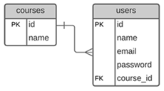
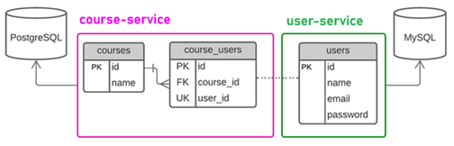

# 📂 Sección 05: RestClient: Comunicación entre microservicios

En esta etapa, daremos el paso fundamental de transformar aplicaciones aisladas en un ecosistema distribuido. Aunque el
estándar tradicional ha sido `Feign`, utilizaremos `RestClient`, la interfaz fluida introducida por `Spring`
a partir de la versión `Spring Boot 3.2` para modernizar la comunicación síncrona entre microservicios.

| Tecnología       | Versión donde aparece `RestClient` |
|------------------|------------------------------------|
| Spring Framework | **6.1**                            |
| Spring Boot      | **3.2**                            |

---

## 🚀 Introducción: Conectando microservicios

En esta sección veremos cómo relacionar nuestros dos microservicios `user-service` y `course-service`. Luego,
agregaremos funcionalidades en ambos microservicios que nos ayudarán a establecer la comunicación.

En la siguiente imagen vemos un panorama general de lo que realizaremos en esta sección:


## 🏗️ Creación de la Entidad JPA: `CourseUser`

Hasta este punto tenemos creado nuestros dos microservicios `course-service` y `user-service`, cada uno manejando su
propia base de datos.


Ahora, imaginemos por un momento que las tablas `courses` y `users` están en una sola base de datos. La relación de
`Uno a Muchos` **(un curso con muchos usuarios, un usuario en un solo curso)** se vería de la siguiente manera:



Ahora volvamos a la realidad, porque estamos trabajando en un entorno de microservicios, donde cada microservicio tiene
su propia base de datos. Eso significa que la integridad referencial física `(Foreign Keys)` desaparece entre bases de
datos distintas.

Para resolver la relación `Uno a Muchos` **(un curso con muchos usuarios, un usuario en un solo curso)**,
implementaremos una `tabla espejo` o de asociación dentro de `course-service`.

### 🧩 Estrategia de Persistencia Distribuida

Como el `course-service` es el que gestiona la existencia de los cursos, es él quien debe llevar el control de qué
alumnos están inscritos. Creamos la tabla `course_users` para actuar como puente:

- `user_id`: No es una FK física, sino una referencia lógica al ID que reside en el microservicio `user-service`.
- `course_id`: Es una FK física real hacia nuestra tabla local `courses`.



### 📄 Clase de Entidad: `CourseUser.java`

Esta entidad representa la inscripción. Es vital la restricción de unicidad en `user_id` para cumplir la regla de
negocio: `"Un alumno solo puede estar en un curso"`.

````java

@ToString
@AllArgsConstructor
@NoArgsConstructor
@Builder
@Setter
@Getter
@Entity
@Table(name = "course_users")
public class CourseUser {
    @Id
    @GeneratedValue(strategy = GenerationType.IDENTITY)
    private Long id;

    @Column(nullable = false, unique = true)
    private Long userId;

    @Override
    public boolean equals(Object o) {
        if (o == null || getClass() != o.getClass()) return false;
        CourseUser that = (CourseUser) o;
        return Objects.equals(getUserId(), that.getUserId());
    }

    @Override
    public int hashCode() {
        return Objects.hashCode(getUserId());
    }
}
````

### ⚖️ La importancia de `equals()` y `hashCode()`

Cuando trabajamos con JPA y colecciones (como un `Set<CourseUser>` dentro de la clase `Course`), Hibernate necesita
saber cuándo un objeto es "el mismo" que otro, especialmente antes de persistir o al eliminar de una lista.

1. `Identidad basada en Negocio`: Hemos decidido que dos `CourseUser` son iguales si su `userId` es el mismo. Esto
   refuerza la regla de que un usuario no puede duplicarse en la tabla.

2. `Contrato de Hash`:
    - Si `equals()` dice que dos objetos son iguales, su `hashCode()` debe ser el mismo.
    - Si dos objetos tienen el mismo valor de `hashCode()`, no necesariamente son iguales según `equals()`.
    - Si no sobrescribimos ambos, colecciones como `HashSet` podrían permitir "duplicados lógicos" porque los objetos
      tendrían diferentes direcciones de memoria, rompiendo nuestra regla de negocio.

## 📄 Asociación Unidireccional OneToMany: `Course` y `CourseUser`

Para materializar la relación en el código, actualizamos la entidad `Course`. Hemos optado por una lista de tipo
`ArrayList` para manejar la colección de usuarios inscritos.

````java

@ToString
@AllArgsConstructor
@NoArgsConstructor
@Builder
@Setter
@Getter
@Entity
@Table(name = "courses")
public class Course {
    @Id
    @GeneratedValue(strategy = GenerationType.IDENTITY)
    private Long id;

    @Column(nullable = false, unique = true)
    private String name;

    @Builder.Default // 💡 Indica a Lombok que use esta inicialización como valor por defecto en el builder
    @JoinColumn(name = "course_id")
    @OneToMany(cascade = CascadeType.ALL, orphanRemoval = true)
    private List<CourseUser> courseUsers = new ArrayList<>();
}
````

#### 🔬 Análisis Técnico de las Anotaciones

1. `@JoinColumn(name = "course_id")`  
   En una relación unidireccional `@OneToMany`, esta anotación es fundamental para evitar la creación de una
   `tabla intermedia` innecesaria.
    - `name = "course_id"`: Define el nombre de la columna física que se creará en la tabla hija `(course_users)`.
      Esta columna actuará como la `Foreign Key (FK)` que apunta hacia la tabla de cursos.
    - `Funcionamiento`: Le indica a JPA que la relación se gestiona mediante una columna en la tabla del lado `Muchos`,
      permitiendo que el modelo de base de datos sea limpio y eficiente.


2. `@OneToMany(cascade = CascadeType.ALL, orphanRemoval = true)`  
   Esta anotación define cómo se comportan los elementos de la lista cuando la entidad padre `(Course)` sufre cambios.
    - `cascade = CascadeType.ALL`: Propaga todas las operaciones de persistencia. Si guardas, actualizas o eliminas
      un `Course`, automáticamente se guardarán, actualizarán o eliminarán sus `CourseUser` asociados.
    - `orphanRemoval = true`: Es el "recolector de basura" de la relación. Si eliminas un objeto `CourseUser` de la
      lista `courseUsers`, JPA detectará que ese registro ha quedado "huérfano" y lo eliminará físicamente de la base
      de datos de forma automática.
