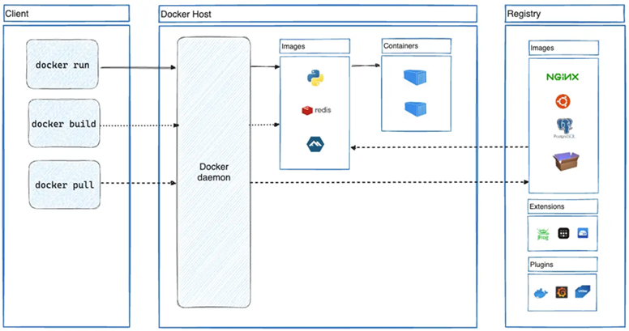

# 🐳 Sección 06: Docker - Introducción

`Docker` no es solo una herramienta de virtualización; es el estándar de la industria para garantizar que el código que
escribiste en tu máquina funcione exactamente igual en el servidor de producción. A continuación, desglosamos su
arquitectura y componentes esenciales.

---

## 🧐 [¿Qué es docker?](https://docs.docker.com/get-started/docker-overview/)

`Docker` es una plataforma de software que automatiza el despliegue de aplicaciones dentro de contenedores.
Su propuesta de valor principal es la `eliminación del "En mi máquina funciona"`, permitiendo separar la aplicación de
la infraestructura subyacente.

### 🌟 La Propuesta de Valor

Al utilizar Docker para tus microservicios de Java/Spring Boot, obtienes:

- `Portabilidad Extrema`: El mismo artefacto se ejecuta en Windows, Linux o la Nube.
- `Aislamiento`: Cada microservicio (`user-service`, `course-service`) tiene sus propias dependencias sin entrar en
  conflicto con el sistema host.
- `Eficiencia`: A diferencia de las Máquinas Virtuales (VM), Docker comparte el kernel del sistema operativo host,
  lo que lo hace increíblemente ligero.

## 🏗️ Arquitectura de Docker: El Modelo Cliente-Servidor

Docker opera bajo una arquitectura desacoplada donde el cliente y el servidor se comunican a través de una API REST.

### 😈 1. El Demonio de Docker (`dockerd`)

Es el "cerebro" del sistema. Se ejecuta en segundo plano y es el responsable de:

- Gestionar el ciclo de vida de los `Contenedores`.
- Almacenar y construir `Imágenes`.
- Administrar `Redes` (para que los microservicios hablen entre sí).
- Gestionar `Volúmenes` (para que los datos no se pierdan).

### 💻 2. El Cliente Docker (`docker`)

Es la interfaz de línea de comandos (CLI) que utilizamos nosotros. Cuando escribimos un comando como
`docker container run...`, el cliente lo traduce a una petición API y se la envía al `dockerd`.

> `Dato Pro`: El cliente puede conectarse a un `demonio local` o a uno `remoto` situado en otra red.

### 🏪 3. Docker Registry (`El Almacén`)

Lugar donde se `guardan las imágenes de Docker`.

- `Docker Hub` es un registro público que cualquiera puede usar. Además, `Docker` busca imágenes en
  `Docker Hub de forma predeterminada`.
- `Privados`: Empresas suelen usar AWS ECR, Azure ACR o su propio GitLab Registry para proteger su código.

Cuando usas los comandos `docker pull` o `docker run`, `Docker` extrae las imágenes necesarias de tu registro
configurado. Cuando usas el comando `docker push`, `Docker` envía tu imagen a tu registro configurado.



## 🧩 Componentes Clave: Objetos de Docker

Para entender Docker, debemos diferenciar claramente entre sus dos componentes principales:

### 💿 Imágenes: La Plantilla Estática

Una `imagen` es una plantilla de solo lectura con instrucciones para crear un `contenedor Docker`. A menudo, una
`imagen` se basa en otra `imagen`, con alguna personalización adicional. Por ejemplo, puede crear una imagen que
se base en la imagen de Ubuntu, pero que instale el servidor web Apache y su aplicación, así como los detalles
de configuración necesarios para que su aplicación se ejecute.

Puede crear sus propias imágenes o puede utilizar únicamente las creadas por otros y publicadas en un registro.
`Para crear su propia imagen`, debe crear un `Dockerfile` con una sintaxis simple para definir los pasos necesarios
para crear la imagen y ejecutarla.

- `Cada instrucción en un Dockerfile crea una capa en la imagen`. Cuando cambia el `Dockerfile` y reconstruye la imagen,
  solo se reconstruyen las capas que han cambiado. Esto es parte de lo que hace que las imágenes sean tan livianas,
  pequeñas y rápidas, en comparación con otras tecnologías de virtualización.
- `Inmutabilidad`: Una vez creada, la imagen no cambia.

### 📦 Contenedores: La Instancia Viva

`Un contenedor es una instancia ejecutable de una imagen`. Puede crear, iniciar, detener, mover o eliminar un
contenedor mediante la API o la CLI de Docker. Puede conectar un contenedor a una o más redes, adjuntarle
almacenamiento o incluso crear una nueva imagen en función de su estado actual.

- Es la unidad ejecutable.
- Es `efímero`: Si el contenedor se borra, cualquier dato guardado dentro de él (que no esté en un volumen) desaparece.
- `Aislamiento`: de manera predeterminada,
  `un contenedor está relativamente bien aislado de otros contenedores y de su máquina host`.
  Puede controlar el grado de aislamiento de la red, el almacenamiento u otros subsistemas subyacentes de un
  contenedor respecto de otros contenedores o de la máquina host.

## ☕ La Analogía del Desarrollador Java

| Concepto en Java                      | Concepto en Docker                   | Característica                                                                                                     |
|---------------------------------------|--------------------------------------|--------------------------------------------------------------------------------------------------------------------|
| **Clase (`.class`)**                  | **Imagen**                           | Es el molde estático. Define el comportamiento y las propiedades, pero no "hace" nada por sí sola.                 |
| **Instancia (`new Object()`)**        | **Contenedor**                       | Es la ejecución en memoria. Puedes crear cientos de objetos a partir de una sola clase; cada uno es independiente. |
| **Atributos (`private String name`)** | **Variables de Entorno / Volúmenes** | Definen el estado específico de esa instancia particular (ej. la IP de la base de datos).                          |
| **JAR / Maven Repository**            | **Docker Hub / Registry**            | Donde guardas y distribuyes tus "clases" (imágenes) para que otros las reutilicen.                                 |

---

## 🏗️ Generación del Artefacto (JAR) para Dockerizar

Antes de que Docker pueda "empaquetar" nuestra aplicación, necesitamos crear el artefacto ejecutable de Java. En
proyectos de Spring Boot, este suele ser un archivo Fat `JAR` (un archivo que contiene tanto el código de nuestra
aplicación como todas sus dependencias externas).

### 🚀 Paso 1: Generar el JAR del user-service

Para mantener un flujo limpio, realizamos la compilación manual desde la terminal. Nos posicionamos en la raíz del
proyecto `user-service` y ejecutamos el comando de `Maven Wrapper`:

`mvnw clean package -DskipTests`, comando para compilar y empaquetar omitiendo pruebas unitarias.

````bash
D:\programming\spring\01.udemy\02.andres_guzman\08.docker_kubernetes\docker-kubernetes-2026\business-domain\user-service (feature/section-6)
$ mvnw clean package -DskipTests
[INFO] Scanning for projects...
[INFO]
...
[INFO] --- surefire:3.5.4:test (default-test) @ user-service ---
[INFO] Tests are skipped.
[INFO]
[INFO] --- jar:3.4.2:jar (default-jar) @ user-service ---
[INFO] Building jar: D:\programming\spring\01.udemy\02.andres_guzman\08.docker_kubernetes\docker-kubernetes-2026\business-domain\user-service\target\user-service-0.0.1-SNAPSHOT.jar
[INFO]
[INFO] --- spring-boot:4.0.3:repackage (repackage) @ user-service ---
[INFO] Replacing main artifact D:\programming\spring\01.udemy\02.andres_guzman\08.docker_kubernetes\docker-kubernetes-2026\business-domain\user-service\target\user-service-0.0.1-SNAPSHOT.jar with repackaged archive, adding nested dependencies in BOOT-INF/.
[INFO] The original artifact has been renamed to D:\programming\spring\01.udemy\02.andres_guzman\08.docker_kubernetes\docker-kubernetes-2026\business-domain\user-service\target\user-service-0.0.1-SNAPSHOT.jar.original
[INFO] ------------------------------------------------------------------------
[INFO] BUILD SUCCESS
[INFO] ------------------------------------------------------------------------
[INFO] Total time:  6.403 s
[INFO] Finished at: 2026-03-19T17:04:02-05:00
[INFO] ------------------------------------------------------------------------
````

> `Nota`: En Windows se usa `mvnw`, en Linux/Mac se usa `./mvnw`.

#### 🔍 Anatomía del Comando Maven

Es vital entender qué ocurre "bajo el capó" cuando ejecutamos estas instrucciones:

| Parámetro                                                    | Acción Técnica                                                    | Propósito en el flujo Docker                                                                                                         |
|--------------------------------------------------------------|-------------------------------------------------------------------|--------------------------------------------------------------------------------------------------------------------------------------|
| `clean`<span style="visibility:hidden">..............</span> | Borra la carpeta `/target`.                                       | Evita que restos de compilaciones antiguas se filtren en nuestra nueva imagen.                                                       |
| `package`                                                    | Compila y empaqueta en un `.jar` dentro del directorio `/target`. | Crea el "corazón" de nuestra futura imagen Docker.                                                                                   |
| `-DskipTests`                                                | Salta la ejecución de tests.                                      | **Crucial:** Spring Boot intenta levantar el contexto (y la DB) en los tests. Si la base de datos no está activa, el build fallaría. |

#### 📂 Verificación del Artefacto

Una vez que recibimos el mensaje de `BUILD SUCCESS`, Maven habrá depositado el resultado en la carpeta `/target`.
Al listar el contenido, deberíamos ver algo similar a esto:

````bash
D:\programming\spring\01.udemy\02.andres_guzman\08.docker_kubernetes\docker-kubernetes-2026\business-domain\user-service\target (feature/section-6)
$ ls -l
total 67284
drwxr-xr-x 1 magadiflo 197121        0 Mar 19 17:04 classes/
drwxr-xr-x 1 magadiflo 197121        0 Mar 19 17:03 generated-sources/
drwxr-xr-x 1 magadiflo 197121        0 Mar 19 17:04 generated-test-sources/
drwxr-xr-x 1 magadiflo 197121        0 Mar 19 17:04 maven-archiver/
drwxr-xr-x 1 magadiflo 197121        0 Mar 19 17:03 maven-status/
drwxr-xr-x 1 magadiflo 197121        0 Mar 19 17:04 test-classes/
-rw-r--r-- 1 magadiflo 197121 68866210 Mar 19 17:04 user-service-0.0.1-SNAPSHOT.jar
-rw-r--r-- 1 magadiflo 197121    24810 Mar 19 17:04 user-service-0.0.1-SNAPSHOT.jar.original
````

#### 💡 ¿Qué es el archivo `.jar.original`?

Al empaquetar la aplicación, `Maven` genera primero un `JAR estándar` de Java (el `.original`).
Inmediatamente después, el `plugin de Spring Boot` lo re-empaqueta para convertirlo en un `"Fat JAR"` ejecutable,
integrando un cargador de clases propio y todas las dependencias necesarias en la carpeta interna `BOOT-INF/lib`.

#### 🎯 Nuestra elección: El `Fat JAR ejecutable` `(.jar)`

Este archivo es el resultado final del proceso de `re-empaquetado`. A diferencia del estándar, este es un artefacto
autónomo que contiene no solo nuestro código compilado, sino también el servidor embebido (Tomcat) y todas las
librerías externas que el microservicio necesita para funcionar.

Lo utilizamos para `Dockerizar` porque garantiza la portabilidad absoluta: el contenedor no necesita que instalemos
librerías ni servidores externos en el sistema operativo; todo lo necesario para iniciar el servicio ya vive dentro de
este archivo.

En ese sentido, el archivo que nos interesa para Docker es el `re-empaquetado` y `ejecutable`, que se identifica por
ser el más pesado y terminar simplemente en `.jar`:

> `user-service-0.0.1-SNAPSHOT.jar`

### 🚀 Paso 2: Ejecución del JAR desde la Línea de Comandos

Para validar que nuestro artefacto es completamente funcional, simularemos un despliegue manual.
Imaginemos que hemos trasladado nuestro archivo `user-service-0.0.1-SNAPSHOT.jar` a una ubicación externa
(por ejemplo, el disco `M:\`).

#### 💻 Comando de ejecución

Desde la terminal, navegamos a la ruta del archivo y ejecutamos el comando estándar de la JVM para archivos JAR:

````bash
M:\
$ java -jar user-service-0.0.1-SNAPSHOT.jar

  .   ____          _            __ _ _
 /\\ / ___'_ __ _ _(_)_ __  __ _ \ \ \ \
( ( )\___ | '_ | '_| | '_ \/ _` | \ \ \ \
 \\/  ___)| |_)| | | | | || (_| |  ) ) ) )
  '  |____| .__|_| |_|_| |_\__, | / / / /
 =========|_|==============|___/=/_/_/_/

 :: Spring Boot ::                (v4.0.3)

2026-03-19T18:04:25.072-05:00  INFO 1472 --- [user-service] [           main] d.m.user.app.UserServiceApplication      : Starting UserServiceApplication v0.0.1-SNAPSHOT using Java 25.0.2 with PID 1472 (M:\user-service-0.0.1-SNAPSHOT.jar started by magadiflo in M:\)
2026-03-19T18:04:25.075-05:00 DEBUG 1472 --- [user-service] [           main] d.m.user.app.UserServiceApplication      : Running with Spring Boot v4.0.3, Spring v7.0.5
2026-03-19T18:04:25.076-05:00  INFO 1472 --- [user-service] [           main] d.m.user.app.UserServiceApplication      : No active profile set, falling back to 1 default profile: "default"
2026-03-19T18:04:26.087-05:00  INFO 1472 --- [user-service] [           main] .s.d.r.c.RepositoryConfigurationDelegate : Bootstrapping Spring Data JPA repositories in DEFAULT mode.
2026-03-19T18:04:26.144-05:00  INFO 1472 --- [user-service] [           main] .s.d.r.c.RepositoryConfigurationDelegate : Finished Spring Data repository scanning in 39 ms. Found 1 JPA repository interface.
2026-03-19T18:04:26.399-05:00  INFO 1472 --- [user-service] [           main] o.s.cloud.context.scope.GenericScope     : BeanFactory id=e14e74eb-26bb-36e7-8fbc-96c726a7a059
2026-03-19T18:04:26.850-05:00  INFO 1472 --- [user-service] [           main] o.s.boot.tomcat.TomcatWebServer          : Tomcat initialized with port 8001 (http)
2026-03-19T18:04:26.866-05:00  INFO 1472 --- [user-service] [           main] o.apache.catalina.core.StandardService   : Starting service [Tomcat]
2026-03-19T18:04:28.204-05:00  INFO 1472 --- [user-service] [           main] com.zaxxer.hikari.pool.HikariPool        : HikariPool-1 - Added connection com.mysql.cj.jdbc.ConnectionImpl@6ed87ccf
...
2026-03-19T18:04:30.176-05:00  INFO 1472 --- [user-service] [           main] o.s.boot.tomcat.TomcatWebServer          : Tomcat started on port 8001 (http) with context path '/'
2026-03-19T18:04:30.193-05:00  INFO 1472 --- [user-service] [           main] d.m.user.app.UserServiceApplication      : Started UserServiceApplication in 5.626 seconds (process running for 6.191)
````

Como se observa en los logs, Spring Boot inicia su servidor Tomcat embebido en el puerto 8001, se conecta a la
base de datos local y queda listo para recibir peticiones en cuestión de segundos.

#### 🔍 Verificación de Disponibilidad

Podemos confirmar que el microservicio responde correctamente consultando un endpoint de usuario:

````bash
$ curl -v http://localhost:8001/api/v1/users/1 | jq
>
< HTTP/1.1 200
< Content-Type: application/json
< Transfer-Encoding: chunked
< Date: Thu, 19 Mar 2026 23:06:38 GMT
<
{
  "id": 1,
  "name": "Martin",
  "email": "martin@gmail.com",
  "password": "123456"
}
````

#### 💡 Reflexión: ¿Por qué este paso es vital para Docker?

Este ejercicio nos permite identificar las dependencias externas y los puntos críticos que Docker deberá resolver por
nosotros:

1. `Independencia del IDE`: Confirmamos que no necesitamos `IntelliJ` o `Eclipse` para correr la app. Solo necesitamos
   el `JAR` y el `JRE` (Java Runtime Environment).
2. `El "Problema de la Máquina"`: Actualmente, para que este comando funcione en otra computadora, tendríamos que
   instalar manualmente:
    - La misma versión de Java (v25 en este caso).
    - Configurar las variables de entorno.
    - Asegurar que la Base de Datos sea accesible desde esa máquina.
3. `Hacia la Contenedorización`: Docker tomará este mismo proceso (copiar el JAR y ejecutar `java -jar`) pero lo hará
   dentro de un entorno aislado donde `él mismo instalará el Java correcto`, garantizando que funcione en cualquier
   lugar sin que nosotros instalemos nada manualmente en el host.

#### 🎯 Conclusión

Hemos demostrado que nuestra aplicación es un `artefacto portátil`. El siguiente reto es meter este proceso dentro
de una `Imagen de Docker` para que sea "autocontenido" y no dependa de si el host tiene instalado Java o no.
