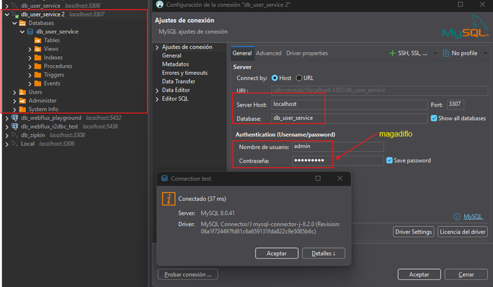
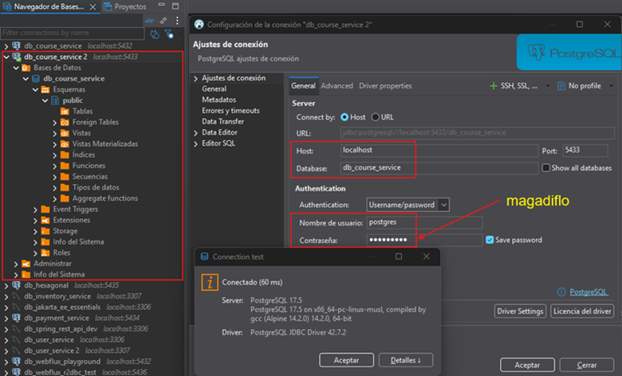

# Sección 09: Docker Networks - Comunicación entre contenedores - Volúmenes

En esta sección, daremos el salto hacia la interconexión de servicios. Dejaremos de ver a los contenedores como islas y
aprenderemos cómo permitir que el `course-service` y el `user-service` hablen entre sí utilizando nombres de host
personalizados.

---

## 🐳 Dockerizando el course-service

Hasta ahora el microservicio `course-service` lo hemos estado trabajando sin dockerizar. En este apartado daremos el
paso de **empaquetarlo dentro de un contenedor Docker**, lo que nos permitirá integrarlo de manera más eficiente en
nuestro ecosistema de microservicios.

Para que el microservicio de cursos funcione correctamente dentro del entorno Docker, debemos realizar ajustes
estratégicos en su configuración de red y conectividad.

### 🚀 En el `course-service`

#### 1. Conexión a la Base de Datos (Host Local)

Como el `course-service` estará dentro de un contenedor, ya no puede usar `localhost` para referirse a la base de datos
que corre en tu máquina física. Docker proporciona un DNS especial `(host.docker.internal)` para este propósito.

Modificación en `application.yml`:

````yml
spring:
  application:
    name: course-service
  datasource:
    # Sustituimos localhost por el puente al host de Docker
    url: jdbc:postgresql://host.docker.internal:5432/db_course_service
````

> Más adelante, veremos cómo dockerizar las bases de datos de `PostgreSQL` y `MySQL` para que tengamos toda la
> aplicación 100% dockerizada.

#### 2. Comunicación entre Microservicios (Service Discovery manual)

El `course-service` consume la API del `user-service` mediante `RestClient`. En un entorno Docker, la comunicación más
eficiente no es a través de IPs, sino a través de **nombres de contenedores.** Por lo tanto, en el
`application.yml` del `course-service` modificamos la url que nos permite comunicarnos con el `user-service`.

````yml
custom:
  user-service:
    # Usamos el nombre del contenedor como Hostname
    base-url: http://c-user-service:8001/api/v1/users
````

🔍 Análisis de la URL:

- `c-user-service`: Es el nombre que asignaremos al contenedor de usuarios mediante la bandera `--name`. Docker
  resolverá este nombre a la IP interna del contenedor automáticamente.
- `Port 8001`: Es el puerto interno (el que definimos en el `EXPOSE` del `Dockerfile`). Es decir, el puerto en el que
  la aplicación `user-service` está escuchando internamente. Cuando los contenedores hablan entre sí dentro de la misma
  red, no necesitan pasar por el mapeo de puertos externo.
- Por defecto, los contenedores se conectan a una red llamada `bridge`, pero esta red no permite la resolución de
  nombres por DNS. Para que los microservicios se encuentren por su nombre `(c-user-service)`, debemos crear nuestra
  propia red personalizada con el comando: `docker network create [nombre_de_la_red]`.

#### 3. Creación del `Dockerfile` para `course-service`

Para mantener la estandarización en nuestro ecosistema de microservicios, el `Dockerfile` del `course-service` sigue la
misma estrategia de optimización basada en capas que implementamos anteriormente.

La única variación técnica relevante es la instrucción `EXPOSE 8002`, que refleja el puerto interno donde escucha este
servicio.

````dockerfile
FROM eclipse-temurin:25-jdk-alpine AS dependencies
WORKDIR /app
COPY ./mvnw ./
COPY ./.mvn ./.mvn
COPY ./pom.xml ./
RUN sed -i -e 's/\r$//' ./mvnw && ./mvnw dependency:go-offline
COPY ./src ./src
RUN ./mvnw clean package -DskipTests

FROM eclipse-temurin:25-jre-alpine AS builder
WORKDIR /app
COPY --from=dependencies /app/target/*.jar ./app.jar
RUN java -Djarmode=layertools -jar app.jar extract

FROM eclipse-temurin:25-jre-alpine AS runner
WORKDIR /app
RUN mkdir ./logs
COPY --from=builder /app/dependencies ./
COPY --from=builder /app/spring-boot-loader ./
COPY --from=builder /app/snapshot-dependencies ./
COPY --from=builder /app/application ./
EXPOSE 8002
ENTRYPOINT ["java", "org.springframework.boot.loader.launch.JarLauncher"]
````

#### 🏗️ Construcción de la Imagen del `course-service`

Ejecutamos el `build` apuntando al contexto del proyecto. Nota cómo `Docker` aprovecha el caché de las etapas
anteriores que habíamos construido en el `user-service` (gracias a que comparten la misma base de `eclipse-temurin`).

````bash
D:\programming\spring\01.udemy\02.andres_guzman\08.docker_kubernetes\docker-kubernetes-2026 (feature/section-9)                                    
$ docker image build -t course-service .\business-domain\course-service                                                                            
[+] Building 102.0s (24/24) FINISHED                                                                                                               
 => [internal] load build definition from Dockerfile                                                                                               
 => => transferring dockerfile: 799B                                                                                                               
 => [internal] load metadata for docker.io/library/eclipse-temurin:25-jdk-alpine                                                                   
 => [internal] load metadata for docker.io/library/eclipse-temurin:25-jre-alpine                                                                   
 => [auth] library/eclipse-temurin:pull token for registry-1.docker.io                                                                             
 => [internal] load .dockerignore                                                                                                                  
 => => transferring context: 234B                                                                                                                  
 => [dependencies 1/8] FROM docker.io/library/eclipse-temurin:25-jdk-alpine@sha256:da683f4f02f9427597d8fa162b73b8222fe08596dcebaf23e4399576ff8b037e
 => [builder 1/4] FROM docker.io/library/eclipse-temurin:25-jre-alpine@sha256:f10d6259d0798c1e12179b6bf3b63cea0d6843f7b09c9f9c9c422c50e44379ec     
 => [internal] load build context                                                                                                                  
 => => transferring context: 56.50kB                                                                                                               
 => CACHED [dependencies 2/8] WORKDIR /app                                                                                                         
 => CACHED [dependencies 3/8] COPY ./mvnw ./                                                                                                       
 => CACHED [dependencies 4/8] COPY ./.mvn ./.mvn                                                                                                   
 => [dependencies 5/8] COPY ./pom.xml ./                                                                                                           
 => [dependencies 6/8] RUN sed -i -e 's/\r$//' ./mvnw && ./mvnw dependency:go-offline                                                              
 => [dependencies 7/8] COPY ./src ./src                                                                                                            
 => [dependencies 8/8] RUN ./mvnw clean package -DskipTests                                                                                        
 => CACHED [builder 2/4] WORKDIR /app                                                                                                              
 => [builder 3/4] COPY --from=dependencies /app/target/*.jar ./app.jar                                                                             
 => [builder 4/4] RUN java -Djarmode=layertools -jar app.jar extract                                                                               
 => CACHED [runner 3/7] RUN mkdir ./logs                                                                                                           
 => [runner 4/7] COPY --from=builder /app/dependencies ./                                                                                          
 => [runner 5/7] COPY --from=builder /app/spring-boot-loader ./                                                                                    
 => [runner 6/7] COPY --from=builder /app/snapshot-dependencies ./                                                                                 
 => [runner 7/7] COPY --from=builder /app/application ./                                                                                           
 => exporting to image                                                                                                                             
 => => exporting layers                                                                                                                            
 => => writing image sha256:722ee6b3b8dacb0171de0125a298119061f2c8ba583ea861368e5badf1b793dc                                                       
 => => naming to docker.io/library/course-service                                                                                                                                                                                                                                                     
````

Una vez finalizado el proceso, confirmamos que la imagen está lista para ser instanciada:

````bash
$ docker image ls -a                                                                     
                                                                                         
IMAGE                                    ID             DISK USAGE   CONTENT SIZE   EXTRA
course-service:latest                    722ee6b3b8da        293MB             0B     
````

### 🚀 En el `user-service`

Para completar la integración, debemos actualizar el `user-service`. Aunque este servicio es independiente, utiliza un
`RestClient` para consultar información en el `course-service`, por lo que debe saber cómo encontrarlo en el
ecosistema `Docker`.

#### Actualización en `application.yml`

Modificamos la URL base para que apunte al nombre del contenedor del servicio de cursos `(c-course-service)`,
utilizando el puerto interno `8002`.

````yml
custom:
  course-service:
    # Apuntamos al nombre que le daremos al contenedor del otro microservicio
    base-url: http://c-course-service:8002/api/v1/courses
````

Donde:

- `c-course-service` es el nombre del contenedor que le asignaremos al microservicio `course-service` al momento de
  crearlo con la bandera `--name` en el comando `docker container run`.

#### 🏗️ Reconstrucción de la Imagen

Dado que hemos modificado archivos de configuración internos, es necesario generar una nueva versión de la imagen
para que incluya estos cambios:

````bash
D:\programming\spring\01.udemy\02.andres_guzman\08.docker_kubernetes\docker-kubernetes-2026 (feature/section-9)                                    
$ docker image build -t user-service .\business-domain\user-service                                                                                
[+] Building 19.1s (24/24) FINISHED                                                                                                                
 => [internal] load build definition from Dockerfile                                                                                               
 => => transferring dockerfile: 799B                                                                                                               
 => [internal] load metadata for docker.io/library/eclipse-temurin:25-jre-alpine                                                                   
 => [internal] load metadata for docker.io/library/eclipse-temurin:25-jdk-alpine                                                                   
 => [auth] library/eclipse-temurin:pull token for registry-1.docker.io                                                                             
 => [internal] load .dockerignore                                                                                                                  
 => => transferring context: 234B                                                                                                                  
 => [dependencies 1/8] FROM docker.io/library/eclipse-temurin:25-jdk-alpine@sha256:da683f4f02f9427597d8fa162b73b8222fe08596dcebaf23e4399576ff8b037e
 => [builder 1/4] FROM docker.io/library/eclipse-temurin:25-jre-alpine@sha256:f10d6259d0798c1e12179b6bf3b63cea0d6843f7b09c9f9c9c422c50e44379ec     
 => [internal] load build context                                                                                                                  
 => => transferring context: 4.27kB                                                                                                                
 => CACHED [dependencies 2/8] WORKDIR /app                                                                                                         
 => CACHED [dependencies 3/8] COPY ./mvnw ./                                                                                                       
 => CACHED [dependencies 4/8] COPY ./.mvn ./.mvn                                                                                                   
 => CACHED [dependencies 5/8] COPY ./pom.xml ./                                                                                                    
 => CACHED [dependencies 6/8] RUN sed -i -e 's/\r$//' ./mvnw && ./mvnw dependency:go-offline                                                       
 => [dependencies 7/8] COPY ./src ./src                                                                                                            
 => [dependencies 8/8] RUN ./mvnw clean package -DskipTests                                                                                        
 => CACHED [builder 2/4] WORKDIR /app                                                                                                              
 => [builder 3/4] COPY --from=dependencies /app/target/*.jar ./app.jar                                                                             
 => [builder 4/4] RUN java -Djarmode=layertools -jar app.jar extract                                                                               
 => CACHED [runner 3/7] RUN mkdir ./logs                                                                                                           
 => CACHED [runner 4/7] COPY --from=builder /app/dependencies ./                                                                                   
 => CACHED [runner 5/7] COPY --from=builder /app/spring-boot-loader ./                                                                             
 => CACHED [runner 6/7] COPY --from=builder /app/snapshot-dependencies ./                                                                          
 => [runner 7/7] COPY --from=builder /app/application ./                                                                                           
 => exporting to image                                                                                                                             
 => => exporting layers                                                                                                                            
 => => writing image sha256:888de4658d0e884ef31200d6661751f929d3b840091c92a2bafd587f0c883ee7                                                       
 => => naming to docker.io/library/user-service                                                                                                    
````

#### 🔍 Estado actual de nuestras imágenes

En este punto, ya tenemos preparadas nuestras dos piezas fundamentales:

````bash
$ docker image ls -a                                                                     
                                                                                         
IMAGE                                    ID             DISK USAGE   CONTENT SIZE   EXTRA
course-service:latest                    722ee6b3b8da        293MB             0B        
user-service:latest                      888de4658d0e        294MB             0B        
````

### 💡 Resumen de la Arquitectura de Red

| Microservicio    | Puerto Interno | Host Destino (Docker Network) | Variable de Conexión             |
|------------------|----------------|-------------------------------|----------------------------------|
| `user-service`   | `8001`         | `c-course-service:8002`       | `custom.course-service.base-url` |
| `course-service` | `8002`         | `c-user-service:8001`         | `custom.user-service.base-url`   |

#### ¿Por qué usamos nombres y no IPs?

En Docker, las direcciones IP de los contenedores son dinámicas (cambian cada vez que reinicias un contenedor). Sin
embargo, el nombre del contenedor actúa como un dominio fijo gracias al servidor DNS interno de Docker, lo que hace que
nuestra configuración sea robusta y no dependa de IPs variables.

> 💡 `Nota`: Dentro de una red Docker, los microservicios se comunican usando el `nombre del contenedor como hostname`,
> no `localhost`. Usar `localhost` dentro de un contenedor haría que el servicio intente llamarse a sí mismo en lugar
> de buscar al otro microservicio.

## 🌐 Configuración de la Red (Docker Network)

Para que nuestros microservicios puedan interactuar, necesitamos entender cómo gestiona Docker la conectividad. Por
defecto, Docker ofrece tres tipos de redes iniciales.

### 1. Visualización de Redes Predeterminadas

Ejecutamos el siguiente comando para listar las redes actuales en nuestro motor de Docker:

````bash
$ docker network ls
NETWORK ID     NAME      DRIVER    SCOPE
869c89f02390   bridge    bridge    local
e067f6421fbb   host      host      local
10b2c1c97ecf   none      null      local
````

#### 🔍 Análisis de los Drivers:

- `bridge`: Red por defecto para contenedores; permite acceso a internet y comunicación entre contenedores conectados,
  pero `no resuelve nombres de contenedores automáticamente`.
- `host`: El contenedor comparte la red del host, sin aislamiento de red; útil para aplicaciones que necesitan el mismo
  stack de red del sistema anfitrión.
- `none`: El contenedor no tiene acceso a ninguna red; se usa cuando necesitas un contenedor completamente aislado a
  nivel de red.

### 2. Creación de una Red Personalizada: `docker-k8s-net`

Para habilitar el `Service Discovery` (descubrimiento de servicios por nombre), crearemos nuestra propia red.
Esto activa automáticamente un servidor DNS interno de Docker.

````bash
$ docker network create docker-k8s-net
5adf961ce02ce5f05aaa83a51c02b1284f55ecbc8028c473ef7d29c3d2165dab
````

Al listar nuevamente, confirmamos su existencia:

````bash
$ docker network ls
NETWORK ID     NAME             DRIVER    SCOPE
869c89f02390   bridge           bridge    local
5adf961ce02c   docker-k8s-net   bridge    local
e067f6421fbb   host             host      local
10b2c1c97ecf   none             null      local
````

💡 Nota:
> Si no creas explícitamente una red en `Docker`, los contenedores se ejecutan en una red por defecto llamada `bridge`.
> Esta red es la configuración estándar para contenedores que no se asocian a una red personalizada. Esta red permite
> acceso a internet, pero `no permite la resolución de nombres entre contenedores`.
>
> Por lo tanto, si deseamos que nuestros contenedores se comuniquen usando sus nombres
> (como `http://c-user-service:8001`), es recomendable usar una red personalizada. En nuestro caso, la red
> personalizada que creamos es `docker-k8s-net`.
>
> ✅ Ambas redes son tipo `bridge`, pero se comportan distinto por diseño.
>
> - La red por defecto llamado `bridge` no habilita un sistema de resolución de nombres entre contenedores. Es una red
    "mínima" pensada para contenedores simples o pruebas rápidas. Los contenedores conectados a esta red no pueden
    resolverse por su nombre (`--name`), `solo se ven por IP`. Por eso, para que dos contenedores se comuniquen en esta
    red, tendrías que pasarles la IP del otro (lo cual es frágil y no recomendable).
>
>
> - La red `bridge personalizada` (como `docker-k8s-net`), es creada por nosotros mismos con el comando
    `docker network create`. Docker configura automáticamente `un DNS interno` para esta red. Este DNS
    `resuelve los nombres de los contenedores` en esa red. Los contenedores `sí pueden comunicarse usando sus nombres`
    (los que defines con `--name`), como si fuera un mini sistema de nombres interno.

## 🚀 Comunicación entre contenedores

Con la red `docker-k8s-net` ya creada, procederemos a instanciar nuestros microservicios asegurándonos de que ambos
"hablen el mismo idioma" dentro del mismo segmento de red.

### 📦 1. Creación de Contenedores con Red Personalizada

Utilizaremos la bandera `--network` para vincular los contenedores a nuestra red y `--name` para establecer los
hostnames que configuramos previamente en los archivos `.yml`.

#### 🅰️ Levantar `user-service` (Puerto 8001)

````bash
$ docker container run -d -p 8001:8001 --rm --name c-user-service --network docker-k8s-net user-service
b0a50cc92492d9656a2453fd50a578d344eba10a4f537433c71c0782d19b17a6
````

#### 🅱️ Levantar `course-service` (Puerto 8002)

````bash
$ docker container run -d -p 8002:8002 --rm --name c-course-service --network docker-k8s-net course-service
4c574004284b79fbbdc200686eee03c7d6aded8bb1dd7eb393b32c664cc97de7
````

### 🔍 2. Inspección de la Red y Verificación de Estado

Es una buena práctica verificar que Docker ha asignado correctamente los contenedores a la red y que estos se
encuentran en ejecución.

- `Validar Conectividad`: Al inspeccionar `docker-k8s-net`, en la sección `Containers`, veremos las IPs internas
  (ej. `172.18.0.2` y `172.18.0.3`) y sus nombres asociados.

````bash
$ docker network inspect docker-k8s-net
[
    {
        "Name": "docker-k8s-net",
        "Id": "5adf961ce02ce5f05aaa83a51c02b1284f55ecbc8028c473ef7d29c3d2165dab",
        "Created": "2026-03-30T22:06:10.026789373Z",
        "Scope": "local",
        "Driver": "bridge",
        "EnableIPv4": true,
        "EnableIPv6": false,
        "IPAM": {
            "Driver": "default",
            "Options": {},
            "Config": [
                {
                    "Subnet": "172.18.0.0/16",
                    "Gateway": "172.18.0.1"
                }
            ]
        },
        "Internal": false,
        "Attachable": false,
        "Ingress": false,
        "ConfigFrom": {
            "Network": ""
        },
        "ConfigOnly": false,
        "Options": {
            "com.docker.network.enable_ipv4": "true",
            "com.docker.network.enable_ipv6": "false"
        },
        "Labels": {},
        "Containers": {
            "4c574004284b79fbbdc200686eee03c7d6aded8bb1dd7eb393b32c664cc97de7": {
                "Name": "c-course-service",
                "EndpointID": "c68bf3beeb62a3513626016431bd3d4d21e9837089518be4314e3701e83f84ff",
                "MacAddress": "e2:0b:93:a2:9f:68",
                "IPv4Address": "172.18.0.3/16",
                "IPv6Address": ""
            },
            "b0a50cc92492d9656a2453fd50a578d344eba10a4f537433c71c0782d19b17a6": {
                "Name": "c-user-service",
                "EndpointID": "0bef728f8edac58bb8b53118f168f4e3da4a6745aac598671d331cc03def7d44",
                "MacAddress": "6e:c6:8d:a5:be:1e",
                "IPv4Address": "172.18.0.2/16",
                "IPv6Address": ""
            }
        },
        "Status": {
            "IPAM": {
                "Subnets": {
                    "172.18.0.0/16": {
                        "IPsInUse": 5,
                        "DynamicIPsAvailable": 65531
                    }
                }
            }
        }
    }
]
````

- Después de crear los contenedores, los podemos listar para ver que están levantados correctamente con status `Up`.

````bash
$ docker container ls -a
CONTAINER ID   IMAGE            COMMAND                  CREATED              STATUS              PORTS                                         NAMES
4c574004284b   course-service   "java org.springfram…"   About a minute ago   Up About a minute   0.0.0.0:8002->8002/tcp, [::]:8002->8002/tcp   c-course-service
b0a50cc92492   user-service     "java org.springfram…"   2 minutes ago        Up 2 minutes        0.0.0.0:8001->8001/tcp, [::]:8001->8001/tcp   c-user-service
````

### 🧪 3. Pruebas de Integración (End-to-End)

Para confirmar que la comunicación bidireccional es exitosa, realizaremos peticiones al `course-service`.
Este servicio, a su vez, consultará internamente al `user-service`.

#### A. Obtener un curso con sus usuarios (Lectura)

Al solicitar un curso con el parámetro `loadRelations=true`, el contenedor `c-course-service` busca internamente a
`c-user-service` para completar la información.

````bash
$ curl -v -G --data "loadRelations=true" http://localhost:8002/api/v1/courses/1 | jq
>
< HTTP/1.1 200
< Content-Type: application/json
< Transfer-Encoding: chunked
< Date: Mon, 30 Mar 2026 22:33:50 GMT
<
{
  "id": 1,
  "name": "Spring Boot",
  "users": [
    {
      "id": 8,
      "name": "Milagros",
      "email": "milagros@gmail.com",
      "password": "123456"
    }
  ]
}
````

#### B. Asignar un usuario a un curso (Escritura)

Probamos el flujo de creación enviando un JSON al endpoint de cursos:

````bash
$ curl -v -X POST -H "Content-Type: application/json" -d "{\"name\": \"Lesly\", \"email\": \"lesly@gmail.com\", \"password\": \"123456\"}" http://localhost:8002/api/v1/courses/2/users | jq
>
< HTTP/1.1 201
< Content-Type: application/json
< Transfer-Encoding: chunked
< Date: Mon, 30 Mar 2026 22:34:35 GMT
<
{
  "id": 9,
  "name": "Lesly",
  "email": "lesly@gmail.com",
  "password": "123456"
} 
````

### ✅ Conclusión del apartado

La comunicación ha sido exitosa.

- **Desde fuera de Docker:** Nosotros accedemos vía `localhost:8001` / `localhost:8002`.
- **Dentro de Docker:** Los contenedores se encuentran y colaboran usando sus nombres
  `(c-user-service, c-course-service)`, gracias al puente DNS de nuestra red personalizada.

**Dato Clave:** Si detienes cualquiera de los contenedores (debido al flag `--rm`), estos se eliminarán automáticamente,
pero la red `docker-k8s-net` persistirá hasta que decidas borrarla manualmente.

## 🗄️ Dockerizando MySQL (Persistencia de Datos)

Hasta ahora, nuestro `user-service` dependía de un servidor MySQL instalado físicamente en la máquina host.
El objetivo ahora es "contenerizar" la base de datos para que toda nuestra arquitectura sea portable y viva
dentro de `Docker`.

### 1. Obtención de la Imagen Oficial

Primero, descargamos la imagen específica desde [Docker Hub.](https://hub.docker.com/).
Usaremos una versión basada en Debian por su estabilidad.

````bash
$ docker pull mysql:8.0.41-debian
````

Si listamos las imágenes, veremos que entre ellas está la imagen bajada de `MySQL`. Por defecto la imagen se baja
desde la plataforma de

````bash 
$ docker image ls -a                                                                      
                                                                                          
IMAGE                                    ID             DISK USAGE   CONTENT SIZE   EXTRA 
course-service:latest                    722ee6b3b8da        293MB             0B    U    
mysql:8.0.41-debian                      4340b8ad7a7c        610MB             0B              
user-service:latest                      888de4658d0e        294MB             0B    U    
````

### 2. Despliegue del Contenedor `c-mysql`

Para que el contenedor sea funcional y seguro, debemos configurar sus credenciales y red mediante variables de entorno
`-e (--env)`.

````bash
$ docker container run -d -p 3307:3306 --name c-mysql -e MYSQL_DATABASE=db_user_service -e MYSQL_ROOT_PASSWORD=magadiflo -e MYSQL_USER=admin -e MYSQL_PASSWORD=magadiflo --network docker-k8s-net --restart=unless-stopped mysql:8.0.41-debian
ee8a69f16f56116a741e588bdf644a1c7118cb7241197ce34adeb20690d66097
````

**Donde**

- `-p 3307:3306`, mapeamos el puerto interno estándar `(3306)` al puerto host `3307`. Esto evita conflictos si ya
  tienes otro MySQL corriendo localmente en el `3306`.
- `--name c-mysql`, le damos un nombre al contenedor.
- `--network docker-k8s-net`, fundamental para que el microservicio `user-service` pueda encontrar la base de datos
  usando el nombre `c-mysql`.
- `-e (--env)`, nos permite establecer variables de entorno. Cada variable de entorno a definir, debe estar precedido
  por la bandera `-e` o `--env`.
- `--restart=unless-stopped`, garantiza que si el servidor se reinicia, la base de datos se levante automáticamente, a
  menos que la hayamos detenido nosotros manualmente.

> 💡 Nota  
> Persistencia Volátil: Actualmente, si eliminamos este contenedor, perderemos todos los datos. Esto sucede porque no
> hemos mapeado un Volumen de Docker todavía. Lo veremos más adelante.

**Importante**

- Usuario y contraseña personalizados
    - La imagen oficial de `MySQL` permite crear un usuario adicional (en este caso `admin`) mediante las variables
      `MYSQL_USER` y `MYSQL_PASSWORD`.
    - Este usuario tiene acceso a la base de datos indicada en `MYSQL_DATABASE` (`db_user_service`).
    - La configuración de `MYSQL_ROOT_PASSWORD` es obligatoria aunque usemos un usuario personalizado, porque la imagen
      necesita definir siempre la contraseña del usuario `root` al iniciarse.
- Si no se especifica un volumen, los datos almacenados en la base de datos se perderán al eliminar el contenedor, ya
  que `MySQL` guarda sus datos en el sistema de archivos interno del contenedor, el cual se destruye al eliminarlo.

### 3. Verificación del Ecosistema

Al listar los contenedores, ahora deberíamos tener la "triada" de servicios corriendo en armonía:

````bash
$ docker container ls -a
CONTAINER ID   IMAGE                 COMMAND                  CREATED          STATUS          PORTS                                         NAMES
ee8a69f16f56   mysql:8.0.41-debian   "docker-entrypoint.s…"   8 minutes ago    Up 7 minutes    0.0.0.0:3307->3306/tcp, [::]:3307->3306/tcp   c-mysql
4c574004284b   course-service        "java org.springfram…"   36 minutes ago   Up 36 minutes   0.0.0.0:8002->8002/tcp, [::]:8002->8002/tcp   c-course-service
b0a50cc92492   user-service          "java org.springfram…"   37 minutes ago   Up 37 minutes   0.0.0.0:8001->8001/tcp, [::]:8001->8001/tcp   c-user-service
````

Verificamos si podemos conectarnos desde `DBeaver` hacia nuestro `MySql` contenerizado que se está ejecutando en
el puerto externo `3307`. El resultado debe ser una conexión exitosa.



> ⚠️ **Importante**  
> Si nos sale el siguiente error cuando nos conectamos con `DBeaver` al contenedor de `MySQL`:  
> `MySQL : Public Key Retrieval is not allowed` lo que debemos hacer es una configuración en el `DBeaver`.
>
> Vamos a `Ajustes de conexión/Driver properties/allowPublicKeyRetrieval = true`.
>
> [StackOverflow](https://stackoverflow.com/questions/50379839/connection-java-mysql-public-key-retrieval-is-not-allowed)

## 🐘 Dockerizando PostgreSQL

Siguiendo la misma estrategia que con MySQL, ahora contenerizaremos la base de datos `PostgreSQL` para el
`course-service`.

### 1. Despliegue Directo del Contenedor

A diferencia del paso anterior, no ejecutaremos `docker pull` por separado. `Docker` es lo suficientemente inteligente
para detectar si la imagen existe localmente; si no la encuentra, la descargará automáticamente antes de iniciar el
contenedor.

````bash
$ docker container run -d -p 5433:5432 --name c-postgres -e POSTGRES_DB=db_course_service -e POSTGRES_USER=postgres -e POSTGRES_PASSWORD=magadiflo --network docker-k8s-net --restart=unless-stopped postgres:17-alpine
````

**Donde**

- `-p 5433:5432`.
    - `5433`, puerto expuesto en el host (`pc local`).
    - `5432`, puerto interno del contenedor (puerto por defecto de `PostgreSQL`).
- `--name c-postgres`, le damos un nombre al contenedor.
- `--network docker-k8s-net`, lo agregamos a la red donde están los otros tres microservicios.
- `-e (--env)`, nos permite establecer variables de entorno. Cada variable de entorno a definir, debe estar precedido
  por la bandera `-e` o `--env`.
- `--restart=unless-stopped`, garantiza que si el servidor se reinicia, la base de datos se levante automáticamente, a
  menos que la hayamos detenido nosotros manualmente.

### 2. Verificación del Ecosistema Completo

Ahora disponemos de cuatro contenedores colaborando en la red `docker-k8s-net`. Es fundamental que todos compartan la
misma red para que la resolución de nombres funcione.

````bash
$ docker container ls -a
CONTAINER ID   IMAGE                 COMMAND                  CREATED          STATUS          PORTS                                         NAMES
cc68a87fca96   course-service        "java org.springfram…"   9 seconds ago    Up 3 seconds    0.0.0.0:8002->8002/tcp, [::]:8002->8002/tcp   c-course-service
a5453c29d7e0   user-service          "java org.springfram…"   14 seconds ago   Up 8 seconds    0.0.0.0:8001->8001/tcp, [::]:8001->8001/tcp   c-user-service
f96bb87760e6   postgres:17-alpine    "docker-entrypoint.s…"   2 minutes ago    Up 2 minutes    0.0.0.0:5433->5432/tcp, [::]:5433->5432/tcp   c-postgres
ee8a69f16f56   mysql:8.0.41-debian   "docker-entrypoint.s…"   22 hours ago     Up 34 minutes   0.0.0.0:3307->3306/tcp, [::]:3307->3306/tcp   c-mysql
````

### 🛠️ Prueba de Conexión Externa (DBeaver)

Para gestionar los datos desde nuestra máquina host, configuramos la conexión en `DBeaver` apuntando al puerto `5433`.



Recordatorio de Red:

- Desde `DBeaver`: Usar `localhost:5433`.
- Desde el `course-service` (interno): Usar `c-postgres:5432`.

## 🔗 Comunicación entre Microservicios y Bases de Datos Contenerizadas

En esta etapa, cerraremos el ciclo de integración configurando nuestras aplicaciones para que operen exclusivamente
dentro del entorno de red de Docker, eliminando cualquier dependencia de servicios instalados localmente en el host.

### 🛰️ Configuración en `course-service`

#### 1. Actualización de la URL de Conexión

Debemos modificar el archivo `application.yml` del microservicio para que apunte al nuevo contenedor de PostgreSQL
`(c-postgres)`. Es vital que las credenciales coincidan exactamente con las definidas en el comando
`docker container run` del apartado anterior.

````yml
spring:
  application:
    name: course-service
  datasource:
    # Cambiamos 'host.docker.internal' por el nombre del contenedor 'c-postgres'
    url: jdbc:postgresql://c-postgres:5432/db_course_service
    username: postgres
    password: magadiflo
````

> El cambio de DNS: Al estar ambos contenedores en la red `docker-k8s-net`, el contenedor de la aplicación ya no
> necesita "salir" al host para buscar la base de datos. Ahora utiliza la resolución de nombres interna de Docker
> para localizar a `c-postgres` en el puerto estándar `5432`.

#### 2. Reconstrucción de la Imagen

Cualquier cambio en los archivos de configuración `(src/main/resources)` requiere generar una nueva imagen para que el
artefacto `.jar` final contenga los parámetros de conexión actualizados.

````bash
D:\programming\spring\01.udemy\02.andres_guzman\08.docker_kubernetes\docker-kubernetes-2026 (feature/section-9)                                    
$ docker image build -t course-service .\business-domain\course-service                                                                            
[+] Building 17.0s (24/24) FINISHED                                                                                                                
 => [internal] load build definition from Dockerfile                                                                                               
 => => transferring dockerfile: 799B                                                                                                               
 => [internal] load metadata for docker.io/library/eclipse-temurin:25-jre-alpine                                                                   
 => [internal] load metadata for docker.io/library/eclipse-temurin:25-jdk-alpine                                                                   
 => [auth] library/eclipse-temurin:pull token for registry-1.docker.io                                                                             
 => [internal] load .dockerignore                                                                                                                  
 => => transferring context: 234B                                                                                                                  
 => [dependencies 1/8] FROM docker.io/library/eclipse-temurin:25-jdk-alpine@sha256:da683f4f02f9427597d8fa162b73b8222fe08596dcebaf23e4399576ff8b037e
 => [internal] load build context                                                                                                                  
 => => transferring context: 4.29kB                                                                                                                
 => [builder 1/4] FROM docker.io/library/eclipse-temurin:25-jre-alpine@sha256:f10d6259d0798c1e12179b6bf3b63cea0d6843f7b09c9f9c9c422c50e44379ec     
 => CACHED [dependencies 2/8] WORKDIR /app                                                                                                         
 => CACHED [dependencies 3/8] COPY ./mvnw ./                                                                                                       
 => CACHED [dependencies 4/8] COPY ./.mvn ./.mvn                                                                                                   
 => CACHED [dependencies 5/8] COPY ./pom.xml ./                                                                                                    
 => CACHED [dependencies 6/8] RUN sed -i -e 's/\r$//' ./mvnw && ./mvnw dependency:go-offline                                                       
 => [dependencies 7/8] COPY ./src ./src                                                                                                            
 => [dependencies 8/8] RUN ./mvnw clean package -DskipTests                                                                                        
 => CACHED [builder 2/4] WORKDIR /app                                                                                                              
 => [builder 3/4] COPY --from=dependencies /app/target/*.jar ./app.jar                                                                             
 => [builder 4/4] RUN java -Djarmode=layertools -jar app.jar extract                                                                               
 => CACHED [runner 3/7] RUN mkdir ./logs                                                                                                           
 => CACHED [runner 4/7] COPY --from=builder /app/dependencies ./                                                                                   
 => CACHED [runner 5/7] COPY --from=builder /app/spring-boot-loader ./                                                                             
 => CACHED [runner 6/7] COPY --from=builder /app/snapshot-dependencies ./                                                                          
 => [runner 7/7] COPY --from=builder /app/application ./                                                                                           
 => exporting to image                                                                                                                             
 => => exporting layers                                                                                                                            
 => => writing image sha256:479ef3834a403c80c3d5cb809354231e3c0fb1c97b2fa09d32fa238af674ffd8                                                       
 => => naming to docker.io/library/course-service                                                                                                  
````

> **Nota sobre la eficiencia del Build:**  
> Como puedes ver en tu salida de consola, Docker utiliza el sistema de capas (CACHED). Solo se vuelven a ejecutar las
> capas a partir de la copia de los archivos fuente y el empaquetado de Maven, lo que hace que este proceso sea
> mucho más rápido que la primera construcción.

#### 3. Despliegue del Nuevo Contenedor

Una vez actualizada la imagen con los nuevos parámetros de conexión, debemos sustituir el contenedor antiguo. Si el
contenedor anterior seguía activo, procedemos a detenerlo y eliminarlo para liberar el nombre `c-course-service` y el
puerto `8002`.

Luego, ejecutamos el comando de creación vinculándolo a nuestra red personalizada:

````bash
$ docker container run -d -p 8002:8002 --name c-course-service --network docker-k8s-net course-service
d460b442ed19c9d71a8c7d413b41aee9890509596c1a9d2e6a87d5e0cb29800b
````

> Al no usar la bandera `--rm` en este comando, el contenedor persistirá en el sistema aunque se detenga.
> Si prefieres un entorno de pruebas limpio, recuerda que puedes añadirla.

#### 4. Auditoría de la Red `docker-k8s-net`

Es el momento de verificar la "topología" de nuestra arquitectura. Al inspeccionar la red, debemos confirmar que
los cuatro componentes principales están coexistiendo en el mismo segmento de red `(172.18.0.x)`.

````bash
$ docker network inspect docker-k8s-net
[
    {
        "Name": "docker-k8s-net",
        "Id": "5adf961ce02ce5f05aaa83a51c02b1284f55ecbc8028c473ef7d29c3d2165dab",
        "Created": "2026-03-30T22:06:10.026789373Z",
        "Scope": "local",
        "Driver": "bridge",
        "EnableIPv4": true,
        "EnableIPv6": false,
        "IPAM": {
            "Driver": "default",
            "Options": {},
            "Config": [
                {
                    "Subnet": "172.18.0.0/16",
                    "Gateway": "172.18.0.1"
                }
            ]
        },
        "Internal": false,
        "Attachable": false,
        "Ingress": false,
        "ConfigFrom": {
            "Network": ""
        },
        "ConfigOnly": false,
        "Options": {
            "com.docker.network.enable_ipv4": "true",
            "com.docker.network.enable_ipv6": "false"
        },
        "Labels": {},
        "Containers": {
            "a5453c29d7e01baff9f4e85d008591ae0b2dcd431dcad7bf9e4404c3f894f785": {
                "Name": "c-user-service",
                "EndpointID": "4a531800956bf374808baabb86b2688e42dbf6aea7e1e84a7d0e53fa14137398",
                "MacAddress": "72:ea:6d:2d:eb:6d",
                "IPv4Address": "172.18.0.4/16",
                "IPv6Address": ""
            },
            "d460b442ed19c9d71a8c7d413b41aee9890509596c1a9d2e6a87d5e0cb29800b": {
                "Name": "c-course-service",
                "EndpointID": "ce500bf0dbe120b0d1da08f9feb510b5791ca547ac15c9d013523ceea143a69e",
                "MacAddress": "e6:5c:bc:44:4f:69",
                "IPv4Address": "172.18.0.5/16",
                "IPv6Address": ""
            },
            "ee8a69f16f56116a741e588bdf644a1c7118cb7241197ce34adeb20690d66097": {
                "Name": "c-mysql",
                "EndpointID": "298ef1bce84b5abe1f7aefd1ce2ebced87d3c9e209f718ffb24f8b0ccde7dc35",
                "MacAddress": "de:e1:27:b8:b3:a9",
                "IPv4Address": "172.18.0.2/16",
                "IPv6Address": ""
            },
            "f96bb87760e667b84a29d06f4279ab8d0b405a8c092124b0d4c3396886ddd1ca": {
                "Name": "c-postgres",
                "EndpointID": "7251223f4e9085771bfb3d30fb47ccf8eb50eb96a15e71f66c1d530a4bdc7b00",
                "MacAddress": "96:0c:fd:20:85:75",
                "IPv4Address": "172.18.0.3/16",
                "IPv6Address": ""
            }
        },
        "Status": {
            "IPAM": {
                "Subnets": {
                    "172.18.0.0/16": {
                        "IPsInUse": 7,
                        "DynamicIPsAvailable": 65529
                    }
                }
            }
        }
    }
]
````

Estado actual de la red:

| Contenedor         | IP Asignada  | Función                                     |
|--------------------|--------------|---------------------------------------------|
| `c-mysql`          | `172.18.0.2` | Base de Datos (User Service)                |
| `c-postgres`       | `172.18.0.3` | Base de Datos (Course Service)              |
| `c-user-service`   | `172.18.0.4` | Microservicio (Pendiente actualización DNS) |
| `c-course-service` | `172.18.0.5` | Microservicio (Actualizado y Conectado)     |

Como se observa en el JSON de inspección, cada contenedor tiene ahora su propia IP interna y MacAddress. Sin embargo,
lo más importante es que `c-course-service` ya puede resolver el nombre `c-postgres` directamente a través de este
puente de red.

#### 5. Validación mediante Logs de Spring Boot

Al revisar los logs del contenedor, confirmamos que Hibernate ha reconocido la base de datos de `PostgreSQL`
y ha procedido a la creación del esquema (tablas y restricciones) gracias a la propiedad `ddl-auto: update`.

````bash
$ docker container logs c-course-service

  .   ____          _            __ _ _
 /\\ / ___'_ __ _ _(_)_ __  __ _ \ \ \ \
( ( )\___ | '_ | '_| | '_ \/ _` | \ \ \ \
 \\/  ___)| |_)| | | | | || (_| |  ) ) ) )
  '  |____| .__|_| |_|_| |_\__, | / / / /
 =========|_|==============|___/=/_/_/_/

 :: Spring Boot ::                (v4.0.3)

2026-03-31T21:10:41.533Z  INFO 1 --- [course-service] [           main] d.m.course.app.CourseServiceApplication  : Starting CourseServiceApplication v0.0.1-SNAPSHOT using Java 25.0.2 with PID 1 (/app/BOOT-INF/classes started by root in /app)
2026-03-31T21:10:41.537Z DEBUG 1 --- [course-service] [           main] d.m.course.app.CourseServiceApplication  : Running with Spring Boot v4.0.3, Spring v7.0.5
2026-03-31T21:10:41.538Z  INFO 1 --- [course-service] [           main] d.m.course.app.CourseServiceApplication  : No active profile set, falling back to 1 default profile: "default"
2026-03-31T21:10:42.466Z  INFO 1 --- [course-service] [           main] .s.d.r.c.RepositoryConfigurationDelegate : Bootstrapping Spring Data JPA repositories in DEFAULT mode.
2026-03-31T21:10:42.548Z  INFO 1 --- [course-service] [           main] .s.d.r.c.RepositoryConfigurationDelegate : Finished Spring Data repository scanning in 62 ms. Found 2 JPA repository interfaces.
2026-03-31T21:10:42.893Z  INFO 1 --- [course-service] [           main] o.s.cloud.context.scope.GenericScope     : BeanFactory id=df7cd64a-db97-346b-9df4-419e20f82210
2026-03-31T21:10:43.505Z  INFO 1 --- [course-service] [           main] o.s.boot.tomcat.TomcatWebServer          : Tomcat initialized with port 8002 (http)
2026-03-31T21:10:43.523Z  INFO 1 --- [course-service] [           main] o.apache.catalina.core.StandardService   : Starting service [Tomcat]
2026-03-31T21:10:43.524Z  INFO 1 --- [course-service] [           main] o.apache.catalina.core.StandardEngine    : Starting Servlet engine: [Apache Tomcat/11.0.18]
2026-03-31T21:10:43.578Z  INFO 1 --- [course-service] [           main] b.w.c.s.WebApplicationContextInitializer : Root WebApplicationContext: initialization completed in 1952 ms
2026-03-31T21:10:44.037Z  INFO 1 --- [course-service] [           main] org.hibernate.orm.jpa                    : HHH008540: Processing PersistenceUnitInfo [name: default]
2026-03-31T21:10:44.165Z  INFO 1 --- [course-service] [           main] org.hibernate.orm.core                   : HHH000001: Hibernate ORM core version 7.2.4.Final
2026-03-31T21:10:44.846Z  INFO 1 --- [course-service] [           main] o.s.o.j.p.SpringPersistenceUnitInfo      : No LoadTimeWeaver setup: ignoring JPA class transformer
2026-03-31T21:10:44.888Z  INFO 1 --- [course-service] [           main] com.zaxxer.hikari.HikariDataSource       : HikariPool-1 - Starting...
2026-03-31T21:10:45.088Z  INFO 1 --- [course-service] [           main] com.zaxxer.hikari.pool.HikariPool        : HikariPool-1 - Added connection org.postgresql.jdbc.PgConnection@416c1b0
2026-03-31T21:10:45.089Z  INFO 1 --- [course-service] [           main] com.zaxxer.hikari.HikariDataSource       : HikariPool-1 - Start completed.
2026-03-31T21:10:45.176Z  INFO 1 --- [course-service] [           main] org.hibernate.orm.connections.pooling    : HHH10001005: Database info:
        Database JDBC URL [jdbc:postgresql://c-postgres:5432/db_course_service]
        Database driver: PostgreSQL JDBC Driver
        Database dialect: PostgreSQLDialect
        Database version: 17.5
        Default catalog/schema: db_course_service/public
        Autocommit mode: undefined/unknown
        Isolation level: READ_COMMITTED [default READ_COMMITTED]
        JDBC fetch size: none
        Pool: DataSourceConnectionProvider
        Minimum pool size: undefined/unknown
        Maximum pool size: undefined/unknown
2026-03-31T21:10:46.308Z  INFO 1 --- [course-service] [           main] org.hibernate.orm.core                   : HHH000489: No JTA platform available (set 'hibernate.transaction.jta.platform' to enable JTA platform integration)
2026-03-31T21:10:46.383Z DEBUG 1 --- [course-service] [           main] org.hibernate.SQL                        :
    create table course_users (
        id bigint generated by default as identity,
        user_id bigint not null,
        course_id bigint,
        primary key (id)
    )
2026-03-31T21:10:46.402Z DEBUG 1 --- [course-service] [           main] org.hibernate.SQL                        :
    create table courses (
        id bigint generated by default as identity,
        name varchar(255) not null,
        primary key (id)
    )
2026-03-31T21:10:46.407Z DEBUG 1 --- [course-service] [           main] org.hibernate.SQL                        :
    alter table if exists course_users
       drop constraint if exists UKkdhhgtn4xoxgggdkh5fooi5i7
2026-03-31T21:10:46.412Z  WARN 1 --- [course-service] [           main] org.hibernate.orm.jdbc.warn              : HHH000247: ErrorCode: 0, SQLState: 00000
2026-03-31T21:10:46.412Z  WARN 1 --- [course-service] [           main] org.hibernate.orm.jdbc.warn              : constraint "ukkdhhgtn4xoxgggdkh5fooi5i7" of relation "course_users" does not exist, skipping
2026-03-31T21:10:46.413Z DEBUG 1 --- [course-service] [           main] org.hibernate.SQL                        :
    alter table if exists course_users
       add constraint UKkdhhgtn4xoxgggdkh5fooi5i7 unique (user_id)
2026-03-31T21:10:46.416Z DEBUG 1 --- [course-service] [           main] org.hibernate.SQL                        :
    alter table if exists courses
       drop constraint if exists UK5o6x4fpafbywj4v2g0owhh11r
2026-03-31T21:10:46.418Z  WARN 1 --- [course-service] [           main] org.hibernate.orm.jdbc.warn              : HHH000247: ErrorCode: 0, SQLState: 00000
2026-03-31T21:10:46.418Z  WARN 1 --- [course-service] [           main] org.hibernate.orm.jdbc.warn              : constraint "uk5o6x4fpafbywj4v2g0owhh11r" of relation "courses" does not exist, skipping
2026-03-31T21:10:46.418Z DEBUG 1 --- [course-service] [           main] org.hibernate.SQL                        :
    alter table if exists courses
       add constraint UK5o6x4fpafbywj4v2g0owhh11r unique (name)
2026-03-31T21:10:46.422Z DEBUG 1 --- [course-service] [           main] org.hibernate.SQL                        :
    alter table if exists course_users
       add constraint FKcax8xujvganv6xl9ra0sgouem
       foreign key (course_id)
       references courses
2026-03-31T21:10:46.429Z  INFO 1 --- [course-service] [           main] j.LocalContainerEntityManagerFactoryBean : Initialized JPA EntityManagerFactory for persistence unit 'default'
2026-03-31T21:10:46.732Z  INFO 1 --- [course-service] [           main] o.s.d.j.r.query.QueryEnhancerFactories   : Hibernate is in classpath; If applicable, HQL parser will be used.
2026-03-31T21:10:52.286Z  WARN 1 --- [course-service] [           main] JpaBaseConfiguration$JpaWebConfiguration : spring.jpa.open-in-view is enabled by default. Therefore, database queries may be performed during view rendering. Explicitly configure spring.jpa.open-in-view to disable this warning
2026-03-31T21:10:47.271Z  INFO 1 --- [course-service] [           main] o.s.b.a.e.web.EndpointLinksResolver      : Exposing 1 endpoint beneath base path '/actuator'
2026-03-31T21:10:47.373Z  INFO 1 --- [course-service] [           main] o.s.boot.tomcat.TomcatWebServer          : Tomcat started on port 8002 (http) with context path '/'
2026-03-31T21:10:47.387Z  INFO 1 --- [course-service] [           main] d.m.course.app.CourseServiceApplication  : Started CourseServiceApplication in 6.64 seconds (process running for 8.654)
````

Puntos clave detectados en el log:

- `Conexión Exitosa`: `HikariPool-1` - Added connection `org.postgresql.jdbc.PgConnection`.
- `Resolución de Host`: Se confirma el uso de `jdbc:postgresql://c-postgres:5432/db_course_service`.
- `Generación de Esquema`: Se ejecutan las sentencias `create table courses` y `course_users`, lo que indica
  que el microservicio tiene permisos de escritura sobre el contenedor `c-postgres`.

#### 6. Verificación Manual en el Motor PostgreSQL

Para una seguridad del 100%, podemos realizar una "auditoría interna" accediendo directamente al shell del contenedor
de la base de datos. Esto nos permite interactuar con el motor sin depender de herramientas externas como DBeaver.

Comandos ejecutados:

- **Entrar al contenedor:** `docker container exec -it c-postgres /bin/sh`
- **Acceder a la CLI de Postgres:** `psql -U postgres -d db_course_service`
- **Listar tablas:** `\d`

````bash
$ docker container exec -it c-postgres /bin/sh
/ # psql -U postgres -d db_course_service
psql (17.5)
Type "help" for help.

db_course_service=# \d
                 List of relations
 Schema |        Name         |   Type   |  Owner
--------+---------------------+----------+----------
 public | course_users        | table    | postgres
 public | course_users_id_seq | sequence | postgres
 public | courses             | table    | postgres
 public | courses_id_seq      | sequence | postgres
(4 rows)

db_course_service=#
````

> **Estado de la arquitectura:** El microservicio de cursos está totalmente operativo y "desanclado" de la
> infraestructura local. Ahora es un sistema autónomo dentro de la red `docker-k8s-net`.
