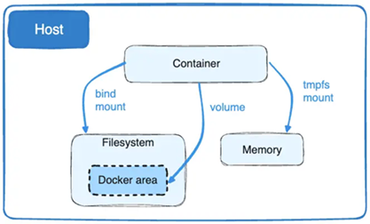

# Sección 09: Docker Networks - Comunicación entre contenedores - Volúmenes

En esta sección, daremos el salto hacia la interconexión de servicios. Dejaremos de ver a los contenedores como islas y
aprenderemos cómo permitir que el `course-service` y el `user-service` hablen entre sí utilizando nombres de host
personalizados.

---

## 🐳 Dockerizando el course-service

Hasta ahora el microservicio `course-service` lo hemos estado trabajando sin dockerizar. En este apartado daremos el
paso de **empaquetarlo dentro de un contenedor Docker**, lo que nos permitirá integrarlo de manera más eficiente en
nuestro ecosistema de microservicios.

Para que el microservicio de cursos funcione correctamente dentro del entorno Docker, debemos realizar ajustes
estratégicos en su configuración de red y conectividad.

### 🚀 En el `course-service`

#### 1. Conexión a la Base de Datos (Host Local)

Como el `course-service` estará dentro de un contenedor, ya no puede usar `localhost` para referirse a la base de datos
que corre en tu máquina física. Docker proporciona un DNS especial `(host.docker.internal)` para este propósito.

Modificación en `application.yml`:

````yml
spring:
  application:
    name: course-service
  datasource:
    # Sustituimos localhost por el puente al host de Docker
    url: jdbc:postgresql://host.docker.internal:5432/db_course_service
````

> Más adelante, veremos cómo dockerizar las bases de datos de `PostgreSQL` y `MySQL` para que tengamos toda la
> aplicación 100% dockerizada.

#### 2. Comunicación entre Microservicios (Service Discovery manual)

El `course-service` consume la API del `user-service` mediante `RestClient`. En un entorno Docker, la comunicación más
eficiente no es a través de IPs, sino a través de **nombres de contenedores.** Por lo tanto, en el
`application.yml` del `course-service` modificamos la url que nos permite comunicarnos con el `user-service`.

````yml
custom:
  user-service:
    # Usamos el nombre del contenedor como Hostname
    base-url: http://c-user-service:8001/api/v1/users
````

🔍 Análisis de la URL:

- `c-user-service`: Es el nombre que asignaremos al contenedor de usuarios mediante la bandera `--name`. Docker
  resolverá este nombre a la IP interna del contenedor automáticamente.
- `Port 8001`: Es el puerto interno (el que definimos en el `EXPOSE` del `Dockerfile`). Es decir, el puerto en el que
  la aplicación `user-service` está escuchando internamente. Cuando los contenedores hablan entre sí dentro de la misma
  red, no necesitan pasar por el mapeo de puertos externo.
- Por defecto, los contenedores se conectan a una red llamada `bridge`, pero esta red no permite la resolución de
  nombres por DNS. Para que los microservicios se encuentren por su nombre `(c-user-service)`, debemos crear nuestra
  propia red personalizada con el comando: `docker network create [nombre_de_la_red]`.

#### 3. Creación del `Dockerfile` para `course-service`

Para mantener la estandarización en nuestro ecosistema de microservicios, el `Dockerfile` del `course-service` sigue la
misma estrategia de optimización basada en capas que implementamos anteriormente.

La única variación técnica relevante es la instrucción `EXPOSE 8002`, que refleja el puerto interno donde escucha este
servicio.

````dockerfile
FROM eclipse-temurin:25-jdk-alpine AS dependencies
WORKDIR /app
COPY ./mvnw ./
COPY ./.mvn ./.mvn
COPY ./pom.xml ./
RUN sed -i -e 's/\r$//' ./mvnw && ./mvnw dependency:go-offline
COPY ./src ./src
RUN ./mvnw clean package -DskipTests

FROM eclipse-temurin:25-jre-alpine AS builder
WORKDIR /app
COPY --from=dependencies /app/target/*.jar ./app.jar
RUN java -Djarmode=layertools -jar app.jar extract

FROM eclipse-temurin:25-jre-alpine AS runner
WORKDIR /app
RUN mkdir ./logs
COPY --from=builder /app/dependencies ./
COPY --from=builder /app/spring-boot-loader ./
COPY --from=builder /app/snapshot-dependencies ./
COPY --from=builder /app/application ./
EXPOSE 8002
ENTRYPOINT ["java", "org.springframework.boot.loader.launch.JarLauncher"]
````

#### 🏗️ Construcción de la Imagen del `course-service`

Ejecutamos el `build` apuntando al contexto del proyecto. Nota cómo `Docker` aprovecha el caché de las etapas
anteriores que habíamos construido en el `user-service` (gracias a que comparten la misma base de `eclipse-temurin`).

````bash
D:\programming\spring\01.udemy\02.andres_guzman\08.docker_kubernetes\docker-kubernetes-2026 (feature/section-9)                                    
$ docker image build -t course-service .\business-domain\course-service                                                                            
[+] Building 102.0s (24/24) FINISHED                                                                                                               
 => [internal] load build definition from Dockerfile                                                                                               
 => => transferring dockerfile: 799B                                                                                                               
 => [internal] load metadata for docker.io/library/eclipse-temurin:25-jdk-alpine                                                                   
 => [internal] load metadata for docker.io/library/eclipse-temurin:25-jre-alpine                                                                   
 => [auth] library/eclipse-temurin:pull token for registry-1.docker.io                                                                             
 => [internal] load .dockerignore                                                                                                                  
 => => transferring context: 234B                                                                                                                  
 => [dependencies 1/8] FROM docker.io/library/eclipse-temurin:25-jdk-alpine@sha256:da683f4f02f9427597d8fa162b73b8222fe08596dcebaf23e4399576ff8b037e
 => [builder 1/4] FROM docker.io/library/eclipse-temurin:25-jre-alpine@sha256:f10d6259d0798c1e12179b6bf3b63cea0d6843f7b09c9f9c9c422c50e44379ec     
 => [internal] load build context                                                                                                                  
 => => transferring context: 56.50kB                                                                                                               
 => CACHED [dependencies 2/8] WORKDIR /app                                                                                                         
 => CACHED [dependencies 3/8] COPY ./mvnw ./                                                                                                       
 => CACHED [dependencies 4/8] COPY ./.mvn ./.mvn                                                                                                   
 => [dependencies 5/8] COPY ./pom.xml ./                                                                                                           
 => [dependencies 6/8] RUN sed -i -e 's/\r$//' ./mvnw && ./mvnw dependency:go-offline                                                              
 => [dependencies 7/8] COPY ./src ./src                                                                                                            
 => [dependencies 8/8] RUN ./mvnw clean package -DskipTests                                                                                        
 => CACHED [builder 2/4] WORKDIR /app                                                                                                              
 => [builder 3/4] COPY --from=dependencies /app/target/*.jar ./app.jar                                                                             
 => [builder 4/4] RUN java -Djarmode=layertools -jar app.jar extract                                                                               
 => CACHED [runner 3/7] RUN mkdir ./logs                                                                                                           
 => [runner 4/7] COPY --from=builder /app/dependencies ./                                                                                          
 => [runner 5/7] COPY --from=builder /app/spring-boot-loader ./                                                                                    
 => [runner 6/7] COPY --from=builder /app/snapshot-dependencies ./                                                                                 
 => [runner 7/7] COPY --from=builder /app/application ./                                                                                           
 => exporting to image                                                                                                                             
 => => exporting layers                                                                                                                            
 => => writing image sha256:722ee6b3b8dacb0171de0125a298119061f2c8ba583ea861368e5badf1b793dc                                                       
 => => naming to docker.io/library/course-service                                                                                                                                                                                                                                                     
````

Una vez finalizado el proceso, confirmamos que la imagen está lista para ser instanciada:

````bash
$ docker image ls -a                                                                     
                                                                                         
IMAGE                                    ID             DISK USAGE   CONTENT SIZE   EXTRA
course-service:latest                    722ee6b3b8da        293MB             0B     
````

### 🚀 En el `user-service`

Para completar la integración, debemos actualizar el `user-service`. Aunque este servicio es independiente, utiliza un
`RestClient` para consultar información en el `course-service`, por lo que debe saber cómo encontrarlo en el
ecosistema `Docker`.

#### Actualización en `application.yml`

Modificamos la URL base para que apunte al nombre del contenedor del servicio de cursos `(c-course-service)`,
utilizando el puerto interno `8002`.

````yml
custom:
  course-service:
    # Apuntamos al nombre que le daremos al contenedor del otro microservicio
    base-url: http://c-course-service:8002/api/v1/courses
````

Donde:

- `c-course-service` es el nombre del contenedor que le asignaremos al microservicio `course-service` al momento de
  crearlo con la bandera `--name` en el comando `docker container run`.

#### 🏗️ Reconstrucción de la Imagen

Dado que hemos modificado archivos de configuración internos, es necesario generar una nueva versión de la imagen
para que incluya estos cambios:

````bash
D:\programming\spring\01.udemy\02.andres_guzman\08.docker_kubernetes\docker-kubernetes-2026 (feature/section-9)                                    
$ docker image build -t user-service .\business-domain\user-service                                                                                
[+] Building 19.1s (24/24) FINISHED                                                                                                                
 => [internal] load build definition from Dockerfile                                                                                               
 => => transferring dockerfile: 799B                                                                                                               
 => [internal] load metadata for docker.io/library/eclipse-temurin:25-jre-alpine                                                                   
 => [internal] load metadata for docker.io/library/eclipse-temurin:25-jdk-alpine                                                                   
 => [auth] library/eclipse-temurin:pull token for registry-1.docker.io                                                                             
 => [internal] load .dockerignore                                                                                                                  
 => => transferring context: 234B                                                                                                                  
 => [dependencies 1/8] FROM docker.io/library/eclipse-temurin:25-jdk-alpine@sha256:da683f4f02f9427597d8fa162b73b8222fe08596dcebaf23e4399576ff8b037e
 => [builder 1/4] FROM docker.io/library/eclipse-temurin:25-jre-alpine@sha256:f10d6259d0798c1e12179b6bf3b63cea0d6843f7b09c9f9c9c422c50e44379ec     
 => [internal] load build context                                                                                                                  
 => => transferring context: 4.27kB                                                                                                                
 => CACHED [dependencies 2/8] WORKDIR /app                                                                                                         
 => CACHED [dependencies 3/8] COPY ./mvnw ./                                                                                                       
 => CACHED [dependencies 4/8] COPY ./.mvn ./.mvn                                                                                                   
 => CACHED [dependencies 5/8] COPY ./pom.xml ./                                                                                                    
 => CACHED [dependencies 6/8] RUN sed -i -e 's/\r$//' ./mvnw && ./mvnw dependency:go-offline                                                       
 => [dependencies 7/8] COPY ./src ./src                                                                                                            
 => [dependencies 8/8] RUN ./mvnw clean package -DskipTests                                                                                        
 => CACHED [builder 2/4] WORKDIR /app                                                                                                              
 => [builder 3/4] COPY --from=dependencies /app/target/*.jar ./app.jar                                                                             
 => [builder 4/4] RUN java -Djarmode=layertools -jar app.jar extract                                                                               
 => CACHED [runner 3/7] RUN mkdir ./logs                                                                                                           
 => CACHED [runner 4/7] COPY --from=builder /app/dependencies ./                                                                                   
 => CACHED [runner 5/7] COPY --from=builder /app/spring-boot-loader ./                                                                             
 => CACHED [runner 6/7] COPY --from=builder /app/snapshot-dependencies ./                                                                          
 => [runner 7/7] COPY --from=builder /app/application ./                                                                                           
 => exporting to image                                                                                                                             
 => => exporting layers                                                                                                                            
 => => writing image sha256:888de4658d0e884ef31200d6661751f929d3b840091c92a2bafd587f0c883ee7                                                       
 => => naming to docker.io/library/user-service                                                                                                    
````

#### 🔍 Estado actual de nuestras imágenes

En este punto, ya tenemos preparadas nuestras dos piezas fundamentales:

````bash
$ docker image ls -a                                                                     
                                                                                         
IMAGE                                    ID             DISK USAGE   CONTENT SIZE   EXTRA
course-service:latest                    722ee6b3b8da        293MB             0B        
user-service:latest                      888de4658d0e        294MB             0B        
````

### 💡 Resumen de la Arquitectura de Red

| Microservicio    | Puerto Interno | Host Destino (Docker Network) | Variable de Conexión             |
|------------------|----------------|-------------------------------|----------------------------------|
| `user-service`   | `8001`         | `c-course-service:8002`       | `custom.course-service.base-url` |
| `course-service` | `8002`         | `c-user-service:8001`         | `custom.user-service.base-url`   |

#### ¿Por qué usamos nombres y no IPs?

En Docker, las direcciones IP de los contenedores son dinámicas (cambian cada vez que reinicias un contenedor). Sin
embargo, el nombre del contenedor actúa como un dominio fijo gracias al servidor DNS interno de Docker, lo que hace que
nuestra configuración sea robusta y no dependa de IPs variables.

> 💡 `Nota`: Dentro de una red Docker, los microservicios se comunican usando el `nombre del contenedor como hostname`,
> no `localhost`. Usar `localhost` dentro de un contenedor haría que el servicio intente llamarse a sí mismo en lugar
> de buscar al otro microservicio.

## 🌐 Configuración de la Red (Docker Network)

Para que nuestros microservicios puedan interactuar, necesitamos entender cómo gestiona Docker la conectividad. Por
defecto, Docker ofrece tres tipos de redes iniciales.

### 1. Visualización de Redes Predeterminadas

Ejecutamos el siguiente comando para listar las redes actuales en nuestro motor de Docker:

````bash
$ docker network ls
NETWORK ID     NAME      DRIVER    SCOPE
869c89f02390   bridge    bridge    local
e067f6421fbb   host      host      local
10b2c1c97ecf   none      null      local
````

#### 🔍 Análisis de los Drivers:

- `bridge`: Red por defecto para contenedores; permite acceso a internet y comunicación entre contenedores conectados,
  pero `no resuelve nombres de contenedores automáticamente`.
- `host`: El contenedor comparte la red del host, sin aislamiento de red; útil para aplicaciones que necesitan el mismo
  stack de red del sistema anfitrión.
- `none`: El contenedor no tiene acceso a ninguna red; se usa cuando necesitas un contenedor completamente aislado a
  nivel de red.

### 2. Creación de una Red Personalizada: `docker-k8s-net`

Para habilitar el `Service Discovery` (descubrimiento de servicios por nombre), crearemos nuestra propia red.
Esto activa automáticamente un servidor DNS interno de Docker.

````bash
$ docker network create docker-k8s-net
5adf961ce02ce5f05aaa83a51c02b1284f55ecbc8028c473ef7d29c3d2165dab
````

Al listar nuevamente, confirmamos su existencia:

````bash
$ docker network ls
NETWORK ID     NAME             DRIVER    SCOPE
869c89f02390   bridge           bridge    local
5adf961ce02c   docker-k8s-net   bridge    local
e067f6421fbb   host             host      local
10b2c1c97ecf   none             null      local
````

💡 Nota:
> Si no creas explícitamente una red en `Docker`, los contenedores se ejecutan en una red por defecto llamada `bridge`.
> Esta red es la configuración estándar para contenedores que no se asocian a una red personalizada. Esta red permite
> acceso a internet, pero `no permite la resolución de nombres entre contenedores`.
>
> Por lo tanto, si deseamos que nuestros contenedores se comuniquen usando sus nombres
> (como `http://c-user-service:8001`), es recomendable usar una red personalizada. En nuestro caso, la red
> personalizada que creamos es `docker-k8s-net`.
>
> ✅ Ambas redes son tipo `bridge`, pero se comportan distinto por diseño.
>
> - La red por defecto llamado `bridge` no habilita un sistema de resolución de nombres entre contenedores. Es una red
    "mínima" pensada para contenedores simples o pruebas rápidas. Los contenedores conectados a esta red no pueden
    resolverse por su nombre (`--name`), `solo se ven por IP`. Por eso, para que dos contenedores se comuniquen en esta
    red, tendrías que pasarles la IP del otro (lo cual es frágil y no recomendable).
>
>
> - La red `bridge personalizada` (como `docker-k8s-net`), es creada por nosotros mismos con el comando
    `docker network create`. Docker configura automáticamente `un DNS interno` para esta red. Este DNS
    `resuelve los nombres de los contenedores` en esa red. Los contenedores `sí pueden comunicarse usando sus nombres`
    (los que defines con `--name`), como si fuera un mini sistema de nombres interno.

## 🚀 Comunicación entre contenedores

Con la red `docker-k8s-net` ya creada, procederemos a instanciar nuestros microservicios asegurándonos de que ambos
"hablen el mismo idioma" dentro del mismo segmento de red.

### 📦 1. Creación de Contenedores con Red Personalizada

Utilizaremos la bandera `--network` para vincular los contenedores a nuestra red y `--name` para establecer los
hostnames que configuramos previamente en los archivos `.yml`.

#### 🅰️ Levantar `user-service` (Puerto 8001)

````bash
$ docker container run -d -p 8001:8001 --rm --name c-user-service --network docker-k8s-net user-service
b0a50cc92492d9656a2453fd50a578d344eba10a4f537433c71c0782d19b17a6
````

#### 🅱️ Levantar `course-service` (Puerto 8002)

````bash
$ docker container run -d -p 8002:8002 --rm --name c-course-service --network docker-k8s-net course-service
4c574004284b79fbbdc200686eee03c7d6aded8bb1dd7eb393b32c664cc97de7
````

### 🔍 2. Inspección de la Red y Verificación de Estado

Es una buena práctica verificar que Docker ha asignado correctamente los contenedores a la red y que estos se
encuentran en ejecución.

- `Validar Conectividad`: Al inspeccionar `docker-k8s-net`, en la sección `Containers`, veremos las IPs internas
  (ej. `172.18.0.2` y `172.18.0.3`) y sus nombres asociados.

````bash
$ docker network inspect docker-k8s-net
[
    {
        "Name": "docker-k8s-net",
        "Id": "5adf961ce02ce5f05aaa83a51c02b1284f55ecbc8028c473ef7d29c3d2165dab",
        "Created": "2026-03-30T22:06:10.026789373Z",
        "Scope": "local",
        "Driver": "bridge",
        "EnableIPv4": true,
        "EnableIPv6": false,
        "IPAM": {
            "Driver": "default",
            "Options": {},
            "Config": [
                {
                    "Subnet": "172.18.0.0/16",
                    "Gateway": "172.18.0.1"
                }
            ]
        },
        "Internal": false,
        "Attachable": false,
        "Ingress": false,
        "ConfigFrom": {
            "Network": ""
        },
        "ConfigOnly": false,
        "Options": {
            "com.docker.network.enable_ipv4": "true",
            "com.docker.network.enable_ipv6": "false"
        },
        "Labels": {},
        "Containers": {
            "4c574004284b79fbbdc200686eee03c7d6aded8bb1dd7eb393b32c664cc97de7": {
                "Name": "c-course-service",
                "EndpointID": "c68bf3beeb62a3513626016431bd3d4d21e9837089518be4314e3701e83f84ff",
                "MacAddress": "e2:0b:93:a2:9f:68",
                "IPv4Address": "172.18.0.3/16",
                "IPv6Address": ""
            },
            "b0a50cc92492d9656a2453fd50a578d344eba10a4f537433c71c0782d19b17a6": {
                "Name": "c-user-service",
                "EndpointID": "0bef728f8edac58bb8b53118f168f4e3da4a6745aac598671d331cc03def7d44",
                "MacAddress": "6e:c6:8d:a5:be:1e",
                "IPv4Address": "172.18.0.2/16",
                "IPv6Address": ""
            }
        },
        "Status": {
            "IPAM": {
                "Subnets": {
                    "172.18.0.0/16": {
                        "IPsInUse": 5,
                        "DynamicIPsAvailable": 65531
                    }
                }
            }
        }
    }
]
````

- Después de crear los contenedores, los podemos listar para ver que están levantados correctamente con status `Up`.

````bash
$ docker container ls -a
CONTAINER ID   IMAGE            COMMAND                  CREATED              STATUS              PORTS                                         NAMES
4c574004284b   course-service   "java org.springfram…"   About a minute ago   Up About a minute   0.0.0.0:8002->8002/tcp, [::]:8002->8002/tcp   c-course-service
b0a50cc92492   user-service     "java org.springfram…"   2 minutes ago        Up 2 minutes        0.0.0.0:8001->8001/tcp, [::]:8001->8001/tcp   c-user-service
````

### 🧪 3. Pruebas de Integración (End-to-End)

Para confirmar que la comunicación bidireccional es exitosa, realizaremos peticiones al `course-service`.
Este servicio, a su vez, consultará internamente al `user-service`.

#### A. Obtener un curso con sus usuarios (Lectura)

Al solicitar un curso con el parámetro `loadRelations=true`, el contenedor `c-course-service` busca internamente a
`c-user-service` para completar la información.

````bash
$ curl -v -G --data "loadRelations=true" http://localhost:8002/api/v1/courses/1 | jq
>
< HTTP/1.1 200
< Content-Type: application/json
< Transfer-Encoding: chunked
< Date: Mon, 30 Mar 2026 22:33:50 GMT
<
{
  "id": 1,
  "name": "Spring Boot",
  "users": [
    {
      "id": 8,
      "name": "Milagros",
      "email": "milagros@gmail.com",
      "password": "123456"
    }
  ]
}
````

#### B. Asignar un usuario a un curso (Escritura)

Probamos el flujo de creación enviando un JSON al endpoint de cursos:

````bash
$ curl -v -X POST -H "Content-Type: application/json" -d "{\"name\": \"Lesly\", \"email\": \"lesly@gmail.com\", \"password\": \"123456\"}" http://localhost:8002/api/v1/courses/2/users | jq
>
< HTTP/1.1 201
< Content-Type: application/json
< Transfer-Encoding: chunked
< Date: Mon, 30 Mar 2026 22:34:35 GMT
<
{
  "id": 9,
  "name": "Lesly",
  "email": "lesly@gmail.com",
  "password": "123456"
} 
````

### ✅ Conclusión del apartado

La comunicación ha sido exitosa.

- **Desde fuera de Docker:** Nosotros accedemos vía `localhost:8001` / `localhost:8002`.
- **Dentro de Docker:** Los contenedores se encuentran y colaboran usando sus nombres
  `(c-user-service, c-course-service)`, gracias al puente DNS de nuestra red personalizada.

**Dato Clave:** Si detienes cualquiera de los contenedores (debido al flag `--rm`), estos se eliminarán automáticamente,
pero la red `docker-k8s-net` persistirá hasta que decidas borrarla manualmente.

## 🗄️ Dockerizando MySQL (Persistencia de Datos)

Hasta ahora, nuestro `user-service` dependía de un servidor MySQL instalado físicamente en la máquina host.
El objetivo ahora es "contenerizar" la base de datos para que toda nuestra arquitectura sea portable y viva
dentro de `Docker`.

### 1. Obtención de la Imagen Oficial

Primero, descargamos la imagen específica desde [Docker Hub.](https://hub.docker.com/).
Usaremos una versión basada en Debian por su estabilidad.

````bash
$ docker pull mysql:8.0.41-debian
````

Si listamos las imágenes, veremos que entre ellas está la imagen bajada de `MySQL`. Por defecto la imagen se baja
desde la plataforma de

````bash 
$ docker image ls -a                                                                      
                                                                                          
IMAGE                                    ID             DISK USAGE   CONTENT SIZE   EXTRA 
course-service:latest                    722ee6b3b8da        293MB             0B    U    
mysql:8.0.41-debian                      4340b8ad7a7c        610MB             0B              
user-service:latest                      888de4658d0e        294MB             0B    U    
````

### 2. Despliegue del Contenedor `c-mysql`

Para que el contenedor sea funcional y seguro, debemos configurar sus credenciales y red mediante variables de entorno
`-e (--env)`.

````bash
$ docker container run -d -p 3307:3306 --name c-mysql -e MYSQL_DATABASE=db_user_service -e MYSQL_ROOT_PASSWORD=magadiflo -e MYSQL_USER=admin -e MYSQL_PASSWORD=magadiflo --network docker-k8s-net --restart=unless-stopped mysql:8.0.41-debian
ee8a69f16f56116a741e588bdf644a1c7118cb7241197ce34adeb20690d66097
````

**Donde**

- `-p 3307:3306`, mapeamos el puerto interno estándar `(3306)` al puerto host `3307`. Esto evita conflictos si ya
  tienes otro MySQL corriendo localmente en el `3306`.
- `--name c-mysql`, le damos un nombre al contenedor.
- `--network docker-k8s-net`, fundamental para que el microservicio `user-service` pueda encontrar la base de datos
  usando el nombre `c-mysql`.
- `-e (--env)`, nos permite establecer variables de entorno. Cada variable de entorno a definir, debe estar precedido
  por la bandera `-e` o `--env`.
- `--restart=unless-stopped`, garantiza que si el servidor se reinicia, la base de datos se levante automáticamente, a
  menos que la hayamos detenido nosotros manualmente.

> 💡 Nota  
> Persistencia Volátil: Actualmente, si eliminamos este contenedor, perderemos todos los datos. Esto sucede porque no
> hemos mapeado un Volumen de Docker todavía. Lo veremos más adelante.

**Importante**

- Usuario y contraseña personalizados
    - La imagen oficial de `MySQL` permite crear un usuario adicional (en este caso `admin`) mediante las variables
      `MYSQL_USER` y `MYSQL_PASSWORD`.
    - Este usuario tiene acceso a la base de datos indicada en `MYSQL_DATABASE` (`db_user_service`).
    - La configuración de `MYSQL_ROOT_PASSWORD` es obligatoria aunque usemos un usuario personalizado, porque la imagen
      necesita definir siempre la contraseña del usuario `root` al iniciarse.
- Si no se especifica un volumen, los datos almacenados en la base de datos se perderán al eliminar el contenedor, ya
  que `MySQL` guarda sus datos en el sistema de archivos interno del contenedor, el cual se destruye al eliminarlo.

### 3. Verificación del Ecosistema

Al listar los contenedores, ahora deberíamos tener la "triada" de servicios corriendo en armonía:

````bash
$ docker container ls -a
CONTAINER ID   IMAGE                 COMMAND                  CREATED          STATUS          PORTS                                         NAMES
ee8a69f16f56   mysql:8.0.41-debian   "docker-entrypoint.s…"   8 minutes ago    Up 7 minutes    0.0.0.0:3307->3306/tcp, [::]:3307->3306/tcp   c-mysql
4c574004284b   course-service        "java org.springfram…"   36 minutes ago   Up 36 minutes   0.0.0.0:8002->8002/tcp, [::]:8002->8002/tcp   c-course-service
b0a50cc92492   user-service          "java org.springfram…"   37 minutes ago   Up 37 minutes   0.0.0.0:8001->8001/tcp, [::]:8001->8001/tcp   c-user-service
````

Verificamos si podemos conectarnos desde `DBeaver` hacia nuestro `MySql` contenerizado que se está ejecutando en
el puerto externo `3307`. El resultado debe ser una conexión exitosa.


> ⚠️ **Importante**  
> Si nos sale el siguiente error cuando nos conectamos con `DBeaver` al contenedor de `MySQL`:  
> `MySQL : Public Key Retrieval is not allowed` lo que debemos hacer es una configuración en el `DBeaver`.
>
> Vamos a `Ajustes de conexión/Driver properties/allowPublicKeyRetrieval = true`.
>
> [StackOverflow](https://stackoverflow.com/questions/50379839/connection-java-mysql-public-key-retrieval-is-not-allowed)

## 🐘 Dockerizando PostgreSQL

Siguiendo la misma estrategia que con MySQL, ahora contenerizaremos la base de datos `PostgreSQL` para el
`course-service`.

### 1. Despliegue Directo del Contenedor

A diferencia del paso anterior, no ejecutaremos `docker pull` por separado. `Docker` es lo suficientemente inteligente
para detectar si la imagen existe localmente; si no la encuentra, la descargará automáticamente antes de iniciar el
contenedor.

````bash
$ docker container run -d -p 5433:5432 --name c-postgres -e POSTGRES_DB=db_course_service -e POSTGRES_USER=postgres -e POSTGRES_PASSWORD=magadiflo --network docker-k8s-net --restart=unless-stopped postgres:17-alpine
````

**Donde**

- `-p 5433:5432`.
    - `5433`, puerto expuesto en el host (`pc local`).
    - `5432`, puerto interno del contenedor (puerto por defecto de `PostgreSQL`).
- `--name c-postgres`, le damos un nombre al contenedor.
- `--network docker-k8s-net`, lo agregamos a la red donde están los otros tres microservicios.
- `-e (--env)`, nos permite establecer variables de entorno. Cada variable de entorno a definir, debe estar precedido
  por la bandera `-e` o `--env`.
- `--restart=unless-stopped`, garantiza que si el servidor se reinicia, la base de datos se levante automáticamente, a
  menos que la hayamos detenido nosotros manualmente.

### 2. Verificación del Ecosistema Completo

Ahora disponemos de cuatro contenedores colaborando en la red `docker-k8s-net`. Es fundamental que todos compartan la
misma red para que la resolución de nombres funcione.

````bash
$ docker container ls -a
CONTAINER ID   IMAGE                 COMMAND                  CREATED          STATUS          PORTS                                         NAMES
cc68a87fca96   course-service        "java org.springfram…"   9 seconds ago    Up 3 seconds    0.0.0.0:8002->8002/tcp, [::]:8002->8002/tcp   c-course-service
a5453c29d7e0   user-service          "java org.springfram…"   14 seconds ago   Up 8 seconds    0.0.0.0:8001->8001/tcp, [::]:8001->8001/tcp   c-user-service
f96bb87760e6   postgres:17-alpine    "docker-entrypoint.s…"   2 minutes ago    Up 2 minutes    0.0.0.0:5433->5432/tcp, [::]:5433->5432/tcp   c-postgres
ee8a69f16f56   mysql:8.0.41-debian   "docker-entrypoint.s…"   22 hours ago     Up 34 minutes   0.0.0.0:3307->3306/tcp, [::]:3307->3306/tcp   c-mysql
````

### 🛠️ Prueba de Conexión Externa (DBeaver)

Para gestionar los datos desde nuestra máquina host, configuramos la conexión en `DBeaver` apuntando al puerto `5433`.


Recordatorio de Red:

- Desde `DBeaver`: Usar `localhost:5433`.
- Desde el `course-service` (interno): Usar `c-postgres:5432`.

## 🔗 Comunicación entre Microservicios y Bases de Datos Contenerizadas

En esta etapa, cerraremos el ciclo de integración configurando nuestras aplicaciones para que operen exclusivamente
dentro del entorno de red de Docker, eliminando cualquier dependencia de servicios instalados localmente en el host.

### 🛰️ Configuración en `course-service`

#### 1. Actualización de la URL de Conexión

Debemos modificar el archivo `application.yml` del microservicio para que apunte al nuevo contenedor de PostgreSQL
`(c-postgres)`. Es vital que las credenciales coincidan exactamente con las definidas en el comando
`docker container run` del apartado anterior.

````yml
spring:
  application:
    name: course-service
  datasource:
    # Cambiamos 'host.docker.internal' por el nombre del contenedor 'c-postgres'
    url: jdbc:postgresql://c-postgres:5432/db_course_service
    username: postgres
    password: magadiflo
````

> El cambio de DNS: Al estar ambos contenedores en la red `docker-k8s-net`, el contenedor de la aplicación ya no
> necesita "salir" al host para buscar la base de datos. Ahora utiliza la resolución de nombres interna de Docker
> para localizar a `c-postgres` en el puerto estándar `5432`.

#### 2. Reconstrucción de la Imagen

Cualquier cambio en los archivos de configuración `(src/main/resources)` requiere generar una nueva imagen para que el
artefacto `.jar` final contenga los parámetros de conexión actualizados.

````bash
D:\programming\spring\01.udemy\02.andres_guzman\08.docker_kubernetes\docker-kubernetes-2026 (feature/section-9)                                    
$ docker image build -t course-service .\business-domain\course-service                                                                            
[+] Building 17.0s (24/24) FINISHED                                                                                                                
 => [internal] load build definition from Dockerfile                                                                                               
 => => transferring dockerfile: 799B                                                                                                               
 => [internal] load metadata for docker.io/library/eclipse-temurin:25-jre-alpine                                                                   
 => [internal] load metadata for docker.io/library/eclipse-temurin:25-jdk-alpine                                                                   
 => [auth] library/eclipse-temurin:pull token for registry-1.docker.io                                                                             
 => [internal] load .dockerignore                                                                                                                  
 => => transferring context: 234B                                                                                                                  
 => [dependencies 1/8] FROM docker.io/library/eclipse-temurin:25-jdk-alpine@sha256:da683f4f02f9427597d8fa162b73b8222fe08596dcebaf23e4399576ff8b037e
 => [internal] load build context                                                                                                                  
 => => transferring context: 4.29kB                                                                                                                
 => [builder 1/4] FROM docker.io/library/eclipse-temurin:25-jre-alpine@sha256:f10d6259d0798c1e12179b6bf3b63cea0d6843f7b09c9f9c9c422c50e44379ec     
 => CACHED [dependencies 2/8] WORKDIR /app                                                                                                         
 => CACHED [dependencies 3/8] COPY ./mvnw ./                                                                                                       
 => CACHED [dependencies 4/8] COPY ./.mvn ./.mvn                                                                                                   
 => CACHED [dependencies 5/8] COPY ./pom.xml ./                                                                                                    
 => CACHED [dependencies 6/8] RUN sed -i -e 's/\r$//' ./mvnw && ./mvnw dependency:go-offline                                                       
 => [dependencies 7/8] COPY ./src ./src                                                                                                            
 => [dependencies 8/8] RUN ./mvnw clean package -DskipTests                                                                                        
 => CACHED [builder 2/4] WORKDIR /app                                                                                                              
 => [builder 3/4] COPY --from=dependencies /app/target/*.jar ./app.jar                                                                             
 => [builder 4/4] RUN java -Djarmode=layertools -jar app.jar extract                                                                               
 => CACHED [runner 3/7] RUN mkdir ./logs                                                                                                           
 => CACHED [runner 4/7] COPY --from=builder /app/dependencies ./                                                                                   
 => CACHED [runner 5/7] COPY --from=builder /app/spring-boot-loader ./                                                                             
 => CACHED [runner 6/7] COPY --from=builder /app/snapshot-dependencies ./                                                                          
 => [runner 7/7] COPY --from=builder /app/application ./                                                                                           
 => exporting to image                                                                                                                             
 => => exporting layers                                                                                                                            
 => => writing image sha256:479ef3834a403c80c3d5cb809354231e3c0fb1c97b2fa09d32fa238af674ffd8                                                       
 => => naming to docker.io/library/course-service                                                                                                  
````

> **Nota sobre la eficiencia del Build:**  
> Como puedes ver en tu salida de consola, Docker utiliza el sistema de capas (CACHED). Solo se vuelven a ejecutar las
> capas a partir de la copia de los archivos fuente y el empaquetado de Maven, lo que hace que este proceso sea
> mucho más rápido que la primera construcción.

#### 3. Despliegue del Nuevo Contenedor

Una vez actualizada la imagen con los nuevos parámetros de conexión, debemos sustituir el contenedor antiguo. Si el
contenedor anterior seguía activo, procedemos a detenerlo y eliminarlo para liberar el nombre `c-course-service` y el
puerto `8002`.

Luego, ejecutamos el comando de creación vinculándolo a nuestra red personalizada:

````bash
$ docker container run -d -p 8002:8002 --name c-course-service --network docker-k8s-net course-service
d460b442ed19c9d71a8c7d413b41aee9890509596c1a9d2e6a87d5e0cb29800b
````

> Al no usar la bandera `--rm` en este comando, el contenedor persistirá en el sistema aunque se detenga.
> Si prefieres un entorno de pruebas limpio, recuerda que puedes añadirla.

#### 4. Auditoría de la Red `docker-k8s-net`

Es el momento de verificar la "topología" de nuestra arquitectura. Al inspeccionar la red, debemos confirmar que
los cuatro componentes principales están coexistiendo en el mismo segmento de red `(172.18.0.x)`.

````bash
$ docker network inspect docker-k8s-net
[
    {
        "Name": "docker-k8s-net",
        "Id": "5adf961ce02ce5f05aaa83a51c02b1284f55ecbc8028c473ef7d29c3d2165dab",
        "Created": "2026-03-30T22:06:10.026789373Z",
        "Scope": "local",
        "Driver": "bridge",
        "EnableIPv4": true,
        "EnableIPv6": false,
        "IPAM": {
            "Driver": "default",
            "Options": {},
            "Config": [
                {
                    "Subnet": "172.18.0.0/16",
                    "Gateway": "172.18.0.1"
                }
            ]
        },
        "Internal": false,
        "Attachable": false,
        "Ingress": false,
        "ConfigFrom": {
            "Network": ""
        },
        "ConfigOnly": false,
        "Options": {
            "com.docker.network.enable_ipv4": "true",
            "com.docker.network.enable_ipv6": "false"
        },
        "Labels": {},
        "Containers": {
            "a5453c29d7e01baff9f4e85d008591ae0b2dcd431dcad7bf9e4404c3f894f785": {
                "Name": "c-user-service",
                "EndpointID": "4a531800956bf374808baabb86b2688e42dbf6aea7e1e84a7d0e53fa14137398",
                "MacAddress": "72:ea:6d:2d:eb:6d",
                "IPv4Address": "172.18.0.4/16",
                "IPv6Address": ""
            },
            "d460b442ed19c9d71a8c7d413b41aee9890509596c1a9d2e6a87d5e0cb29800b": {
                "Name": "c-course-service",
                "EndpointID": "ce500bf0dbe120b0d1da08f9feb510b5791ca547ac15c9d013523ceea143a69e",
                "MacAddress": "e6:5c:bc:44:4f:69",
                "IPv4Address": "172.18.0.5/16",
                "IPv6Address": ""
            },
            "ee8a69f16f56116a741e588bdf644a1c7118cb7241197ce34adeb20690d66097": {
                "Name": "c-mysql",
                "EndpointID": "298ef1bce84b5abe1f7aefd1ce2ebced87d3c9e209f718ffb24f8b0ccde7dc35",
                "MacAddress": "de:e1:27:b8:b3:a9",
                "IPv4Address": "172.18.0.2/16",
                "IPv6Address": ""
            },
            "f96bb87760e667b84a29d06f4279ab8d0b405a8c092124b0d4c3396886ddd1ca": {
                "Name": "c-postgres",
                "EndpointID": "7251223f4e9085771bfb3d30fb47ccf8eb50eb96a15e71f66c1d530a4bdc7b00",
                "MacAddress": "96:0c:fd:20:85:75",
                "IPv4Address": "172.18.0.3/16",
                "IPv6Address": ""
            }
        },
        "Status": {
            "IPAM": {
                "Subnets": {
                    "172.18.0.0/16": {
                        "IPsInUse": 7,
                        "DynamicIPsAvailable": 65529
                    }
                }
            }
        }
    }
]
````

Estado actual de la red:

| Contenedor         | IP Asignada  | Función                                     |
|--------------------|--------------|---------------------------------------------|
| `c-mysql`          | `172.18.0.2` | Base de Datos (User Service)                |
| `c-postgres`       | `172.18.0.3` | Base de Datos (Course Service)              |
| `c-user-service`   | `172.18.0.4` | Microservicio (Pendiente actualización DNS) |
| `c-course-service` | `172.18.0.5` | Microservicio (Actualizado y Conectado)     |

Como se observa en el JSON de inspección, cada contenedor tiene ahora su propia IP interna y MacAddress. Sin embargo,
lo más importante es que `c-course-service` ya puede resolver el nombre `c-postgres` directamente a través de este
puente de red.

#### 5. Validación mediante Logs de Spring Boot

Al revisar los logs del contenedor, confirmamos que Hibernate ha reconocido la base de datos de `PostgreSQL`
y ha procedido a la creación del esquema (tablas y restricciones) gracias a la propiedad `ddl-auto: update`.

````bash
$ docker container logs c-course-service

  .   ____          _            __ _ _
 /\\ / ___'_ __ _ _(_)_ __  __ _ \ \ \ \
( ( )\___ | '_ | '_| | '_ \/ _` | \ \ \ \
 \\/  ___)| |_)| | | | | || (_| |  ) ) ) )
  '  |____| .__|_| |_|_| |_\__, | / / / /
 =========|_|==============|___/=/_/_/_/

 :: Spring Boot ::                (v4.0.3)

2026-03-31T21:10:41.533Z  INFO 1 --- [course-service] [           main] d.m.course.app.CourseServiceApplication  : Starting CourseServiceApplication v0.0.1-SNAPSHOT using Java 25.0.2 with PID 1 (/app/BOOT-INF/classes started by root in /app)
2026-03-31T21:10:41.537Z DEBUG 1 --- [course-service] [           main] d.m.course.app.CourseServiceApplication  : Running with Spring Boot v4.0.3, Spring v7.0.5
2026-03-31T21:10:41.538Z  INFO 1 --- [course-service] [           main] d.m.course.app.CourseServiceApplication  : No active profile set, falling back to 1 default profile: "default"
2026-03-31T21:10:42.466Z  INFO 1 --- [course-service] [           main] .s.d.r.c.RepositoryConfigurationDelegate : Bootstrapping Spring Data JPA repositories in DEFAULT mode.
2026-03-31T21:10:42.548Z  INFO 1 --- [course-service] [           main] .s.d.r.c.RepositoryConfigurationDelegate : Finished Spring Data repository scanning in 62 ms. Found 2 JPA repository interfaces.
2026-03-31T21:10:42.893Z  INFO 1 --- [course-service] [           main] o.s.cloud.context.scope.GenericScope     : BeanFactory id=df7cd64a-db97-346b-9df4-419e20f82210
2026-03-31T21:10:43.505Z  INFO 1 --- [course-service] [           main] o.s.boot.tomcat.TomcatWebServer          : Tomcat initialized with port 8002 (http)
2026-03-31T21:10:43.523Z  INFO 1 --- [course-service] [           main] o.apache.catalina.core.StandardService   : Starting service [Tomcat]
2026-03-31T21:10:43.524Z  INFO 1 --- [course-service] [           main] o.apache.catalina.core.StandardEngine    : Starting Servlet engine: [Apache Tomcat/11.0.18]
2026-03-31T21:10:43.578Z  INFO 1 --- [course-service] [           main] b.w.c.s.WebApplicationContextInitializer : Root WebApplicationContext: initialization completed in 1952 ms
2026-03-31T21:10:44.037Z  INFO 1 --- [course-service] [           main] org.hibernate.orm.jpa                    : HHH008540: Processing PersistenceUnitInfo [name: default]
2026-03-31T21:10:44.165Z  INFO 1 --- [course-service] [           main] org.hibernate.orm.core                   : HHH000001: Hibernate ORM core version 7.2.4.Final
2026-03-31T21:10:44.846Z  INFO 1 --- [course-service] [           main] o.s.o.j.p.SpringPersistenceUnitInfo      : No LoadTimeWeaver setup: ignoring JPA class transformer
2026-03-31T21:10:44.888Z  INFO 1 --- [course-service] [           main] com.zaxxer.hikari.HikariDataSource       : HikariPool-1 - Starting...
2026-03-31T21:10:45.088Z  INFO 1 --- [course-service] [           main] com.zaxxer.hikari.pool.HikariPool        : HikariPool-1 - Added connection org.postgresql.jdbc.PgConnection@416c1b0
2026-03-31T21:10:45.089Z  INFO 1 --- [course-service] [           main] com.zaxxer.hikari.HikariDataSource       : HikariPool-1 - Start completed.
2026-03-31T21:10:45.176Z  INFO 1 --- [course-service] [           main] org.hibernate.orm.connections.pooling    : HHH10001005: Database info:
        Database JDBC URL [jdbc:postgresql://c-postgres:5432/db_course_service]
        Database driver: PostgreSQL JDBC Driver
        Database dialect: PostgreSQLDialect
        Database version: 17.5
        Default catalog/schema: db_course_service/public
        Autocommit mode: undefined/unknown
        Isolation level: READ_COMMITTED [default READ_COMMITTED]
        JDBC fetch size: none
        Pool: DataSourceConnectionProvider
        Minimum pool size: undefined/unknown
        Maximum pool size: undefined/unknown
2026-03-31T21:10:46.308Z  INFO 1 --- [course-service] [           main] org.hibernate.orm.core                   : HHH000489: No JTA platform available (set 'hibernate.transaction.jta.platform' to enable JTA platform integration)
2026-03-31T21:10:46.383Z DEBUG 1 --- [course-service] [           main] org.hibernate.SQL                        :
    create table course_users (
        id bigint generated by default as identity,
        user_id bigint not null,
        course_id bigint,
        primary key (id)
    )
2026-03-31T21:10:46.402Z DEBUG 1 --- [course-service] [           main] org.hibernate.SQL                        :
    create table courses (
        id bigint generated by default as identity,
        name varchar(255) not null,
        primary key (id)
    )
2026-03-31T21:10:46.407Z DEBUG 1 --- [course-service] [           main] org.hibernate.SQL                        :
    alter table if exists course_users
       drop constraint if exists UKkdhhgtn4xoxgggdkh5fooi5i7
2026-03-31T21:10:46.412Z  WARN 1 --- [course-service] [           main] org.hibernate.orm.jdbc.warn              : HHH000247: ErrorCode: 0, SQLState: 00000
2026-03-31T21:10:46.412Z  WARN 1 --- [course-service] [           main] org.hibernate.orm.jdbc.warn              : constraint "ukkdhhgtn4xoxgggdkh5fooi5i7" of relation "course_users" does not exist, skipping
2026-03-31T21:10:46.413Z DEBUG 1 --- [course-service] [           main] org.hibernate.SQL                        :
    alter table if exists course_users
       add constraint UKkdhhgtn4xoxgggdkh5fooi5i7 unique (user_id)
2026-03-31T21:10:46.416Z DEBUG 1 --- [course-service] [           main] org.hibernate.SQL                        :
    alter table if exists courses
       drop constraint if exists UK5o6x4fpafbywj4v2g0owhh11r
2026-03-31T21:10:46.418Z  WARN 1 --- [course-service] [           main] org.hibernate.orm.jdbc.warn              : HHH000247: ErrorCode: 0, SQLState: 00000
2026-03-31T21:10:46.418Z  WARN 1 --- [course-service] [           main] org.hibernate.orm.jdbc.warn              : constraint "uk5o6x4fpafbywj4v2g0owhh11r" of relation "courses" does not exist, skipping
2026-03-31T21:10:46.418Z DEBUG 1 --- [course-service] [           main] org.hibernate.SQL                        :
    alter table if exists courses
       add constraint UK5o6x4fpafbywj4v2g0owhh11r unique (name)
2026-03-31T21:10:46.422Z DEBUG 1 --- [course-service] [           main] org.hibernate.SQL                        :
    alter table if exists course_users
       add constraint FKcax8xujvganv6xl9ra0sgouem
       foreign key (course_id)
       references courses
2026-03-31T21:10:46.429Z  INFO 1 --- [course-service] [           main] j.LocalContainerEntityManagerFactoryBean : Initialized JPA EntityManagerFactory for persistence unit 'default'
2026-03-31T21:10:46.732Z  INFO 1 --- [course-service] [           main] o.s.d.j.r.query.QueryEnhancerFactories   : Hibernate is in classpath; If applicable, HQL parser will be used.
2026-03-31T21:10:52.286Z  WARN 1 --- [course-service] [           main] JpaBaseConfiguration$JpaWebConfiguration : spring.jpa.open-in-view is enabled by default. Therefore, database queries may be performed during view rendering. Explicitly configure spring.jpa.open-in-view to disable this warning
2026-03-31T21:10:47.271Z  INFO 1 --- [course-service] [           main] o.s.b.a.e.web.EndpointLinksResolver      : Exposing 1 endpoint beneath base path '/actuator'
2026-03-31T21:10:47.373Z  INFO 1 --- [course-service] [           main] o.s.boot.tomcat.TomcatWebServer          : Tomcat started on port 8002 (http) with context path '/'
2026-03-31T21:10:47.387Z  INFO 1 --- [course-service] [           main] d.m.course.app.CourseServiceApplication  : Started CourseServiceApplication in 6.64 seconds (process running for 8.654)
````

Puntos clave detectados en el log:

- `Conexión Exitosa`: `HikariPool-1` - Added connection `org.postgresql.jdbc.PgConnection`.
- `Resolución de Host`: Se confirma el uso de `jdbc:postgresql://c-postgres:5432/db_course_service`.
- `Generación de Esquema`: Se ejecutan las sentencias `create table courses` y `course_users`, lo que indica
  que el microservicio tiene permisos de escritura sobre el contenedor `c-postgres`.

#### 6. Verificación Manual en el Motor PostgreSQL

Para una seguridad del 100%, podemos realizar una "auditoría interna" accediendo directamente al shell del contenedor
de la base de datos. Esto nos permite interactuar con el motor sin depender de herramientas externas como DBeaver.

Comandos ejecutados:

- **Entrar al contenedor:** `docker container exec -it c-postgres /bin/sh`
- **Acceder a la CLI de Postgres:** `psql -U postgres -d db_course_service`
- **Listar tablas:** `\d`

````bash
$ docker container exec -it c-postgres /bin/sh
/ # psql -U postgres -d db_course_service
psql (17.5)
Type "help" for help.

db_course_service=# \d
                 List of relations
 Schema |        Name         |   Type   |  Owner
--------+---------------------+----------+----------
 public | course_users        | table    | postgres
 public | course_users_id_seq | sequence | postgres
 public | courses             | table    | postgres
 public | courses_id_seq      | sequence | postgres
(4 rows)

db_course_service=#
````

> **Estado de la arquitectura:** El microservicio de cursos está totalmente operativo y "desanclado" de la
> infraestructura local. Ahora es un sistema autónomo dentro de la red `docker-k8s-net`.

### 🛰️ Configuración en `user-service`

#### 1. Actualización de la URL de Conexión

Debemos modificar el archivo `application.yml` del microservicio para que apunte al nuevo contenedor de MySQL
`(c-mysql)`. Es vital que las credenciales coincidan exactamente con las definidas en el comando
`docker container run` del apartado anterior.

````yml
spring:
  application:
    name: user-service
  datasource:
    # Cambiamos 'host.docker.internal' por el nombre del contenedor 'c-mysql'
    url: jdbc:mysql://c-mysql:3306/db_user_service
    username: admin
    password: magadiflo
````

> El cambio de DNS: Al estar ambos contenedores en la red `docker-k8s-net`, el contenedor de la aplicación ya no
> necesita "salir" al host para buscar la base de datos. Ahora utiliza la resolución de nombres interna de Docker
> para localizar a `c-mysql` en el puerto estándar `3306`.

#### 2. Reconstrucción de la Imagen

Cualquier cambio en los archivos de configuración `(src/main/resources)` requiere generar una nueva imagen para que el
artefacto `.jar` final contenga los parámetros de conexión actualizados.

````bash
D:\programming\spring\01.udemy\02.andres_guzman\08.docker_kubernetes\docker-kubernetes-2026 (feature/section-9)                                    
$ docker image build -t user-service .\business-domain\user-service                                                                                
[+] Building 16.6s (24/24) FINISHED                                                                                                                
 => [internal] load build definition from Dockerfile                                                                                               
 => => transferring dockerfile: 799B                                                                                                               
 => [internal] load metadata for docker.io/library/eclipse-temurin:25-jre-alpine                                                                   
 => [internal] load metadata for docker.io/library/eclipse-temurin:25-jdk-alpine                                                                   
 => [auth] library/eclipse-temurin:pull token for registry-1.docker.io                                                                             
 => [internal] load .dockerignore                                                                                                                  
 => => transferring context: 234B                                                                                                                  
 => [dependencies 1/8] FROM docker.io/library/eclipse-temurin:25-jdk-alpine@sha256:da683f4f02f9427597d8fa162b73b8222fe08596dcebaf23e4399576ff8b037e
 => [internal] load build context                                                                                                                  
 => => transferring context: 4.26kB                                                                                                                
 => [builder 1/4] FROM docker.io/library/eclipse-temurin:25-jre-alpine@sha256:f10d6259d0798c1e12179b6bf3b63cea0d6843f7b09c9f9c9c422c50e44379ec     
 => CACHED [dependencies 2/8] WORKDIR /app                                                                                                         
 => CACHED [dependencies 3/8] COPY ./mvnw ./                                                                                                       
 => CACHED [dependencies 4/8] COPY ./.mvn ./.mvn                                                                                                   
 => CACHED [dependencies 5/8] COPY ./pom.xml ./                                                                                                    
 => CACHED [dependencies 6/8] RUN sed -i -e 's/\r$//' ./mvnw && ./mvnw dependency:go-offline                                                       
 => [dependencies 7/8] COPY ./src ./src                                                                                                            
 => [dependencies 8/8] RUN ./mvnw clean package -DskipTests                                                                                        
 => CACHED [builder 2/4] WORKDIR /app                                                                                                              
 => [builder 3/4] COPY --from=dependencies /app/target/*.jar ./app.jar                                                                             
 => [builder 4/4] RUN java -Djarmode=layertools -jar app.jar extract                                                                               
 => CACHED [runner 3/7] RUN mkdir ./logs                                                                                                           
 => CACHED [runner 4/7] COPY --from=builder /app/dependencies ./                                                                                   
 => CACHED [runner 5/7] COPY --from=builder /app/spring-boot-loader ./                                                                             
 => CACHED [runner 6/7] COPY --from=builder /app/snapshot-dependencies ./                                                                          
 => [runner 7/7] COPY --from=builder /app/application ./                                                                                           
 => exporting to image                                                                                                                             
 => => exporting layers                                                                                                                            
 => => writing image sha256:1dec062f547b3d871956b966f69fd98885d12637e71e7dea01f8e086d0901cb9                                                       
 => => naming to docker.io/library/user-service                                                                                                    
````

> **Nota sobre la eficiencia del Build:**  
> Como puedes ver en tu salida de consola, Docker utiliza el sistema de capas (CACHED). Solo se vuelven a ejecutar las
> capas a partir de la copia de los archivos fuente y el empaquetado de Maven, lo que hace que este proceso sea
> mucho más rápido que la primera construcción.

#### 3. Despliegue del Nuevo Contenedor

Una vez actualizada la imagen con los nuevos parámetros de conexión, debemos sustituir el contenedor antiguo. Si el
contenedor anterior seguía activo, procedemos a detenerlo y eliminarlo para liberar el nombre `c-user-service` y el
puerto `8001`.

Luego, ejecutamos el comando de creación vinculándolo a nuestra red personalizada:

````bash
$ docker container run -d -p 8001:8001 --name c-user-service --network docker-k8s-net user-service
c95b7ac199d593759a5193ca8f3cf4431bee7912d24d2f498309dfeb4ba8abd8
````

> Al no usar la bandera `--rm` en este comando, el contenedor persistirá en el sistema aunque se detenga.
> Si prefieres un entorno de pruebas limpio, recuerda que puedes añadirla.

#### 4. Auditoría de la Red `docker-k8s-net`

Es el momento de verificar la "topología" de nuestra arquitectura. Al inspeccionar la red, debemos confirmar que
los cuatro componentes principales están coexistiendo en el mismo segmento de red `(172.18.0.x)`.

````bash
$ docker network inspect docker-k8s-net
[
    {
        "Name": "docker-k8s-net",
        "Id": "5adf961ce02ce5f05aaa83a51c02b1284f55ecbc8028c473ef7d29c3d2165dab",
        "Created": "2026-03-30T22:06:10.026789373Z",
        "Scope": "local",
        "Driver": "bridge",
        "EnableIPv4": true,
        "EnableIPv6": false,
        "IPAM": {
            "Driver": "default",
            "Options": {},
            "Config": [
                {
                    "Subnet": "172.18.0.0/16",
                    "Gateway": "172.18.0.1"
                }
            ]
        },
        "Internal": false,
        "Attachable": false,
        "Ingress": false,
        "ConfigFrom": {
            "Network": ""
        },
        "ConfigOnly": false,
        "Options": {
            "com.docker.network.enable_ipv4": "true",
            "com.docker.network.enable_ipv6": "false"
        },
        "Labels": {},
        "Containers": {
            "c95b7ac199d593759a5193ca8f3cf4431bee7912d24d2f498309dfeb4ba8abd8": {
                "Name": "c-user-service",
                "EndpointID": "8087e769a6bca59afbf9ac71122847ded9e898fd2d25ac99913beccf9e7f61c3",
                "MacAddress": "96:4d:8f:1f:0f:f3",
                "IPv4Address": "172.18.0.4/16",
                "IPv6Address": ""
            },
            "d460b442ed19c9d71a8c7d413b41aee9890509596c1a9d2e6a87d5e0cb29800b": {
                "Name": "c-course-service",
                "EndpointID": "ce500bf0dbe120b0d1da08f9feb510b5791ca547ac15c9d013523ceea143a69e",
                "MacAddress": "e6:5c:bc:44:4f:69",
                "IPv4Address": "172.18.0.5/16",
                "IPv6Address": ""
            },
            "ee8a69f16f56116a741e588bdf644a1c7118cb7241197ce34adeb20690d66097": {
                "Name": "c-mysql",
                "EndpointID": "298ef1bce84b5abe1f7aefd1ce2ebced87d3c9e209f718ffb24f8b0ccde7dc35",
                "MacAddress": "de:e1:27:b8:b3:a9",
                "IPv4Address": "172.18.0.2/16",
                "IPv6Address": ""
            },
            "f96bb87760e667b84a29d06f4279ab8d0b405a8c092124b0d4c3396886ddd1ca": {
                "Name": "c-postgres",
                "EndpointID": "7251223f4e9085771bfb3d30fb47ccf8eb50eb96a15e71f66c1d530a4bdc7b00",
                "MacAddress": "96:0c:fd:20:85:75",
                "IPv4Address": "172.18.0.3/16",
                "IPv6Address": ""
            }
        },
        "Status": {
            "IPAM": {
                "Subnets": {
                    "172.18.0.0/16": {
                        "IPsInUse": 7,
                        "DynamicIPsAvailable": 65529
                    }
                }
            }
        }
    }
]
````

Estado actual de la red:

| Contenedor         | IP Asignada  | Función                                 |
|--------------------|--------------|-----------------------------------------|
| `c-mysql`          | `172.18.0.2` | Base de Datos (User Service)            |
| `c-postgres`       | `172.18.0.3` | Base de Datos (Course Service)          |
| `c-user-service`   | `172.18.0.4` | Microservicio (Actualizado y Conectado) |
| `c-course-service` | `172.18.0.5` | Microservicio (Actualizado y Conectado) |

Como se observa en el JSON de inspección, cada contenedor tiene ahora su propia IP interna y MacAddress. Sin embargo,
lo más importante es que `c-user-service` ya puede resolver el nombre `c-mysql` directamente a través de este
puente de red.

#### 5. Validación mediante Logs de Spring Boot

Al revisar los logs del contenedor, confirmamos que Hibernate ha reconocido la base de datos de `MySQL`
y ha procedido a la creación del esquema (tablas y restricciones) gracias a la propiedad `ddl-auto: update`.

````bash
$ docker container logs c-user-service

  .   ____          _            __ _ _
 /\\ / ___'_ __ _ _(_)_ __  __ _ \ \ \ \
( ( )\___ | '_ | '_| | '_ \/ _` | \ \ \ \
 \\/  ___)| |_)| | | | | || (_| |  ) ) ) )
  '  |____| .__|_| |_|_| |_\__, | / / / /
 =========|_|==============|___/=/_/_/_/

 :: Spring Boot ::                (v4.0.3)

2026-03-31T22:15:54.310Z  INFO 1 --- [user-service] [           main] d.m.user.app.UserServiceApplication      : Starting UserServiceApplication v0.0.1-SNAPSHOT using Java 25.0.2 with PID 1 (/app/BOOT-INF/classes started by root in /app) 2026-03-31T22:15:54.313Z DEBUG 1 --- [user-service] [           main] d.m.user.app.UserServiceApplication      : Running with Spring Boot v4.0.3, Spring v7.0.5
2026-03-31T22:15:54.315Z  INFO 1 --- [user-service] [           main] d.m.user.app.UserServiceApplication      : No active profile set, falling back to 1 default profile: "default"
2026-03-31T22:15:55.723Z  INFO 1 --- [user-service] [           main] .s.d.r.c.RepositoryConfigurationDelegate : Bootstrapping Spring Data JPA repositories in DEFAULT mode.
2026-03-31T22:15:55.813Z  INFO 1 --- [user-service] [           main] .s.d.r.c.RepositoryConfigurationDelegate : Finished Spring Data repository scanning in 74 ms. Found 1 JPA repository interface.
2026-03-31T22:15:56.141Z  INFO 1 --- [user-service] [           main] o.s.cloud.context.scope.GenericScope     : BeanFactory id=e14e74eb-26bb-36e7-8fbc-96c726a7a059
2026-03-31T22:15:56.818Z  INFO 1 --- [user-service] [           main] o.s.boot.tomcat.TomcatWebServer          : Tomcat initialized with port 8001 (http)
2026-03-31T22:15:56.839Z  INFO 1 --- [user-service] [           main] o.apache.catalina.core.StandardService   : Starting service [Tomcat]
2026-03-31T22:15:56.840Z  INFO 1 --- [user-service] [           main] o.apache.catalina.core.StandardEngine    : Starting Servlet engine: [Apache Tomcat/11.0.18]
2026-03-31T22:15:56.903Z  INFO 1 --- [user-service] [           main] b.w.c.s.WebApplicationContextInitializer : Root WebApplicationContext: initialization completed in 2512 ms
2026-03-31T22:15:57.400Z  INFO 1 --- [user-service] [           main] org.hibernate.orm.jpa                    : HHH008540: Processing PersistenceUnitInfo [name: default]
2026-03-31T22:15:57.523Z  INFO 1 --- [user-service] [           main] org.hibernate.orm.core                   : HHH000001: Hibernate ORM core version 7.2.4.Final
2026-03-31T22:15:58.411Z  INFO 1 --- [user-service] [           main] o.s.o.j.p.SpringPersistenceUnitInfo      : No LoadTimeWeaver setup: ignoring JPA class transformer
2026-03-31T22:15:58.467Z  INFO 1 --- [user-service] [           main] com.zaxxer.hikari.HikariDataSource       : HikariPool-1 - Starting...
2026-03-31T22:15:59.081Z  INFO 1 --- [user-service] [           main] com.zaxxer.hikari.pool.HikariPool        : HikariPool-1 - Added connection com.mysql.cj.jdbc.ConnectionImpl@4ddb9a8
2026-03-31T22:15:59.083Z  INFO 1 --- [user-service] [           main] com.zaxxer.hikari.HikariDataSource       : HikariPool-1 - Start completed.
2026-03-31T22:15:59.219Z  INFO 1 --- [user-service] [           main] org.hibernate.orm.connections.pooling    : HHH10001005: Database info:
        Database JDBC URL [jdbc:mysql://c-mysql:3306/db_user_service]
        Database driver: MySQL Connector/J
        Database dialect: MySQLDialect
        Database version: 8.0.41
        Default catalog/schema: db_user_service/undefined
        Autocommit mode: undefined/unknown
        Isolation level: REPEATABLE_READ [default REPEATABLE_READ]
        JDBC fetch size: none
        Pool: DataSourceConnectionProvider
        Minimum pool size: undefined/unknown
        Maximum pool size: undefined/unknown
2026-03-31T22:16:00.460Z  INFO 1 --- [user-service] [           main] org.hibernate.orm.core                   : HHH000489: No JTA platform available (set 'hibernate.transaction.jta.platform' to enable JTA platform integration)
2026-03-31T22:16:00.538Z DEBUG 1 --- [user-service] [           main] org.hibernate.SQL                        :
    create table users (
        id bigint not null auto_increment,
        email varchar(255) not null,
        name varchar(255) not null,
        password varchar(255) not null,
        primary key (id)
    ) engine=InnoDB
2026-03-31T22:16:00.664Z DEBUG 1 --- [user-service] [           main] org.hibernate.SQL                        :
    alter table users
       drop index UK6dotkott2kjsp8vw4d0m25fb7
2026-03-31T22:16:00.709Z DEBUG 1 --- [user-service] [           main] org.hibernate.SQL                        :
    alter table users
       add constraint UK6dotkott2kjsp8vw4d0m25fb7 unique (email)
2026-03-31T22:16:00.765Z  INFO 1 --- [user-service] [           main] j.LocalContainerEntityManagerFactoryBean : Initialized JPA EntityManagerFactory for persistence unit 'default'
2026-03-31T22:16:01.038Z  INFO 1 --- [user-service] [           main] o.s.d.j.r.query.QueryEnhancerFactories   : Hibernate is in classpath; If applicable, HQL parser will be used.
2026-03-31T22:16:01.395Z  WARN 1 --- [user-service] [           main] JpaBaseConfiguration$JpaWebConfiguration : spring.jpa.open-in-view is enabled by default. Therefore, database queries may be performed during view rendering. Explicitly configure spring.jpa.open-in-view to disable this warning
2026-03-31T22:16:02.326Z  INFO 1 --- [user-service] [           main] o.s.b.a.e.web.EndpointLinksResolver      : Exposing 1 endpoint beneath base path '/actuator'
2026-03-31T22:16:02.494Z  INFO 1 --- [user-service] [           main] o.s.boot.tomcat.TomcatWebServer          : Tomcat started on port 8001 (http) with context path '/'
2026-03-31T22:16:02.517Z  INFO 1 --- [user-service] [           main] d.m.user.app.UserServiceApplication      : Started UserServiceApplication in 8.956 seconds (process running for 10.019)
````

Puntos clave detectados en el log:

- `Conexión Exitosa`: `HikariPool-1` - Added connection `com.mysql.cj.jdbc.ConnectionImpl@4ddb9a8`.
- `Resolución de Host`: Se confirma el uso de `jdbc:mysql://c-mysql:3306/db_user_service`.
- `Generación de Esquema`: Se ejecutan las sentencias `create table users` lo que indica
  que el microservicio tiene permisos de escritura sobre el contenedor `c-mysql`.

#### 6. Verificación Manual en el Motor MySQL

Para una seguridad del 100%, podemos realizar una "auditoría interna" accediendo directamente al shell del contenedor
de la base de datos. Esto nos permite interactuar con el motor sin depender de herramientas externas como DBeaver.

Comandos ejecutados:

- **Entrar al contenedor:** `docker container exec -it c-mysql /bin/sh`
- **Acceder a la CLI de MySQL:** `mysql -u admin -p`
- **Enter password:** `magadiflo`
- **Seleccionar base de datos:** `USE db_user_service`
- **Listar tablas:** `SHOW TABLES`

````bash
$ docker container exec -it c-mysql /bin/sh
# mysql -u admin -p
Enter password:
Welcome to the MySQL monitor.  Commands end with ; or \g.
Your MySQL connection id is 20
Server version: 8.0.41 MySQL Community Server - GPL

Copyright (c) 2000, 2025, Oracle and/or its affiliates.

Oracle is a registered trademark of Oracle Corporation and/or its
affiliates. Other names may be trademarks of their respective
owners.

Type 'help;' or '\h' for help. Type '\c' to clear the current input statement.

mysql> SHOW DATABASES;
+--------------------+
| Database           |
+--------------------+
| db_user_service    |
| information_schema |
| performance_schema |
+--------------------+
3 rows in set (0.00 sec)

mysql> USE db_user_service;
Reading table information for completion of table and column names
You can turn off this feature to get a quicker startup with -A

Database changed
mysql> SHOW TABLES;
+---------------------------+
| Tables_in_db_user_service |
+---------------------------+
| users                     |
+---------------------------+
1 row in set (0.00 sec)

mysql>
````

> **Estado de la arquitectura:** El microservicio de usuarios está totalmente operativo y "desanclado" de la
> infraestructura local. Ahora es un sistema autónomo dentro de la red `docker-k8s-net`.

## 🧪 Validación del Ecosistema Dockerizado

En este apartado realizaremos una prueba de integración End-to-End. El objetivo es verificar que los microservicios no
solo responden a peticiones externas, sino que son capaces de comunicarse entre sí y persistir datos en sus respectivos
motores.

### 1. Pruebas de Integración con cURL

#### A. Creación de un Recurso Base

Primero, registramos un curso en el microservicio `course-service` (puerto `8002`).

````bash
$ curl -v -X POST -H "Content-Type: application/json" -d "{\"name\": \"Spring Boot 3\"}" http://localhost:8002/api/v1/courses | jq
>
< HTTP/1.1 201
< Location: http://localhost:8002/api/v1/courses/1
< Content-Type: application/json
< Transfer-Encoding: chunked
< Date: Tue, 31 Mar 2026 22:36:17 GMT
<
{
  "id": 1,
  "name": "Spring Boot 3"
}
````

#### B. Comunicación Inter-Service (East-West Traffic)

Ahora, registramos un usuario a través del endpoint de cursos. Este paso es crítico: el contenedor `c-course-service`
debe realizar una petición interna al contenedor `c-user-service` usando su nombre DNS de Docker.

````bash
$ curl -v -X POST -H "Content-Type: application/json" -d "{\"name\": \"Lesly\", \"email\": \"lesly@gmail.com\", \"password\": \"123456\"}" http://localhost:8002/api/v1/courses/1/users | jq
>
< HTTP/1.1 201
< Content-Type: application/json
< Transfer-Encoding: chunked
< Date: Tue, 31 Mar 2026 22:37:20 GMT
<
{
  "id": 1,
  "name": "Lesly",
  "email": "lesly@gmail.com",
  "password": "123456"
}
````

#### C. Verificación de Datos Relacionados

Consultamos los cursos solicitando la carga de relaciones `(loadRelations=true)`. Si el JSON devuelve los datos del
usuario, confirmamos que la comunicación síncrona entre microservicios es exitosa.

````bash
$ curl -v -G --data "loadRelations=true" http://localhost:8002/api/v1/courses | jq
>
< HTTP/1.1 200
< Content-Type: application/json
< Transfer-Encoding: chunked
< Date: Tue, 31 Mar 2026 22:38:37 GMT
<
[
  {
    "id": 1,
    "name": "Spring Boot 3",
    "users": [
      {
        "id": 1,
        "name": "Lesly",
        "email": "lesly@gmail.com",
        "password": "123456"
      }
    ]
  }
]
````

### 🔍 Auditoría de Bases de Datos (Inspección Interna)

Para asegurar que los datos no solo "flotan" en la memoria, sino que Hibernate ha realizado los INSERT correctamente,
entraremos directamente a los motores mediante `docker exec`.

#### 🐬 Verificación en MySQL `(c-mysql)`

Accedemos al motor para verificar la tabla de usuarios administrada por el `user-service`.

````bash
$ docker container exec -it c-mysql /bin/sh
# mysql -u admin -p
Enter password:
Welcome to the MySQL monitor.  Commands end with ; or \g.
Your MySQL connection id is 29
Server version: 8.0.41 MySQL Community Server - GPL

Copyright (c) 2000, 2025, Oracle and/or its affiliates.

Oracle is a registered trademark of Oracle Corporation and/or its
affiliates. Other names may be trademarks of their respective
owners.

Type 'help;' or '\h' for help. Type '\c' to clear the current input statement.

mysql> USE db_user_service;
Reading table information for completion of table and column names
You can turn off this feature to get a quicker startup with -A

Database changed
mysql> SELECT * FROM users;
+----+-----------------+-------+----------+
| id | email           | name  | password |
+----+-----------------+-------+----------+
|  1 | lesly@gmail.com | Lesly | 123456   |
+----+-----------------+-------+----------+
1 row in set (0.00 sec)

mysql> 
````

#### 🐘 Verificación en PostgreSQL `(c-postgres)`

Accedemos a la CLI de Postgres (psql) para auditar la base de datos del `course-service`.

````bash
$ docker container exec -it c-postgres /bin/sh
/ # psql -U postgres -d db_course_service
psql (17.5)
Type "help" for help.

db_course_service=# SELECT * FROM courses;
 id |     name
----+---------------
  1 | Spring Boot 3
(1 row)

db_course_service=# SELECT * FROM course_users;
 id | user_id | course_id
----+---------+-----------
  1 |       1 |         1
(1 row)

db_course_service=#
````

### 💡 Conceptos Clave Reforzados

- **DNS de Docker:** Cuando `course-service` llama a `user-service`, utiliza el nombre del contenedor gracias a que
  ambos comparten la red `docker-k8s-net`.
- **Aislamiento de Datos:** Aunque los servicios colaboran, cada uno mantiene su propia soberanía de datos (MySQL para
  uno, Postgres para otro).
- **Proxy de Comunicación:** El host (tu PC) accede por los puertos mapeados (8001, 8002), pero los contenedores se
  hablan por sus puertos internos nativos.

> **🚨 Advertencia de Persistencia:**  
> Actualmente, estos datos son volátiles. Si eliminas los contenedores con `docker rm`, los datos se perderán
> porque residen en la capa de escritura del contenedor. ¡Estamos listos para implementar `Volúmenes`!

## 💾 Problema con persistencia de datos en MySQL/Postgres al eliminar el contenedor

Hasta ahora, nuestra arquitectura funciona de maravilla en cuanto a comunicación. Sin embargo, nos enfrentamos a un
problema crítico en entornos de producción: `la volatilidad de los datos`.

### 1. El Escenario de Prueba: Recreación de Contenedores

Para demostrar este comportamiento, simularemos una actualización o un reinicio del sistema donde decidimos eliminar
los contenedores actuales (que ya contienen información de cursos y usuarios) y desplegarlos nuevamente.

#### Paso 1: Listamos los contenedores actuales

````bash
$ docker container ls -a
CONTAINER ID   IMAGE                 COMMAND                  CREATED          STATUS          PORTS                                         NAMES
c95b7ac199d5   user-service          "java org.springfram…"   55 minutes ago   Up 55 minutes   0.0.0.0:8001->8001/tcp, [::]:8001->8001/tcp   c-user-service
d460b442ed19   course-service        "java org.springfram…"   2 hours ago      Up 2 hours      0.0.0.0:8002->8002/tcp, [::]:8002->8002/tcp   c-course-service
f96bb87760e6   postgres:17-alpine    "docker-entrypoint.s…"   2 hours ago      Up 2 hours      0.0.0.0:5433->5432/tcp, [::]:5433->5432/tcp   c-postgres
ee8a69f16f56   mysql:8.0.41-debian   "docker-entrypoint.s…"   24 hours ago     Up 3 hours      0.0.0.0:3307->3306/tcp, [::]:3307->3306/tcp   c-mysql
````

#### Paso 2: Limpieza total del entorno

````bash
$ docker container rm -f c-postgres c-mysql c-course-service c-user-service
c-postgres
c-mysql
c-course-service
c-user-service
````

#### Paso 3: Verificar que todos los contenedores fueron eliminados

````bash
$ docker container ls -a
CONTAINER ID   IMAGE     COMMAND   CREATED   STATUS    PORTS     NAMES
````

#### Paso 4: Despliegue desde cero

Ejecutamos los comandos `run` para levantar nuevamente nuestra infraestructura:

````bash
$ docker container run -d -p 3307:3306 --name c-mysql -e MYSQL_DATABASE=db_user_service -e MYSQL_ROOT_PASSWORD=magadiflo -e MYSQL_USER=admin -e MYSQL_PASSWORD=magadiflo --network docker-k8s-net --restart=unless-stopped mysql:8.0.41-debian
$ docker container run -d -p 5433:5432 --name c-postgres -e POSTGRES_DB=db_course_service -e POSTGRES_USER=postgres -e POSTGRES_PASSWORD=magadiflo --network docker-k8s-net --restart=unless-stopped postgres:17-alpine
$ docker container run -d -p 8002:8002 --rm --name c-course-service --network docker-k8s-net course-service
$ docker container run -d -p 8001:8001 --rm --name c-user-service --network docker-k8s-net user-service
````

#### Paso 5: Verificamos la recreación de los contenedores

````bash
$ docker container ls -a
CONTAINER ID   IMAGE                 COMMAND                  CREATED              STATUS              PORTS                                         NAMES
818123d26303   user-service          "java org.springfram…"   54 seconds ago       Up 49 seconds       0.0.0.0:8001->8001/tcp, [::]:8001->8001/tcp   c-user-service
198d5d638f3d   course-service        "java org.springfram…"   About a minute ago   Up About a minute   0.0.0.0:8002->8002/tcp, [::]:8002->8002/tcp   c-course-service
44c717580e93   postgres:17-alpine    "docker-entrypoint.s…"   2 minutes ago        Up About a minute   0.0.0.0:5433->5432/tcp, [::]:5433->5432/tcp   c-postgres
4c5560a50aa0   mysql:8.0.41-debian   "docker-entrypoint.s…"   2 minutes ago        Up 2 minutes        0.0.0.0:3307->3306/tcp, [::]:3307->3306/tcp   c-mysql
````

### 2. El Resultado: Pérdida Total de Información

Al realizar peticiones GET a nuestros microservicios recién creados, el resultado es desalentador: las listas regresan
vacías `([])`.

````bash
$ curl -v -G --data "loadRelations=true" http://localhost:8002/api/v1/courses | jq
>
< HTTP/1.1 200
< Content-Type: application/json
< Transfer-Encoding: chunked
< Date: Tue, 31 Mar 2026 23:15:55 GMT
<
[]
````

````bash
$ curl -v http://localhost:8001/api/v1/users | jq
>
< HTTP/1.1 200
< Content-Type: application/json
< Transfer-Encoding: chunked
< Date: Tue, 31 Mar 2026 23:16:21 GMT
<
[]
````

#### ¿Por qué sucede esto?

Por defecto, los datos generados dentro de un contenedor se almacenan en una capa de escritura (writable layer). Esta
capa está ligada intrínsecamente al ciclo de vida del contenedor: si el contenedor se elimina, su capa de escritura
también desaparece.

> **⚠️¡Los datos que registramos en el apartado anterior ya no están en nuestras bases de datos!**  
> Nos acabamos de encontrar con un `problema` y es que `al eliminar los contenedores de las bases de datos`,
> `se eliminarán` con ellos `los datos que tengan almacenados`.

### 3. Anatomía del Problema

Para entender por qué perdimos a "Lesly" y al curso de "Spring Boot 3", debemos comprender cómo gestiona Docker el
almacenamiento:

| Característica   | Almacenamiento Interno (Default)                                             |
|------------------|------------------------------------------------------------------------------|
| **Ubicación**    | Dentro de la estructura de directorios del contenedor.                       |
| **Persistencia** | No. Se destruye al ejecutar `docker rm`.                                     |
| **Rendimiento**  | Menor, debido a la capa de unión del sistema de archivos (*Storage Driver*). |
| **Compartición** | Difícil de acceder para otros contenedores o el host.                        |

#### 🚀 ¿Cuál es la solución?

> Para resolver esto, necesitamos "sacar" los datos del ciclo de vida del contenedor. En las siguientes secciones
> exploraremos los `Docker Volumes` y `Bind Mounts`, mecanismos que permiten que los datos residan de forma segura
> en el Host, permitiendo que los contenedores nazcan, mueran y se actualicen sin afectar la integridad de nuestra base
> de datos.

## 💾 1. Docker Volumes: Arquitectura de Persistencia

### 📦 [Volumes (-v o --volume)](https://docs.docker.com/engine/storage/volumes/)

Los volúmenes son almacenes de datos persistentes para contenedores, creados y gestionados por Docker. Puedes crear un
volumen explícitamente usando el comando:

````bash
$ docker volume create
````

o Docker puede crear un volumen automáticamente durante la creación de un contenedor o de un servicio.

Cuando creas un volumen, este se almacena dentro de un directorio en el `host donde se ejecuta Docker`. Cuando montas
ese volumen dentro de un contenedor, lo que realmente se monta es ese directorio del host dentro del contenedor.

Esto es similar a cómo funcionan los `bind mounts`, con la diferencia de que
`los volúmenes son administrados por Docker y están aislados de la funcionalidad principal del sistema host`.

### Cuándo usar volúmenes

Los `volúmenes` son el **mecanismo preferido para persistir datos** generados y utilizados por contenedores de Docker.

Mientras que los `bind mounts` dependen de la estructura de directorios y del sistema operativo del host,
`los volúmenes son completamente administrados por Docker`.

Los volúmenes son una buena opción en los siguientes casos:

- Son `más fáciles de respaldar o migrar` que los `bind mounts`.
- Puedes `administrarlos usando comandos de Docker CLI o la API de Docker`.
- Funcionan tanto con contenedores Linux como Windows.
- Pueden compartirse de forma más segura entre múltiples contenedores.
- Los nuevos volúmenes pueden inicializarse con contenido previamente generado por un contenedor o durante el proceso de
  build.
- Cuando tu aplicación requiere operaciones de entrada/salida (I/O) de alto rendimiento.

### Cuándo no usar volúmenes

Los volúmenes **no son una buena opción si necesitas acceder directamente a los archivos desde el host**, ya que el
volumen está completamente administrado por Docker.

En ese caso, es mejor usar `bind mounts`, que permiten acceder a los archivos o directorios **tanto desde el contenedor
como desde el host.**

### Ventajas frente a escribir directamente en el contenedor

Los volúmenes suelen ser una mejor opción que escribir datos directamente dentro del contenedor porque:

- Un volumen `no incrementa el tamaño del contenedor` que lo utiliza.
- El acceso es `más rápido`.

Cuando se escribe directamente en el contenedor, se utiliza su capa de escritura `(writable layer)`, que requiere que
un storage driver gestione el sistema de archivos.

Este driver proporciona un `sistema de archivos de tipo union filesystem`, usando el kernel de Linux.
Esta capa adicional de abstracción reduce el rendimiento en comparación con los volúmenes, que
`escriben directamente en el sistema de archivos del host`.

> 💡En ese sentido, si nuestros contenedores de bases de datos trabajan con volúmenes, cuando eliminemos el contenedor
> de las bases de datos, la información aún persistirá cuando lo volvamos a crear.



### ⚖️ Volúmenes vs. Bind Mounts

Es vital saber elegir la herramienta adecuada según el caso de uso:

| Característica   | Docker Volumes 🗃️                       | Bind Mounts 🔗                               |
|------------------|------------------------------------------|----------------------------------------------|
| **Gestión**      | Administrados totalmente por Docker.     | Dependen de la ruta absoluta del Host.       |
| **Aislamiento**  | Aislados del SO del Host.                | El Host puede modificar archivos libremente. |
| **Rendimiento**  | **Alto:** Optimizado para I/O intensivo. | Moderado (depende del sistema de archivos).  |
| **Portabilidad** | Muy alta (fácil de respaldar/migrar).    | Baja (depende de rutas específicas del PC).  |
| **Uso Ideal**    | **Bases de Datos** y Producción.         | **Entornos de Desarrollo** (Hot Reload).     |

### 🛠️ Sintaxis de la Bandera `-v` o `--volume`

`-v o --volume`: **Consta de tres campos**, separados por dos puntos `(:)`. Los campos deben estar en el orden correcto,
y el significado de cada campo no es inmediatamente obvio.

````bash
-v <origen>:<destino>:<opciones> 
````

- En el caso de `volúmenes con nombre`, **el primer campo es el nombre del volumen**, y es único en una determinada
  máquina. Para `volúmenes anónimos`, **el primer campo se omite.**
- **El segundo campo** es la **ruta donde el archivo o directorio está montado dentro del contenedor.**
- **El tercer campo es opcional**, y es una lista de opciones separadas por comas, como por ejemplo `ro (solo lectura)`.

### 📖 Tipos de Montaje en la Práctica

### 1️⃣ Named Volume (Recomendado para DBs) 🐘🐬

Docker gestiona el ciclo de vida. Si el volumen no existe, Docker lo crea automáticamente al arrancar el contenedor.

````bash
$ docker container run -d -v postgres_data:/var/lib/postgresql/data postgres:17-alpine
````

- `postgres_data` → nombre del volumen
- `/var/lib/postgresql/data` → ruta dentro del contenedor

📌 Uso típico: **persistir datos de bases de datos.**

### 2️⃣ Anonymous Volume 👤

Docker genera un ID aleatorio (hash) como nombre. Es difícil de identificar después de que el contenedor muere.

````bash
$ docker container run -d -v /app/logs nginx
````

- No se especifica origen.
- Docker genera automáticamente un volumen para /app/logs.

📌 Uso típico: **datos temporales que no necesitas identificar explícitamente.**

### 3️⃣ Bind Mount 💻

Se monta `un directorio real del host` dentro del contenedor.

````bash
$ docker container run -d -v $(pwd)/src:/app node
````

- `$(pwd)/src` → directorio del host
- `/app` → directorio dentro del contenedor

📌 Uso típico: **desarrollo**, cuando quieres editar archivos en el host y que el contenedor los vea.


> `Conclusión técnica`: Para nuestro proyecto de microservicios, utilizaremos `Named Volumes`. Esto nos permitirá
> borrar los contenedores de `MySQL` y `Postgres` y, al levantarlos de nuevo apuntando al mismo nombre de volumen,
> encontrar todos nuestros datos intactos.

## 🛠️ 2. Implementación de Volúmenes: Solución a la Volatilidad

Para garantizar que nuestra información sobreviva al ciclo de vida de los contenedores, configuraremos `Named Volumes`.
Antes de proceder, aseguramos un entorno limpio eliminando cualquier rastro de la sesión anterior:

````bash
$ docker container rm -f c-postgres c-mysql c-course-service c-user-service
c-postgres
c-mysql
c-course-service
c-user-service
````

### 🐬 Persistencia en MySQL con Named Volumes

Para crear el contenedor de `MySQL` usaremos el mismo comando que en apartados anteriores, con la diferencia de que
aquí le agregaremos un `volúmen` y la opción de `restart`.

````bash
$ docker container run -d -p 3307:3306 --name c-mysql -e MYSQL_DATABASE=db_user_service -e MYSQL_ROOT_PASSWORD=magadiflo -e MYSQL_USER=admin -e MYSQL_PASSWORD=magadiflo -v mysql-data:/var/lib/mysql --network docker-k8s-net --restart=unless-stopped mysql:8.0.41-debian
c6c0fa23cd125d2d370fcf507dfb6d223653ac8413d4591b1e5413e05e145389
````

**Donde**

- `-v`, la bandera `-v` o `--volume` indica que se configurará un volumen. También se puede usar para configurar un
  `bind mount`, pero por la forma como lo tenemos configurado indica un volumen.
- `mysql-data` es el nombre que le dimos al volumen creado.
- `/var/lib/mysql`, este es el directorio dentro del contenedor de `MySQL` donde se almacenan los datos de la base de
  datos. Al usar esta opción de montaje de volumen `(mysql-data:/var/lib/mysql)`, estás diciendo que deseas que los
  datos de `MySQL` se almacenen fuera del contenedor en un volumen llamado `mysql-data`.
- `--restart=unless-stopped` lo colocamos de manera opcional. Si el contenedor se detiene debido a un error o si el
  sistema en el que se está ejecutando Docker se reinicia, el contenedor se reiniciará automáticamente. Por otro lado,
  si el contenedor se detiene manualmente usando un comando como `docker container stop`, no se reiniciará
  automáticamente a menos que se inicie de nuevo manualmente. Como dije, es opcional, la ventaja es que nos ayuda a
  iniciar el contenedor automáticamente sin tener que levantarlo manualmente con
  `docker container start <container_name>`.

> La razón por la que se hace esto es para que los datos de `MySQL` sean persistentes, lo que significa que incluso si
> el contenedor se detiene o se elimina, los datos de la base de datos no se perderán. En lugar de almacenar los datos
> dentro del contenedor, se almacenan en un volumen externo que puede ser respaldado, copiado y restaurado fácilmente.
> Esto es útil en entornos de producción donde la pérdida de datos de la base de datos sería un problema importante.

La configuración de montaje de volumen simplemente redirige la ubicación donde `MySQL` almacena sus datos, no duplica
los datos.

Aquí está el flujo básico:

1. Cuando utilizas el contenedor de `MySQL`, los datos se almacenan inicialmente en el directorio `/var/lib/mysql`
   dentro del contenedor.
2. Sin embargo, debido al montaje de volumen `-v mysql-data:/var/lib/mysql`, esos datos no se almacenan en el sistema
   de archivos del contenedor en sí, sino que se almacenan en el volumen `mysql-data`.
3. La información se guarda una sola vez en el volumen. No hay duplicación de datos entre el contenedor y el volumen.
4. El volumen `mysql-data` es persistente, lo que significa que los datos en él se mantendrán incluso si el contenedor
   se detiene o se elimina.

El volumen `mysql-data` se crea en el `sistema de archivos del host` en el que se ejecuta Docker, no dentro del
contenedor en sí. Docker administra estos volúmenes en una ubicación específica en el sistema de archivos del host, que
puede variar según tu sistema operativo y configuración. En sistemas `Linux`, por ejemplo, los volúmenes suelen estar
en el directorio `/var/lib/docker/volumes`. En otros sistemas operativos, como `Windows o macOS`,
`Docker Desktop gestiona la ubicación de los volúmenes` de manera diferente.

#### ✅ Verificación del Volumen

Luego de haber creado el contenedor de `MySQL` con el volumen `mysql-data` podemos listar los volúmenes y ver que
efectivamente el volumen está creado.

````bash
$ docker volume ls
DRIVER    VOLUME NAME
local     mysql-data
````

> **Dato Técnico:** Aunque borres el contenedor `c-mysql`, el comando `docker volume ls` seguirá mostrando
> `mysql-data`. Para eliminar el volumen y sus datos definitivamente, tendrías que ejecutar
> `docker volume rm mysql-data`.

### 🐘 Persistencia en PostgreSQL con Named Volumes

Siguiendo la misma estrategia de resiliencia, vincularemos el directorio de datos de `PostgreSQL` a un volumen
administrado. En las imágenes basadas en Alpine, la ruta estándar de datos es `/var/lib/postgresql/data`.

````bash
$ docker container run -d -p 5433:5432 --name c-postgres -e POSTGRES_DB=db_course_service -e POSTGRES_USER=postgres -e POSTGRES_PASSWORD=magadiflo -v postgres-data:/var/lib/postgresql/data --network docker-k8s-net --restart=unless-stopped postgres:17-alpine
96f6d20515e04ca537887da2e227d38a4a157cc756da7d3acd0245fe79552ac0
````

#### 📊 Verificación de Recursos de Almacenamiento

Una vez levantados ambos motores, podemos auditar el estado de los volúmenes en el Host. Docker ahora gestiona dos
unidades de persistencia independientes:

````bash
$ docker volume ls
DRIVER    VOLUME NAME
local     mysql-data
local     postgres-data
````

> `Independencia de Datos`: Aunque ambos volúmenes usan el driver `local`, sus datos están aislados. `mysql-data`
> contiene archivos con formato de almacenamiento `InnoDB`, mientras que `postgres-data` contiene el clúster de
> base de datos de `PostgreSQL`.

#### 🚦 Estado de la Infraestructura de Datos

Confirmamos que ambos contenedores están operando correctamente y vinculados a sus respectivos puertos y redes:

````bash
$ docker container ls -a
CONTAINER ID   IMAGE                 COMMAND                  CREATED          STATUS          PORTS                                         NAMES
96f6d20515e0   postgres:17-alpine    "docker-entrypoint.s…"   38 seconds ago   Up 30 seconds   0.0.0.0:5433->5432/tcp, [::]:5433->5432/tcp   c-postgres
c6c0fa23cd12   mysql:8.0.41-debian   "docker-entrypoint.s…"   13 minutes ago   Up 13 minutes   0.0.0.0:3307->3306/tcp, [::]:3307->3306/tcp   c-mysql
````

### 🚀 Crea contenedores de los microservicios user-service y course-service

Una vez que los motores de base de datos están operativos y vinculados a sus volúmenes, procedemos a levantar los
contenedores de lógica de negocio.

#### Ejecución de Contenedores de Aplicación

````bash
$ docker container run -d -p 8001:8001 --rm --name c-user-service --network docker-k8s-net user-service 
$ docker container run -d -p 8002:8002 --rm --name c-course-service --network docker-k8s-net course-service
````

> **Nota sobre el uso de `--rm`:**  
> Estamos utilizando la bandera `--rm` en los microservicios de Spring Boot. Esto significa que cuando detengamos
> estos contenedores, se eliminarán automáticamente. Esto es ideal para aplicaciones stateless (sin estado),
> ya que su configuración reside en la imagen y no necesitan persistir datos locales, a diferencia de nuestras
> bases de datos.

#### 🔍 Auditoría del Ecosistema Completo

Confirmamos que los cuatro pilares de nuestra arquitectura están en estado `Up` y compartiendo la red `docker-k8s-net`.

````bash
$ docker container ls -a
CONTAINER ID   IMAGE                 COMMAND                  CREATED          STATUS          PORTS                                         NAMES
3ca285ec8392   course-service        "java org.springfram…"   12 seconds ago   Up 4 seconds    0.0.0.0:8002->8002/tcp, [::]:8002->8002/tcp   c-course-service
ce638446b9de   user-service          "java org.springfram…"   16 seconds ago   Up 9 seconds    0.0.0.0:8001->8001/tcp, [::]:8001->8001/tcp   c-user-service
96f6d20515e0   postgres:17-alpine    "docker-entrypoint.s…"   7 minutes ago    Up 6 minutes    0.0.0.0:5433->5432/tcp, [::]:5433->5432/tcp   c-postgres
c6c0fa23cd12   mysql:8.0.41-debian   "docker-entrypoint.s…"   20 minutes ago   Up 19 minutes   0.0.0.0:3307->3306/tcp, [::]:3307->3306/tcp   c-mysql
````

````bash
$ docker network inspect docker-k8s-net
[
    {
        "Name": "docker-k8s-net",
        ...
        "Containers": {
            "3ca285ec8392b8d62388391fa62a75cd3b9096ed40d0e0e78d12df630bd4d138": {
                "Name": "c-course-service",
                "EndpointID": "42f1cffa420d1b44e10ac24460da56c47eeb119fc0108e6044304fdff5f07fbe",
                "MacAddress": "fa:02:21:99:2c:1e",
                "IPv4Address": "172.18.0.5/16",
                "IPv6Address": ""
            },
            "96f6d20515e04ca537887da2e227d38a4a157cc756da7d3acd0245fe79552ac0": {
                "Name": "c-postgres",
                "EndpointID": "bfd2820addc1be9066fb6cf4428cfb00e3a6e909217c54dd94a9453942e215fa",
                "MacAddress": "f2:8f:29:77:6f:80",
                "IPv4Address": "172.18.0.3/16",
                "IPv6Address": ""
            },
            "c6c0fa23cd125d2d370fcf507dfb6d223653ac8413d4591b1e5413e05e145389": {
                "Name": "c-mysql",
                "EndpointID": "d6e625df75bfefb6e1640625f6c1ad549b9865f659b336e62888b68e142345a4",
                "MacAddress": "4a:be:77:04:20:e5",
                "IPv4Address": "172.18.0.2/16",
                "IPv6Address": ""
            },
            "ce638446b9de59a5049fff92897cf1b3020cc75180364270141113d78bb6116b": {
                "Name": "c-user-service",
                "EndpointID": "30e2c43453fae363cbe3ae194e18e0dd502cb929bdf4e51dae8db08d0bf8c4b1",
                "MacAddress": "16:c5:ad:df:dc:f1",
                "IPv4Address": "172.18.0.4/16",
                "IPv6Address": ""
            }
        },
        ...
    }
] 
````

## 🧪 3. Prueba de Resiliencia: Validación de Persistencia Post-Desastre

En este apartado realizaremos la prueba definitiva: registraremos información real, destruiremos los motores de base de
datos y verificaremos que los `Docker Volumes` mantienen la integridad de los datos.

### A. Registro de Información en el Ecosistema

Primero, poblamos nuestras bases de datos a través de los microservicios. En este punto, `c-course-service` y
`c-user-service` están escribiendo en los volúmenes `postgres-data` y `mysql-data` respectivamente.

````bash
$ curl -v -X POST -H "Content-Type: application/json" -d "{\"name\": \"Spring Boot 3\"}" http://localhost:8002/api/v1/courses | jq
>
< HTTP/1.1 201
< Location: http://localhost:8002/api/v1/courses/1
< Content-Type: application/json
< Transfer-Encoding: chunked
< Date: Wed, 01 Apr 2026 22:08:17 GMT
<
{
  "id": 1,
  "name": "Spring Boot 3"
} 
````

````bash
$ curl -v -X POST -H "Content-Type: application/json" -d "{\"name\": \"Lesly\", \"email\": \"lesly@gmail.com\", \"password\": \"123456\"}" http://localhost:8002/api/v1/courses/1/users | jq
>
< HTTP/1.1 201
< Content-Type: application/json
< Transfer-Encoding: chunked
< Date: Wed, 01 Apr 2026 22:09:17 GMT
<
{
  "id": 1,
  "name": "Lesly",
  "email": "lesly@gmail.com",
  "password": "123456"
}
````

````bash
$ curl -v -G --data "loadRelations=true" http://localhost:8002/api/v1/courses/1 | jq
>
< HTTP/1.1 200
< Content-Type: application/json
< Transfer-Encoding: chunked
< Date: Wed, 01 Apr 2026 22:09:55 GMT
<
{
  "id": 1,
  "name": "Spring Boot 3",
  "users": [
    {
      "id": 1,
      "name": "Lesly",
      "email": "lesly@gmail.com",
      "password": "123456"
    }
  ]
}

````

### B. Simulación de "Fallo Crítico" (Borrado de Contenedores)

Procedemos a eliminar de forma forzada los contenedores de las bases de datos. En un entorno sin volúmenes, esto
significaría la pérdida total de la información.

````bash
$ docker container rm -f c-postgres c-mysql
c-postgres
c-mysql
````

> `Estado del Sistema`: En este momento, los procesos de base de datos han muerto, pero los recursos `mysql-data` y
> `postgres-data` siguen existiendo en el Host, resguardando los archivos físicos de las tablas.

Si ahora listamos los contenedores, tendremos únicamente en ejecución los contenedores de los microservicios.

````bash
$ docker container ls -a
CONTAINER ID   IMAGE            COMMAND                  CREATED          STATUS          PORTS                                         NAMES
3ca285ec8392   course-service   "java org.springfram…"   12 minutes ago   Up 12 minutes   0.0.0.0:8002->8002/tcp, [::]:8002->8002/tcp   c-course-service
ce638446b9de   user-service     "java org.springfram…"   12 minutes ago   Up 12 minutes   0.0.0.0:8001->8001/tcp, [::]:8001->8001/tcp   c-user-service
````

### C. Restauración del Servicio

Recreamos los contenedores vinculándolos exactamente a los mismos volúmenes creados anteriormente. Docker detectará que
los volúmenes ya contienen datos y los motores (MySQL y Postgres) realizarán un "recuperado" automático de las tablas.

````bash
$ docker container run -d -p 3307:3306 --name c-mysql -e MYSQL_DATABASE=db_user_service -e MYSQL_ROOT_PASSWORD=magadiflo -e MYSQL_USER=admin -e MYSQL_PASSWORD=magadiflo -v mysql-data:/var/lib/mysql --network docker-k8s-net --restart=unless-stopped mysql:8.0.41-debian
$ docker container run -d -p 5433:5432 --name c-postgres -e POSTGRES_DB=db_course_service -e POSTGRES_USER=postgres -e POSTGRES_PASSWORD=magadiflo -v postgres-data:/var/lib/postgresql/data --network docker-k8s-net --restart=unless-stopped postgres:17-alpine
````

Volvemos a listar los contenedores y vemos que ya tenemos nuevamente los 4 en ejecución.

````bash
$ docker container ls -a
CONTAINER ID   IMAGE                 COMMAND                  CREATED          STATUS          PORTS                                         NAMES
5f08ce05811b   postgres:17-alpine    "docker-entrypoint.s…"   17 seconds ago   Up 10 seconds   0.0.0.0:5433->5432/tcp, [::]:5433->5432/tcp   c-postgres
1ccddc608a1a   mysql:8.0.41-debian   "docker-entrypoint.s…"   24 seconds ago   Up 17 seconds   0.0.0.0:3307->3306/tcp, [::]:3307->3306/tcp   c-mysql
3ca285ec8392   course-service        "java org.springfram…"   14 minutes ago   Up 14 minutes   0.0.0.0:8002->8002/tcp, [::]:8002->8002/tcp   c-course-service
ce638446b9de   user-service          "java org.springfram…"   14 minutes ago   Up 14 minutes   0.0.0.0:8001->8001/tcp, [::]:8001->8001/tcp   c-user-service
````

### D. El Resultado: ¡Los datos viven! 🏆

Realizamos una consulta al microservicio de cursos para verificar si "Lesly" y su curso de "Spring Boot 3" siguen
existiendo.

````bash
$ curl -v -G --data "loadRelations=true" http://localhost:8002/api/v1/courses/1 | jq
>
< HTTP/1.1 200
< Content-Type: application/json
< Transfer-Encoding: chunked
< Date: Wed, 01 Apr 2026 22:15:53 GMT
<
{
  "id": 1,
  "name": "Spring Boot 3",
  "users": [
    {
      "id": 1,
      "name": "Lesly",
      "email": "lesly@gmail.com",
      "password": "123456"
    }
  ]
}
````

### 📌 Confirmación técnica:

El JSON de respuesta regresa con la información intacta. Esto confirma que:

1. `Persistencia Exitosa`: Los datos sobrevivieron a la eliminación del contenedor.
2. `Auto-reconocimiento`: Los nuevos contenedores pudieron "heredar" el estado previo simplemente apuntando al mismo
   volumen.
3. `Integridad`: No hubo corrupción de datos durante el proceso de desmontaje y re-montaje.

### 💡 Conclusión de la Sección

> Has resuelto el problema de la efimeridad de los contenedores. Ahora, tu infraestructura es capaz de soportar
> actualizaciones de versiones de base de datos o reinicios del sistema sin riesgo de pérdida de información.
