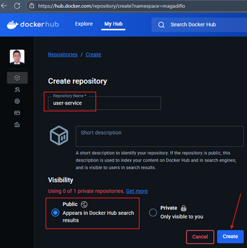
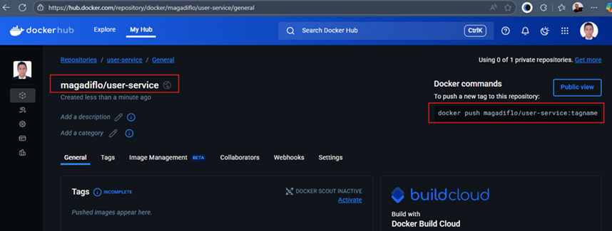
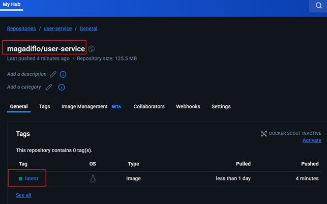

# ☁️ Sección 12: Docker Hub - Repositorio para compartir imágenes en la nube

---

## 🐳 ¿Qué es Docker Hub?

`Docker Hub` es un servicio en la nube proporcionado por `Docker` que actúa como un `registro de imágenes de Docker`,
lo que significa que almacena y distribuye `imágenes de contenedores Docker`. Es el repositorio público más grande
para imágenes `Docker`, y ofrece tanto repositorios públicos como privados.

### ⭐ Características Principales

| Característica                 | Descripción                                                                                                                                      |
|--------------------------------|--------------------------------------------------------------------------------------------------------------------------------------------------|
| **Almacenamiento de imágenes** | Facilita la subida (`push`) y descarga (`pull`) de `imágenes` desde cualquier entorno o servidor.                                                |
| **Imágenes Oficiales**         | Aloja imágenes verificadas y mantenidas por proveedores (como `mysql`, `postgres`, `openjdk`), garantizando seguridad y estabilidad.             |
| **Gestión de Visibilidad**     | Ofrece **Repositorios Públicos** (acceso universal) y **Privados** (acceso restringido mediante autenticación).                                  |
| **Integración Continua (CI)**  | Capacidad de conectarse con GitHub o Bitbucket para automatizar la construcción de imágenes ante cambios en el código.                           |
| **Equipos y organizaciones**   | Facilita la colaboración entre equipos al permitir que varias personas dentro de una organización accedan a las imágenes privadas o compartidas. |
| **Distribución global**        | Al estar basado en la nube, `Docker Hub` garantiza que las imágenes estén disponibles con alta velocidad desde cualquier ubicación geográfica.   |

#### 💡 Nota de Contexto para Microservicios

> En nuestro proyecto de microservicios, Docker Hub será la herramienta que nos permitirá llevar nuestras imágenes
> de `user-service` y `course-service` desde nuestra máquina local hacia un servidor de producción o un clúster
> de Kubernetes en el futuro.

## 🚀 Crea nuestro repositorio en Docker Hub

Para que nuestras imágenes sean accesibles desde cualquier servidor del mundo, debemos subirlas a un registro remoto. En
este caso, utilizaremos `Docker Hub` como nuestro repositorio centralizado. Por lo tanto, en este apartado subiremos
las imágenes de nuestros microservicios a este servidor. Para eso necesitamos ingresar a la web de
[hub.docker](https://hub.docker.com/) con nuestras credenciales previamente registradas.

### 📦 Crea repositorio en Docker Hub

Lo primero que haremos será crear los repositorios en `Docker Hub` para nuestros microservicios `user-service` y
`course-service`.

> Para no repetir los pasos, este ejemplo se basará en el microservicio `user-service`; obviamente, los mismos pasos
> se aplicarán al microservicio `course-service`.

#### 1. Crea un repositorio para la imagen a subir

El nombre del repositorio será igual al nombre del microservicio cuya imagen queremos subir a `Docker Hub`, en nuestro
caso, el repositorio se llamará `user-service`.



#### 2. Luego de haber creado el repositorio, veremos la siguiente pantalla.



Hay dos cosas importantes que debemos resaltar luego de la creación del repositorio.

1. El nombre completo de la imagen que subiremos a `Docker Hub` debe ser igual al
   `<Namespace>/<Repository_name>:<Etiqueta>`.
    - `<Namespace>` es tu ID de usuario en Docker Hub `(magadiflo)`. Es lo que separa tus imágenes de las de otros
      desarrolladores.
    - `<Respository_name>` el nombre del repositorio que creamos `(user-service)` en `Docker Hub`.
    - `<Etiqueta>` la versión de la imagen. **Ojo:** Si omites este valor, Docker asume automáticamente que es `latest`.
    - En nuestro caso, la imagen a `pushear` desde el local debe tener este nombre completo `magadiflo/user-service`.


2. Observemos que luego de la creación del repositorio en docker hub, se nos muestra el comando de ejemplo para poder
   enviar una nueva imagen a este repositorio. El comando sería: `docker push magadiflo/user-service:tagname`.

## 📤 Enviando imagen desde local hacia Docker Hub (`push`)

Listamos las imágenes que tenemos actualmente en nuestro host local de Docker para verificar el que enviaremos a docker
hub.

````bash
$ docker image ls -a                                                                     
                                                                                         
IMAGE                                    ID             DISK USAGE   CONTENT SIZE   EXTRA
course-service:latest                    1ef9c2582e86        293MB             0B    U   
mysql:8.0.41-debian                      4340b8ad7a7c        610MB             0B    U   
postgres:17-alpine                       f40315d0e8a6        279MB             0B    U         
user-service:latest                      9f673891694e        294MB             0B    U   
````

Para este ejemplo, nos interesa la imagen `user-service` con tag `latest`, pero observemos que `NO tenemos el mismo
nombre que nos solicita Docker Hub`, es decir, como vimos en el apartado anterior, nuestra imagen a subir debería
tener la siguiente convención de nombre:

````bash
<Namespace>/<Repository_name>:<Etiqueta>
````

Mientras que en nuestro repositorio en local solo dice `user-service` **¿qué podemos hacer?**

1. `Primera Forma`, **(no lo haré así, solo lo coloco para saber que existe esta forma)** podemos volver a crear una
   nueva imagen con el nombre requerido `magadiflo/user-service`.
   ````bash
   D:\programming\spring\01.udemy\02.andres_guzman\08.docker_kubernetes\docker-kubernetes-2026 (feature/section-12)
   $ docker image build -t magadiflo/user-service .\business-domain\user-service
   ````

2. `Segunda forma`, **(así lo haré)** a partir de una imagen existente la podemos volver a etiquetar.

   ````bash
   $ docker tag user-service magadiflo/user-service
   ````
   El comando anterior está renombrando la imagen `user-service` cuyo tag por defecto es `latest` en otra
   imagen cuyo nombre será `magadiflo/user-service` y como tampoco le definimos un tag, usará el por defecto `latest`.
   Es como si hiciéramos un copia y pega de un archivo renombrándolo.

Luego de haber renombrado la imagen con el nombre requerido, listamos para ver que los tenemos en nuestro entorno local.
Para el `course-service` también aplicamos el mismo comando por eso es que vemos la imagen `magadiflo/course-service`.

````bash
$ docker image ls -a                                                                     
                                                                                         
IMAGE                                    ID             DISK USAGE   CONTENT SIZE   EXTRA
course-service:latest                    1ef9c2582e86        293MB             0B    U   
magadiflo/course-service:latest          1ef9c2582e86        293MB             0B    U   
magadiflo/user-service:latest            9f673891694e        294MB             0B    U   
mysql:8.0.41-debian                      4340b8ad7a7c        610MB             0B    U   
postgres:17-alpine                       f40315d0e8a6        279MB             0B    U   
user-service:latest                      9f673891694e        294MB             0B    U   
````

Ahora que ya tenemos en nuestra máquina local la imagen con el nombre correcto que espera recibir el repositorio de
`Docker Hub`, llega el momento de subirlo.

Si nunca nos hemos logueados mediante la terminal, debemos hacerlo.

````bash
$ docker login

USING WEB BASED LOGIN
To sign in with credentials on the command line, use 'docker login -u <username>'

Your one-time device confirmation code is: BMLV-CMZF
Press ENTER to open your browser or submit your device code here: https://login.docker.com/activate

Waiting for authentication in the browser…

Login Succeeded
````

Una vez logueados, podemos enviar nuestra imagen `magadiflo/user-service` a `Docker Hub`.

````bash
$ docker push magadiflo/user-service                                                              
Using default tag: latest                                                                         
The push refers to repository [docker.io/magadiflo/user-service]                                  
e24d938cf937: Pushed                                                                              
16a7e80fe6fd: Pushed                                                                              
b030e690ea6f: Pushed                                                                              
b4f24a465e32: Pushed                                                                              
665c5218ec01: Pushed                                                                              
b75b043fc438: Pushed                                                                              
67c973a86538: Mounted from library/eclipse-temurin                                                
f4a82f9405dd: Mounted from library/eclipse-temurin                                                
5bd10eab4fc4: Mounted from library/eclipse-temurin                                                
4536f518b369: Mounted from library/eclipse-temurin                                                
989e799e6349: Mounted from library/eclipse-temurin                                                
latest: digest: sha256:4e73c9a67dfad5e956f8f0c3ee66db9f1ea58f71ae394390752374c33352f7a0 size: 2616
````

Haremos lo mismo con la imagen `magadiflo/course-service`. Obviamente, el repositorio para `course-service`
también debe estar creado en `Docker Hub`.

````bash
$ docker push magadiflo/course-service                                                            
Using default tag: latest                                                                         
The push refers to repository [docker.io/magadiflo/course-service]                                
631a73a26ad8: Pushed                                                                              
f37986e5808f: Pushed                                                                              
4681316bbe8f: Pushed                                                                              
0750dda56a8c: Pushed                                                                              
665c5218ec01: Mounted from magadiflo/user-service                                                 
b75b043fc438: Mounted from magadiflo/user-service                                                 
67c973a86538: Mounted from magadiflo/user-service                                                 
f4a82f9405dd: Mounted from magadiflo/user-service                                                 
5bd10eab4fc4: Pushed                                                                              
4536f518b369: Mounted from library/eclipse-temurin                                                
989e799e6349: Mounted from magadiflo/user-service                                                 
latest: digest: sha256:7f20a6b358bba776fe7396ef01b17a1d9f522059566bff053071da1780afb1ae size: 2616
````

#### 🔍 Análisis de la salida del comando push:

- `Pushed`: La capa es nueva y se subió por completo.
- `Mounted from...`: ¡Eficiencia en acción! Docker detectó que las capas base (como la de la imagen de Java
  eclipse-temurin) ya existen en el registro o en otros repositorios tuyos, por lo que solo las vinculó en lugar de
  subirlas de nuevo. Esto ahorra tiempo y ancho de banda.

**Nota**
> Por defecto, si no definimos ningún tag en las imágenes, se utiliza el tag `latest`.

Si revisamos el repositorio de `docker hub` veremos que nuestras imágenes fueron subidos correctamente. En la siguiente
imagen vemos que nuestra imagen `magadiflo/user-service` fue subido correctamente a su repositorio.



## 📥 Bajando imagen desde Docker Hub a local (`pull`)

Una de las mayores ventajas de usar un registro como Docker Hub es la portabilidad. Para demostrarlo, realizaremos un
ejercicio de "entorno limpio", eliminando nuestras imágenes locales y descargándolas nuevamente desde la nube.

### 1. Limpieza Total del Entorno

Antes de descargar, eliminamos cualquier rastro de los microservicios en nuestro host local:

- **Detener contenedores:** `docker compose down`

````bash
D:\programming\spring\01.udemy\02.andres_guzman\08.docker_kubernetes\docker-kubernetes-2026 (feature/section-12)
$ docker compose -f ./docker/compose.yml down                                                                   
[+] down 4/4                                                                                                    
 ✔ Container c-course-service Removed                                                                           
 ✔ Container c-user-service   Removed                                                                           
 ✔ Container c-mysql          Removed                                                                           
 ✔ Container c-postgres       Removed                                                                            
````

- **Eliminar imágenes locales:** Borramos tanto las etiquetas originales como los alias de Docker Hub. Solo nos
  quedaremos con las imágenes de `mysql` y `postgres` todas las demás, que corresponden a los microservicios de
  usuarios y cursos los eliminaremos.

````bash
$ docker image rm course-service user-service magadiflo/course-service magadiflo/user-service
Untagged: course-service:latest
Untagged: user-service:latest
Untagged: magadiflo/course-service:latest
Untagged: magadiflo/course-service@sha256:7f20a6b358bba776fe7396ef01b17a1d9f522059566bff053071da1780afb1ae
Deleted: sha256:1ef9c2582e86d209a36415a46a57912655aef0833c65563655fa4eb9a9e20067
Untagged: magadiflo/user-service:latest
Untagged: magadiflo/user-service@sha256:4e73c9a67dfad5e956f8f0c3ee66db9f1ea58f71ae394390752374c33352f7a0
Deleted: sha256:9f673891694e64961cc2c4891f53cad2f626b24de3e8f1e5d39e9cb5f30f15c0
````

En este punto, nuestro sistema solo contiene las imágenes oficiales de las bases de datos. Los microservicios han
desaparecido localmente.

````bash
$ docker image ls -a                                                                     
                                                                                         
IMAGE                                    ID             DISK USAGE   CONTENT SIZE   EXTRA       
mysql:8.0.41-debian                      4340b8ad7a7c        610MB             0B        
postgres:17-alpine                       f40315d0e8a6        279MB             0B              
````

### 2. Descarga desde la Nube `(docker pull)`

Para traer de vuelta nuestras imágenes, utilizamos el comando `pull` especificando el nombre completo
(incluyendo el `Namespace`). Si no especificamos un tag, por defecto bajará la imagen con tag `latest`.

````bash
$ docker pull magadiflo/user-service                                                                           
Using default tag: latest                                                                                      
latest: Pulling from magadiflo/user-service                                                                    
589002ba0eae: Already exists                                                                                   
d66e3d501004: Already exists                                                                                   
4ecbfe883bca: Already exists                                                                                   
d5400f68ee90: Already exists                                                                                   
5cf082752c8d: Already exists                                                                                   
cc9e58dd7911: Already exists                                                                                   
a4d61c15d8d0: Already exists                                                                                   
f2e7df2c57ea: Already exists                                                                                   
1395106027d0: Already exists                                                                                   
e720be9dedbc: Already exists                                                                                   
392f68620a62: Already exists                                                                                   
Digest: sha256:4e73c9a67dfad5e956f8f0c3ee66db9f1ea58f71ae394390752374c33352f7a0                                
Status: Downloaded newer image for magadiflo/user-service:latest                                               
docker.io/magadiflo/user-service:latest
````

#### 🔍 Análisis del proceso:

- `Already exists`: Docker es inteligente. Si ya tienes las capas de la imagen base (JDK Temurin) en tu máquina porque
  las usan otras imágenes (como Postgres o MySQL), no las descarga de nuevo. Solo baja las capas específicas de tu
  código Spring Boot.
- `Status: Downloaded newer image`: Confirma que ahora posees la versión que reside en Docker Hub.

Haremos lo mismo con la imagen de cursos (`docker pull magadiflo/course-service`), así que al final nuestra lista
de imágenes debe verse así.

````bash
$ docker image ls -a                                                                 
                                                                                     
IMAGE                                ID             DISK USAGE   CONTENT SIZE   EXTRA        
magadiflo/course-service:latest      1ef9c2582e86        293MB             0B        
magadiflo/user-service:latest        9f673891694e        294MB             0B               
mysql:8.0.41-debian                  4340b8ad7a7c        610MB             0B        
postgres:17-alpine                   f40315d0e8a6        279MB             0B               
````

#### 💡 Notas Técnicas Importantes

> **Descarga Automática (Lazy Loading):**  
> No siempre es necesario ejecutar `docker pull` de forma manual. Docker activará la descarga automática
> desde `Docker Hub` en los siguientes casos si no encuentra la imagen localmente:
> - Al ejecutar un contenedor mediante `docker container run`.
> - Al levantar servicios con un archivo `compose.yml`.
> - Al procesar la instrucción `FROM` dentro de un `Dockerfile` durante la construcción de una nueva imagen.
>
> En todos estos escenarios, Docker primero verifica la caché local; si la imagen no reside en el host,
> procede a descargarla del registro remoto.

> **El problema de la actualización:**  
> Si la imagen en Docker Hub se actualiza (por ejemplo, con un nuevo parche de seguridad) pero tú ya tienes una versión
> con el mismo tag (`latest`) en tu local, **Docker no la actualizará automáticamente.** En este escenario,
> **sí es obligatorio** ejecutar `docker pull` para forzar la descarga de la versión más reciente del repositorio
> remoto.
