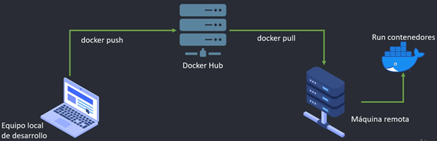

# 🐳🚀☁️ Sección 13: Docker - Despliegue en producción - Amazon AWS

**💡 Importante**
> En esta sección se hace uso de AWS, pero como no tengo cuenta no pude seguir los pasos. Básicamente, esta sección la
> estoy tomando como una guía para ver cómo es que se despliega a AWS usando los dos enfoques que se mencionan más
> abajo.
>
> Simplemente, son videos que veré, no haré otra cosa más que ver los videos de esta sección, con excepción del primer
> video de introducción donde sí colocaré lo que se mencione en esta documentación.

---

## 🌐 Introducción al despliegue en la Nube

El despliegue en producción utilizando `Amazon Web Services (AWS)` nos permite llevar nuestros microservicios de
Spring Boot a una infraestructura robusta, segura y escalable. En esta sección, analizaremos los dos caminos
principales para alojar aplicaciones dockerizadas:

### 1. Enfoque Auto-administrado (Manual)

Consiste en la gestión directa de la infraestructura. AWS nos proporciona "piezas de hardware virtual" que nosotros
debemos configurar desde cero.

- **Servicio Clave:** `Amazon EC2 (Elastic Compute Cloud)`.
- **Concepto:** Actúa como un `VPS (Servidor Privado Virtual)` tradicional donde tenemos control total sobre el Sistema
  Operativo.
- Flujo de trabajo:
    1. Crear la instancia (servidor) `EC2`.
    2. Conectarse vía `SSH`.
    3. Instalar `Docker` y `Docker Compose` manualmente.
    4. Realizar el `docker pull` de nuestras imágenes desde `Docker Hub`.
    5. Ejecutar los contenedores.

### 2. Enfoque Gestionado (Servicios Administrados)

Aquí delegamos la complejidad de la infraestructura a `AWS`, centrándonos únicamente en definir cómo deben correr
nuestros contenedores.

- **Servicio Clave:** `Amazon ECS (Elastic Container Service)`.
- **Concepto:** Es un orquestador nativo de AWS que gestiona el ciclo de vida de los contenedores, facilitando tareas
  como el auto-escalado y el balanceo de carga sin necesidad de administrar individualmente cada servidor.

## 🛠️ Análisis del Enfoque Auto-administrado (EC2)

Este modelo representa el flujo más directo desde el desarrollo local hacia la nube, simulando lo que haríamos en
nuestro propio servidor físico pero con la flexibilidad de AWS.

Este enfoque implica conectarse manualmente a una instancia remota (por ejemplo, una instancia `EC2`) mediante `SSH`,
instalar Docker, realizar un `pull` de nuestras imágenes desde `Docker Hub` (u otro registro de contenedores),
y ejecutar los contenedores directamente en ese servidor.

A continuación, se muestra un diagrama que representa este flujo `auto-administrado`:

### 📊 Balance de Arquitectura

| Ventajas                                                                                           | Desventajas                                                                                                           |
|----------------------------------------------------------------------------------------------------|-----------------------------------------------------------------------------------------------------------------------|
| **Control Total:** Configuración absoluta del entorno y sistema operativo.                         | **Carga Operativa:** El mantenimiento, parches de seguridad y actualizaciones corren por nuestra cuenta.              |
| **Simplicidad Inicial:** Ideal para proyectos pequeños o entornos de prueba rápidos.               | **Escalabilidad Limitada:** El escalado horizontal es manual y complejo de sincronizar.                               |
| **Bajo Costo Inicial:** Permite ajustar los recursos de la instancia según la necesidad inmediata. | **Punto de Falla:** Si la instancia cae y no hay una configuración de alta disponibilidad, el servicio se interrumpe. |

> 💡 **Criterio Profesional:**  
> Aunque el enfoque manual con `EC2` es excelente para aprender las bases de la nube, para arquitecturas de
> microservicios empresariales que requieren alta disponibilidad, el estándar de la industria es evolucionar
> hacia servicios gestionados como `ECS` o, en su defecto, orquestadores más potentes como `Kubernetes (EKS)`.
