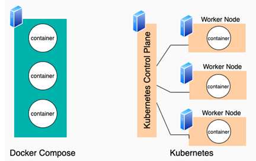
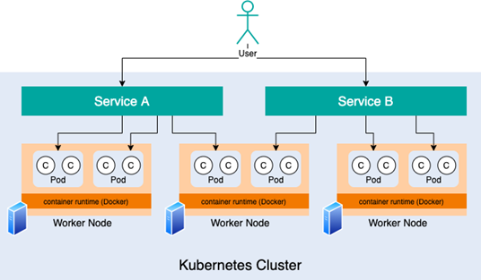
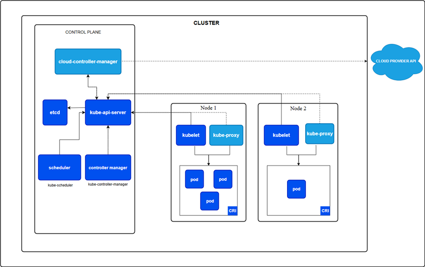
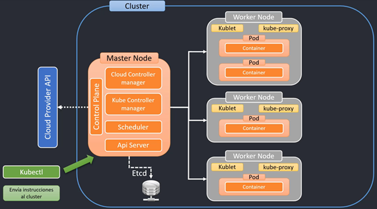
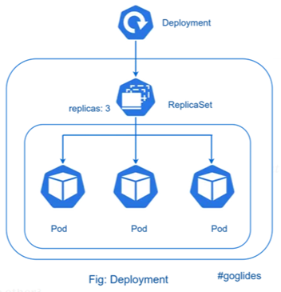
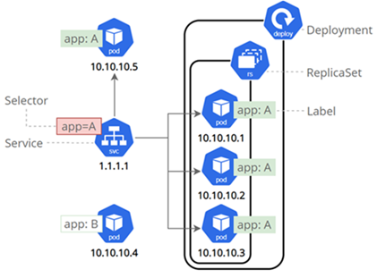
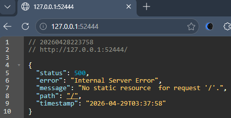
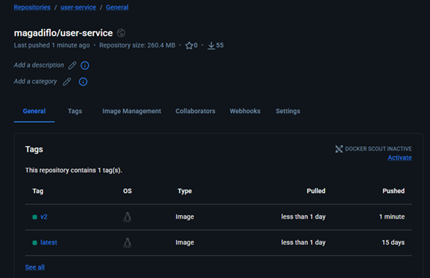

# ☸️ Sección 14: Kubernetes (K8s)

---

## 🚀 Introducción a la Orquestación de Contenedores

Para entender `Kubernetes`, primero debemos diferenciarlo de lo que ya conocemos: `Docker Compose`.  
Ambos **son marcos de orquestación de contenedores**, pero operan en escalas distintas.

- `Docker Compose` ejecuta contenedores en un único equipo anfitrión.
- `Kubernetes` ejecuta contenedores en varios ordenadores, virtuales o reales.

### [⚖️ Kubernetes vs Docker Compose](https://www.theserverside.com/blog/Coffee-Talk-Java-News-Stories-and-Opinions/What-is-Kubernetes-vs-Docker-Compose-How-these-DevOps-tools-compare)



| Característica  | Docker Compose                                   | Kubernetes (K8s)                                            |
|-----------------|--------------------------------------------------|-------------------------------------------------------------|
| **Escala**      | Único equipo anfitrión (Single Host).            | Múltiples nodos (Clúster de máquinas).                      |
| **Entorno**     | Ideal para desarrollo y pruebas locales.         | Diseñado para producción y alta disponibilidad.             |
| **Escalado**    | Manual y limitado a los recursos de una máquina. | Automático (Autoscaling) según la demanda.                  |
| **Resiliencia** | Reinicia contenedores si fallan.                 | Reemplaza y recrea Pods automáticamente en todo el clúster. |

### 🛠️ Entendiendo los Conceptos Fundamentales

#### 🐳 `Docker Compose`: La simplicidad local

Es una tecnología destinada a ejecutar una pila de contenedores en una **sola máquina host.** Todo el despliegue
se define en un único archivo `(compose.yml)`, el cual describe las imágenes, redes y volúmenes necesarios para
que los servicios coexistan en un mismo entorno.

#### ☸️ `Kubernetes`: La potencia distribuida

Kubernetes segmenta la lógica de las aplicaciones en una jerarquía de abstracciones para lograr flexibilidad y
escalabilidad:

1. `Contenedor`: La unidad básica `(Docker)` donde reside nuestra app.
2. `Pod`: **La abstracción mínima de Kubernetes.** Un Pod puede contener uno o varios contenedores que comparten red y
   almacenamiento. Es la unidad que K8s escala y gestiona.
3. `Servicio`: Es la "cara externa" hacia la red. Un servicio actúa como un balanceador o punto de acceso estable que
   conoce la ubicación de los Pods (los cuales pueden cambiar de IP o nodo constantemente).



### 🏗️ La Arquitectura del Clúster

En el ecosistema de Kubernetes, la infraestructura se organiza de la siguiente manera:

- `Nodo`: **Un ordenador individual** (físico o virtual). Es el músculo donde corren los Pods.
- `Clúster`: Una colección de **Nodos** trabajando en conjunto. Kubernetes distribuye la carga de trabajo entre ellos de
  forma inteligente.

#### 💡 Escenarios del Mundo Real: ¿Por qué usar K8s?

- `Alta Disponibilidad`: Si un servidor (Nodo) físico se apaga por una falla de hardware, Kubernetes detecta que los
  Pods que vivían ahí han muerto y los recrea instantáneamente en otro Nodo que esté sano.
- `Escalado Elástico`: Durante un evento de alto tráfico (como un Black Friday), Kubernetes puede detectar que el uso de
  CPU de tus microservicios de Spring Boot ha subido y crear automáticamente 10 Pods adicionales para soportar la carga,
  eliminándolos cuando el tráfico baje.
- `Self-Healing (Auto-curación)`: Si tu aplicación Java lanza un **OutOfMemoryError** y el contenedor se detiene,
  Kubernetes no solo lo reinicia, sino que verifica si el Pod es apto para recibir tráfico; de lo contrario, lo
  reemplaza.

🔍 `Resumen Técnico`: Mientras que en **Docker Compose** un servicio se ejecuta en una sola máquina,
en **Kubernetes** los Pods pueden ejecutarse en cualquiera de los nodos del clúster. Esto permite que,
si una máquina falla, Kubernetes cree nuevos Pods en otra automáticamente, manteniendo la aplicación
disponible en todo momento.

### [☸️ ¿Qué es realmente Kubernetes (K8s)?](https://kubernetes.io/es/docs/concepts/overview/what-is-kubernetes/)

`Kubernetes` (frecuentemente abreviado como `K8s`) es una plataforma de código abierto diseñada para automatizar
la implementación, el escalado y la administración de aplicaciones en contenedores.

Si Docker nos da el contenedor, Kubernetes nos da el ejército y el general para dirigirlos de forma estandarizada
mediante archivos de manifiesto `(.yml)`.

### 🛡️ Los 3 Pilares de la Gestión en K8s

Para que nuestros microservicios de Spring Boot sean resilientes, Kubernetes se apoya en tres funciones críticas:

1. `Health Checks y Re-deploy (Auto-curación)`: Los contenedores pueden fallar por errores de memoria o bugs.
   Kubernetes monitorea constantemente su salud; si un contenedor se detiene o deja de responder, lo elimina y
   realiza un `re-deploy` instantáneo para asegurar que el servicio siga vivo.
2. `Autoscaling (Escalado Automático)`: K8s ajusta la cantidad de instancias (Pods) de tus microservicios basándose en
   el tráfico real. Si hay mucha demanda, crea más; si el tráfico baja, los destruye para ahorrar recursos.
3. `Load Balancer (Balanceo de Carga)`: Distribuye de forma inteligente y uniforme el tráfico entrante entre todos los
   contenedores disponibles, evitando que uno solo se sature mientras otros están inactivos.

### 🌍 Portabilidad e Infraestructura

Una de las mayores ventajas de Kubernetes es su estandarización. Al definir tu infraestructura en archivos `YAML`,
el mismo despliegue que haces en tu PC puede funcionar en cualquier lugar.

- `Nube Gestionada`: Servicios como `Amazon EKS`, `Azure AKS` o `Google GKE` donde el proveedor administra el
  "cerebro" de Kubernetes por ti.
- `On-Premise / Auto-administrado`: Puedes instalar Kubernetes en tus propios servidores físicos o en máquinas
  virtuales (como una instancia `Amazon EC2` o cualquier `VPS`).

### 📢 Punto Clave para el Desarrollador

💡 **Kubernetes no es un servicio, es un Framework:**  
Es vital entender que `Kubernetes es un software`, **no un proveedor de nube.** Así como instalamos Docker en un
servidor para correr contenedores, podemos instalar Kubernetes para orquestarlos.

No estás atado a una marca; eres dueño de tu configuración y puedes moverla entre `Amazon`, `Google` o tus propios
servidores locales sin cambiar la lógica de tus archivos de manifiesto.

## 🏗️ Arquitectura de un Clúster de Kubernetes

Un clúster de Kubernetes no es una sola pieza de software, sino un ecosistema de componentes trabajando en conjunto.
Se divide en dos grandes grupos: el `Control Plane` (el cerebro) y los `Worker Node`s (la fuerza de trabajo).

### 📊 Diagrama de la arquitectura de Kubernetes



### 🧠 1. El Control Plane (El Cerebro del Clúster)

Es el encargado de tomar decisiones globales, detectar eventos y asegurar que el clúster se encuentre siempre en el
estado deseado.

- 🛰️ `kube-apiserver`: Es la puerta de entrada. Todo lo que hacemos (vía `kubectl` o `consola`) pasa por aquí.
  Es la única vía de comunicación con el clúster y expone la API de Kubernetes.
- 📂 `etcd`: Es la base de datos del clúster. Un almacén de clave-valor donde se guarda TODA la configuración y el
  estado actual.
    - ⚠️ **Escenario Real**: Si `etcd` se corrompe y no tienes respaldo, pierdes el clúster. En producción, siempre debe
      tener alta disponibilidad.
- 🗓️ `kube-scheduler`: El "asignador". Cuando creas un Pod, el scheduler mira los nodos disponibles y decide dónde
  ponerlo basándose en CPU, memoria y reglas de afinidad.
- ⚙️ `kube-controller-manager`: El "vigilante". Ejecuta controladores que aseguran que la realidad coincida con lo que
  pediste. Si pides 3 réplicas de un microservicio y una muere, este componente da la orden de crear una nueva.
- ☁️ `cloud-controller-manager`: El "embajador de la nube". Solo existe si usas proveedores como `AWS` o `Azure`.
  Se encarga de pedirle a la nube cosas como: "Oye AWS, crea un Load Balancer físico para este servicio".

### 🦾 2. Componentes del Nodo (Worker Nodes)

Son las máquinas (virtuales o físicas) donde realmente corren tus microservicios de Spring Boot.

- 👨‍✈️ `kubelet`: El agente residente en cada nodo. Es el "capataz" que recibe las órdenes del Control Plane y se
  asegura de que los contenedores en los Pods estén corriendo y saludables.
- 🛤️ `kube-proxy`: El gestor de tráfico. Mantiene las reglas de red en los nodos para que la comunicación entre Pods y
  desde el exterior sea posible.
- 📦 `Container Runtime`: El motor que ejecuta los contenedores. Aunque `Docker` fue el estándar, hoy Kubernetes usa
  principalmente `containerd` o `CRI-O` para una ejecución más ligera.



### 🛠️ Herramientas Esenciales de Trabajo

Para llevar esta arquitectura a la práctica, utilizaremos dos herramientas fundamentales:

| Herramienta | Función        | Propósito                                                                                                                             |
|-------------|----------------|---------------------------------------------------------------------------------------------------------------------------------------|
| `Minikube`  | Clúster Local  | Crea un clúster de **un solo nodo** en tu PC. Simula todo el `Control Plane` y el `Worker Node` en un entorno ligero para desarrollo. |
| `kubectl`   | CLI de Control | Es el mando a distancia. Con este comando enviamos las instrucciones al `kube-apiserver` de cualquier clúster (local o en la nube).   |

## 🏗️ Gestión de Objetos en Kubernetes

`Kubernetes` funciona bajo el modelo de `Estado Deseado`. Nosotros le decimos qué queremos
(ej. *"quiero 3 réplicas de mi microservicio de usuarios"*) y el clúster se encarga de mantener esa configuración
persistente en el tiempo.

### 📦 Objetos Fundamentales

| Objeto       | Función Principal                                                                         |
|--------------|-------------------------------------------------------------------------------------------|
| `Pod`        | Unidad más pequeña de ejecución. Aloja uno o más contenedores compartiendo IP y volumen.  |
| `Deployment` | El administrador. Controla cuántas réplicas de un Pod deben existir y cómo se actualizan. |
| `Service`    | El punto de acceso. Ofrece una IP estática y balanceo de carga para un grupo de Pods.     |
| `Namespace`  | La frontera lógica. Organiza y aísla recursos (ej. `dev`, `test`, `prod`).                |
| `Volume`     | La persistencia. Permite que los datos sobrevivan al ciclo de vida del contenedor.        |

## 🚀 Profundizando en los Pods

Los `Pods` son la unidad más pequeña que se puede desplegar y administrar en `Kubernetes`. Representan una instancia
en ejecución de una aplicación dentro del clúster.

### 🔗 Características de un Pod

Un `Pod` encapsula uno o más contenedores (comúnmente contenedores Docker) que funcionan como una unidad lógica,
compartiendo:

- 🌐 **Red:** Una dirección IP única y un rango de puertos común.
- 💾 **Almacenamiento:** Volúmenes compartidos que todos los contenedores del Pod pueden montar.
- ⚙️ **Configuración:** Especificaciones compartidas sobre cómo deben ejecutarse los procesos.

Los contenedores dentro de un mismo `Pod`:

- Se ejecutan en el mismo nodo.
- Comparten la misma red, por lo tanto, pueden comunicarse entre sí usando `localhost` y sus respectivos puertos.
- Pueden compartir almacenamiento, accediendo a los mismos volúmenes montados.
- Están co-ubicados y co-programados, lo que significa que se despliegan y se terminan juntos como una unidad lógica.

Por diseño, los contenedores dentro de un Pod están estrechamente relacionados. Esto es útil en casos donde uno de los
contenedores complementa al otro, como un contenedor principal que sirve la aplicación, y un contenedor sidecar que
recolecta logs o realiza tareas auxiliares.

> ⚠️ `Buenas prácticas`: Aunque un `Pod` puede contener varios contenedores, **lo más habitual (y recomendable) es
> usar un solo contenedor por `Pod`.** Esto simplifica la gestión, el escalamiento y el monitoreo de las aplicaciones.

### 🔄 Comunicación entre Pods

- Cada `Pod` tiene su propia `IP única` dentro del clúster.
- Los Pods son mortales, su ciclo de vida es efímero. Si un Pod muere (por un error o un despliegue), Kubernetes crea
  uno nuevo con una `IP distinta`. Por ello, nunca debemos usar la IP del Pod para conectar microservicios.
- Debido a que **las IPs de los Pods cambian**, la comunicación entre microservicios **nunca se hace directamente
  a la IP del Pod**, sino a través de un `Service`, que proporciona una dirección estática y actúa como un puente
  permanente hacia los Pods.
- La comunicación confiable se realiza siempre a través de un `Service`. Este objeto proporciona una dirección estática
  y un nombre DNS interno que actúa como un puente permanente, redirigiendo el tráfico hacia los Pods correctos sin
  importar cuántas veces cambien sus IPs.

## 🎮 El Poder de los Deployments

Un `Deployment` es el objeto de `Kubernetes` encargado de **administrar el ciclo de vida** de los `Pods`
de forma declarativa. Es uno de los controladores más comunes, y se utiliza para definir cómo crear, actualizar,
escalar y revertir instancias de una aplicación en contenedores.

> 💡 **Regla de Oro:** En entornos profesionales, **nunca creamos Pods manualmente.** Siempre utilizamos un
> `Deployment` para que gestione los Pods por nosotros. Si un Pod muere y fue creado manualmente,
> se pierde para siempre; si fue creado por un Deployment, Kubernetes lo recreará instantáneamente.

### 🌟 Capacidades en el Mundo Real

Gracias a los `Deployments`, podemos realizar operaciones complejas de infraestructura con comandos simples:

- **Disponibilidad Continua (Rolling Updates):** Permite actualizar la versión de tu aplicación (ej. de v1 a v2) de
  forma gradual, asegurando que siempre haya instancias activas para atender a los usuarios.
- **Auto-Curación (Self-Healing):** Si un proceso falla, el Deployment garantiza que el número de réplicas deseado se
  mantenga siempre activo.
- **Escalabilidad Inmediata:** Puedes aumentar de 2 a 10 réplicas de tu microservicio en segundos para soportar picos de
  tráfico.
- **Rollbacks (Reversión):** Si un despliegue sale mal, puedes regresar a la versión estable anterior de forma casi
  instantánea.

### 🏗️ La Jerarquía de Control

Es importante entender que un `Deployment` no crea Pods directamente. Utiliza una estructura de capas para mantener el
control:

- `Deployment`: Define la estrategia de actualización y el estado deseado.
- `ReplicaSet`: **(Hijo del `Deployment`)** Su única misión es garantizar que el número exacto de réplicas esté
  funcionando.
- `Pod`: **(Hijo del `ReplicaSet`)** La instancia final que contiene tu contenedor.



El `Deployment` actúa como un controlador de alto nivel que administra objetos más bajos llamados `ReplicaSets`,
los cuales a su vez garantizan que el número especificado de `Pods` esté siempre corriendo.

### 📝 El Estado Deseado

Cuando defines un `Deployment` mediante un archivo `YAML`, le indicas a Kubernetes el "plano de construcción":
la imagen del contenedor, los puertos y el número de réplicas. El clúster se encarga de que la realidad del sistema
coincida con ese plano de forma automática.

> ⚙️ **Dato Técnico:** Todas estas interacciones se realizan a través de `kubectl`, la herramienta de línea de comandos
> estándar para gobernar clústeres de Kubernetes en cualquier sistema operativo.

## 🛠️ Modos de gestión de objetos: Imperativo vs Declarativo

En Kubernetes, interactuamos con el clúster a través de `kubectl` mediante dos metodologías. Aunque ambas funcionan,
su propósito y seguridad son muy distintos.

### 📌 1. Modo Imperativo (Acción Directa)

Consiste en ejecutar comandos directamente en la terminal para crear o modificar recursos. Kubernetes ejecuta
la orden en el momento.

- **Ejemplo:**
  ````bash
  $ kubectl run mi-app --image=nginx --port=80
  ````
- **Pros:** Velocidad pura. Ideal para pruebas rápidas o para verificar si una imagen funciona.
- **Cons:** ⚠️ **Peligroso.** No hay registro de cambios. Si el recurso se borra, no tienes un respaldo de cómo
  fue configurado originalmente. Es difícil de replicar en otros entornos.

### 📌 2. Modo Declarativo (Infraestructura como Código)

Es el **estándar de la industria.** En lugar de decirle a Kubernetes *qué hacer*, le entregas un archivo de manifiesto
`(YAML)` que describe **cómo debe ser el estado final.**

- **El Flujo de Trabajo Profesional:**
    1. ✍️ **Escribir:** Defines el objeto en un archivo `.yml`.
    2. 📜 **Versionar:** Lo guardas en un repositorio Git (infraestructura como código).
    3. 🚀 **Aplicar:** Ejecutas el comando:
    ````bash
    $ kubectl apply -f mi-archivo.yml
    ````
- **Ventajas:** Es auditable, recuperable y consistente. Si el clúster falla, basta con volver a aplicar tus archivos
  para restaurar todo el sistema en minutos.

#### 📄 Ejemplo de Manifiesto Declarativo

````yml
apiVersion: apps/v1
kind: Deployment
metadata:
  name: user-service-deploy
spec:
  replicas: 3 # Estado deseado: Kubernetes mantendrá siempre 3 copias vivas
  selector:
    matchLabels:
      app: user-service
  template:
    metadata:
      labels:
        app: user-service
    spec:
      containers:
        - name: user-service
          image: magadiflo/user-service:latest
          ports:
            - containerPort: 8080
````

> 💡 **Reflexión para el Mundo Real:**  
> El modo `Imperativo` es como pedirle a un cocinero que "fría un huevo ahora mismo". El modo `Declarativo` es
> entregarle una "receta" y decirle "asegúrate de que siempre haya un huevo frito en el plato". Si alguien se come el
> huevo, el cocinero (Kubernetes) hará otro automáticamente porque la receta dice que el plato debe estar lleno.

## 🛠️ Instalación de Herramientas: kubectl y minikube

Para operar en el ecosistema de `Kubernetes`, necesitamos configurar nuestro entorno local con las herramientas
de control y simulación.

> 💡 **Contexto antes de empezar:**
> - **Docker Desktop ya incluye `kubectl`** desde versiones antiguas (2018 en adelante), por lo que
    en la práctica no sería necesario instalarlo manualmente.
> - Sin embargo, en este curso se instala `kubectl` de forma explícita mediante `Chocolatey`,
    siguiendo el flujo original del curso.
> - **Docker Desktop también incluye su propio Kubernetes integrado** (activable desde
    *Settings → Kubernetes*), pensado para desarrollo local simple con un clúster de un solo nodo.
> - En este caso **no usaremos ese Kubernetes integrado**. En su lugar, usaremos **Minikube**,
    una herramienta independiente que ofrece más flexibilidad para simular clústeres locales.
> - Tanto el Kubernetes de Docker Desktop como Minikube se controlan con el mismo `kubectl`,
    por lo que no hay conflicto entre ambos.

## [🛰️ Kubectl: El CLI de Control](https://kubernetes.io/docs/tasks/tools/#kubectl)

La herramienta de línea de comandos de `Kubernetes`, `kubectl`, permite ejecutar comandos en clústeres de `Kubernetes`.
Puede usar `kubectl` para implementar aplicaciones, inspeccionar y administrar recursos del clúster y consultar
registros.

`kubectl` se puede instalar en diversas plataformas Linux, macOS y Windows. Para ver las distintas formas de instalar
`kubectl` en nuestra máquina de windows podemos visitar el siguiente enlace
[Install and Set Up kubectl on Windows](https://kubernetes.io/docs/tasks/tools/install-kubectl-windows/).

Para instalar `kubectl` en Windows podemos usar el gestor de paquetes `Chocolatey`, el instalador de línea de comandos
`Scoop` o el gestor de paquetes `winget`.

En nuestro caso elegimos la opción de instalar `kubectl` mediante el administrador de paquetes
[Chocolatey](https://community.chocolatey.org/). Para eso podemos visitar el siguiente enlace
[Install on Windows using Chocolatey, Scoop, or winget](https://kubernetes.io/docs/tasks/tools/install-kubectl-windows/#install-nonstandard-package-tools)
o, si no, ir directamente a la página de [Chocolatey](https://community.chocolatey.org/).

### [📥 Installing Chocolatey](https://chocolatey.org/install?_gl=1*110858c*_ga*NDY0NzUwNDI2LjE3NTA0ODIxNzA.*_ga_0WDD29GGN2*czE3NzYzNzczNDAkbzIkZzEkdDE3NzYzNzgyMzUkajE2JGwwJGgw#individual)

Dentro de la página de `Chocolatey` debemos seleccionar la pestaña `Community` y dar click en el botón
`Install Chocolate`.

Luego, se nos abrirá una página con el título: `Installing Chocolatey`. Nos vamos al
`Step 2: Choose Your Installation Method` y seleccionamos la opción
[Individual](https://chocolatey.org/install?_gl=1*hdre70*_ga*NDY0NzUwNDI2LjE3NTA0ODIxNzA.*_ga_0WDD29GGN2*czE3NzYzNzczNDAkbzIkZzEkdDE3NzYzNzc4MDYkajE2JGwwJGgw#individual).
Al pie se nos mostrarán los pasos para la instalación de uso individual que a continuación paso a detallar.

- Abrir el `PowerShell` de windows en `modo administrador` y ejecutar el siguiente comando para instalar el
  administrador de paquetes `Chocolatey`.
  ````bash
  $ Set-ExecutionPolicy Bypass -Scope Process -Force; [System.Net.ServicePointManager]::SecurityProtocol = [System.Net.ServicePointManager]::SecurityProtocol -bor 3072; iex ((New-Object System.Net.WebClient).DownloadString('https://community.chocolatey.org/install.ps1'))
  ````
- Una vez que finalice la instalación, comprobamos que se efectuó correctamente.
  ````bash
  $ choco --version
  2.4.3
  ````

### [📥 Install kubectl on Windows](https://kubernetes.io/docs/tasks/tools/install-kubectl-windows/#install-nonstandard-package-tools)

- Ahora ya podemos instalar `kubectl`, para eso abrimos una terminal en `modo administrador` y ejecutamos el comando de
  abajo (en el proceso nos pedirá que si queremos ejecutar un script, solo le decimos que sí con `Y`).
  ````bash
  $ choco install kubernetes-cli
  ````

- Finalizada la instalación de `kubectl`, comprobamos que se efectuó correctamente.
  ````bash
  $ kubectl version --client
  Client Version: v1.35.3
  Kustomize Version: v5.7.1
  ````

- Muestra dónde está `kubectl`. En nuestro caso, nos muestra el que acabamos de instalar con `chocolatey` y
  el que viene con la instalación de `Docker Desktop`.
  ````bash
  $ where kubectl
  C:\ProgramData\chocolatey\bin\kubectl.exe
  C:\Program Files\Docker\Docker\resources\bin\kubectl.exe 
  ````

> 💡 **Nota:**
> - Es posible tener múltiples instalaciones de `kubectl` en el sistema. Por ejemplo, `Docker Desktop`
    incluye su propia versión.
> - El comando `where kubectl` permite identificar todas las ubicaciones disponibles.
> - El sistema ejecutará la que aparezca primero en el PATH.
> - Se optó por instalar `kubectl` via `Chocolatey`, aunque podría haberse usado directamente
    el que trae `Docker Desktop`, omitiendo este paso por completo.

## 📂 Creación del archivo de configuración `.kube/config`

`kubectl` necesita un archivo central donde guardar las credenciales y las direcciones de los clústeres a los que
se conecta. Este archivo se llama `config` y reside en una carpeta oculta en tu perfil de usuario.

Pasos de Configuración Inicial:

1. Verificar que el directorio `.kube` exista en la siguiente ruta: `C:\Users\magadiflo\.kube`.
    - Si no existe, crearlo manualmente o con el siguiente comando:
      ````bash
      C:\Users\magadiflo
      $ mkdir .kube
      ````

2. Dentro del directorio `C:\Users\magadiflo\.kube`:
    - Creamos el archivo `config` **sin extensión** usando el siguiente comando:
      ````bash
      C:\Users\magadiflo\.kube
      $ touch config
      ````
    - Si listamos, podemos ver que el archivo está creado y está vacío.
      ````bash
      C:\Users\magadiflo\.kube
      $ ls -l
      total 0
      -rw-r--r-- 1 magadiflo 197121 0 Apr 16 18:19 config
      ````

> 💡**Nota 01**  
> En este momento, el archivo está vacío. No te preocupes; cuando arranquemos `Minikube` por primera vez,
> este detectará el archivo y escribirá automáticamente los certificados de seguridad y la IP del clúster local.
> A partir de ese momento, `kubectl` sabrá exactamente a dónde enviar tus órdenes.

> 💡 **Nota 02**  
> No es obligatorio crear este archivo manualmente. Al ejecutar `minikube start`, `Minikube` busca la carpeta
> `.kube` en tu perfil de usuario y, si no la encuentra, la crea junto con el archivo `config` de forma
> automática. En nuestro caso, lo creamos de forma anticipada tan solo con fines didácticos: para observar que el
> archivo inicia vacío y es `Minikube` quien lo puebla con la configuración del clúster.

## [🎡 Minikube: Tu Clúster de Kubernetes Local](https://kubernetes.io/docs/tasks/tools/#minikube)

`Minikube` es la herramienta estándar para ejecutar un clúster de `Kubernetes localmente` en tu ordenador personal,
proporcionando un entorno de desarrollo idéntico a un clúster de producción, pero optimizado para funcionar en una
sola máquina.

`Minikube es Kubernetes local`, enfocado en facilitar el aprendizaje y el desarrollo con Kubernetes.
Todo lo que necesitas es `Docker` (o un contenedor compatible similar) o un entorno de máquina virtual,
y Kubernetes está a un solo comando de distancia: `minikube start`.

### [📥 Install minikube](https://minikube.sigs.k8s.io/docs/start/?arch=%2Fwindows%2Fx86-64%2Fstable%2F.exe+download)

1. Descarga el instalador de la última versión
   [minikube-installer.exe](https://storage.googleapis.com/minikube/releases/latest/minikube-installer.exe).
2. Ejecuta el asistente y completa la instalación.

### 🚀 Inicialización del Clúster

Para arrancar nuestro entorno por primera vez, abrimos una terminal en `modo Administrador` y ejecutamos el siguiente
comando:

````bash
$ minikube start --driver=docker
````

🔍 Desglose del Comando:

- `minikube start`: Inicia un clúster de `Kubernetes local` de un solo nodo. En este escenario, el nodo cumple una
  doble función: actúa como **Control Plane** (maestro) y como **Worker Node** (trabajador) simultáneamente.
- `--driver=docker`: Indica que Kubernetes debe "vivir" dentro de un contenedor de `Docker`. Es la opción más rápida y
  liviana para Windows, evitando la sobrecarga de crear una Máquina Virtual pesada (como `VirtualBox` o `Hyper-V`).

En el siguiente log vemos que la ejecución del comando anterior se ha efectuado correctamente iniciando minikube con
el driver `docker`.

````bash
$ minikube start --driver=docker
* minikube v1.38.1 on Microsoft Windows 11 Pro 25H2
* Using the docker driver based on user configuration
! Starting v1.39.0, minikube will default to "containerd" container runtime. See #21973 for more info.
* Using Docker Desktop driver with root privileges
* Starting "minikube" primary control-plane node in "minikube" cluster
* Pulling base image v0.0.50 ...
* Downloading Kubernetes v1.35.1 preload ...
    > preloaded-images-k8s-v18-v1...:  272.45 MiB / 272.45 MiB  100.00% 19.17 M
    > gcr.io/k8s-minikube/kicbase...:  519.58 MiB / 519.58 MiB  100.00% 17.22 M
* Creating docker container (CPUs=2, Memory=8100MB) ...
* Preparing Kubernetes v1.35.1 on Docker 29.2.1 ...
* Configuring bridge CNI (Container Networking Interface) ...
* Verifying Kubernetes components...
  - Using image gcr.io/k8s-minikube/storage-provisioner:v5
* Enabled addons: storage-provisioner, default-storageclass
* Done! kubectl is now configured to use "minikube" cluster and "default" namespace by default
````

### 📋 Verificación del Estado

Una vez finalizado el proceso de arranque, confirmamos que todos los componentes están operativos:

````bash
$ minikube status
minikube
type: Control Plane
host: Running
kubelet: Running
apiserver: Running
kubeconfig: Configured
````

### 💡 Notas Técnicas de Operación

#### 🐳 Nota 01: Dependencia con Docker Desktop

> Cuando usamos `--driver=docker`, Minikube levantó el clúster **dentro de un contenedor de Docker**. Esto
> significa que **Docker Desktop debe estar corriendo** cada vez que queramos usar **Minikube**.  
> Podemos verificarlo listando los contenedores activos:
>
> ````bash
> $ docker container ls -a
> CONTAINER ID   IMAGE                                 COMMAND                  CREATED              STATUS              PORTS                                                                                                                                  NAMES
> f5709d89aee5   gcr.io/k8s-minikube/kicbase:v0.0.50   "/usr/local/bin/entr…"   About a minute ago   Up About a minute   127.0.0.1:57596->22/tcp, 127.0.0.1:57597->2376/tcp, 127.0.0.1:57594->5000/tcp, 127.0.0.1:57595->8443/tcp, 127.0.0.1:57593->32443/tcp   minikube
> ````
>
> El contenedor llamado `minikube` es el nodo del clúster. Mientras esté en estado `Up`, el clúster
> está disponible para recibir comandos de `kubectl`.

#### 🔄 Nota 02: Persistencia del clúster entre reinicios

> Aunque `Minikube` con `Docker` ejecuta `Kubernetes` dentro de un contenedor, **el clúster se conserva entre reinicios
> del sistema** siempre que no se elimine manualmente. Al volver a encender la PC, basta con tener levantado
> `Docker` y luego ejecutar el comando `minikube start` para restaurar el clúster con los `deployments` y `services`
> previamente creados. Los `pods` gestionados por un `Deployment` se recrearán automáticamente, mientras que los pods
> creados de forma directa (sin un controlador) no se restauran.
>
> Una vez creado el clúster con `--driver=docker`, ya no es necesario volver a especificar el driver en futuros
> arranques. `Minikube` recuerda la configuración utilizada. Basta con ejecutar `minikube start` para reiniciar el
> clúster existente.

## 📂 Verificación del archivo `.kube/config`

Como anticipamos, al ejecutar `minikube start`, `Minikube` localizó el archivo `config` vacío que
creamos en `C:\Users\magadiflo\.kube\` y **lo pobló automáticamente** con la información necesaria para establecer
la conexión.

````yml
apiVersion: v1
clusters:
  - cluster:
      certificate-authority: C:\Users\magadiflo\.minikube\ca.crt
      extensions:
        - extension:
            last-update: Fri, 17 Apr 2026 16:30:54 -05
            provider: minikube.sigs.k8s.io
            version: v1.38.1
          name: cluster_info
      server: https://127.0.0.1:57595
    name: minikube
contexts:
  - context:
      cluster: minikube
      extensions:
        - extension:
            last-update: Fri, 17 Apr 2026 16:30:54 -05
            provider: minikube.sigs.k8s.io
            version: v1.38.1
          name: context_info
      namespace: default
      user: minikube
    name: minikube
current-context: minikube
kind: Config
users:
  - name: minikube
    user:
      client-certificate: C:\Users\magadiflo\.minikube\profiles\minikube\client.crt
      client-key: C:\Users\magadiflo\.minikube\profiles\minikube\client.key
````

### 📄 Anatomía del archivo de configuración

Este archivo es el "pasaporte" de `kubectl`. Contiene tres secciones clave:

- `Clusters`: La dirección del servidor de la `API de Kubernetes` (ej. `https://127.0.0.1:57595`) y sus certificados
  de autoridad.
- `Contexts`: La unión de un usuario con un clúster. Aquí se define, por ejemplo, que el contexto `"minikube"`
  usa al usuario `"minikube"` para entrar al clúster `"minikube"` en el namespace `"default"`.
- `Users`: Las credenciales y llaves privadas `(client.key)` para autenticarse.

## 🔄 ¿Cómo levantar Minikube después de reiniciar la PC?

Cuando trabajamos con el driver de `Docker`, debemos recordar que nuestro clúster vive dentro de un contenedor.
Tras un reinicio del sistema, el flujo de restauración debe ser preciso para evitar errores de configuración.

### 1. Preparar el motor (Docker Desktop)

Asegúrate de que `Docker Desktop` esté iniciado. En nuestra configuración, el nodo de `Minikube` reside dentro de un
contenedor, por lo que el motor de Docker actúa como la infraestructura base.

> ⚠️ **Nota de contexto:** Esta dependencia existe exclusivamente porque seleccionamos `--driver=docker`.
> Si se utilizara un driver de virtualización (como `Hyper-V` o `VirtualBox`), el clúster sería independiente
> del estado de `Docker`.

### 2. Verificar el estado del contenedor

Al listar los contenedores, notarás que el nodo de `Minikube` está en estado `Exited`:

````bash
$ docker container ls -a
CONTAINER ID   IMAGE                                 COMMAND                  CREATED      STATUS                        PORTS                                                                                                                                  NAMES
f5709d89aee5   gcr.io/k8s-minikube/kicbase:v0.0.50   "/usr/local/bin/entr…"   2 days ago   Exited (255) 23 minutes ago   127.0.0.1:32768->22/tcp, 127.0.0.1:32769->2376/tcp, 127.0.0.1:32770->5000/tcp, 127.0.0.1:32771->8443/tcp, 127.0.0.1:32772->32443/tcp   minikube 
````

### 3. Levantamos el contenedor de minikube

El siguiente comando solo levanta el contenedor, pero no necesariamente inicializa todos los servicios internos
de `Kubernetes` (como el `API Server` o el `Kubelet`) de forma correcta.

````bash
$ docker container start minikube
minikube
````

Si volvemos a listar los contenedores, podemos ver que nuestro contenedor de `minikube` ya se encuentra con status `UP`.

````bash
$ docker container ls -a
CONTAINER ID   IMAGE                                 COMMAND                  CREATED      STATUS          PORTS                                                                                                                                  NAMES
f5709d89aee5   gcr.io/k8s-minikube/kicbase:v0.0.50   "/usr/local/bin/entr…"   2 days ago   Up 14 seconds   127.0.0.1:51428->22/tcp, 127.0.0.1:51429->2376/tcp, 127.0.0.1:51430->5000/tcp, 127.0.0.1:51431->8443/tcp, 127.0.0.1:51432->32443/tcp   minikube 
````

### 4. El problema del "Misconfigured" (Desajuste de Puertos)

Si intentas ver el status después de solo levantar el contenedor de `minikube`, podrías ver este error crítico:

````bash
$ minikube status                                                                                            
E0420 15:34:13.797027   11876 status.go:457] kubeconfig endpoint: got: 127.0.0.1:57595, want: 127.0.0.1:51431
minikube                                                                                                     
type: Control Plane                                                                                          
host: Running                                                                                                
kubelet: Stopped                                                                                             
apiserver: Stopped                                                                                           
kubeconfig: Misconfigured                                                                                    
                                                                                                             
                                                                                                             
WARNING: Your kubectl is pointing to stale minikube-vm.                                                      
To fix the kubectl context, run `minikube update-context`                                                    
````

### 5. La solución definitiva: El comando `minikube start`

La forma correcta y más segura de restaurar el clúster es ejecutar directamente:

````bash
$ minikube start
* minikube v1.38.1 on Microsoft Windows 11 Pro 25H2
* Using the docker driver based on existing profile
* Starting "minikube" primary control-plane node in "minikube" cluster
* Pulling base image v0.0.50 ...
* Updating the running docker "minikube" container ...
* Preparing Kubernetes v1.35.1 on Docker 29.2.1 ...
* Verifying Kubernetes components...
  - Using image gcr.io/k8s-minikube/storage-provisioner:v5
* Enabled addons: storage-provisioner, default-storageclass
* Done! kubectl is now configured to use "minikube" cluster and "default" namespace by default
````

**¿Por qué este comando es mejor?**

- **Auto-detección:** Reconoce que ya existe un perfil creado con el driver de Docker.
- **Sincronización:** Actualiza automáticamente tu archivo `.kube/config` con los nuevos puertos y certificados.
- **Inicialización:** Asegura que el `kubelet` y el `apiserver` arranquen correctamente dentro del nodo.

### 6. Verificación Final

Una vez que el comando finaliza, confirmamos que el "cerebro" y los "músculos" del clúster están sincronizados:

````bash
$ minikube status
minikube
type: Control Plane
host: Running
kubelet: Running
apiserver: Running
kubeconfig: Configured 
````

## 🚀 Creando un Deployment para MySQL (Modo Imperativo)

Con nuestro clúster de `Minikube` operativo, realizaremos nuestro primer despliegue. En este ejercicio,
utilizaremos el `modo imperativo` para entender cómo Kubernetes intenta levantar la infraestructura bajo
demanda y cómo gestionar errores comunes.

> **⚠️ Resultado esperado: ❌ Error de ejecución**  
> La imagen oficial de MySQL requiere obligatoriamente variables de entorno (como `MYSQL_ROOT_PASSWORD`) para
> inicializarse. Dado que el comando `kubectl create deployment` no permite pasar estas variables de forma directa,
> el contenedor fallará al arrancar.
>
> **El objetivo real de este paso** es interactuar con los distintos comandos de `kubectl`: listar deployments,
> listar pods, describir recursos y consultar logs. Es decir, aprender a diagnosticar qué ocurre dentro del clúster
> cuando las cosas no salen como esperamos.

### 🛠️ Ejecución del Comando para creación del Deployment

> **💡 Nota sobre permisos:**  
> Una vez que `kubectl` y `minikube` están instalados y el clúster está corriendo, no es necesario ejecutar los
> comandos en modo administrador. `kubectl` actúa como un cliente que se comunica con la `API del clúster`;
> por lo tanto, una terminal estándar (como `Cmder` o `PowerShell`) es suficiente para gestionar tus recursos.

Desde tu terminal, ejecuta el siguiente comando para solicitar la creación del recurso:

````bash
$ kubectl create deployment d-mysql --image=mysql:8.0.41-debian --port=3306
deployment.apps/d-mysql created
````

#### 🔍 Análisis Técnico del Comando

Este comando le da una instrucción inmediata al `API Server` para generar un objeto de tipo `Deployment` llamado
`d-mysql` que:

1. **Gestiona el Ciclo de Vida:** Despliega un `Pod` con un `contenedor` basado en la imagen oficial de
   `MySQL 8.0.41` (Debian).
2. **Configuración de Red Interna:** Define que el contenedor **usará internamente** el puerto `3306`. Este puerto es
   privado y solo es accesible dentro del Pod.

#### 🎯 Desglose de Parámetros

- `create deployment`, indica la creación de un controlador que gestiona réplicas y asegura que el estado deseado se
  mantenga.
- `d-mysql`, nombre asignado al `Deployment`. Los Pods resultantes heredarán este nombre seguido de un hash aleatorio
  (ej. `d-mysql-679964-abcde`).
- `--image=mysql:8.0.41-debian`, la imagen de Docker que se descargará desde `Docker Hub`.
- `--port=3306`, indica que el contenedor **escuchará internamente** en el puerto `3306`.
  **Importante:** Este parámetro es informativo y no expone el servicio al exterior ni crea un objeto `Service`.

> **💡Analogía para desarrolladores:**  
> Definir la bandera `--port=3306` (o `--port=8001` para una App de `Java`) es equivalente a configurar
> la propiedad `server.port` en el archivo `application.yml` de una aplicación de `Spring Boot`.
> Indica el puerto específico donde el proceso interno está "atento" a peticiones. La bandera `--port` de `kubectl`
> debe ser un reflejo exacto de lo que configuraste en tu `application.yml`.
>
> Sin embargo, en Kubernetes esto no abre el acceso externo; es una declaración necesaria para que, más adelante,
> un `Service` sepa a qué puerto redirigir el tráfico.

#### 📌 Observaciones Críticas

- **Aislamiento de Red:** Sin un objeto `Service`, el contenedor no es accesible desde fuera del clúster ni por otros
  Pods de forma sencilla.
- **Limitación Imperativa:** El modo imperativo es limitado para configuraciones complejas. Al no poder asignar
  variables como `MYSQL_ROOT_PASSWORD`, el proceso de MySQL abortará la ejecución casi de inmediato.
- **Hacia el Modo Declarativo:** Para solucionar estos errores y definir variables de entorno, volúmenes persistentes y
  configuraciones avanzadas, utilizaremos más adelante la forma declarativa mediante archivos `YAML`.

## 🔍 Listando Deployments y Pods

Una vez ejecutado el comando de creación, el siguiente paso es verificar el estado de los recursos.
En Kubernetes, que el comando sea aceptado no garantiza que la aplicación esté funcionando; debemos validar el
`Estado Actual`.

### 1. Estado del Deployment

Si listamos los deployments, observaremos que `d-mysql` muestra un valor de `0/1` en la columna `READY`.

````bash
$ kubectl get deployments
NAME      READY   UP-TO-DATE   AVAILABLE   AGE
d-mysql   0/1     1            0           123m 
````

- **Interpretación:** Esto significa que el `"Estado Deseado"` es `1 Pod`, pero el `"Estado Actual"` es `0`.
  Como anticipamos, la ausencia de variables de entorno impide que el contenedor de MySQL pase las pruebas de
  disponibilidad.

### 2. Estado de los Pods (El síntoma físico)

Al listar los pods, obtenemos una visión más detallada del fallo:

````bash
$ kubectl get pods
NAME                       READY   STATUS             RESTARTS         AGE
d-mysql-7f78ffc5f4-9dnqf   0/1     CrashLoopBackOff   27 (4m16s ago)   125m
````

#### 🛠️ ¿Qué significa `CrashLoopBackOff`?

Este es uno de los estados más comunes en la administración de clústeres. Indica un ciclo de vida fallido:

1. **Inicio:** El pod intenta arrancar el contenedor de MySQL.
2. **Fallo:** MySQL se cierra inmediatamente al no detectar la contraseña (error de configuración).
3. **Reintento:** Kubernetes, por su naturaleza de "auto-curación", intenta reiniciarlo automáticamente.
4. **Back-off:** Como el error persiste, Kubernetes aumenta gradualmente el tiempo de espera entre cada reinicio
   para no saturar los recursos del nodo. Por eso vemos un alto número de `RESTARTS`.

> 💡 **Dato curioso:** El nombre del Pod `d-mysql-7f78ffc5f4-9dnqf` refleja su jerarquía completa:
> `7f78ffc5f4` es el hash del `ReplicaSet` creado por nuestro `Deployment`, y `9dnqf` es el hash
> único que ese `ReplicaSet` asigna al Pod en el momento de crearlo.

| Recurso        | Convención                 | Ejemplo Real               | Función                                                                         |
|----------------|----------------------------|----------------------------|---------------------------------------------------------------------------------|
| **Deployment** | `<nombre>`                 | `d-mysql`                  | El administrador de alto nivel que gestiona el ciclo de vida y actualizaciones. |
| **ReplicaSet** | `<nombre>-<hash1>`         | `d-mysql-7f78ffc5f4`       | Intermediario creado para asegurar que el número de réplicas sea el correcto.   |
| **Pod**        | `<nombre>-<hash1>-<hash2>` | `d-mysql-7f78ffc5f4-9dnqf` | La unidad mínima de ejecución que contiene físicamente el contenedor de MySQL.  |

## 🔍 Logs y Descripción de Pods: El Diagnóstico Final

Cuando un Pod se encuentra en estado `CrashLoopBackOff`, tenemos dos herramientas fundamentales para interrogarlo
y descubrir la causa raíz.

### 1. Comando `describe`: El historial clínico del Pod

Al ejecutar `kubectl describe pod`, Kubernetes nos entrega una radiografía completa del estado del recurso.

````bash
$ kubectl describe pod d-mysql-7f78ffc5f4-9dnqf
Name:             d-mysql-7f78ffc5f4-9dnqf
Namespace:        default
Priority:         0
Service Account:  default
Node:             minikube/192.168.49.2
Start Time:       Mon, 20 Apr 2026 15:48:28 -0500
Labels:           app=d-mysql
                  pod-template-hash=7f78ffc5f4
Annotations:      <none>
Status:           Running
IP:               10.244.0.4
IPs:
  IP:           10.244.0.4
Controlled By:  ReplicaSet/d-mysql-7f78ffc5f4
Containers:
  mysql:
    Container ID:   docker://e959db7a92e48ec53ad20df7f20547b4b8982304389d3124354d05aed23de2f7
    Image:          mysql:8.0.41-debian
    Image ID:       docker-pullable://mysql@sha256:b2252987e0ecdb820e96928948ac3bca1adcd2b4a2a2c7b0d7ea78f77a9dc6ac
    Port:           3306/TCP
    Host Port:      0/TCP
    State:          Terminated
      Reason:       Error
      Exit Code:    1
      Started:      Mon, 20 Apr 2026 18:09:54 -0500
      Finished:     Mon, 20 Apr 2026 18:09:55 -0500
    Last State:     Terminated
      Reason:       Error
      Exit Code:    1
      Started:      Mon, 20 Apr 2026 18:04:49 -0500
      Finished:     Mon, 20 Apr 2026 18:04:49 -0500
    Ready:          False
    Restart Count:  31
    Environment:    <none>
    Mounts:
      /var/run/secrets/kubernetes.io/serviceaccount from kube-api-access-p2gkl (ro)
Conditions:
  Type                        Status
  PodReadyToStartContainers   True
  Initialized                 True
  Ready                       False
  ContainersReady             False
  PodScheduled                True
Volumes:
  kube-api-access-p2gkl:
    Type:                    Projected (a volume that contains injected data from multiple sources)
    TokenExpirationSeconds:  3607
    ConfigMapName:           kube-root-ca.crt
    Optional:                false
    DownwardAPI:             true
QoS Class:                   BestEffort
Node-Selectors:              <none>
Tolerations:                 node.kubernetes.io/not-ready:NoExecute op=Exists for 300s
                             node.kubernetes.io/unreachable:NoExecute op=Exists for 300s
Events:
  Type     Reason   Age                     From     Message
  ----     ------   ----                    ----     -------
  Warning  BackOff  2m18s (x121 over 141m)  kubelet  spec.containers{mysql}: Back-off restarting failed container mysql in pod d-mysql-7f78ffc5f4-9dnqf_default(e089a5c3-c1d8-4ff9-8cd3-3b5c93d1c190)
  Normal   Pulled   35s (x31 over 141m)     kubelet  spec.containers{mysql}: Container image "mysql:8.0.41-debian" already present on machine and can be accessed by the pod
````

#### Puntos clave del reporte:

- **Containers/State:** Verás `Terminated` con un `Reason: Error` y un `Exit Code: 1`. Esto confirma que el proceso
  interno de MySQL terminó de forma abrupta.
- **Restart Count:** Un número elevado (como el 31 de tu log) indica que Kubernetes ha estado intentando salvar el pod
  constantemente.
- **Environment:** Aparece como `<none>`, confirmando que nuestro comando imperativo no inyectó las variables
  necesarias.
- **Events:** Al final del reporte, los eventos de tipo `Warning (BackOff)` nos informan que el `kubelet` está pausando
  los reinicios para proteger la salud del nodo.

### 2. Comando logs: La voz de la aplicación

Mientras que `describe` nos habla de la infraestructura, `kubectl logs` nos permite leer la consola de la aplicación
(stdout/stderr). Es el equivalente a leer el archivo de log en un servidor tradicional.

````bash
$ kubectl logs d-mysql-7f78ffc5f4-9dnqf
2026-04-20 23:09:54+00:00 [Note] [Entrypoint]: Entrypoint script for MySQL Server 8.0.41-1debian12 started.
2026-04-20 23:09:55+00:00 [Note] [Entrypoint]: Switching to dedicated user 'mysql'
2026-04-20 23:09:55+00:00 [Note] [Entrypoint]: Entrypoint script for MySQL Server 8.0.41-1debian12 started.
2026-04-20 23:09:55+00:00 [ERROR] [Entrypoint]: Database is uninitialized and password option is not specified
    You need to specify one of the following as an environment variable:
    - MYSQL_ROOT_PASSWORD
    - MYSQL_ALLOW_EMPTY_PASSWORD
    - MYSQL_RANDOM_ROOT_PASSWORD
````

#### 📌 Conclusión del diagnóstico

Como sospechábamos, MySQL se niega a iniciar por seguridad. El contenedor se levanta, el script de Entrypoint
se ejecuta, no encuentra ninguna de las variables de entorno requeridas y el proceso termina con error.
Kubernetes nota que el proceso murió y vuelve a intentar el ciclo, creando el bucle de reinicios.

## 🚀 Creando un Deployment para MySQL (Modo Declarativo)

En `Kubernetes`, la forma recomendada de trabajar en entornos reales es la `declarativa`. En lugar de enviar órdenes
sueltas por la terminal, definimos el **"Estado Deseado"** en un archivo de configuración `(YAML)` y dejamos que
el clúster se encargue de mantenerlo.

### 🧹 Paso 1: Eliminación del Deployment imperativo

Antes de empezar, eliminaremos el `deployment` que creamos de manera imperativa en el apartado anterior.

````bash
$ kubectl delete deployment d-mysql
deployment.apps "d-mysql" deleted from default namespace
````

### 📁 Paso 2: Organización del proyecto

El orden es fundamental en `Kubernetes`. Crearemos una estructura de carpetas en la raíz de nuestro proyecto
`(docker-kubernetes-2026)` para centralizar nuestros manifiestos:

- `/kubernetes` (Raíz de configuraciones)
    - `/deployments` (Archivos YAML de Deployments)

### 🛠️ Paso 3: Generación del Manifiesto (El truco del "Dry Run")

En lugar de escribir todo el YAML a mano, usaremos un comando imperativo "fantasma" para generar nuestra base:

````bash
D:\programming\spring\01.udemy\02.andres_guzman\08.docker_kubernetes\docker-kubernetes-2026 (feature/section-14)
$ kubectl create deployment d-mysql --image=mysql:8.0.41-debian --port=3306 --dry-run=client -o yaml > .\kubernetes\deployments\mysql-deployment.yml
````

**🔍 Desglose del comando:**

- `kubectl create deployment d-mysql --image=mysql:8.0.41-debian --port=3306`, crea un `Deployment` llamado `d-mysql`
  de forma imperativa, especificando la imagen de MySQL versión `8.0.41-debian` y el puerto `3306`.
- `--dry-run=client`, simula la creación del recurso y muestra la configuración resultante, pero sin enviarla al
  clúster. Útil para verificar o generar archivos de configuración. En nuestro caso nos permitirá colocar la
  configuración resultante en un archivo `yml`.
- `-o yaml`, define que la salida se muestre en formato `YAML`.
- `mysql-deployment.yml`, le damos un nombre al archivo de configuración del deployment de mysql.
- `> .\kubernetes\deployments\mysql-deployment.yml`, redirige la salida del comando al archivo `mysql-deployment.yml`
  dentro de la carpeta `kubernetes/deployments`.

### 📄 Análisis del archivo generado `mysql-deployment.yml` (Por defecto)

Al abrir el archivo resultante, verás la estructura básica que Kubernetes requiere. Nota que el puerto que
discutimos antes ahora aparece bajo la propiedad `containerPort`:

````yml
apiVersion: apps/v1
kind: Deployment
metadata:
  labels:
    app: d-mysql
  name: d-mysql
spec:
  replicas: 1
  selector:
    matchLabels:
      app: d-mysql
  strategy: { }                       # Se puede configurar el tipo de despliegue (Recreate o RollingUpdate)
  template:
    metadata:
      labels:
        app: d-mysql
    spec:
      containers:
        - image: mysql:8.0.41-debian
          name: mysql
          ports:
            - containerPort: 3306     # Nuestro server.port de MySQL
          resources: { }              # Para limitar CPU y Memoria (vibras de producción)
status: { }                           # Esto se genera vacío, ya que el clúster lo llena al ejecutarlo
````

🔥 **Tip:** Este archivo es nuestra base, pero tal como está, **seguirá fallando** porque **aún no tiene las variables
de entorno.** La ventaja es que **ahora es mucho más fácil agregarlas** editando este texto que escribiendo comandos
gigantes en la terminal.

## 🛠️ Depurando y Configurando el Manifiesto `(mysql-deployment.yml)`

El archivo generado por el comando `--dry-run=client` contiene metadatos automáticos que no necesitamos para nuestra
configuración manual. Vamos a limpiar el archivo y, lo más importante, `inyectar las variables de entorno` para que
MySQL pueda inicializarse correctamente.

````yml
apiVersion: apps/v1
kind: Deployment                          # Tipo de recurso: indica que es un Deployment
metadata:
  name: d-mysql                           # Nombre del deployment
spec:
  replicas: 1                             # Cantidad de Pods que el clúster debe mantener activos
  selector:
    matchLabels:
      app: d-mysql                        # Importantísimo: este selector indica que va a controlar los Pods que tengan la etiqueta app: d-mysql
  template: # ----------------------------- Aquí empieza la plantilla del POD ---
    metadata:
      labels:
        app: d-mysql                      # Etiqueta que tendrán los Pods creados por este Deployment
    spec:
      containers: #------------------------ Aquí definimos los contenedores dentro del Pod
        - image: mysql:8.0.41-debian
          name: c-mysql                   # Renombrado para consistencia con Docker Compose
          ports:
            - containerPort: 3306         # Puerto interno de escucha
          env: # -------------------------- Variables de entorno (Solución al error anterior)
            - name: MYSQL_ROOT_PASSWORD
              value: magadiflo
            - name: MYSQL_DATABASE
              value: db_user_service
            - name: MYSQL_USER
              value: admin
            - name: MYSQL_PASSWORD
              value: magadiflo
````

> **💡 Nota de consistencia:**  
> Por defecto, `Kubernetes` asigna el nombre de la imagen al contenedor. En nuestro caso, lo hemos renombrado a
> `c-mysql` para mantener la misma convención de nombres que utilizamos en secciones anteriores con `Docker` y
> asegurar una transición fluida a `Kubernetes`.

### 🧬 Anatomía del Manifiesto: ¿Qué parte es el `POD`?

Es común confundirse entre las propiedades del `Deployment` y las del `Pod`. En un archivo `YAML`, el `Pod` no tiene
su propio `kind: Pod` cuando está dentro de un `Deployment`; en su lugar, se define íntegramente dentro del bloque
`template:`. En otras palabras, el `Pod` en sí es todo lo que está dentro del bloque `template`.

Todo lo que sigue a continuación de `template:` describe las características "físicas" de lo que se ejecutará:

````yml
template: #------------- La "receta" o molde del Pod
  metadata: #----------- Identidad del Pod (Labels)
    labels:
      app: d-mysql
  spec: #--------------- Especificaciones técnicas (Contenedores, Imágenes, Puertos, Env)
    containers:
      - ...
````

### 🗝️ Conceptos clave introducidos

- `env`: Es la solución técnica a nuestro problema anterior. Aquí es donde definimos las credenciales que MySQL exige
  para arrancar.
- `selector` vs `labels`: Es el "pegamento" de Kubernetes. El `Deployment` busca Pods que coincidan con su
  `matchLabels`. Si no coinciden, el Deployment no sabrá qué Pods debe gestionar.

## 🚀 Ejecutando el Deployment Declarativo para MySQL

Con nuestro archivo `mysql-deployment.yml` configurado y las variables de entorno inyectadas, es momento de decirle
a Kubernetes que aplique los cambios.

### 1. El comando `apply`

A diferencia del modo imperativo, cuando trabajamos con archivos `yml` utilizamos la instrucción `apply`.
Este comando es inteligente: si el recurso no existe, lo crea; si ya existe, lo actualiza para que coincida con el
archivo.

````bash
D:\programming\spring\01.udemy\02.andres_guzman\08.docker_kubernetes\docker-kubernetes-2026 (feature/section-14)
$ kubectl apply -f .\kubernetes\deployments\mysql-deployment.yml
deployment.apps/d-mysql created
````

### 2. Verificación de Salud (The Happy Path)

Ahora, validamos que el `Deployment` haya logrado levantar el Pod correctamente. El valor de `READY` debe ser `1/1`.

````bash
$ kubectl get deployments
NAME      READY   UP-TO-DATE   AVAILABLE   AGE
d-mysql   1/1     1            1           48s
````

Al listar los `pods`, veremos el estado `Running` y, lo más importante, el contador de `RESTARTS` en `0`.

````bash
$ kubectl get pods
NAME                       READY   STATUS    RESTARTS   AGE
d-mysql-6997b8d9fc-bkcr5   1/1     Running   0          88s
````

### 3. Describiendo el pod

Describimos el pod y vemos que todo está ok.

````bash
$ kubectl describe pod d-mysql-6997b8d9fc-bkcr5
Name:             d-mysql-6997b8d9fc-bkcr5
Namespace:        default
Priority:         0
Service Account:  default
Node:             minikube/192.168.49.2
Start Time:       Wed, 22 Apr 2026 15:42:58 -0500
Labels:           app=d-mysql
                  pod-template-hash=6997b8d9fc
Annotations:      <none>
Status:           Running
IP:               10.244.0.8
IPs:
  IP:           10.244.0.8
Controlled By:  ReplicaSet/d-mysql-6997b8d9fc
Containers:
  c-mysql:
    Container ID:   docker://e23f1136670fab8096fbc13606c7d9f5fb042e6c4fc760f17b50cc42e64677e9
    Image:          mysql:8.0.41-debian
    Image ID:       docker-pullable://mysql@sha256:b2252987e0ecdb820e96928948ac3bca1adcd2b4a2a2c7b0d7ea78f77a9dc6ac
    Port:           3306/TCP
    Host Port:      0/TCP
    State:          Running
      Started:      Wed, 22 Apr 2026 15:42:59 -0500
    Ready:          True
    Restart Count:  0
    Environment:
      MYSQL_ROOT_PASSWORD:  magadiflo
      MYSQL_DATABASE:       db_user_service
      MYSQL_USER:           admin
      MYSQL_PASSWORD:       magadiflo
    Mounts:
      /var/run/secrets/kubernetes.io/serviceaccount from kube-api-access-59b4l (ro)
Conditions:
  Type                        Status
  PodReadyToStartContainers   True
  Initialized                 True
  Ready                       True
  ContainersReady             True
  PodScheduled                True
Volumes:
  kube-api-access-59b4l:
    Type:                    Projected (a volume that contains injected data from multiple sources)
    TokenExpirationSeconds:  3607
    ConfigMapName:           kube-root-ca.crt
    Optional:                false
    DownwardAPI:             true
QoS Class:                   BestEffort
Node-Selectors:              <none>
Tolerations:                 node.kubernetes.io/not-ready:NoExecute op=Exists for 300s
                             node.kubernetes.io/unreachable:NoExecute op=Exists for 300s
Events:
  Type    Reason     Age   From               Message
  ----    ------     ----  ----               -------
  Normal  Scheduled  2m5s  default-scheduler  Successfully assigned default/d-mysql-6997b8d9fc-bkcr5 to minikube
  Normal  Pulled     2m4s  kubelet            spec.containers{c-mysql}: Container image "mysql:8.0.41-debian" already present on machine and can be accessed by the pod
  Normal  Created    2m4s  kubelet            spec.containers{c-mysql}: Container created
  Normal  Started    2m4s  kubelet            spec.containers{c-mysql}: Container started
````

### 4. Análisis de Logs: MySQL en Acción

Para estar totalmente seguros, consultamos los logs del contenedor que está dentro del Pod `d-mysql-6997b8d9fc-bkcr5`.
Aquí veremos cómo MySQL procesa las variables de entorno que definimos:

````bash
$ kubectl logs d-mysql-6997b8d9fc-bkcr5
2026-04-22 20:42:59+00:00 [Note] [Entrypoint]: Entrypoint script for MySQL Server 8.0.41-1debian12 started.
2026-04-22 20:42:59+00:00 [Note] [Entrypoint]: Switching to dedicated user 'mysql'
...
2026-04-22 20:43:12+00:00 [Note] [Entrypoint]: Creating database db_user_service
2026-04-22 20:43:12+00:00 [Note] [Entrypoint]: Creating user admin
2026-04-22 20:43:12+00:00 [Note] [Entrypoint]: Giving user admin access to schema db_user_service

2026-04-22 20:43:12+00:00 [Note] [Entrypoint]: Stopping temporary server
2026-04-22T20:43:12.640631Z 13 [System] [MY-013172] [Server] Received SHUTDOWN from user root. Shutting down mysqld (Version: 8.0.41).
2026-04-22T20:43:15.167217Z 0 [System] [MY-010910] [Server] /usr/sbin/mysqld: Shutdown complete (mysqld 8.0.41)  MySQL Community Server - GPL.
2026-04-22 20:43:15+00:00 [Note] [Entrypoint]: Temporary server stopped

2026-04-22 20:43:15+00:00 [Note] [Entrypoint]: MySQL init process done. Ready for start up.

2026-04-22T20:43:15.894131Z 0 [System] [MY-010116] [Server] /usr/sbin/mysqld (mysqld 8.0.41) starting as process 1
2026-04-22T20:43:15.910342Z 1 [System] [MY-013576] [InnoDB] InnoDB initialization has started.
2026-04-22T20:43:16.942825Z 1 [System] [MY-013577] [InnoDB] InnoDB initialization has ended.
2026-04-22T20:43:17.293697Z 0 [Warning] [MY-010068] [Server] CA certificate ca.pem is self signed.
2026-04-22T20:43:17.293779Z 0 [System] [MY-013602] [Server] Channel mysql_main configured to support TLS. Encrypted connections are now supported for this channel.
2026-04-22T20:43:17.301477Z 0 [Warning] [MY-011810] [Server] Insecure configuration for --pid-file: Location '/var/run/mysqld' in the path is accessible to all OS users. Consider choosing a different directory.
2026-04-22T20:43:17.337676Z 0 [System] [MY-011323] [Server] X Plugin ready for connections. Bind-address: '::' port: 33060, socket: /var/run/mysqld/mysqlx.sock
2026-04-22T20:43:17.337881Z 0 [System] [MY-010931] [Server] /usr/sbin/mysqld: ready for connections. Version: '8.0.41'  socket: '/var/run/mysqld/mysqld.sock'  port: 3306  MySQL Community Server - GPL.
````

#### Análisis del Log:

- **Inicialización:** El entrypoint detectó nuestras variables y creó la base de datos `db_user_service` y el usuario
  `admin`.
- **Estado Final:** El mensaje `ready for connections` confirma que el motor de base de datos está listo para recibir
  peticiones.

### 📝 Resumen del Aprendizaje

| Comando                      | Acción Realizada                                                               |
|------------------------------|--------------------------------------------------------------------------------|
| `kubectl apply -f [archivo]` | Aplica la configuración definida en el YAML al clúster.                        |
| `kubectl get pods`           | Confirmamos que el status cambió de `CrashLoopBackOff` a `Running`.            |
| `kubectl logs [pod]`         | Verificamos que la lógica interna de la aplicación (MySQL) inició sin errores. |

## [🌐 Services en Kubernetes: Conectividad y Abstracción](https://kubernetes.io/docs/tutorials/kubernetes-basics/expose/expose-intro/)

Un `Service` es la pieza que resuelve el problema de la naturaleza efímera de los Pods. En Kubernetes,
los Pods nacen y mueren, y con ellos sus direcciones IP. El Servicio actúa como un
`punto de entrada estable (IP fija o DNS)` que **redirige el tráfico hacia los Pods correctos.**

> 📌 **Definición Clave:**  
> Un Servicio es una abstracción que define un conjunto lógico de Pods y una política para acceder a ellos.
> Esta vinculación se realiza casi siempre mediante `Selectors` (etiquetas).

### 🛠️ ¿Por qué necesitamos Servicios?

1. `IPs Volátiles`: Cada Pod tiene una IP única, pero si un Pod falla y el Deployment crea uno nuevo, la IP cambiará. El
   Servicio mantiene la misma IP durante toda su vida.
2. `Descubrimiento de Servicios`: Permite que unos Pods encuentren a otros mediante nombres (DNS interno).
3. `Balanceo de Carga`: Si tienes 3 réplicas de un Pod, el Servicio reparte el tráfico entre ellas automáticamente.

Un Servicio se define mediante YAML o JSON, al igual que todos los manifiestos de objetos de Kubernetes.
**El conjunto de Pods al que apunta un Servicio generalmente se determina mediante un selector que usted define.**

Aunque **cada Pod tiene una dirección IP única**, estas IP **no se exponen fuera del clúster sin un Servicio.**
**Los Servicios permiten que las aplicaciones reciban tráfico.**

### 🚦 Tipos de Servicios

Los Servicios pueden exponerse de diferentes maneras especificando un `type` en el `spec` del `Service`:

| Tipo                             | Alcance     | Descripción                                                                                                                                                                                                                                                                                                                        |
|----------------------------------|-------------|------------------------------------------------------------------------------------------------------------------------------------------------------------------------------------------------------------------------------------------------------------------------------------------------------------------------------------|
| `ClusterIP` **(Predeterminado)** | **Interno** | Hace que el `Servicio solo sea accesible desde dentro del clúster`. Permite la comunicación interna entre Pods dentro del clúster de Kubernetes. Es la opción más común cuando solo necesitamos exponer el servicio para otros `Pods`. Es ideal para bases de datos (como nuestro MySQL) que solo deben ser vistas por el Backend. |
| `NodePort`                       | **Externo** | Expone el servicio en un puerto estático en cada Nodo. Internamente, Kubernetes asigna un puerto dinámico en el rango `30000-32767` (a menos que especifiquemos uno manualmente). Permite acceso externo mediante `IP_del_Nodo:Puerto`.                                                                                            |
| `LoadBalancer`                   | **Externo** | Crea un balanceador de carga en la nube (AWS, GCP, Azure) que distribuye el tráfico entrante entre los `Pods`. Es la forma estándar de exponer aplicaciones a internet en producción.                                                                                                                                              |
| `ExternalName`                   | **Externo** | Mapea el servicio a un nombre de DNS externo (ej. un servicio de base de datos fuera del clúster).                                                                                                                                                                                                                                 |



### 🎨 Visualizando el Flujo de Red

Para nuestro proyecto de `Spring Boot` + `MySQL`, lo más común es que:

1. `MySQL` use un servicio de tipo `ClusterIP` (seguridad interna).
2. `Spring Boot` use un servicio de tipo `NodePort` o `LoadBalancer` (para que nosotros podamos probar la API
   desde afuera del clúster).

## 🔌 Creando el Servicio MySQL: Comunicación mediante Hostname

Para que nuestro microservicio `(user-service)` pueda conectarse a la base de datos de forma estable, necesitamos una
dirección que no cambie. Al crear un `Service`, Kubernetes nos otorga un `DNS interno` **(Hostname)** que redirigirá el
tráfico al Pod de MySQL, sin importar si este se reinicia o cambia de IP.

**Vamos a crear el servicio que nos permitirá exponer los Pods gestionados por el `Deployment` de `MySQL` que creamos
anteriormente.** De esta forma, cuando se cree el `Pod` que contenga el contenedor del `user-service`, este podrá
conectarse a `MySQL` de manera estable y predecible.

### 🛠️ Creación del servicio mediante `kubectl expose`

Utilizaremos el modo imperativo para generar el recurso rápidamente a partir de nuestro Deployment:

````bash
$ kubectl expose deployment d-mysql --port=3306 --type=ClusterIP --name=svc-mysql
service/svc-mysql exposed
````

#### 🔍 Análisis del Comando:

- `d-mysql`: Es el nombre del `Deployment` que queremos "abrir" al resto del clúster.
- `--name=svc-mysql`: Define el nombre del recurso `Service`. **Dato vital:** Este nombre se convierte automáticamente
  en el `Hostname` dentro de la red del clúster.
- `--port=3306`: Es el puerto en el que el servicio escuchará las peticiones. Para que la comunicación sea exitosa,
  este debe coincidir con el `containerPort` que definimos en nuestro `mysql-deployment.yml`.
- `--type=ClusterIP`: Como discutimos anteriormente, este tipo asegura que la base de datos
  `solo sea accesible internamente`, protegiéndola de accesos externos al clúster.

> **💡Sobre el Selector automático:**  
> Cuando usas `kubectl expose`, Kubernetes es inteligente: busca las etiquetas `(labels)` del `Deployment`
> y genera automáticamente un `Selector` en el `Service` que coincida con ellas. Así es como el servicio sabe
> exactamente a qué Pods debe dirigir el tráfico.

> **💡 Importante sobre el nombre:**  
> Si omites el parámetro `--name`, el `Service` heredará automáticamente el nombre del `Deployment`.
> Por ejemplo, si ejecutamos el comando sin ese flag, el servicio se llamaría `d-mysql` y su hostname
> sería ese mismo. Usar `--name=svc-mysql` nos ayuda a distinguir claramente entre el controlador
> `(Deployment)` y el punto de acceso `(Service)`.

### 💡 La "Magia" del DNS en Kubernetes

Gracias a que nombramos al servicio como `svc-mysql`, cualquier otro Pod dentro del clúster (como tu aplicación Spring
Boot) podrá alcanzar la base de datos simplemente usando esa palabra en su configuración.

Ejemplo de cómo quedaría tu `application.yml` en Spring Boot:

````yml
spring:
  datasource:
    url: jdbc:mysql://svc-mysql:3306/db_user_service
    username: admin
    password: magadiflo
````

En lugar de usar una IP difícil de recordar como `10.244.0.8`, ahora usamos `svc-mysql`. Kubernetes se encarga de
traducir ese nombre a la IP real del Pod en milisegundos.

## 📊 Verificación del Servicio de MySQL

Una vez creado, es fundamental verificar que el servicio tenga asignada su **IP Virtual** `(CLUSTER-IP)`:

````bash
$ kubectl get service
NAME         TYPE        CLUSTER-IP     EXTERNAL-IP   PORT(S)    AGE
kubernetes   ClusterIP   10.96.0.1      <none>        443/TCP    5d2h
svc-mysql    ClusterIP   10.100.3.217   <none>        3306/TCP   40m
````

**Seguridad por diseño:** El servicio `svc-mysql` no tiene un `EXTERNAL-IP`, ya que cuando creamos el servicio lo
definimos como `--type=ClusterIP`, que **expone el servicio únicamente para la comunicación interna** entre los `Pods`
del clúster.

### 🔍 Verificación de Endpoints (La conexión interna)

Para asegurarnos de que el Servicio está redirigiendo el tráfico al lugar correcto, verificamos sus `EndpointSlices`.
Un `EndpointSlice` registra las `IPs reales de los Pods` que el Servicio ha descubierto y hacia donde enrutará
el tráfico.

````bash
$ kubectl get endpointslice -l kubernetes.io/service-name=svc-mysql
NAME              ADDRESSTYPE   PORTS   ENDPOINTS     AGE
svc-mysql-b4s7s   IPv4          3306    10.244.0.10   23h
````

- `kubectl get endpointslice`: lista los `EndpointSlices` del clúster.
- `-l kubernetes.io/service-name=svc-mysql`: filtra únicamente los `EndpointSlices` que pertenecen al Service
  `svc-mysql`.

> **¿Qué significa `svc-mysql-b4s7s`?**  
> Kubernetes genera el nombre del `EndpointSlice` automáticamente siguiendo el patrón
> `<nombre-del-service>-<sufijo-aleatorio>`. En este caso:
> - `svc-mysql` → es el nombre de nuestro Service.
> - `b4s7s` → es un sufijo de 5 caracteres generado aleatoriamente para garantizar unicidad.
>
> Este sufijo cambiará si el `EndpointSlice` es recreado, por ejemplo, al eliminar y volver a crear el Service.
> Sin embargo, el nombre del Service (`svc-mysql`) siempre permanece igual: **es tu punto de entrada estable.**

> **¿Por qué existe el concepto de EndpointSlice y no un solo objeto?**  
> Cada `EndpointSlice` soporta hasta **100 Pods**. Esto cobra sentido en servicios con muchas réplicas.
> Por ejemplo, un Deployment de Spring Boot con 300 réplicas generaría automáticamente **3 EndpointSlices**:
>
> ````bash
> $ kubectl get endpointslices -l kubernetes.io/service-name=svc-app
> NAME              ADDRESSTYPE   PORTS   ENDPOINTS
> svc-app-x7k2p     IPv4          8080    10.244.0.1, 10.244.0.2, ...   (pods   1-100)
> svc-app-m3n8q     IPv4          8080    10.244.0.101, 10.244.0.102, ... (pods 101-200)
> svc-app-p9r4t     IPv4          8080    10.244.0.201, 10.244.0.202, ... (pods 201-300)
> ````
>
> La ventaja es que si el pod `101` muere y es recreado, Kubernetes **solo actualiza `svc-app-m3n8q`**,
> sin tocar los otros dos slices. Con el objeto antiguo `Endpoints` (deprecado desde v1.33), cualquier
> cambio obligaba a reescribir el objeto completo con las 300 IPs, generando tráfico innecesario en el clúster.

> **¿Qué significa el resultado de nuestro caso?**  
> Kubernetes ha mapeado automáticamente la `IP del Pod (10.244.0.10)` al puerto `3306` del Service `svc-mysql`.
> Nótese que el puerto `3306` lo define el Service, no el `EndpointSlice`; este último simplemente lo hereda
> para saber hacia dónde redirigir el tráfico.  
> Si mañana este Pod muere y el Deployment crea uno nuevo con la `IP 10.244.0.11`, Kubernetes actualizará
> el `EndpointSlice` `svc-mysql-b4s7s` automáticamente, pero tú seguirás conectándote siempre a través de `svc-mysql`.

### 📝 Detalle del Servicio

Si necesitas ver la configuración completa, incluyendo el `Selector` que mencionamos anteriormente, puedes usar
`describe`:

````bash
$ kubectl describe service svc-mysql
Name:                     svc-mysql
Namespace:                default
Labels:                   <none>
Annotations:              <none>
Selector:                 app=d-mysql
Type:                     ClusterIP
IP Family Policy:         SingleStack
IP Families:              IPv4
IP:                       10.100.3.217
IPs:                      10.100.3.217
Port:                     <unset>  3306/TCP
TargetPort:               3306/TCP
Endpoints:                10.244.0.10:3306
Session Affinity:         None
Internal Traffic Policy:  Cluster
Events:                   <none>
````

**Puntos clave:**

- `Selector: app=d-mysql`: determina qué `Pods` serán atendidos por este Service. Kubernetes busca
  continuamente los `Pods` que tengan la etiqueta `app=d-mysql` y les envía el tráfico. Si un Pod
  muere y se crea uno nuevo con esa misma etiqueta, el Service lo detecta automáticamente sin
  ninguna intervención manual.

- `Type: ClusterIP`: significa que este `Service` `solo es accesible desde dentro del clúster`. **Ningún
  proceso externo puede alcanzarlo directamente.** Es el tipo ideal para bases de datos y servicios
  internos que no deben exponerse al exterior.

- `IP: 10.100.3.217`: es la IP virtual estable asignada al `Service`. A diferencia de los `Pods`, cuya
  IP cambia cada vez que son recreados, esta IP **nunca cambia** mientras el Service exista. En la
  práctica, los demás componentes del clúster no usan esta IP directamente, sino el nombre `svc-mysql`.
  El DNS interno de Kubernetes (`CoreDNS`) se encarga de resolver ese nombre a esta IP automáticamente.

- `Port: 3306/TCP`: es el puerto por el que el `Service` **recibe** el tráfico entrante dentro del clúster.

- `TargetPort: 3306/TCP`: es el puerto al que el `Service` **reenvía** el tráfico dentro del `Pod`. En
  este caso coinciden, pero podrían ser distintos; por ejemplo, el Service podría recibir en el puerto
  `3307` y redirigir al puerto `3306` del Pod.

- `Endpoints: 10.244.0.10:3306`: es la IP real y el puerto del `Pod` que actualmente atiende el
  tráfico. Si el Pod muere y es recreado con una IP diferente, Kubernetes actualiza este valor
  automáticamente, pero la IP del Service (`10.100.3.217`) permanece intacta.

## 📊 Estado Global de los Recursos

El comando `kubectl get all` realiza una consulta masiva a la API de Kubernetes para listar los recursos más comunes
dentro del `namespace` actual. Es la herramienta principal para verificar la `jerarquía de despliegue`,
ya que te permite ver la relación directa entre:

- `Pods`: Las unidades de ejecución (donde vive tu contenedor de MySQL).
- `Services`: Los puntos de acceso estáticos (como tu `svc-mysql`).
- `Deployments`: El cerebro que define cuántas réplicas deben existir.
- `ReplicaSets`: El mecanismo de bajo nivel que se asegura de que, si un Pod muere, otro nazca inmediatamente
  para reemplazarlo.

> **Dato para expertos:** Aunque es muy útil, `all` no es literal. Este comando no muestra recursos de configuración o
> seguridad como `ConfigMaps`, `Secrets` o `Ingress`. Para ver esos, tendrías que consultarlos específicamente.

Ejecutar `kubectl get all` es como tomar una `fotografía instantánea` de la salud de tu clúster.
Aunque su nombre sugiere que muestra "todo", en realidad se enfoca en los recursos de ejecución `(workloads)` y
`conectividad`.

````bash
$ kubectl get all
NAME                           READY   STATUS    RESTARTS      AGE
pod/d-mysql-6997b8d9fc-bkcr5   1/1     Running   2 (27s ago)   2d

NAME                 TYPE        CLUSTER-IP     EXTERNAL-IP   PORT(S)    AGE
service/kubernetes   ClusterIP   10.96.0.1      <none>        443/TCP    6d23h
service/svc-mysql    ClusterIP   10.100.3.217   <none>        3306/TCP   45h

NAME                      READY   UP-TO-DATE   AVAILABLE   AGE
deployment.apps/d-mysql   1/1     1            1           2d

NAME                                 DESIRED   CURRENT   READY   AGE
replicaset.apps/d-mysql-6997b8d9fc   1         1         1       2d
````

1. **Carga de Trabajo (Workload)**

- `Pod (pod/d-mysql-...)`: Está en `Running` y `READY 1/1`. Notar que tenemos `2 RESTARTS`;
  en bases de datos esto suele ocurrir si el clúster se reinició o si el proceso de MySQL tardó más de lo esperado
  en estar listo inicialmente.
- `Deployment (deployment.apps/d-mysql)`: Indica que tenemos el 100% de las réplicas deseadas disponibles.
- `ReplicaSet (replicaset.apps/d-mysql-...)`: Es el encargado de mantener exactamente 1 Pod vivo.
  Si borramos el Pod manualmente, este componente crearía uno nuevo instantáneamente.

2. **Capa de Red (Networking)**

- `Service (service/svc-mysql)`: Aquí vemos nuestra **Cluster-IP** fija `(10.100.3.217)`. Mientras este recurso exista,
  esa IP y el nombre DNS `svc-mysql` serán el punto de acceso inamovible para tu backend.

> **💡 ¿Por qué kubernetes aparece como servicio?**  
> Siempre verás un servicio llamado `kubernetes` en el namespace `default`. Es el punto de enlace interno que utilizan
> los Pods para comunicarse con la `API Server` del clúster. No lo borres; es esencial para el funcionamiento de `K8s`.

### 🔍 ¿Qué significan los nombres aleatorios?

Es útil entender cómo Kubernetes nombra tus recursos automáticamente:

- **Deployment:** `d-mysql` (El nombre que tú elegiste).
- **ReplicaSet:** `d-mysql-6997b8d9fc` (Nombre del Deployment + Hash de la plantilla del Pod).
- **Pod:** `d-mysql-6997b8d9fc-bkcr5` (Nombre del ReplicaSet + Sufijo aleatorio de instancia)

## 🚀 Creando un Deployment para Usuarios (Modo Declarativo)

Para que nuestro microservicio `user-service` funcione correctamente, requiere variables de entorno específicas (como
las credenciales de la base de datos). Al intentar crearlo mediante la línea de comandos de forma directa, perderíamos
la capacidad de inyectar esta configuración compleja.

Por ello, utilizaremos una técnica de **generación base:** usaremos un comando imperativo para obtener el "esqueleto"
del recurso y lo guardaremos en un archivo `YAML` para su posterior edición y despliegue formal.

### 🛠️ Generación del Manifiesto Base

Ejecutamos el siguiente comando para proyectar la configuración hacia un archivo físico sin crear aún el recurso en el
clúster:

````bash
D:\programming\spring\01.udemy\02.andres_guzman\08.docker_kubernetes\docker-kubernetes-2026 (feature/section-14)
$ kubectl create deployment d-user-service --image=magadiflo/user-service:latest --port=8001 --dry-run=client -o yaml > .\kubernetes\deployments\user-service-deployment.yml
````

#### 🔍 Anatomía de la Generación:

- `--dry-run=client`: Indica a Kubernetes que valide el comando pero que **no envíe la solicitud al clúster.**
  Solo genera la salida localmente.
- `-o yaml`: Formatea la respuesta en `YAML`, que es el estándar de oro para la infraestructura como código.
- `> .\kubernetes\deployments\user-service-deployment.yml`: Redirige esa salida al archivo que mantendremos en nuestro
  repositorio.

> **Origen de la imagen:** La imagen `magadiflo/user-service:latest` será descargada desde `Docker Hub`.
> Si realizas cambios locales en tu código de Spring Boot, recuerda hacer el `push` previo hacia `Docker Hub`
> para que Kubernetes obtenga la versión más reciente al momento de desplegar.

### 📝 Estructura del archivo `user-service-deployment.yml` (Por defecto)

El archivo generado por defecto contiene la configuración mínima viable. Observa que Kubernetes ya ha configurado
automáticamente los `Labels` y `Selectors` necesarios para que el `Deployment` pueda encontrar y gestionar sus `Pods`.

````yml
apiVersion: apps/v1
kind: Deployment
metadata:
  labels:
    app: d-user-service
  name: d-user-service
spec:
  replicas: 1
  selector:
    matchLabels:
      app: d-user-service
  strategy: { }
  template:
    metadata:
      labels:
        app: d-user-service
    spec:
      containers:
        - image: magadiflo/user-service:latest
          name: user-service
          ports:
            - containerPort: 8001
          resources: { }
status: { }
````

#### Puntos clave del esqueleto:

1. **Separación de Nombres:** El `metadata.name` es el nombre del Deployment `(d-user-service)`. Nota que el nombre del
   contenedor `(spec.template.spec.containers[0].name)` es por ahora `user-service`; más adelante lo ajustaremos a
   nuestra convención `c-user-service`.
2. **Coherencia de Puertos:** El `containerPort: 8001` debe coincidir con la propiedad `server.port` de tu aplicación
   Spring Boot.
   > 💡 **Nota técnica:**  
   > El `containerPort` es principalmente `informativo` para Kubernetes. Indica que el contenedor está diseñado para
   > escuchar en un puerto específico (por ejemplo, `8001`).
   >
   > Definirlo es una buena práctica, ya que facilita la comprensión del despliegue para otros desarrolladores y para
   > el propio ecosistema de Kubernetes.
   >
   > Además, puede ser utilizado por herramientas como `kubectl expose` para inferir automáticamente el puerto a exponer
   > si no se especifica uno explícitamente.
   >
   > Es importante tener en cuenta que `containerPort` no abre ni publica el puerto por sí mismo; simplemente documenta
   > el puerto en el que la aplicación espera recibir tráfico dentro del contenedor.

3. **El Selector:** El bloque `matchLabels` es el "vínculo" lógico que asegura que este `Deployment` solo controle
   a los `Pods` con la etiqueta `app: d-user-service`.

### 🚀 Estructura del archivo `user-service-deployment.yml` (Modificado)

En este apartado, refinamos el archivo base. Hemos eliminado metadatos redundantes (como `strategy` o `status`)
y ajustado el nombre del contenedor a nuestra convención. Lo más importante: inyectamos en la sección `env` las
variables de entorno que el microservicio `user-service` requiere para su funcionamiento.

````yml
apiVersion: apps/v1
kind: Deployment
metadata:
  name: d-user-service
spec:
  replicas: 1
  selector:
    matchLabels:
      app: d-user-service
  template:
    metadata:
      labels:
        app: d-user-service
    spec:
      containers:
        - image: magadiflo/user-service:latest
          name: c-user-service
          ports:
            - containerPort: 8001
          env:
            - name: CONTAINER_PORT
              value: '8001'
            - name: DB_HOST
              value: svc-mysql
            - name: DB_PORT
              value: '3306'
            - name: DB_NAME
              value: db_user_service
            - name: DB_USERNAME
              value: admin
            - name: DB_PASSWORD
              value: magadiflo
            - name: COURSE_SERVICE_HOST
              value: svc-course-service
            - name: COURSE_SERVICE_PORT
              value: '8002'
````

#### 🔍 Análisis de la Configuración de Red y Enlace

El punto más crítico de este archivo es cómo el microservicio "descubre" a los demás componentes. No usamos IPs, usamos
`Service Names`.

1. **Conexión a la Base de Datos (MySQL)**

- `DB_HOST: svc-mysql`: Aquí usamos el nombre del `Service` que creamos anteriormente. `Kubernetes` resolverá este
  nombre a la `ClusterIP` estable del servicio de base de datos.
- `DB_PORT: 3306`: Este es el puerto expuesto por el `Service`, no directamente el del Pod (aunque en nuestra
  configuración coinciden para mantener la coherencia). Siempre debemos apuntar al puerto expuesto por el `Service`.

2. **Comunicación entre Microservicios (East-West Traffic)**

- `COURSE_SERVICE_HOST: svc-course-service`: Aunque todavía no hemos creado el despliegue de "Cursos", ya estamos
  definiendo que se comunicará mediante su futuro `Service`. Esta es la forma correcta de diseñar en Kubernetes:
  comunicarse a través de `Services`, que abstraen la ubicación real de los Pods.
- `COURSE_SERVICE_PORT: 8002`: Al igual que con MySQL, este valor representará el puerto en el que el futuro
  `svc-course-service` escuchará las peticiones.

3. **Convención de Nombres**

- `name: c-user-service`: Hemos renombrado el contenedor de `user-service` a `c-user-service`. Esto ayuda a identificar
  rápidamente en los logs y en el comando `kubectl get` que estamos hablando del `Contenedor` y no del `Deployment` o el
  `Pod`.

## 🚀 Ejecutando el Deployment Declarativo para Usuarios

Con el archivo `user-service-deployment.yml` configurado y "vitaminado" con sus variables de entorno,
es momento de desplegarlo. A diferencia del modo imperativo, aquí utilizamos la gestión declarativa de objetos.

### 🛠️ Aplicando el Deployment

Para procesar un archivo de configuración, el estándar es el comando `apply`. Este comando es inteligente:
si el recurso no existe, lo crea; si ya existe, aplica solo los cambios detectados.

````bash
$ kubectl apply -f .\kubernetes\deployments\user-service-deployment.yml
deployment.apps/d-user-service created
````

> `Apply vs Create`: Mientras que `create` falla si el recurso ya existe, `apply` es idempotente, lo que lo hace
> ideal para despliegues automatizados y actualizaciones continuas.

### 📊 Verificación del Despliegue

Una vez enviado el archivo al clúster, debemos confirmar que Kubernetes haya podido instanciar el Pod correctamente.

#### 1. Estado del Deployment

Verificamos que el controlador reporte `READY 1/1`. Esto indica que la estrategia de despliegue se completó con éxito.

````bash
$ kubectl get deployments
NAME             READY   UP-TO-DATE   AVAILABLE   AGE
d-mysql          1/1     1            1           2d2h
d-user-service   1/1     1            1           23s
````

#### 2. Estado de los Pods

Listamos los Pods para asegurar que el estado sea `Running`. Un estado `CrashLoopBackOff` aquí indicaría que las
variables de entorno son incorrectas o que la base de datos no es alcanzable.

````bash
$ kubectl get pods
NAME                              READY   STATUS    RESTARTS       AGE
d-mysql-6997b8d9fc-bkcr5          1/1     Running   2 (119m ago)   2d2h
d-user-service-59ffdb9645-hhr2p   1/1     Running   0              77s
````

#### 3. Visión Integral `(get all)`

Finalmente, observamos el ecosistema completo. Nota cómo el nuevo `ReplicaSet` y el `Pod` de usuarios ahora conviven
con la infraestructura de MySQL.

````bash
$ kubectl get all
NAME                                  READY   STATUS    RESTARTS       AGE
pod/d-mysql-6997b8d9fc-bkcr5          1/1     Running   2 (119m ago)   2d2h
pod/d-user-service-59ffdb9645-hhr2p   1/1     Running   0              97s

NAME                 TYPE        CLUSTER-IP     EXTERNAL-IP   PORT(S)    AGE
service/kubernetes   ClusterIP   10.96.0.1      <none>        443/TCP    7d1h
service/svc-mysql    ClusterIP   10.100.3.217   <none>        3306/TCP   47h

NAME                             READY   UP-TO-DATE   AVAILABLE   AGE
deployment.apps/d-mysql          1/1     1            1           2d2h
deployment.apps/d-user-service   1/1     1            1           97s

NAME                                        DESIRED   CURRENT   READY   AGE
replicaset.apps/d-mysql-6997b8d9fc          1         1         1       2d2h
replicaset.apps/d-user-service-59ffdb9645   1         1         1       97s
````

### 🔍 Auditoría de Logs: Verificación de la Lógica de Negocio

El hecho de que un Pod esté en estado `Running` solo significa que el contenedor inició. Para una aplicación
Java/Spring Boot, debemos inspeccionar los logs internos para confirmar que la conexión a la base de datos es
exitosa y que el esquema JPA se ha sincronizado.

**📜 Inspección con `kubectl logs`.** Ejecutamos el comando de logs apuntando al nombre específico de nuestro Pod:

````bash
$ kubectl logs d-user-service-59ffdb9645-hhr2p

  .   ____          _            __ _ _
 /\\ / ___'_ __ _ _(_)_ __  __ _ \ \ \ \
( ( )\___ | '_ | '_| | '_ \/ _` | \ \ \ \
 \\/  ___)| |_)| | | | | || (_| |  ) ) ) )
  '  |____| .__|_| |_|_| |_\__, | / / / /
 =========|_|==============|___/=/_/_/_/

 :: Spring Boot ::                (v4.0.3)

2026-04-24T22:45:07.079Z  INFO 1 --- [user-service] [           main] d.m.user.app.UserServiceApplication      : Starting UserServiceApplication v0.0.1-SNAPSHOT using Java 25.0.2 with PID 1 (/app/BOOT-INF/classes started by root in /app) 2026-04-24T22:45:07.083Z DEBUG 1 --- [user-service] [           main] d.m.user.app.UserServiceApplication      : Running with Spring Boot v4.0.3, Spring v7.0.5
2026-04-24T22:45:07.084Z  INFO 1 --- [user-service] [           main] d.m.user.app.UserServiceApplication      : The following 1 profile is active: "default"
2026-04-24T22:45:09.452Z  INFO 1 --- [user-service] [           main] .s.d.r.c.RepositoryConfigurationDelegate : Bootstrapping Spring Data JPA repositories in DEFAULT mode.
2026-04-24T22:45:09.568Z  INFO 1 --- [user-service] [           main] .s.d.r.c.RepositoryConfigurationDelegate : Finished Spring Data repository scanning in 100 ms. Found 1 JPA repository interface.
2026-04-24T22:45:09.993Z  INFO 1 --- [user-service] [           main] o.s.cloud.context.scope.GenericScope     : BeanFactory id=e14e74eb-26bb-36e7-8fbc-96c726a7a059
2026-04-24T22:45:10.972Z  INFO 1 --- [user-service] [           main] o.s.boot.tomcat.TomcatWebServer          : Tomcat initialized with port 8001 (http)
2026-04-24T22:45:10.990Z  INFO 1 --- [user-service] [           main] o.apache.catalina.core.StandardService   : Starting service [Tomcat]
2026-04-24T22:45:10.991Z  INFO 1 --- [user-service] [           main] o.apache.catalina.core.StandardEngine    : Starting Servlet engine: [Apache Tomcat/11.0.18]
2026-04-24T22:45:11.088Z  INFO 1 --- [user-service] [           main] b.w.c.s.WebApplicationContextInitializer : Root WebApplicationContext: initialization completed in 3831 ms
2026-04-24T22:45:12.062Z  INFO 1 --- [user-service] [           main] org.hibernate.orm.jpa                    : HHH008540: Processing PersistenceUnitInfo [name: default]
2026-04-24T22:45:12.165Z  INFO 1 --- [user-service] [           main] org.hibernate.orm.core                   : HHH000001: Hibernate ORM core version 7.2.4.Final
2026-04-24T22:45:13.181Z  INFO 1 --- [user-service] [           main] o.s.o.j.p.SpringPersistenceUnitInfo      : No LoadTimeWeaver setup: ignoring JPA class transformer
2026-04-24T22:45:13.265Z  INFO 1 --- [user-service] [           main] com.zaxxer.hikari.HikariDataSource       : HikariPool-1 - Starting...
2026-04-24T22:45:14.157Z  INFO 1 --- [user-service] [           main] com.zaxxer.hikari.pool.HikariPool        : HikariPool-1 - Added connection com.mysql.cj.jdbc.ConnectionImpl@22617270
2026-04-24T22:45:14.159Z  INFO 1 --- [user-service] [           main] com.zaxxer.hikari.HikariDataSource       : HikariPool-1 - Start completed.
2026-04-24T22:45:14.288Z  INFO 1 --- [user-service] [           main] org.hibernate.orm.connections.pooling    : HHH10001005: Database info:
        Database JDBC URL [jdbc:mysql://svc-mysql:3306/db_user_service]
        Database driver: MySQL Connector/J
        Database dialect: MySQLDialect
        Database version: 8.0.41
        Default catalog/schema: db_user_service/undefined
        Autocommit mode: undefined/unknown
        Isolation level: REPEATABLE_READ [default REPEATABLE_READ]
        JDBC fetch size: none
        Pool: DataSourceConnectionProvider
        Minimum pool size: undefined/unknown
        Maximum pool size: undefined/unknown
2026-04-24T22:45:12.740Z  INFO 1 --- [user-service] [           main] org.hibernate.orm.core                   : HHH000489: No JTA platform available (set 'hibernate.transaction.jta.platform' to enable JTA platform integration)
2026-04-24T22:45:12.808Z DEBUG 1 --- [user-service] [           main] org.hibernate.SQL                        :
    create table users (
        id bigint not null auto_increment,
        email varchar(255) not null,
        name varchar(255) not null,
        password varchar(255) not null,
        primary key (id)
    ) engine=InnoDB
2026-04-24T22:45:12.872Z DEBUG 1 --- [user-service] [           main] org.hibernate.SQL                        :
    alter table users
       drop index UK6dotkott2kjsp8vw4d0m25fb7
2026-04-24T22:45:12.899Z DEBUG 1 --- [user-service] [           main] org.hibernate.SQL                        :
    alter table users
       add constraint UK6dotkott2kjsp8vw4d0m25fb7 unique (email)
2026-04-24T22:45:12.943Z  INFO 1 --- [user-service] [           main] j.LocalContainerEntityManagerFactoryBean : Initialized JPA EntityManagerFactory for persistence unit 'default'
2026-04-24T22:45:13.239Z  INFO 1 --- [user-service] [           main] o.s.d.j.r.query.QueryEnhancerFactories   : Hibernate is in classpath; If applicable, HQL parser will be used.
2026-04-24T22:45:13.914Z  WARN 1 --- [user-service] [           main] JpaBaseConfiguration$JpaWebConfiguration : spring.jpa.open-in-view is enabled by default. Therefore, database queries may be performed during view rendering. Explicitly configure spring.jpa.open-in-view to disable this warning
2026-04-24T22:45:15.251Z  INFO 1 --- [user-service] [           main] o.s.b.a.e.web.EndpointLinksResolver      : Exposing 1 endpoint beneath base path '/actuator'
2026-04-24T22:45:15.523Z  INFO 1 --- [user-service] [           main] o.s.boot.tomcat.TomcatWebServer          : Tomcat started on port 8001 (http) with context path '/'
2026-04-24T22:45:15.539Z  INFO 1 --- [user-service] [           main] d.m.user.app.UserServiceApplication      : Started UserServiceApplication in 9.247 seconds (process running for 12.745)
````

Al revisar la salida, podemos identificar tres momentos críticos que validan nuestra configuración declarativa:

1. **Inyección de Configuración de Red.** Cerca del inicio, Hibernate nos confirma que está utilizando los
   valores que pasamos mediante las variables de entorno en el archivo YAML:
   `Database JDBC URL [jdbc:mysql://svc-mysql:3306/db_user_service]`.
2. **Gestión del Pool de Conexiones (Hikari).** La aplicación confirma que ha logrado establecer un canal de
   comunicación real con MySQL.
3. **Sincronización del Esquema JPA (Hibernate).** Vemos cómo Hibernate ejecuta las sentencias DDL para asegurar que la
   tabla `users` exista.
4. **Disponibilidad del Servicio.** Finalmente, Spring Boot nos confirma que el servidor embebido Tomcat está listo
   para recibir peticiones.

### 🔍 Auditoría de Configuración: `kubectl describe`

Para realizar una inspección profunda de nuestro objeto `Deployment` y validar que todas las variables de entorno y
configuraciones declarativas se hayan aplicado correctamente, utilizamos el comando `describe`.

````bash
$ kubectl describe deployment d-user-service
Name:                   d-user-service
Namespace:              default
CreationTimestamp:      Fri, 24 Apr 2026 17:44:51 -0500
Labels:                 <none>
Annotations:            deployment.kubernetes.io/revision: 1
Selector:               app=d-user-service
Replicas:               1 desired | 1 updated | 1 total | 1 available | 0 unavailable
StrategyType:           RollingUpdate
MinReadySeconds:        0
RollingUpdateStrategy:  25% max unavailable, 25% max surge
Pod Template:
  Labels:  app=d-user-service
  Containers:
   c-user-service:
    Image:      magadiflo/user-service:latest
    Port:       8001/TCP
    Host Port:  0/TCP
    Environment:
      CONTAINER_PORT:       8001
      DB_HOST:              svc-mysql
      DB_PORT:              3306
      DB_NAME:              db_user_service
      DB_USERNAME:          admin
      DB_PASSWORD:          magadiflo
      COURSE_SERVICE_HOST:  svc-course-service
      COURSE_SERVICE_PORT:  8002
    Mounts:                 <none>
  Volumes:                  <none>
  Node-Selectors:           <none>
  Tolerations:              <none>
Conditions:
  Type           Status  Reason
  ----           ------  ------
  Available      True    MinimumReplicasAvailable
  Progressing    True    NewReplicaSetAvailable
OldReplicaSets:  <none>
NewReplicaSet:   d-user-service-59ffdb9645 (1/1 replicas created)
Events:
  Type    Reason             Age   From                   Message
  ----    ------             ----  ----                   -------
  Normal  ScalingReplicaSet  19m   deployment-controller  Scaled up replica set d-user-service-59ffdb9645 from 0 to 1
````

Al analizar la salida, podemos validar los siguientes componentes estratégicos de nuestra infraestructura:

1. **Estrategia de Despliegue `(StrategyType)`**
    - `RollingUpdate`: Es la estrategia por defecto de Kubernetes. Permite actualizar la aplicación sin tiempo de
      inactividad, reemplazando los Pods viejos por nuevos de forma gradual (25% a la vez según los campos max
      unavailable y max surge).
2. **Plantilla del Pod `(Pod Template)`**. Aquí confirmamos que nuestra convención de nombres y configuraciones se ha
   respetado:
    - `Containers`: El nombre es efectivamente `c-user-service`.
    - `Environment`: Se listan todas las variables de entorno inyectadas en nuestro archivo `YAML`. Nota cómo el
      `DB_HOST` apunta correctamente a nuestro servicio de base de datos.
3. **Condiciones de Salud `(Conditions)`**
    - `Available: True`: Indica que el número mínimo de réplicas requeridas está listo.
    - `Progressing: True`: Confirma que el proceso de creación del nuevo `ReplicaSet` se completó con éxito.
4. **Registro de Eventos `(Events)`.** Es la parte más importante para el `troubleshooting`.
    - `ScalingReplicaSet`: Nos muestra la acción del `deployment-controller` al escalar de 0 a 1 réplica. Si hubiera un
      error (como falta de recursos en el nodo o imagen no encontrada), aparecería en esta sección como un evento de
      tipo Warning.

> **Dato Clave:** El campo `NewReplicaSet` muestra el ID único `d-user-service-59ffdb9645`. Este hash es el que
> vincula al `Deployment` con el conjunto de Pods específicos que está gestionando en este momento.

### 🔍 Auditoría de Pod: Inspección a bajo nivel

Para conocer el estado exacto de una instancia en ejecución, utilizamos `kubectl describe pod`.
Este comando nos revela detalles que no son visibles en el `Deployment`, como la IP interna del Pod y los eventos
específicos del `Kubelet` (el agente del nodo).

````bash
$ kubectl describe pod d-user-service-59ffdb9645-hhr2p
Name:             d-user-service-59ffdb9645-hhr2p
Namespace:        default
Priority:         0
Service Account:  default
Node:             minikube/192.168.49.2
Start Time:       Fri, 24 Apr 2026 17:44:51 -0500
Labels:           app=d-user-service
                  pod-template-hash=59ffdb9645
Annotations:      <none>
Status:           Running
IP:               10.244.0.13
IPs:
  IP:           10.244.0.13
Controlled By:  ReplicaSet/d-user-service-59ffdb9645
Containers:
  c-user-service:
    Container ID:   docker://cfbbedddc6de1933237dad9ec14fab5461ad270d1c6d9a065c5fada5a4f30e6b
    Image:          magadiflo/user-service:latest
    Image ID:       docker-pullable://magadiflo/user-service@sha256:4e73c9a67dfad5e956f8f0c3ee66db9f1ea58f71ae394390752374c33352f7a0
    Port:           8001/TCP
    Host Port:      0/TCP
    State:          Running
      Started:      Fri, 24 Apr 2026 17:45:05 -0500
    Ready:          True
    Restart Count:  0
    Environment:
      CONTAINER_PORT:       8001
      DB_HOST:              svc-mysql
      DB_PORT:              3306
      DB_NAME:              db_user_service
      DB_USERNAME:          admin
      DB_PASSWORD:          magadiflo
      COURSE_SERVICE_HOST:  svc-course-service
      COURSE_SERVICE_PORT:  8002
    Mounts:
      /var/run/secrets/kubernetes.io/serviceaccount from kube-api-access-4z7ws (ro)
Conditions:
  Type                        Status
  PodReadyToStartContainers   True
  Initialized                 True
  Ready                       True
  ContainersReady             True
  PodScheduled                True
Volumes:
  kube-api-access-4z7ws:
    Type:                    Projected (a volume that contains injected data from multiple sources)
    TokenExpirationSeconds:  3607
    ConfigMapName:           kube-root-ca.crt
    Optional:                false
    DownwardAPI:             true
QoS Class:                   BestEffort
Node-Selectors:              <none>
Tolerations:                 node.kubernetes.io/not-ready:NoExecute op=Exists for 300s
                             node.kubernetes.io/unreachable:NoExecute op=Exists for 300s
Events:
  Type    Reason     Age   From               Message
  ----    ------     ----  ----               -------
  Normal  Scheduled  31m   default-scheduler  Successfully assigned default/d-user-service-59ffdb9645-hhr2p to minikube
  Normal  Pulling    31m   kubelet            spec.containers{c-user-service}: Pulling image "magadiflo/user-service:latest"
  Normal  Pulled     31m   kubelet            spec.containers{c-user-service}: Successfully pulled image "magadiflo/user-service:latest" in 11.609s (11.609s including waiting). Image size: 293956233 bytes.
  Normal  Created    31m   kubelet            spec.containers{c-user-service}: Container created
  Normal  Started    31m   kubelet            spec.containers{c-user-service}: Container started
````

#### 📋 Análisis de Componentes del Pod

1. **Identidad y Control**
    - `IP (10.244.0.13)`: Esta es la dirección IP interna asignada por el plugin de red (CNI). Solo es accesible desde
      dentro del clúster.
    - `Controlled By`: Confirma que este Pod no es "huérfano"; pertenece al `ReplicaSet/d-user-service-59ffdb9645`. Si
      este Pod muriera, ese `ReplicaSet` se encargaría de crear uno nuevo.

2. **Estado del Contenedor `(c-user-service)`**
    - `Image ID`: No solo vemos la etiqueta latest, sino el `Digest SHA256`. Esto es fundamental para la trazabilidad:
      garantiza exactamente qué versión del código se está ejecutando.
    - `Restart Count (0)`: Un valor de 0 es la señal de estabilidad. Si este número fuera mayor, indicaría que la
      aplicación Spring Boot está fallando internamente y Kubernetes la está reiniciando.

3. **Condiciones del Pod**
    - Kubernetes utiliza una máquina de estados para validar que el Pod sea funcional. Todas deben estar en `True`:
    - **Initialized:** Los volúmenes y secretos iniciales están listos.
    - **ContainersReady:** El proceso interno del contenedor arrancó.
    - **Ready:** El Pod puede empezar a recibir tráfico (está listo para ser incluido en el Service).

4. **Eventos del Kubelet (La "Bitácora" de inicio)**. Esta sección narra los primeros segundos de vida del Pod:
    - `Scheduled`: El planificador eligió el nodo minikube.
    - `Pulling/Pulled`: El nodo descargó la imagen de Docker Hub (tardó 11.6s, un dato útil para medir rendimiento de
      red).
    - `Created/Started`: El runtime de contenedores (Docker/CRI-O) activó el proceso.

> **El rastro del Hash:** Fíjate en el label `pod-template-hash=59ffdb9645`. Este hash se hereda del `ReplicaSet`
> y se añade al nombre del Pod. Es lo que permite a Kubernetes realizar actualizaciones progresivas `(Rolling Updates)`
> sin mezclar versiones distintas de la aplicación.

## 🔌 Creando el Servicio de Usuarios: Exposición y Comunicación mediante Hostname

### ¿Qué vamos a hacer?

Crearemos un `Service de Kubernetes` para exponer los Pods gestionados por el `Deployment` llamado `d-user-service`
(creado en secciones anteriores). Gracias a este servicio:

- El microservicio dentro del Pod de usuarios podrá **recibir tráfico externo**.
- Los Pods internos podrán **comunicarse entre sí** usando nombres de host (DNS interno del clúster),
  como por ejemplo con el Pod de MySQL que ya tiene su propio servicio expuesto.

> 💡 **Concepto clave — Service:** Un *Service* en Kubernetes es un recurso que expone uno o más Pods
> bajo una IP estable y un nombre DNS fijo. Permite la comunicación entre microservicios sin depender
> de las IPs efímeras de los Pods.

### 🛠️ Creando el servicio `svc-user-service` con `--type=LoadBalancer`

A diferencia del servicio `svc-mysql` (que es de tipo `ClusterIP` y solo accesible internamente),
este servicio usará el tipo `LoadBalancer`, lo que nos permitirá:

- ✅ Acceder al microservicio **desde fuera del clúster** (Postman, curl, navegador).
- ✅ Mantener la **comunicación interna** con otros servicios, como la base de datos MySQL.

Ejecutamos el comando de exposición imperativa. Nota que, aunque es imperativo, define el contrato de red
que luego podríamos llevar a un archivo `YAML`.

````bash
$ kubectl expose deployment d-user-service --port=8001 --type=LoadBalancer --name=svc-user-service
service/svc-user-service exposed
````

**🔍 Desglose de Parámetros:**

- `--port=8001`: Puerto del servicio que enruta el tráfico hacia los Pods. Debe coincidir con el `containerPort`
  definido en `user-service-deployment.yml` y, a su vez, este `containerPort` debe coincidir con el `server.port` de tu
  aplicación Spring Boot para asegurar que el tráfico llegue al destino correcto.
- `--type=LoadBalancer`: Expone el servicio externamente. En la nube, solicita automáticamente un balanceador de carga.
  Internamente, sigue siendo accesible vía `ClusterIP`.
- `--name=svc-user-service`: Nombre del servicio. También funciona como `Hostname DNS` interno dentro del clúster.
  Cualquier otro microservicio podrá contactar a este módulo simplemente usando `http://svc-user-service:8001`.

### 📊 Verificando el servicio creado

Al listar los servicios, observamos cómo Kubernetes organiza los puntos de acceso:

````bash
$ kubectl get services
NAME               TYPE           CLUSTER-IP     EXTERNAL-IP   PORT(S)          AGE
kubernetes         ClusterIP      10.96.0.1      <none>        443/TCP          10d
svc-mysql          ClusterIP      10.100.3.217   <none>        3306/TCP         5d22h
svc-user-service   LoadBalancer   10.98.119.92   <pending>     8001:31169/TCP   12m
````

Analicemos los campos más relevantes del servicio `svc-user-service`:

#### 🔒 `CLUSTER-IP` → `10.98.119.92`

Es una **IP privada dentro del clúster**, estable durante toda la vida del servicio. Junto con el nombre DNS interno
`svc-user-service`, permite que otros Pods se comuniquen con este servicio sin necesidad de conocer la IP de los Pods
individuales. Se puede utilizar para la comunicación interna entre microservicios dentro del clúster,
pero no está disponible desde fuera.

#### 🌐 `EXTERNAL-IP` → `<pending>`

Normalmente contendría la IP pública asignada por el proveedor de nube (AWS, Azure, GCP). Como estamos usando
**Minikube**, este campo aparece como `<pending>` porque Minikube no provisiona un balanceador de carga real. Esto es
completamente normal en entornos locales.

> ⚠️ **Importante:** El estado `<pending>` en `EXTERNAL-IP` **no indica un error**. Es el comportamiento esperado en un
> clúster local con `Minikube`. En un entorno en la nube, este campo mostrará la IP pública asignada por el proveedor.

#### 🔢 `PORT(S)` → `8001:31169/TCP`

| Puerto  | Rol                                                                                                                                                                                                                                                                                                                                                      |
|---------|----------------------------------------------------------------------------------------------------------------------------------------------------------------------------------------------------------------------------------------------------------------------------------------------------------------------------------------------------------|
| `8001`  | Puerto del servicio `svc-user-service` dentro del clúster (tráfico interno y externo pasa por aquí).                                                                                                                                                                                                                                                     |
| `31169` | `NodePort` asignado automáticamente. Permite acceder al servicio directamente desde la IP del nodo. En un clúster real (nodos EC2 en AWS, VMs en GCP, servidores bare metal), el `NodePort` sí funciona perfectamente accediendo a la IP del nodo; en `Minikube`, la IP del nodo no siempre es accesible desde tu máquina host, depende del driver y SO. |

### 🚀 Accediendo al servicio desde Minikube

Dado que `EXTERNAL-IP` está en `<pending>`, Minikube ofrece tres alternativas para acceder al servicio desde tu
máquina local. A continuación veremos cada una de ellas — más adelante dedicaremos un apartado especial donde
aplicaremos la opción elegida para nuestro proyecto.

#### Opción 1 — `minikube service`

Abre automáticamente el navegador con la URL del servicio, resolviendo la IP y el puerto correctos:

```bash
$ minikube service svc-user-service
```

#### Opción 2 — `minikube tunnel`

Crea un túnel de red que simula un balanceador de carga real, asignando un `EXTERNAL-IP` real visible en
`kubectl get services` — convirtiendo el `<pending>` en `127.0.0.1`. Ideal para probar con Postman
usando una URL fija.

```bash
$ minikube tunnel
```

> 💡 Usa `minikube tunnel` cuando necesites que el `EXTERNAL-IP` aparezca como una IP real
> (por ejemplo, para probar con Postman usando una URL fija).

#### Opción 3 — `NodePort` directo

Aunque el servicio fue creado con `--type=LoadBalancer`, Kubernetes asigna automáticamente un `NodePort` como parte de
su cadena interna de acceso:

````
LoadBalancer  →  incluye NodePort  →  incluye ClusterIP 
````

Esto significa que también puedes **acceder al servicio usando la IP de tu `nodo Minikube`** junto con el
`NodePort` asignado (puerto `31169` en nuestro caso):

```bash
# Obtén la IP de tu nodo Minikube
$ minikube ip
192.168.49.2

# Accede al servicio via NodePort
$ curl http://192.168.49.2:31169/api/v1/users
```

> ⚠️ `Limitación`: El acceso directo por `minikube ip` depende del driver y sistema operativo que uses.
> En algunos entornos puede no ser accesible desde la máquina host. Si no funciona, usa la `Opción 1` o la `Opción 2`.

#### ✅ Resumen del acceso al servicio desde Minikube

| Opción | Forma                                  | Comando/URL                         | Funciona en Minikube       |
|--------|----------------------------------------|-------------------------------------|----------------------------|
| 1      | `minikube service`                     | `minikube service svc-user-service` | ✅ Sí (recomendado)         |
| 2      | `minikube tunnel` + `EXTERNAL-IP:8001` | `http://127.0.0.1:8001`             | ✅ Sí (con tunnel activo)   |
| 3      | `NodePort`                             | `http://$(minikube ip):31169`       | ⚠️ Depende del driver y SO |

> 💡 La forma más práctica en Minikube sigue siendo la `✅ Opción 1`:  `minikube service svc-user-service`.  
> Porque resuelve todo automáticamente sin que tengas que recordar IPs ni puertos.

## 🌐 Obteniendo la URL del Servicio (IP y Puerto)

### ¿Qué vamos a hacer?

En el apartado anterior vimos tres maneras de acceder al servicio desde nuestra máquina local. Usaremos
la `✅ Opción 1`, que emplea el comando propio de `Minikube` para resolver automáticamente la IP y el puerto
accesibles desde nuestro equipo.

### 🛠️ Ejecutando `minikube service`

Al ejecutar el siguiente comando, Minikube crea un túnel temporal y nos muestra la URL accesible:

````bash
$ minikube service svc-user-service
┌───────────┬──────────────────┬─────────────┬───────────────────────────┐
│ NAMESPACE │       NAME       │ TARGET PORT │            URL            │
├───────────┼──────────────────┼─────────────┼───────────────────────────┤
│ default   │ svc-user-service │ 8001        │ http://192.168.49.2:31169 │
└───────────┴──────────────────┴─────────────┴───────────────────────────┘
* Starting tunnel for service svc-user-service.
┌───────────┬──────────────────┬─────────────┬────────────────────────┐
│ NAMESPACE │       NAME       │ TARGET PORT │          URL           │
├───────────┼──────────────────┼─────────────┼────────────────────────┤
│ default   │ svc-user-service │             │ http://127.0.0.1:52444 │
└───────────┴──────────────────┴─────────────┴────────────────────────┘
* Opening service default/svc-user-service in default browser...
! Because you are using a Docker driver on windows, the terminal needs to be open to run it.
````

Observemos que el output muestra **dos tablas**:

| Tabla   | URL                         | Descripción                                                                                                                                                                                               |
|---------|-----------------------------|-----------------------------------------------------------------------------------------------------------------------------------------------------------------------------------------------------------|
| Primera | `http://192.168.49.2:31169` | IP interna del nodo `Minikube + NodePort`. No siempre accesible desde el host. Esta es la dirección "real" dentro de la red virtual. Es la que vería otro servidor si estuviéramos en un centro de datos. |
| Segunda | `http://127.0.0.1:52444`    | URL del túnel local. **Esta es la que usaremos** desde nuestra máquina. El puerto `52444` es temporal y actúa como un puente hacia el puerto `8001` de tu contenedor.                                     |

Además, se abrirá automáticamente el navegador por defecto con la URL del túnel:



> ⚠️ **Importante:** La terminal debe permanecer abierta mientras usemos el servicio, ya que el túnel
> se mantiene activo solo mientras el proceso esté corriendo. Si la cierras, perderás el acceso.

### 🔗 Obteniendo solo la URL (sin abrir el navegador)

Si solo necesitas la URL sin que se abra el navegador, agrega la bandera `--url`:

```bash
$ minikube service svc-user-service --url
http://127.0.0.1:60807
! Because you are using a Docker driver on windows, the terminal needs to be open to run it.
```

> 💡 Útil cuando trabajas con **Postman** o **curl** y solo necesitas copiar la URL rápidamente.  
> 💡 Cada vez que ejecutes el comando, el puerto asignado será diferente (por ejemplo, `52444`, `60807`, etc.), ya que
> Minikube lo asigna dinámicamente en cada ejecución.

Esta URL representa la dirección del túnel local que Minikube crea hacia el servicio dentro del clúster.
Es accesible únicamente desde tu máquina local, no desde Internet.

> 📌 **Nota:** Esta IP no es pública. Está disponible solo dentro de tu equipo local o la red virtual
> de Minikube.

### ⚖️ Comportamiento de Balanceo de Carga

Al acceder al servicio a través de esta URL, Kubernetes distribuye automáticamente las solicitudes
entrantes entre todos los Pods disponibles del `Deployment`, comportándose como un **LoadBalancer real**.

Por ejemplo, si escalamos el Deployment a 3 réplicas:

```bash
# Solo de ejemplo, no ejecutar aún
$ kubectl scale deployment d-user-service --replicas=3
```

El servicio `svc-user-service` balanceará la carga automáticamente entre los tres Pods, sin ninguna
configuración adicional.

## 🧪 Pruebas de Conectividad HTTP: Validando el flujo completo

En este apartado, realizamos la validación real del sistema. Al ejecutar estas peticiones, estamos probando una cadena
compleja de extremo a extremo:

````
Terminal Local → Túnel de Minikube → Service (K8s) → Pod (Spring Boot) → Service MySQL → Pod MySQL. 
````

### 🔗 1. Obteniendo la URL del servicio

Con el comando que ya conocemos, generamos la URL dinámica del servicio que servirá de puente:

````bash
$ minikube service svc-user-service --url
http://127.0.0.1:64355
! Because you are using a Docker driver on windows, the terminal needs to be open to run it.
````

> 💡 **Recordatorio:** El puerto `64355` es asignado aleatoriamente por Minikube en cada ejecución.  
> Mantén esta terminal abierta durante todas las pruebas, ya que el túnel debe permanecer activo.

### 📋 2. Listando usuarios

Consultamos el endpoint de usuarios para ver el estado inicial:

````bash
$ curl -v http://127.0.0.1:64355/api/v1/users | jq
>
< HTTP/1.1 200
< Content-Type: application/json
< Transfer-Encoding: chunked
< Date: Wed, 29 Apr 2026 04:16:56 GMT
<
[]
````

- **Resultado esperado:** `HTTP 200 OK` y un array vacío `[]`. Esto confirma que Spring Boot se conectó exitosamente
  a MySQL y que aún no hay usuarios registrados en la base de datos.

### ➕ 3. Creando usuarios

Registramos algunos usuarios mediante peticiones `POST`:

````bash
$ curl -v -X POST -H "Content-Type: application/json" -d "{\"name\": \"Martin\", \"email\": \"martin@gmail.com\", \"password\": \"123456\"}" http://127.0.0.1:64355/api/v1/users | jq
>
< HTTP/1.1 201
< Location: http://127.0.0.1:64355/api/v1/users/1
< Content-Type: application/json
< Transfer-Encoding: chunked
< Date: Wed, 29 Apr 2026 04:17:46 GMT
<
{
  "id": 1,
  "name": "Martin",
  "email": "martin@gmail.com",
  "password": "123456"
}
````

- **Hito técnico:** El código de respuesta `HTTP 201 Created` confirma que el usuario fue creado exitosamente.
  Además, el header `Location` nos indica la URL donde podemos consultar el recurso recién creado:
  `/api/v1/users/1`.

### ✅ 4. Verificando los usuarios creados

Consultamos nuevamente el listado para confirmar que los usuarios fueron persistidos correctamente en la base de datos
MySQL:

````bash
$ curl -v http://127.0.0.1:64355/api/v1/users | jq
>
< HTTP/1.1 200
< Content-Type: application/json
< Transfer-Encoding: chunked
< Date: Wed, 29 Apr 2026 04:18:35 GMT
<
[
  {
    "id": 1,
    "name": "Martin",
    "email": "martin@gmail.com",
    "password": "123456"
  },
  {
    "id": 2,
    "name": "Lesly",
    "email": "lesly@gmail.com",
    "password": "123456"
  }
]
````

Los usuarios `Martin` y `Lesly` aparecen correctamente en el listado, confirmando que toda la cadena funciona
end-to-end:

````
Terminal Local → Túnel de Minikube → Service (K8s) → Pod (Spring Boot) → Service MySQL → Pod MySQL. 
````

### 🏁 Conclusiones de la Prueba

| Aspecto               | Resultado                                                                              |
|-----------------------|----------------------------------------------------------------------------------------|
| 🔌 **Conectividad**   | El túnel de Minikube redirige correctamente el tráfico del host al clúster.            |
| 🔍 **Resolución DNS** | `user-service` resolvió correctamente el hostname `svc-mysql` para conectarse a MySQL. |

## ✏️ Introduciendo cambios en el código fuente de `user-service`

### ¿Qué vamos a hacer?

Exploraremos otra característica clave de `kubectl`: la posibilidad de actualizar de forma imperativa
(desde línea de comandos) la imagen de un `Deployment` en ejecución.

La idea es que, tras modificar el código fuente de nuestra aplicación, podamos actualizar la imagen
del contenedor para desplegar los cambios **sin necesidad de eliminar y recrear el `Deployment` completo**.

> 💡 **Recuerda:** Un `Deployment` gestiona uno o más `Pods`, y cada `Pod` contiene al menos un
> contenedor. Actualizar la imagen equivale a desplegar una nueva versión de la aplicación de forma
> controlada y sin downtime.

### ✏️ Modificando el Código Fuente

Para este ejemplo, realizamos dos tipos de cambios en el controlador `UserController` del microservicio `user-service`:

1. **Mensajes de log** en los métodos `findAllUsers()` y `findUser(...)`, que se imprimirán cada vez que se invoquen
   esos endpoints.
2. **Nuevo endpoint `/simulate-error`**, que usaremos más adelante para simular un fallo controlado y observar cómo
   Kubernetes reacciona ante él.

````java

@Slf4j
@RequiredArgsConstructor
@RestController
@RequestMapping(path = "/api/{version}/users", version = "1")
public class UserController {

    private final UserService userService;
    private final ApplicationContext context;

    @GetMapping(path = "/simulate-error")
    public void simulateError() {
        var configurableApplicationContext = (ConfigurableApplicationContext) this.context;
        configurableApplicationContext.close();
    }

    @GetMapping
    public ResponseEntity<List<UserResponse>> findAllUsers() {
        log.info("Solicitud recibida para obtener todos los usuarios");         //<--- Mensaje agregado
        return ResponseEntity.ok(this.userService.findAllUsers());
    }

    @GetMapping(path = "/{userId}")
    public ResponseEntity<UserResponse> findUser(@PathVariable Long userId) {
        log.info("Solicitud recibida para obtener usuario con id: {}", userId); //<--- Mensaje agregado 
        return ResponseEntity.ok(this.userService.findUser(userId));
    }
    /* other codes */
}
````

### 💥 Sobre el Endpoint `/simulate-error`

Este endpoint está diseñado para provocar intencionalmente un fallo en la aplicación y observar cómo Kubernetes
reacciona ante un contenedor que deja de funcionar.

#### ¿Cómo funciona internamente?

El método `simulateError()` recibe el `ApplicationContext` de Spring como dependencia inyectada. Este contexto es el
núcleo de cualquier aplicación Spring Boot y es responsable de:

- Cargar la configuración de la aplicación.
- Instanciar y gestionar los beans.
- Administrar el ciclo de vida completo de la aplicación.

Dentro del método, el contexto se convierte a `ConfigurableApplicationContext`, una interfaz más
específica que expone operaciones avanzadas de ciclo de vida, como detener o cerrar el contexto.

La llamada a `.close()` desencadena los siguientes efectos:

```bash
configurableApplicationContext.close();
```

| Efecto                | Descripción                                                        |
|-----------------------|--------------------------------------------------------------------|
| 🛑 Cierre de beans    | Finaliza todos los beans gestionados por Spring en orden inverso.  |
| 🧵 Detención de hilos | Para los hilos de fondo que mantiene el contenedor de Spring Boot. |
| ⚡ Apagado total       | La aplicación deja de responder completamente.                     |

#### ¿Cómo reacciona Kubernetes?

Desde la perspectiva de Kubernetes, el contenedor dejará de responder y el Pod entrará en un estado
de fallo (típicamente `CrashLoopBackOff`). Gracias a la política de reinicio `Always` **configurada
por defecto** en los Deployments, Kubernetes creará automáticamente un nuevo Pod para reemplazar
al que falló, manteniendo la disponibilidad de la aplicación.

> 💡 En resumen, este endpoint nos sirve como un **interruptor de emergencia controlado** para
> validar la capacidad de **auto-recuperación** de Kubernetes ante fallos críticos en tiempo de
> ejecución.

## 📦 Generando imagen de `user-service` con los nuevos cambios

### ¿Qué vamos a hacer?

Con las modificaciones del código fuente listas, el siguiente paso es construir una nueva imagen Docker
del microservicio `user-service` usando su `Dockerfile`. Esta imagen contendrá todos los cambios
realizados y será la que publicaremos posteriormente en `Docker Hub`.

### 🔨️ Construcción de la imagen actualizada

Ejecutamos el build apuntando al contexto donde reside el microservicio:

````bash
D:\programming\spring\01.udemy\02.andres_guzman\08.docker_kubernetes\docker-kubernetes-2026 (feature/section-14)                                   
$ docker image build -t magadiflo/user-service .\business-domain\user-service                                                                      
[+] Building 84.0s (24/24) FINISHED                                                                                                                
 => [internal] load build definition from Dockerfile                                                                                               
 => => transferring dockerfile: 904B                                                                                                               
 => [internal] load metadata for docker.io/library/eclipse-temurin:25-jre-alpine                                                                   
 => [internal] load metadata for docker.io/library/eclipse-temurin:25-jdk-alpine                                                                   
 => [auth] library/eclipse-temurin:pull token for registry-1.docker.io                                                                             
 => [internal] load .dockerignore                                                                                                              
 ...                                                         
 => [internal] load build context                                                                                                                  
 => => transferring context: 42.39kB                                                                                                               
 => [builder 2/4] WORKDIR /app                                                                                                                     
 => [runner 3/7] RUN mkdir ./logs                                                                                                                  
 => [dependencies 2/8] WORKDIR /app                                                                                                                
 => [dependencies 3/8] COPY ./mvnw ./                                                                                                              
 => [dependencies 4/8] COPY ./.mvn ./.mvn                                                                                                          
 => [dependencies 5/8] COPY ./pom.xml ./                                                                                                           
 => [dependencies 6/8] RUN sed -i -e 's/\r$//' ./mvnw && ./mvnw dependency:go-offline                                                              
 => [dependencies 7/8] COPY ./src ./src                                                                                                            
 => [dependencies 8/8] RUN ./mvnw clean package -DskipTests                                                                                        
 => [builder 3/4] COPY --from=dependencies /app/target/*.jar ./app.jar                                                                             
 => [builder 4/4] RUN java -Djarmode=layertools -jar app.jar extract                                                                               
 => [runner 4/7] COPY --from=builder /app/dependencies ./                                                                                          
 => [runner 5/7] COPY --from=builder /app/spring-boot-loader ./                                                                                    
 => [runner 6/7] COPY --from=builder /app/snapshot-dependencies ./                                                                                 
 => [runner 7/7] COPY --from=builder /app/application ./                                                                                           
 => exporting to image                                                                                                                             
 => => exporting layers                                                                                                                            
 => => writing image sha256:10ef08d1d8f171d85965200408ab4f24d4bf62c684868fe0a00573d1992bd2f0                                                       
 => => naming to docker.io/magadiflo/user-service                                                                                                                                                                                                  
````

### 🔍 Verificando la imagen generada

Listamos las imágenes locales para confirmar que la nueva imagen aparece correctamente:

```bash
$ docker image ls -a                                                                  
                                                                                      
IMAGE                                 ID             DISK USAGE   CONTENT SIZE   EXTRA
apache/kafka:4.1.0                    a183a690a3a6        437MB             0B        
gcr.io/k8s-minikube/kicbase:v0.0.50   6da180ef5035       1.37GB             0B    U         
magadiflo/course-service:latest       1ef9c2582e86        293MB             0B        
magadiflo/user-service:latest         10ef08d1d8f1        294MB             0B              
mysql:8.0.41-debian                   4340b8ad7a7c        610MB             0B        
postgres:17-alpine                    f40315d0e8a6        279MB             0B               
````

La imagen `magadiflo/user-service:latest` aparece con el ID `10ef08d1d8f1`, que coincide con el
generado durante la construcción. ✅

### 🕐 Confirmando la fecha de creación

Para asegurarnos de que estamos trabajando con la imagen recién construida y no con una versión
anterior en caché, inspeccionamos su metadata:

````bash
$ docker image inspect magadiflo/user-service:latest
[
    {
        "Id": "sha256:10ef08d1d8f171d85965200408ab4f24d4bf62c684868fe0a00573d1992bd2f0",
        "RepoTags": [
            "magadiflo/user-service:latest"
        ],
        "RepoDigests": [],
        "Comment": "buildkit.dockerfile.v0",
        "Created": "2026-04-29T21:29:06.810428812Z",
        ...
...
````

El campo `Created` muestra la fecha en formato `UTC`. Convirtiéndola a hora local peruana
obtenemos `16:29:06`, confirmando que esta es la imagen que acabamos de construir.

> 📌 **Nota — Imagen anterior reemplazada:** Al construir la nueva imagen con el mismo nombre y tag
> `latest`, Docker reemplaza automáticamente la imagen anterior. La imagen antigua pierde su tag y
> queda listada como `magadiflo/user-service:<none>`. Para mantener el entorno limpio, puedes
> eliminarla con:
> ```bash
> $ docker image prune
> ```
> Este comando elimina todas las imágenes sin tag (`<none>`) que ya no están en uso.

## ⬆️ Subiendo la Imagen Actualizada a Docker Hub

Para que Kubernetes pueda desplegar los nuevos cambios, la imagen debe estar disponible en un registro público o
privado. En este paso, transitamos de una gestión local a una distribución global.

### ¿Qué vamos a hacer?

Con la imagen `magadiflo/user-service:latest` ya construida localmente, el siguiente paso es publicarla en
`Docker Hub`. Sin embargo, antes de subirla es importante **asignarle un tag versionado** (`v2`)
en lugar de usar `latest`, por las siguientes razones:

- 🏷️ **Identificación clara:** Permite saber exactamente qué versión está desplegada en el clúster.
- 🔄 **Detección de cambios:** Al cambiar el tag, Kubernetes detecta que la imagen es distinta y
  actualiza el `Deployment` automáticamente, reemplazando los Pods con la nueva versión.
- ⏪ **Rollback seguro:** Mantener un historial de versiones (`v1`, `v2`, `v3`...) permite regresar
  rápidamente a una versión anterior si algo falla.

### 🏷️ Creando el tag versionado

A partir de la imagen construida, creamos una nueva referencia con el tag `v2`:

````bash
$ docker image tag magadiflo/user-service:latest magadiflo/user-service:v2
````

> 💡 Este comando **no duplica la imagen** ni ocupa espacio adicional. Simplemente crea un nuevo
> alias (`v2`) que apunta al mismo ID de imagen (`10ef08d1d8f1`).

Verificamos que ambos tags coexisten apuntando al mismo ID:

````bash
$ docker image ls -a                                                                  
                                                                                      
IMAGE                                 ID             DISK USAGE   CONTENT SIZE   EXTRA        
gcr.io/k8s-minikube/kicbase:v0.0.50   6da180ef5035       1.37GB             0B    U           
magadiflo/course-service:latest       1ef9c2582e86        293MB             0B        
magadiflo/user-service:latest         10ef08d1d8f1        294MB             0B        
magadiflo/user-service:v2             10ef08d1d8f1        294MB             0B                
mysql:8.0.41-debian                   4340b8ad7a7c        610MB             0B        
postgres:17-alpine                    f40315d0e8a6        279MB             0B        
````

Observamos que tanto `magadiflo/user-service:latest` como `magadiflo/user-service:v2` comparten
el mismo ID `10ef08d1d8f1`, confirmando que son la misma imagen con dos tags distintos.

### 🚀 Publicando la imagen en Docker Hub

Subimos la imagen con el tag `v2` a `Docker Hub`:

````bash
$ docker push magadiflo/user-service:v2
The push refers to repository [docker.io/magadiflo/user-service]
0b8f275e7f56: Pushed
9d33720c644e: Pushed
643fb65092a6: Pushed
2718d5c7e942: Pushed
cbbdcbc3f9e5: Pushed
d62af135ebe0: Pushed
4586cbfd9fa5: Mounted from library/eclipse-temurin
f0bf1308a91d: Mounted from library/eclipse-temurin
94de695515da: Mounted from library/eclipse-temurin
66154ff3898d: Mounted from library/eclipse-temurin
29df493baa13: Mounted from library/eclipse-temurin
v2: digest: sha256:713f98a960495da123ae1cfb7e610fd7a555186d2b566ebe4171f73bbb27d551 size: 2616
````

**Análisis del Output:**

- `Pushed`: Capas que contienen tus cambios de código (las capas de la aplicación y dependencias de Spring Boot).
- `Mounted from library/eclipse-temurin`: Capas de la imagen base que ya existen en Docker Hub. Docker es inteligente y
  no vuelve a subirlas, ahorrando ancho de banda.

### ✅ Verificando en Docker Hub

Con la confirmación del `digest (sha256:713f98...)` y la visualización en la interfaz web de `Docker Hub`,
tenemos la garantía de que la imagen (`magadiflo/user-service:v2`) está lista para ser consumida por el
clúster de `Kubernetes`.



## 🔄 Actualizando la Imagen del Deployment `d-user-service`

Una de las mayores ventajas de Kubernetes es su capacidad de realizar actualizaciones sin tiempo de inactividad
`(Zero Downtime)`. En este paso, ordenamos al clúster que transicione de la imagen `latest` a la `v2`.

### 🔍 Verificando la imagen actual

Antes de actualizar, inspeccionamos el `Deployment` para confirmar qué imagen está usando actualmente
el contenedor `c-user-service`:

````bash
$ kubectl describe deployment d-user-service
Name:                   d-user-service
Namespace:              default
CreationTimestamp:      Fri, 24 Apr 2026 17:44:51 -0500
Labels:                 <none>
Annotations:            deployment.kubernetes.io/revision: 1
Selector:               app=d-user-service
Replicas:               1 desired | 1 updated | 1 total | 1 available | 0 unavailable
StrategyType:           RollingUpdate
MinReadySeconds:        0
RollingUpdateStrategy:  25% max unavailable, 25% max surge
Pod Template:
  Labels:  app=d-user-service
  Containers:
   c-user-service:
    Image:      magadiflo/user-service:latest
    Port:       8001/TCP
    Host Port:  0/TCP
    Environment:
      CONTAINER_PORT:       8001
      DB_HOST:              svc-mysql
      DB_PORT:              3306
      DB_NAME:              db_user_service
      DB_USERNAME:          admin
      DB_PASSWORD:          magadiflo
      COURSE_SERVICE_HOST:  svc-course-service
      COURSE_SERVICE_PORT:  8002
    Mounts:                 <none>
  Volumes:                  <none>
  Node-Selectors:           <none>
  Tolerations:              <none>
Conditions:
  Type           Status  Reason
  ----           ------  ------
  Progressing    True    NewReplicaSetAvailable
  Available      True    MinimumReplicasAvailable
OldReplicaSets:  <none>
NewReplicaSet:   d-user-service-59ffdb9645 (1/1 replicas created)
Events:          <none>
````

Confirmamos que el contenedor `c-user-service` usa actualmente la imagen `magadiflo/user-service:latest`.
**Este nombre de contenedor es clave, ya que lo necesitaremos en el comando de actualización.**

### 🛠️ Ejecutando la actualización

Actualizamos la imagen del contenedor `c-user-service` dentro del `Deployment` por la nueva versión `v2` que subimos
previamente a `Docker Hub`:

````bash
$ kubectl set image deployment d-user-service c-user-service=magadiflo/user-service:v2
deployment.apps/d-user-service image updated
````

**🔍 Desglose del comando:**

| Fragmento                                  | Descripción                                                            |
|--------------------------------------------|------------------------------------------------------------------------|
| `set image`                                | Indica que queremos cambiar la imagen del contenedor en el Deployment. |
| `deployment d-user-service`                | Especifica el recurso a actualizar.                                    |
| `c-user-service=magadiflo/user-service:v2` | Nombre del contenedor seguido de la nueva imagen a usar.               |

### ⚙️ El proceso de Rolling Update

Tras ejecutar el comando, Kubernetes inicia automáticamente un `Rolling Update`: crea nuevos Pods
con la imagen actualizada y elimina los anteriores de forma progresiva, garantizando que la aplicación
nunca quede completamente fuera de servicio.

#### Estado de los Pods

````bash
$ kubectl get pods
NAME                              READY   STATUS    RESTARTS       AGE
d-mysql-6997b8d9fc-bkcr5          1/1     Running   5 (157m ago)   7d2h
d-user-service-6f74dd5668-qv99d   1/1     Running   0              3m4s
````

El nuevo Pod `d-user-service-6f74dd5668-qv99d` lleva solo `3m4s` en ejecución, lo que coincide con
el momento en que ejecutamos el comando de actualización. El Pod antiguo fue **eliminado automáticamente**
una vez que este nuevo Pod alcanzó el estado `Running`.

> 💡 El nombre del Pod cambió porque Kubernetes siempre genera identificadores únicos para cada nueva instancia.

#### Estado de los ReplicaSets

Podemos ver el historial completo de versiones revisando los `ReplicaSets` del `Deployment`:

```bash
$ kubectl get replicaset
NAME                        DESIRED   CURRENT   READY   AGE
d-mysql-6997b8d9fc          1         1         1       7d2h
d-user-service-59ffdb9645   0         0         0       5d
d-user-service-6f74dd5668   1         1         1       5m32s
````

| ReplicaSet                  | Estado  | Interpretación                                                                                              |
|-----------------------------|---------|-------------------------------------------------------------------------------------------------------------|
| `d-user-service-59ffdb9645` | `0/0/0` | Versión anterior. Kubernetes redujo sus réplicas a cero pero lo conserva para permitir un posible rollback. |
| `d-user-service-6f74dd5668` | `1/1/1` | Versión actual con la imagen `v2`. Su `AGE` coincide con el momento de la actualización.                    |

### 📋 Resumen del proceso de actualización

Cuando se actualiza la imagen de un Deployment, Kubernetes sigue este flujo:

1. **Crea un nuevo ReplicaSet** → con la imagen actualizada.
2. **Levanta nuevos Pods** → usando la nueva imagen.
3. **Verifica que estén Ready** → espera el estado Running.
4. **Elimina los Pods antiguos** → reduce el **ReplicaSet** anterior a **0 réplicas.**

> 💡 El `ReplicaSet` anterior **no se elimina**, se conserva con `0` réplicas para permitir un **rollback rápido**
> si la nueva versión presenta problemas.

### 🛡️ ¿Qué es un ReplicaSet en Kubernetes?

Un `ReplicaSet` es un recurso de Kubernetes cuya responsabilidad principal es garantizar que siempre
exista un **número deseado de réplicas** de un Pod ejecutándose en el clúster.

> 💡 **Concepto clave — ReplicaSet:** No es un Pod en sí mismo, sino un **controlador** que vigila
> constantemente el estado del clúster. Si un Pod falla o es eliminado, el `ReplicaSet` crea
> automáticamente un nuevo Pod idéntico para reemplazarlo.


### 🔗 Relación entre Deployment, ReplicaSet y Pods

Cuando un `Deployment` gestiona una aplicación, internamente crea y administra uno o más `ReplicaSets`.
Cada `ReplicaSet` se encarga de mantener la cantidad de `Pods` correspondiente a **una versión específica**
de la aplicación.

Por ejemplo, al actualizar la imagen de un `Deployment`, Kubernetes sigue este flujo:

1. **Crea un nuevo `ReplicaSet`** → asociado a la nueva imagen.
2. **Levanta `Pods` nuevos** → usando esa nueva imagen.
3. **Reduce el `ReplicaSet` anterior** → disminuye réplicas progresivamente hasta llegar a `0`.

### 🏷️ Sobre los nombres de ReplicaSets y Pods

Los nombres de los `ReplicaSets` y sus `Pods` son muy similares porque **los Pods heredan el nombre
base del ReplicaSet**, diferenciándose únicamente en el sufijo final:

| Recurso      | Ejemplo                          | Sufijo                            |
|--------------|----------------------------------|-----------------------------------|
| `ReplicaSet` | `d-user-service-6f79d6d6b`       | Hash generado por el `Deployment` |
| `Pod`        | `d-user-service-6f79d6d6b-6pfxh` | Hash adicional único por Pod      |

El sufijo `6pfxh` permite diferenciar cada Pod individual que pertenece al mismo `ReplicaSet`.

> ⚠️ **Importante:** Aunque los Pods y el ReplicaSet comparten la mayor parte del nombre, **no son
> lo mismo**:
> - El `ReplicaSet` es el recurso de control que supervisa y mantiene el número de Pods deseado.
> - Cada `Pod` es una instancia individual que ejecuta la aplicación.
>
> Si un Pod falla, el `ReplicaSet` detecta la ausencia y crea uno nuevo automáticamente para
> sustituirlo.

## ✅ Verificando la Actualización de la Imagen en el Deployment y Pod

Una vez ejecutado el comando de actualización, es una buena práctica auditar tanto el recurso lógico `(Deployment)`
como la unidad de ejecución `(Pod)` para asegurar la consistencia del sistema.

### 🔍 Verificación en el Deployment `d-user-service`

Ejecutamos nuevamente el `describe` del `Deployment` para confirmar que la imagen del contenedor `c-user-service` fue
actualizada correctamente:

````bash
$ kubectl describe deployment d-user-service
Name:                   d-user-service
Namespace:              default
CreationTimestamp:      Fri, 24 Apr 2026 17:44:51 -0500
Labels:                 <none>
Annotations:            deployment.kubernetes.io/revision: 2
Selector:               app=d-user-service
Replicas:               1 desired | 1 updated | 1 total | 0 available | 1 unavailable
StrategyType:           RollingUpdate
MinReadySeconds:        0
RollingUpdateStrategy:  25% max unavailable, 25% max surge
Pod Template:
  Labels:  app=d-user-service
  Containers:
   c-user-service:
    Image:      magadiflo/user-service:v2
    Port:       8001/TCP
    Host Port:  0/TCP
    Environment:
      CONTAINER_PORT:       8001
      DB_HOST:              svc-mysql
      DB_PORT:              3306
      DB_NAME:              db_user_service
      DB_USERNAME:          admin
      DB_PASSWORD:          magadiflo
      COURSE_SERVICE_HOST:  svc-course-service
      COURSE_SERVICE_PORT:  8002
    Mounts:                 <none>
  Volumes:                  <none>
  Node-Selectors:           <none>
  Tolerations:              <none>
Conditions:
  Type           Status  Reason
  ----           ------  ------
  Progressing    True    NewReplicaSetAvailable
  Available      False   MinimumReplicasUnavailable
OldReplicaSets:  d-user-service-59ffdb9645 (0/0 replicas created)
NewReplicaSet:   d-user-service-6f74dd5668 (1/1 replicas created)
Events:          <none>
````

Dos campos clave confirman que la actualización fue aplicada correctamente:

| Campo                   | Valor                             | Significado                                                    |
|-------------------------|-----------------------------------|----------------------------------------------------------------|
| `Annotations: revision` | `2`                               | El Deployment fue actualizado por segunda vez (antes era `1`). |
| `Image`                 | `magadiflo/user-service:v2`       | El contenedor ahora usa la nueva imagen. ✅                     |
| `OldReplicaSets`        | `d-user-service-59ffdb9645 (0/0)` | ReplicaSet anterior reducido a 0 réplicas.                     |
| `NewReplicaSet`         | `d-user-service-6f74dd5668 (1/1)` | Nuevo ReplicaSet activo con 1 réplica en ejecución.            |

### 🔍 Verificación en el Pod

Primero obtenemos el nombre del Pod activo:

````bash
$ kubectl get pods
NAME                              READY   STATUS    RESTARTS        AGE
d-mysql-6997b8d9fc-bkcr5          1/1     Running   7 (2m17s ago)   7d23h
d-user-service-6f74dd5668-qv99d   1/1     Running   4 (90s ago)     21h
````

Luego inspeccionamos el Pod directamente para confirmar la imagen en uso:

````bash
$ kubectl describe pod d-user-service-6f74dd5668-qv99d
Name:             d-user-service-6f74dd5668-qv99d
Namespace:        default
Priority:         0
Service Account:  default
Node:             minikube/192.168.49.2
Start Time:       Wed, 29 Apr 2026 18:12:29 -0500
Labels:           app=d-user-service
                  pod-template-hash=6f74dd5668
Annotations:      <none>
Status:           Running
IP:               10.244.0.27
IPs:
  IP:           10.244.0.27
Controlled By:  ReplicaSet/d-user-service-6f74dd5668
Containers:
  c-user-service:
    Container ID:   docker://0068ee6523b08648a3b437834fa971ccd7ff4ab48a7d1229028832e37639c9fe
    Image:          magadiflo/user-service:v2
    Image ID:       docker-pullable://magadiflo/user-service@sha256:713f98a960495da123ae1cfb7e610fd7a555186d2b566ebe4171f73bbb27d551
    Port:           8001/TCP
    Host Port:      0/TCP
    State:          Running
      Started:      Thu, 30 Apr 2026 15:25:12 -0500
    Last State:     Terminated
      Reason:       Error
      Exit Code:    1
      Started:      Thu, 30 Apr 2026 15:24:30 -0500
      Finished:     Thu, 30 Apr 2026 15:24:57 -0500
    Ready:          True
    Restart Count:  4
    Environment:
      CONTAINER_PORT:       8001
      DB_HOST:              svc-mysql
      DB_PORT:              3306
      DB_NAME:              db_user_service
      DB_USERNAME:          admin
      DB_PASSWORD:          magadiflo
      COURSE_SERVICE_HOST:  svc-course-service
      COURSE_SERVICE_PORT:  8002
    Mounts:
      /var/run/secrets/kubernetes.io/serviceaccount from kube-api-access-fm8fv (ro)
Conditions:
  Type                        Status
  PodReadyToStartContainers   True
  Initialized                 True
  Ready                       True
  ContainersReady             True
  PodScheduled                True
Volumes:
  kube-api-access-fm8fv:
    Type:                    Projected (a volume that contains injected data from multiple sources)
    TokenExpirationSeconds:  3607
    ConfigMapName:           kube-root-ca.crt
    Optional:                false
    DownwardAPI:             true
QoS Class:                   BestEffort
Node-Selectors:              <none>
Tolerations:                 node.kubernetes.io/not-ready:NoExecute op=Exists for 300s
                             node.kubernetes.io/unreachable:NoExecute op=Exists for 300s
Events:
  Type     Reason          Age                   From     Message
  ----     ------          ----                  ----     -------
  Normal   SandboxChanged  2m50s                 kubelet  Pod sandbox changed, it will be killed and re-created.
  Normal   Pulled          2m48s                 kubelet  spec.containers{c-user-service}: Successfully pulled image "magadiflo/user-service:v2" in 1.607s (1.607s including waiting). Image size: 293958794 bytes.
  Warning  BackOff         2m21s                 kubelet  spec.containers{c-user-service}: Back-off restarting failed container c-user-service in pod d-user-service-6f74dd5668-qv99d_default(4a3c7868-a2ef-4112-82fd-df30cc6243a7)
  Normal   Pulling         2m7s (x2 over 2m49s)  kubelet  spec.containers{c-user-service}: Pulling image "magadiflo/user-service:v2"
  Normal   Created         2m6s (x2 over 2m48s)  kubelet  spec.containers{c-user-service}: Container created
  Normal   Started         2m6s (x2 over 2m48s)  kubelet  spec.containers{c-user-service}: Container started
  Normal   Pulled          2m6s                  kubelet  spec.containers{c-user-service}: Successfully pulled image "magadiflo/user-service:v2" in 1.13s (1.13s including waiting). Image size: 293958794 bytes.
````

Los campos más relevantes del describe son:

| Campo           | Valor                                  | Significado                                                                                |
|-----------------|----------------------------------------|--------------------------------------------------------------------------------------------|
| `Image`         | `magadiflo/user-service:v2`            | Confirma que el Pod usa la nueva imagen. ✅                                                 |
| `Image ID`      | `sha256:713f98...`                     | Coincide con el digest que obtuvimos al hacer el `docker push`. ✅                          |
| `Controlled By` | `ReplicaSet/d-user-service-6f74dd5668` | Este Pod es gestionado por el nuevo ReplicaSet.                                            |
| `Restart Count` | `4`                                    | El Pod ha reiniciado 4 veces — comportamiento normal al trabajar varios días con Minikube. |
| `Last State`    | `Terminated (Exit Code: 1)`            | El reinicio anterior fue por un error, pero el Pod se recuperó solo.                       |

> 💡 El `Image ID` con el `sha256` es la forma más confiable de verificar que la imagen desplegada es exactamente la
> misma que subimos a `Docker Hub`, ya que el digest es único e inmutable.

## 🧪 Verificando los Cambios en la Aplicación

Para confirmar que la nueva imagen está operativa, realizamos una prueba de extremo a extremo (E2E), conectándonos
desde nuestra máquina local hacia el servicio expuesto en el clúster.

### 🔗 Obteniendo la URL del servicio

Dado que estamos utilizando el driver de Docker en Windows, el clúster vive en una red aislada. Utilizamos el comando
`service` de Minikube para crear un túnel y obtener una URL accesible:

```bash
$ minikube service svc-user-service --url
http://127.0.0.1:62214
! Because you are using a Docker driver on windows, the terminal needs to be open to run it.
````

> Esta terminal debe permanecer abierta. `Minikube` está actuando como un `Proxy` que redirige el tráfico de tu
> `localhost:62214` hacia el puerto del servicio dentro de Kubernetes.

### 📋 Realizando una petición al endpoint modificado

Consultamos el endpoint `GET /api/v1/users`, que fue uno de los métodos donde agregamos el mensaje de log en el código
fuente:

````bash
$ curl -v http://127.0.0.1:62214/api/v1/users | jq
>
< HTTP/1.1 200
< Content-Type: application/json
< Transfer-Encoding: chunked
< Date: Thu, 30 Apr 2026 20:54:52 GMT
<
[]
````

La respuesta `HTTP 200 OK` confirma que el microservicio responde correctamente. Ahora verificaremos en los logs del
Pod si el mensaje que agregamos en el código fuente se está imprimiendo.

> 📌 **Sobre la respuesta vacía `[]`:**  
> La respuesta vacía `[]` es completamente normal en este punto. Esto ocurre porque el contenedor `c-mysql`
> (dentro del pod gestionado por el deployment `d-mysql`) es efímero y actualmente no tiene configurados
> volúmenes de almacenamiento.
>
> Al reiniciar Minikube o Docker, **los contenedores se recrean desde cero** (estado efímero), perdiendo cualquier
> dato almacenado previamente. Es importante notar que, en este proceso, **el Pod mantiene su identidad y persiste,
> pero el contenedor interno es el que se recrea.**
>
> No te preocupes por esto ahora; **nuestro objetivo actual es verificar que la imagen
> `v2` fue desplegada correctamente y con él la actualización de la lógica del microservicio.**
> El manejo de persistencia de datos mediante `PersistentVolumes (PV)` y `PersistentVolumeClaims (PVC)` lo abordaremos
> en secciones posteriores.

### 📄 Revisando los logs del Pod

Inspeccionamos los logs del Pod `d-user-service-6f74dd5668-qv99d` para confirmar que los cambios del código fuente
están activos en la imagen `v2`:

````bash
$ kubectl logs d-user-service-6f74dd5668-qv99d

  .   ____          _            __ _ _
 /\\ / ___'_ __ _ _(_)_ __  __ _ \ \ \ \
( ( )\___ | '_ | '_| | '_ \/ _` | \ \ \ \
 \\/  ___)| |_)| | | | | || (_| |  ) ) ) )
  '  |____| .__|_| |_|_| |_\__, | / / / /
 =========|_|==============|___/=/_/_/_/

 :: Spring Boot ::                (v4.0.3)

2026-04-30T20:25:15.955Z  INFO 1 --- [user-service] [           main] d.m.user.app.UserServiceApplication      : Starting UserServiceApplication v0.0.1-SNAPSHOT using Java 25.0.2 with PID 1 (/app/BOOT-INF/classes started by root in /app) 2026-04-30T20:25:15.959Z DEBUG 1 --- [user-service] [           main] d.m.user.app.UserServiceApplication      : Running with Spring Boot v4.0.3, Spring v7.0.5
2026-04-30T20:25:15.960Z  INFO 1 --- [user-service] [           main] d.m.user.app.UserServiceApplication      : The following 1 profile is active: "default"
2026-04-30T20:25:19.365Z  INFO 1 --- [user-service] [           main] .s.d.r.c.RepositoryConfigurationDelegate : Bootstrapping Spring Data JPA repositories in DEFAULT mode.
2026-04-30T20:25:19.491Z  INFO 1 --- [user-service] [           main] .s.d.r.c.RepositoryConfigurationDelegate : Finished Spring Data repository scanning in 52 ms. Found 1 JPA repository interface.
2026-04-30T20:25:20.549Z  INFO 1 --- [user-service] [           main] o.s.cloud.context.scope.GenericScope     : BeanFactory id=e14e74eb-26bb-36e7-8fbc-96c726a7a059
2026-04-30T20:25:21.459Z  INFO 1 --- [user-service] [           main] o.s.boot.tomcat.TomcatWebServer          : Tomcat initialized with port 8001 (http)
2026-04-30T20:25:21.477Z  INFO 1 --- [user-service] [           main] o.apache.catalina.core.StandardService   : Starting service [Tomcat]
2026-04-30T20:25:21.477Z  INFO 1 --- [user-service] [           main] o.apache.catalina.core.StandardEngine    : Starting Servlet engine: [Apache Tomcat/11.0.18]
2026-04-30T20:25:21.559Z  INFO 1 --- [user-service] [           main] b.w.c.s.WebApplicationContextInitializer : Root WebApplicationContext: initialization completed in 5483 ms
2026-04-30T20:25:21.804Z  INFO 1 --- [user-service] [           main] org.hibernate.orm.jpa                    : HHH008540: Processing PersistenceUnitInfo [name: default]
2026-04-30T20:25:21.912Z  INFO 1 --- [user-service] [           main] org.hibernate.orm.core                   : HHH000001: Hibernate ORM core version 7.2.4.Final
2026-04-30T20:25:21.827Z  INFO 1 --- [user-service] [           main] o.s.o.j.p.SpringPersistenceUnitInfo      : No LoadTimeWeaver setup: ignoring JPA class transformer
2026-04-30T20:25:21.907Z  INFO 1 --- [user-service] [           main] com.zaxxer.hikari.HikariDataSource       : HikariPool-1 - Starting...
2026-04-30T20:25:22.673Z  INFO 1 --- [user-service] [           main] com.zaxxer.hikari.pool.HikariPool        : HikariPool-1 - Added connection com.mysql.cj.jdbc.ConnectionImpl@52849956
2026-04-30T20:25:22.675Z  INFO 1 --- [user-service] [           main] com.zaxxer.hikari.HikariDataSource       : HikariPool-1 - Start completed.
2026-04-30T20:25:22.820Z  INFO 1 --- [user-service] [           main] org.hibernate.orm.connections.pooling    : HHH10001005: Database info:
        Database JDBC URL [jdbc:mysql://svc-mysql:3306/db_user_service]
        Database driver: MySQL Connector/J
        Database dialect: MySQLDialect
        Database version: 8.0.41
        Default catalog/schema: db_user_service/undefined
        Autocommit mode: undefined/unknown
        Isolation level: REPEATABLE_READ [default REPEATABLE_READ]
        JDBC fetch size: none
        Pool: DataSourceConnectionProvider
        Minimum pool size: undefined/unknown
        Maximum pool size: undefined/unknown
2026-04-30T20:25:24.243Z  INFO 1 --- [user-service] [           main] org.hibernate.orm.core                   : HHH000489: No JTA platform available (set 'hibernate.transaction.jta.platform' to enable JTA platform integration)
2026-04-30T20:25:24.299Z DEBUG 1 --- [user-service] [           main] org.hibernate.SQL                        :
    create table users (
        id bigint not null auto_increment,
        email varchar(255) not null,
        name varchar(255) not null,
        password varchar(255) not null,
        primary key (id)
    ) engine=InnoDB
2026-04-30T20:25:24.386Z DEBUG 1 --- [user-service] [           main] org.hibernate.SQL                        :
    alter table users
       drop index UK6dotkott2kjsp8vw4d0m25fb7
2026-04-30T20:25:24.410Z DEBUG 1 --- [user-service] [           main] org.hibernate.SQL                        :
    alter table users
       add constraint UK6dotkott2kjsp8vw4d0m25fb7 unique (email)
2026-04-30T20:25:24.449Z  INFO 1 --- [user-service] [           main] j.LocalContainerEntityManagerFactoryBean : Initialized JPA EntityManagerFactory for persistence unit 'default'
2026-04-30T20:25:24.876Z  INFO 1 --- [user-service] [           main] o.s.d.j.r.query.QueryEnhancerFactories   : Hibernate is in classpath; If applicable, HQL parser will be used.
2026-04-30T20:25:26.101Z  WARN 1 --- [user-service] [           main] JpaBaseConfiguration$JpaWebConfiguration : spring.jpa.open-in-view is enabled by default. Therefore, database queries may be performed during view rendering. Explicitly configure spring.jpa.open-in-view to disable this warning
2026-04-30T20:25:28.416Z  INFO 1 --- [user-service] [           main] o.s.b.a.e.web.EndpointLinksResolver      : Exposing 1 endpoint beneath base path '/actuator'
2026-04-30T20:25:29.097Z  INFO 1 --- [user-service] [           main] o.s.boot.tomcat.TomcatWebServer          : Tomcat started on port 8001 (http) with context path '/'
2026-04-30T20:25:29.173Z  INFO 1 --- [user-service] [           main] d.m.user.app.UserServiceApplication      : Started UserServiceApplication in 15.357 seconds (process running for 18.211)
2026-04-30T20:54:52.507Z  INFO 1 --- [user-service] [nio-8001-exec-1] o.a.c.c.C.[Tomcat].[localhost].[/]       : Initializing Spring DispatcherServlet 'dispatcherServlet'
2026-04-30T20:54:52.507Z  INFO 1 --- [user-service] [nio-8001-exec-1] o.s.web.servlet.DispatcherServlet        : Initializing Servlet 'dispatcherServlet'
2026-04-30T20:54:52.509Z  INFO 1 --- [user-service] [nio-8001-exec-1] o.s.web.servlet.DispatcherServlet        : Completed initialization in 2 ms
2026-04-30T20:54:52.546Z  INFO 1 --- [user-service] [nio-8001-exec-1] d.m.user.app.controller.UserController   : Solicitud recibida para obtener todos los usuarios
2026-04-30T20:54:52.718Z DEBUG 1 --- [user-service] [nio-8001-exec-1] org.hibernate.SQL                        :
    select
        u1_0.id,
        u1_0.email,
        u1_0.name,
        u1_0.password
    from
        users u1_0
````

El mensaje `Solicitud recibida para obtener todos los usuarios` aparece en los logs, confirmando que:

- ✅ El código fuente modificado está incluido en la imagen `v2`.
- ✅ La imagen `v2` fue desplegada correctamente en el Pod.
- ✅ El Pod está procesando peticiones y ejecutando la lógica actualizada.
- ✅ Spring Boot se conectó a MySQL y ejecutó la consulta correctamente.

## 💥 Provocando Intencionalmente un Error: Auto-recuperación en acción

### ¿Qué vamos a hacer?

Usaremos el endpoint `/api/v1/users/simulate-error` que creamos en el `UserController` para observar
en tiempo real cómo Kubernetes **reinicia automáticamente el Pod** cuando el contenedor falla.

> 💡 Entiéndase **reinicio** del Pod, no recreación. El Pod sigue siendo el mismo (`d-user-service-6f74dd5668-qv99d`),
> solo su contenedor interno es reiniciado.

### 📊 Estado inicial de los Pods

Antes de provocar el error, observamos el estado actual. El Pod `d-user-service-6f74dd5668-qv99d`
ya acumula `4 reinicios` previos, producto de los días trabajando con Minikube y Docker:

```bash
$ kubectl get pods
NAME                              READY   STATUS    RESTARTS      AGE
d-mysql-6997b8d9fc-bkcr5          1/1     Running   7 (89m ago)   8d
d-user-service-6f74dd5668-qv99d   1/1     Running   4 (89m ago)   22h
````

### 🔗 Obteniendo la URL del servicio

````bash
$ minikube service svc-user-service --url
http://127.0.0.1:51411
! Because you are using a Docker driver on windows, the terminal needs to be open to run it.
````

### ⚡ Invocando el endpoint de error

Lanzamos la petición al endpoint de simulación. Como la aplicación se cierra inmediatamente, el servidor corta la
conexión antes de enviar una respuesta HTTP formal, resultando en un error de `curl`.

````java

@GetMapping(path = "/simulate-error")
public void simulateError() {
    var configurableApplicationContext = (ConfigurableApplicationContext) this.context;
    configurableApplicationContext.close();
}
````

````bash
$ curl -v http://127.0.0.1:51411/api/v1/users/simulate-error | jq
>
* Request completely sent off
  0      0   0      0   0      0      0      0           00:28              0* Empty reply from server
  0      0   0      0   0      0      0      0           00:28              0
* shutting down connection #0
curl: (52) Empty reply from server
````

El error `Empty reply from server` indica que el servidor dejó de responder antes de enviar una
respuesta HTTP. Esto es exactamente lo esperado: `configurableApplicationContext.close()` apagó
la aplicación, el contenedor se detuvo y no pudo completar la respuesta.

### 🔍 Verificando el reinicio del Pod

Tras el colapso del proceso, Kubernetes detecta que el contenedor `c-user-service` ha terminado con un código de error.
En lugar de dar por muerto el servicio, el `Kubelet` `reinicia el contenedor` basándose en la `restartPolicy`
(que por defecto es `Always`).

````bash
$ kubectl get pods
NAME                              READY   STATUS    RESTARTS        AGE
d-mysql-6997b8d9fc-bkcr5          1/1     Running   7 (112m ago)    8d
d-user-service-6f74dd5668-qv99d   1/1     Running   5 (3m53s ago)   23h
````

Dos datos confirman que Kubernetes reinició el Pod automáticamente:

| Campo       | Antes | Después | Interpretación                                          |
|-------------|-------|---------|---------------------------------------------------------|
| `RESTARTS`  | `4`   | `5`     | El contenedor fue reiniciado una vez más tras el fallo. |
| `3m53s ago` | —     | `3m53s` | Coincide con el momento en que provocamos el error.     |

### ✅ Confirmando que el servicio se recuperó

Realizamos una nueva petición a un endpoint válido para confirmar que el microservicio está
respondiendo correctamente tras el reinicio:

````bash
$ curl -v http://127.0.0.1:51411/api/v1/users | jq
>
< HTTP/1.1 200
< Content-Type: application/json
< Transfer-Encoding: chunked
< Date: Thu, 30 Apr 2026 22:24:21 GMT
<
[]
````

✅ `HTTP 200 OK` — el microservicio se recuperó solo, sin ninguna intervención manual.

### 📌 Conclusión: El ciclo de vida ante fallos

Es vital entender la diferencia técnica de lo que acaba de ocurrir:

1. `El Pod no se recreó`: El nombre del pod `(d-user-service-6f74dd5668-qv99d)` sigue siendo el mismo y su `AGE` (edad)
   es de `23 horas`. Si el pod se hubiera recreado, tendría un nombre nuevo y una edad de pocos segundos.
2. `El Contenedor sí se reinició`: **Kubernetes mató el contenedor fallido y levantó uno nuevo dentro del mismo Pod.**
3. `Filosofía Cloud-Native`: Esta capacidad de `autocuración` permite que, ante un memory leak, un deadlock o una
   excepción fatal, el sistema se recupere solo, minimizando el tiempo de inactividad sin que un administrador tenga
   que intervenir manualmente.

> `Regla de oro`: En Kubernetes, confiamos en que "si algo se rompe, el sistema lo arreglará" para mantener
> el estado deseado.

## 🔄 Ciclo de Vida: ¿Recreación de Pod o Reinicio de Contenedor?

Es importante entender la diferencia entre estos dos comportamientos, ya que aunque visualmente
pueden parecer similares, técnicamente son muy distintos.

### 🔁 Reinicio del contenedor (Pod persiste)

El Pod mantiene su identidad (mismo nombre, mismo `AGE`, mismo `Start Time`), pero el contenedor
interno es destruido y recreado. Esto se refleja en un nuevo `Container ID`, nueva fecha de inicio
del contenedor y un incremento en `RESTARTS`.

| Situación                                                 | Ejemplo                                                     |
|-----------------------------------------------------------|-------------------------------------------------------------|
| El contenedor falla por un error fatal                    | Llamar a `/simulate-error` que cierra el contexto de Spring |
| La aplicación lanza una excepción no controlada           | `NullPointerException`, `OutOfMemoryError`, etc.            |
| El `liveness probe` detecta que el contenedor no responde | El contenedor está vivo pero no funciona correctamente      |
| Se reinicia Docker o Minikube                             | El Pod persiste pero su contenedor se recrea desde cero     |

### 💥 Recreación del Pod (Pod nuevo)

El Pod es destruido por completo y se crea uno nuevo con un nombre diferente, `AGE` de pocos
segundos y `RESTARTS` en `0`.

| Situación                                     | Ejemplo                                                                                |
|-----------------------------------------------|----------------------------------------------------------------------------------------|
| Se actualiza la imagen del `Deployment`       | `kubectl set image deployment d-user-service c-user-service=magadiflo/user-service:v2` |
| Se elimina el Pod manualmente                 | `kubectl delete pod <nombre>`                                                          |
| Se escala el `Deployment`                     | `kubectl scale deployment d-user-service --replicas=3`                                 |
| Se modifica la configuración del `Deployment` | Variables de entorno, recursos, etc.                                                   |
| El nodo donde corre el Pod falla              | Kubernetes migra el Pod a otro nodo disponible                                         |

### 🧠 Regla general

| Evento                                               | Comportamiento                    | Pod                         |
|------------------------------------------------------|-----------------------------------|-----------------------------|
| Fallo del contenedor / reinicio de Docker o Minikube | Kubernetes reinicia el contenedor | ✅ Persiste (mismo nombre)   |
| Cambio en el `Deployment` / eliminación manual       | Kubernetes recrea el Pod completo | 🆕 Nuevo (nombre diferente) |

> 💡 **¿Cómo distinguirlos?** Si después de un evento el `Pod` tiene el **mismo nombre y `AGE`**,
> fue un reinicio del contenedor. Si tiene un **nombre nuevo y `AGE` de pocos segundos**, el `Pod`
> fue recreado.

## 📈 Réplicas: Escalando instancias de Pods en un Deployment

En este apartado aprenderemos a gestionar el **escalado de réplicas** en un `Deployment`. El objetivo es aumentar la
cantidad de instancias de `Pods` que ejecutan nuestro microservicio para garantizar una mayor disponibilidad y
capacidad de respuesta. Realizaremos este proceso de manera imperativa utilizando comandos directos de `kubectl`.

### 🔍 Paso 1: Verificar el estado actual de los Pods

Consultamos los Pods en ejecución para ver cuántas instancias están activas:

````bash
$ kubectl get pods
NAME                              READY   STATUS    RESTARTS        AGE
d-mysql-6997b8d9fc-bkcr5          1/1     Running   10 (123m ago)   9d
d-user-service-6f74dd5668-qv99d   1/1     Running   11 (123m ago)   47h
````

**Observación:** Actualmente solo contamos con **una instancia** (un solo Pod) del deployment `d-user-service`.
Esto significa que tenemos un punto único de fallo; si este Pod cae, el servicio deja de estar disponible hasta
que Kubernetes lo reinicie.

### 🚀 Paso 2: Escalar el Deployment (Modo Imperativo)

Para aumentar la disponibilidad, escalaremos el despliegue a **3 instancias**. Ejecutamos el comando `scale`:

````bash
$ kubectl scale deployment d-user-service --replicas=3
deployment.apps/d-user-service scaled
````

**¿Qué sucede internamente?**  
Este comando actualiza el estado deseado en el `Deployment`. Kubernetes detecta que solo hay 1 Pod en ejecución y,
para cumplir con la nueva instrucción de tener 3, ordena al `ReplicaSet` la creación inmediata de
**dos Pods adicionales.**

### 🧪 Paso 3: Verificar el escalado y la identidad de los Pods

Listamos los Pods nuevamente para confirmar que las nuevas instancias se han desplegado correctamente.

````bash
$ kubectl get pods
NAME                              READY   STATUS    RESTARTS        AGE
d-mysql-6997b8d9fc-bkcr5          1/1     Running   10 (128m ago)   9d
d-user-service-6f74dd5668-jzc9z   1/1     Running   0               115s
d-user-service-6f74dd5668-nqcpr   1/1     Running   0               115s
d-user-service-6f74dd5668-qv99d   1/1     Running   11 (128m ago)   47h
````

#### ✅ Observemos los detalles del resultado:

| Pod                               | Observación                                                               |
|-----------------------------------|---------------------------------------------------------------------------|
| `d-user-service-6f74dd5668-qv99d` | Pod original con el que veníamos trabajando. `RESTARTS: 11` y `AGE: 47h`. |
| `d-user-service-6f74dd5668-jzc9z` | Pod nuevo creado por el escalado. `RESTARTS: 0` y `AGE: 115s`.            |
| `d-user-service-6f74dd5668-nqcpr` | Pod nuevo creado por el escalado. `RESTARTS: 0` y `AGE: 115s`.            |

Los 3 Pods pertenecen al mismo `ReplicaSet` `d-user-service-6f74dd5668`, todos ejecutando el
contenedor del microservicio `user-service` con la imagen `v2`.

### 🌐 Paso 4: Realizar peticiones al servicio

Obtenemos la URL del servicio expuesto:

````bash
$ minikube service svc-user-service --url
http://127.0.0.1:49689
! Because you are using a Docker driver on windows, the terminal needs to be open to run it.
````

Verificamos que la aplicación sigue respondiendo correctamente:

````bash
$ curl -v http://127.0.0.1:49689/api/v1/users | jq
>
< HTTP/1.1 200
< Content-Type: application/json
< Transfer-Encoding: chunked
< Date: Fri, 01 May 2026 22:43:39 GMT
<
[]
````

> 💡 `El Service como Balanceador (Load Balancer):`
>
> Aunque tengamos 3 Pods, **solo usamos una URL.** El `Service` actúa como un punto de entrada único que distribuye el
> tráfico entre los Pods disponibles. En Minikube, el comando `--url` crea un túnel que simula un balanceador de carga
> externo, permitiéndonos probar la alta disponibilidad localmente.
>
>⚠️ **Importante:** Si intentaras acceder directamente a la IP de un Pod, perderías el beneficio del balanceo. El
> tráfico siempre debe pasar por el `Service` para que Kubernetes pueda repartir la carga de trabajo de forma
> equitativa.
