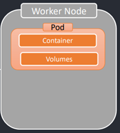
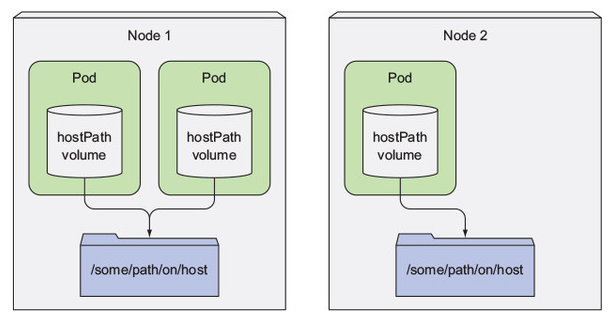
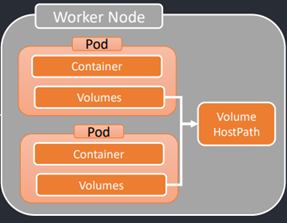

# 🗄️ Sección 15: Kubernetes: Volúmenes

---

## [📦 Introducción a los Volúmenes en Kubernetes](https://kubernetes.io/docs/concepts/storage/volumes/)

En Kubernetes, `los archivos almacenados dentro de un contenedor son efímeros` — existen solo mientras el contenedor
vive. Esto representa un desafío real para aplicaciones que necesitan persistir datos o compartir información entre
contenedores.

### 🧨 Problemas comunes sin volúmenes

1. **Pérdida de datos al reiniciar el contenedor:** Si un contenedor falla o se detiene, todos los archivos creados
   durante su ejecución se pierden. Cuando el `kubelet` lo vuelve a lanzar, el sistema de archivos arranca desde cero —
   como si nunca hubiera ocurrido nada.

2. **Dificultad para compartir datos entre contenedores del mismo Pod:** Cuando varios contenedores comparten un Pod,
   no tienen por defecto un sistema de archivos común. Sin una solución adecuada, compartir datos entre ellos se vuelve
   complicado.

### ✅ ¿Cómo lo resuelve Kubernetes?

Para abordar estos problemas, Kubernetes introduce la abstracción de **volumen**.

> 📌 **¿Qué es un volumen en Kubernetes?** Es un directorio accesible desde uno o varios contenedores dentro de un Pod,
> respaldado por distintos medios de almacenamiento según el tipo de volumen utilizado. A diferencia del **sistema de
archivos del contenedor**, un **volumen puede sobrevivir a los reinicios del contenedor e incluso al Pod completo**,
> dependiendo de su tipo.

### 🧱 Tipos de volúmenes

Kubernetes soporta diversos tipos de volúmenes, y un Pod puede montar varios simultáneamente.
Se clasifican en dos grandes categorías:

| Categoría           | Ciclo de vida                    | Descripción                                                                                               |
|---------------------|----------------------------------|-----------------------------------------------------------------------------------------------------------|
| ⚡ **Efímeros**      | Ligado a la vida del Pod         | Se destruyen cuando el Pod es eliminado. Útiles para datos temporales.                                    |
| 💾 **Persistentes** | Independiente de la vida del Pod | Sobreviven aunque el Pod sea eliminado. Los datos se conservan y pueden ser reutilizados por nuevos Pods. |

> 🔁 **Importante:** Sin importar el tipo, un volumen **conserva sus datos durante los reinicios
> de los contenedores** dentro del mismo Pod. La diferencia está en qué ocurre cuando el Pod
> completo es eliminado, en otras palabras, solo los volúmenes persistentes sobreviven a la eliminación del Pod
> completo.

### 💡 Ejemplo del mundo real

Imagina un Pod con un volumen `emptyDir` (el volumen se monta dentro del pod) y un contenedor que escribe un archivo en
él. Si el contenedor se reinicia por un error interno, **el archivo sigue estando presente** — el volumen
sobrevivió al reinicio del contenedor.

Sin embargo, si el **Pod completo es eliminado**, el comportamiento depende del tipo de volumen:

| Tipo de volumen                          | ¿Qué ocurre al eliminar el Pod?                                  |
|------------------------------------------|------------------------------------------------------------------|
| ⚡ Efímero (`emptyDir`)                   | ❌ El contenido se borra permanentemente.                         |
| 💾 Persistente (`PersistentVolumeClaim`) | ✅ Los datos se conservan y pueden ser montados por un nuevo Pod. |

## [🗂️ Tipos de Volúmenes en detalle](https://kubernetes.io/docs/concepts/storage/volumes/#volume-types)

Como vimos anteriormente, en Kubernetes existen dos grandes categorías de volúmenes:

- `Volúmenes efímeros`: viven mientras el Pod exista.
- `Volúmenes persistentes`: sobreviven incluso si el Pod es eliminado.

A continuación, exploramos algunos de los tipos más comunes.

### [🗂️ emptyDir](https://kubernetes.io/docs/concepts/storage/volumes/#emptydir)

Este es uno de los volúmenes efímeros más utilizados en Kubernetes.

- `El volumen emptyDir se monta dentro del Pod`.
- Su ciclo de vida está ligado directamente al del Pod, no al de los contenedores individuales.
- Se crea `cuando el Pod es asignado a un nodo`, y como su nombre lo indica, `inicialmente está vacío`.
- Todos los contenedores del Pod pueden `leer y escribir archivos compartidos` en este volumen. Pueden montarlo en la
  misma ruta o en rutas distintas según se requiera.
- Cuando el `Pod se elimina`, el volumen `emptyDir` también se `destruye automáticamente`, junto con todos los datos
  almacenados en él. Por eso, se usa comúnmente para `almacenar datos temporales`.

> 📌 **Dato clave:** La caída o reinicio de un contenedor **no elimina** el volumen `emptyDir`. Los datos permanecen
> disponibles mientras el Pod siga activo en el nodo.

**Caso de uso típico:** Almacenar archivos temporales, cachés o resultados intermedios que solo se necesitan durante la
ejecución del Pod.

### [🗂️ hostPath](https://kubernetes.io/docs/concepts/storage/volumes/#hostpath)

`hostPath`: Se utiliza para montar directorios del sistema de archivos del nodo de trabajo en el pod.

Un volumen `hostPath` apunta a un archivo o directorio específico en el sistema de archivos del nodo
(véase la siguiente figura). Los pods que se ejecutan en el mismo nodo (WorkerNode) y utilizan la misma ruta en su
volumen `hostPath` acceden a los mismos archivos.

En la siguiente figura se observa cómo un volumen `hostPath` monta un archivo o directorio del nodo de trabajo en el
sistema de archivos del contenedor.

- Es `externo al Pod`, pero `local al nodo` donde se ejecuta.
- Su uso está `limitado a escenarios donde se tiene control total del nodo`, y por lo general
  `solo es viable en clústeres con un solo nodo` o para tareas muy específicas.

📌 Se puede usar para casos como:

- Acceder a archivos del host que necesita la aplicación (por ejemplo, logs del sistema).
- Exponer sockets de Docker o herramientas de monitoreo.

Los volúmenes `hostPath` son el primer **tipo de almacenamiento persistente** que presentamos, ya que
**el contenido del volúmen `emptyDir` se elimina al finalizar un pod**, mientras que el de un volumen `hostPath` no.
Si se elimina un pod y el siguiente utiliza un volumen `hostPath` que apunta a la misma ruta en el host, el nuevo pod
verá lo que dejó el pod anterior, pero **solo si se ejecuta en el mismo nodo.**

Si está pensando en usar un volumen `hostPath` para almacenar el directorio de datos de una base de datos, piénselo dos
veces. Dado que el contenido del volumen se almacena en el sistema de archivos de un nodo específico, cuando el pod de
la base de datos se reprograme a otro nodo, ya no podrá acceder a los datos. Esto explica por qué no es recomendable
usar un volumen `hostPath` para pods normales, ya que los hace dependientes del nodo en el que se ejecutan.

> 🚨 **Advertencia de seguridad:** El uso de `hostPath` conlleva riesgos importantes, ya que permite al contenedor
> acceder directamente al sistema de archivos del nodo, lo que **puede comprometer el nodo completo** si no se gestiona
> con cuidado.
>
> **Si puedes evitar usar `hostPath`, deberías hacerlo.** La alternativa recomendada es un `PersistentVolume local`
> con las debidas restricciones y aislamiento.

> 📝 **Nota para este curso:** En los siguientes apartados usaremos `hostPath` por su simplicidad en entornos de
> desarrollo y pruebas. Más adelante lo reemplazaremos por una alternativa más segura y desacoplada usando
`PersistentVolume` y `PersistentVolumeClaim`.

### 🗂️[nfs](https://kubernetes.io/docs/concepts/storage/volumes/#nfs), [csi](https://kubernetes.io/docs/concepts/storage/volumes/#csi)

Tanto `nfs` como `csi` están diseñados para funcionar en **clústeres multi-nodo**, permitiendo acceso desde varios
`Worker Nodes` simultáneamente.

### 📁 nfs – Network File System

- Un volumen `nfs` permite montar un recurso compartido NFS existente en uno o varios Pods.
- A diferencia de `emptyDir`, `el contenido no se elimina cuando el Pod se borra`; simplemente se desmonta.
- Esto permite que el volumen:
    - `Esté pre-poblado con datos`.
    - `Comparta información entre múltiples Pods`, incluso si están en nodos distintos.
    - `Admite múltiples escritores simultáneamente`, lo cual es ideal para escenarios de acceso concurrente.

> 📌 Es importante contar con un servidor NFS configurado y accesible desde todos los nodos del clúster.

### 📦 csi – Container Storage Interface

- CSI define una `interfaz estándar` y extensible para integrar soluciones de almacenamiento externas con Kubernetes.
- Gracias a CSI, los proveedores de almacenamiento (como AWS EBS, GCP PD, Ceph, NetApp, etc.) pueden ofrecer volúmenes
  que Kubernetes puede montar automáticamente.
- Permite que Kubernetes `interactúe con cualquier sistema de almacenamiento compatible con CSI`, tanto para clústeres
  on-premise como en la nube.
- CSI reemplaza gradualmente a muchos controladores in-tree antiguos, y es el enfoque recomendado para nuevas
  implementaciones.

### 📊 Resumen comparativo de tipos de volúmenes

Este cuadro es nuestra guía rápida para decidir qué almacenamiento usar según la criticidad de los datos.

| Tipo        | ¿Sobrevive al reinicio del Contenedor? | ¿Sobrevive al borrado del Pod?                                                                     | ¿Compartido entre Nodos? |
|-------------|----------------------------------------|----------------------------------------------------------------------------------------------------|--------------------------|
| `emptyDir`  | ✅ Sí                                   | ❌ **No**. Se limpia al eliminar el Pod.                                                            | ❌ No                     |
| `hostPath`  | ✅ Sí                                   | ✅ **Sí**, pero los datos son locales al nodo. Si el Pod revive en otro nodo, **pierde el acceso**. | ❌ No                     |
| `nfs`       | ✅ Sí                                   | ✅ **Sí**. Los datos residen en un servidor externo.                                                | ✅ Sí                     |
| `PVC (CSI)` | ✅ Sí                                   | ✅ **Sí**. Es el estándar para almacenamiento en la nube y enterprise.                              | ⚠️ Depende del Driver*   |

#### 📝 Notas aclaratorias

- **El matiz del `hostPath`:** Aunque los datos sobreviven en el disco duro del nodo físico, para Kubernetes ese Pod
  ha "perdido" sus datos si el orquestador decide moverlo a otro servidor (Worker Node) por falta de recursos. Por eso
  se dice que no es una solución de alta disponibilidad.

- **Dependencia del `Driver` en `CSI`:** Algunos drivers de CSI (como AWS EBS) son ReadWriteOnce, lo que significa que
  solo pueden ser montados por un nodo a la vez. Otros (como Azure Files o Ceph) permiten ReadWriteMany, compartiendo
  datos entre múltiples nodos.
