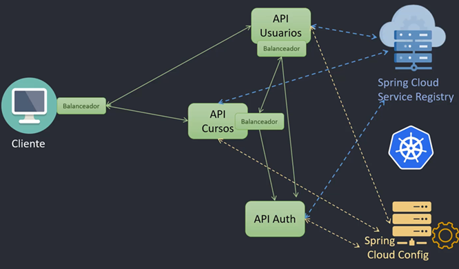
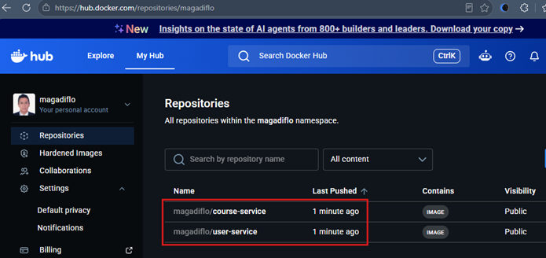

# ☁️☸️ Sección 17: Kubernetes — Spring Cloud Kubernetes

---

## 🤔 ¿Por qué usar Spring Cloud Kubernetes si Kubernetes ya ofrece todo?

Una de las dudas más comunes al trabajar con `Spring Boot` en `Kubernetes` es entender si
realmente necesitamos integrar `Spring Cloud Kubernetes`, considerando que el propio Kubernetes
ya proporciona muchas funcionalidades esenciales de forma nativa:

| Funcionalidad nativa de Kubernetes | Descripción                                                                                                              |
|------------------------------------|--------------------------------------------------------------------------------------------------------------------------|
| 🔍 **Service Discovery**           | DNS interno que permite llamar a otros microservicios por su nombre lógico (ej. `http://svc-user-service`).              |
| ⚖️ **Load Balancing**              | Los objetos `Service` (`ClusterIP`, `NodePort`, `LoadBalancer`) distribuyen el tráfico entre Pods de forma transparente. |
| ⚙️ **Externalized Configuration**  | `ConfigMaps` y `Secrets` permiten inyectar configuración desde fuera de la aplicación.                                   |

Entonces, **¿para qué añadir `spring-cloud-starter-kubernetes` a nuestro `pom.xml`?**

### ✅ ¿Qué aporta Spring Cloud Kubernetes?

`Spring Cloud Kubernetes` **no reemplaza** lo que ya hace Kubernetes — lo **integra de forma
idiomática** dentro del ecosistema Spring. Traduce los recursos nativos del clúster a
componentes nativos de Java, facilitando la vida del desarrollador en escenarios específicos:

#### 1️⃣ Mapeo directo de ConfigMaps y Secrets como propiedades de Spring Boot

Con `Spring Cloud Kubernetes`, los valores definidos en un `ConfigMap` pueden inyectarse
directamente en tus componentes con `@Value` o `@ConfigurationProperties`, sin necesidad de
definir variables de entorno ni leer archivos manualmente.

```yaml
# ConfigMap en Kubernetes
apiVersion: v1
kind: ConfigMap
metadata:
  name: app-config
data:
  greeting.message: "Hola desde ConfigMap"
```

```java
// En tu componente Spring Boot
@Value("${greeting.message}")
private String message;
```

Spring lee el `ConfigMap` automáticamente y lo inyecta como si fuera una propiedad de
`application.properties`. No necesitas preocuparte por cómo llegar al `ConfigMap`.

#### 2️⃣ Compatibilidad con `DiscoveryClient` de Spring Cloud

Kubernetes ya ofrece DNS para descubrir servicios. Sin embargo, si vienes de una arquitectura
basada en `Spring Cloud Eureka`, es probable que tengas código que usa la interfaz
`DiscoveryClient`. `Spring Cloud Kubernetes` implementa esta misma interfaz usando la API de
Kubernetes, permitiéndote **mantener ese código sin cambios**.

#### 3️⃣ Balanceo de carga del lado del cliente (*Client-Side Load Balancing*)

Kubernetes balancea el tráfico a nivel de red (server-side). Sin embargo, `Spring Cloud
Kubernetes` permite usar `@LoadBalanced RestTemplate` o `WebClient` con estrategias de balanceo
definidas por el propio cliente.

> 💡 **¿Qué es el balanceo del lado del cliente?**  
> Es cuando la lógica de elegir a qué instancia de un servicio enviar la solicitud está **implementada en el propio
> microservicio** que hace la llamada — no en la infraestructura de red.
>
> | Tipo | ¿Quién decide? | Ejemplo |
> |---|---|---|
> | **Server-side** | La red / infraestructura | `Service` de Kubernetes |
> | **Client-side** | El propio microservicio | `@LoadBalanced` con Spring Cloud |

#### 4️⃣ Puente para migrar desde arquitecturas Spring Cloud tradicionales

Si tu proyecto ya usa herramientas como `Config Server`, `Eureka` o `Ribbon`, `Spring Cloud
Kubernetes` ofrece un puente para **migrar a Kubernetes sin tener que reescribir toda la lógica**
de integración de servicios y configuración.

### 🔎 ¿Lo necesito?

| Escenario                                                                          | ¿Necesito Spring Cloud Kubernetes? |
|------------------------------------------------------------------------------------|------------------------------------|
| Aplicación nueva diseñada específicamente para Kubernetes                          | ❌ Probablemente no                 |
| No usas `DiscoveryClient` ni `Config Server`                                       | ❌ Probablemente no                 |
| Confías en Kubernetes para el balanceo y la configuración via variables de entorno | ❌ Probablemente no                 |
| Migrando desde un stack `Spring Cloud` tradicional                                 | ✅ Puede ayudarte mucho             |
| Quieres inyectar `ConfigMaps` directamente con `@Value`                            | ✅ Puede ayudarte mucho             |
| Deseas mantener una arquitectura desacoplada de Kubernetes                         | ✅ Puede ayudarte mucho             |

### 📌 Conclusión

> Aunque `Spring Cloud Kubernetes` **no es obligatorio**, puede simplificar significativamente
> la integración entre el mundo de Kubernetes y el ecosistema Spring — especialmente cuando
> ya aprovechas otras herramientas de `Spring Cloud` o cuando migras desde una arquitectura
> tradicional hacia Kubernetes.

## 🌐 Introducción a Spring Cloud Kubernetes

### ¿Qué es Spring Cloud Kubernetes?

`Spring Cloud Kubernetes` proporciona una **integración entre el ecosistema Spring Cloud y Kubernetes**, permitiendo a
los desarrolladores ejecutar aplicaciones Spring Cloud de forma nativa sobre una infraestructura orquestada por
Kubernetes.

Esta integración facilita tareas comunes como `descubrimiento de servicios`, `balanceo de carga`,
`configuración externa` y `enrutamiento` — utilizando componentes que ya existen en Kubernetes, pero
**alineados al estilo de desarrollo de Spring**.

### 🧩 Principales características

#### 🔍 DiscoveryClient

Escanea dinámicamente la API de Kubernetes para mapear los objetos `Service` activos (como `svc-user-service` o
`svc-course-service`), obteniendo en tiempo real las direcciones IP y puertos de sus respectivos Pods asociados.
Esto permite que los microservicios se comuniquen entre sí utilizando únicamente el nombre del `Service` definido
en Kubernetes (por ejemplo, `http://svc-course-service`), abstrayéndose por completo de las IPs volátiles de los
contenedores.

> ⚠️ **Nota de arquitectura:**  
> A diferencia de un entorno tradicional con `Spring Cloud Eureka` (donde el descubrimiento se basa en la propiedad
> `spring.application.name` del archivo `application.yml`), en Kubernetes el identificador de ruta obligatorio es
> el nombre del objeto `Service` (`metadata.name`) definido en los manifiestos YAML del clúster.

#### ⚙️ Spring Cloud Config

Permite cargar configuraciones externas directamente desde `ConfigMaps` y `Secrets` de Kubernetes, integrándolos al
sistema de propiedades de Spring Boot. Esto elimina la necesidad de definir variables de entorno manualmente para cada
valor de configuración.

#### ⚖️ Spring Cloud LoadBalancer

Proporciona una implementación de **balanceo de carga del lado del cliente** (*client-side*), usando como base los
servicios y Pods registrados en Kubernetes. Permite aplicar estrategias de balanceo más flexibles y personalizadas que
las ofrecidas por defecto por Kubernetes a nivel de red.

#### 🚪 Spring Cloud Gateway

Actúa como **puerta de enlace única** (*API Gateway*) para acceder a los distintos microservicios. Cada ruta
configurada en el Gateway puede dirigir el tráfico al servicio correspondiente, simplificando el acceso desde el
exterior y centralizando aspectos como autenticación, autorización y enrutamiento.

### 🏗️ Arquitectura general del sistema



La arquitectura de `Spring Cloud Kubernetes` se compone de cuatro elementos principales que
trabajan en conjunto:

| Componente                        | Rol en la arquitectura                                                                                                                                                                                     |
|-----------------------------------|------------------------------------------------------------------------------------------------------------------------------------------------------------------------------------------------------------|
| **Cliente**                       | Se comunica con los microservicios a través del Gateway. Cada microservicio está respaldado por varios Pods que representan sus instancias en ejecución.                                                   |
| **Spring Cloud Service Registry** | Actúa como `DiscoveryClient`. Lee la API de Kubernetes para obtener los servicios y sus Pods (IP y puerto), usando el nombre del `Service` del clúster para que los microservicios se comuniquen entre sí. |
| **Spring Cloud LoadBalancer**     | Cada microservicio lo usa para seleccionar de forma inteligente a qué Pod enviar cada solicitud, basándose en la lista obtenida de Kubernetes a través del `DiscoveryClient`.                              |
| **Spring Cloud Config**           | Administra la configuración de cada microservicio aprovechando los recursos nativos de Kubernetes (`ConfigMaps` y `Secrets`), integrándolos al sistema de propiedades de Spring Boot.                      |

> 💡 Esta arquitectura permite **desacoplar la lógica de negocio de la infraestructura**, aprovechando lo mejor de
> ambos mundos: **el poder de orquestación de Kubernetes** y la **flexibilidad del ecosistema Spring.**

## 📦 Agregando Dependencias de Spring Cloud Kubernetes a los Microservicios

Para habilitar la integración de nuestros microservicios con Kubernetes usando Spring Cloud, necesitamos incluir un
conjunto de dependencias en el `pom.xml` de cada microservicio. En nuestro caso, las agregaremos en `course-service` y
`user-service`.

Estas dependencias habilitan tres capacidades clave:

| Capacidad                          | Descripción                                                         |
|------------------------------------|---------------------------------------------------------------------|
| 🔍 **Descubrimiento de servicios** | Resolución de nombres de servicios usando el cliente de Kubernetes. |
| ⚙️ **Configuración externa**       | Carga de propiedades desde `ConfigMaps` y `Secrets`.                |
| ⚖️ **Balanceo de carga**           | Distribución de peticiones entre los Pods de un mismo servicio.     |

### 📄 Dependencias en `pom.xml`

> [🔗 Documentación oficial — Spring Cloud Kubernetes](https://docs.spring.io/spring-cloud-kubernetes/reference/index.html)

````xml

<dependencies>
    <!-- Cliente de Kubernetes para descubrimiento de servicios -->
    <dependency>
        <groupId>org.springframework.cloud</groupId>
        <artifactId>spring-cloud-starter-kubernetes-client</artifactId>
    </dependency>
    <!-- Integración con ConfigMaps y Secrets para configuración externa -->
    <dependency>
        <groupId>org.springframework.cloud</groupId>
        <artifactId>spring-cloud-starter-kubernetes-client-config</artifactId>
    </dependency>
    <!-- Balanceador de carga basado en el cliente de Kubernetes -->
    <dependency>
        <groupId>org.springframework.cloud</groupId>
        <artifactId>spring-cloud-starter-kubernetes-client-loadbalancer</artifactId>
    </dependency>
</dependencies>
````

### 🔍 ¿Qué hace cada dependencia?

#### 📌 `spring-cloud-starter-kubernetes-client`

Implementa el `DiscoveryClient` de Spring Cloud usando la API de Kubernetes. Permite que los microservicios **descubran
otros servicios dentro del clúster usando el nombre lógico del `Service` de Kubernetes**, en lugar de una IP fija o un
puerto específico.

Por ejemplo, en lugar de llamar a `http://10.244.0.27:8001`, simplemente usas `http://svc-user-service` —
`Spring Cloud Kubernetes` resuelve el nombre automáticamente.

#### 📌 `spring-cloud-starter-kubernetes-client-config`

Habilita la carga automática de configuración desde `ConfigMaps` y `Secrets` de Kubernetes, integrándolos directamente
al sistema de propiedades de Spring Boot. Además, **recarga automáticamente las propiedades** cuando un `ConfigMap` o
`Secret` cambia, sin necesidad de recompilar ni redesplegar la aplicación.

> 💡 Esto lleva el desacoplamiento de configuración un paso más allá que las variables de entorno — los valores pueden
> actualizarse en caliente directamente desde Kubernetes.

#### 📌 `spring-cloud-starter-kubernetes-client-loadbalancer`

Proporciona balanceo de carga entre los Pods de un mismo servicio, usando el `Service` de Kubernetes como punto de
entrada. Funciona en dos modos:

| Modo                     | Descripción                                                                                                                                                          |
|--------------------------|----------------------------------------------------------------------------------------------------------------------------------------------------------------------|
| `POD` *(predeterminado)* | Spring Cloud obtiene la lista de IPs directas de los Pods (vía el recurso `Endpoints` de Kubernetes) y el propio microservicio elige a cuál Pod enviarle el tráfico. |
| `SERVICE`                | Spring Cloud envía la petición directamente al Host del `Service` de Kubernetes, delegando el balanceo final al proxy nativo del clúster (`kube-proxy`).             |

### 💡 Notas importantes

> - 🛡️ `Cliente Oficial`: Estas dependencias utilizan el cliente nativo y oficial de Kubernetes mantenido por el equipo
    de Spring, dejando atrás las antiguas librerías basadas en `Fabric8`.
> - 🌐 `Abstracción de Red`: Toda la comunicación interna entre tus aplicaciones se simplifica. Spring Cloud se apoya en
    Kubernetes para resolver rutas usando únicamente el nombre del `Service` (ej. `http://svc-user-service`),
    manteniendo el código Java limpio y portable.
> - 🚦 `Control del Balanceo`: Al incluir el `LoadBalancer`, la aplicación recupera la capacidad de interceptar
    peticiones HTTP (usando `WebClient` o `RestTemplate` anotados con `@LoadBalanced`) para decidir el enrutamiento
    antes de que la petición abandone el contenedor.

## 🔍 Habilitando el Descubrimiento de Servicios en el Código

Para que nuestras aplicaciones de Spring Boot utilicen activamente el mecanismo de descubrimiento provisto por
`Spring Cloud Kubernetes`, la práctica recomendada es marcar la clase principal de cada microservicio (`user-service` y
`course-service`) con la anotación `@EnableDiscoveryClient`.

A continuación, se muestra cómo debe quedar la clase principal del microservicio de usuarios (aplica exactamente el
mismo cambio en el de cursos):

````java
package dev.magadiflo.user.app;

import org.springframework.boot.SpringApplication;
import org.springframework.boot.autoconfigure.SpringBootApplication;
import org.springframework.cloud.client.discovery.EnableDiscoveryClient;

@EnableDiscoveryClient
@SpringBootApplication
public class UserServiceApplication {
    public static void main(String[] args) {
        SpringApplication.run(UserServiceApplication.class, args);
    }
}
````

> 🧠 `@EnableDiscoveryClient` **es opcional**  
> Así es. Técnicamente hablando, en las versiones modernas de `Spring Cloud`, la anotación `@EnableDiscoveryClient`
> ya no es estrictamente obligatoria. El simple hecho de haber agregado la dependencia
> `spring-cloud-starter-kubernetes-client` en el `pom.xml` dispara la `auto-configuración` del `DiscoveryClient`
> en el arranque de la aplicación.

### 📌 ¿Cuándo se recomienda incluirla?

- `Claridad y Documentación`: Hace completamente explícito en el código fuente que esa aplicación participa activamente
  en un ecosistema de Service Discovery. Cualquier desarrollador que abra el proyecto entenderá la arquitectura de
  inmediato.
- `Entornos Multi-Clúster o Híbridos`: En proyectos grandes, donde trabajas con múltiples tipos de descubrimiento
  (Eureka, Consul, Kubernetes, etc.), usarla deja claro cuál es la intención.
- `Control de Configuración`: Es de utilidad si en algún momento decides apagar la auto-configuración global en el
  `application.yml` (`spring.cloud.discovery.enabled=false`) pero necesitas forzar o testear el comportamiento del
  cliente de forma explícita en componentes específicos.

¿Qué pasa si la dejas o la quitas en tu caso con `Kubernetes`?

- `Si la dejas` → No pasa nada malo. Funciona igual, solo haces explícito el uso del descubrimiento.
- `Si la quitas` → Todo seguirá funcionando igual, porque el `DiscoveryClient` de `Kubernetes` ya se activa con la
  dependencia.

### 🔄 ¿Qué pasa en nuestro laboratorio si la dejas o la quitas?

- **Si la dejas:** No pasa absolutamente nada malo. No añade sobrecarga de rendimiento y dejas el código bien
  documentado siguiendo el estándar histórico de Spring Cloud. Funciona igual, solo haces explícito el uso del
  descubrimiento.
- **Si la quitas:** El proyecto seguirá compilando, levantando y descubriendo los `Services` de `Kubernetes`
  exactamente igual, ya que el starter se encarga de activar el puente con la API del clúster de forma automática.

### ✅ Conclusión Técnica

> En `Kubernetes` con `Spring Cloud Kubernetes`, no es estrictamente necesario usar `@EnableDiscoveryClient`.
> Con solo la dependencia `spring-cloud-starter-kubernetes-client` ya tienes descubrimiento de servicios habilitado.
> La anotación queda como algo opcional/declarativo, más que técnico.

## 🔍 Funcionamiento de `RestClient` en Spring Boot 4

### Contexto: RestClient en `Spring Boot 3` vs `Spring Boot 4`

`RestClient` fue introducido en **Spring Framework 6.1** como el sucesor moderno de `RestTemplate`.
Desde Spring Boot 3.2, ya estaba disponible para usar — y la forma de trabajar con él era sencilla: Spring Boot
auto-configuraba un bean `RestClient.Builder` que podías inyectar directamente en tus componentes sin ninguna
dependencia adicional, ya que venía incluido en `spring-boot-starter-web`.

En **Spring Boot 4**, esto cambió. El equipo de Spring modularizó toda la base de código y separó las
auto-configuraciones en artefactos independientes. Como consecuencia:

| Comportamiento                                                   | Spring Boot 3                              | Spring Boot 4                                     |
|------------------------------------------------------------------|--------------------------------------------|---------------------------------------------------|
| `RestClient` como clase (`RestClient.builder()`)                 | ✅ Disponible con `spring-boot-starter-web` | ✅ Sigue disponible con `spring-boot-starter-web`  |
| Bean `RestClient.Builder` **auto-configurado** por Spring        | ✅ Disponible automáticamente               | ❌ Requiere `spring-boot-starter-restclient`       |
| Clases de configuración avanzada (`RestClientBuilderConfigurer`) | ❌ No existía                               | ✅ Disponible con `spring-boot-starter-restclient` |

> 💡 En resumen: en Spring Boot 4, **crear un `RestClient` manualmente sigue funcionando
> sin dependencias adicionales**. Lo que ya no funciona sin el starter es **inyectar el
> `RestClient.Builder` auto-configurado por Spring Boot**.

### ¿Qué es `spring-boot-starter-restclient`?

Desde `Spring Initializr` podemos agregar esta dependencia buscándola como `"HTTP Client"`.
Su descripción oficial dice:

> *"Spring Boot integration for RestClient and RestTemplate to make HTTP requests."*

En nuestro caso particular, nos servirá para acceder a la clase `RestClientBuilderConfigurer`, que nos permite definir
un `RestClient.Builder` personalizado cuya configuración está basada en la generada por la `auto-configuración`
de Spring Boot — incluyendo características como `observabilidad`, `métricas` y `conversores de mensajes`.

### 🧪 Experimentos

Para entender mejor este comportamiento, veamos tres experimentos concretos usando una API pública gratuita
(`jsonplaceholder.typicode.com`).

#### ✅ Experimento 1 — Bean manual (solo `spring-boot-starter-web`)

Creamos el `RestClient` manualmente en una clase de configuración y lo inyectamos en el
servicio:

```java

@Configuration
public class RestClientConfig {
    @Bean
    public RestClient restClient() {
        return RestClient.builder()
                .baseUrl("https://jsonplaceholder.typicode.com")
                .build();
    }
}
```

```java

@Service
public class PostService {

    private final RestClient restClient;

    public PostService(RestClient restClient) {
        this.restClient = restClient;
    }

    public String getPost() {
        return this.restClient.get()
                .uri("/posts/1")
                .retrieve()
                .body(String.class);
    }
}
```

**Resultado:** ✅ Funciona correctamente.

```json
{
  "userId": 1,
  "id": 1,
  "title": "sunt aut facere repellat provident occaecati excepturi optio reprehenderit",
  "body": "quia et suscipit\nsuscipit recusandae consequuntur expedita et cum\nreprehenderit molestiae ut ut quas totam\nnostrum rerum est autem sunt rem eveniet architecto"
}
```

> 💡 **¿Por qué funciona?** Porque `RestClient.builder()` es un método estático de la clase `RestClient`, que viene
> incluida en `spring-web` — parte de `spring-boot-starter-web`. No se está pidiendo ningún bean auto-configurado a
> Spring.

#### ❌ Experimento 2 — Inyección del builder sin bean ni dependencia adicional (solo `spring-boot-starter-web`)

Eliminamos la clase de configuración e intentamos que Spring inyecte el `RestClient.Builder`
automáticamente, sin agregar ninguna dependencia adicional:

```java

@Service
public class PostService {

    private final RestClient restClient;

    public PostService(RestClient.Builder builder) {
        this.restClient = builder
                .baseUrl("https://jsonplaceholder.typicode.com")
                .build();
    }

    public String getPost() {
        return this.restClient.get()
                .uri("/posts/1")
                .retrieve()
                .body(String.class);
    }
}
```

**Resultado:** ❌ La aplicación falla al arrancar.

```bash
Description:
Parameter 0 of constructor in com.example.demo.PostService required a bean of type
'org.springframework.web.client.RestClient$Builder' that could not be found.

Action:
Consider defining a bean of type 'org.springframework.web.client.RestClient$Builder'
in your configuration.
```

> ⚠️ **¿Por qué falla?**  
> En Spring Boot 4, el bean `RestClient.Builder` ya no se auto-configura con solo tener `spring-boot-starter-web`.
> Spring no sabe cómo satisfacer esa inyección porque nadie registró ese bean en el contexto.

#### ✅ Experimento 3 — Con `spring-boot-starter-restclient` y sin bean manual (incluye `spring-boot-starter-web`)

A nuestra dependencia `spring-boot-starter-web` le agregamos la dependencia adicional:

```xml

<dependency>
    <groupId>org.springframework.boot</groupId>
    <artifactId>spring-boot-starter-restclient</artifactId>
</dependency>
```

Y mantenemos el mismo código del `Experimento 2`, sin ninguna clase de configuración ni bean manual:

```java

@Service
public class PostService {

    private final RestClient restClient;

    public PostService(RestClient.Builder builder) {
        this.restClient = builder
                .baseUrl("https://jsonplaceholder.typicode.com")
                .build();
    }

    public String getPost() {
        return this.restClient.get()
                .uri("/posts/1")
                .retrieve()
                .body(String.class);
    }
}
```

**Resultado:** ✅ Funciona correctamente.

```json
{
  "userId": 1,
  "id": 1,
  "title": "sunt aut facere repellat provident occaecati excepturi optio reprehenderit",
  "body": "quia et suscipit\nsuscipit recusandae consequuntur expedita et cum\nreprehenderit molestiae ut ut quas totam\nnostrum rerum est autem sunt rem eveniet architecto"
}
```

> 💡 **¿Por qué funciona ahora?**  
> Al agregar `spring-boot-starter-restclient`, Spring Boot registra automáticamente un bean `RestClient.Builder` en el
> contexto, listo para ser inyectado. Este builder viene pre-configurado con características como `observabilidad`,
> `métricas` y `conversores de mensajes HTTP`.

### 📊 Resumen de los experimentos

| Experimento | Configuración                                                                        | Resultado                                                                               |
|-------------|--------------------------------------------------------------------------------------|-----------------------------------------------------------------------------------------|
| 1           | Bean manual + solo `spring-boot-starter-web`                                         | ✅ Funciona — `RestClient` creado manualmente no depende de auto-configuración.          |
| 2           | Solo `spring-boot-starter-web` + inyección del builder sin bean ni starter adicional | ❌ Falla — Spring Boot 4 no auto-configura `RestClient.Builder` sin el starter adecuado. |
| 3           | `spring-boot-starter-web` + inyección del builder + `spring-boot-starter-restclient` | ✅ Funciona — el starter registra el bean `RestClient.Builder` automáticamente.          |

## 🔧 Configuración del `RestClient` en el Microservicio `user-service`

> [🔗 Documentación oficial — Spring RestClient as a LoadBalancer Client](https://docs.spring.io/spring-cloud-commons/reference/spring-cloud-commons/common-abstractions.html#rest-client-loadbalancer-client)

Para permitir la comunicación entre microservicios dentro del clúster de Kubernetes, configuramos un cliente HTTP
usando `RestClient`. Este cliente será capaz de **resolver el nombre lógico del servicio destino**
(`svc-course-service`) y **distribuir las peticiones** entre sus réplicas mediante balanceo de carga.

### 📦 Dependencia adicional requerida

Aunque `RestClient` como clase está disponible con solo tener `spring-boot-starter-web`, necesitamos agregar la
siguiente dependencia para acceder a la clase `RestClientBuilderConfigurer`:

````xml

<dependencies>
    <dependency>
        <groupId>org.springframework.boot</groupId>
        <artifactId>spring-boot-starter-restclient</artifactId>
    </dependency>
    <dependency>
        <groupId>org.springframework.boot</groupId>
        <artifactId>spring-boot-starter-restclient-test</artifactId>
        <scope>test</scope>
    </dependency>
</dependencies>
````

> 💡 **¿Por qué necesitamos `RestClientBuilderConfigurer`?**  
> Esta clase nos permite dotar a nuestro `RestClient.Builder` de las mismas características que Spring Boot aplicaría
> automáticamente a su builder `auto-configurado` — incluyendo **observabilidad**, **trazabilidad**
> (`traceId`, `spanId`) y conversores de mensajes HTTP.
>
> Si bien en esta arquitectura no estamos implementando observabilidad aún, es una **buena práctica** configurarlo
> desde ahora — cuando en el futuro agreguemos trazabilidad distribuida, el `RestClient` ya estará listo para
> propagarla automáticamente entre microservicios.
>
> Para más contexto sobre la problemática y su solución en Spring Boot 3, puedes revisar:
> [Propagando contexto de trazas entre microservicios con RestClient + LoadBalanced](https://github.com/magadiflo/microservices-project/blob/main/11.trazabilidad_distribuida_con_micrometer_tracing_y_zipkin.md#propagando-contexto-de-trazas-entre-microservicios-con-restclient--loadbalanced)

### 🛠️ Clase de configuración: `RestClientConfig`

````java

@Configuration
public class RestClientConfig {

    @Value("${custom.course-service.base-url}")
    private String courseServiceBaseUrl;

    @LoadBalanced
    @Bean
    public RestClient.Builder restClientBuilder(RestClientBuilderConfigurer configurer) {
        return configurer.configure(RestClient.builder());
    }

    @Bean(name = "courseRestClient")
    public RestClient courseServiceRestClient(@Qualifier("restClientBuilder") RestClient.Builder builder) {
        return builder
                .baseUrl(this.courseServiceBaseUrl)
                .build();
    }
}
````

> 💡 **¿Por qué dos beans?**  
> El primer bean (`RestClient.Builder`) resuelve los dos problemas técnicos: `@LoadBalanced`
> para el balanceo de carga y `RestClientBuilderConfigurer` para la observabilidad. El segundo bean (`RestClient`)
> consume el primero, le agrega la `baseUrl` y queda listo para inyectar en los componentes que lo necesiten.

#### 🔄 Alternativa sin `spring-boot-starter-restclient`

Si no necesitamos las características adicionales, podríamos simplificar la configuración así:

```java

@Configuration
public class MyConfiguration {

    @LoadBalanced
    @Bean
    public RestClient.Builder restClientBuilder() {
        return RestClient.builder();
    }
}
```

Esta versión funciona para el balanceo de carga, pero **no propaga trazas** cuando se agregue observabilidad en el
futuro. Por eso preferimos la versión con `RestClientBuilderConfigurer`.

#### 📌 Puntos clave de la configuración

**1. `.baseUrl(...)` — Solo el nombre lógico del servicio**

| ✅ Correcto                               | ❌ Incorrecto                                        |
|------------------------------------------|-----------------------------------------------------|
| `http://svc-course-service`              | `http://svc-course-service:8002`                    |
| Solo el nombre del Service de Kubernetes | Con puerto — rompe la resolución de `@LoadBalanced` |
| Sin rutas (`/api/v1/...`)                | Con rutas — el `baseUrl` no debe incluirlas         |

> ⚠️ El `@LoadBalanced` necesita que el host sea **únicamente el nombre lógico del servicio** para poder resolverlo
> correctamente. **Si estás trabajando sin Spring Cloud Kubernetes, entonces sí puedes incluir el puerto.**

**2. `@LoadBalanced` en el `RestClient.Builder`**

Al anotar el bean con `@LoadBalanced`, **Spring Cloud Kubernetes** intercepta automáticamente cada petición y:

- Consulta el clúster para encontrar las réplicas del servicio.
- Selecciona una instancia según la estrategia de balanceo configurada.
- Distribuye las peticiones automáticamente entre los Pods disponibles.

**3. `RestClientBuilderConfigurer`**

Aplica al `RestClient.Builder` manual todas las configuraciones que Spring Boot habría aplicado automáticamente a su
builder auto-configurado — sin incurrir en el problema de dependencia circular que ocurriría al inyectar el builder
auto-configurado directamente.

### 🛠️ Clase cliente: `CourseServiceClient`

Encapsulamos todas las llamadas al microservicio `course-service` en una clase dedicada, manteniendo la configuración y
la lógica de negocio completamente desacopladas:

````java

@Slf4j
@Component
public class CourseServiceClient {

    private static final String COURSE_URI = "/api/v1/courses";
    private final RestClient restClient;

    public CourseServiceClient(@Qualifier("courseRestClient") RestClient restClient) {
        this.restClient = restClient;
    }

    /**
     * Notifica al course-service para eliminar las asociaciones de un usuario.
     *
     * @param userId Identificador del usuario eliminado.
     */
    public void unassignUserFromAssociatedCourse(Long userId) {
        log.info("Llamando al [course-service] para des-asignar al usuario con id [{}] de algún curso", userId);

        this.restClient
                .delete()
                .uri(COURSE_URI.concat("/users/{userId}"), userId)
                .retrieve()
                .toBodilessEntity(); // Operación asincrónica lógica (fire and forget)

        log.info("Fin de la llamada al [course-service] para des-asignar al usuario con id: {}", userId);
    }
}
````

#### ✅ Buenas prácticas aplicadas

| Práctica                            | Descripción                                                                                          |
|-------------------------------------|------------------------------------------------------------------------------------------------------|
| `@Qualifier`                        | Evita conflictos cuando hay múltiples beans `RestClient` registrados.                                |
| **Separación de responsabilidades** | `RestClientConfig` gestiona la configuración; `CourseServiceClient` encapsula la lógica de llamadas. |
| **Logging informativo**             | Registra el inicio y fin de cada llamada para facilitar la trazabilidad.                             |
| **Constantes para URIs**            | Reduce errores tipográficos y facilita cambios futuros en un solo lugar.                             |

## 🛠️ Configurando Spring Cloud Kubernetes en `user-service`

En el archivo `application.yml` del microservicio `user-service`, agregamos las configuraciones necesarias para
habilitar la integración con `Spring Cloud Kubernetes`:

````yml
spring:
  application:
    name: user-service
  cloud:
    kubernetes:
      secrets:
        enable-api: true
      discovery:
        all-namespaces: true

custom:
  course-service:
    base-url: http://${K8S_COURSE_SERVICE_NAME}
````

### 🔍 Explicación de las propiedades

| Propiedad                                          | Valor  | Descripción                                                                                            |
|----------------------------------------------------|--------|--------------------------------------------------------------------------------------------------------|
| `spring.cloud.kubernetes.secrets.enable-api`       | `true` | Permite leer `Secrets` directamente desde la API de Kubernetes, además de los montados como volúmenes. |
| `spring.cloud.kubernetes.discovery.all-namespaces` | `true` | Permite descubrir servicios en todos los namespaces del clúster, no solo en el namespace actual.       |

> 💡 **Propiedad implícita — `spring.cloud.kubernetes.secrets.enabled`:** Aunque no la definimos explícitamente,
> su valor por defecto es `true`. Esta propiedad permite que Spring Cloud Kubernetes cargue los `Secrets` como una
> fuente de propiedades (`PropertySource`), complementando a `enable-api` — juntas permiten leer secretos tanto desde
> volúmenes montados como directamente desde la API de Kubernetes.

### 🔄 Cambio en `base-url`

Observemos que hemos modificado el valor de `custom.course-service.base-url`:

| Antes (Kubernetes puro)                                | Después (Spring Cloud Kubernetes)           |
|--------------------------------------------------------|---------------------------------------------|
| `http://${COURSE_SERVICE_HOST}:${COURSE_SERVICE_PORT}` | `http://${K8S_COURSE_SERVICE_NAME}`         |
| Requiere nombre del servicio **y** puerto explícitos   | Solo requiere el nombre lógico del servicio |

Este cambio se debe a que, al incorporar `Spring Cloud Kubernetes`, **ya no es necesario especificar manualmente el
puerto ni la IP** del servicio destino. El framework resuelve automáticamente la dirección completa a partir del nombre
del servicio, usando el DNS interno de Kubernetes.

> 📌 El valor de la variable de entorno `K8S_COURSE_SERVICE_NAME` lo definiremos más adelante en el `Deployment` del
> microservicio.

#### 📌 **Nota técnica — Kubernetes puro vs Spring Cloud Kubernetes:**

| Escenario                   | `base-url` requerido                                                                  |
|-----------------------------|---------------------------------------------------------------------------------------|
| **Kubernetes puro**         | `http://${COURSE_SERVICE_HOST}:${COURSE_SERVICE_PORT}` — nombre y puerto obligatorios |
| **Spring Cloud Kubernetes** | `http://${K8S_COURSE_SERVICE_NAME}` — solo el nombre lógico del servicio              |

> ⚠️ **Advertencia:**  
> Si defines `base-url` incluyendo el puerto cuando usas Spring Cloud Kubernetes, el balanceo de
> carga **no funcionará correctamente** y perderás la resolución automática de endpoints que ofrece el framework.

## 🔧 Configuración del `RestClient` en el microservicio `course-service`

Para cerrar el circuito de comunicación, dotaremos al microservicio `course-service` de las mismas capacidades de
descubrimiento y balanceo del lado del cliente. Esto le permitirá interrogar a `user-service` de manera segura
utilizando únicamente el nombre de su recurso en el clúster.

### 📦 Dependencias Requeridas

Incluimos el Starter de cliente HTTP en el archivo `pom.xml` de `course-service` para habilitar el uso del configurador
automático de `Spring Boot 4`:

````xml

<dependencies>
    <dependency>
        <groupId>org.springframework.boot</groupId>
        <artifactId>spring-boot-starter-restclient</artifactId>
    </dependency>
    <dependency>
        <groupId>org.springframework.boot</groupId>
        <artifactId>spring-boot-starter-restclient-test</artifactId>
        <scope>test</scope>
    </dependency>
</dependencies>
````

### 🛠️ Clase de Configuración: `RestClientConfig`

Registramos los Beans necesarios para que el cliente HTTP inyecte el interceptor de carga `@LoadBalanced` y herede
las capacidades nativas de telemetría:

````java

@Configuration
public class RestClientConfig {

    @Value("${custom.user-service.base-url}")
    private String userServiceBaseUrl;

    @LoadBalanced
    @Bean
    public RestClient.Builder restClientBuilder(RestClientBuilderConfigurer configurer) {
        return configurer.configure(RestClient.builder());
    }

    @Bean(name = "userRestClient")
    public RestClient userServiceRestClient(@Qualifier("restClientBuilder") RestClient.Builder builder) {
        return builder
                .baseUrl(this.userServiceBaseUrl)
                .build();
    }
}
````

### 📡 Clase Cliente Especializada: `UserServiceClient`

Encapsulamos el consumo de endpoints del servicio maestro de usuarios. Nota cómo implementamos estrategias avanzadas
para peticiones síncronas simples, lectura de genéricos, etc:

````java

@Slf4j
@Component
public class UserServiceClient {

    private static final String USER_URI = "/api/v1/users";
    private final RestClient restClient;

    public UserServiceClient(@Qualifier("userRestClient") RestClient restClient) {
        this.restClient = restClient;
    }

    /**
     * Recupera un usuario del microservicio remoto.
     * <p>
     * Se utiliza .exchange() para interceptar el flujo de respuesta y realizar un
     * mapeo de excepciones basado en el código de estado HTTP (HttpStatusCode).
     *
     * @param userId Identificador único del usuario en el servicio central (user-service).
     * @return UserResponse DTO con la información del usuario.
     * @throws RemoteUserNotFoundException Si el servicio remoto devuelve un 404.
     * @throws RestClientResponseException Generada por {@code clientResponse.createException()}
     *                                     para cualquier otro error 4xx o 5xx proveniente del servidor.
     */
    public UserResponse getUserFromUserService(Long userId) {
        log.info("Consultando el servicio [user-service] por el usuario con id: {}", userId);

        UserResponse userResponse = this.restClient
                .get()
                .uri(USER_URI.concat("/{userId}"), userId)
                .exchange((clientRequest, clientResponse) -> {
                    HttpStatusCode statusCode = clientResponse.getStatusCode();

                    // 1. Éxito (2xx): Deserialización directa del cuerpo de la respuesta.
                    if (statusCode.is2xxSuccessful()) {
                        return clientResponse.bodyTo(UserResponse.class);
                    }

                    // 2. Negocio (404): El usuario no existe en el sistema maestro.
                    // Lanzamos una excepción personalizada para un manejo semántico en el CourseService.
                    if (statusCode == HttpStatus.NOT_FOUND) {
                        log.warn("El usuario con id [{}] no existe en el servicio remoto", userId);
                        throw new RemoteUserNotFoundException(userId);
                    }

                    log.error("Error no controlado. Status: {}", statusCode);
                    // 3. Infraestructura (Otros 4xx, 5xx): Delegación al framework.
                    // clientResponse.createException() genera una excepción que encapsula el body,
                    // los headers y el status real, permitiendo que el GlobalExceptionHandler
                    // la capture como una RestClientResponseException.
                    throw clientResponse.createException();
                });

        log.info("El servicio [user-service] encontró al usuario buscado: {}", userResponse);
        return userResponse;
    }

    /**
     * 🆕 Registra un nuevo usuario delegando la persistencia al user-service.
     */
    public UserResponse createUserInUserService(UserRequest userRequest) {
        log.info("Usuario a registrar en el [user-service]: {}", userRequest);

        UserResponse userResponse = this.restClient
                .post()
                .uri(USER_URI)
                .body(userRequest)
                .retrieve()
                .body(UserResponse.class);

        log.info("Usuario registrado con éxito en el [user-service]: {}", userResponse);
        return userResponse;
    }

    /**
     * Recupera una colección de usuarios del servicio remoto mediante una lista de IDs.
     * <p>
     * Se utiliza ParameterizedTypeReference para capturar la información de tipo
     * genérico (List<UserResponse>) durante la deserialización del cuerpo de la respuesta.
     *
     * @param userIds Lista de identificadores únicos de usuario.
     * @return Lista de objetos UserResponse con la información detallada.
     */
    public List<UserResponse> getUsersFromUserService(List<Long> userIds) {
        log.info("Iniciando recuperación masiva en [user-service] para IDs: {}", userIds);

        List<UserResponse> users = this.restClient
                .get()
                .uri(uriBuilder -> uriBuilder
                        .path(USER_URI.concat("/by-ids"))
                        .queryParam("userIds", userIds)
                        .build())
                .retrieve()
                .body(new ParameterizedTypeReference<>() {
                });
        users = Objects.nonNull(users) ? users : List.of();

        log.info("Recuperación exitosa de usuarios en [user-service]: {}", users);
        return users;
    }
}
````

### ⚙️ Configuración de Propiedades: `application.yml`

Alineamos las propiedades de `course-service` para activar el motor de `Spring Cloud Kubernetes` en el clúster.
La variable `${K8S_USER_SERVICE_NAME}` apuntará limpiamente al nombre del `Service` destino sin agregar puertos:

````yml
spring:
  application:
    name: course-service
  cloud:
    kubernetes:
      secrets:
        enable-api: true
      discovery:
        all-namespaces: true

custom:
  user-service:
    base-url: http://${K8S_USER_SERVICE_NAME}
````

> 🚨 **Recordatorio técnico:**  
> Recuerda que al estar usando `@LoadBalanced`, el balanceo ocurre en la memoria de Java consultando de forma dinámica
> la API del clúster. El valor de la variable de entorno `K8S_USER_SERVICE_NAME` (que inyectaremos en el `Deployment`
> como `svc-user-service`) debe ir libre de puertos y rutas.

## 🔍 Apéndice Técnico: FeignClient vs. RestClient — Diferencias Clave

En el material original del curso, el instructor utiliza `Spring Cloud OpenFeign` como su cliente HTTP predilecto.
En nuestra implementación, decidimos modernizar la arquitectura migrando hacia el nuevo `RestClient` introducido en
`Spring Framework 6`.

Ambos enfoques resuelven el mismo problema (comunicación inter-servicio con balanceo de carga), pero sus filosofías de
configuración y comportamiento difieren drásticamente:

### 1. El Enfoque Declarativo: `FeignClient` (Instructor)

````java

@FeignClient(name = "svc-course-service", path = "/api/v1/courses")
public interface CourseClient {
    /*...*/
}
````

- **Balanceo Implícito (Mágica):** No requiere que configures builders ni interceptores. Al detectar la dependencia
  en el classpath, `Feign` asume que debe **aplicar balanceo de carga de forma automática.**
- **Atributo `name`:** Equivale al Host de destino. `Feign` lo intercepta y lo utiliza como el identificador para
  buscar las instancias activas en la `API de Kubernetes`.
- **Atributo `path`:** Define un prefijo de ruta común (como `/api/v1/courses`) para todos los métodos declarados
  dentro de la interfaz, simplificando la escritura de los endpoints.

### 2. El Enfoque Programático: `RestClient` (Nuestra Implementación)

````bash
@LoadBalanced // <-- Obligatorio y Explícito
@Bean
public RestClient.Builder restClientBuilder(RestClientBuilderConfigurer configurer) {/*...*/}

// En la clase RestClientConfig:
.baseUrl("http://svc-course-service")      // <-- Equivale al "name" de FeignClient

// En el Cliente Especializado:
this.restClient.get()
    .uri("/api/v1/courses/{id}", id) // <-- El path se compone en el punto de uso
    .retrieve();
````

- **Balanceo Explícito:** El framework no asume nada. Debes marcar obligatoriamente el Bean de tu `RestClient.Builder`
  con la anotación `@LoadBalanced` para inyectar el interceptor de `Spring Cloud`.
- **Método `.baseUrl()`:** Cumple la misma función que el `name` de `Feign`; es el ancla que apunta al nombre oficial
  del `Service` en Kubernetes (ej. `http://svc-course-service`).
- **Método `.uri()`:** La composición de la ruta final se define de manera dinámica en cada método de tu componente
  cliente, dándote un control total sobre las variables de ruta y parámetros de consulta.

### 🎯 Tabla de Equivalencias Exactas

| **Característica / Componente**   | **Spring Cloud OpenFeign**                                    | **Spring Framework RestClient**                                                   |
|-----------------------------------|---------------------------------------------------------------|-----------------------------------------------------------------------------------|
| **Estilo de Desarrollo**          | **Declarativo:** Basado en interfaces y anotaciones de proxy. | **Programático:** Basado en una API fluida y constructores funcionales.           |
| **Identificador del Servicio**    | Parámetro `name = "svc-course-service"`                       | Parámetro `.baseUrl("http://svc-course-service")`                                 |
| **Ruta Base Común**               | Parámetro `path = "/api/v1/courses"`                          | Se concatena manualmente dentro del método `.uri()`                               |
| **Activación del Load Balancing** | **Automático e implícito** por el Starter.                    | **Explícito:** Requiere `@LoadBalanced` sobre el `RestClient.Builder`.            |
| **Manejo de Errores**             | Requiere implementar un `ErrorDecoder` global.                | **Flexible:** Permite evaluar estados en línea con `.exchange()` o `.onStatus()`. |

> 💡 **Conclusión técnica**  
> `FeignClient` abstrae muchas configuraciones (balanceo, resolución de nombre de servicio, composición de URL base)
> que con `RestClient` deben configurarse manualmente. Esto hace que `Feign` sea más declarativo y simple de mantener,
> aunque `RestClient` ofrece mayor flexibilidad para personalizar llamadas en tiempo de ejecución.

## 🐳 Construcción y Publicación de Imágenes Docker

Ahora que hemos realizado los cambios necesarios en nuestros microservicios para integrar `Spring Cloud Kubernetes`,
construiremos y publicaremos las nuevas imágenes en Docker Hub para que puedan ser desplegadas en Kubernetes.

### 🔨 Construyendo la imagen de `course-service`

````bash
D:\programming\spring\01.udemy\02.andres_guzman\08.docker_kubernetes\docker-kubernetes-2026 (feature/section-17)
$ docker image build -t magadiflo/course-service .\business-domain\course-service                                                                                            
````

| Parámetro                          | Descripción                                                                                                                                                                                                                                     |
|------------------------------------|-------------------------------------------------------------------------------------------------------------------------------------------------------------------------------------------------------------------------------------------------|
| `-t magadiflo/course-service`      | Asigna el nombre de la imagen en formato `usuario/nombre-imagen`. El nombre de usuario debe coincidir con tu cuenta de Docker Hub para que el repositorio acepte el `push`. Si no se especifica un tag, Docker asigna automáticamente `latest`. |
| `.\business-domain\course-service` | Ruta del contexto de build — el directorio donde se encuentra el `Dockerfile` de este microservicio.                                                                                                                                            |

### 🔨 Construyendo la imagen de `user-service`

````bash
D:\programming\spring\01.udemy\02.andres_guzman\08.docker_kubernetes\docker-kubernetes-2026 (feature/section-17)
$ docker image build -t magadiflo/user-service .\business-domain\user-service
````

### 🚀 Publicando las imágenes en Docker Hub

````bash
$ docker push magadiflo/course-service
````

````bash
$ docker push magadiflo/user-service
````

### ✅ Verificando en Docker Hub

Como se observa en la siguiente figura, ambas imágenes fueron publicadas correctamente — la columna **Last Pushed**
confirma que se subieron hace solo `1 minute ago`:



## ☸️ Actualizando objetos de Kubernetes

Con las nuevas imágenes almacenadas de forma pública en `Docker Hub`, el siguiente paso es actualizar nuestros
manifiestos YAML de `Kubernetes`. Modificaremos los `ConfigMaps` para retirar las antiguas propiedades de red rígidas
(Host y Puerto) y actualizaremos los `Deployments` para apuntar a la etiqueta `:latest` e inyectar las nuevas
variables requeridas por `Spring Boot 4`.

### 🗺️ 1. Modificando el `ConfigMap` de `user-service`

Recordemos la estructura que teníamos originalmente en el archivo `user-service-config-map.yml` **bajo el enfoque de**
`Kubernetes nativo`:

````yml
# Estructura Antigua (Kubernetes Puro)
apiVersion: v1
kind: ConfigMap
metadata:
  name: cm-user-service
data:
  container_port: '8001'
  db_host: svc-mysql
  db_port: '3306'
  db_name: db_user_service
  course_service_host: svc-course-service # ❌ Se elimina
  course_service_port: '8002'             # ❌ Se elimina
````

Al delegar el descubrimiento y balanceo a `Spring Cloud Kubernetes`, ya no necesitamos harcodear el puerto del destino.
Removeremos ambas claves y las reemplazaremos por una propiedad única alineada con la variable de entorno de nuestro
código fuente:

````yml
# Nueva Estructura (Spring Cloud Kubernetes)
apiVersion: v1
kind: ConfigMap
metadata:
  name: cm-user-service
data:
  container_port: '8001'
  db_host: svc-mysql
  db_port: '3306'
  db_name: db_user_service
  k8s_course_service_name: svc-course-service
````

🎯 **Precisión Técnica:** La clave `k8s_course_service_name` almacena el valor `svc-course-service`.
Este es el **nombre oficial del objeto** `Service` del microservicio de **cursos** dentro del clúster. El cliente
balanceado de `user-service` leerá este nombre para interrogar al `Control Plane` de `Kubernetes` y descubrir sus
`Pods`.

### 🚀 2. Modificando el `Deployment` de `user-service`

En perfecta sincronía con el `ConfigMap`, limpiaremos la sección `env` del manifiesto del contenedor.
Daremos de baja las variables `COURSE_SERVICE_HOST` y `COURSE_SERVICE_PORT` para inyectar la variable unificada
que espera nuestro `application.yml`:

````yml
apiVersion: apps/v1
kind: Deployment
metadata:
  name: d-user-service
spec:
  replicas: 1
  selector:
    matchLabels:
      app: d-user-service
  template:
    metadata:
      labels:
        app: d-user-service
    spec:
      containers:
        - image: magadiflo/user-service:latest  # Asegura tomar la versión de Docker Hub
          name: c-user-service
          ports:
            - containerPort: 8001
          env:
            #... other variables
            #...
            # 🆕 Inyección unificada para Spring Cloud Kubernetes
            - name: K8S_COURSE_SERVICE_NAME
              valueFrom:
                configMapKeyRef:
                  name: cm-user-service
                  key: k8s_course_service_name
````

### 🗺️ 3. Modificando el `ConfigMap` de `course-service`

De manera homóloga a lo realizado en el servicio de usuarios, reestructuramos el archivo
`course-service-config-map.yml`. Damos de baja las antiguas propiedades de red rígidas para dar paso a la variable
unificada de descubrimiento:

````yml
# Nueva Estructura (Spring Cloud Kubernetes)
apiVersion: v1
kind: ConfigMap
metadata:
  name: cm-course-service
data:
  container_port: '8002'
  db_host: svc-postgres
  db_port: '5432'
  db_name: db_course_service
  k8s_user_service_name: svc-user-service
````

🎯 **Precisión Técnica:** La clave `k8s_user_service_name` inyecta el valor `svc-user-service`.
Este corresponde exactamente al **nombre oficial del objeto** `Service` del microservicio de usuarios.
`course-service` utilizará esta referencia para que su cliente HTTP interceptado localice dinámicamente las réplicas
en el clúster.

### 🚀 4. Modificando el `Deployment` de `course-service`

Actualizamos el manifiesto de despliegue de este microservicio para asegurar que use la imagen empaquetada más
reciente de `Docker Hub` e inyecte de manera limpia la variable que espera nuestro archivo `application.yml`:

````yml
apiVersion: apps/v1
kind: Deployment
metadata:
  name: d-course-service
spec:
  replicas: 1
  selector:
    matchLabels:
      app: d-course-service
  template:
    metadata:
      labels:
        app: d-course-service
    spec:
      containers:
        - image: magadiflo/course-service:latest  # Asegura tomar la versión de Docker Hub
          name: c-course-service
          ports:
            - containerPort: 8002
          env:
            #...other variables
            #...
            # 🆕 Inyección unificada para Spring Cloud Kubernetes
            - name: K8S_USER_SERVICE_NAME
              valueFrom:
                configMapKeyRef:
                  name: cm-course-service
                  key: k8s_user_service_name
````

## 🚀 Aplicando objetos modificados en Kubernetes

Con nuestros archivos de configuración YAML listos, procederemos a impactar los cambios dentro del clúster de Minikube,
actualizando primero las propiedades de los `ConfigMaps` y posteriormente forzando la recreación de los `Pods`
para que descarguen las imágenes desde `Docker Hub`.

### 🗺️ 1. Aplicando los `ConfigMap` modificados

Actualizamos de forma simultánea las fuentes de propiedades en el clúster apuntando a los archivos modificados:

````bash
D:\programming\spring\01.udemy\02.andres_guzman\08.docker_kubernetes\docker-kubernetes-2026 (feature/section-17)
$ kubectl apply -f .\kubernetes\configmaps\user-service-config-map.yml -f .\kubernetes\configmaps\course-service-config-map.yml
configmap/cm-user-service configured
configmap/cm-course-service configured
````

### 🗑️ 2. Eliminando los `Deployments` antiguos de los microservicios

Para asegurar una limpieza completa y forzar al clúster a reemplazar las instancias anteriores por las que empaquetamos
con `Spring Cloud Kubernetes`, eliminamos los despliegues activos en el namespace por defecto:

````bash
D:\programming\spring\01.udemy\02.andres_guzman\08.docker_kubernetes\docker-kubernetes-2026 (feature/section-17)
$ kubectl delete -f .\kubernetes\deployments\course-service-deployment.yml -f .\kubernetes\deployments\user-service-deployment.yml
deployment.apps "d-course-service" deleted from default namespace
deployment.apps "d-user-service" deleted from default namespace
````

### 🏗️ 3. Aplicando los nuevos `Deployments` de los microservicios

Volvemos a desplegar los manifiestos actualizados. Al iniciar el ciclo de vida, Kubernetes detectará la etiqueta
`:latest` e irá directamente a Docker Hub a descargar las nuevas imágenes con las dependencias del cliente HTTP:

````bash
D:\programming\spring\01.udemy\02.andres_guzman\08.docker_kubernetes\docker-kubernetes-2026 (feature/section-17)
$ kubectl apply -f .\kubernetes\deployments\course-service-deployment.yml -f .\kubernetes\deployments\user-service-deployment.yml
deployment.apps/d-course-service created
deployment.apps/d-user-service created
````

### 💡 Tip de Ingeniería: ¿Cómo actualizar imágenes sin causar tiempo de inactividad o downtime?

> 🧠 **Nota de Arquitectura:**
>
> Lo que hicimos con `kubectl delete` y luego `kubectl apply` es 100% válido y funciona perfecto. Sin embargo,
> en entornos reales o de producción, borrar un despliegue completo `provoca una caída del servicio`
> (tiempo de inactividad o downtime) mientras los nuevos contenedores se descargan e inician.
>
> Para lograr exactamente lo mismo (que Kubernetes descargue la nueva imagen `:latest` desde `Docker Hub`)
> sin apagar tus aplicaciones ni un solo segundo, la forma estándar de la industria es forzar un reinicio controlado
> con el comando `kubectl rollout restart deployment/[nombre-deployment]`. Esto hace que Kubernetes cree el Pod nuevo
> con la imagen actualizada y no elimine el Pod viejo hasta que el nuevo esté 100% listo.
>
> ````bash
> $ kubectl rollout restart deployment/d-user-service deployment/d-course-service
> ````

## 🔍 Verificación del Despliegue y Configuración de RBAC (Role-Based Access Control)

### 1. Estado inicial de los objetos en el clúster

Una vez aplicados los manifiestos modificados, listamos los recursos para confirmar que se hayan inicializado los
nuevos despliegues de `d-course-service` y `d-user-service`:

````bash
$ kubectl get deployments
NAME               READY   UP-TO-DATE   AVAILABLE   AGE
d-course-service   1/1     1            1           16m
d-mysql            1/1     1            1           6d18h
d-postgres         1/1     1            1           6d18h
d-user-service     1/1     1            1           16m
````

A continuación, listamos los `Pods` activos. Observamos que el orquestador los marca en estado `Running`,
lo que indica que los contenedores compilaron e iniciaron de manera `"aparentemente correcta"`:

````bash
$ kubectl get pods
NAME                                READY   STATUS    RESTARTS       AGE
d-course-service-7bd55cb99d-mnrrl   1/1     Running   0              17m
d-mysql-6989d9c76-pqh5m             1/1     Running   6 (142m ago)   5d1h
d-postgres-6f8f76ff47-vxpt9         1/1     Running   7 (142m ago)   5d1h
d-user-service-58457b9ff9-pglgp     1/1     Running   0              17m
````

### 🚨 El Problema: El error `403 Forbidden` en la API del Clúster

Aunque el Pod figure como `Running`, al inspeccionar detalladamente las trazas de arranque de nuestra aplicación (por
ejemplo, en `user-service`), nos topamos con un fallo crítico que detiene el contexto de Spring:

````bash
$ kubectl logs d-user-service-58457b9ff9-pglgp
...
2026-06-30T17:45:01.153Z  INFO 1 --- [user-service] [els.V1Service-1] i.k.c.informer.cache.ReflectorRunnable   : class io.kubernetes.client.openapi.models.V1Service#Start listing and watching...
2026-06-30T17:45:01.157Z  INFO 1 --- [user-service] [s.V1Endpoints-1] i.k.c.informer.cache.ReflectorRunnable   : class io.kubernetes.client.openapi.models.V1Endpoints#Start listing and watching...
...
2026-06-30T17:45:02.552Z  INFO 1 --- [user-service] [           main] o.apache.catalina.core.StandardService   : Stopping service [Tomcat]
2026-06-30T17:45:02.946Z ERROR 1 --- [user-service] [           main] o.s.boot.SpringApplication               : Application run failed
...
2026-06-30T17:45:04.158Z ERROR 1 --- [user-service] [s.V1Endpoints-1] i.k.c.informer.cache.ReflectorRunnable   : class io.kubernetes.client.openapi.models.V1Endpoints#Reflector loop failed unexpectedly

io.kubernetes.client.openapi.ApiException: Message: class V1Status {
    apiVersion: v1
    code: 403
    details: class V1StatusDetails {
        causes: []
        group: null
        kind: endpoints
        name: null
        retryAfterSeconds: null
        uid: null
    }
    kind: Status
    message: endpoints is forbidden: User "system:serviceaccount:default:default" cannot list resource "endpoints" in API group "" at the cluster scope
    metadata: class V1ListMeta {
        _continue: null
        remainingItemCount: null
        resourceVersion: null
        selfLink: null
    }
    reason: Forbidden
    status: Failure
}
HTTP response code: 403
HTTP response body: null
HTTP response headers: null
...
````

#### 🧠 Análisis Técnico del Fallo

Nuestra aplicación está utilizando el cliente oficial de `Kubernetes` (`io.kubernetes.client.openapi`) para interrogar
al clúster y sincronizar el estado de los recursos de red (los `endpoints` y `services`).

Por defecto, cuando `Kubernetes` levanta un `Pod` en el namespace `default`, le asigna de forma automática una identidad
llamada `ServiceAccount: default`. Por motivos de seguridad estricta, esta cuenta por defecto viene completamente
bloqueada y no tiene permisos para listar, observar o leer recursos del sistema a través del `API Server`.
Al denegarse el acceso, el arranque del *Informer* de Spring explota y detiene el servidor Tomcat.

### 🛠️ La Solución: Elevación de Permisos mediante RBAC

Para solucionar este bloqueo, utilizaremos el `control de acceso basado en roles` `(RBAC)` de `Kubernetes`.
Eliminaremos temporalmente los despliegues dañados, crearemos un puente de autorización y volveremos a desplegar.

````bash
D:\programming\spring\01.udemy\02.andres_guzman\08.docker_kubernetes\docker-kubernetes-2026 (feature/section-17)
$ kubectl delete -f .\kubernetes\deployments\course-service-deployment.yml -f .\kubernetes\deployments\user-service-deployment.yml
deployment.apps "d-course-service" deleted from default namespace
deployment.apps "d-user-service" deleted from default namespace
````

Ahora, ejecutamos el comando clave para asociar los permisos requeridos:

````bash
$ kubectl create clusterrolebinding admin --clusterrole=cluster-admin --serviceaccount=default:default
clusterrolebinding.rbac.authorization.k8s.io/admin created
````

- `clusterrolebinding`:
    - Asocia un `ClusterRole` (permisos a nivel de cluster) con un `ServiceAccount`.
    - Crea un objeto de enlace que amarra un Rol global (permisos a nivel de todo el clúster) con una identidad
      específica.
- `admin`: Es el nombre que le asignamos al recurso `ClusterRoleBinding`. Este nombre es arbitrario y sirve como
  identificador único dentro del cluster. Podríamos haberle colocado cualquier otro nombre, como `dev-access-binding` o
  `full-permissions-sa`, según el propósito o el contexto.
- `--clusterrole=cluster-admin`: Es el rol más poderoso en `Kubernetes`. Concede acceso total de lectura y escritura a
  cualquier recurso.
- `--serviceaccount=default:default`: Apunta específicamente al `ServiceAccount` por defecto (`default`) dentro del
  namespace (`default`), permitiendo que cualquier `Pod` que lo herede adquiera estas credenciales.

> ⚠️ **Nota de producción:**  
> Otorgar el rol `cluster-admin` a la cuenta por defecto es ideal para entornos locales de desarrollo o laboratorios
> de prueba (como Minikube). En entornos reales de producción, se debe seguir el *Principio de Menor Privilegio*,
> creando una `ServiceAccount` dedicada y un `Role` personalizado que solo tenga permisos de lectura
> (`get`, `list`, `watch`) sobre `services`, `endpoints`, `configmaps` y `secrets`.

### 🚀 2. Verificación del Éxito

Re-aplicamos los manifiestos de despliegue una vez que el clúster cuenta con la autorización activa:

````bash
D:\programming\spring\01.udemy\02.andres_guzman\08.docker_kubernetes\docker-kubernetes-2026 (feature/section-17)
$ kubectl apply -f .\kubernetes\deployments\course-service-deployment.yml -f .\kubernetes\deployments\user-service-deployment.yml
deployment.apps/d-course-service created
deployment.apps/d-user-service created
````

Listamos los deployments

````bash
$ kubectl get deployments
NAME               READY   UP-TO-DATE   AVAILABLE   AGE
d-course-service   1/1     1            1           20s
d-mysql            1/1     1            1           6d19h
d-postgres         1/1     1            1           6d19h
d-user-service     1/1     1            1           20s
````

Verificamos que los Pods se estabilicen en un estado limpio:

````bash
$ kubectl get pods
NAME                                READY   STATUS    RESTARTS       AGE
d-course-service-7bd55cb99d-2j749   1/1     Running   0              32s
d-mysql-6989d9c76-pqh5m             1/1     Running   6 (165m ago)   5d1h
d-postgres-6f8f76ff47-vxpt9         1/1     Running   7 (165m ago)   5d1h
d-user-service-58457b9ff9-9f9cb     1/1     Running   0              32s
````

### 🟢 Logs de Confirmación Exitosos (`user-service`)

Al consultar nuevamente los logs del Pod de usuarios, podemos apreciar que `Spring Boot 4` inicializa el cliente de
Kubernetes, levanta los hilos de monitoreo (informers) sin lanzar ninguna excepción `403` y el motor de `Tomcat`
arranca exitosamente en el puerto `8001`:

````bash
$ kubectl logs d-user-service-58457b9ff9-9f9cb

  .   ____          _            __ _ _
 /\\ / ___'_ __ _ _(_)_ __  __ _ \ \ \ \
( ( )\___ | '_ | '_| | '_ \/ _` | \ \ \ \
 \\/  ___)| |_)| | | | | || (_| |  ) ) ) )
  '  |____| .__|_| |_|_| |_\__, | / / / /
 =========|_|==============|___/=/_/_/_/

 :: Spring Boot ::                (v4.0.3)

2026-06-30T18:24:06.694Z  INFO 1 --- [user-service] [           main] d.m.user.app.UserServiceApplication      : Starting UserServiceApplication v0.0.1-SNAPSHOT using Java 25.0.3 with PID 1 (/app/BOOT-INF/classes started by root in /app) 2026-06-30T18:24:06.700Z DEBUG 1 --- [user-service] [           main] d.m.user.app.UserServiceApplication      : Running with Spring Boot v4.0.3, Spring v7.0.5
2026-06-30T18:24:06.702Z  INFO 1 --- [user-service] [           main] d.m.user.app.UserServiceApplication      : The following 2 profiles are active: "kubernetes", "default"
2026-06-30T18:24:16.085Z  INFO 1 --- [user-service] [           main] .s.d.r.c.RepositoryConfigurationDelegate : Bootstrapping Spring Data JPA repositories in DEFAULT mode.
2026-06-30T18:24:16.696Z  INFO 1 --- [user-service] [           main] .s.d.r.c.RepositoryConfigurationDelegate : Finished Spring Data repository scanning in 595 ms. Found 1 JPA repository interface.
2026-06-30T18:24:19.677Z  INFO 1 --- [user-service] [           main] o.s.cloud.context.scope.GenericScope     : BeanFactory id=446cc830-83b1-3089-a0f3-6c1ef14d3354
2026-06-30T18:24:24.784Z  INFO 1 --- [user-service] [           main] o.s.boot.tomcat.TomcatWebServer          : Tomcat initialized with port 8001 (http)
2026-06-30T18:24:24.976Z  INFO 1 --- [user-service] [           main] o.apache.catalina.core.StandardService   : Starting service [Tomcat]
2026-06-30T18:24:24.976Z  INFO 1 --- [user-service] [           main] o.apache.catalina.core.StandardEngine    : Starting Servlet engine: [Apache Tomcat/11.0.18]
2026-06-30T18:24:25.473Z  INFO 1 --- [user-service] [           main] b.w.c.s.WebApplicationContextInitializer : Root WebApplicationContext: initialization completed in 18402 ms
2026-06-30T18:24:29.294Z  INFO 1 --- [user-service] [           main] org.hibernate.orm.jpa                    : HHH008540: Processing PersistenceUnitInfo [name: default]
2026-06-30T18:24:30.292Z  INFO 1 --- [user-service] [           main] org.hibernate.orm.core                   : HHH000001: Hibernate ORM core version 7.2.4.Final
2026-06-30T18:24:35.970Z  INFO 1 --- [user-service] [           main] o.s.o.j.p.SpringPersistenceUnitInfo      : No LoadTimeWeaver setup: ignoring JPA class transformer
2026-06-30T18:24:36.287Z  INFO 1 --- [user-service] [           main] com.zaxxer.hikari.HikariDataSource       : HikariPool-1 - Starting...
2026-06-30T18:24:38.684Z  INFO 1 --- [user-service] [           main] com.zaxxer.hikari.pool.HikariPool        : HikariPool-1 - Added connection com.mysql.cj.jdbc.ConnectionImpl@366c9912
2026-06-30T18:24:38.688Z  INFO 1 --- [user-service] [           main] com.zaxxer.hikari.HikariDataSource       : HikariPool-1 - Start completed.
2026-06-30T18:24:39.379Z  INFO 1 --- [user-service] [           main] org.hibernate.orm.connections.pooling    : HHH10001005: Database info:
        Database JDBC URL [jdbc:mysql://svc-mysql:3306/db_user_service]
        Database driver: MySQL Connector/J
        Database dialect: MySQLDialect
        Database version: 8.0.41
        Default catalog/schema: db_user_service/undefined
        Autocommit mode: undefined/unknown
        Isolation level: REPEATABLE_READ [default REPEATABLE_READ]
        JDBC fetch size: none
        Pool: DataSourceConnectionProvider
        Minimum pool size: undefined/unknown
        Maximum pool size: undefined/unknown
2026-06-30T18:24:44.818Z  INFO 1 --- [user-service] [           main] org.hibernate.orm.core                   : HHH000489: No JTA platform available (set 'hibernate.transaction.jta.platform' to enable JTA platform integration)
2026-06-30T18:24:44.971Z  INFO 1 --- [user-service] [           main] j.LocalContainerEntityManagerFactoryBean : Initialized JPA EntityManagerFactory for persistence unit 'default'
2026-06-30T18:24:47.490Z  INFO 1 --- [user-service] [           main] o.s.d.j.r.query.QueryEnhancerFactories   : Hibernate is in classpath; If applicable, HQL parser will be used.
2026-06-30T18:24:50.178Z  WARN 1 --- [user-service] [           main] JpaBaseConfiguration$JpaWebConfiguration : spring.jpa.open-in-view is enabled by default. Therefore, database queries may be performed during view rendering. Explicitly configure spring.jpa.open-in-view to disable this warning
2026-06-30T18:24:52.686Z  INFO 1 --- [user-service] [           main] o.s.c.k.client.KubernetesClientUtils     : Created API client in the cluster.
2026-06-30T18:24:55.866Z  INFO 1 --- [user-service] [ler-V1Endpoints] i.k.client.informer.cache.Controller     : informer#Controller: ready to run resync & reflector runnable
2026-06-30T18:24:55.867Z  INFO 1 --- [user-service] [ler-V1Endpoints] i.k.client.informer.cache.Controller     : informer#Controller: resync skipped due to 0 full resync period
2026-06-30T18:24:55.873Z  INFO 1 --- [user-service] [oller-V1Service] i.k.client.informer.cache.Controller     : informer#Controller: ready to run resync & reflector runnable
2026-06-30T18:24:55.874Z  INFO 1 --- [user-service] [oller-V1Service] i.k.client.informer.cache.Controller     : informer#Controller: resync skipped due to 0 full resync period
2026-06-30T18:24:55.879Z  INFO 1 --- [user-service] [s.V1Endpoints-1] i.k.c.informer.cache.ReflectorRunnable   : class io.kubernetes.client.openapi.models.V1Endpoints#Start listing and watching...
2026-06-30T18:24:55.882Z  INFO 1 --- [user-service] [els.V1Service-1] i.k.c.informer.cache.ReflectorRunnable   : class io.kubernetes.client.openapi.models.V1Service#Start listing and watching...
2026-06-30T18:24:56.872Z  INFO 1 --- [user-service] [pool-6-thread-1] c.d.KubernetesClientDiscoveryClientUtils : Waiting for the cache of informers to be fully loaded..
2026-06-30T18:24:57.062Z  INFO 1 --- [user-service] [           main] c.d.KubernetesClientDiscoveryClientUtils : Cache fully loaded (total 0 services), discovery client is now available
2026-06-30T18:25:00.386Z  INFO 1 --- [user-service] [           main] o.s.b.a.e.web.EndpointLinksResolver      : Exposing 1 endpoint beneath base path '/actuator'
2026-06-30T18:25:00.997Z  INFO 1 --- [user-service] [           main] o.s.boot.tomcat.TomcatWebServer          : Tomcat started on port 8001 (http) with context path '/'
2026-06-30T18:25:01.083Z  INFO 1 --- [user-service] [           main] d.m.user.app.UserServiceApplication      : Started UserServiceApplication in 58.48 seconds (process running for 59.813)
````

### 🟢 Logs de Confirmación Exitosos (`course-service`)

Validamos de la misma manera el arranque del microservicio de cursos en el puerto `8002`, confirmando su correcta
conexión a PostgreSQL y la inicialización del cliente de descubrimiento:

````bash
$ kubectl logs d-course-service-7bd55cb99d-2j749

  .   ____          _            __ _ _
 /\\ / ___'_ __ _ _(_)_ __  __ _ \ \ \ \
( ( )\___ | '_ | '_| | '_ \/ _` | \ \ \ \
 \\/  ___)| |_)| | | | | || (_| |  ) ) ) )
  '  |____| .__|_| |_|_| |_\__, | / / / /
 =========|_|==============|___/=/_/_/_/

 :: Spring Boot ::                (v4.0.3)

2026-06-30T18:24:11.883Z  INFO 1 --- [course-service] [           main] d.m.course.app.CourseServiceApplication  : Starting CourseServiceApplication v0.0.1-SNAPSHOT using Java 25.0.3 with PID 1 (/app/BOOT-INF/classes started by root in /app)
2026-06-30T18:24:11.892Z DEBUG 1 --- [course-service] [           main] d.m.course.app.CourseServiceApplication  : Running with Spring Boot v4.0.3, Spring v7.0.5
2026-06-30T18:24:11.893Z  INFO 1 --- [course-service] [           main] d.m.course.app.CourseServiceApplication  : The following 1 profile is active: "kubernetes"
2026-06-30T18:24:19.399Z  INFO 1 --- [course-service] [           main] .s.d.r.c.RepositoryConfigurationDelegate : Bootstrapping Spring Data JPA repositories in DEFAULT mode.
2026-06-30T18:24:21.190Z  INFO 1 --- [course-service] [           main] .s.d.r.c.RepositoryConfigurationDelegate : Finished Spring Data repository scanning in 1693 ms. Found 2 JPA repository interfaces.
2026-06-30T18:24:25.272Z  INFO 1 --- [course-service] [           main] o.s.cloud.context.scope.GenericScope     : BeanFactory id=c1141106-1085-3b44-9c06-5ea82d495155
2026-06-30T18:24:31.287Z  INFO 1 --- [course-service] [           main] o.s.boot.tomcat.TomcatWebServer          : Tomcat initialized with port 8002 (http)
2026-06-30T18:24:31.387Z  INFO 1 --- [course-service] [           main] o.apache.catalina.core.StandardService   : Starting service [Tomcat]
2026-06-30T18:24:31.388Z  INFO 1 --- [course-service] [           main] o.apache.catalina.core.StandardEngine    : Starting Servlet engine: [Apache Tomcat/11.0.18]
2026-06-30T18:24:31.694Z  INFO 1 --- [course-service] [           main] b.w.c.s.WebApplicationContextInitializer : Root WebApplicationContext: initialization completed in 19307 ms
2026-06-30T18:24:34.677Z  INFO 1 --- [course-service] [           main] org.hibernate.orm.jpa                    : HHH008540: Processing PersistenceUnitInfo [name: default]
2026-06-30T18:24:35.686Z  INFO 1 --- [course-service] [           main] org.hibernate.orm.core                   : HHH000001: Hibernate ORM core version 7.2.4.Final
2026-06-30T18:24:39.192Z  INFO 1 --- [course-service] [           main] o.s.o.j.p.SpringPersistenceUnitInfo      : No LoadTimeWeaver setup: ignoring JPA class transformer
2026-06-30T18:24:39.569Z  INFO 1 --- [course-service] [           main] com.zaxxer.hikari.HikariDataSource       : HikariPool-1 - Starting...
2026-06-30T18:24:41.981Z  INFO 1 --- [course-service] [           main] com.zaxxer.hikari.pool.HikariPool        : HikariPool-1 - Added connection org.postgresql.jdbc.PgConnection@6956081d
2026-06-30T18:24:41.984Z  INFO 1 --- [course-service] [           main] com.zaxxer.hikari.HikariDataSource       : HikariPool-1 - Start completed.
2026-06-30T18:24:42.683Z  INFO 1 --- [course-service] [           main] org.hibernate.orm.connections.pooling    : HHH10001005: Database info:
        Database JDBC URL [jdbc:postgresql://svc-postgres:5432/db_course_service]
        Database driver: PostgreSQL JDBC Driver
        Database dialect: PostgreSQLDialect
        Database version: 17.9
        Default catalog/schema: db_course_service/public
        Autocommit mode: undefined/unknown
        Isolation level: READ_COMMITTED [default READ_COMMITTED]
        JDBC fetch size: none
        Pool: DataSourceConnectionProvider
        Minimum pool size: undefined/unknown
        Maximum pool size: undefined/unknown
2026-06-30T18:24:47.792Z  INFO 1 --- [course-service] [           main] org.hibernate.orm.core                   : HHH000489: No JTA platform available (set 'hibernate.transaction.jta.platform' to enable JTA platform integration)
2026-06-30T18:24:48.477Z  INFO 1 --- [course-service] [           main] j.LocalContainerEntityManagerFactoryBean : Initialized JPA EntityManagerFactory for persistence unit 'default'
2026-06-30T18:24:50.868Z  INFO 1 --- [course-service] [           main] o.s.d.j.r.query.QueryEnhancerFactories   : Hibernate is in classpath; If applicable, HQL parser will be used.
2026-06-30T18:24:53.076Z  WARN 1 --- [course-service] [           main] JpaBaseConfiguration$JpaWebConfiguration : spring.jpa.open-in-view is enabled by default. Therefore, database queries may be performed during view rendering. Explicitly configure spring.jpa.open-in-view to disable this warning
2026-06-30T18:24:56.166Z  INFO 1 --- [course-service] [           main] o.s.c.k.client.KubernetesClientUtils     : Created API client in the cluster.
2026-06-30T18:24:58.469Z  INFO 1 --- [course-service] [oller-V1Service] i.k.client.informer.cache.Controller     : informer#Controller: ready to run resync & reflector runnable
2026-06-30T18:24:58.470Z  INFO 1 --- [course-service] [oller-V1Service] i.k.client.informer.cache.Controller     : informer#Controller: resync skipped due to 0 full resync period
2026-06-30T18:24:58.470Z  INFO 1 --- [course-service] [ler-V1Endpoints] i.k.client.informer.cache.Controller     : informer#Controller: ready to run resync & reflector runnable
2026-06-30T18:24:58.470Z  INFO 1 --- [course-service] [ler-V1Endpoints] i.k.client.informer.cache.Controller     : informer#Controller: resync skipped due to 0 full resync period
2026-06-30T18:24:58.473Z  INFO 1 --- [course-service] [s.V1Endpoints-1] i.k.c.informer.cache.ReflectorRunnable   : class io.kubernetes.client.openapi.models.V1Endpoints#Start listing and watching...
2026-06-30T18:24:58.473Z  INFO 1 --- [course-service] [els.V1Service-1] i.k.c.informer.cache.ReflectorRunnable   : class io.kubernetes.client.openapi.models.V1Service#Start listing and watching...
2026-06-30T18:24:59.469Z  INFO 1 --- [course-service] [pool-6-thread-1] c.d.KubernetesClientDiscoveryClientUtils : Waiting for the cache of informers to be fully loaded..
2026-06-30T18:24:59.476Z  INFO 1 --- [course-service] [           main] c.d.KubernetesClientDiscoveryClientUtils : Cache fully loaded (total 0 services), discovery client is now available
2026-06-30T18:25:02.492Z  INFO 1 --- [course-service] [           main] o.s.b.a.e.web.EndpointLinksResolver      : Exposing 1 endpoint beneath base path '/actuator'
2026-06-30T18:25:02.773Z  INFO 1 --- [course-service] [           main] o.s.boot.tomcat.TomcatWebServer          : Tomcat started on port 8002 (http) with context path '/'
2026-06-30T18:25:02.793Z  INFO 1 --- [course-service] [           main] d.m.course.app.CourseServiceApplication  : Started CourseServiceApplication in 58.293 seconds (process running for 60.312)
````

### 🧩 Anexo de Trazabilidad: Entendiendo el Motor de Descubrimiento en los Logs

Para cerrar con rigurosidad técnica esta verificación, analicemos qué ocurre exactamente detrás de escena cuando los
logs de ambos microservicios muestran las siguientes líneas de la clase `KubernetesClientDiscoveryClientUtils`:

````bash
2026-06-30T18:24:59.469Z  INFO 1 --- [course-service] [pool-6-thread-1] c.d.KubernetesClientDiscoveryClientUtils : Waiting for the cache of informers to be fully loaded..
2026-06-30T18:24:59.476Z  INFO 1 --- [course-service] [           main] c.d.KubernetesClientDiscoveryClientUtils : Cache fully loaded (total 0 services), discovery client is now available 
````

Este bloque de trazas representa el momento exacto en el que `Spring Cloud Kubernetes` inicializa con éxito su cliente
de descubrimiento (`DiscoveryClient`). El proceso se desglosa en tres etapas críticas en tiempo de ejecución:

1. **Sincronización con el Control Plane (`Waiting for the cache...`):** Al arrancar, el framework levanta hilos de
   monitoreo llamados Informers. Estos componentes interrogan a la API del clúster de Kubernetes para mapear la
   topología de la red (qué servicios y qué endpoints de Pods existen). Spring detiene momentáneamente su inicialización
   en este punto hasta asegurarse de que su memoria caché interna esté sincronizada con la realidad del clúster.
2. **Validación de Seguridad:** Es aquí donde nuestro ajuste de RBAC da frutos. Si no hubiéramos creado el
   `ClusterRoleBinding`, el proceso de llenar esta caché habría fallado con el error `403 Forbidden` visto
   anteriormente. Al contar con los permisos correctos, la API de Kubernetes autoriza la lectura.
3. **Disponibilidad del Motor (`discovery client is now available`):** Con la caché cargada con éxito (en el log marca
   `total 0 services` inicialmente porque es el arranque en frío y está mapeando el entorno), Spring notifica que el
   cliente de descubrimiento está activo.

A partir de este milisegundo, la fontanería está lista: cuando `RestClient` intente resolver el host oficial de un
Service (como `http://svc-user-service`), el framework ya no necesitará consultar la red externa; simplemente irá a
esta caché local ultrarrápida, tomará las IPs de los Pods y ejecutará el balanceo de carga en la memoria de Java.
¡Arquitectura nativa de nube en su máxima expresión!

## 📡 Prueba de Descubrimiento de Servicios entre Microservicios

Para comprobar que los cambios realizados en la configuración y despliegue están funcionando correctamente, probaremos
que nuestros microservicios logren **descubrirse dinámicamente** a través del clúster de Kubernetes, exponiendo
temporalmente los servicios de Minikube hacia nuestro entorno local en Windows.

### 🟢 Escenario 1: Flujo de Consulta (`course-service` ➡️ `user-service`)

En este escenario, consultaremos un curso solicitando la carga de sus alumnos inscritos. `course-service` deberá
interceptar la petición, consultar su base de datos PostgreSQL y utilizar el mecanismo de descubrimiento de
`Spring Cloud Kubernetes` para localizar la ubicación de `user-service` y traer los datos de los usuarios.

#### 1. Obtener la URL pública del servicio de cursos

Usamos el comando nativo de Minikube para abrir un túnel local hacia el recurso `Service`:

````bash
$ minikube service svc-course-service --url
http://127.0.0.1:60346
! Because you are using a Docker driver on windows, the terminal needs to be open to run it.
````

#### 2. Realizar la petición HTTP con Curl

Ejecutamos la consulta al endpoint enviando el parámetro `loadRelations=true`:

````bash
$ curl -v -G --data "loadRelations=true" http://127.0.0.1:60346/api/v1/courses/2 | jq
>
< HTTP/1.1 200
< Content-Type: application/json
< Transfer-Encoding: chunked
< Date: Tue, 30 Jun 2026 22:37:44 GMT
<
{
  "id": 2,
  "name": "Spring WebFlux",
  "users": [
    {
      "id": 1,
      "name": "Martin",
      "email": "martin@gmail.com",
      "password": "123456"
    }
  ]
}
````

#### 🪵 Evidencia en Logs de `course-service`

Al revisar las trazas del Pod de cursos, confirmamos que a las `22:37:42` se disparó la lógica programática de
nuestro `UserServiceClient`, localizando e invocando a `user-service` con éxito:

````bash
$ kubectl logs d-course-service-7bd55cb99d-2j749

  .   ____          _            __ _ _
 /\\ / ___'_ __ _ _(_)_ __  __ _ \ \ \ \
( ( )\___ | '_ | '_| | '_ \/ _` | \ \ \ \
 \\/  ___)| |_)| | | | | || (_| |  ) ) ) )
  '  |____| .__|_| |_|_| |_\__, | / / / /
 =========|_|==============|___/=/_/_/_/

 :: Spring Boot ::                (v4.0.3)

2026-06-30T21:46:55.055Z  INFO 1 --- [course-service] [           main] d.m.course.app.CourseServiceApplication  : Starting CourseServiceApplication v0.0.1-SNAPSHOT using Java 25.0.3 with PID 1 (/app/BOOT-INF/classes started by root in /app)
2026-06-30T21:46:55.153Z DEBUG 1 --- [course-service] [           main] d.m.course.app.CourseServiceApplication  : Running with Spring Boot v4.0.3, Spring v7.0.5
2026-06-30T21:46:55.160Z  INFO 1 --- [course-service] [           main] d.m.course.app.CourseServiceApplication  : The following 1 profile is active: "kubernetes"
2026-06-30T21:47:11.339Z  INFO 1 --- [course-service] [           main] .s.d.r.c.RepositoryConfigurationDelegate : Bootstrapping Spring Data JPA repositories in DEFAULT mode.
2026-06-30T21:47:16.442Z  INFO 1 --- [course-service] [           main] .s.d.r.c.RepositoryConfigurationDelegate : Finished Spring Data repository scanning in 5074 ms. Found 2 JPA repository interfaces.
2026-06-30T21:47:29.538Z  INFO 1 --- [course-service] [           main] o.s.cloud.context.scope.GenericScope     : BeanFactory id=c1141106-1085-3b44-9c06-5ea82d495155
2026-06-30T21:47:42.061Z  INFO 1 --- [course-service] [           main] o.s.boot.tomcat.TomcatWebServer          : Tomcat initialized with port 8002 (http)
2026-06-30T21:47:42.250Z  INFO 1 --- [course-service] [           main] o.apache.catalina.core.StandardService   : Starting service [Tomcat]
2026-06-30T21:47:42.251Z  INFO 1 --- [course-service] [           main] o.apache.catalina.core.StandardEngine    : Starting Servlet engine: [Apache Tomcat/11.0.18]
...
2026-06-30T22:37:42.986Z  INFO 1 --- [course-service] [nio-8002-exec-1] d.m.course.app.client.UserServiceClient  : Iniciando recuperación masiva en [user-service] para IDs: [1]
2026-06-30T22:37:44.668Z  INFO 1 --- [course-service] [nio-8002-exec-1] d.m.course.app.client.UserServiceClient  : Recuperación exitosa de usuarios en [user-service]: [UserResponse[id=1, name=Martin, email=martin@gmail.com, password=123456]]
````

### 🔴 Escenario 2: Flujo de Eliminación en Cascada (`user-service` ➡️ `course-service`)

Para validar el descubrimiento en sentido inverso, utilizaremos el flujo de borrado: cuando un usuario es eliminado de
la base de datos MySQL en `user-service`, este debe descubrir la ubicación de `course-service` en el clúster para
notificarle que remueva al alumno de cualquier curso activo.

#### 1. Obtener la URL pública del servicio de usuarios

Generamos el nuevo puente de red local para el puerto maestro de usuarios:

````bash
$ minikube service svc-user-service --url
http://127.0.0.1:64718
! Because you are using a Docker driver on windows, the terminal needs to be open to run it.
````

#### 2. Ejecutar la petición de borrado

Enviamos un verbo DELETE para el usuario con ID 2:

````bash
$ curl -v -X DELETE http://127.0.0.1:64718/api/v1/users/2 | jq
>
< HTTP/1.1 204
< Date: Tue, 30 Jun 2026 22:40:07 GMT
<
````

#### 🪵 Evidencia en Logs de `user-service`

Inspeccionamos las trazas del Pod de usuarios. La respuesta `204 No Content` se respalda con los logs del componente
`CourseServiceClient`, el cual descubrió dinámicamente al microservicio de cursos para completar el flujo:

````bash
$ kubectl logs d-user-service-58457b9ff9-9f9cb

  .   ____          _            __ _ _
 /\\ / ___'_ __ _ _(_)_ __  __ _ \ \ \ \
( ( )\___ | '_ | '_| | '_ \/ _` | \ \ \ \
 \\/  ___)| |_)| | | | | || (_| |  ) ) ) )
  '  |____| .__|_| |_|_| |_\__, | / / / /
 =========|_|==============|___/=/_/_/_/

 :: Spring Boot ::                (v4.0.3)

2026-06-30T21:46:57.639Z  INFO 1 --- [user-service] [           main] d.m.user.app.UserServiceApplication      : Starting UserServiceApplication v0.0.1-SNAPSHOT using Java 25.0.3 with PID 1 (/app/BOOT-INF/classes started by root in /app) 2026-06-30T21:46:57.658Z DEBUG 1 --- [user-service] [           main] d.m.user.app.UserServiceApplication      : Running with Spring Boot v4.0.3, Spring v7.0.5
2026-06-30T21:46:57.661Z  INFO 1 --- [user-service] [           main] d.m.user.app.UserServiceApplication      : The following 2 profiles are active: "kubernetes", "default"
2026-06-30T21:47:11.358Z  INFO 1 --- [user-service] [           main] .s.d.r.c.RepositoryConfigurationDelegate : Bootstrapping Spring Data JPA repositories in DEFAULT mode.
2026-06-30T21:47:15.355Z  INFO 1 --- [user-service] [           main] .s.d.r.c.RepositoryConfigurationDelegate : Finished Spring Data repository scanning in 3905 ms. Found 1 JPA repository interface.
2026-06-30T21:47:28.047Z  INFO 1 --- [user-service] [           main] o.s.cloud.context.scope.GenericScope     : BeanFactory id=446cc830-83b1-3089-a0f3-6c1ef14d3354
2026-06-30T21:47:41.257Z  INFO 1 --- [user-service] [           main] o.s.boot.tomcat.TomcatWebServer          : Tomcat initialized with port 8001 (http)
2026-06-30T21:47:41.443Z  INFO 1 --- [user-service] [           main] o.apache.catalina.core.StandardService   : Starting service [Tomcat]
2026-06-30T21:47:41.445Z  INFO 1 --- [user-service] [           main] o.apache.catalina.core.StandardEngine    : Starting Servlet engine: [Apache Tomcat/11.0.18]
...
2026-06-30T22:40:05.838Z  INFO 1 --- [user-service] [nio-8001-exec-5] d.m.user.app.client.CourseServiceClient  : Llamando al [course-service] para des-asignar al usuario con id [2] de algún curso
2026-06-30T22:40:07.213Z  INFO 1 --- [user-service] [nio-8001-exec-5] d.m.user.app.client.CourseServiceClient  : Fin de la llamada al [course-service] para des-asignar al usuario con id: 2
````

### 🎯 Conclusión

- **Mecanismo de Discovery Exitoso:** Queda demostrado que las variables unificadas de entorno
  `${K8S_USER_SERVICE_NAME}` (inyectada como `svc-user-service`) y `${K8S_COURSE_SERVICE_NAME}` (`svc-course-service`)
  mapean correctamente las identidades lógicas de la red interna de Kubernetes y permiten que Spring Cloud localice los
  microservicios.


- **Estabilidad de Infraestructura:** El clúster responde de forma armoniosa gracias a las políticas de acceso RBAC que
  habilitaron al cliente de descubrimiento a interrogar el Control Plane sin bloqueos de seguridad.

## ⚖️ Modificando el Deployment para Visualizar el Balanceo de Carga

En esta lección configuraremos nuestro entorno para identificar visualmente cómo se distribuyen las peticiones entre
múltiples réplicas (instancias) de un mismo microservicio. El objetivo es comprobar de manera empírica que, a medida que
enviamos solicitudes, diferentes Pods responden al llamado, demostrando el funcionamiento práctico del componente de
balanceo de carga.

Para lograrlo, expondremos la metadata física del Pod (como su nombre dinámico o su dirección IP interna) hacia las
variables de entorno del contenedor en tiempo de ejecución, permitiendo que Spring Boot imprima esta información en sus
respuestas HTTP.

### 📌 ¿Cómo exponer la metadata de un Pod al Contenedor?

Por defecto, un contenedor dentro de un Pod no sabe qué nombre le asignó Kubernetes ni qué IP tiene en la red interna
del clúster. Para solucionar esto sin acoplar la aplicación, Kubernetes ofrece la `Downward API`.

#### 🌐 ¿Qué es la `Downward API`?

La **Downward API** es un mecanismo integrado en Kubernetes que permite a los contenedores obtener información sobre el
propio Pod en el que se están ejecutando (metadatos y estado del sistema) sin necesidad de interactuar directamente con
la API Server del clúster ni acoplar código o librerías adicionales de Kubernetes a la aplicación.

Este mecanismo permite inyectar información sobre el entorno del Pod directamente en el contenedor a través de
variables de entorno o archivos montados, dándonos acceso a campos críticos como:

- **Metadata del Pod:** `metadata.name` (el nombre único con sufijo aleatorio), `metadata.namespace`, `metadata.labels`.
- **Estado de Red:** `status.podIP` (la IP asignada al Pod en la red interna), `status.hostIP`.
- **Recursos del sistema:** Límites y solicitudes de CPU y Memoria.

> 🌐 **Documentación Oficial:** Para profundizar en la sintaxis, puedes consultar la guía oficial sobre cómo  
> [exponer información de pods a contenedores a través de variables de entorno.](https://kubernetes.io/docs/tasks/inject-data-application/environment-variable-expose-pod-information/)

### 📝 Configuración en el Manifiesto de Despliegue

Tomando como referencia el estándar de la `Downward API`, modificamos el archivo `user-service-deployment.yml`
para escalar la infraestructura a **tres réplicas** e **inyectar los campos dinámicos** del clúster.

A continuación, se presenta el fragmento clave del manifiesto modificado (omitiendo configuraciones de bases de datos
para simplificar la lectura):

````yml
apiVersion: apps/v1
kind: Deployment
metadata:
  name: d-user-service
spec:
  replicas: 3 # 1️⃣ Escalamos de 1 a 3 réplicas para forzar el balanceo
  selector:
    matchLabels:
      app: d-user-service
  template:
    metadata:
      labels:
        app: d-user-service
    spec:
      containers:
        - image: magadiflo/user-service:latest
          name: c-user-service
          ports:
            - containerPort: 8001
          env: # 2️⃣ Inyección de metadatos mediante Downward API
            - name: MY_POD_NAME
              valueFrom:
                fieldRef:
                  fieldPath: metadata.name
            - name: MY_POD_IP
              valueFrom:
                fieldRef:
                  fieldPath: status.podIP
            # other environments...
````

#### 🧩 Desglose de los componentes clave

- `replicas: 3`: Ordena a Kubernetes que mantenga siempre tres Pods idénticos activos simultáneamente,
  permitiendo la distribución del tráfico.
- `MY_POD_NAME` y `MY_POD_IP`: Son nombres arbitrarios para nuestras variables de entorno.
  Spring Boot podrá leerlas en su archivo `application.yml` o mediante la anotación `@Value("${MY_POD_NAME}")`
  para exponerlas en los controladores REST.
- `valueFrom.fieldRef.fieldPath`: Es la sintaxis nativa que le indica a Kubernetes que no use un texto estático,
  sino que extraiga el valor real del objeto en ejecución (`metadata.name` y `status.podIP`).

### 💡☸️ Nota Técnica de Arquitectura (Spring Cloud Kubernetes vs. K8s Puro)

> Es fundamental comprender quién ejecuta el balanceo de carga en esta arquitectura. En una instalación de Kubernetes
> convencional `(Kubernetes Puro)`, el balanceo se realiza a nivel de red por el componente `kube-proxy`
> (usando reglas de `iptables` o `IPVS`) cada vez que el tráfico golpea a un objeto `Service`.
>
> Sin embargo, al integrar la dependencia `Spring Cloud Kubernetes` junto con la anotación `@LoadBalanced`, el
> comportamiento cambia: el framework de Spring interroga a la `API de Kubernetes`, descarga las IPs privadas de las 3
> réplicas de los Pods y las mantiene en una caché local en la memoria de Java. A partir de ahí, es el propio
> componente `Spring Cloud LoadBalancer` (dentro del código del microservicio emisor) el que elige de forma algorítmica
> (comúnmente `Round-Robin`) a qué IP de Pod enviará el Request directamente, saltándose el balanceo de red nativo
> del orquestador.

## 🛠️ Modificando el Microservicio de Usuarios para Visualizar el Balanceo de Carga

Una vez configuradas las variables de entorno dinámicas en el manifiesto del Deployment, procederemos a capturar y
utilizar estos valores dentro del código fuente de `user-service`. El objetivo es inyectar la identidad del Pod
dentro de las respuestas HTTP para rastrear qué réplica atiende cada solicitud.

Para lograrlo, modificaremos nuestro controlador REST agregando un endpoint de diagnóstico que retorne la lista de
usuarios junto con los metadatos del contenedor en ejecución.

### 💻 Implementación en el Controlador (`UserController`)

El único cambio necesario se aplicará en la clase `UserController`, donde expondremos un nuevo endpoint
`/api/v1/users/info`:

````java

@Slf4j
@RequiredArgsConstructor
@RestController
@RequestMapping(path = "/api/{version}/users", version = "1")
public class UserController {

    private final UserService userService;
    private final ApplicationContext context;
    private final Environment environment; // 1️⃣ Inyección del entorno de Spring

    @GetMapping(path = "/info")
    public ResponseEntity<Object> getInfo() {
        // 2️⃣ Mapeo de la respuesta incluyendo los metadatos del Pod
        Map<String, Object> body = Map.of(
                "users", this.userService.findAllUsers(),
                "POD_NAME", Objects.requireNonNull(this.environment.getProperty("MY_POD_NAME")),
                "POD_IP", Objects.requireNonNull(this.environment.getProperty("MY_POD_IP"))
        );
        return ResponseEntity.ok(body);
    }
    /* other codes */
}
````

#### 🔍 Explicación Técnica de los Cambios

- `Environment`: Es una interfaz central del ecosistema de Spring que actúa como un abstractor de perfiles y
  propiedades. Nos proporciona acceso unificado a múltiples fuentes de configuración en tiempo de ejecución:
    - `Variables de entorno` del sistema operativo (incluidas las inyectadas por Kubernetes).
    - `Propiedades` definidas en los archivos `application.yml` o `application.properties`.
    - `Argumentos` pasados por línea de comandos al levantar el archivo JAR.
- `getProperty(String key)`: Es el método encargado de buscar y extraer el valor asociado a la clave provista.
  En este caso, resuelve los valores reales que la `Downward API` de Kubernetes asignó a `MY_POD_NAME` y `MY_POD_IP`.
- `Objects.requireNonNull(...)`: Es una validación preventiva de Java (fail-fast). En esta implementación, garantiza que
  si el endpoint `/info` es invocado y Kubernetes no inyectó las variables correspondientes (por ejemplo, al probar el
  endpoint localmente en Windows sin configurar el entorno), la aplicación lanzará inmediatamente una excepción
  `NullPointerException` interrumpiendo el flujo del request.

> ⚠️ **Nota de ejecución:**  
> Dado que esta validación se encuentra dentro del cuerpo del método del controlador, el microservicio arrancará
> normalmente aunque las variables no existan; el fallo ocurrirá exclusivamente en tiempo de solicitud al consumir esta
> ruta específica.

## 📦 Reconstrucción y Publicación de la Imagen de Usuarios

Debido a que modificamos el código fuente del controlador en `user-service`, es obligatorio compilar una nueva imagen
Docker. Esto garantiza que el artefacto final empaquetado contenga la lógica necesaria para leer la `Downward API`
antes de ser desplegado en el clúster de Kubernetes.

### 🏗️ 1. Compilación de la nueva Imagen Docker

Ejecutamos el comando de construcción apuntando al contexto del directorio del microservicio de usuarios. Docker
empaquetará la aplicación utilizando el entorno de ejecución configurado (Java 25 y Spring Boot 4.0.3):

````bash
D:\programming\spring\01.udemy\02.andres_guzman\08.docker_kubernetes\docker-kubernetes-2026 (feature/section-17)                                   
$ docker image build -t magadiflo/user-service .\business-domain\user-service                                                                      
[+] Building 19.5s (24/24) FINISHED                                                                                                                
 => [internal] load build definition from Dockerfile                                                                                               
...                                                                        
 => [runner 7/7] COPY --from=builder /app/application ./                                                                                           
 => exporting to image                                                                                                                             
 => => exporting layers                                                                                                                            
 => => writing image sha256:c5170cb8845fb0a7c8b7543afaa9ddd162dde45e1767747013de50fcd64eae35                                                       
 => => naming to docker.io/magadiflo/user-service                                                                                                  
````

### 🚀 2. Publicación del artefacto en Docker Hub

Una vez generada la imagen local con éxito, ejecutamos el comando de empuje `(push)` hacia nuestro repositorio
público en `Docker Hub`. Esto permite que el plano de control de Kubernetes tenga acceso al nuevo digest de la imagen:

````bash
$ docker push magadiflo/user-service                                                                            
Using default tag: latest                                                                                       
The push refers to repository [docker.io/magadiflo/user-service]                                                
b8c0218ef64a: Pushed                                                                                            
326871092117: Layer already exists                                                                              
...                                                                         
48a38f60a6ee: Layer already exists                                                                              
31ad4a471c68: Layer already exists                                                                              
latest: digest: sha256:38e4acec5f0470673656b659ef01cd4d4b11c73d35f991ff968c1c4f44e4a223 size: 2617              
````

> 💡 **Nota de optimización:**  
> Como se puede apreciar en las trazas, Docker es inteligente: detecta que las capas base del sistema operativo y las
> dependencias pesadas de Spring no han sufrido modificaciones (Layer already exists), por lo que únicamente transmite
> a la red la capa delta (Pushed) que contiene los cambios de nuestro controlador Java.

## 🚀 Actualizando el Deployment en Kubernetes

Tras reconstruir y publicar la imagen modificada en `Docker Hub`, procederemos a actualizar el recurso `Deployment` en
nuestro clúster de Minikube. Esta acción aplicará la configuración de escalabilidad `(3 réplicas)` e inyectará los
metadatos mediante la `Downward API`.

### 🔍 1. Estado Actual de la Infraestructura

Antes de aplicar el cambio, inspeccionamos el estado del clúster para documentar el punto de partida. Como se observa,
el microservicio `user-service` cuenta únicamente con 1 réplica activa (`d-user-service-58457b9ff9-9f9cb`)
basada en el `ReplicaSet` original:

````bash
$ kubectl get all
NAME                                    READY   STATUS    RESTARTS       AGE
pod/d-course-service-7bd55cb99d-2j749   1/1     Running   2 (101m ago)   23h
pod/d-mysql-6989d9c76-pqh5m             1/1     Running   8 (101m ago)   6d1h
pod/d-postgres-6f8f76ff47-vxpt9         1/1     Running   9 (101m ago)   6d1h
pod/d-user-service-58457b9ff9-9f9cb     1/1     Running   2 (101m ago)   23h

NAME                         TYPE           CLUSTER-IP      EXTERNAL-IP   PORT(S)          AGE
service/kubernetes           ClusterIP      10.96.0.1       <none>        443/TCP          74d
service/svc-course-service   LoadBalancer   10.104.20.240   <pending>     8002:31051/TCP   53d
service/svc-mysql            ClusterIP      10.100.3.217    <none>        3306/TCP         69d
service/svc-postgres         ClusterIP      10.102.167.67   <none>        5432/TCP         53d
service/svc-user-service     LoadBalancer   10.98.119.92    <pending>     8001:31169/TCP   63d

NAME                               READY   UP-TO-DATE   AVAILABLE   AGE
deployment.apps/d-course-service   1/1     1            1           23h
deployment.apps/d-mysql            1/1     1            1           7d18h
deployment.apps/d-postgres         1/1     1            1           7d18h
deployment.apps/d-user-service     1/1     1            1           23h

NAME                                          DESIRED   CURRENT   READY   AGE
replicaset.apps/d-course-service-7bd55cb99d   1         1         1       23h
replicaset.apps/d-mysql-56cdff875f            0         0         0       6d19h
replicaset.apps/d-mysql-6989d9c76             1         1         1       6d1h
replicaset.apps/d-mysql-7dbc9d9f55            0         0         0       7d18h
replicaset.apps/d-postgres-647d56b9df         0         0         0       6d19h
replicaset.apps/d-postgres-6b9c4dff89         0         0         0       7d18h
replicaset.apps/d-postgres-6f8f76ff47         1         1         1       6d1h
replicaset.apps/d-user-service-58457b9ff9     1         1         1       23h 
````

### 🛠️ 2. Aplicando Cambios al Deployment

Ejecutamos el comando declarativo `kubectl apply` para indicarle al `Control Plane` de `Kubernetes` que actualice el
estado del objeto en base a nuestro archivo de configuración modificado:

````bash
D:\programming\spring\01.udemy\02.andres_guzman\08.docker_kubernetes\docker-kubernetes-2026 (feature/section-17)
$ kubectl apply -f .\kubernetes\deployments\user-service-deployment.yml
deployment.apps/d-user-service configured
````

### 📌 Mecanismo de Descarga en Desarrollo (`imagePullPolicy`):

Como nuestro manifiesto referencia la imagen como `magadiflo/user-service:latest`, Kubernetes aplica ciertas
políticas automatizadas tras bambalinas:

- El tag `:latest` actúa como una convención que apunta a la versión más reciente subida al registro.
- Por defecto, cuando un manifiesto usa `:latest`, Kubernetes configura implícitamente la directiva
  `imagePullPolicy: Always`.
- Esto obliga al clúster a realizar una consulta a `Docker Hub` en cada ciclo de despliegue para descargar el
  binario más fresco, evitando usar versiones desactualizadas retenidas en la caché local del nodo.

> ⚠️ **Buenas Prácticas:**  
> Aunque `:latest` simplifica la iteración en entornos de desarrollo, en ambientes productivos está
> estrictamente prohibido. Se deben utilizar etiquetas versionadas fijas (ej. `:v1.0.2` o el `hash SHA`)
> para garantizar la inmutabilidad y predictibilidad de los despliegues.

### 📊 3. Verificación de Infraestructura Escalada

Volvemos a interrogar al clúster para validar el impacto de la actualización. El orquestador habrá iniciado una
estrategia de despliegue progresivo `(Rolling Update)`:

````bash
$ kubectl get all
NAME                                    READY   STATUS    RESTARTS       AGE
pod/d-course-service-7bd55cb99d-2j749   1/1     Running   2 (107m ago)   23h
pod/d-mysql-6989d9c76-pqh5m             1/1     Running   8 (107m ago)   6d1h
pod/d-postgres-6f8f76ff47-vxpt9         1/1     Running   9 (107m ago)   6d1h
pod/d-user-service-646447fdbf-7vdm9     1/1     Running   0              2m49s
pod/d-user-service-646447fdbf-b5p9g     1/1     Running   0              2m57s
pod/d-user-service-646447fdbf-rbdjz     1/1     Running   0              3m7s

NAME                         TYPE           CLUSTER-IP      EXTERNAL-IP   PORT(S)          AGE
service/kubernetes           ClusterIP      10.96.0.1       <none>        443/TCP          74d
service/svc-course-service   LoadBalancer   10.104.20.240   <pending>     8002:31051/TCP   53d
service/svc-mysql            ClusterIP      10.100.3.217    <none>        3306/TCP         69d
service/svc-postgres         ClusterIP      10.102.167.67   <none>        5432/TCP         53d
service/svc-user-service     LoadBalancer   10.98.119.92    <pending>     8001:31169/TCP   63d

NAME                               READY   UP-TO-DATE   AVAILABLE   AGE
deployment.apps/d-course-service   1/1     1            1           23h
deployment.apps/d-mysql            1/1     1            1           7d18h
deployment.apps/d-postgres         1/1     1            1           7d18h
deployment.apps/d-user-service     3/3     3            3           23h

NAME                                          DESIRED   CURRENT   READY   AGE
replicaset.apps/d-course-service-7bd55cb99d   1         1         1       23h
replicaset.apps/d-mysql-56cdff875f            0         0         0       6d19h
replicaset.apps/d-mysql-6989d9c76             1         1         1       6d1h
replicaset.apps/d-mysql-7dbc9d9f55            0         0         0       7d18h
replicaset.apps/d-postgres-647d56b9df         0         0         0       6d19h
replicaset.apps/d-postgres-6b9c4dff89         0         0         0       7d18h
replicaset.apps/d-postgres-6f8f76ff47         1         1         1       6d1h
replicaset.apps/d-user-service-58457b9ff9     0         0         0       23h
replicaset.apps/d-user-service-646447fdbf     3         3         3       3m7s
````

#### 📝 Hallazgos del Estado Actualizado:

- **Escalabilidad Horizontal:** La sección `deployment.apps/d-user-service` marca ahora `3/3` disponibles, confirmando
  la creación de `tres réplicas` independientes.
- **Sufijos Dinámicos:** Los tres nuevos Pods heredan el prefijo del nuevo `ReplicaSet` (`646447fdbf`) seguido de un
  sufijo alfanumérico aleatorio generado por el orquestador (`-7vdm9`, `-b5p9g`, `-rbdjz`), garantizando identidades de
  red únicas dentro de la malla.
- **Inmutabilidad:** El `ReplicaSet` viejo (`58457b9ff9`) ha sido apagado por completo (DESIRED: 0), lo que significa
  que el pod antiguo que no tenía las variables de entorno fue destruido satisfactoriamente.

### 🛡️ 4. Trazabilidad de Infraestructura: Verificación del `Digest SHA-256`

Para garantizar con certeza científica que los tres nuevos Pods están ejecutando el código fuente modificado de Java y
no una versión desactualizada de la caché, utilizaremos el `Image Digest` (el identificador único e inmutable de la
imagen).

Al publicar el contenedor en `Docker Hub` en el paso anterior, la terminal arrojó la siguiente firma digital única:

````bash
latest: digest: sha256:38e4acec5f0470673656b659ef01cd4d4b11c73d35f991ff968c1c4f44e4a223 size: 2617 
````

Este hash es un reflejo matemático exacto de las capas compiladas. Si inspeccionamos el estado interno de cualquiera
de las nuevas réplicas utilizando `kubectl describe pod`, la propiedad `Image ID` debe coincidir exactamente con
este hash:

````bash
$ kubectl describe pod d-user-service-646447fdbf-7vdm9
Name:             d-user-service-646447fdbf-7vdm9
Namespace:        default
Priority:         0
Service Account:  default
Node:             minikube/192.168.49.2
Start Time:       Wed, 01 Jul 2026 12:45:50 -0500
Labels:           app=d-user-service
                  pod-template-hash=646447fdbf
Annotations:      <none>
Status:           Running
IP:               10.244.0.218
IPs:
  IP:           10.244.0.218
Controlled By:  ReplicaSet/d-user-service-646447fdbf
Containers:
  c-user-service:
    Container ID:   docker://b3a929b6f3847b0876545ae32c2bea773735f1a86f87e18f94743fb1d7910fd8
    Image:          magadiflo/user-service:latest
    Image ID:       docker-pullable://magadiflo/user-service@sha256:38e4acec5f0470673656b659ef01cd4d4b11c73d35f991ff968c1c4f44e4a223 # Mismo cifrado
    Port:           8001/TCP
#...
````

> 🎯 **Conclusión de la Verificación**  
> La sección `Image ID` confirma el enlace dinámico a `magadiflo/user-service@sha256:38e4acec5f....`
> Al coincidir bit por bit con el hash reportado por `Docker Hub`, queda validado que los contenedores actuales ya
> tienen cargada la lógica del endpoint `/info` y la `Downward API` lista para ser consumida.

### 📋 5. Verificando las Variables de Entorno en el Pod

Hasta este punto hemos comprobado:

- La escalabilidad de la infraestructura (3 réplicas).
- La validez criptográfica del contenedor mediante el Image Digest.

El último paso de control consiste en confirmar que el orquestador resolvió correctamente la `Downward API`
e inyectó las variables dentro del entorno del contenedor.

Para verificarlo, ejecutamos un `kubectl describe` apuntando a cualquiera de las réplicas activas (en este caso, el Pod
con sufijo `-rbdjz`):

````bash
$ kubectl describe pod d-user-service-646447fdbf-rbdjz
Name:             d-user-service-646447fdbf-rbdjz
Namespace:        default
Priority:         0
Service Account:  default
Node:             minikube/192.168.49.2
Start Time:       Wed, 01 Jul 2026 12:45:31 -0500
Labels:           app=d-user-service
                  pod-template-hash=646447fdbf
Annotations:      <none>
Status:           Running
IP:               10.244.0.215
IPs:
  IP:           10.244.0.215
Controlled By:  ReplicaSet/d-user-service-646447fdbf
Containers:
  c-user-service:
    Container ID:   docker://f9b91c46ce47c9ebd78c732a6ace94bf9b04231807c56f1fe0883a581f207575
    Image:          magadiflo/user-service:latest
    Image ID:       docker-pullable://magadiflo/user-service@sha256:38e4acec5f0470673656b659ef01cd4d4b11c73d35f991ff968c1c4f44e4a223
    Port:           8001/TCP
    Host Port:      0/TCP
    State:          Running
      Started:      Wed, 01 Jul 2026 12:45:37 -0500
    Ready:          True
    Restart Count:  0
    Environment:
      MY_POD_NAME:              d-user-service-646447fdbf-rbdjz (v1:metadata.name)
      MY_POD_IP:                 (v1:status.podIP)
      CONTAINER_PORT:           <set to the key 'container_port' of config map 'cm-user-service'>           Optional: false
      DB_HOST:                  <set to the key 'db_host' of config map 'cm-user-service'>                  Optional: false
      DB_PORT:                  <set to the key 'db_port' of config map 'cm-user-service'>                  Optional: false
      DB_NAME:                  <set to the key 'db_name' of config map 'cm-user-service'>                  Optional: false
      DB_USERNAME:              <set to the key 'db_username' in secret 'sec-user-service'>                 Optional: false
      DB_PASSWORD:              <set to the key 'db_password' in secret 'sec-user-service'>                 Optional: false
      K8S_COURSE_SERVICE_NAME:  <set to the key 'k8s_course_service_name' of config map 'cm-user-service'>  Optional: false
# ... (omitiendo eventos para simplificar)
````

#### 🔍 Análisis de la sección Environment:

- `MY_POD_NAME`: Kubernetes extrajo exitosamente el metadato del objeto en caliente y le asignó el valor estático
  `d-user-service-646447fdbf-rbdjz`.
- `MY_POD_IP`: La referencia (`v1:status.podIP`) nos indica que el contenedor mapea directamente el ciclo de lectura
  hacia la IP asignada por la interfaz de red interna del Pod (la cual coincide con el campo maestro `IP: 10.244.0.215`
  listada en la cabecera del reporte).

> 💡 El valor de `MY_POD_IP` aparece vacío antes de `(v1:status.podIP)` porque es un valor dinámico que Kubernetes
> resuelve e inyecta en tiempo de ejecución cuando el Pod ya está corriendo — no en tiempo de definición.
> La IP real que recibirá el contenedor es la que aparece en el campo `IP: 10.244.0.215` de la cabecera del reporte.

Con esta última confirmación de infraestructura, el ecosistema está 100% blindado y listo. La información ya fluye
desde el plano de control de Kubernetes hacia las entrañas del contenedor, permitiendo que la interfaz `Environment`
de Spring Boot la consuma bajo demanda.

## 🧪 Probando el Balanceo de Carga — Kubernetes Puro (Server-Side)

En esta lección verificaremos empíricamente el balanceo de carga pero a nivel del servidor del clúster de Kubernetes,
es decir, con `Kubernetes Puro`. Esto es debido a que usaremos `curl` para realizar peticiones al `Service`
del microservicio de usuarios, apuntando directamente hacia el endpoint `/info` que definimos anteriormente.

Al pegarle directamente desde fuera del clúster usando `curl`, la petición golpeará al `Service` de tipo `LoadBalancer`
expuesto por Minikube. Por lo tanto, el balanceo que veremos en esta tabla de resultados (las 3 llamadas secuenciales)
lo hará `kube-proxy` (`Server-Side`) a nivel de infraestructura de `Kubernetes`, ya que `curl` no tiene incorporado
ningún mecanismo de `Spring Cloud`.

> 🚨 **Importante:**  
> El balanceo `Client-Side` (en memoria de Java) ocurre de verdad cuando los microservicios se comunican internamente
> entre sí utilizando un cliente HTTP (como `RestClient`) configurado con la anotación `@LoadBalanced`.
>
> Si bien ambos microservicios tienen esta capacidad activa, para las próximas pruebas de arquitectura utilizaremos
> el flujo de `course-service ➡️ user-service`, debido a que es el microservicio de usuarios el que cuenta
> actualmente con las 3 réplicas desplegadas en el clúster para evidenciar la alternancia.

### 🔗 Obteniendo la URL pública del Servicio de Usuarios

Utilizamos el comando nativo de Minikube para abrir el puente de red local hacia el recurso `svc-user-service`:

````bash
$ minikube service svc-user-service --url
http://127.0.0.1:52198
! Because you are using a Docker driver on windows, the terminal needs to be open to run it.
````

### 📡 Realizando Peticiones Consecutivas al Endpoint `/info`

Para comprobar la alternancia de las instancias, ejecutamos tres solicitudes secuenciales utilizando `curl`
y formateando la salida con `jq` para rastrear los metadatos inyectados por la `Downward API`:

#### Petición 1 → Atendida por el Pod `-rbdjz`

````bash
$ curl -v http://127.0.0.1:52198/api/v1/users/info | jq
>
< HTTP/1.1 200
< Content-Type: application/json
< Transfer-Encoding: chunked
< Date: Wed, 01 Jul 2026 22:09:31 GMT
<
{
  "POD_NAME": "d-user-service-646447fdbf-rbdjz",
  "POD_IP": "10.244.0.219",
  "users": [
    {
      "id": 1,
      "name": "Martin",
      "email": "martin@gmail.com",
      "password": "123456"
    }
  ]
}
````

#### Petición 2 → Atendida por el Pod `-7vdm9`

````bash
$ curl -v http://127.0.0.1:52198/api/v1/users/info | jq
>
< HTTP/1.1 200
< Content-Type: application/json
< Transfer-Encoding: chunked
< Date: Wed, 01 Jul 2026 22:09:56 GMT
<
{
  "POD_NAME": "d-user-service-646447fdbf-7vdm9",
  "users": [
    {
      "id": 1,
      "name": "Martin",
      "email": "martin@gmail.com",
      "password": "123456"
    }
  ],
  "POD_IP": "10.244.0.222"
}
````

#### Petición 3 → Atendida por el Pod `-b5p9g`

````bash
$ curl -v http://127.0.0.1:52198/api/v1/users/info | jq
>
< HTTP/1.1 200
< Content-Type: application/json
< Transfer-Encoding: chunked
< Date: Wed, 01 Jul 2026 22:10:26 GMT
<
{
  "POD_NAME": "d-user-service-646447fdbf-b5p9g",
  "POD_IP": "10.244.0.225",
  "users": [
    {
      "id": 1,
      "name": "Martin",
      "email": "martin@gmail.com",
      "password": "123456"
    }
  ]
}
````

### 📊 Análisis de resultados

| **Petición** | **`POD_NAME` (Identidad Única)**  | **`POD_IP` (IP Interna)** | **Estado de Instancia** |
|--------------|-----------------------------------|---------------------------|-------------------------|
| **#1**       | `d-user-service-646447fdbf-rbdjz` | `10.244.0.219`            | ✅ Operativa / Ready     |
| **#2**       | `d-user-service-646447fdbf-7vdm9` | `10.244.0.222`            | ✅ Operativa / Ready     |
| **#3**       | `d-user-service-646447fdbf-b5p9g` | `10.244.0.225`            | ✅ Operativa / Ready     |

Cada petición fue atendida por un Pod distinto — tanto el `POD_NAME` como el `POD_IP` cambian en cada respuesta,
confirmando que las tres réplicas participaron activamente en la distribución del tráfico.

### ✅ Conclusión

El balanceo de carga está funcionando correctamente a nivel de `Kubernetes Puro (Server-Side)`. 🎉

Al consumir el servicio desde fuera del clúster empleando herramientas externas como `curl`, el balanceo es gestionado
a nivel de infraestructura por el componente `kube-proxy` de `Kubernetes`. Éste distribuye los paquetes mediante
un algoritmo secuencial (`Round-Robin`) hacia los endpoints de los `Pods` que se encuentran en estado saludable.

> 💡 **Nota de Conexión Arquitectónica:**  
> Esta alternancia perfecta demuestra que la malla de red está lista. El siguiente paso lógico será verificar cómo el
> microservicio `course-service`, al invocar internamente a esta misma URL usando la anotación `@LoadBalanced`,
> asume el control del tráfico ejecutando el balanceo `Client-Side` (en la memoria de la JVM) a través de
> `Spring Cloud LoadBalancer`, puenteando de manera directa el tráfico hacia estas mismas IPs sin intervención
> de intermediarios de red.

## 🛠️ Implementando el Endpoint de Prueba de Balanceo `Client-Side` en `course-service`

En la sección anterior pudimos comprobar de manera exitosa el balanceo de carga nativo de Kubernetes (`Server-Side`).
Al disparar peticiones con `curl` desde nuestra máquina Windows, el componente `kube-proxy` interceptaba el tráfico
a nivel de red y lo repartía de forma equitativa entre los tres Pods disponibles.

Ahora daremos el paso definitivo: comprobar el balanceo de carga `Client-Side` (del lado del cliente). Para lograrlo,
necesitamos que la comunicación deje de ser externa y ocurra dentro del propio clúster, viajando directamente desde
`course-service` hacia `user-service`.

Si bien ambos microservicios cuentan con la anotación `@LoadBalanced` y tienen la capacidad de equilibrar tráfico,
utilizaremos el flujo de `Cursos` hacia `Usuarios` debido a que es el microservicio de usuarios el que ya se encuentra
escalado a 3 réplicas y cuenta con el endpoint de diagnóstico `/info` listo para revelar la identidad de cada Pod.

### 🗺️ El Plan de Ejecución del Laboratorio

Para entender claramente la diferencia entre ambos tipos de balanceo, el flujo de datos se comportará de la siguiente
manera:

````
[ Máquina Windows ] ──( curl )──> [ svc-course-service ] ──( Servidor / Server-Side )
                                         │
                                   ( RestClient ) + @LoadBalanced
                                         │
                                         ▼
                                  [ user-service ] ──( Cliente / Client-Side Java )
                                  (3 Réplicas en memoria)
````

1. Desde nuestra terminal ejecutaremos un `curl` convencional hacia un nuevo endpoint expuesto en el microservicio
   de cursos (`/load-balancer-test`).
2. El controlador de cursos delegará la tarea al cliente HTTP interno (`RestClient`).
3. Al estar configurado con la anotación `@LoadBalanced`, el componente `Spring Cloud LoadBalancer` interceptará la
   petición en la memoria de Java, consultará la `caché` de la `API de Kubernetes` y elegirá de forma algorítmica
   a qué IP de Pod de usuarios redirigir el tráfico.
4. El JSON final incluirá la lista de cursos fusionada con los metadatos dinámicos (`POD_NAME` y `POD_IP`) del Pod
   de usuarios que resolvió la petición interna.

### 🏗️ Implementación del Código en `course-service`

Para montar este puente de comunicación, modificaremos ordenadamente las tres capas típicas de nuestra arquitectura
limpia de Spring Boot: el cliente remoto, la interfaz/implementación del servicio y el controlador REST.

### 1️⃣ Capa de Integración: `UserServiceClient`

Añadimos el método `getInfo()` dentro de nuestro componente cliente. Este método utiliza `RestClient` para consumir
el endpoint de diagnóstico de usuarios.

> 💡 **Recordatorio de Diseño:**  
> Como el endpoint remoto nos devuelve un JSON con llaves dinámicas (`users`, `POD_NAME`, `POD_IP`), utilizamos
> `ParameterizedTypeReference<Map<String, Object>>` para conservar la información del genérico en tiempo de ejecución,
> burlando el `Type Erasure` de Java y forzando a Jackson a deserializar un mapa limpio en lugar de objetos crudos
> o erróneos.

````java

@Slf4j
@Component
public class UserServiceClient {
    /* other codes */

    /**
     * Consume el endpoint de diagnóstico de user-service para rastrear la identidad del Pod.
     * * @return Mapa con la lista de usuarios y metadatos del Pod que responde.
     */
    public Map<String, Object> getInfo() {
        log.info("Consultando información para verificar el balanceo de carga en [user-service]");

        Map<String, Object> body = this.restClient
                .get()
                .uri(USER_URI.concat("/info"))
                .retrieve()
                .body(new ParameterizedTypeReference<>() {
                });

        log.info("Respuesta obtenida desde [user-service]: {}", body);
        return body;
    }
}
````

### 2️⃣ Capa de Negocio: `CourseService` y su Implementación

Definimos el contrato en la interfaz y añadimos la lógica de agregación en la clase de servicio. Aquí recuperamos los
datos dinámicos del cliente de usuarios y les anexamos la lista de cursos local de la base de datos de PostgreSQL.

````java
public interface CourseService {
    Map<String, Object> getInfo();
    /* other codes */
}
````

````java

@Slf4j
@RequiredArgsConstructor
@Service
@Transactional(readOnly = true)
public class CourseServiceImpl implements CourseService {

    private final UserServiceClient userServiceClient;
    private final CourseRepository courseRepository;
    private final CourseMapper courseMapper;
    private final CourseUserMapper courseUserMapper;

    // --- 🔍 Operaciones de Consulta ---
    @Override
    public Map<String, Object> getInfo() {
        // Obtenemos los datos del Pod de usuarios e inicializamos un HashMap mutable
        Map<String, Object> info = new HashMap<>(this.userServiceClient.getInfo());

        // Obtenemos de forma complementaria los cursos del propio negocio
        List<CourseResponse> courses = this.findAllCourses(false);

        // Inyectamos la información local en la respuesta unificada
        info.put("courses", courses);
        return info;
    }
    /* other codes */
}
````

### 3️⃣ Capa de Entrada: `CourseController`

Finalmente, exponemos el endpoint público `/api/v1/courses/load-balancer-test` de tipo `GET` para gatillar
toda la operación desde nuestra terminal externa.

````java

@RequiredArgsConstructor
@RestController
@RequestMapping(path = "/api/{version}/courses", version = "1")
public class CourseController {

    private final CourseService courseService;
    private final CourseUserService courseUserService;

    @GetMapping(path = "/load-balancer-test")
    public ResponseEntity<Map<String, Object>> loadBalancerTest() {
        return ResponseEntity.ok(this.courseService.getInfo());
    }
    /* other codes */
}
````

## 🐳 Reconstrucción, Publicación y Despliegue del Servicio de Cursos

Debido a que implementamos el nuevo endpoint `/load-balancer-test` y la lógica de integración remota en
`course-service`, es obligatorio empaquetar una nueva versión de su imagen Docker y forzar una actualización dentro
del clúster de Kubernetes.

### 🔨 Construyendo la imagen de Cursos

Ejecutamos el comando de construcción apuntando al contexto del directorio del microservicio de cursos para compilar
los nuevos archivos de clase de Java en nuestro contenedor:

````bash
D:\programming\spring\01.udemy\02.andres_guzman\08.docker_kubernetes\docker-kubernetes-2026 (feature/section-17)
$ docker image build -t magadiflo/course-service .\business-domain\course-service                               
````

### 🚀 Publicando la imagen en Docker Hub

Una vez generada la imagen local, ejecutamos el comando `push` para subir el delta de cambios a nuestro repositorio
público en la nube:

````bash
$ docker push magadiflo/course-service
Using default tag: latest
The push refers to repository [docker.io/magadiflo/course-service]
5d97097dd7b3: Pushed
cd093d17540c: Layer already exists
...
31ad4a471c68: Layer already exists
latest: digest: sha256:46ae36e5c4c739df079ef9af899eb759f7cde3b3e76dfe49426ae391bc741e0a size: 2616
````

### 🔄 El comportamiento de `kubectl apply` ante manifiestos sin cambios

Un error común en la administración de Kubernetes ocurre cuando intentamos desplegar esta nueva imagen ejecutando
el comando declarativo estándar sobre un archivo YAML que no ha sufrido modificaciones estructurales:

````bash
D:\programming\spring\01.udemy\02.andres_guzman\08.docker_kubernetes\docker-kubernetes-2026 (feature/section-17)
$ kubectl apply -f .\kubernetes\deployments\course-service-deployment.yml
deployment.apps/d-course-service unchanged 
````

### 🧩 ¿Por qué Kubernetes responde con `unchanged`?

El `Control Plane` de Kubernetes es inteligente y trabaja comparando el estado deseado contra el estado actual en
su base de datos `(etcd)`. Dado que el archivo `course-service-deployment.yml` no cambió en ninguna de sus líneas
(mantiene las mismas réplicas, los mismos selectores y el mismo tag `:latest`), el orquestador determina que no hay
cambios que aplicar y decide omitir el comando.

Aunque tengamos la directiva `imagePullPolicy: Always`, Kubernetes no irá a buscar la nueva imagen a `Docker Hub`
porque ni siquiera se ha gatillado un ciclo de recreación de Pods.

### ⚡ La Solución Profesional: `kubectl rollout restart`

Para forzar al clúster a descargar la nueva firma inmutable (`sha256:46ae36...`) sin alterar el archivo de
configuración, hacemos uso del comando de reinicio controlado:

````bash
$ kubectl rollout restart deployment/d-course-service
deployment.apps/d-course-service restarted
````

Este comando no elimina el recurso Deployment de raíz ni altera la topología de la red. Lo que hace tras bambalinas es
gatillar un nuevo ciclo de despliegue progresivo (`Rolling Update`):

1. `Creación Gradual`: Kubernetes levanta un nuevo Pod basado en la réplica de cursos, forzándolo a ir a `Docker Hub`
   a traer la imagen `:latest` recién publicada.
2. `Conmutación Segura`: Una vez que el nuevo Pod pasa exitosamente las pruebas de salud (Ready), el orquestador
   empieza a redirigir el tráfico hacia él.
2. `Terminación Limpia`: Finalmente, de forma automática, se destruye el Pod antiguo que contenía el código obsoleto.

De esta manera, garantizamos una actualización limpia, en caliente y sin interrumpir un solo segundo la disponibilidad
del sistema para los usuarios externos.

## 🧪 Probando el Balanceo de Carga — Spring Cloud LoadBalancer (Client-Side)

En esta lección verificaremos empíricamente el comportamiento del balanceo de carga del lado del cliente
(`Client-Side`). A diferencia de la prueba anterior, el enrutamiento no será gestionado por la infraestructura
de red de Kubernetes (`kube-proxy`), sino directamente en la memoria de la JVM de nuestro microservicio de cursos
gracias a la anotación `@LoadBalanced`.

### 🔗 Obteniendo la URL pública del Servicio de Cursos

Utilizamos el comando nativo de Minikube para abrir el puente de red local hacia el recurso `svc-course-service`:

````bash
$ minikube service svc-course-service --url
http://127.0.0.1:56501
! Because you are using a Docker driver on windows, the terminal needs to be open to run it.
````

### 📡 Realizando Peticiones Consecutivas al Endpoint `/load-balancer-test`

Lanzamos tres solicitudes secuenciales utilizando `curl` y formateando la salida con `jq`. Monitorearemos las
propiedades `POD_NAME` y `POD_IP` incrustadas en el objeto de respuesta para identificar qué réplica remota resolvió
la petición interna:

#### Petición 1 → Atendida por el Pod `-rbdjz`

````bash
$ curl -v http://127.0.0.1:56501/api/v1/courses/load-balancer-test | jq
>
< HTTP/1.1 200
< Content-Type: application/json
< Transfer-Encoding: chunked
< Date: Thu, 02 Jul 2026 22:19:16 GMT
<
{
  "courses": [
    {
      "id": 1,
      "name": "Spring Boot 3"
    },
    {
      "id": 2,
      "name": "Spring WebFlux"
    },
    {
      "id": 3,
      "name": "Docker"
    },
    {
      "id": 4,
      "name": "Kubernetes"
    }
  ],
  "POD_IP": "10.244.0.233",
  "users": [
    {
      "id": 1,
      "name": "Martin",
      "email": "martin@gmail.com",
      "password": "123456"
    }
  ],
  "POD_NAME": "d-user-service-646447fdbf-rbdjz"
}
````

#### Petición 2 → Atendida por el Pod `-b5p9g`

````bash
$ curl -v http://127.0.0.1:56501/api/v1/courses/load-balancer-test | jq
< HTTP/1.1 200
< Content-Type: application/json
< Transfer-Encoding: chunked
< Date: Thu, 02 Jul 2026 22:20:24 GMT
<
{
  "courses": [
    {
      "id": 1,
      "name": "Spring Boot 3"
    },
    {
      "id": 2,
      "name": "Spring WebFlux"
    },
    {
      "id": 3,
      "name": "Docker"
    },
    {
      "id": 4,
      "name": "Kubernetes"
    }
  ],
  "POD_IP": "10.244.0.238",
  "POD_NAME": "d-user-service-646447fdbf-b5p9g",
  "users": [
    {
      "id": 1,
      "name": "Martin",
      "email": "martin@gmail.com",
      "password": "123456"
    }
  ]
}
````

#### Petición 3 → Atendida por el Pod `-7vdm9`

````bash
$ curl -v http://127.0.0.1:56501/api/v1/courses/load-balancer-test | jq
>
< HTTP/1.1 200
< Content-Type: application/json
< Transfer-Encoding: chunked
< Date: Thu, 02 Jul 2026 22:21:10 GMT
<
{
  "courses": [
    {
      "id": 1,
      "name": "Spring Boot 3"
    },
    {
      "id": 2,
      "name": "Spring WebFlux"
    },
    {
      "id": 3,
      "name": "Docker"
    },
    {
      "id": 4,
      "name": "Kubernetes"
    }
  ],
  "POD_IP": "10.244.0.239",
  "users": [
    {
      "id": 1,
      "name": "Martin",
      "email": "martin@gmail.com",
      "password": "123456"
    }
  ],
  "POD_NAME": "d-user-service-646447fdbf-7vdm9"
}
````

### 📊 Análisis de resultados

| **Petición Externa** | **Endpoint de Entrada** | **Instancia de Destino (`user-service`)** | **IP Interna del Pod** | **Mecanismo de Selección** |
|----------------------|-------------------------|-------------------------------------------|------------------------|----------------------------|
| **#1**               | `/load-balancer-test`   | `d-user-service-646447fdbf-rbdjz`         | `10.244.0.233`         | 🎛️ Round-Robin (Java)     |
| **#2**               | `/load-balancer-test`   | `d-user-service-646447fdbf-b5p9g`         | `10.244.0.238`         | 🎛️ Round-Robin (Java)     |
| **#3**               | `/load-balancer-test`   | `d-user-service-646447fdbf-7vdm9`         | `10.244.0.239`         | 🎛️ Round-Robin (Java)     |

### ✅ Conclusión

La evidencia recolectada confirma que el balanceo `Client-Side` está configurado y operando de forma óptima. 🎉

#### 📌 ¿Qué pasó exactamente tras bambalinas?

1. `Punto de Contacto Fijo`: Nuestra herramienta `curl` siempre golpeó la misma IP y puerto mapeado de `course-service`.
   Para el mundo exterior, el punto de entrada nunca cambió.
2. `Descubrimiento Dinámico`: Al realizar la llamada interna hacia `http://svc-user-service/api/v1/users/info`,
   `Spring Cloud Kubernetes` interceptó el nombre lógico del servicio y lo resolvió consultando su **caché local
   de endpoints**, que se mantiene sincronizada en tiempo real con la `API Server` de Kubernetes mediante
   **Informers** (watchers suscritos al clúster).
3. `Selección en Memoria`: En lugar de enviar el tráfico a ciegas hacia la IP virtual del `Service` (lo cual delegaría
   la responsabilidad al `Server-Side`), `Spring Cloud LoadBalancer` extrajo la lista de IPs físicas de los tres Pods
   disponibles, la guardó en su caché interna y aplicó un algoritmo `Round-Robin` propio en la memoria de Java.
4. `Enrutamiento Directo`: Como se puede apreciar en la secuencia de resultados (`-rbdjz` ➡️ `-b5p9g` ➡️ `-7vdm9`),
   cada petición interna fue enviada directa y explícitamente hacia la IP de red privada de un Pod diferente.

> #### 🔄 ¿Qué pasaría si le quitamos el `@LoadBalanced` al `RestClient`?
>
> Si le quitáramos la anotación `@LoadBalanced` al `RestClient` del `course-service` (o creáramos otro Bean limpio sin
> esa configuración), la historia cambiaría por completo:
>
> - **La petición viajaría hacia el `Service`:** Spring Boot ya no interceptaría la URL `http://svc-user-service/...`
    en su propia memoria. Trataría a esa URL como si fuera cualquier dirección de internet y mandaría el paquete de red
    directo a la IP virtual del `Service` que maneja el clúster.
>
> - **Kubernetes toma el control:** El componente `kube-proxy` (`Server-Side`) interceptaría ese paquete y diría:
    *"Vaya, el microservicio de cursos me está pidiendo el `svc-user-service`. Déjame aplicar mi propio algoritmo
    `Round-Robin`".*
>
> - **Mismo resultado visual, diferente origen:** Al final, en la respuesta del JSON, también verías cambiar
    los nombres de los Pods y las IPs dinámicamente (`-rbdjz` ➡️ `-b5p9g` ➡️ `-7vdm9`), pero la decisión de a
    qué Pod enviar la petición no la habría tomado tu código Java, sino la infraestructura de red de Kubernetes.

## ⚙️ Configuraciones de Spring Boot en ConfigMap

En Kubernetes podemos usar un `ConfigMap` para almacenar configuraciones externas de nuestras aplicaciones Spring Boot.
Esto nos permite:

- 🔓 **Externalizar la configuración** — los valores no están dentro de la imagen Docker, sino en Kubernetes.
- 🔄 **Actualizar la configuración sin recompilar ni redesplegar** la aplicación.
- 🗂️ **Centralizar configuraciones** comunes entre múltiples microservicios.

> 💡 Este enfoque es muy similar a lo que ocurre con `Spring Cloud Config Server`, donde archivos de configuración
> externos se combinan con el `application.yml` interno de cada microservicio. La diferencia es que aquí el
> "servidor de configuración" es el propio Kubernetes a través del `ConfigMap`.

#### 🔗 Documentación de referencia

- [Implementaciones de PropertySource de Kubernetes](https://docs.spring.io/spring-cloud-kubernetes/reference/property-source-config.html)
- [Uso de una fuente de propiedades de ConfigMap](https://docs.spring.io/spring-cloud-kubernetes/reference/property-source-config/configmap-propertysource.html)

### 📝 Agregando configuración personalizada al `ConfigMap` para `user-service`

Modificamos el archivo `user-service-config-map.yml` agregando un bloque de configuración embebido en formato YAML:

````yml
apiVersion: v1
kind: ConfigMap
metadata:
  name: cm-user-service
data:
  container_port: '8001'
  db_host: svc-mysql
  db_port: '3306'
  db_name: db_user_service
  k8s_course_service_name: svc-course-service
  user-service.yml: |-
    config:
      text: Configuración desde el ConfigMap. Entorno por defecto.
````

#### 🔍 Explicación de la estructura

Este `ConfigMap` contiene dos tipos de entradas que `Spring Cloud Kubernetes` procesa de forma diferente:

#### 1️⃣ Claves simples (`container_port`, `db_host`, etc.)

Son pares `clave-valor` planos que se inyectan como propiedades individuales en el entorno de Spring Boot. Pueden
consumirse directamente en el código:

```java

@Value("${db_host}")
private String dbHost;
```

#### 2️⃣ Bloque `user-service.yml`

Es un archivo de configuración YAML completo embebido dentro del `ConfigMap`. `Spring Cloud Kubernetes` lo detecta y lo
trata como una fuente de propiedades adicional, fusionándolo con el `application.yml` interno de la aplicación.

> 📌 **Regla clave:**  
> El nombre de esta entrada **debe coincidir exactamente** con el valor de `spring.application.name` más la extensión
> `.yml`. En nuestro caso:
>
> ```
> spring.application.name = user-service  →  clave en ConfigMap = user-service.yml
> ```
>
> Si el nombre no coincide, `Spring Cloud Kubernetes` no reconocerá el bloque como parte de la configuración de la
> aplicación y las propiedades definidas ahí serán ignoradas.

### 💡 Buenas prácticas — Configuración por perfiles

En entornos reales es común definir múltiples bloques de configuración dentro del mismo `ConfigMap`,
uno por cada perfil de Spring:

| Clave en ConfigMap      | Perfil de Spring | Uso                                   |
|-------------------------|------------------|---------------------------------------|
| `user-service.yml`      | Por defecto      | Configuración base aplicada siempre.  |
| `user-service-dev.yml`  | `dev`            | Parámetros específicos de desarrollo. |
| `user-service-prod.yml` | `prod`           | Parámetros específicos de producción. |

Esto permite manejar diferentes entornos sin tocar el código fuente ni recompilar la aplicación — solo cambiando los
valores en el `ConfigMap`.

## 🔌 Integración de ConfigMap en Spring Boot 4

Para que nuestra aplicación de `Spring Boot 4` pueda leer configuraciones externas desde `ConfigMap` de Kubernetes,
es obligatorio habilitar explícitamente la importación con la propiedad: `spring.config.import: 'kubernetes:'`.
Si omitimos esta línea, la aplicación no integrará los `ConfigMap` de `Kubernetes`.

### 🛠️ Configuración de `application.yml` en `user-service`

Modificaremos el archivo de configuración interno del microservicio de usuarios para tender el puente
declarativo hacia Kubernetes.

En este caso, la aplicación se llama `user-service`. Por defecto, al usar `spring.config.import: 'kubernetes:'`,
`Spring Cloud Kubernetes` intentará buscar un `ConfigMap` con el mismo nombre que la aplicación (`user-service`).

Sin embargo, nuestro `ConfigMap` tiene otro nombre: `cm-user-service`. Por eso, debemos indicárselo explícitamente
con la propiedad `spring.cloud.kubernetes.config.sources`.

````yml
spring:
  application:
    name: user-service
  cloud:
    kubernetes:
      secrets:
        enable-api: true
      discovery:
        all-namespaces: true
      config:
        sources:
          - name: cm-user-service
  config:
    import: 'kubernetes:'
````

#### 📑 Análisis Técnico de las Propiedades:

- `spring.config.import: 'kubernetes:'`. Habilita explícitamente la integración con Kubernetes como proveedor de
  configuraciones externas.
  > 🔍 **Validación de Versiones:**  
  > En las antiguas versiones de `Spring Boot 2.x`, esta vinculación ocurría automáticamente agregando la dependencia
  > en el `pom.xml` y usando un archivo `bootstrap.yml`. Sin embargo, a partir de `Spring Boot 2.4` el soporte para
  > `bootstrap.yml` viene deshabilitado por defecto y es obligatorio declarar esta línea
  > para que el framework active sus cargadores de contexto nativos para nubes.

- `spring.cloud.kubernetes.config.sources`. Indica explícitamente el nombre del recurso que deseamos leer dentro del
  clúster (en nuestro caso, el `ConfigMap` llamado `cm-user-service`).
  > 💡 **Tip de Ingeniería:**  
  > Por defecto, Spring busca un `ConfigMap` que se llame exactamente igual que tu `spring.application.name`
  > (es decir, `user-service`). Como para efectos de aprendizaje decidimos bautizarlo de forma distinta
  > (`cm-user-service`), nos vemos obligados a declararlo en esta lista de fuentes (`sources`).
  > Esto abre las puertas a una gran ventaja arquitectónica: podemos encadenar y combinar múltiples `ConfigMaps`
  > en un solo microservicio.

- `secrets.enable-api: true`. Concede permisos al contexto para interactuar con la API de secretos de Kubernetes, ideal
  para manejar de forma segura credenciales de bases de datos o llaves criptográficas más adelante.

- `discovery.all-namespaces: true`. Instruye al cliente de descubrimiento a escanear servicios en todo el clúster,
  independientemente del aislamiento lógico de namespaces en el que se encuentre corriendo el Pod (en entornos reales
  suele restringirse).

#### 💡 Nota de buenas prácticas

> En entornos de producción, lo ideal es que el nombre del `ConfigMap` coincida con el `spring.application.name`. Así
> evitamos tener que configurar `spring.cloud.kubernetes.config.sources`. Pero para efectos de aprendizaje, es
> excelente que lo tengamos distinto porque obliga a entender bien cómo funciona el mecanismo.

### 📡 Consumiendo Propiedades Dinámicas en el Código Java

Una vez establecida la conexión en el arranque, todas las propiedades del `ConfigMap` se inyectan sin problemas dentro
del componente `Environment` de Spring, fusionándose de manera transparente con las variables de entorno del contenedor
Linux.

Implementamos esta lectura en nuestro controlador `UserController`:

````java

@Slf4j
@RequiredArgsConstructor
@RestController
@RequestMapping(path = "/api/{version}/users", version = "1")
public class UserController {

    private final UserService userService;
    private final ApplicationContext context;
    private final Environment environment; // Proporciona acceso a propiedades y variables de entorno

    @GetMapping(path = "/info")
    public ResponseEntity<Object> getInfo() {
        Map<String, Object> body = Map.of(
                "users", this.userService.findAllUsers(),

                // 🐧 1. Variables de entorno de infraestructura (Inyectadas por la Downward API de K8s)
                "POD_NAME", Objects.requireNonNull(this.environment.getProperty("MY_POD_NAME")),
                "POD_IP", Objects.requireNonNull(this.environment.getProperty("MY_POD_IP")),

                // 📄 2. Propiedad externa (Definida en el bloque estructurado user-service.yml del ConfigMap)
                "config_text", Objects.requireNonNull(this.environment.getProperty("config.text"))
        );
        return ResponseEntity.ok(body);
    }
    /* other code */
}
````

#### 📌 Punto Clave de Entendimiento

> Nota cómo solicitamos la propiedad `config.text`. Esta clave no existe en el `application.yml` local del
> microservicio; proviene enteramente del archivo YAML virtual que embebimos dentro del `ConfigMap`
> (`user-service.yml`). Esto demuestra empíricamente cómo Spring unifica múltiples fuentes de configuración en
> un único mapa de memoria accesible en caliente.

## 🚀 Despliegue y Sincronización del ConfigMap en user-service

Una vez modificado el código Java e incorporada la ruta de importación en el `application.yml`, procederemos a
reconstruir el artefacto, publicar los cambios en la nube y sincronizar la infraestructura de Kubernetes para
aplicar las nuevas propiedades en caliente.

### 🔨 1. Reconstrucción de la Imagen de Usuarios

Como hicimos cambios al código fuente del `user-service`, necesitamos volver a construir la imagen.

````bash
D:\programming\spring\01.udemy\02.andres_guzman\08.docker_kubernetes\docker-kubernetes-2026 (feature/section-17)
$ docker image build -t magadiflo/user-service .\business-domain\user-service
[+] Building 24.4s (24/24) FINISHED
...
````

### 📤 2. Publicación de la Firma en Docker Hub

Enviamos el nuevo delta de capas a nuestro repositorio público para dejar disponible el tag `:latest` actualizado:

````bash
$ docker push magadiflo/user-service
Using default tag: latest
The push refers to repository [docker.io/magadiflo/user-service]
5ff764cea9ac: Pushed
326871092117: Layer already exists
...
31ad4a471c68: Layer already exists
latest: digest: sha256:c8360347660eb558756b95e457b17322e170fd05695d69950f0145d393ac8b51 size: 2617
````

### 🗺️ 3. Creación del Recurso ConfigMap en el Clúster

Antes de reiniciar la aplicación, debemos registrar las propiedades en el motor de almacenamiento de Kubernetes
aplicando de forma declarativa nuestro manifiesto:

````bash
D:\programming\spring\01.udemy\02.andres_guzman\08.docker_kubernetes\docker-kubernetes-2026 (feature/section-17)
$ kubectl apply -f .\kubernetes\configmaps\user-service-config-map.yml
configmap/cm-user-service configured 
````

### 🔄 4. Reiniciar el Servicio para Aplicar los Cambios

Cuando modificamos un `ConfigMap`, las aplicaciones de Spring Boot que ya están ejecutándose dentro del clúster no se
enteran del cambio automáticamente. Para que los microservicios puedan leer las nuevas configuraciones, necesitan
reiniciarse.

Para lograr esto sin apagar el sistema por completo, usamos el comando de reinicio controlado:

````bash
$ kubectl rollout restart deployment/d-user-service
deployment.apps/d-user-service restarted
````

Además, al ver que la imagen de nuestro Deployment está configurada con la etiqueta `tag: latest`, Kubernetes irá
directamente a `Docker Hub` a descargar la nueva imagen que acabamos de subir con los cambios del controlador y la
interfaz `Environment`.

### 📊 Inspección del Estado de los Deployments

Al consultar la abstracción de alto nivel, notamos que el deployment `d-user-service` estructuralmente no ha sufrido
alteraciones (mantiene sus tiempos y configuraciones de réplicas originales):

````bash
$ kubectl get deployments
NAME               READY   UP-TO-DATE   AVAILABLE   AGE
d-course-service   1/1     1            1           2d23h
d-mysql            1/1     1            1           9d
d-postgres         1/1     1            1           9d
d-user-service     3/3     3            3           2d23h
````

### 🐧 Inspección Dinámica de los Pods (La Evidencia):

Sin embargo, a nivel de Pods físicos (instancias en ejecución), el panorama ha cambiado por completo. El orquestador
destruyó gradualmente los Pods anteriores y levantó tres instancias totalmente nuevas que han iniciado limpiamente su
contador de tiempo (67s, 85s y 104s):

````bash
$ kubectl get pods
NAME                                READY   STATUS    RESTARTS         AGE
d-course-service-5b9bd8c648-dqkfh   1/1     Running   1 (4m21s ago)    18h
d-mysql-6989d9c76-pqh5m             1/1     Running   12 (4m21s ago)   8d
d-postgres-6f8f76ff47-vxpt9         1/1     Running   13 (4m21s ago)   8d
d-user-service-874ff79fc-ggzb6      1/1     Running   0                104s
d-user-service-874ff79fc-gp8n5      1/1     Running   0                67s
d-user-service-874ff79fc-j27td      1/1     Running   0                85s
````

> 💡 **Detalle de Observabilidad:**  
> Observa cómo cambió el hash de la plantilla del Pod a `874ff79fc`. Al arrancar, cada uno de estos nuevos procesos
> de Java leyó de manera exitosa las llaves del `cm-user-service` desde la API de Kubernetes, quedando completamente
> listos en red interna para responder con su nueva metadata inyectada.

## 🧪 Probando la Lectura de Configuración del ConfigMap en Spring Boot

En esta sección realizaremos la prueba de fuego para validar que nuestro microservicio de usuarios está consumiendo
los datos externos que guardamos dentro de la infraestructura de Kubernetes.

### 🔗 Obteniendo la URL pública del Servicio de Usuarios

Utilizamos el comando nativo de Minikube para abrir el puente de red local hacia el recurso `svc-user-service`:

````bash
$ minikube service svc-user-service --url
http://127.0.0.1:58226
! Because you are using a Docker driver on windows, the terminal needs to be open to run it.
````

### 📡 Realizando Petición al Endpoint de Diagnóstico `/info`

Disparamos una petición HTTP de tipo GET usando curl hacia el puerto mapeado por Minikube para examinar el JSON
devuelto:

````bash
$ curl -v http://127.0.0.1:58226/api/v1/users/info | jq
>
< HTTP/1.1 200
< Content-Type: application/json
< Transfer-Encoding: chunked
< Date: Fri, 03 Jul 2026 18:18:18 GMT
<
{
  "config_text": "Configuración desde el ConfigMap. Entorno por defecto.",
  "POD_IP": "10.244.0.250",
  "users": [
    {
      "id": 1,
      "name": "Martin",
      "email": "martin@gmail.com",
      "password": "123456"
    }
  ],
  "POD_NAME": "d-user-service-874ff79fc-ggzb6"
}
````

### 📌 Veredicto de la Prueba

Como se puede apreciar directamente en la respuesta, la clave `"config_text"` contiene exactamente el texto
estructurado que definimos dentro del archivo virtual `user-service.yml` del `ConfigMap`.

Con este resultado confirmamos con éxito que:

- **Conexión Exitosa:** La directiva `spring.config.import: 'kubernetes:'` en `Spring Boot 4` funcionó perfectamente.
- **Fusión de Propiedades:** El framework logró unificar en un solo mapa de memoria las propiedades internas,
  las variables de entorno de Linux (`POD_NAME`, `POD_IP`) y los datos externos del clúster.
- **Desacoplamiento Real:** Logramos alterar el comportamiento y los textos de la aplicación sin tocar una sola
  línea de código Java ni alterar la imagen base de Docker. El entorno ahora es 100% configurable desde la
  infraestructura de Kubernetes.

## 🌍 Configuración de Entornos (`dev`, `prod`)

En Spring Boot es una práctica estándar trabajar con **perfiles** (*profiles*) para separar configuraciones según el
entorno de ejecución: desarrollo (`dev`), producción (`prod`), etc.

En nuestro microservicio `user-service`, el perfil activo se controla mediante la variable de entorno
`SPRING_PROFILES_ACTIVE`, declarada en el `application.yml`:

````yml
spring:
  application:
    name: user-service
  profiles:
    active: ${SPRING_PROFILES_ACTIVE:default}
````

### 🔍 ¿Qué ocurre con esta configuración?

| Escenario                                                     | Resultado                                                                                                                                                  |
|---------------------------------------------------------------|------------------------------------------------------------------------------------------------------------------------------------------------------------|
| La variable `SPRING_PROFILES_ACTIVE` **existe** en el entorno | Spring Boot usa su valor como perfil activo (ej. `dev`, `prod`).                                                                                           |
| La variable `SPRING_PROFILES_ACTIVE` **no existe**            | Spring Boot activa el perfil `default`, usando las configuraciones base del `application.yml` y el bloque `user-service.yml` cargado desde el `ConfigMap`. |

> 💡 **¿Qué es el perfil `default`?**  
> Es el perfil que Spring Boot activa automáticamente cuando ningún otro perfil está definido. Corresponde a las
> configuraciones base del `application.yml` dentro del `classpath` de la aplicación. En el contexto de Kubernetes,
> esto se complementa con el bloque `user-service.yml` cargado desde el `ConfigMap`, que también forma parte de la
> configuración base.

### ✅ Ventaja de este enfoque

Al delegar la activación del perfil a una variable de entorno, garantizamos que:

- El código fuente **no tiene configuraciones hardcodeadas** por entorno.
- **Kubernetes es el encargado** de inyectar el perfil correcto en cada despliegue, simplemente definiendo el valor de
  `SPRING_PROFILES_ACTIVE` en el `Deployment` o en el `ConfigMap`.
- La misma imagen Docker puede ejecutarse en cualquier entorno cambiando únicamente la variable de entorno — sin
  recompilar ni redesplegar.

## 🗂️ Definiendo el Perfil Activo en el ConfigMap

En lugar de hardcodear el perfil activo directamente en el `Deployment`, lo definiremos como una clave dentro del
`ConfigMap`. Más adelante, el `Deployment` leerá esta clave para inyectar el perfil activo en la aplicación —
manteniendo así el principio de **configuración fuera del código**.

Agregamos la clave `spring_profiles_active` al archivo `user-service-config-map.yml`:

````yml
apiVersion: v1
kind: ConfigMap
metadata:
  name: cm-user-service
data:
  container_port: '8001'
  db_host: svc-mysql
  db_port: '3306'
  db_name: db_user_service
  k8s_course_service_name: svc-course-service
  spring_profiles_active: dev                   # Perfil activo que será leído desde el Deployment
  user-service.yml: |-
    config:
      text: Configuración desde el ConfigMap. Entorno por defecto.
````

> 💡 **¿Por qué definirlo en el ConfigMap y no en el Deployment?**  
> Si necesitamos cambiar el perfil activo (por ejemplo, de `dev` a `prod`), bastará con actualizar el `ConfigMap` y
> reiniciar el `Deployment` — sin necesidad de reconstruir imágenes ni modificar la definición del contenedor.

## 🌿 Definiendo Perfiles de Configuración en el ConfigMap

En una lección anterior definimos la clave `user-service.yml` en el `ConfigMap`, que representa la configuración para
el **perfil por defecto**. Ahora agregaremos perfiles adicionales para desarrollo (`dev`) y producción (`prod`),
permitiendo que la aplicación tome automáticamente la configuración adecuada según el entorno de despliegue.

Actualizamos el archivo `user-service-config-map.yml`:

````yml
apiVersion: v1
kind: ConfigMap
metadata:
  name: cm-user-service
data:
  container_port: '8001'
  db_host: svc-mysql
  db_port: '3306'
  db_name: db_user_service
  k8s_course_service_name: svc-course-service
  spring_profiles_active: dev
  user-service.yml: |-
    config:
      text: Configuraciones del perfil activo [default] desde [user-service-config-map.yml]
  user-service-dev.yml: |-
    config:
      text: Configuraciones del perfil activo [dev] desde [user-service-config-map.yml]
  user-service-prod.yml: |-
    config:
      text: Configuraciones del perfil activo [prod] desde [user-service-config-map.yml]
````

#### 🔍 Explicación de la estructura de perfiles

| Clave en ConfigMap      | Perfil de Spring | Comportamiento                                                                  |
|-------------------------|------------------|---------------------------------------------------------------------------------|
| `user-service.yml`      | `default`        | Se carga siempre como configuración base, independientemente del perfil activo. |
| `user-service-dev.yml`  | `dev`            | Sobrescribe o complementa `user-service.yml` cuando el perfil activo es `dev`.  |
| `user-service-prod.yml` | `prod`           | Sobrescribe o complementa `user-service.yml` cuando el perfil activo es `prod`. |

> 💡 Este patrón de nomenclatura (`user-service-dev.yml`, `user-service-prod.yml`) es
> consistente con la convención de Spring Boot para la resolución automática de perfiles
> (`application-dev.yml`, `application-prod.yml`), lo que hace la integración completamente
> transparente para el desarrollador.

> ⚠️ **Importante:** El perfil `default` (`user-service.yml`) siempre se carga como base.
> Los perfiles `dev` y `prod` **sobrescriben o complementan** esa base únicamente cuando
> se activan mediante la variable `SPRING_PROFILES_ACTIVE`.

## 🔗 Definiendo la Variable de Entorno en el Deployment

El último paso es conectar el `Deployment` con el `ConfigMap` para que la variable `SPRING_PROFILES_ACTIVE` tome su
valor desde la clave `spring_profiles_active`:

````yml
apiVersion: apps/v1
kind: Deployment
metadata:
  name: d-user-service
spec:
  replicas: 3
  selector:
    matchLabels:
      app: d-user-service
  template:
    metadata:
      labels:
        app: d-user-service
    spec:
      containers:
        - image: magadiflo/user-service:latest
          name: c-user-service
          ports:
            - containerPort: 8001
          env:
            # other variables
            - name: SPRING_PROFILES_ACTIVE
              valueFrom:
                configMapKeyRef:
                  name: cm-user-service       # ConfigMap que contiene el valor
                  key: spring_profiles_active # Clave dentro del ConfigMap
# other configurations...
````

### 🔗 Flujo completo de la configuración

````
ConfigMap (cm-user-service)
└── spring_profiles_active: dev
↓
Deployment (d-user-service)
└── env: SPRING_PROFILES_ACTIVE ← configMapKeyRef
↓
Spring Boot (user-service)
└── spring.profiles.active: ${SPRING_PROFILES_ACTIVE:default}
↓
📦 Fuentes cargadas (en orden de precedencia, de menor a mayor):
├── 1️⃣ application.yml          (classpath — configuración base interna)
├── 2️⃣ application-dev.yml       (classpath — perfil dev interno, si existe)
├── 3️⃣ user-service.yml          (ConfigMap — configuración base externa)
└── 4️⃣ user-service-dev.yml      (ConfigMap — perfil dev externo)
````

> 💡 Las fuentes con **mayor número sobrescriben** a las anteriores cuando existe la misma clave.
> Esto significa que las configuraciones del `ConfigMap` tienen **mayor precedencia** que las del `classpath` interno,
> permitiendo que Kubernetes controle los valores finales sin necesidad de recompilar la aplicación.

## 🚀 Aplicando Cambios en el ConfigMap y Deployment para el Perfil Activo

Como únicamente modificamos los archivos `user-service-config-map.yml` y
`user-service-deployment.yml`, solo esos dos recursos necesitan ser actualizados en el clúster.

### 📝 Paso 1: Aplicando el ConfigMap actualizado

Registramos los nuevos perfiles de configuración (`dev`, `prod`) y la clave `spring_profiles_active` en el clúster:

````bash
$ kubectl apply -f .\kubernetes\configmaps\user-service-config-map.yml
configmap/cm-user-service configured
````

### 🔄 Paso 2: Aplicando el Deployment actualizado

El archivo `user-service-deployment.yml` fue modificado para incluir la variable de entorno `SPRING_PROFILES_ACTIVE`.
Al ejecutar `kubectl apply`, Kubernetes detecta el cambio en la plantilla del Pod y dispara automáticamente un
**Rolling Update** — destruyendo los 3 Pods anteriores y recreándolos desde cero con la nueva configuración.

````bash
$ kubectl apply -f .\kubernetes\deployments\user-service-deployment.yml
deployment.apps/d-user-service configured
````

> 💡 **¿Por qué no necesitamos `kubectl rollout restart` aquí?**  
> Porque el `Deployment` sí cambió — Kubernetes lo detecta y recrea los Pods automáticamente. El `rollout restart` solo
> es necesario cuando el `Deployment` **no cambia** pero queremos forzar la recreación de los Pods (por ejemplo, cuando
> solo modificamos el `ConfigMap`).

### 🔍 Paso 3: Verificando el estado del clúster

Confirmamos que el `Deployment` mantiene su configuración estructural intacta:

````bash
$ kubectl get deployments
NAME               READY   UP-TO-DATE   AVAILABLE   AGE
d-course-service   1/1     1            1           3d5h
d-mysql            1/1     1            1           10d
d-postgres         1/1     1            1           10d
d-user-service     3/3     3            3           3d5h
````

Y a nivel de Pods, los tres anteriores fueron destruidos y reemplazados por instancias completamente nuevas:

````bash
$ kubectl get pods
NAME                                READY   STATUS    RESTARTS        AGE
d-course-service-5b9bd8c648-dqkfh   1/1     Running   2 (152m ago)    24h
d-mysql-6989d9c76-pqh5m             1/1     Running   13 (152m ago)   8d
d-postgres-6f8f76ff47-vxpt9         1/1     Running   14 (152m ago)   8d
d-user-service-5588cd6d77-7wftq     1/1     Running   0               39s
d-user-service-5588cd6d77-95pw5     1/1     Running   0               35s
d-user-service-5588cd6d77-qnfqp     1/1     Running   0               41s
````

> 💡 Los nuevos Pods tienen `RESTARTS: 0` y `AGE` de apenas segundos, confirmando que
> arrancaron desde cero con la nueva configuración. El nuevo hash de plantilla `5588cd6d77`
> — distinto al anterior — evidencia que Kubernetes generó un nuevo `ReplicaSet` como
> resultado del cambio detectado en el `Deployment`.

