# 🔐 Sección 20: Kubernetes — Security JWT con OAuth 2.1 — Angular

> #### 📚 Nota
> Esta documentación es la continuación del archivo `20.1.kubernetes_security_jwt_oauth2.1.md`. Se creó este archivo
> adicional dado que el anterior ya había crecido considerablemente.

---

## 🌐 Configurando CORS en `gateway-server` (WebFlux)

### 🤔 ¿Qué es CORS?

**CORS** (*Cross-Origin Resource Sharing*) es un **mecanismo de seguridad implementado por los navegadores** —no por los
servidores— que restringe, por defecto, que una página web ejecutando JavaScript en un origen determinado pueda leer
respuestas de peticiones hechas hacia un origen distinto.

Un **origen** se define como la combinación exacta de `esquema` + `host` + `puerto`. Esto significa que, aunque
`http://localhost:4200` **(Angular)** y `http://localhost:8090` **(nuestro Gateway)** compartan el mismo host
(`localhost`), **son considerados orígenes completamente distintos**, únicamente por tener puertos diferentes.

Por diseño, el navegador bloquea esta comunicación cross-origin **a menos que el servidor de destino indique
explícitamente**, mediante un conjunto de headers HTTP (`Access-Control-Allow-Origin`,
`Access-Control-Allow-Credentials`, etc.), que confía en ese origen específico. Configurar CORS en nuestro
`gateway-server` es, precisamente, la forma de dar ese permiso explícito.

### 🎯 ¿Por qué solo el Gateway necesita configurarlo?

Porque CORS **solo importa cuando existe comunicación directa entre un navegador y un servidor de origen distinto**. En
nuestra arquitectura, el único componente que recibe peticiones **directamente desde el navegador** (es decir, desde el
código JavaScript de Angular) es el `gateway-server`. Es la única "puerta de entrada" visible para el navegador.

### 🚫 ¿Por qué los microservicios (`user-service`, `course-service`) no lo necesitan?

Porque, como vimos en apartados anteriores, `course-service` y `user-service` **nunca reciben peticiones directas de un
navegador**. Solo son alcanzados de dos formas:

1. Por el propio `gateway-server`, que actúa como proxy reenviando la petición ya autenticada.
2. Entre ellos mismos, en la comunicación interna vía `RestClient`.

En ambos casos, se trata de comunicación **servidor-a-servidor**, y CORS es una restricción que **el navegador aplica
exclusivamente sobre código JavaScript ejecutándose en una página web** — no sobre llamadas HTTP hechas desde otro
proceso backend. Por eso, agregar configuración de CORS en esos microservicios sería completamente inútil: no hay ningún
navegador de por medio en esas llamadas.

### 🖼️ CORS configurado vs. no configurado — comparación visual

#### ❌ Sin CORS configurado en el Gateway:


#### ✅ Con CORS correctamente configurado:


### 💡 Resolviendo una duda clave: ¿el backend procesa la petición aunque no tenga CORS configurado?

La respuesta depende del **tipo de petición HTTP** que realice el navegador:

#### 📌 1️⃣ Peticiones Simples (Simple Requests — e.g. GET o POST básico de formulario)

El navegador **sí permite que la petición real salga y llegue al backend** — el backend **sí la recibe, sí la procesa, y
sí genera una respuesta completa**, exactamente como si CORS no existiera. El bloqueo ocurre **después**:
cuando la respuesta regresa al navegador, este revisa si trae el header `Access-Control-Allow-Origin` correspondiente.
Si no lo encuentra (porque no configuramos CORS), **el navegador descarta esa respuesta antes de entregársela al código
JavaScript** que hizo la petición — pero el servidor ya hizo todo su trabajo "por detrás". Esto explica por qué, en
Postman o curl, esa misma petición sin CORS configurado **funciona perfectamente**: esas herramientas no son navegadores
y no aplican esta restricción.
> ⚠️ **Conclusión:** En este escenario, **el backend sí procesa la petición**; lo único que impide CORS es que el
> navegador entregue la respuesta al código JavaScript del frontend.

#### 📌 2️⃣ Peticiones Complejas (Non-Simple Requests — e.g. PUT, DELETE, o POST con Content-Type: application/json)

Aquí el navegador es más cauteloso: antes de enviar la petición real, envía primero una petición de verificación previa
llamada **preflight** (`OPTIONS`), preguntándole al servidor: *"¿Permitirías este origen, este método, y estos
headers?".* **Solo si el servidor responde afirmativamente a ese preflight**, el navegador procede a enviar la petición
real. Si el servidor no tiene CORS configurado, el preflight recibe una respuesta sin los headers esperados, y **en este
caso la petición real ni siquiera llega a salir del navegador.**
> 🔒 **Conclusión:** En este escenario, **el backend jamás procesa la petición real**, porque el navegador la bloquea
> antes de enviarla.

### ⚠️ Un matiz crítico: CORS y Spring Security deben integrarse juntos

Como usamos un Spring Cloud Gateway reactivo (basado en WebFlux y Netty), es importante aclarar algo que en una primera
versión de esta documentación planteamos de forma incompleta: **no basta con declarar CORS en un filtro separado —
cuando Spring Security está presente, CORS debe integrarse dentro de su propia cadena de configuración.**

Inicialmente configuramos un `CorsWebFilter` como bean independiente, pensando que bastaba con "declarar CORS en algún
lugar" del contexto de Spring. Sin embargo, al probar peticiones `POST` reales desde Angular (por ejemplo, crear un
curso), el navegador seguía bloqueando la petición con este error:

````bash
Access to fetch at 'http://localhost:8090/api/v1/courses' from origin 'http://localhost:4200'
has been blocked by CORS policy: Response to preflight request doesn't pass access control check:
No 'Access-Control-Allow-Origin' header is present on the requested resource. 
````

#### 🔍 La causa raíz: el orden en que se evalúan los filtros

Antes de que una petición `POST`/`PUT`/`DELETE` "no simple" llegue realmente a nuestro backend, el navegador envía
primero una petición preflight (`OPTIONS`), sin cookies ni ningún header de autenticación — así lo exige la
especificación CORS.

El problema es el siguiente: si `CorsWebFilter` es un bean completamente separado de
`SecurityWebFilterChain`, no hay ninguna garantía de que se ejecute antes que los filtros de Spring Security. En nuestro
caso, ocurría justo lo contrario:

1. El navegador envía `OPTIONS /api/v1/courses` — sin cookie de sesión.
2. Esa petición llega primero al filtro de Spring Security, que evalúa nuestras reglas de autorización
   (`POST /api/v1/courses` requiere `ROLE_ADMIN`).
3. Como la petición `OPTIONS` no trae ninguna credencial, Spring Security la rechaza — antes de que
   `CorsWebFilter` tuviera oportunidad de agregar los headers `Access-Control-Allow-*` a la respuesta.
4. El navegador recibe una respuesta sin esos headers y bloquea la petición, mostrando el error de CORS — aunque la
   causa real es un rechazo de autorización, no un problema de configuración de CORS en sí.

Este es un comportamiento documentado oficialmente: Spring Security recomienda dejar que sea el propio framework quien
maneje CORS mediante su DSL `.cors (...)`, ya que esto agrega el filtro de CORS provisto por Spring de forma que excluye
correctamente las peticiones OPTIONS de las verificaciones de autorización — algo que un filtro CORS externo, declarado
por fuera de la configuración de seguridad, no puede garantizar.

#### ✅ La solución: `CorsConfigurationSource` + `.cors(...)` dentro de `SecurityWebFilterChain`

En lugar de un `CorsWebFilter` independiente, exponemos un bean de tipo `CorsConfigurationSource`, y lo conectamos
explícitamente dentro de la configuración de seguridad mediante
`.cors(cors -> cors.configurationSource(source))`.

> 📌 **¿Por qué `CorsConfigurationSource` y no `CorsWebFilter`?** Ambos tipos existen en el ecosistema de Spring
> WebFlux, pero cumplen roles distintos: `CorsWebFilter` es un filtro `CORS` autónomo, pensado para aplicaciones
> que no usan Spring Security (o donde CORS se maneja completamente al margen de la seguridad).
> `CorsConfigurationSource`, en cambio, es el contrato que Spring Security espera para integrar CORS dentro
> de su propia cadena de filtros — es el tipo correcto cuando, como en nuestro caso, Spring Security es quien
> controla el acceso a los endpoints.

### 📦 ¿Dónde ubicamos esta configuración?

Como CORS en este proyecto existe únicamente por la relación con Angular (no es una preocupación genérica aplicable a
"toda petición HTTP"), y `SecurityConfig` ya concentra bastante contenido, optamos por una clase separada
(`CorsConfig`) — más fácil de ubicar y modificar el día que cambie el dominio de producción, sin necesidad de tocar el
archivo de seguridad.

### 🔧 Implementación del bean `CorsConfigurationSource`

````java
/**
 * Configuración global de CORS (Cross-Origin Resource Sharing) para el API Gateway Reactivo (WebFlux).
 * <p>
 * Centraliza las políticas de acceso entre orígenes para asegurar que la aplicación Frontend (Angular)
 * pueda comunicarse libremente con el backend a través del Gateway sin ser bloqueada por el navegador.
 * <p>
 * Se expone como {@link CorsConfigurationSource} (y no como {@link org.springframework.web.cors.reactive.CorsWebFilter})
 * porque este es el tipo que Spring Security espera para integrar CORS dentro de su propia cadena de
 * seguridad, garantizando que las peticiones preflight (OPTIONS) se resuelvan antes de evaluar
 * cualquier regla de autorización.
 */
@Configuration
public class CorsConfig {

    @Value("${custom.frontend.angular.base-url}")
    private String frontendAngularBaseUrl;

    @Bean
    public CorsConfigurationSource corsConfigurationSource() {
        CorsConfiguration corsConfig = new CorsConfiguration();

        // Especifica el origen explícito permitido para comunicarse con este Gateway (URL de Angular).
        // IMPORTANTE: Cuando allowCredentials es 'true', la especificación de W3C prohíbe el uso de wildcard "*".
        corsConfig.setAllowedOrigins(List.of(this.frontendAngularBaseUrl));

        // Define los verbos HTTP permitidos para consumir la API desde el cliente
        corsConfig.setAllowedMethods(List.of(
                HttpMethod.GET.name(),
                HttpMethod.POST.name(),
                HttpMethod.PUT.name(),
                HttpMethod.DELETE.name(),
                HttpMethod.PATCH.name(),
                HttpMethod.OPTIONS.name()
        ));

        // Cabeceras que el navegador podrá enviar durante una petición CORS
        corsConfig.setAllowedHeaders(List.of(
                HttpHeaders.AUTHORIZATION,  // Permitido para enviar tokens Bearer / Credenciales
                HttpHeaders.CONTENT_TYPE,   // Permitido para enviar payloads JSON ('application/json')
                HttpHeaders.ACCEPT,         // Permitido para solicitar tipos de respuesta explícitos
                "X-Requested-With"          // Permitido para identificadores de peticiones AJAX (si los usas)
        ));

        // Permite que el navegador envíe credenciales (en nuestro caso una cookie de
        // sesión HTTP-Only (SESSION)) en las peticiones cross-origin. Es indispensable en nuestro patrón BFF, ya que Angular
        // autentica al usuario mediante la cookie HttpOnly SESSION emitida por el Gateway. Si este valor fuera false, el
        // navegador nunca enviaría dicha cookie y todas las peticiones llegarían al Gateway como anónimas
        corsConfig.setAllowCredentials(true);

        // El navegador almacenará en caché la respuesta del preflight (OPTIONS)
        // durante una hora, evitando repetir esa comprobación en cada petición.
        corsConfig.setMaxAge(Duration.ofHours(1));

        UrlBasedCorsConfigurationSource source = new UrlBasedCorsConfigurationSource();
        // Aplica esta configuración de CORS a todas las rutas expuestas por el Gateway
        source.registerCorsConfiguration("/**", corsConfig);

        return source;
    }
}
````

#### 🔎 Detalle de cada configuración

- 🌍 `corsConfig.setAllowedOrigins(...)`: especifica el origen explícito permitido para comunicarse con este Gateway (la
  URL de Angular). Reutilizamos la misma property `custom.frontend.angular.base-url` que ya usamos en
  `PostLogoutController` y en `oauth2LoginSuccessHandler()` — evitando así tener ese valor repetido y desincronizado en
  distintos lugares del código.

  > ⚠️ **Importante:** cuando `allowCredentials` es `true`, la especificación W3C prohíbe el uso del
  > comodín `"*"` en `allowedOrigins`. Esto no es una limitación arbitraria de Spring — es una restricción de
  > seguridad del propio estándar CORS: permitir credenciales (cookies) hacia *"cualquier origen"* anularía por
  > completo el propósito de esta protección, ya que cualquier sitio malicioso podría hacer peticiones autenticadas
  > en nombre del usuario. Por eso estamos obligados a declarar el origen de Angular de forma explícita.

- 🔧 `corsConfig.setAllowedMethods(...)`: define los verbos HTTP permitidos para consumir la API desde el cliente.
- 📋 `corsConfig.setAllowedHeaders(...)`: define los headers que Angular podrá enviar explícitamente en sus peticiones.

  > 💡 **Nota:** no incluimos aquí `Origin`, `Access-Control-Request-Method` ni `Access-Control-Request-Headers`,
  > ya que son headers que el propio navegador gestiona automáticamente durante la negociación CORS (especialmente
  > en el preflight `OPTIONS`) — nunca son enviados manualmente por nuestro código Angular, por lo que no tiene
  > sentido "permitirlos" explícitamente aquí.

- 🍪 `corsConfig.setAllowCredentials(true)`: permite que el navegador envíe credenciales (en nuestro caso, la cookie de
  sesión `HttpOnly` llamada `SESSION`) en las peticiones cross-origin. Es indispensable en nuestro patrón BFF, ya que
  Angular autentica al usuario precisamente mediante esa cookie, emitida por el Gateway. Si este valor fuera `false`, el
  navegador **nunca enviaría dicha cookie**, y todas las peticiones llegarían al Gateway como anónimas — rompiendo por
  completo el mecanismo de sesión que construimos.
- ⏱️ `corsConfig.setMaxAge(Duration.ofHours(1))`: cachea la respuesta del preflight (`OPTIONS`) durante 1 hora. Sin este
  valor, el navegador repetiría una petición `OPTIONS` adicional antes de cada petición real (GET, POST, etc.) hacia el
  Gateway, duplicando innecesariamente la cantidad de llamadas de red. Con esta caché, mientras dure ese tiempo, el
  navegador reutiliza el resultado del preflight anterior para la misma combinación `origen` + `método` + `headers`,
  evitando ese round-trip extra y mejorando el rendimiento percibido por el usuario.
- 🛣️ `source.registerCorsConfiguration("/**", corsConfig)`: aplica esta configuración de CORS a todas las rutas
  expuestas por el Gateway, sin excepción.

### 🔧 Integrando CORS en `SecurityConfig` del `gateway-server`

````java

@RequiredArgsConstructor
@Configuration
public class SecurityConfig {

    private final ReactiveClientRegistrationRepository clientRegistrationRepository;

    @Value("${custom.frontend.angular.base-url}")
    private String frontendAngularBaseUrl;

    @Bean
    public SecurityWebFilterChain webFilterChain(ServerHttpSecurity http, CorsConfigurationSource source) {
        http
                // ⚠️ IMPORTANTE: .cors(...) debe ir como el PRIMER paso de la cadena, antes de
                // .authorizeExchange(...). Spring Security evalúa la configuración en el orden en que
                // se declara, y necesitamos que las peticiones OPTIONS (preflight) sean reconocidas y
                // resueltas por el mecanismo de CORS ANTES de que lleguen a evaluarse contra nuestras
                // reglas de autorización (hasRole, authenticated, etc.). Si .cors(...) se declarara
                // después de .authorizeExchange(...), o si CORS viviera en un filtro separado sin
                // garantía de orden, el preflight (que nunca trae cookies ni tokens) sería rechazado
                // por las reglas de autorización antes de recibir los headers CORS necesarios —
                // exactamente el bloqueo que experimentamos al usar CorsWebFilter como bean aislado.
                .cors(cors -> cors.configurationSource(source))
                .authorizeExchange(/* reglas de autorización */)
                .csrf(ServerHttpSecurity.CsrfSpec::disable)
                .oauth2Login(/* configuración */)
                .oauth2Client(Customizer.withDefaults())
                .oauth2ResourceServer(/* configuración */)
                .logout(/* configuración */);
    }
    /* other configurations */
}
````

> 💡 **Nota final:** no necesitamos ningún bean `CorsWebFilter` en el proyecto — Con `CorsConfigurationSource` conectado
> directamente a `.cors(...)` dentro del `SecurityWebFilterChain`, Spring Security se encarga de aplicar la
> configuración de CORS de forma correcta y en el orden adecuado, sin necesidad de ninguna pieza adicional.

---

# 🅰️ Angular: Creando nuestra aplicación frontEnd

---

Antes de comenzar con la implementación de nuestra aplicación en Angular, es importante tener perfectamente identificado
el conjunto de endpoints que el backend expone a través del `gateway-server`. Este inventario será nuestro contrato
entre frontend y backend, y servirá como base para planificar el desarrollo de la interfaz de usuario.

Una vez identificado ese inventario, definiremos una hoja de ruta dividida en distintas fases. Cada fase tendrá un
objetivo claro y un punto de verificación antes de avanzar a la siguiente, permitiéndonos validar el funcionamiento de
cada parte del sistema de forma incremental.

## 📋 Inventario de endpoints (todos vía Gateway, `http://localhost:8090`)

### 🔑 Autenticación

| Endpoint        | Método | Acceso      | Propósito                                                                 |
|-----------------|--------|-------------|---------------------------------------------------------------------------|
| `/auth/login`   | GET    | Público     | Inicia el flujo OAuth 2.1 (navegación real, no mediante `fetch`).         |
| `/logout`       | POST   | Autenticado | Cierra sesión (envío mediante formulario, no mediante `fetch`).           |
| `/api/users/me` | GET    | Público     | Devuelve el estado de autenticación, username y roles del usuario actual. |

### 📘 Cursos (`/api/v1/courses`)

| Endpoint                         | Método | Regla        |
|----------------------------------|:------:|--------------|
| `/`                              |  GET   | Público      |
| `?loadRelations=true`            |  GET   | Público      |
| `/{courseId}`                    |  GET   | `ROLE_USER`  |
| `/{courseId}?loadRelations=true` |  GET   | `ROLE_USER`  |
| `/`                              |  POST  | `ROLE_ADMIN` |
| `/{courseId}`                    |  PUT   | `ROLE_ADMIN` |
| `/{courseId}`                    | DELETE | `ROLE_ADMIN` |
| `/{courseId}/users/{userId}`     |  POST  | `ROLE_ADMIN` |
| `/{courseId}/users`              |  POST  | `ROLE_ADMIN` |
| `/{courseId}/users/{userId}`     | DELETE | `ROLE_ADMIN` |

### 📗 Usuarios (`/api/v1/users`)

| Endpoint    | Método | Regla                        |
|-------------|:------:|------------------------------|
| `/`         |  GET   | `hasAnyRole('USER','ADMIN')` |
| `/{userId}` |  GET   | `ROLE_USER`                  |
| `/`         |  POST  | `ROLE_ADMIN`                 |
| `/{userId}` |  PUT   | `ROLE_ADMIN`                 |
| `/{userId}` | DELETE | `ROLE_ADMIN`                 |
| `/by-ids`   |  GET   | Público (uso interno)        |
| `/info`     |  GET   | Público                      |

## 🗺️ Propuesta de hoja de ruta

Al igual que en la construcción del backend, desarrollaremos el frontend de manera incremental. Cada fase tendrá un
objetivo concreto y un punto de verificación antes de continuar con la siguiente, evitando construir una gran cantidad
de funcionalidades para descubrir demasiado tarde que algún aspecto fundamental (como el login o la autorización) no
funciona correctamente.

Durante el desarrollo utilizaremos las principales características recomendadas del Angular moderno (v22), ya que
representan el enfoque oficial del framework y simplifican considerablemente la implementación de aplicaciones SPA.

Trabajaremos principalmente con:

- `RxJS`, para comunicarnos con el backend y manejar operaciones asíncronas mediante `HttpClient`.
- `Signals`, para almacenar y exponer el estado de la aplicación (usuario autenticado, roles, listas cargadas,
  indicadores de carga, etc.).
- `Standalone Components`, junto con la nueva sintaxis de plantillas (`@if`, `@for`, etc.), para reducir el código
  repetitivo y evitar la necesidad de utilizar `NgModule`.

### 🏗️ Fase 0 — Esqueleto del proyecto

- Generar el proyecto de Angular (`ng new`), configurar Bootstrap, estructura de carpetas básica (`core/`, `features/`,
  `shared/`).
- Configurar `HttpClient` con un interceptor funcional que agregue `withCredentials: true` a todas las peticiones hacia
  el Gateway.
- Definir el `environment` con la URL base del Gateway (`http://localhost:8090`).

### 🔑 Fase 1 — Flujo de sesión (el más crítico, va primero y solo)

- Servicio `AuthService`: método para consultar `/api/users/me` (estado actual).
- Botón/link "Iniciar sesión" → navegación real hacia `/auth/login` (no `HttpClient`, recuerda que es
  `window.location.href`).
- Botón "Cerrar sesión" → formulario oculto + submit hacia `/logout`.
- Navbar simple que muestre condicionalmente ambos botones según el estado de `/api/users/me`.
- ✅ **Punto de verificación:** poder loguearte, ver tu username reflejado, y desloguearte — sin ninguna pantalla de
  negocio aún.

### 📘 Fase 2 — Cursos: vista pública

- Servicio `CourseService` con el método para `GET /api/v1/courses`.
- Construir la pantalla principal mostrando el listado de cursos (con o sin usuarios asociados mediante
  `loadRelations=true`).
- ✅ **Punto de verificación:** ver el listado sin estar logueado.

### 👤 Fase 3 — Rutas protegidas por autenticación (cualquier rol)

- Implementar un guard de autenticación que impida acceder a determinadas rutas cuando no exista una sesión activa.
- Crear la vista de detalle de curso (`GET /{courseId}?loadRelations=true`).
- Crear la vista de detalle de usuario (`GET /{userId}`).
- ✅ **Punto de verificación:** comprobar que un usuario no autenticado es redirigido al login y que un usuario
  autenticado puede acceder normalmente.

### 🔐 Fase 4 — Rutas protegidas por rol `ADMIN`

- Implementar un guard de autorización basado en los roles obtenidos desde `/api/users/me`.
- Construir los formularios para crear, editar y eliminar cursos.
- Construir los formularios para crear, editar y eliminar usuarios.
- Implementar la asignación y desasignación de usuarios a cursos.
- Mostrar u ocultar las opciones administrativas según el rol del usuario autenticado.
- ✅ **Punto de verificación:** un usuario con solo `ROLE_USER` no debe poder ver ni acceder a estas rutas; un
  `ROLE_ADMIN` sí.

### 🎨 Fase 5 — Pulido final

- Implementar un manejo global de errores HTTP (`401` → redirigir al login, `403` → mostrar mensaje de falta de
  permisos).
- Agregar indicadores de carga (*loading states*), mensajes de confirmación y aplicar los estilos finales utilizando
  Bootstrap.

---

## 🏗️ Fase 0 — Esqueleto del proyecto

En esta primera fase construiremos la base sobre la que se desarrollará toda la aplicación frontend. El objetivo no es
implementar funcionalidad de negocio todavía, sino dejar preparado el proyecto con la estructura, herramientas y
dependencias necesarias para las siguientes fases.

### 🛠️ Instalación de herramientas

- 📖 Documentación oficial y referencia: [Angular Installation Guide.](https://angular.dev/installation)
- 🟢 **Node.js:** versión `24.18.1` (LTS actual).
- 🅰️ **Angular CLI:** instalación global de la herramienta de línea de comandos:
  ````bash
  $ npm install -g @angular/cli
  ````
- ✅ Verificación de la instalación:
  ````bash
  $ ng version
  
       _                      _                 ____ _     ___
      / \   _ __   __ _ _   _| | __ _ _ __     / ___| |   |_ _|
     / △ \ | '_ \ / _` | | | | |/ _` | '__|   | |   | |    | |
    / ___ \| | | | (_| | |_| | | (_| | |      | |___| |___ | |
   /_/   \_\_| |_|\__, |\__,_|_|\__,_|_|       \____|_____|___|
                  |___/
  
  
  Angular CLI       : 22.1.2
  Node.js           : 24.18.1
  Package Manager   : npm 11.16.0
  Operating System  : win32 x64 
  ````

### 📦 Creación del proyecto `courses-app`

Dentro de nuestro repositorio principal (`docker-kubernetes-2026`), crearemos un nuevo directorio llamado `frontend`,
donde alojaremos toda la aplicación Angular.

Desde dicho directorio ejecutamos:

````bash
D:\programming\spring\01.udemy\02.andres_guzman\08.docker_kubernetes\docker-kubernetes-2026\frontend (feature/section-20)           
$ ng new courses-app --skip-git                                                                                                     
✔ Which stylesheet system would you like to use? Sass (SCSS)     [ https://sass-lang.com/documentation/syntax#scss                ] 
✔ Do you want to enable Server-Side Rendering (SSR) and Static Site Generation (SSG/Prerendering)? No                               
✔ Which AI tools should Angular integrate with? https://angular.dev/ai/develop-with-ai None                                         
CREATE courses-app/.prettierrc (173 bytes)                                                                                          
CREATE courses-app/angular.json (2126 bytes)                                                                                        
...                                                                               
CREATE courses-app/public/favicon.ico (15086 bytes)                                                                                 
✔ Packages installed successfully.                                                                                                  
````

#### 📌 Aspectos Clave de la Generación:

- 🚫 `--skip-git`: Evita que Angular inicialice un sub-repositorio Git automático. Toda la solución (backend,
  infraestructura, frontend y documentación) se gestiona bajo el repositorio principal `docker-kubernetes-2026`.
- 🖥️ `SSR / SSG = No`: garantiza una arquitectura **SPA pura**, con renderizado exclusivamente del lado del cliente.
  Esto evita conflictos con el manejo de la cookie de sesión gestionada por el Gateway BFF — un servidor SSR ejecutaría
  código en Node.js sin acceso directo al navegador del usuario, complicando innecesariamente el manejo de cookies
  `HttpOnly` en nuestro escenario.
- 🗂️ **Consolidación del `.gitignore`:** el contenido del `.gitignore` local generado por Angular se unifica con el
  `.gitignore` de la raíz del repositorio principal, evitando subir artefactos como `node_modules/`, `.angular/` o
  `/dist`.

> 💡 **Importante:** aunque usemos `--skip-git`, Angular sigue generando automáticamente un archivo `.gitignore`
> local. Lo recomendable es revisar su contenido y trasladar las reglas que aún no existan hacia el `.gitignore` de
> la raíz del repositorio, manteniendo así una única configuración centralizada para todo el proyecto.

### 🚀 Levantando la aplicación de desarrollo

Para iniciar el servidor de desarrollo local, con recarga en vivo y apertura automática en el navegador (`-o`):

````bash
D:\programming\spring\01.udemy\02.andres_guzman\08.docker_kubernetes\docker-kubernetes-2026\frontend\courses-app (feature/section-20)
$ ng serve -o
Initial chunk files | Names         | Raw size
main.js             | main          | 48.78 kB |
styles.css          | styles        | 96 bytes |

                    | Initial total | 48.87 kB

Application bundle generation complete. [1.415 seconds] - 2026-07-31T21:23:52.330Z

Watch mode enabled. Watching for file changes...
NOTE: Raw file sizes do not reflect development server per-request transformations.
  ➜  Local:   http://localhost:4200/
  ➜  press h + enter to show help
4:23:53 p. m. [vite] (client) [optimizer] bundling dependencies...
````

📍 Punto de acceso por defecto: `http://localhost:4200/`.

### 🎨 Agregando Bootstrap 5

Para este proyecto no construiremos una interfaz visual compleja — el objetivo principal es demostrar el funcionamiento
del flujo OAuth 2.1, la autenticación mediante el patrón BFF, y el consumo de nuestros microservicios. Por eso, usaremos
Bootstrap únicamente para disponer rápidamente de una interfaz agradable, sin invertir tiempo en desarrollar estilos CSS
propios.

La forma más sencilla es incluir Bootstrap mediante CDN dentro de `src/index.html`:

````html

<link href="https://cdn.jsdelivr.net/npm/bootstrap@5.3.8/dist/css/bootstrap.min.css" rel="stylesheet"
      integrity="sha384-sRIl4kxILFvY47J16cr9ZwB07vP4J8+LH7qKQnuqkuIAvNWLzeN8tE5YBujZqJLB" crossorigin="anonymous">
<script src="https://cdn.jsdelivr.net/npm/bootstrap@5.3.8/dist/js/bootstrap.bundle.min.js"
        integrity="sha384-FKyoEForCGlyvwx9Hj09JcYn3nv7wiPVlz7YYwJrWVcXK/BmnVDxM+D2scQbITxI"
        crossorigin="anonymous"></script> 
````

Con esto, podemos usar todas las clases CSS y componentes JavaScript que ofrece Bootstrap, sin instalar ninguna
dependencia adicional vía npm.

> ⚠️ **Nota:** al usar Bootstrap vía CDN en lugar de instalarlo como dependencia npm, la aplicación depende de que
> ese CDN esté disponible en tiempo de ejecución. Para este proyecto de aprendizaje es una simplificación
> completamente aceptable; en un proyecto productivo real, normalmente se instalaría vía npm install bootstrap
> para tener control total sobre la versión y no depender de un servicio externo.

### 📁 Estructura de carpetas recomendada (`src/app/`)

Esta será la jerarquía modular que crearemos dentro de `src/app/`. Adicionalmente, generaremos ya los primeros archivos
dentro de `core/`:

````
src/app/
├── core/
│   ├── interceptors/
│   │   └── credentials-interceptor.ts
│   ├── models/
│   │   └── user-session.model.ts
│   └── services/
│       └── auth.service.ts
├── features/
│   ├── auth/
│   ├── courses/
│   └── users/
├── shared/
│   └── components/
│       ├── navbar/
│       └── not-found/ 
├── app.config.ts
├── app.routes.ts
└── app.ts
````

Con los siguientes comandos generamos los archivos propuestos en la jerarquía anterior:

````bash
D:\programming\spring\01.udemy\02.andres_guzman\08.docker_kubernetes\docker-kubernetes-2026\frontend\courses-app (feature/section-20)
$ ng g interceptor core/interceptors/credentials --skip-tests
CREATE src/app/core/interceptors/credentials-interceptor.ts (161 bytes)
````

````bash
D:\programming\spring\01.udemy\02.andres_guzman\08.docker_kubernetes\docker-kubernetes-2026\frontend\courses-app (feature/section-20)
$ ng g s core/services/auth.service --skip-tests
CREATE src/app/core/services/auth.service.ts (91 bytes)
````

> 📝 Solo el archivo `user-session.model.ts` lo crearemos manualmente — el CLI de Angular no cuenta con un
> schematic propio para generar `interfaces/modelos` TypeScript planos.

### ⚙️ Configuración y definición de entornos de la aplicación

Para centralizar nuestras propiedades de configuración, generamos los environments con el siguiente comando:

````bash
D:\programming\spring\01.udemy\02.andres_guzman\08.docker_kubernetes\docker-kubernetes-2026\frontend\courses-app (feature/section-20)
$ ng g environments
CREATE src/environments/environment.ts (31 bytes)
CREATE src/environments/environment.development.ts (31 bytes)
UPDATE angular.json (2357 bytes)
````

El directorio `src/environments/` contendrá el archivo base `environment.ts`, que representa la **configuración
predeterminada para producción**. Adicionalmente, se genera `environment.development.ts`, destinado a desarrollo y
pruebas locales.

Este es el enfoque recomendado en Angular moderno (v22): `ng g environments` crea ambos archivos y **configura
automáticamente** los `fileReplacements` correspondientes dentro de `angular.json`, de modo que Angular sustituye
`environment.ts` por `environment.development.ts` automáticamente cuando ejecutamos `ng serve` (modo desarrollo).

#### `src/environments/environment.ts` (producción)

````typescript
export const environment = {
    gatewayServerUrl: ''
};
````

#### `src/environments/environment.development.ts` (desarrollo)

````typescript
export const environment = {
    gatewayServerUrl: 'http://localhost:8090'
};
````

### 🔌 Interceptor Funcional Global (`credentials-interceptor.ts`)

Este interceptor **clona automáticamente todas las peticiones salientes** para forzar el atributo
`withCredentials: true`. Sin esto, el navegador **omitiría el envío** de la cookie `HttpOnly SESSION` requerida por el
Gateway BFF, y ninguna petición autenticada funcionaría correctamente.

````typescript
import {HttpInterceptorFn} from '@angular/common/http';

export const credentialsInterceptor: HttpInterceptorFn = (req, next) => {
    // Adjunta obligatoriamente la bandera withCredentials en cada petición enviada al Gateway
    const clonedRequest = req.clone({
        withCredentials: true,
    });
    return next(clonedRequest);
};
````

> 💡 **Recordatorio conceptual:** como vimos anteriormente, `withCredentials: true` es lo que le indica al
> navegador que **debe incluir las cookies** en una petición cross-origin (recordemos que Angular corre en el
> puerto `4200` y el Gateway en el `8090` — orígenes distintos). Sin esta bandera, aunque CORS esté correctamente
> configurado en el backend, el navegador simplemente no adjuntaría la cookie `SESSION`, y cada petición llegaría
> al Gateway como si fuera anónima.

### 🌐 Configuración del cliente HTTP global (`src/app/app.config.ts`)

Angular no crea automáticamente un `HttpClient` disponible para toda la aplicación. En las aplicaciones standalone,
debemos registrarlo explícitamente mediante `provideHttpClient(...)`. Aprovecharemos este mismo punto para registrar
también nuestro interceptor global, de manera que todas las peticiones HTTP compartan el mismo comportamiento desde el
inicio del proyecto.

Actualizamos `app.config.ts` para registrar el `HttpClient` junto con nuestro `credentialsInterceptor`:

````typescript
import {ApplicationConfig, provideBrowserGlobalErrorListeners} from '@angular/core';
import {provideRouter} from '@angular/router';
import {provideHttpClient, withInterceptors} from '@angular/common/http';

import {routes} from './app.routes';
import {credentialsInterceptor} from './core/interceptors/credentials-interceptor';

export const appConfig: ApplicationConfig = {
    providers: [
        provideBrowserGlobalErrorListeners(),
        provideRouter(routes),
        // Configuración moderna de HttpClient para Angular 22, con nuestro interceptor funcional registrado
        provideHttpClient(withInterceptors([credentialsInterceptor])),
    ],
};
````

> 🧩 **Nota sobre el enfoque `provide*`:** esta forma de configurar la aplicación (`provideRouter`,
> `provideHttpClient`, etc.) es el estilo estándar de las aplicaciones `standalone` en Angular moderno — cada
> "capacidad" de la aplicación (routing, HTTP, manejo global de errores) se registra explícitamente como una
> función `provide...()`, reemplazando lo que en el enfoque clásico de `NgModule` se declaraba dentro del arreglo
> `imports` del `AppModule`.

### ✅ Punto de verificación final de la Fase 0

1. ☑️ El proyecto compila sin errores al ejecutar `ng serve`.
2. ☑️ Las clases de Bootstrap se aplican correctamente en la vista (se puede confirmar agregando temporalmente un botón
   con clase `btn btn-primary` en `app.html` y verificando que se vea estilizado).
3. ☑️ Las peticiones `HttpClient` llevan configurado por defecto el envío de la cookie `HttpOnly SESSION`, gracias al
   interceptor — verificable más adelante, en la Fase 1, cuando consumamos `/api/users/me` por primera vez.

## 🔑 Fase 1 — Flujo de sesión (AuthService, Modelos y Navbar)

El objetivo de esta fase es tener una aplicación capaz de: saber si hay una sesión activa, mostrar el botón correcto
(Iniciar/Cerrar sesión), y ejecutar ambos flujos correctamente contra el `gateway-server` — sin ninguna pantalla de
negocio todavía.

### 1️⃣ Modelo de Datos: `UserSession`

Creamos manualmente el archivo en `src/app/core/models/user-session.model.ts`. Esta interfaz representa fielmente el
contrato JSON que expone el `gateway-server` en `/api/users/me`:

````typescript
// src/app/core/models/user-session.model.ts
export interface UserSession {
    authenticated: boolean;
    username?: string;
    roles?: string[];
}
````

- `authenticated`: Determina si existe una sesión `OAuth 2.1` válida en la cookie `SESSION` del `gateway-server`.
- `username`: Identificador único del usuario (p. ej., `"admin"` o `"user"`).
- `roles`: Arreglo de cadenas con los permisos del usuario (p. ej., `["ROLE_ADMIN", "ROLE_USER"]`).

> 💡 `username` y `roles` son opcionales (`?`) porque, cuando `authenticated` es `false`, el backend no los
> incluye en la respuesta (recordemos el `Map.of("authenticated", false)` que definimos en el `UserInfoController`).

### 2️⃣ Servicio de Autenticación: `AuthService` — estado centralizado con Signals

Este servicio concentra todo el estado de autenticación de la aplicación, usando **signals** (el enfoque recomendado en
Angular moderno para estado reactivo, reemplazando lo que antes se resolvía con `BehaviorSubject`).

En Angular 22, la inyección de dependencias y el estado reactivo han dado un salto de simplicidad:

1. **Decorador `@Service()` (Novedad de Angular 22):** Reemplaza al tradicional `@Injectable({ providedIn: 'root' })`
   para declarar un `singleton` global disponible en toda la aplicación de forma más intuitiva.
2. **Uso de `inject()`:** Inyecta dependencias (`HttpClient`) de manera funcional sin necesidad de declarar
   constructores extensos.
3. **Uso de `Signals`:** Almacena el estado de la sesión de manera reactiva y síncrona para la interfaz.

Actualizamos `src/app/core/services/auth.service.ts`:

````typescript
// src/app/core/services/auth.service.ts
import {computed, inject, Service, signal} from '@angular/core';
import {HttpClient} from '@angular/common/http';
import {catchError, Observable, of, tap} from 'rxjs';
import {environment} from '../../../environments/environment';
import {UserSession} from '../models/user-session.model';

const UNAUTHENTICATED_SESSION: UserSession = {authenticated: false};

@Service()
export class AuthService {
    private readonly http = inject(HttpClient);
    private readonly baseUrl: string = environment.gatewayServerUrl;

    // 🔒 Estado privado: nadie fuera de este servicio puede modificarlo directamente
    private readonly userSession = signal<UserSession>(UNAUTHENTICATED_SESSION);

    // 📖 Exposición pública, de solo lectura, mediante computed signals
    readonly isAuthenticated = computed(() => this.userSession().authenticated);
    readonly username = computed(() => this.userSession().username);
    readonly roles = computed(() => this.userSession().roles ?? []);

    /**
     * Consulta el estado de sesión actual contra el gateway-server y actualiza el signal interno.
     * Se usa tanto al arrancar la aplicación como después de un login/logout.
     *
     * Importante: este método NUNCA propaga un error hacia quien lo suscribe. Si el Gateway no
     * responde (caído, red interrumpida, etc.), se asume un estado "no autenticado" por defecto,
     * en vez de dejar que el error se propague. Esto es crítico porque este método se usa dentro
     * de provideAppInitializer, y un Observable que emite error ahí bloquea el arranque completo
     * de la aplicación (pantalla en blanco).
     */
    fetchCurrentUser(): Observable<UserSession> {
        return this.http.get<UserSession>(`${this.baseUrl}/api/users/me`).pipe(
            tap((userSession: UserSession) => this.userSession.set(userSession)),
            catchError((error) => {
                console.error('Error al recuperar la sesión del usuario actual:', error);
                this.userSession.set(UNAUTHENTICATED_SESSION);
                return of(UNAUTHENTICATED_SESSION);
            }),
        );
    }

    /**
     * Inicia el flujo de login. Navegación REAL del navegador (no HttpClient),
     * ya que el flujo OAuth2 involucra múltiples redirects que HttpClient no puede seguir
     * correctamente al tratarse de una petición AJAX.
     */
    login(): void {
        window.location.href = `${this.baseUrl}/auth/login`;
    }

    /**
     * Cierra la sesión. Igual que el login, se dispara mediante un formulario HTML real
     * con método POST, no mediante HttpClient — por la misma razón: son varios redirects
     * encadenados (Gateway -> Authorization Server -> Gateway -> Angular) que solo el
     * navegador puede seguir correctamente como navegación de página completa.
     */
    logout(): void {
        const form = document.createElement('form');
        form.method = 'POST';
        form.action = `${this.baseUrl}/logout`;
        document.body.appendChild(form);
        form.submit();
    }

    /**
     * Verifica si el usuario actual posee un rol específico.
     * @param role Nombre del rol SIN el prefijo "ROLE_" (ej: "ADMIN", "USER")
     */
    hasRole(role: string): boolean {
        return this.roles().includes(`ROLE_${role}`);
    }
}
````

#### 🔎 Puntos clave de este servicio:

- 🔐 **Encapsulamiento:** el signal `userSession` es `private` — nadie fuera del servicio puede alterarlo directamente.
  El resto de la aplicación solo puede leer el estado mediante los `computed` públicos (`isAuthenticated`, `username`,
  `roles`), nunca escribirlo. Esto evita que cualquier componente "mienta" sobre el estado de sesión.
- 🌐 **`fetchCurrentUser()` retorna el `Observable`, no se suscribe internamente:** esto le da flexibilidad a quien lo
  consuma (por ejemplo, en el `app.config.ts` que veremos abajo, o en un componente) para decidir cuándo suscribirse y
  qué hacer con el resultado:
    - `catchError(...)`: intercepta cualquier error del `HttpClient` (conexión rechazada, `500`, timeout, lo que sea)
      antes de que llegue a quien se suscribió.
    - `of(UNAUTHENTICATED_SESSION)`: en vez de dejar que el error se propague, retornamos un nuevo Observable que emite
      un valor exitoso — tratamos "no pude confirmar la sesión" como equivalente a "no hay sesión". Es una decisión de
      diseño razonable: si no podemos confirmar autenticación, lo más seguro es asumir que el usuario no está
      autenticado, no dejar la aplicación colgada.
    - `UNAUTHENTICATED_SESSION` como constante: evita repetir `{ authenticated: false }` en dos lugares (el
      `signal` inicial y el fallback de error), reduciendo la posibilidad de que ambos se desincronicen si en el futuro
      cambia la forma del objeto.
    - `this.userSession.set(...)` también dentro del `catchError`: importante — si no actualizáramos el signal aquí, y
      el usuario ya tenía una sesión activa previa en el signal (por ejemplo, llamamos a este método de nuevo más tarde
      y en ese momento el Gateway falla), se quedaría con el estado viejo de "autenticado" de forma incorrecta.
      Actualizarlo explícitamente a `false` en el error es lo más seguro.
- 🖱️ **`login()` y `logout()` no usan `HttpClient`:** es una decisión deliberada y ya la justificamos en el backend —
  son navegaciones reales de página, no llamadas AJAX.

### 3️⃣ Cargar la sesión al arrancar la aplicación

Necesitamos que, apenas Angular arranque en el navegador, se consulte `/api/users/me` antes de que se renderice
cualquier componente que dependa de saber si hay sesión (como el navbar). Para esto usamos
`provideAppInitializer`, la API moderna de Angular para este propósito (reemplaza al antiguo token
`APP_INITIALIZER`).

````typescript
// src/app/app.config.ts
import {ApplicationConfig, inject, provideAppInitializer, provideBrowserGlobalErrorListeners} from '@angular/core';
import {provideRouter} from '@angular/router';
import {provideHttpClient, withInterceptors} from '@angular/common/http';
import {firstValueFrom} from 'rxjs';

import {routes} from './app.routes';
import {credentialsInterceptor} from './core/interceptors/credentials-interceptor';
import {AuthService} from './core/services/auth.service';

export const appConfig: ApplicationConfig = {
    providers: [
        provideBrowserGlobalErrorListeners(),
        provideRouter(routes),
        // Configuración moderna de HttpClient para Angular 22, con nuestro interceptor funcional registrado
        provideHttpClient(withInterceptors([credentialsInterceptor])),

        // Consulta el estado de sesión ANTES de que la aplicación termine de arrancar
        provideAppInitializer(() => {
            const authService = inject(AuthService);
            return firstValueFrom(authService.fetchCurrentUser());
        }),
    ],
};
````

#### 🔎 Detalles importantes:

- ⏳ `provideAppInitializer` registra una función que Angular ejecuta antes de renderizar la aplicación, y espera a que
  se resuelva (si retorna una `Promise`) antes de continuar. Así garantizamos que, cuando el navbar se renderice por
  primera vez, el estado de `AuthService` ya esté actualizado — evitando un parpadeo donde primero se muestre
  `"Iniciar sesión"` y luego cambie a `"Cerrar sesión"` una fracción de segundo después.
- 🔄 `firstValueFrom(...)`: convierte el `Observable` de `fetchCurrentUser()` en una `Promise`, que es lo que
  `provideAppInitializer` espera recibir.
- 🛡️ **No hay riesgo de "colgar" la aplicación:** como `/api/users/me` es público y siempre responde `200 OK` (ya sea
  `authenticated: true` o `false`), esta llamada nunca debería fallar bajo circunstancias normales.

### 4️⃣ Componente Navbar

Generamos el componente Standalone para el menú superior con la CLI:

````bash
D:\programming\spring\01.udemy\02.andres_guzman\08.docker_kubernetes\docker-kubernetes-2026\frontend\courses-app (feature/section-20)
$ ng g c shared/components/navbar --skip-tests
CREATE src/app/shared/components/navbar/navbar.ts (198 bytes)
CREATE src/app/shared/components/navbar/navbar.scss (0 bytes)
CREATE src/app/shared/components/navbar/navbar.html (22 bytes)
````

````typescript
// src/app/shared/components/navbar/navbar.ts
import {Component, inject} from '@angular/core';
import {RouterLink} from '@angular/router';
import {AuthService} from '../../../core/services/auth.service';

@Component({
    selector: 'app-navbar',
    imports: [RouterLink],
    templateUrl: './navbar.html',
    styleUrl: './navbar.scss',
})
export class Navbar {
    protected readonly authService = inject(AuthService);
}
````

````html
<!-- src/app/shared/components/navbar/navbar.html -->
<nav class="navbar navbar-expand-lg navbar-dark bg-dark px-3">
    <a class="navbar-brand" routerLink="/courses">📚 Courses App</a>

    <div class="ms-auto d-flex align-items-center gap-3">
        @if (authService.isAuthenticated()) {
        <span class="text-white"> 👨 {{ authService.username() }} </span>
        <button class="btn btn-outline-light btn-sm" (click)="authService.logout()">
            Cerrar sesión
        </button>
        } @else {
        <button class="btn btn-outline-light btn-sm" (click)="authService.login()">
            Iniciar sesión
        </button>
        }
    </div>
</nav>
````

#### 🔎 Detalles importantes:

- 🧩 `RouterLink`: en el componente se importa `RouterLink` para poder utilizar la directiva `routerLink` en el
  `template`. Esta directiva permite realizar navegación interna entre rutas de Angular sin recargar la página,
  delegando el cambio de vista al `Router` en lugar de provocar una nueva petición HTTP como ocurriría con un enlace
  HTML tradicional (`href`).
- 🆕 **`inject(AuthService)` en vez de inyección por constructor:** es el estilo moderno recomendado en Angular para
  standalone components — más conciso, y evita tener que declarar un constructor solo para inyección de dependencias.
- 🆕 **`@if` / `@else`:** la nueva sintaxis de control de flujo en templates (reemplaza a `*ngIf`), más legible y con
  mejor rendimiento al no depender de directivas estructurales.
- ⚡ **Signals llamados como funciones (`authService.isAuthenticated()`, `authService.username()`):** en Angular, los
  signals se "leen" invocándolos como funciones dentro del template — Angular detecta automáticamente esa lectura y
  vuelve a renderizar el fragmento correspondiente cuando el signal cambia, sin necesidad de Zone.js.

### 5️⃣ Componente NotFound

Generamos el componente Standalone para la pantalla de `NotFound` con la CLI:

````bash
D:\programming\spring\01.udemy\02.andres_guzman\08.docker_kubernetes\docker-kubernetes-2026\frontend\courses-app (feature/section-20)
$ ng g c shared/components/notFound --skip-tests
CREATE src/app/shared/components/not-found/not-found.ts (209 bytes)
CREATE src/app/shared/components/not-found/not-found.scss (0 bytes)
CREATE src/app/shared/components/not-found/not-found.html (25 bytes)
````

````typescript
// src/app/shared/components/not-found/not-found.ts
import {Component} from '@angular/core';
import {RouterLink} from '@angular/router';

@Component({
    selector: 'app-not-found',
    imports: [RouterLink],
    templateUrl: './not-found.html',
    styleUrl: './not-found.scss',
})
export class NotFound {
}
````

````html
<!-- src/app/shared/components/not-found/not-found.html -->
<div class="text-center py-5">
    <h2>404 — Página no encontrada</h2>
    <a routerLink="/courses" class="btn btn-primary mt-3">Volver al catálogo</a>
</div>
````

### 6️⃣ Integrando el Navbar en el componente raíz

Incluimos el component `Navbar` en el componente raíz para que se muestre en toda la aplicación.

````typescript
// src/app/app.ts
import {Component, signal} from '@angular/core';
import {RouterOutlet} from '@angular/router';
import {Navbar} from './shared/components/navbar/navbar';

@Component({
    selector: 'app-root',
    imports: [RouterOutlet, Navbar],
    templateUrl: './app.html',
    styleUrl: './app.scss'
})
export class App {

    protected readonly title = signal('courses-app');

}
````

````html
<!-- src/app/app.html -->
<!-- Navbar Principal -->
<app-navbar/>

<!-- Contenido de las vistas (Rutas) -->
<main class="container mt-4">
    <router-outlet/>
</main>
````

> 📝 Por ahora `<router-outlet />` quedará vacío, ya que aún no definimos ninguna ruta con componente — eso
> comienza en la `Fase 2`, con la pantalla de cursos. Es normal ver la página en blanco debajo del navbar en este
> punto.

### ✅ Punto de verificación de la Fase 1

1. Levanta los microservicios backend (`gateway-server` en `8090` y `authorization-server`).
2. Ejecutar `ng serve -o` y confirmar que, al cargar `http://localhost:4200`, el navbar muestra el botón
   `"Iniciar sesión"` (sin errores de CORS en la consola — si aparecen, revisar la configuración de del Gateway).
3. **Dar clic en `"Iniciar sesión"`:** debe navegar por completo (recarga de página) hacia el formulario de login del
   `authorization-server`, y tras autenticarte, regresar a `http://localhost:4200` con el navbar ahora mostrando tu
   `username` y el botón `"Cerrar sesión"`.
4. **Recargar la página manualmente (`F5`):** el navbar debe seguir mostrando la sesión activa — confirma que
   `provideAppInitializer` está consultando correctamente `/api/users/me` en cada arranque de la aplicación.
5. **Dar clic en `"Cerrar sesión"`:** debe navegar (recarga completa) a través de `Gateway` → `Authorization Server` →
   `Gateway` → `Angular`, terminando de vuelta en `http://localhost:4200` con el navbar mostrando nuevamente
   `"Iniciar sesión"`.


Con estos cuatro pasos verificados, tenemos la confirmación de que **todo el flujo de sesión BFF funciona correctamente
desde un navegador real** — el mismo mecanismo que usaremos, sin cambios, para proteger las pantallas de negocio en las
siguientes fases.

### 🎯 Estado Actual del Proyecto y Arquitectura de Sesión

Llegados a este punto, la aplicación Angular cuenta con una integración limpia y resiliente basada en el patrón
`BFF (Backend-For-Frontend)`. La relación entre cliente e infraestructura de seguridad queda establecida de la siguiente
manera:

````
[Gateway BFF :8090] <--- (Cookie HttpOnly SESSION) ---> [Angular SPA :4200]
                                                              │
                                                   ├── credentialsInterceptor
                                                   ├── provideAppInitializer
                                                   └── AuthService (Signals) 
````

#### 🔎 Explicación Técnica del Flujo de Arquitectura:

1. **Gestión de Sesión vía Cookie `HttpOnly` (`Gateway BFF :8090` ↔ `Angular SPA :4200`):**  
   La SPA en Angular nunca maneja ni almacena tokens JWT manualmente (evitando vulnerabilidades en `localStorage` o
   `sessionStorage`). Toda la autenticación se gestiona mediante la cookie de sesión `SESSION` emitida por el Gateway en
   el puerto `8090`.

2. **`credentialsInterceptor` (Capa de Red):**  
   Actúa como el puente de transporte en cada petición HTTP hacia `http://localhost:8090`. Clona automáticamente cada
   solicitud e inyecta la cabecera `withCredentials: true`, forzando al navegador a incluir la cookie de sesión cruzada
   en cada consulta de forma transparente.

3. **`provideAppInitializer` (Capa de Arranque del Framework):**  
   Garantiza el determinismo en la interfaz. Antes de que Angular renderice el primer píxel del DOM o resuelva cualquier
   ruta, ejecuta `fetchCurrentUser()` y bloquea el renderizado hasta resolver la sesión contra `/api/users/me`. Esto
   elimina el parpadeo (layout shift) y asegura que la aplicación nazca sabiendo si el usuario es anónimo o autenticado.

4. **`AuthService` con `Signals` (Capa de Estado Reactivo Interno):**  
   Concentra el estado de la sesión de forma inmutable. La aplicación lee el estado a través de computed signals de solo
   lectura (`isAuthenticated`, `username`, `roles`), mientras que los flujos de `login()` y `logout()` delegan la
   navegación de página completa al navegador para procesar los redireccionamientos de `Spring Security` y `OAuth 2.1`.

## 📘 Fase 2 — Cursos: vista pública

El objetivo de esta fase es construir la primera pantalla de negocio real: **el listado de cursos**, consumible **sin
necesidad de autenticación** (recordemos que `GET /api/v1/courses` está registrado como `permitAll()` tanto en el
Gateway como a nivel de query param `loadRelations=true`, ya que el path es el mismo).

### 1️⃣ Modelos de datos: `Course` y `User`

Como el endpoint de cursos puede devolver usuarios anidados (cuando `loadRelations=true`), necesitamos dos interfaces
relacionadas.

````typescript
// src/app/core/models/user.model.ts
export interface User {
    id: number;
    name: string;
    email: string;
    //password: string; no lo mapeamos
}
````

````typescript
// src/app/core/models/course.model.ts
import {User} from "./user.model";

export interface Course {
    id: number;
    name: string;
    users?: User[];
}
````

> 💡 **Nota:** estas interfaces reflejan el `CourseResponse` y `UserResponse` que ya definimos en el backend
> (`course-service`). Si nuestros DTOs tienen campos adicionales (por ejemplo, `description` en `Course`), debemos
> ajustar esta interfaz para que coincida exactamente — TypeScript no valida en tiempo de ejecución que el JSON real
> cumpla la interfaz, así que una discrepancia aquí no lanzará un error inmediato, solo datos `undefined` silenciosos.

### 2️⃣ Servicio: `CourseService`

````bash
D:\programming\spring\01.udemy\02.andres_guzman\08.docker_kubernetes\docker-kubernetes-2026\frontend\courses-app (feature/section-20)
$ ng g s core/services/course.service --skip-tests
CREATE src/app/core/services/course.service.ts (93 bytes)
````

````typescript
// src/app/core/services/course.service.ts
import {HttpClient, HttpParams} from '@angular/common/http';
import {inject, Service} from '@angular/core';
import {Observable} from 'rxjs';

import {environment} from '../../../environments/environment';
import {Course} from '../models/course.model';

@Service()
export class CourseService {
    private readonly http = inject(HttpClient);
    private readonly baseUrl = `${environment.gatewayServerUrl}/api/v1/courses`;

    /**
     * Obtiene el listado de cursos.
     * @param loadRelations Si es true, cada curso incluye la lista de usuarios asociados
     *                       (dispara, en el backend, la llamada interna course-service -> user-service).
     */
    findAllCourses(loadRelations: boolean = false): Observable<Course[]> {
        const params = new HttpParams().set('loadRelations', loadRelations);
        return this.http.get<Course[]>(this.baseUrl, {params});
    }
}
````

**🔎 Puntos clave:**

- 🧩 **`HttpParams` en vez de concatenar el query string manualmente:** es la forma idiomática de Angular para construir
  parámetros de URL — evita errores de escape de caracteres y hace el código más legible que
  `${baseUrl}?loadRelations=${loadRelations}`.
- 📤 **El servicio retorna el `Observable` sin suscribirse:** mismo principio que aplicamos en `AuthService` — la
  responsabilidad de "cuándo" y "qué hacer" con el resultado queda del lado del componente que lo consume.
- 🔓 **No hay lógica de autenticación aquí:** como este endpoint es público, no necesitamos ningún manejo especial — el
  `credentialsInterceptor` igual adjunta `withCredentials: true` (no está de más, aunque no haya sesión, ya que si el
  usuario sí está logueado, esta misma llamada también funcionaría igual).

### 3️⃣ Componente: `LayoutPage` en courses

Creamos un componente **Layout** que actuará como contenedor de todas las pantallas pertenecientes al feature
**Courses**. Su principal responsabilidad es proporcionar un punto común donde renderizar las rutas hijas mediante un
`RouterOutlet`, además de servir como lugar para incorporar, en el futuro, elementos compartidos del módulo como la
barra de navegación, un menú lateral, breadcrumbs o cualquier otra interfaz común.

````bash
D:\programming\spring\01.udemy\02.andres_guzman\08.docker_kubernetes\docker-kubernetes-2026\frontend\courses-app (feature/section-20)
$ ng g c features/courses/layoutPage --skip-tests
CREATE src/app/features/courses/layout-page/layout-page.ts (217 bytes)
CREATE src/app/features/courses/layout-page/layout-page.scss (0 bytes)
CREATE src/app/features/courses/layout-page/layout-page.html (27 bytes)
````

````typescript
// src/app/features/courses/layout-page/layout-page.ts
import {Component} from '@angular/core';
import {RouterOutlet} from '@angular/router';

@Component({
    selector: 'app-layout-page',
    imports: [RouterOutlet],
    templateUrl: './layout-page.html',
    styleUrl: './layout-page.scss',
})
export class LayoutPage {
}
````

````html
<!-- src/app/features/courses/layout-page/layout-page.html-->
<router-outlet/>
````

### 4️⃣ Componente: `CoursesList`

````bash
D:\programming\spring\01.udemy\02.andres_guzman\08.docker_kubernetes\docker-kubernetes-2026\frontend\courses-app (feature/section-20)
$ ng g c features/courses/courses-list --skip-tests
CREATE src/app/features/courses/courses-list/courses-list.ts (221 bytes)
CREATE src/app/features/courses/courses-list/courses-list.scss (0 bytes)
CREATE src/app/features/courses/courses-list/courses-list.html (28 bytes)
````

````typescript
// src/app/features/courses/courses-list/courses-list.ts
import {Component, inject, OnInit, signal} from '@angular/core';
import {finalize} from 'rxjs';
import {CourseService} from '../../../core/services/course.service';
import {Course} from '../../../core/models/course.model';

@Component({
    selector: 'app-courses-list',
    imports: [],
    templateUrl: './courses-list.html',
    styleUrl: './courses-list.scss',
})
export class CoursesList implements OnInit {
    private readonly courseService = inject(CourseService);

    // 📦 Estado local del componente, expresado con signals
    protected readonly courses = signal<Course[]>([]);
    protected readonly loading = signal<boolean>(true);
    protected readonly errorMessage = signal<string | null>(null);

    ngOnInit(): void {
        this.loadCourses();
    }

    loadCourses(): void {
        this.loading.set(true);
        this.errorMessage.set(null);

        this.courseService
            .findAllCourses(true)
            .pipe(finalize(() => this.loading.set(false)))
            .subscribe({
                next: (courses: Course[]) => this.courses.set(courses),
                error: (error: unknown) => this.errorMessage.set('No se pudo cargar el listado de cursos'),
            });
    }
}
````

````html
<!-- src/app/features/courses/courses-list/courses-list.html -->
<h2 class="mb-4">📚 Catálogo de Cursos</h2>

@if (loading()) {
<div class="d-flex justify-content-center py-5">
    <div class="spinner-border text-primary" role="status">
        <span class="visually-hidden">Cargando...</span>
    </div>
</div>
} @else if (errorMessage()) {
<div class="alert alert-danger" role="alert">
    {{ errorMessage() }}
</div>
} @else if (courses().length === 0) {
<div class="alert alert-info" role="alert">No hay cursos registrados todavía.</div>
} @else {
<div class="row g-3">
    @for (course of courses(); track course.id) {
    <div class="col-md-4">
        <div class="card h-100 shadow-sm">
            <div class="card-body">
                <h5 class="card-title">{{ course.name }}</h5>
                @if (course.users) {
                <p class="card-text text-muted mb-2">
                    👥 {{ course.users.length }} usuario(s) inscrito(s)
                </p>

                @if (course.users.length > 0) {
                <ul class="list-unstyled small">
                    @for (user of course.users; track user.id) {
                    <li>🔸{{ user.name }}</li>
                    }
                </ul>
                }
                }
            </div>
        </div>
    </div>
    }
</div>
}
````

**🔎 Puntos clave:**

- 🔄 `OnInit` en vez de disparar la carga en el constructor:** es la práctica recomendada en Angular — el constructor
  debe usarse solo para inyección de dependencias, nunca para lógica con efectos secundarios (como una petición HTTP).
  `ngOnInit()` se ejecuta después de que Angular termina de inicializar las propiedades del componente, garantizando un
  punto de arranque predecible.
- 🎯 **Tres signals de estado (`courses`, `loading`, `errorMessage`) en vez de uno solo:** es un patrón muy común en
  aplicaciones reales — separar "los datos", "si está cargando" y "si hubo un error" permite que el template represente
  claramente los cuatro estados posibles de cualquier pantalla que consume una API: cargando, error, vacío, y con datos.
  Si combináramos todo en un único signal, el template se volvería más difícil de leer.
- 🔁 `@for (course of courses(); track course.id)`**:** la nueva sintaxis de control de flujo para listas (reemplaza a
  `*ngFor`). El `track course.id` es obligatorio en la nueva sintaxis (a diferencia de `trackBy` que era opcional en
  `*ngFor`) — le indica a Angular cómo identificar de forma única cada elemento, optimizando el re-renderizado cuando la
  lista cambia (evita destruir y recrear elementos del DOM que no cambiaron).
- 🪆 `@for` **anidado:** usamos un segundo `@for` dentro del primero para listar los usuarios de cada curso — cada nivel
  de anidamiento necesita su propio `track`.

> 💡 **Nota sobre un enfoque más moderno (Angular 22):** Angular 22 introduce `httpResource()`, una API que
> combina la petición HTTP y el manejo de estados (loading/error/data) directamente en un signal, sin necesitar
> `ngOnInit()` ni suscribirse manualmente. Es una alternativa válida y muy idiomática para este mismo caso. Optamos
> por el enfoque manual con `subscribe()` en esta fase porque es más explícito para fines de aprendizaje y es el
> patrón que también usarás en las fases con formularios (`Fase 4`), donde `httpResource()` no aplica tan
> naturalmente.

### 5️⃣ Configurando ruta hija (`courses.routes.ts`)

````typescript
// src/app/features/courses/courses.routes.ts
import {Routes} from '@angular/router';

export default [
    {
        path: '',
        loadComponent: () => import('./layout-page/layout-page').then((m) => m.LayoutPage),
        children: [
            {
                path: '',
                loadComponent: () => import('./courses-list/courses-list').then((m) => m.CoursesList),
            },
        ],
    },
] satisfies Routes; // Desde desde TypeScript 4.9 se prefiere 'satisfies' sobre 'as' porque verifica el tipo y conserva una inferencia más precisa.
````

**🔎 Puntos clave y verificación:**

- ✅ `export default` en vez de una constante nombrada (`export const COURSES_ROUTES`): es una variante totalmente
  válida — Angular no exige un nombre específico para el arreglo de rutas, solo que sea exportado y que su forma sea
  compatible con `Routes`. Usar `export default` simplifica un poco el `import` en el archivo padre, como veremos en el
  punto 6.
- 🧩 `satisfies Routes` en vez de `as Routes`: buena elección. Ambas opciones permiten que el arreglo sea tratado como
  `Routes`, pero tienen un comportamiento distinto. Con `export default [...] as Routes`, TypeScript realiza una **type
  assertion** ("confía en mí, esto es un `Routes`"), por lo que puede ocultar ciertos errores de tipos y además pierde
  parte de la información inferida del objeto literal. En cambio, con `export default [...] satisfies Routes`,
  TypeScript verifica que el arreglo realmente cumpla el contrato de `Routes`, sin modificar el tipo inferido de sus
  elementos. Esto conserva un autocompletado más preciso y comprobaciones de tipos más estrictas, por lo que desde
  TypeScript 4.9 suele ser la opción recomendada cuando solo se quiere validar que un valor cumple una determinada
  forma.
- 🏗️ `LayoutPage` como contenedor con rutas hijas: este es el patrón más importante que agregaste, y es exactamente cómo
  se hace en el mundo real cuando un grupo de rutas comparte un elemento visual común (un layout, una barra lateral,
  breadcrumbs, etc.). Funciona así:
    - La ruta padre (`path: ''`) carga `LayoutPage`, cuyo único contenido es un `<router-outlet />` propio (anidado,
      distinto al `<router-outlet />` de `app.html`).
    - Sus children (en este caso, `CoursesList` en `path: ''`) se renderizan dentro de ese `router-outlet` anidado.
    - Aunque en este momento `LayoutPage` no agrega ningún elemento visual adicional (su HTML es solo
      `<router-outlet />`), este es el punto de extensión donde, en el futuro, podrías agregar algo común a todas las
      rutas de cursos — por ejemplo, un breadcrumb "`Cursos > ...`" o una barra de filtros compartida entre
      `CoursesList` y `CourseDetail`.

Aunque por ahora agrega una capa de anidamiento sin beneficio visual inmediato, es una base sólida y muy común en
proyectos reales para preparar el feature ante ese tipo de necesidades futuras, sin tener que reestructurar las rutas
después.

### 6️⃣ Configurando ruta principal (`app.routes.ts`)

````typescript
// src/app/app.routes.ts
import {Routes} from '@angular/router';

export const routes: Routes = [
    {path: '', redirectTo: '/courses', pathMatch: 'full'},
    {
        path: 'courses',
        loadChildren: () => import('./features/courses/courses.routes'),
    },
    {
        path: '404',
        loadComponent: () => import('./shared/components/not-found/not-found').then((m) => m.NotFound),
    },
    {path: '**', redirectTo: '/404'},
];
````

**🔎 Puntos clave y verificación:**

- ✅ `loadChildren: () => import('./features/courses/courses.routes')`, sin `.then((m) => m.COURSES_ROUTES)`:
  esto es correcto y es exactamente la consecuencia de haber usado `export default` en el paso anterior. Cuando el
  archivo importado tiene un `export default`, Angular sabe reconocer automáticamente ese valor por defecto como el
  arreglo de rutas — no hace falta extraerlo manualmente con `.then(...)`. Si hubieras usado una constante nombrada en
  vez de `export default`, ahí sí habrías necesitado el `.then((m) => m.COURSES_ROUTES)`
  para extraer esa propiedad específica del módulo importado.
- 🧭 `pathMatch: 'full'`, en lenguaje sencillo: le dice al Router "esta regla de redirección solo aplica cuando la URL
  completa es exactamente esta, ni un carácter más". Sin esa palabra, el comportamiento por defecto de Angular es tratar
  `path: ''` como un prefijo — es decir, coincidiría con cualquier URL que empiece de cierta forma, incluyendo
  `/courses`, `/courses/5`, `/users/2`, etc. (porque técnicamente todas
  "empiezan" después de una cadena vacía). Con `pathMatch: 'full'`, en cambio, esa regla solo se activa cuando el
  usuario visita literalmente la raíz del sitio (`http://localhost:4200/`) y nada más — dejando que el resto de rutas
  (`/courses`, `/courses/5`, etc.) sigan su propio camino sin ser interceptadas por esta redirección.
- 🚧 `path: '**'` como última entrada: el orden importa aquí — Angular evalúa las rutas en el orden en que aparecen en el
  arreglo, y `**` (wildcard, "cualquier cosa") coincide con absolutamente cualquier URL que no haya sido capturada por
  una regla anterior. Por eso debe ser siempre la última entrada del arreglo: si la pusiéramos primero, capturaría todo
  el tráfico antes de que las demás rutas (`courses`, `404`) tuvieran oportunidad de coincidir.

### ✅ Punto de verificación de la Fase 2

1. Para ejecutar en local debemos modificar los siguientes archivos:
    - business-domain/course-service/src/main/java/dev/magadiflo/course/app/config/RestClientConfig.java
    - business-domain/course-service/src/main/resources/application.yml
    - business-domain/user-service/src/main/java/dev/magadiflo/user/app/config/RestClientConfig.java
    - business-domain/user-service/src/main/resources/application.yml
    - infrastructure/gateway-server/src/main/resources/application.yml
2. Levanta el backend completo (`authorization-server`, `gateway-server`, `user-service`, `course-service`).
3. **Sin iniciar sesión:** ejecuta `ng serve -o` y confirma que `http://localhost:4200` muestra directamente el listado
   de cursos (sin redirigir a login, ya que el endpoint es público).
4. **Verifica el estado de carga:** al recargar la página, debería verse brevemente el spinner antes de que aparezcan
   las tarjetas de curso (si tu conexión local es muy rápida, puedes simular una carga lenta desde las
   `DevTools` del navegador, pestaña Network, con `throttling`).
5. **Verifica los usuarios asociados:** si algún curso tiene usuarios inscritos (los que hayas creado en pruebas
   anteriores con curl/Postman), deben aparecer listados dentro de la tarjeta correspondiente — confirmando que la
   llamada interna `course-service → user-service` (`/by-ids`) funciona correctamente incluso sin sesión activa.
6. **Prueba el estado de error:** apaga temporalmente el `gateway-server` y recarga Angular — debe mostrarse el mensaje
   de error en rojo, no una pantalla en blanco ni un error sin manejar en consola.


Con esto, confirmamos que Angular puede consumir exitosamente nuestro backend para datos públicos, manejando
correctamente los tres estados de una pantalla real (carga, error, datos) — la base sobre la que construiremos las
pantallas protegidas en la Fase 3.

### 🎯 Estado Final de la Fase 2 y Arquitectura de Integración

Con la implementación de esta fase, la arquitectura de la aplicación añade la capa de negocio pública:

````
                                           ┌──> [course-service]
                                           │       │
[Angular SPA :4200] ─── (GET /api/v1/courses?loadRelations=true) ───> [Gateway BFF :8090] ─┤ (RestClient)
                                           │       ↓
                                           └──> [user-service]
````

1. **Ruta Pública:** La vista de cursos es completamente accesible sin login.
2. **Consumo a través de Gateway:** `HttpClient` emite la petición al Gateway (`8090`), el cual redirige internamente a
   `course-service`.
3. **Composición de Datos (Relations):** Si `loadRelations=true`, el `course-service` consulta internamente a
   `user-service` para traer el listado de usuarios inscritos y enviar un JSON unificado a Angular.
4. **Resiliencia e Interfaz Reactiva:** La vista reacciona dinámicamente a los estados de cargando, error de red o lista
   vacía mediante `Signals` y el bloque `@for` / `@empty`.

## 👤 Fase 3 — Rutas Protegidas por Autenticación (Cualquier Rol)

El objetivo de esta fase es introducir el concepto de **rutas protegidas:** pantallas que solo deben ser accesibles si
existe una sesión activa, sin importar el rol específico del usuario (`ROLE_USER` o `ROLE_ADMIN` son igualmente válidos
aquí). Construiremos dos vistas de detalle — curso y usuario — protegidas mediante un **guard funcional.**

### 1️⃣ Guard funcional: `authGuard` y `authMatchGuard`

Creamos el archivo guard `auth-guard.ts` mediante la CLI:

````bash
D:\programming\spring\01.udemy\02.andres_guzman\08.docker_kubernetes\docker-kubernetes-2026\frontend\courses-app (feature/section-20)
$ ng g guard core/guards/auth --skip-tests
✔ Which type of guard would you like to create? CanActivate
CREATE src/app/core/guards/auth-guard.ts (133 bytes)
````

Al crear con el comango de angular podemos seleccionar solo un tipo de guard, en nuestro caso seleccionamos
`CanActivate`. Sin embargo, vamos a requerir un guard adicional del tipo `CanMatch`, así que ese lo escribiremos
manualmente.

````typescript
// src/app/core/guards/auth-guard.ts

import {CanActivateFn, CanMatchFn} from '@angular/router';
import {inject} from '@angular/core';
import {AuthService} from '../services/auth.service';

/**
 * CanMatch
 *
 * Se utiliza principalmente en rutas lazy (loadChildren / loadComponent).
 *
 * Su principal ventaja es que se ejecuta antes de que Angular cargue el
 * componente o módulo correspondiente. Si devuelve false, Angular no considera
 * esa ruta como una coincidencia y, por tanto, evita descargar ese bundle.
 *
 * Es la primera línea de defensa para proteger features completos y reducir
 * descargas innecesarias cuando el usuario no está autenticado.
 */
export const authMatchGuard: CanMatchFn = (route, segments) => {
    console.log('authMatchGuard: CanMatchFn');
    return checkAuthentication();
};

/**
 * CanActivate
 *
 * Protege la activación de una ruta concreta.
 *
 * Se ejecuta cuando Angular ya ha encontrado la ruta que desea activar.
 * Si la ruta era lazy, su código ya fue descargado; este guard únicamente
 * decide si la navegación puede continuar o debe bloquearse.
 *
 * Es ideal para proteger páginas específicas dentro de un feature que ya
 * fue cargado.
 */
export const authGuard: CanActivateFn = (route, state) => {
    console.log('authGuard: CanActivateFn');
    return checkAuthentication();
};

/**
 * Comprueba si existe una sesión autenticada.
 *
 * Si no existe, inicia el flujo OAuth2 redirigiendo al Gateway y
 * devuelve false para cancelar la navegación interna del Angular Router.
 */
const checkAuthentication = (): boolean => {
    const authService = inject(AuthService);
    if (authService.isAuthenticated()) {
        return true;
    }

    authService.login();
    return false;
};
````

**🔎 Puntos clave:**

- 🆕 **Guard funcional (`CanActivateFn` y `CanMatchFn`) en vez de una clase con `CanActivate` y `CanMatch`:**
  es el estilo recomendado desde `Angular 15+` y los únicos generados por defecto en Angular 22 — una simple función en
  lugar de una clase con `@Injectable`, más concisa y sin necesidad de boilerplate de clase.
- ⚡ **No hay ninguna llamada HTTP dentro del guard:** como `provideAppInitializer` (`Fase 1`) ya garantiza que
  `AuthService.isAuthenticated()` refleja el estado real de sesión antes de que la aplicación termine de arrancar, el
  guard puede leer el signal de forma síncrona, sin necesidad de retornar un `Observable` ni esperar ninguna petición
  adicional.
- 🚪 **En vez de solo bloquear, disparamos `login()` directamente:** preferimos esto sobre redirigir a una página interna
  de "acceso denegado", ya que en nuestra arquitectura BFF la única forma real de autenticarse es navegando hacia
  `/auth/login` — así que vamos directo al punto en vez de agregar un paso intermedio innecesario.

### 2️⃣ Habilitando el binding automático de parámetros de ruta

Antes de construir los componentes de detalle, activamos una característica del `Router` de `Angular` que simplifica
mucho la lectura de parámetros de ruta (como el `id` de un curso o usuario): **el binding automático de inputs.**

````typescript
// src/app/app.config.ts

import {ApplicationConfig, inject, provideAppInitializer, provideBrowserGlobalErrorListeners} from '@angular/core';
import {provideRouter, withComponentInputBinding} from '@angular/router';
import {provideHttpClient, withInterceptors} from '@angular/common/http';
import {firstValueFrom} from 'rxjs';

import {routes} from './app.routes';
import {credentialsInterceptor} from './core/interceptors/credentials-interceptor';
import {AuthService} from './core/services/auth.service';

export const appConfig: ApplicationConfig = {
    providers: [
        provideBrowserGlobalErrorListeners(),

        // withComponentInputBinding() habilita que los parámetros de ruta (:id) se inyecten
        // automáticamente como "input" en el componente, sin necesidad de leer ActivatedRoute manualmente
        provideRouter(routes, withComponentInputBinding()),

        // Configuración moderna de HttpClient para Angular 22, con nuestro interceptor funcional registrado
        provideHttpClient(withInterceptors([credentialsInterceptor])),

        // Consulta el estado de sesión ANTES de que la aplicación termine de arrancar
        provideAppInitializer(() => {
            const authService = inject(AuthService);
            return firstValueFrom(authService.fetchCurrentUser());
        }),
    ],
};
````

> 💡 Qué hace `withComponentInputBinding()`: cuando una ruta tiene un parámetro dinámico (ej. `courses/:id`),
> Angular automáticamente asigna el valor de ese parámetro a cualquier `input()` del componente que tenga el
> mismo nombre (`id`). Esto elimina la necesidad de inyectar `ActivatedRoute` y suscribirse manualmente a
> `paramMap` — el patrón más verboso que se usaba antes de que esta característica existiera.

### 3️⃣ Ampliando `CourseService`: obtener un curso específico

````typescript

@Service()
export class CourseService {
    private readonly http = inject(HttpClient);
    private readonly baseUrl = `${environment.gatewayServerUrl}/api/v1/courses`;

    findAllCourses(loadRelations: boolean = false): Observable<Course[]> {
        /* other codes */
    }

    /**
     * Obtiene el detalle de un curso específico.
     * Endpoint protegido en el backend: requiere ROLE_USER como mínimo.
     */
    findCourse(courseId: number, loadRelations: boolean = false): Observable<Course> {
        const params = new HttpParams().set('loadRelations', loadRelations);
        return this.http.get<Course>(`${this.baseUrl}/${courseId}`, {params});
    }
}
````

### 4️⃣ Nuevo servicio: `UserService`

````bash
D:\programming\spring\01.udemy\02.andres_guzman\08.docker_kubernetes\docker-kubernetes-2026\frontend\courses-app (feature/section-20)
$ ng g s core/services/user.service --skip-tests
CREATE src/app/core/services/user.service.ts (91 bytes)
````

````typescript
// src/app/core/services/user.service.ts

import {HttpClient} from '@angular/common/http';
import {inject, Service} from '@angular/core';

import {environment} from '../../../environments/environment';
import {Observable} from 'rxjs';
import {User} from '../models/user.model';

@Service()
export class UserService {
    private readonly http = inject(HttpClient);
    private readonly baseUrl = `${environment.gatewayServerUrl}/api/v1/users`;

    /**
     * Obtiene el detalle de un usuario específico.
     * Endpoint protegido en el backend: requiere ROLE_USER como mínimo.
     */
    findUser(userId: number): Observable<User> {
        return this.http.get<User>(`${this.baseUrl}/${userId}`);
    }
}
````

### 5️⃣ Componente: `CourseDetail`

````bash
D:\programming\spring\01.udemy\02.andres_guzman\08.docker_kubernetes\docker-kubernetes-2026\frontend\courses-app (feature/section-20)
$ ng g c features/courses/courseDetail --skip-tests
CREATE src/app/features/courses/course-detail/course-detail.ts (225 bytes)
CREATE src/app/features/courses/course-detail/course-detail.scss (0 bytes)
CREATE src/app/features/courses/course-detail/course-detail.html (29 bytes)
````

````typescript
// src/app/features/courses/course-detail/course-detail.ts

import {Component, effect, inject, input, signal} from '@angular/core';
import {RouterLink} from '@angular/router';
import {finalize} from 'rxjs';

import {CourseService} from '../../../core/services/course.service';
import {Course} from '../../../core/models/course.model';

@Component({
    selector: 'app-course-detail',
    imports: [RouterLink],
    templateUrl: './course-detail.html',
    styleUrl: './course-detail.scss',
})
export class CourseDetail {
    // 🔗 Angular puebla automáticamente esta propiedad con el valor del segmento dinámico
    // de la ruta (gracias a withComponentInputBinding() configurado en app.config.ts).
    // El nombre de esta propiedad ("id") debe coincidir EXACTAMENTE con el nombre del
    // parámetro definido en courses.routes.ts (path: ':id'). Si aquí la llamáramos
    // "courseId" en vez de "id", Angular no la poblaría, porque busca la propiedad por
    // coincidencia de nombre con el segmento de la ruta, no por posición ni por tipo.
    //
    // Debe ser "public" (no "protected" ni "private"): el binding lo asigna el Router
    // desde fuera de esta clase, y Angular actualmente no soporta inputs no públicos
    // para este mecanismo — usar protected/private rompe silenciosamente el binding.
    public readonly id = input.required<string>();

    private readonly courseService = inject(CourseService);

    protected readonly course = signal<Course | null>(null);
    protected readonly loading = signal(true);
    protected readonly errorMessage = signal<string | null>(null);

    constructor() {
        // Se ejecuta tanto en la carga inicial como en cada cambio posterior del signal "id"
        // (por ejemplo, al navegar de /courses/1 a /courses/2 sin recargar la página completa,
        // algo que ngOnInit() NO detectaría, ya que Angular reutiliza la misma instancia del
        // componente cuando solo cambia el parámetro de una ruta ya activa).
        effect(() => {
            this.loadCourse(Number(this.id()));
        });
    }

    private loadCourse(courseId: number): void {
        this.loading.set(true);
        this.errorMessage.set(null);

        this.courseService
            .findCourse(courseId, true)
            .pipe(finalize(() => this.loading.set(false)))
            .subscribe({
                next: (course) => this.course.set(course),
                error: (error) => {
                    console.error('Error al cargar el curso', error);
                    this.errorMessage.set('No se pudo cargar el curso. Intenta nuevamente más tarde.');
                },
            });
    }
}
````

````html
<!-- src/app/features/courses/course-detail/course-detail.html -->

<a routerLink="/" class="btn btn-link px-0 mb-3">&larr; Volver al catálogo</a>

@if (loading()) {
<div class="d-flex justify-content-center py-5">
    <div class="spinner-border text-primary" role="status">
        <span class="visually-hidden">Cargando...</span>
    </div>
</div>
} @else if (errorMessage()) {
<div class="alert alert-danger" role="alert">
    {{ errorMessage() }}
</div>
} @else if (course()) {
<h2 class="mb-3">📖 {{ course()!.name }}</h2>

<h5 class="mt-4">Usuarios inscritos</h5>

@if (!course()!.users || course()!.users!.length === 0) {
<p class="text-muted">Este curso no tiene usuarios inscritos todavía.</p>
} @else {
<ul class="list-group">
    @for (user of course()!.users; track user.id) {
    <li class="list-group-item">
        <a [routerLink]="['/users', user.id]">🔸 {{ user.name }}</a>
    </li>
    }
</ul>
}
}
````

**🔎 Puntos clave:**

- 🔗 `id = input.required<string>()`: en vez de `@Input()` clásico, usamos la nueva API de signal inputs (`Angular 17+`,
  ya estable y recomendada en `Angular 22`). `input.required<T>()` declara que este input es obligatorio — si la ruta no
  provee el parámetro `id`, Angular lanza un error en desarrollo, ayudando a detectar configuraciones de ruta
  incorrectas de forma temprana.
- 🧮 `Number(this.id())`: los parámetros de ruta siempre llegan como string (son parte de una URL), por lo que
  convertimos explícitamente antes de enviarlo al `CourseService`, que espera un `number`.
- 🔀 `RouterLink`: para navegar hacia el detalle de cada usuario inscrito, usamos `[routerLink]="['/users', user.id]"` —
  la forma de construir rutas dinámicas con parámetros en la nueva sintaxis de templates.
- ⚠️ `course()!` (non-null assertion): usamos el operador `!` porque, dentro de la rama `@else if (course())`,
  TypeScript no puede inferir automáticamente que `course()` ya no es `null` en las líneas siguientes (cada llamada al
  signal es, para el compilador, una nueva evaluación independiente). Es un caso muy común al combinar signals con
  control de flujo en templates.
- ⚡ **`effect(...)` en el constructor:** `effect()` debe crearse dentro de un **contexto de inyección** (*Injection
  Context*). El constructor de un componente proporciona ese contexto de forma automática, por lo que es el lugar
  recomendado para registrar efectos reactivos. Si se intenta crear directamente en `ngOnInit()`, Angular lanza un error
  (`NG0203`) porque ese hook ya no dispone de un contexto de inyección activo. `effect()` internamente necesita usar
  `inject()` para obtener el `DestroyRef` actual (así sabe cuándo el componente se destruye y debe dejar de ejecutarse).
  E `inject()` solo funciona dentro de un "contexto de inyección", que incluye: el constructor, los inicializadores de
  campos de la clase (como hacemos con `inject(CourseService)`), y funciones factory de providers — pero `ngOnInit()` no
  cuenta como contexto de inyección, aunque parezca un lugar razonable por ser parte del ciclo de vida del componente.
  Si intentaras poner `effect()` dentro de `ngOnInit()`, obtendrías un error en consola.

> 📋 **Regla general (útil para el resto del proyecto)**
>
> Cualquier función que dependa de `inject()` — y eso incluye `effect()`, `inject()` mismo, `toSignal()`, entre otras
> — solo puede llamarse en:
>
> - El constructor.
> - Un inicializador de propiedad de la clase (como venimos haciendo con `private readonly http = inject(HttpClient)`).
> - Dentro de `runInInjectionContext(...)`, si en algún caso necesitáramos "forzar" ese contexto manualmente fuera de
    esos lugares.

### 6️⃣ Componente: `UserDetail`

````bash
D:\programming\spring\01.udemy\02.andres_guzman\08.docker_kubernetes\docker-kubernetes-2026\frontend\courses-app (feature/section-20)
$ ng g c features/users/userDetail --skip-tests
CREATE src/app/features/users/user-detail/user-detail.ts (217 bytes)
CREATE src/app/features/users/user-detail/user-detail.scss (0 bytes)
CREATE src/app/features/users/user-detail/user-detail.html (27 bytes)
````

````typescript
// src/app/features/users/user-detail/user-detail.ts

import {Component, effect, inject, input, signal} from '@angular/core';
import {RouterLink} from '@angular/router';
import {Location} from '@angular/common';
import {finalize} from 'rxjs';

import {AuthService} from './../../../core/services/auth.service';
import {UserService} from '../../../core/services/user.service';
import {User} from '../../../core/models/user.model';

@Component({
    selector: 'app-user-detail',
    imports: [RouterLink],
    templateUrl: './user-detail.html',
    styleUrl: './user-detail.scss',
})
export class UserDetail {
    // 🔗 Ver la explicación completa en CourseDetail: debe llamarse "id" (coincidiendo
    // con users.routes.ts, path: ':id') y debe ser "public" para que el Router
    // pueda poblarla mediante withComponentInputBinding().
    public readonly id = input.required<string>();

    private readonly userService = inject(UserService);
    private readonly location = inject(Location);
    protected readonly authService = inject(AuthService);

    protected readonly user = signal<User | null>(null);
    protected readonly loading = signal(true);
    protected readonly errorMessage = signal<string | null>(null);

    constructor() {
        effect(() => {
            this.loadUser(Number(this.id()));
        });
    }

    protected goBack(): void {
        this.location.back();
    }

    protected deleteUser(): void {
        if (!confirm('¿Eliminar este usuario? Esta acción no se puede deshacer.')) return;

        this.userService.deleteUser(Number(this.id())).subscribe({
            next: () => this.goBack(),
            error: (error) => {
                console.error(`Error al eliminar el usuario: ${this.id()}`, error);
                this.errorMessage.set(`No se pudo eliminar el usuario con id: ${this.id()}.`);
            },
        });
    }

    private loadUser(userId: number): void {
        this.loading.set(true);
        this.errorMessage.set(null);

        this.userService
            .findUser(userId)
            .pipe(finalize(() => this.loading.set(false)))
            .subscribe({
                next: (user) => this.user.set(user),
                error: (error) => {
                    console.error('Error al cargar el usuario', error);
                    this.errorMessage.set('No se pudo cargar el detalle del usuario.');
                },
            });
    }
}
````

````html
<!-- src/app/features/users/user-detail/user-detail.html -->

<button type="button" class="btn btn-link px-0 mb-3" (click)="goBack()">&larr; Volver</button>

@if (loading()) {
<div class="d-flex justify-content-center py-5">
    <div class="spinner-border text-primary" role="status">
        <span class="visually-hidden">Cargando...</span>
    </div>
</div>
} @else if (errorMessage()) {
<div class="alert alert-danger" role="alert">
    {{ errorMessage() }}
</div>
} @else if (user()) {
<h2 class="mb-3">👤 #{{ user()!.id }} {{ user()!.name }}</h2>
<p class="text-muted">{{ user()!.email }}</p>

@if (authService.hasRole('ADMIN')) {
<div class="d-flex gap-2 mb-3">
    <a [routerLink]="['/users', user()!.id, 'edit']" class="btn btn-sm btn-outline-secondary">
        Editar
    </a>
    <button type="button" class="btn btn-sm btn-outline-danger" (click)="deleteUser()">
        Eliminar usuario
    </button>
</div>
}
}
````

**🔎 Punto clave, distinto al componente anterior:**

- 🔙 `Location.back()` en vez de un `routerLink` fijo: aquí usamos el servicio `Location` de Angular para volver a la
  página anterior en el historial del navegador, en lugar de un enlace fijo. Es una variante intencional respecto a
  `CourseDetail` (que sí usa un link fijo hacia `/`) — mostramos ambos enfoques porque, en este caso, un usuario puede
  llegar a `UserDetail` desde distintos orígenes (desde el detalle de un curso, o eventualmente desde otro lugar), y
  "volver atrás" es más natural que forzar siempre el mismo destino fijo.

### 7️⃣ Componente: `LayoutPage` en users

En la feature `users` también crearemos un componente `LayoutPage` que servirá de contenedor para otros componentes de
esta feature.

````bash
D:\programming\spring\01.udemy\02.andres_guzman\08.docker_kubernetes\docker-kubernetes-2026\frontend\courses-app (feature/section-20)
$ ng g c features/users/layoutPage --skip-tests
CREATE src/app/features/users/layout-page/layout-page.ts (217 bytes)
CREATE src/app/features/users/layout-page/layout-page.scss (0 bytes)
CREATE src/app/features/users/layout-page/layout-page.html (27 bytes)
````

````typescript
// src/app/features/users/layout-page/layout-page.ts

import {Component} from '@angular/core';
import {RouterOutlet} from '@angular/router';

@Component({
    selector: 'app-layout-page',
    imports: [RouterOutlet],
    templateUrl: './layout-page.html',
    styleUrl: './layout-page.scss',
})
export class LayoutPage {
}
````

````html
<!-- src/app/features/users/layout-page/layout-page.html -->

<router-outlet/>
````

### 8️⃣ Crea y configura ruta hija (`users.routes.ts`) protegidas

Creamos manualmente el archivo `users.routes.ts` y configuramos la ruta. En este caso, solo tenemos un único componente
por el momento para esta ruta (`UserDetail`).

````typescript
// src/app/features/users/users.routes.ts

import {Routes} from '@angular/router';
import {authGuard} from '../../core/guards/auth-guard';

export default [
    {
        path: '',
        loadComponent: () => import('./layout-page/layout-page').then((m) => m.LayoutPage),
        canActivate: [authGuard],
        children: [
            {
                path: ':id',
                loadComponent: () => import('./user-detail/user-detail').then((m) => m.UserDetail),
            },
        ],
    },
] satisfies Routes;
````

> 📝 `canActivate: [authGuard]`: acepta un arreglo, ya que una ruta podría requerir múltiples guards en cadena
> (por ejemplo, en la `Fase 4` agregaremos un segundo guard de rol). Angular evalúa todos los guards del arreglo, en
> orden, antes de permitir la navegación.

### 9️⃣ Actualizando `courses.routes.ts` con las rutas protegidas

````typescript
// src/app/features/courses/courses.routes.ts

import {Routes} from '@angular/router';
import {authGuard} from '../../core/guards/auth-guard';

export default [
    {
        path: '',
        loadComponent: () => import('./layout-page/layout-page').then((m) => m.LayoutPage),
        children: [
            {
                path: '',
                loadComponent: () => import('./courses-list/courses-list').then((m) => m.CoursesList),
            },
            {
                path: ':id',
                loadComponent: () => import('./course-detail/course-detail').then((m) => m.CourseDetail),
                canActivate: [authGuard],
            },
        ],
    },
] satisfies Routes;
````

### 🔟 Actualizando `app.routes.ts` con las rutas protegidas

````typescript
// src/app/app.routes.ts

import {Routes} from '@angular/router';
import {authMatchGuard} from './core/guards/auth-guard';

export const routes: Routes = [
    {path: '', redirectTo: '/courses', pathMatch: 'full'},
    {
        path: 'courses',
        loadChildren: () => import('./features/courses/courses.routes'),
    },
    {
        path: 'users',
        loadChildren: () => import('./features/users/users.routes'),
        canMatch: [authMatchGuard],
    },
    {
        path: '404',
        loadComponent: () => import('./shared/components/not-found/not-found').then((m) => m.NotFound),
    },
    {path: '**', redirectTo: '/404'},
];
````

- `CanMatch`
    - Se utiliza principalmente en rutas lazy (`loadChildren` / `loadComponent`).
    - Su principal ventaja es que se ejecuta antes de que Angular cargue el componente o módulo correspondiente. Si
      devuelve `false`, Angular no considera esa ruta como una coincidencia y, por tanto, evita descargar ese bundle.
    - Es la primera línea de defensa para proteger features completos y reducir descargas innecesarias cuando el usuario
      no está autenticado.

- `CanActivate`
    - Protege la activación de una ruta concreta.
    - Se ejecuta cuando Angular ya ha encontrado la ruta que desea activar.
    - Si la ruta era lazy, su código ya fue descargado; este guard únicamente decide si la navegación puede continuar o
      debe bloquearse.
    - Es ideal para proteger páginas específicas dentro de un feature que ya fue cargado.

#### ⚠️ Diferencia importante en cómo fallan `canMatch` y `canActivate`

Aunque ambos guards deciden "sí/no" con el mismo booleano, lo que hace Angular cuando responden `false` es distinto, y
vale la pena entenderlo antes de elegir cuál usar:

| Guard         | Si retorna `false`...                                                                                                                                                                                                                                                            |
|---------------|----------------------------------------------------------------------------------------------------------------------------------------------------------------------------------------------------------------------------------------------------------------------------------|
| `canActivate` | Angular **cancela la navegación**; el usuario simplemente no navega a ningún lado nuevo.                                                                                                                                                                                         |
| `canMatch`    | Angular considera que **esa ruta no coincide en absoluto** con la URL solicitada, y continúa evaluando el resto del arreglo de rutas como si esa entrada no existiera — hasta encontrar otra que sí coincida (en nuestro caso, terminaría cayendo en el wildcard `**` → `/404`). |

**Consecuencia práctica en feature `users` dentro de `app.routes.ts`:** cuando `authMatchGuard` retorna `false` (usuario
sin sesión intentando `/users/5`), ocurren casi simultáneamente dos cosas: se dispara `authService.login()` (navegación
real hacia el `Authorization Server`, saliendo de la SPA), y el `Router`, al no encontrar ninguna otra ruta que coincida
con `/users/5`, cae en el wildcard y renderiza brevemente `NotFound` — porque `canMatch` no cancela la navegación, solo
indica *"esta ruta no aplica, sigue buscando otra"*. En la práctica, la navegación completa del navegador (hacia el
login) suele ganarle la carrera al render de ese `NotFound` momentáneo, por lo que rara vez se nota — pero es un
comportamiento real del mecanismo, no una casualidad.

Por esta razón, en `courses.routes.ts` usamos `canActivate` para `/courses/:id` (cancela la navegación de forma más
predecible, sin pasar por el wildcard), mientras que en `app.routes.ts` usamos `canMatch` a nivel de todo el feature
`users` — priorizando ahí la ventaja de no descargar el bundle lazy de users en absoluto si no hay sesión, a cambio de
asumir ese pequeño riesgo de parpadeo. Es un trade-off consciente, no un descuido: `canMatch` conviene cuando queremos
evitar la descarga de un feature completo; `canActivate` conviene cuando queremos un bloqueo más predecible a nivel de
una página específica.

### 1️⃣1️⃣ Conectando la navegación desde el listado de cursos

Actualizamos `CoursesList` para que cada tarjeta tenga un enlace hacia su detalle — visible solo si el usuario está
autenticado, para no invitar a un clic que el guard terminará redirigiendo de todas formas.

````typescript
// src/app/features/courses/courses-list/courses-list.ts

import {Component, inject, OnInit, signal} from '@angular/core';
import {RouterLink} from '@angular/router';
import {finalize} from 'rxjs';
import {Course} from '../../../core/models/course.model';
import {CourseService} from '../../../core/services/course.service';
import {AuthService} from '../../../core/services/auth.service';

@Component({
    selector: 'app-courses-list',
    imports: [RouterLink], //<--------------- Agregamos el RouterLink
    templateUrl: './courses-list.html',
    styleUrl: './courses-list.scss',
})
export class CoursesList implements OnInit {
    private readonly courseService = inject(CourseService);
    protected readonly authService = inject(AuthService); //<--- Agregamos el AuthService

    // 📦 Estado local del componente, expresado con signals
    protected readonly courses = signal<Course[]>([]);
    protected readonly loading = signal<boolean>(true);
    protected readonly errorMessage = signal<string | null>(null);

    ngOnInit(): void {
        this.loadCourses();
    }

    loadCourses(): void {
        this.loading.set(true);
        this.errorMessage.set(null);

        this.courseService
            .findAllCourses(true)
            .pipe(finalize(() => this.loading.set(false)))
            .subscribe({
                next: (courses: Course[]) => this.courses.set(courses),
                error: (error: unknown) => this.errorMessage.set('No se pudo cargar el listado de cursos'),
            });
    }
}
````

````html
<!-- src/app/features/courses/courses-list/courses-list.html (fragmento modificado) -->

<!-- otras etiquetas -->
<div class="card-body">
    <h5 class="card-title">{{ course.name }}</h5>
    @if (course.users) {
    <p class="card-text text-muted mb-2">
        👥 {{ course.users.length }} usuario(s) inscrito(s)
    </p>
    }

    @if (authService.isAuthenticated()) {
    <a [routerLink]="['/courses', course.id]" class="btn btn-sm btn-outline-primary">
        Ver detalle
    </a>
    }
</div>
<!-- otras etiquetas -->
````

> 💡 Este es un buen ejemplo de **UX progresiva basada en autenticación:** no ocultamos información (el listado
> sigue siendo público), pero sí ocultamos la acción de navegar al detalle si sabemos que el guard la va a
> bloquear de todas formas — evitando una redirección "sorpresa" hacia el login sin contexto para el usuario.

### ✅ Punto de verificación de la Fase 3

1. Para ejecutar en local debemos modificar los siguientes archivos:
    - business-domain/course-service/src/main/java/dev/magadiflo/course/app/config/RestClientConfig.java
    - business-domain/course-service/src/main/resources/application.yml
    - business-domain/user-service/src/main/java/dev/magadiflo/user/app/config/RestClientConfig.java
    - business-domain/user-service/src/main/resources/application.yml
    - infrastructure/gateway-server/src/main/resources/application.yml
2. **Sin sesión activa**, en el listado de cursos, confirma que **no aparece** el botón "Ver detalle" en ninguna
   tarjeta.
3. **Sin sesión activa**, navega manualmente en el navegador hacia `http://localhost:4200/courses/1` (usa un ID real de
   tu base de datos) — debe dispararse inmediatamente el flujo de login (navegación real hacia el Authorization Server),
   confirmando que el `authGuard` intercepta la ruta correctamente.
4. **Inicia sesión**, vuelve al listado, y confirma que ahora sí aparece el botón "Ver detalle" en cada tarjeta.
5. **Da clic en "Ver detalle"** de un curso con usuarios inscritos — debe mostrar el nombre del curso y la lista de
   usuarios asociados, cada uno como un enlace.
6. **Da clic en el nombre de un usuario** dentro del detalle del curso — debe navegar a `/users/:id` y mostrar su id de
   usuario, nombre y correo.
7. **Da clic en "Volver"** dentro del detalle de usuario — debe regresar al detalle del curso anterior (no al listado),
   confirmando que `Location.back()` funciona como se espera.
8. **Cierra sesión desde otra pestaña:** estando logueado en una pantalla de detalle (`/courses/1`, por ejemplo), abre
   una segunda pestaña, navega a `http://localhost:4200`, y cierra sesión ahí. Vuelve a la pestaña original y recarga
   (`F5`) — debe dispararse nuevamente el flujo de login. Esta prueba confirma algo importante: el guard depende del
   estado real de la sesión en el servidor (verificado vía `/api/users/me` en cada arranque de la aplicación), no de un
   estado en memoria que pudiera quedar desactualizado en una pestaña que ya estaba abierta.

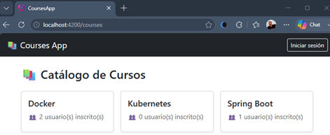

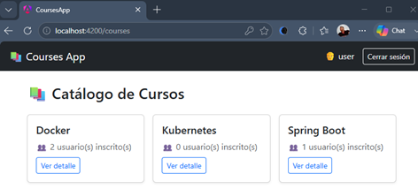

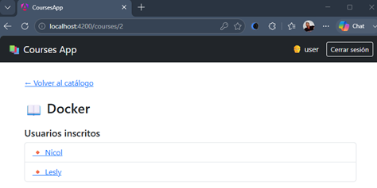

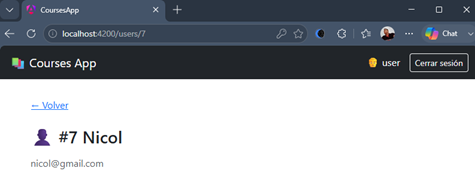

Con esto, confirmamos que el mecanismo de protección por autenticación funciona correctamente tanto para navegación
interna (clics) como para acceso directo por URL — la base sobre la que construiremos, en la Fase 4, la protección
adicional por rol.

## 🔐 Fase 4 — Rutas Protegidas por Rol `ADMIN`

El objetivo de esta fase es introducir un **segundo nivel de protección:** no basta con estar autenticado, ciertas
acciones (crear, editar, eliminar, asignar) requieren específicamente el rol `ADMIN`. Construiremos un guard de rol
reutilizable, los formularios de cursos y usuarios, y la asignación de usuarios a cursos.

### 1️⃣ Guard de rol: `roleGuard` (factory function)

````bash
D:\programming\spring\01.udemy\02.andres_guzman\08.docker_kubernetes\docker-kubernetes-2026\frontend\courses-app (feature/section-20)
$ ng g guard core/guards/role --skip-tests
✔ Which type of guard would you like to create? CanActivate
CREATE src/app/core/guards/role-guard.ts (133 bytes) 
````

> **Nota:** Angular CLI genera por defecto un guard como una función de flecha (`CanActivateFn`). Sin embargo,
> para reutilizar la lógica de autorización con diferentes roles, lo transformaremos en una función generadora que
> recibe parámetros y retorna un `CanActivateFn`.

````typescript
// src/app/core/guards/role-guard.ts

import {inject} from '@angular/core';
import {CanActivateFn, Router} from '@angular/router';
import {AuthService} from '../services/auth.service';

/**
 * Factory que genera un guard de rol reutilizable, parametrizado por el rol requerido.
 * A diferencia de authGuard (un guard fijo), roleGuard(role) es una FUNCIÓN QUE RETORNA
 * un CanActivateFn — así podemos usarlo para distintos roles sin duplicar código:
 * canActivate: [roleGuard('ADMIN')], canActivate: [roleGuard('EDITOR')], etc.
 *
 * IMPORTANTE: este guard asume que ya se verificó la autenticación previamente en la
 * cadena de guards (ej. canActivate: [authGuard, roleGuard('ADMIN')]). Por eso NO
 * vuelve a comprobar isAuthenticated() — solo evalúa el rol, evitando duplicar la
 * lógica que authGuard ya resuelve.
 */
export function roleGuard(role: string): CanActivateFn {
    return (route, state) => {
        console.log(`roleGuard - CanActivateFn: ${role}`);

        const authService = inject(AuthService);
        const router = inject(Router);

        if (authService.hasRole(role)) {
            return true;
        }

        // Retornar un UrlTree en vez de llamar router.navigate(...) + return false
        // es el patrón recomendado: le indica al Router "redirige aquí" en una sola
        // operación atómica, en vez de disparar una navegación manual por fuera del
        // ciclo de resolución de guards.
        return router.parseUrl('/403');
    };
}
````

**🔎 Puntos clave:**

- 🏭 **Guard como factory function:** en vez de un guard fijo (como `authGuard`), `roleGuard(role: string)` es una
  función que retorna un `CanActivateFn` ya configurado con el rol específico — el patrón estándar en Angular para
  guards parametrizables, evitando escribir un guard distinto por cada rol.
- 🔀 `router.parseUrl('/403')` **como valor de retorno:** desde Angular 15+, un guard puede retornar directamente un
  UrlTree (en vez de boolean) para indicar "redirige aquí" — es más idiomático que llamar `router.navigate(...)`
  manualmente y luego retornar false por separado.
- 🔑 Este guard asume que ya se verificó la autenticación previamente en la cadena de guards (ej.
  `canActivate: [authGuard, roleGuard('ADMIN')]`). Por eso NO vuelve a comprobar `isAuthenticated()` — solo evalúa el
  rol, evitando duplicar la lógica que `authGuard` ya resuelve.
- 🚪 Confirma el rol específico (si no lo tiene, redirige a una página de "sin permisos", no al login — el usuario sí
  está autenticado, solo le falta el rol).

### 2️⃣ Componente `Forbidden` (403)

````bash
D:\programming\spring\01.udemy\02.andres_guzman\08.docker_kubernetes\docker-kubernetes-2026\frontend\courses-app (feature/section-20)
$ ng g c shared/components/forbidden --skip-tests
CREATE src/app/shared/components/forbidden/forbidden.ts (210 bytes)
CREATE src/app/shared/components/forbidden/forbidden.scss (0 bytes)
CREATE src/app/shared/components/forbidden/forbidden.html (25 bytes)
````

````typescript
// src/app/shared/components/forbidden/forbidden.ts

import {Component} from '@angular/core';
import {RouterLink} from '@angular/router';

@Component({
    selector: 'app-forbidden',
    imports: [RouterLink],
    templateUrl: './forbidden.html',
    styleUrl: './forbidden.scss',
})
export class Forbidden {
}
````

````html
<!-- src/app/shared/components/forbidden/forbidden.html -->

<div class="text-center py-5">
    <h2>403 — No tienes permisos suficientes</h2>
    <a routerLink="/courses" class="btn btn-primary mt-3">Volver al catálogo</a>
</div>
````

### 3️⃣ Modelos: `CourseRequest` y `UserRequest`

````typescript
// src/app/core/models/course-request.model.ts

export interface CourseRequest {
    name: string;
}
````

````typescript
// src/app/core/models/user-request.model.ts

export interface UserRequest {
    name: string;
    email: string;
    password: string;
}
````

### 4️⃣ Ampliando `CourseService`: escritura y asignaciones

````typescript
// src/app/core/services/course.service.ts

import {HttpClient, HttpParams} from '@angular/common/http';
import {inject, Service} from '@angular/core';
import {Observable} from 'rxjs';

import {environment} from '../../../environments/environment';
import {Course} from '../models/course.model';
import {CourseRequest} from '../models/course-request.model';
import {User} from '../models/user.model';

@Service()
export class CourseService {
    private readonly http = inject(HttpClient);
    private readonly baseUrl = `${environment.gatewayServerUrl}/api/v1/courses`;

    findAllCourses(loadRelations: boolean = false): Observable<Course[]> {
        const params = new HttpParams().set('loadRelations', loadRelations);
        return this.http.get<Course[]>(this.baseUrl, {params});
    }

    findCourse(courseId: number, loadRelations: boolean = false): Observable<Course> {
        const params = new HttpParams().set('loadRelations', loadRelations);
        return this.http.get<Course>(`${this.baseUrl}/${courseId}`, {params});
    }

    /** Requiere ROLE_ADMIN. */
    saveCourse(request: CourseRequest): Observable<Course> {
        return this.http.post<Course>(this.baseUrl, request);
    }

    /** Requiere ROLE_ADMIN. */
    updateCourse(courseId: number, request: CourseRequest): Observable<Course> {
        return this.http.put<Course>(`${this.baseUrl}/${courseId}`, request);
    }

    /** Requiere ROLE_ADMIN. */
    deleteCourse(courseId: number): Observable<void> {
        return this.http.delete<void>(`${this.baseUrl}/${courseId}`);
    }

    /** Requiere ROLE_ADMIN. Asigna un usuario ya existente a un curso. */
    assignExistingUserToCourse(courseId: number, userId: number): Observable<User> {
        return this.http.post<User>(`${this.baseUrl}/${courseId}/users/${userId}`, {});
    }

    /** Requiere ROLE_ADMIN. */
    unassignUserFromCourse(courseId: number, userId: number): Observable<User> {
        return this.http.delete<User>(`${this.baseUrl}/${courseId}/users/${userId}`);
    }
}
````

### 5️⃣ Ampliando `UserService`

````typescript
// src/app/core/services/user.service.ts

import {HttpClient} from '@angular/common/http';
import {inject, Service} from '@angular/core';
import {Observable} from 'rxjs';

import {environment} from '../../../environments/environment';
import {User} from '../models/user.model';
import {UserRequest} from '../models/user-request.model';

@Service()
export class UserService {
    private readonly http = inject(HttpClient);
    private readonly baseUrl = `${environment.gatewayServerUrl}/api/v1/users`;

    /**
     * Obtiene el detalle de un usuario específico.
     * Endpoint protegido en el backend: requiere ROLE_USER como mínimo.
     */
    findUser(userId: number): Observable<User> {
        return this.http.get<User>(`${this.baseUrl}/${userId}`);
    }

    /** hasAnyRole('USER', 'ADMIN') en el backend. Se usa para el selector de "asignar usuario existente". */
    findAllUsers(): Observable<User[]> {
        return this.http.get<User[]>(this.baseUrl);
    }

    /** Requiere ROLE_ADMIN. */
    saveUser(request: UserRequest): Observable<User> {
        return this.http.post<User>(this.baseUrl, request);
    }

    /** Requiere ROLE_ADMIN. */
    updateUser(userId: number, request: UserRequest): Observable<User> {
        return this.http.put<User>(`${this.baseUrl}/${userId}`, request);
    }

    /** Requiere ROLE_ADMIN. */
    deleteUser(userId: number): Observable<void> {
        return this.http.delete<void>(`${this.baseUrl}/${userId}`);
    }
}
````

### 6️⃣ Componente `CourseForm` (crear y editar en uno)

````bash
D:\programming\spring\01.udemy\02.andres_guzman\08.docker_kubernetes\docker-kubernetes-2026\frontend\courses-app (feature/section-20)
$ ng g c features/courses/courseForm --skip-tests
CREATE src/app/features/courses/course-form/course-form.ts (217 bytes)
CREATE src/app/features/courses/course-form/course-form.scss (0 bytes)
CREATE src/app/features/courses/course-form/course-form.html (27 bytes)
````

````typescript
// src/app/features/courses/course-form/course-form.ts

import {Component, computed, effect, inject, input, signal} from '@angular/core';
import {NonNullableFormBuilder, ReactiveFormsModule, Validators} from '@angular/forms';
import {Router, RouterLink} from '@angular/router';
import {finalize} from 'rxjs';

import {CourseService} from '../../../core/services/course.service';
import {CourseRequest} from '../../../core/models/course-request.model';

@Component({
    selector: 'app-course-form',
    imports: [ReactiveFormsModule, RouterLink],
    templateUrl: './course-form.html',
    styleUrl: './course-form.scss',
})
export class CourseForm {
    // Input OPCIONAL (no .required): la ruta 'new' no trae :id, la ruta ':id/edit' sí.
    // Cuando no viene, este signal simplemente queda undefined.
    public readonly id = input<string>();

    private readonly fb = inject(NonNullableFormBuilder);
    private readonly router = inject(Router);
    private readonly courseService = inject(CourseService);

    protected readonly isEditMode = computed(() => !!this.id());
    protected readonly saving = signal(false);
    protected readonly errorMessage = signal<string | null>(null);

    protected readonly form = this.fb.group({
        name: this.fb.control('', [Validators.required, Validators.minLength(3)]),
    });

    constructor() {
        effect(() => {
            const courseId = this.id();
            if (courseId) {
                this.loadCourse(Number(courseId));
            }
        });
    }

    protected onSubmit(): void {
        if (this.form.invalid) {
            this.form.markAllAsTouched();
            return;
        }

        this.saving.set(true);
        this.errorMessage.set(null);

        const request: CourseRequest = {
            name: this.form.controls.name.value,
        };

        const operation = this.isEditMode()
            ? this.courseService.updateCourse(Number(this.id()), request)
            : this.courseService.saveCourse(request);

        operation.pipe(finalize(() => this.saving.set(false))).subscribe({
            next: (course) => this.router.navigate(['/courses', course.id]),
            error: (error) => {
                console.error(`Error al guardar el curso: ${request.name}`, error);
                this.errorMessage.set('No se pudo guardar el curso.');
            },
        });
    }

    private loadCourse(courseId: number): void {
        this.courseService.findCourse(courseId).subscribe({
            next: (course) => this.form.patchValue({name: course.name}),
            error: (error) => {
                console.error(`Error cargando el curso: ${courseId}`, error);
                this.errorMessage.set('No se pudo cargar el curso a editar.');
            },
        });
    }
}
````

````html
<!-- src/app/features/courses/course-form/course-form.html -->

<a routerLink="/courses" class="btn btn-link px-0 mb-3">&larr; Volver al catálogo</a>

<h2 class="mb-4">{{ isEditMode() ? 'Editar curso' : 'Nuevo curso' }}</h2>

@if (errorMessage()) {
<div class="alert alert-danger" role="alert">{{ errorMessage() }}</div>
}

<form [formGroup]="form" (ngSubmit)="onSubmit()" class="col-md-6">
    <div class="mb-3">
        <label for="name" class="form-label">Nombre del curso</label>
        <input
                id="name"
                type="text"
                class="form-control"
                formControlName="name"
                [class.is-invalid]="form.controls.name.invalid && form.controls.name.touched"
        />
        @if (form.controls.name.invalid && form.controls.name.touched) {
        <div class="invalid-feedback">El nombre debe tener al menos 3 caracteres.</div>
        }
    </div>

    <button type="submit" class="btn btn-primary" [disabled]="saving()">
        {{ saving() ? 'Guardando...' : 'Guardar' }}
    </button>
</form>
````

**🔎 Puntos clave:**

- 📝 **Un solo componente para crear y editar:** `isEditMode` (un `computed` basado en si `id()` tiene valor)
  decide el título, si se precarga el formulario, y qué método del servicio invocar (`saveCourse` vs
  `updateCourse`). Evita duplicar el componente completo para dos operaciones muy similares.
- 🧱 **`NonNullableFormBuilder` en vez de `FormBuilder`:** genera controles cuyo tipo nunca incluye `null` en su valor (a
  diferencia de `FormBuilder` clásico, donde `reset()` podía dejar el control en `null`). Es la variante recomendada en
  Angular moderno cuando sabes que el formulario siempre debe operar con strings, no con
  `string | null`.
- ✅ `Validators.required` + `minLength(3)`: validación básica en el propio formulario, antes de siquiera intentar el
  request — evita llamadas innecesarias al backend con datos claramente inválidos.

### 7️⃣ Componente `UserForm` (crear y editar)

````bash
D:\programming\spring\01.udemy\02.andres_guzman\08.docker_kubernetes\docker-kubernetes-2026\frontend\courses-app (feature/section-20)
$ ng g c features/users/userForm --skip-tests
CREATE src/app/features/users/user-form/user-form.ts (209 bytes)
CREATE src/app/features/users/user-form/user-form.scss (0 bytes)
CREATE src/app/features/users/user-form/user-form.html (25 bytes)
````

````typescript
// src/app/features/users/user-form/user-form.ts

import {Component, computed, effect, inject, input, signal} from '@angular/core';
import {NonNullableFormBuilder, ReactiveFormsModule, Validators} from '@angular/forms';
import {Location} from '@angular/common';
import {Router} from '@angular/router';
import {finalize} from 'rxjs';

import {UserService} from '../../../core/services/user.service';
import {UserRequest} from '../../../core/models/user-request.model';

@Component({
    selector: 'app-user-form',
    imports: [ReactiveFormsModule],
    templateUrl: './user-form.html',
    styleUrl: './user-form.scss',
})
export class UserForm {
    public readonly id = input<string>();

    private readonly fb = inject(NonNullableFormBuilder);
    private readonly router = inject(Router);
    private readonly location = inject(Location);
    private readonly userService = inject(UserService);

    protected readonly isEditMode = computed(() => !!this.id());
    protected readonly saving = signal(false);
    protected readonly errorMessage = signal<string | null>(null);

    protected readonly form = this.fb.group({
        name: this.fb.control('', [Validators.required, Validators.minLength(3)]),
        email: this.fb.control('', [Validators.required, Validators.email]),
        password: this.fb.control('', [Validators.required, Validators.minLength(6)]),
    });

    constructor() {
        effect(() => {
            const userId = this.id();
            if (userId) {
                this.loadUser(Number(userId));
            }
        });
    }

    protected goBack(): void {
        this.location.back();
    }

    protected onSubmit(): void {
        if (this.form.invalid) {
            this.form.markAllAsTouched();
            return;
        }

        this.saving.set(true);
        this.errorMessage.set(null);
        const request: UserRequest = this.form.getRawValue();

        const operation = this.isEditMode()
            ? this.userService.updateUser(Number(this.id()), request)
            : this.userService.saveUser(request);

        operation.pipe(finalize(() => this.saving.set(false))).subscribe({
            next: (user) => this.router.navigate(['/users', user.id]),
            error: (error) => {
                console.error(`Error al guardar el usuario: ${request.name}`, error);
                this.errorMessage.set('No se pudo guardar el usuario.');
            },
        });
    }

    private loadUser(userId: number): void {
        this.userService.findUser(userId).subscribe({
            next: (user) => this.form.patchValue({name: user.name, email: user.email}),
            error: (error) => {
                console.error(`Error cargando el usuario: ${userId}`, error);
                this.errorMessage.set('No se pudo cargar el usuario a editar.');
            },
        });
    }
}
````

````html
<!-- src/app/features/users/user-form/user-form.html -->

<button type="button" class="btn btn-link px-0 mb-3" (click)="goBack()">&larr; Volver</button>

<h2 class="mb-4">{{ isEditMode() ? 'Editar usuario' : 'Nuevo usuario' }}</h2>

@if (errorMessage()) {
<div class="alert alert-danger" role="alert">{{ errorMessage() }}</div>
}

<form [formGroup]="form" (ngSubmit)="onSubmit()" class="col-md-6">
    <div class="mb-3">
        <label for="name" class="form-label"> Nombre <span class="text-danger">(*)</span> </label>
        <input id="name" type="text" class="form-control" formControlName="name"/>
    </div>

    <div class="mb-3">
        <label for="email" class="form-label">
            Correo electrónico <span class="text-danger">(*)</span>
        </label>
        <input id="email" type="email" class="form-control" formControlName="email"/>
    </div>

    <div class="mb-3">
        <label for="password" class="form-label">
            Contraseña <span class="text-danger">(*)</span>
        </label>
        <input id="password" type="password" class="form-control" formControlName="password"/>
    </div>

    <button type="submit" class="btn btn-primary" [disabled]="saving()">
        {{ saving() ? 'Guardando...' : 'Guardar' }}
    </button>
</form>
````

### 8️⃣ Acciones de administrador en `CourseDetail`

Ampliamos el componente para incluir: **editar/eliminar** curso, y **asignar/desasignar** usuarios existentes — todo
visible únicamente si `authService.hasRole('ADMIN')`.

````typescript
// src/app/features/courses/course-detail/course-detail.ts (fragmento agregado)

import {Component, effect, inject, input, signal} from '@angular/core';
import {Router, RouterLink} from '@angular/router';
import {FormBuilder, ReactiveFormsModule, Validators} from '@angular/forms';
import {finalize} from 'rxjs';

import {CourseService} from '../../../core/services/course.service';
import {UserService} from '../../../core/services/user.service';
import {AuthService} from '../../../core/services/auth.service';
import {Course} from '../../../core/models/course.model';
import {User} from '../../../core/models/user.model';

@Component({
    selector: 'app-course-detail',
    imports: [RouterLink, ReactiveFormsModule],
    templateUrl: './course-detail.html',
    styleUrl: './course-detail.scss',
})
export class CourseDetail {
    public readonly id = input.required<string>();

    private readonly courseService = inject(CourseService);
    private readonly userService = inject(UserService);
    private readonly router = inject(Router);
    private readonly fb = inject(FormBuilder);
    protected readonly authService = inject(AuthService);

    protected readonly course = signal<Course | null>(null);
    protected readonly loading = signal(true);
    protected readonly errorMessage = signal<string | null>(null);

    // Solo se pueblan si el usuario es ADMIN (ver efecto abajo)
    protected readonly assignableUsers = signal<User[]>([]);
    protected readonly form = this.fb.group({
        selectedUserId: this.fb.control<number | null>(null, [Validators.required]),
    });

    private get selectedUserIdValue(): number | null {
        return this.form.controls.selectedUserId.value;
    }

    constructor() {
        effect(() => {
            this.loadCourse(Number(this.id()));
        });

        effect(() => {
            if (this.authService.hasRole('ADMIN')) {
                this.userService.findAllUsers().subscribe((users) => this.assignableUsers.set(users));
            }
        });
    }

    protected deleteCourse(): void {
        if (!confirm('¿Eliminar este curso? Esta acción no se puede deshacer.')) return;

        this.courseService.deleteCourse(Number(this.id())).subscribe({
            next: () => this.router.navigate(['/courses']),
            error: () => this.errorMessage.set('No se pudo eliminar el curso.'),
        });
    }

    protected assignUser(): void {
        if (!this.selectedUserIdValue) return;

        this.courseService
            .assignExistingUserToCourse(Number(this.id()), this.selectedUserIdValue)
            .subscribe({
                next: () => this.loadCourse(Number(this.id())),
                error: () => this.errorMessage.set('No se pudo asignar el usuario.'),
            });
    }

    protected unassignUser(userId: number): void {
        this.courseService.unassignUserFromCourse(Number(this.id()), userId).subscribe({
            next: () => this.loadCourse(Number(this.id())),
            error: () => this.errorMessage.set('No se pudo desvincular el usuario.'),
        });
    }

    private loadCourse(courseId: number): void {
        this.loading.set(true);
        this.errorMessage.set(null);

        this.courseService
            .findCourse(courseId, true)
            .pipe(finalize(() => this.loading.set(false)))
            .subscribe({
                next: (course) => this.course.set(course),
                error: (error) => {
                    console.error('Error al cargar el curso', error);
                    this.errorMessage.set('No se pudo cargar el curso. Intenta nuevamente más tarde.');
                },
            });
    }
}
````

````html
<!-- src/app/features/courses/course-detail/course-detail.html (fragmento agregado, dentro del @else if (course())) -->

<a routerLink="/" class="btn btn-link px-0 mb-3">&larr; Volver al catálogo</a>

@if (loading()) {
<div class="d-flex justify-content-center py-5">
    <div class="spinner-border text-primary" role="status">
        <span class="visually-hidden">Cargando...</span>
    </div>
</div>
} @else if (errorMessage()) {
<div class="alert alert-danger" role="alert">
    {{ errorMessage() }}
</div>
} @else if (course()) {
@if (authService.hasRole('ADMIN')) {
<div class="d-flex gap-2 mb-3">
    <a [routerLink]="['/courses', id(), 'edit']" class="btn btn-sm btn-outline-secondary">
        Editar
    </a>
    <button type="button" class="btn btn-sm btn-outline-danger" (click)="deleteCourse()">
        Eliminar curso
    </button>
</div>
}

<h2 class="mb-3">📖 {{ course()!.name }}</h2>

<h5 class="mt-4">Usuarios inscritos</h5>

@if (!course()!.users || course()!.users!.length === 0) {
<p class="text-muted">Este curso no tiene usuarios inscritos todavía.</p>
} @else {
<ul class="list-group">
    @for (user of course()!.users; track user.id) {
    <li class="list-group-item">
        <a [routerLink]="['/users', user.id]" class="me-2">🔸 {{ user.name }}</a>
        @if (authService.hasRole('ADMIN')) {
        <button
                type="button"
                class="btn btn-sm btn-outline-danger"
                (click)="unassignUser(user.id)"
        >
            Desvincular
        </button>
        }
    </li>
    }
</ul>
}

@if (authService.hasRole('ADMIN')) {
<div class="mt-4 p-3 border rounded">
    <h6>Asignar usuario existente</h6>
    <div class="d-flex gap-2">
        <form [formGroup]="form" (ngSubmit)="assignUser()">
            <select formControlName="selectedUserId" class="form-select mb-2">
                <option [ngValue]="null">Selecciona un usuario</option>

                @for (user of assignableUsers(); track user.id) {
                <option [ngValue]="user.id">{{ user.name }}</option>
                }
            </select>

            <button type="submit" [disabled]="form.invalid" class="btn btn-primary">Asignar</button>
        </form>
    </div>
</div>
}
}
````

**🔎 Puntos clave:**

- 🔒 **Segundo `effect()` condicional:** solo dispara la carga de `assignableUsers` si el usuario es `ADMIN` — evita una
  llamada HTTP innecesaria (y potencialmente rechazada) para usuarios sin ese rol.
- ⚠️**`confirm(...)` nativo del navegador:** suficiente para este proyecto de aprendizaje; en una aplicación real se
  reemplazaría por un modal propio de confirmación.

### 9️⃣ Actualizando las rutas con `roleGuard`

````typescript
// src/app/features/courses/courses.routes.ts

import {Routes} from '@angular/router';
import {authGuard} from '../../core/guards/auth-guard';
import {roleGuard} from '../../core/guards/role-guard';

export default [
    {
        path: '',
        loadComponent: () => import('./layout-page/layout-page').then((m) => m.LayoutPage),
        children: [
            {
                path: '',
                loadComponent: () => import('./courses-list/courses-list').then((m) => m.CoursesList),
            },
            // ⚠️ "new" debe declararse ANTES de ":id" — ambos son un único segmento, y Angular
            // evalúa las rutas en orden. Si ":id" fuera primero, "new" se interpretaría como
            // un valor de :id en vez de coincidir con esta ruta literal.
            {
                path: 'new',
                loadComponent: () => import('./course-form/course-form').then((m) => m.CourseForm),
                canActivate: [authGuard, roleGuard('ADMIN')],
            },
            {
                path: ':id',
                loadComponent: () => import('./course-detail/course-detail').then((m) => m.CourseDetail),
                canActivate: [authGuard, roleGuard('USER')],
            },
            {
                path: ':id/edit',
                loadComponent: () => import('./course-form/course-form').then((m) => m.CourseForm),
                canActivate: [authGuard, roleGuard('ADMIN')],
            },
        ],
    },
] satisfies Routes;
````

````typescript
// src/app/features/users/users.routes.ts

import {Routes} from '@angular/router';
import {authGuard} from '../../core/guards/auth-guard';
import {roleGuard} from '../../core/guards/role-guard';

export default [
    {
        path: '',
        loadComponent: () => import('./layout-page/layout-page').then((m) => m.LayoutPage),
        canActivate: [authGuard],
        children: [
            {
                path: 'new',
                loadComponent: () => import('./user-form/user-form').then((m) => m.UserForm),
                canActivate: [roleGuard('ADMIN')],
            },
            {
                path: ':id',
                loadComponent: () => import('./user-detail/user-detail').then((m) => m.UserDetail),
                canActivate: [roleGuard('USER')],
            },
            {
                path: ':id/edit',
                loadComponent: () => import('./user-form/user-form').then((m) => m.UserForm),
                canActivate: [roleGuard('ADMIN')],
            },
        ],
    },
] satisfies Routes;
````

> 📝 Recordemos que la protección de autenticación para todo el feature `users` ya vive un nivel arriba, en
> `app.routes.ts` (`canMatch: [authMatchGuard]`) e incluso colocamos la protección de autenticación en el nivel del
> `LayoutPage` (`canActivate: [authGuard]`) — Por lo que en las rutas hijas solo agregamos la capa adicional de rol
> para `new`, `:id/edit` e inclusive para el `:id`.

````typescript
// src/app/app.routes.ts (agregando la ruta 403)

import {Routes} from '@angular/router';
import {authMatchGuard} from './core/guards/auth-guard';

export const routes: Routes = [
    {path: '', redirectTo: '/courses', pathMatch: 'full'},
    {
        path: 'courses',
        loadChildren: () => import('./features/courses/courses.routes'),
    },
    {
        path: 'users',
        loadChildren: () => import('./features/users/users.routes'),
        canMatch: [authMatchGuard],
    },
    {
        path: '404',
        loadComponent: () => import('./shared/components/not-found/not-found').then((m) => m.NotFound),
    },
    {
        path: '403',
        loadComponent: () => import('./shared/components/forbidden/forbidden').then((m) => m.Forbidden),
    },
    {path: '**', redirectTo: '/404'},
];
````

### 🔟 Mostrando accesos de administrador en el `Navbar`

````html
<!-- src/app/shared/components/navbar/navbar.html (Refactorizando Navbar - agregando menú de cursos y usuarios) -->

<nav class="navbar navbar-expand-lg bg-body-tertiary">
    <div class="container-fluid">
        <a class="navbar-brand" routerLink="/courses">📚 Courses App</a>
        <button
                class="navbar-toggler"
                type="button"
                data-bs-toggle="collapse"
                data-bs-target="#navbarSupportedContent"
                aria-controls="navbarSupportedContent"
                aria-expanded="false"
                aria-label="Toggle navigation"
        >
            <span class="navbar-toggler-icon"></span>
        </button>
        <div class="collapse navbar-collapse" id="navbarSupportedContent">
            <ul class="navbar-nav me-auto mb-2 mb-lg-0">
                <li class="nav-item">
                    <a class="nav-link active" aria-current="page" routerLink="/courses">Inicio</a>
                </li>
                @if (authService.hasRole('ADMIN')) {
                <li class="nav-item">
                    <a class="nav-link" routerLink="/courses/new">+ Cursos</a>
                </li>
                <li class="nav-item">
                    <a class="nav-link" routerLink="/users/new">+ Usuarios</a>
                </li>
                }
            </ul>
            <div class="d-flex">
                @if (authService.isAuthenticated()) {
                <span class="me-2"> 👨 {{ authService.username() }} </span>
                <button class="btn btn-outline-danger btn-sm" (click)="authService.logout()">
                    Cerrar sesión
                </button>
                } @else {
                <button class="btn btn-outline-success btn-sm" (click)="authService.login()">
                    Iniciar sesión
                </button>
                }
            </div>
        </div>
    </div>
</nav>
````

### ✅ Punto de verificación de la Fase 4

1. Para ejecutar en local debemos modificar los siguientes archivos:
    - business-domain/course-service/src/main/java/dev/magadiflo/course/app/config/RestClientConfig.java
    - business-domain/course-service/src/main/resources/application.yml
    - business-domain/user-service/src/main/java/dev/magadiflo/user/app/config/RestClientConfig.java
    - business-domain/user-service/src/main/resources/application.yml
    - infrastructure/gateway-server/src/main/resources/application.yml
2. **Con sesión de `ROLE_USER` (sin `ADMIN`):** confirma que no aparecen los botones `+ Cursos` y `+ Usuarios` en el
   navbar, ni `Editar` y `Eliminar` en el detalle de un curso.
3. **Con `ROLE_USER`, navega manualmente a `http://localhost:4200/courses/new`** — debe redirigir a `/403`
   (confirmando que `roleGuard('ADMIN')` bloquea correctamente, sin disparar el flujo de login, ya que sí hay sesión).
4. **Con `ROLE_ADMIN`:** confirma que sí aparecen todos los botones administrativos.
5. **Crea un curso nuevo desde `/courses/new`** — debe redirigir al detalle del curso recién creado.
6. **Edita ese curso desde `/courses/:id/edit`** — confirma que el formulario precarga el nombre actual, y que al
   guardar redirige de vuelta al detalle actualizado.
7. **Asigna un usuario existente al curso desde el selector** — debe aparecer inmediatamente en la lista de usuarios
   inscritos, sin necesidad de recargar la página.
8. **Elimina el curso** — debe redirigir al listado, y el curso ya no debe aparecer ahí.
9. **Repite los pasos 5-8 análogos para usuarios** (`/users/new`, `/users/:id/edit`, eliminar usuario).

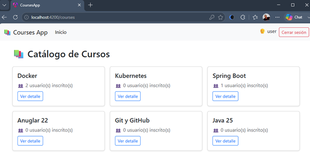

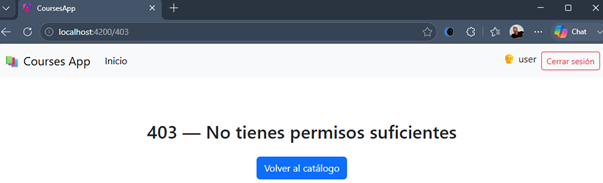

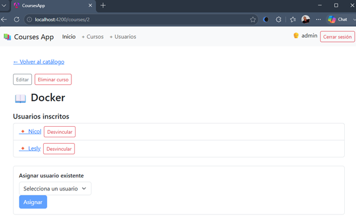

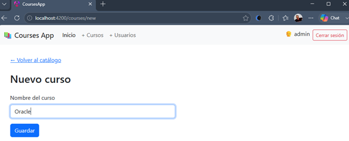

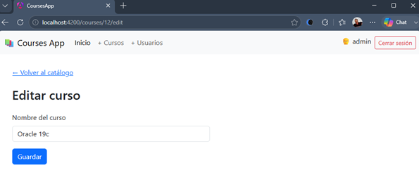

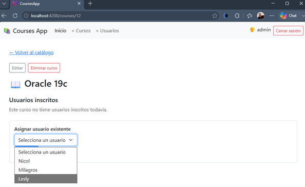

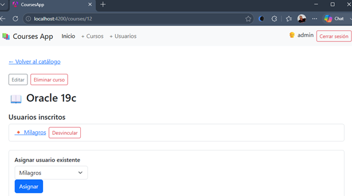

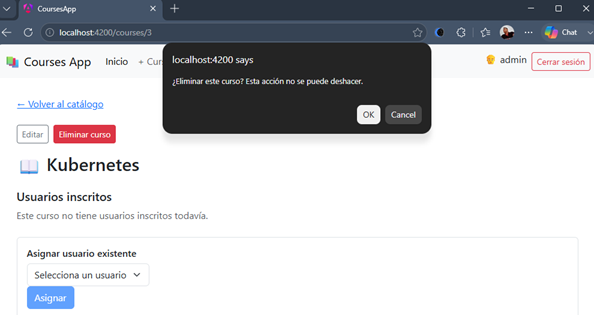

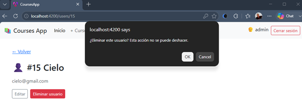

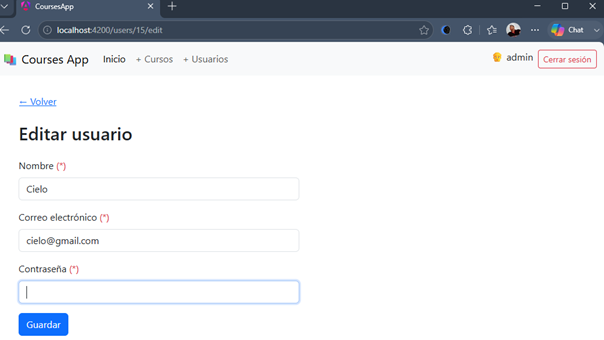

Con esto, la aplicación queda completa en cuanto a autenticación, autorización por rol, y operaciones CRUD protegidas —
reflejando fielmente las reglas de negocio que definimos en el backend desde el inicio del proyecto.

## 🎨 Fase 5 — Pulido final

Con las Fases 1-4, la aplicación ya cubre el 100% del alcance funcional (auth, roles, CRUD). **Esta fase es opcional** y
agrega robustez transversal — mejoras que no se notan hasta que algo falla de forma inesperada, pero que marcan la
diferencia entre una aplicación que "funciona en la demo" y una que se comporta bien ante escenarios reales de uso
prolongado.

### 1️⃣ Interceptor global de errores HTTP (`error-interceptor.ts`)

> 🚫 **Nota:** esta solución queda documentada, pero no implementada en el proyecto. La dejamos registrada
> como referencia de qué se necesitaría para cubrir este escenario, ya que aporta robustez adicional pero no es
> indispensable para el alcance de este proyecto de aprendizaje — decidimos no aumentar la complejidad del
> código por un caso de borde (sesión expirada a mitad de uso) que, aunque real, es poco frecuente en una sesión
> de prueba corta.

Hasta ahora, cada componente maneja sus propios errores HTTP de forma aislada
(`error: () => this.errorMessage.set(...)`) — funciona, pero dos escenarios quedan sin cubrir de forma centralizada:

- **Sesión expirada a mitad de uso:** el usuario lleva un rato navegando, la cookie `SESSION` expira en el servidor, y
  hace una acción protegida (ej. eliminar un curso) — recibe un `401`, pero el guard ya lo había dejado pasar antes (con
  el estado de sesión que tenía en ese momento). Sin manejo global, solo vería *"No se pudo eliminar el curso"*, sin
  entender por qué.
- **Desincronización de rol:** si el rol de un usuario cambiara en el backend mientras ya tiene una sesión activa en el
  navegador (caso raro, pero posible), un `403` inesperado también merece un manejo consistente.

````bash
D:\programming\spring\01.udemy\02.andres_guzman\08.docker_kubernetes\docker-kubernetes-2026\frontend\courses-app (feature/section-20)
$ ng g interceptor core/interceptors/error --skip-tests
CREATE src/app/core/interceptors/error-interceptor.ts (155 bytes)
````

````typescript
// src/app/core/interceptors/error-interceptor.ts

import {inject} from '@angular/core';
import {HttpErrorResponse, HttpInterceptorFn} from '@angular/common/http';
import {Router} from '@angular/router';
import {catchError, throwError} from 'rxjs';

import {AuthService} from '../services/auth.service';

/**
 * Interceptor global de errores HTTP. Complementa (no reemplaza) el manejo de errores
 * que ya hace cada componente — actúa como una red de seguridad para dos escenarios
 * que un guard, evaluado solo al navegar, no puede prevenir en el momento de la petición:
 *
 * 401: la sesión expiró en el servidor DESPUÉS de que el guard ya permitió la navegación.
 *      Reiniciamos el estado local de AuthService y disparamos el flujo de login de nuevo.
 *
 * 403: el usuario perdió el rol requerido (o nunca lo tuvo y algo lo dejó pasar el guard,
 *      por ejemplo una condición de carrera). Lo enviamos a la página de "sin permisos".
 */
export const errorInterceptor: HttpInterceptorFn = (req, next) => {
    const authService = inject(AuthService);
    const router = inject(Router);

    return next(req).pipe(
        catchError((error: unknown) => {
            if (error instanceof HttpErrorResponse) {
                if (error.status === 401) {
                    authService.login();
                } else if (error.status === 403) {
                    router.navigateByUrl('/403');
                }
            }
            return throwError(() => error);
        }),
    );
};
````

**🔎 Puntos clave:**

- 🔁 **`throwError(() => error)` al final:** el interceptor reacciona al error (dispara login o redirige), pero no lo
  "traga" — lo vuelve a propagar. Esto es importante: **cada componente sigue recibiendo el error en su propio
  `.subscribe({ error: ... })`** y puede seguir mostrando su mensaje específico ("No se pudo eliminar el curso"), además
  de la acción global que este interceptor dispara. Ambos niveles de manejo conviven, no se excluyen.
- 🎯 **No interfiere con el flujo normal de login/logout:** como `login()`/`logout()` en `AuthService` nunca pasan por
  `HttpClient` (son navegación real), este interceptor nunca los intercepta a ellos mismos — solo a las llamadas
  normales de `CourseService`/`UserService`.

#### Registro en `app.config.ts`

````typescript
import {ApplicationConfig, inject, provideAppInitializer, provideBrowserGlobalErrorListeners} from '@angular/core';
import {provideRouter, withComponentInputBinding} from '@angular/router';
import {provideHttpClient, withInterceptors} from '@angular/common/http';
import {firstValueFrom} from 'rxjs';

import {routes} from './app.routes';
import {credentialsInterceptor} from './core/interceptors/credentials-interceptor';
import {AuthService} from './core/services/auth.service';
import {errorInterceptor} from './core/interceptors/error-interceptor';

export const appConfig: ApplicationConfig = {
    providers: [
        provideBrowserGlobalErrorListeners(),
        provideRouter(routes, withComponentInputBinding()),
        provideHttpClient(withInterceptors([credentialsInterceptor, errorInterceptor])), // 👈 interceptor registrado
        provideAppInitializer(() => {
            const authService = inject(AuthService);
            return firstValueFrom(authService.fetchCurrentUser());
        }),
    ],
};
````

#### 🛠️ Por qué este interceptor por sí solo NO es suficiente: la pieza que falta en el backend

Al probar este interceptor, descubrimos algo importante: `error.status === 401` **nunca llegaba a cumplirse**, aunque la
sesión sí había expirado. El motivo tiene que ver con **cómo responde Spring Security por defecto** ante una petición
sin autenticar, y merece explicarse con detalle porque no es evidente a simple vista.

Por defecto, cuando `.oauth2Login()` está configurado con `.loginPage("/auth/login")`, cualquier petición no
autenticada — una navegación real del navegador — recibe la respuesta: un `302 Found`, redirigiendo hacia esa página de
login. Esto tiene sentido para navegación de páginas completas, pero es problemático para `HttpClient`, por una razón
muy concreta:

1. El navegador **sigue ese redirect automáticamente**, a nivel de red, antes de que nuestro código JavaScript tenga
   oportunidad de interceptar la respuesta original.
2. Al seguir el redirect, el navegador preserva el método HTTP original de la petición fallida. Por ejemplo, si la
   petición que expiró era un `DELETE /api/v1/courses/1`, el redirect hacia `/auth/login` también se ejecuta como
   `DELETE` — no como `GET`.
3. Como nuestro endpoint `/auth/login` solo tiene un `@GetMapping`, esa petición `DELETE` hacia él resulta en un
   `405 Method Not Allowed` — y ese es, finalmente, el único código de error que le llega a Angular. Nunca vemos el
   `401` real que esperábamos, porque quedó "enmascarado" por este redirect corrompido.

**La solución** es indicarle a Spring Security que responda de forma distinta según el tipo de petición: un
`401` **plano (sin redirect)** para todo lo que venga bajo `/api/**` — que siempre son llamadas `HttpClient` desde
Angular, nunca navegación de página — y mantener el **redirect** `302` normal para cualquier otra ruta (el
comportamiento que ya usábamos y que sigue siendo correcto para navegación real del navegador).

````java

@Bean
public SecurityWebFilterChain webFilterChain(ServerHttpSecurity http, CorsConfigurationSource corsConfigurationSource) {
    http
            .cors(cors -> cors.configurationSource(corsConfigurationSource))
            .authorizeExchange(authorize -> authorize
                    // ... tus reglas actuales
            )
            .csrf(ServerHttpSecurity.CsrfSpec::disable)
            .exceptionHandling(exceptionHandling -> exceptionHandling
                    // 👇 nuevo: decide 401 plano vs. redirect según el path de la petición
                    .authenticationEntryPoint(apiAwareAuthenticationEntryPoint())
            )
            .oauth2Login(oauth2Login -> oauth2Login
                    .loginPage("/auth/login")
                    .authenticationSuccessHandler(this.oauth2LoginSuccessHandler())
            )
            .oauth2Client(Customizer.withDefaults())
            .oauth2ResourceServer(/* ... */)
            .logout(/* ... */);

    return http.build();
}

/**
 * Decide cómo responder ante una petición NO autenticada, según su origen:
 * - Peticiones a /api/** (siempre XHR/fetch desde Angular): 401 plano, sin redirect.
 *   Así HttpClient recibe un error limpio que nuestro errorInterceptor puede manejar
 *   de forma controlada (disparando login() nosotros mismos, con una navegación real
 *   GET, en vez de dejar que el navegador siga un 302 preservando el método original
 *   de la petición fallida — que es justo lo que causaba el 405 en /auth/login).
 * - Cualquier otra petición (navegación real del navegador): redirect normal hacia
 *   /auth/login, el comportamiento que ya usábamos.
 */
private ServerAuthenticationEntryPoint apiAwareAuthenticationEntryPoint() {
    ServerAuthenticationEntryPoint apiEntryPoint = new HttpStatusServerEntryPoint(HttpStatus.UNAUTHORIZED);
    ServerAuthenticationEntryPoint browserEntryPoint = new RedirectServerAuthenticationEntryPoint("/auth/login");

    List<DelegatingServerAuthenticationEntryPoint.DelegateEntry> delegates = List.of(
            new DelegatingServerAuthenticationEntryPoint.DelegateEntry(
                    ServerWebExchangeMatchers.pathMatchers("/api/**"),
                    apiEntryPoint
            )
    );

    DelegatingServerAuthenticationEntryPoint delegatingEntryPoint = new DelegatingServerAuthenticationEntryPoint(delegates);
    delegatingEntryPoint.setDefaultEntryPoint(browserEntryPoint);

    return delegatingEntryPoint;
}
````

**🔎 Cómo queda el flujo con este cambio:**

1. `DELETE /api/v1/courses/1` sin cookie → Gateway responde `401` plano (sin redirect, sin corromper el método).
2. `HttpClient` recibe ese `401` limpio.
3. `errorInterceptor` lo captura, coincide con `error.status === 401`, y llama a `authService.login()` — que hace
   `window.location.href` (una navegación real y nueva del navegador, `GET`, iniciada deliberadamente por nuestro
   código, no un redirect "heredado" de la petición `DELETE` fallida).
4. El usuario termina en el formulario de login correctamente.

> 💡 Esta pieza del Gateway (`apiAwareAuthenticationEntryPoint`) queda documentada como parte del diseño completo
> de esta solución, aunque, como se indicó al inicio de esta sección, el interceptor y este ajuste no se
> incorporaron finalmente al proyecto.

### 2️⃣ Indicador de carga global durante la navegación (lazy loading)

> ✅ **Nota:** esta solución sí fue implementada en el proyecto, además de quedar documentada.

Como usamos `loadChildren`/`loadComponent` en todas las rutas, cada navegación a un feature nuevo implica descargar un
chunk de JavaScript — en una red lenta, hay un lapso donde el usuario hace clic y no pasa nada visible. Agregamos una
barra de progreso simple en la parte superior, como la que se ve en GitHub o YouTube.

````bash
D:\programming\spring\01.udemy\02.andres_guzman\08.docker_kubernetes\docker-kubernetes-2026\frontend\courses-app (feature/section-20)
$ ng g s core/services/route-loading.service --skip-tests
CREATE src/app/core/services/route-loading.service.ts (99 bytes)
````

````typescript
// src/app/core/services/route-loading.service.ts

import {inject, Service, signal} from '@angular/core';
import {
    NavigationCancel,
    NavigationEnd,
    NavigationError,
    NavigationStart,
    Router,
} from '@angular/router';
import {filter} from 'rxjs';

@Service()
export class RouteLoadingService {
    private readonly router = inject(Router);
    private readonly loading = signal(false);
    public readonly isLoading = this.loading.asReadonly();

    constructor() {
        this.router.events
            .pipe(
                filter(
                    (event) =>
                        event instanceof NavigationStart ||
                        event instanceof NavigationEnd ||
                        event instanceof NavigationCancel ||
                        event instanceof NavigationError,
                ),
            )
            .subscribe((event) => {
                this.loading.set(event instanceof NavigationStart);
            });
    }
}
````

````typescript
// src/app/app.ts

import {Component, inject, signal} from '@angular/core';
import {RouterOutlet} from '@angular/router';

import {Navbar} from './shared/components/navbar/navbar';
import {RouteLoadingService} from './core/services/route-loading.service';

@Component({
    selector: 'app-root',
    imports: [RouterOutlet, Navbar],
    templateUrl: './app.html',
    styleUrl: './app.scss',
})
export class App {
    protected readonly title = signal('courses-app');
    protected readonly routerLoading = inject(RouteLoadingService);
}
````

````html
<!-- src/app/app.html -->

@if (routerLoading.isLoading()) {
<div class="route-progress-bar"></div>
}

<!-- Navbar Principal -->
<app-navbar/>

<!-- Contenido de las vistas (Rutas) -->
<main class="container mt-4">
    <router-outlet/>
</main>
````

````scss
// src/app/app.scss

.route-progress-bar {
    position: fixed;
    top: 0;
    left: 0;
    height: 3px;
    width: 100%;
    background: linear-gradient(90deg, transparent, #0d6efd, transparent);
    background-size: 200% 100%;
    animation: route-progress 1s linear infinite;
    z-index: 2000;
}

@keyframes route-progress {
    0% { background-position: 200% 0; }
    100% { background-position: -200% 0; }
}
````

**🔎 Puntos clave:**

- 📡 `Router.events`: emite una secuencia de eventos durante cada navegación. Filtramos solo los cuatro que nos interesan
  (`NavigationStart` = empieza a navegar/descargar; `End`/`Cancel`/`Error` = terminó, de una forma u otra).
- 🔄 **Sin `unsubscribe()` manual:** como `RouteLoadingService` es un singleton root que vive durante toda la sesión de
  la aplicación (recordemos las características de los Services que repasamos antes), esta suscripción nunca necesita
  cancelarse — vive exactamente tanto como la propia aplicación.

### ✅ Punto de verificación de la Fase 5

1. **Simula una sesión expirada:** inicia sesión, luego borra manualmente la cookie `SESSION` desde las DevTools del
   navegador (Application → Cookies), e intenta eliminar un curso — debe dispararse el flujo de login automáticamente,
   en vez de solo mostrar un mensaje de error genérico **(❌ Solución documentada, no implementada en el proyecto
   final).**
2. **Con throttling de red activada** (DevTools → Network → Slow 3G), navega entre `/courses` y `/users/:id` — debe
   verse brevemente la barra de progreso superior mientras se descarga el chunk correspondiente **(✅ Solución
   implementada y verificada).**

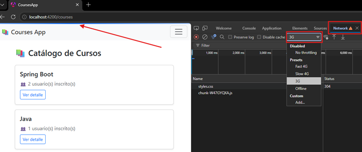

## 🔍 Inspector de Tokens: Observando el Refresh Automático en Vivo

### 1️⃣ Servicio: `DebugService`

````bash
D:\programming\spring\01.udemy\02.andres_guzman\08.docker_kubernetes\docker-kubernetes-2026\frontend\courses-app (feature/section-20)
$ ng g s core/services/debug.service --skip-tests
CREATE src/app/core/services/debug.service.ts (92 bytes)
````

````typescript
// src/app/core/services/debug.service.ts

import {HttpClient} from '@angular/common/http';
import {inject, Service} from '@angular/core';
import {Observable} from 'rxjs';

import {environment} from '../../../environments/environment';

@Service()
export class DebugService {
    private readonly http = inject(HttpClient);
    private readonly baseUrl = `${environment.gatewayServerUrl}/test/oauth2-client`;

    /** Muestra el access_token/refresh_token vigentes — útil para observar el refresh automático. */
    getAuthorizedInfo(): Observable<unknown> {
        return this.http.get(`${this.baseUrl}/authorized-info`);
    }

    /** Muestra el id_token y las authorities reales usadas por Spring Security. */
    getPrincipalInfo(): Observable<unknown> {
        return this.http.get(`${this.baseUrl}/principal-info`);
    }
}
````

> 💡 Tipamos ambos métodos como `Observable<unknown>` a propósito: esta es una pantalla de debug, no de
> negocio — no vale la pena crear interfaces TypeScript detalladas para una estructura JSON que solo queremos
> inspeccionar visualmente.

### 2️⃣ Componente: `DebugTokens`

````bash
D:\programming\spring\01.udemy\02.andres_guzman\08.docker_kubernetes\docker-kubernetes-2026\frontend\courses-app (feature/section-20)
$ ng g c features/debug/debug-tokens --skip-tests
CREATE src/app/features/debug/debug-tokens/debug-tokens.ts (221 bytes)
CREATE src/app/features/debug/debug-tokens/debug-tokens.scss (0 bytes)
CREATE src/app/features/debug/debug-tokens/debug-tokens.html (28 bytes)
````

> ⚠️Como usaremos el pipe json, necesitas importar `CommonModule` (o específicamente `JsonPipe`) en el componente.

````typescript
// src/app/features/debug/debug-tokens/debug-tokens.ts

import {Component, inject, signal} from '@angular/core';
import {DebugService} from '../../../core/services/debug.service';
import {JsonPipe} from '@angular/common';
import {finalize, forkJoin} from 'rxjs';

@Component({
    selector: 'app-debug-tokens',
    imports: [JsonPipe],
    templateUrl: './debug-tokens.html',
    styleUrl: './debug-tokens.scss',
})
export class DebugTokens {
    private readonly debugService = inject(DebugService);

    protected readonly authorizedInfo = signal<unknown>(null);
    protected readonly principalInfo = signal<unknown>(null);
    protected readonly loading = signal(false);

    protected refresh(): void {
        this.loading.set(true);

        forkJoin({
            authorizedInfo: this.debugService.getAuthorizedInfo(),
            principalInfo: this.debugService.getPrincipalInfo(),
        })
            .pipe(finalize(() => this.loading.set(false)))
            .subscribe({
                next: ({authorizedInfo, principalInfo}) => {
                    this.authorizedInfo.set(authorizedInfo);
                    this.principalInfo.set(principalInfo);
                },
            });
    }
}
````

````html
<!-- src/app/features/debug/debug-tokens/debug-tokens.html -->

<h2 class="mb-4">🔍 Inspector de Tokens (Debug)</h2>

<p class="text-muted">
    El <code>access_token</code> dura ~5 minutos. Da clic en "Actualizar" antes y después de ese
    tiempo para ver cómo Spring Security lo renueva automáticamente usando el
    <code>refresh_token</code>, sin que Angular haga nada especial para lograrlo.
</p>

<button type="button" class="btn btn-primary mb-4" (click)="refresh()" [disabled]="loading()">
    {{ loading() ? 'Consultando...' : '🔄 Actualizar' }}
</button>

@if (authorizedInfo()) {
<h5>📦 /authorized-info</h5>
<pre class="bg-dark text-light p-3 rounded">{{ authorizedInfo() | json }}</pre>
}

@if (principalInfo()) {
<h5 class="mt-4">👤 /principal-info</h5>
<pre class="bg-dark text-light p-3 rounded">{{ principalInfo() | json }}</pre>
}
````

> 🧩 `| json` (el pipe `JsonPipe`): convierte cualquier valor de JavaScript/TypeScript en un string JSON
> formateado con indentación, ideal para mostrar objetos crudos en pantalla sin construir una interfaz visual
> específica para cada campo — exactamente lo que necesitamos para una vista de debug.

### 3️⃣ Ruta

````typescript
// src/app/app.routes.ts (agregar)

import {Routes} from '@angular/router';
import {authGuard, authMatchGuard} from './core/guards/auth-guard';

export const routes: Routes = [
    {path: '', redirectTo: '/courses', pathMatch: 'full'},
    {
        path: 'courses',
        loadChildren: () => import('./features/courses/courses.routes'),
    },
    {
        path: 'users',
        loadChildren: () => import('./features/users/users.routes'),
        canMatch: [authMatchGuard],
    },
    {
        path: 'debug',
        canActivate: [authGuard],
        loadComponent: () =>
            import('./features/debug/debug-tokens/debug-tokens').then((m) => m.DebugTokens),
    },
    {
        path: '404',
        loadComponent: () => import('./shared/components/not-found/not-found').then((m) => m.NotFound),
    },
    {
        path: '403',
        loadComponent: () => import('./shared/components/forbidden/forbidden').then((m) => m.Forbidden),
    },
    {path: '**', redirectTo: '/404'},
];
````

### 4️⃣ Pestaña en el Navbar

````html
<!-- src/app/shared/components/navbar/navbar.html (agregar dentro del <ul>, junto a "Inicio") -->

@if (authService.isAuthenticated()) {
<li class="nav-item">
    <a class="nav-link" routerLink="/debug">🔍 Debug</a>
</li>
}
````

### ✅ Punto de verificación

1. Inicia sesión, ve a la pestaña 🔍 Debug, y da clic en "Actualizar" — anota el `issuedAt`/`expiresAt` del
   `accessToken`.
2. Espera un poco más de 5 minutos **navegando normalmente** por la aplicación (para que se dispare al menos una
   petición que use el `TokenRelay`, activando el refresh).
3. Vuelve a la pestaña Debug y da clic en "Actualizar" de nuevo — el `accessToken` debería mostrar un `issuedAt`/
   `expiresAt` nuevos, más recientes, confirmando el refresh automático en vivo. El `id_token` (visible en
   `/principal-info`), en cambio, debería mantenerse igual — confirmando lo que documentamos: el refresh automático solo
   renueva el `access_token`/`refresh_token`, no el `id_token`.

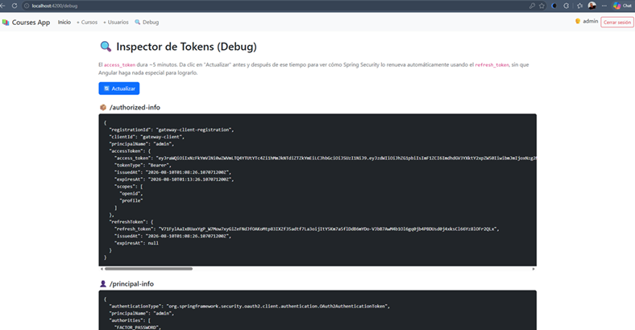

**Comparando 📦 `/authorized-info`**

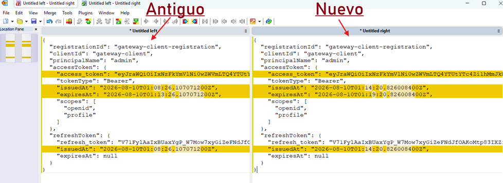

**Comparando 👤 `/principal-info`**

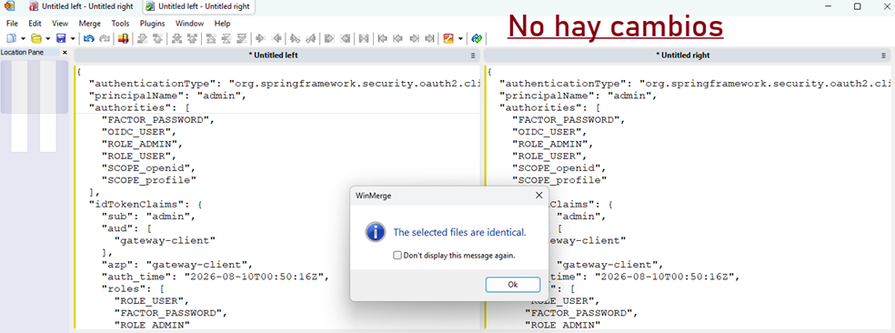

