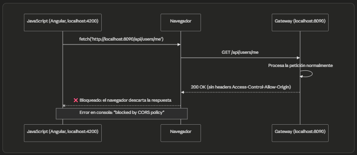
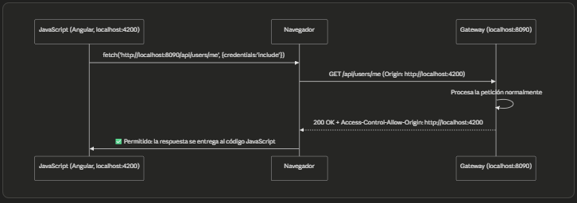

# 🔐 Sección 20: Kubernetes — Security JWT con OAuth 2.1 — Angular

> #### 📚 Nota
> Esta documentación es la continuación del archivo `20.1.kubernetes_security_jwt_oauth2.1.md`. Se creó este archivo
> adicional dado que el anterior ya había crecido considerablemente.

---

## 🌐 Configurando CORS en `gateway-server` (WebFlux)

### 🤔 ¿Qué es CORS?

**CORS** (*Cross-Origin Resource Sharing*) es un **mecanismo de seguridad implementado por los navegadores** —no por los
servidores— que restringe, por defecto, que una página web ejecutando JavaScript en un origen determinado pueda leer
respuestas de peticiones hechas hacia un origen distinto.

Un **origen** se define como la combinación exacta de `esquema` + `host` + `puerto`. Esto significa que, aunque
`http://localhost:4200` **(Angular)** y `http://localhost:8090` **(nuestro Gateway)** compartan el mismo host
(`localhost`), **son considerados orígenes completamente distintos**, únicamente por tener puertos diferentes.

Por diseño, el navegador bloquea esta comunicación cross-origin **a menos que el servidor de destino indique
explícitamente**, mediante un conjunto de headers HTTP (`Access-Control-Allow-Origin`,
`Access-Control-Allow-Credentials`, etc.), que confía en ese origen específico. Configurar CORS en nuestro
`gateway-server` es, precisamente, la forma de dar ese permiso explícito.

### 🎯 ¿Por qué solo el Gateway necesita configurarlo?

Porque CORS **solo importa cuando existe comunicación directa entre un navegador y un servidor de origen distinto**. En
nuestra arquitectura, el único componente que recibe peticiones **directamente desde el navegador** (es decir, desde el
código JavaScript de Angular) es el `gateway-server`. Es la única "puerta de entrada" visible para el navegador.

### 🚫 ¿Por qué los microservicios (`user-service`, `course-service`) no lo necesitan?

Porque, como vimos en apartados anteriores, `course-service` y `user-service` **nunca reciben peticiones directas de un
navegador**. Solo son alcanzados de dos formas:

1. Por el propio `gateway-server`, que actúa como proxy reenviando la petición ya autenticada.
2. Entre ellos mismos, en la comunicación interna vía `RestClient`.

En ambos casos, se trata de comunicación **servidor-a-servidor**, y CORS es una restricción que **el navegador aplica
exclusivamente sobre código JavaScript ejecutándose en una página web** — no sobre llamadas HTTP hechas desde otro
proceso backend. Por eso, agregar configuración de CORS en esos microservicios sería completamente inútil: no hay ningún
navegador de por medio en esas llamadas.

### 🖼️ CORS configurado vs. no configurado — comparación visual

#### ❌ Sin CORS configurado en el Gateway:



#### ✅ Con CORS correctamente configurado:



### 💡 Resolviendo una duda clave: ¿el backend procesa la petición aunque no tenga CORS configurado?

La respuesta depende del **tipo de petición HTTP** que realice el navegador:

#### 📌 1️⃣ Peticiones Simples (Simple Requests — e.g. GET o POST básico de formulario)

El navegador **sí permite que la petición real salga y llegue al backend** — el backend **sí la recibe, sí la procesa, y
sí genera una respuesta completa**, exactamente como si CORS no existiera. El bloqueo ocurre **después**:
cuando la respuesta regresa al navegador, este revisa si trae el header `Access-Control-Allow-Origin` correspondiente.
Si no lo encuentra (porque no configuramos CORS), **el navegador descarta esa respuesta antes de entregársela al código
JavaScript** que hizo la petición — pero el servidor ya hizo todo su trabajo "por detrás". Esto explica por qué, en
Postman o curl, esa misma petición sin CORS configurado **funciona perfectamente**: esas herramientas no son navegadores
y no aplican esta restricción.
> ⚠️ **Conclusión:** En este escenario, **el backend sí procesa la petición**; lo único que impide CORS es que el
> navegador entregue la respuesta al código JavaScript del frontend.

#### 📌 2️⃣ Peticiones Complejas (Non-Simple Requests — e.g. PUT, DELETE, o POST con Content-Type: application/json)

Aquí el navegador es más cauteloso: antes de enviar la petición real, envía primero una petición de verificación previa
llamada **preflight** (`OPTIONS`), preguntándole al servidor: *"¿Permitirías este origen, este método, y estos
headers?".* **Solo si el servidor responde afirmativamente a ese preflight**, el navegador procede a enviar la petición
real. Si el servidor no tiene CORS configurado, el preflight recibe una respuesta sin los headers esperados, y **en este
caso la petición real ni siquiera llega a salir del navegador.**
> 🔒 **Conclusión:** En este escenario, **el backend jamás procesa la petición real**, porque el navegador la bloquea
> antes de enviarla.

### ⚠️ Un matiz crítico: Gateway Reactivo (WebFlux) vs. Servlet

Como usamos un Spring Cloud Gateway reactivo (basado en WebFlux y Netty), la forma de definir el `@Bean` de CORS difiere
de la de Spring MVC Servlet tradicional:

- En **Spring MVC Servlet**, se suele usar `CorsFilter` junto con `UrlBasedCorsConfigurationSource`.
- En **Spring WebFlux / Gateway**, debemos usar en su lugar `CorsWebFilter`, del paquete
  `org.springframework.web.cors.reactive` — la contraparte reactiva del filtro clásico.

Necesitamos configurar CORS en nuestro `gateway-server` antes de avanzar hacia Angular: sin esto, ni siquiera la primera
petición (`/api/users/me`) podrá completarse exitosamente desde el navegador.

### 📦 ¿Dónde ubicamos esta configuración?

Existen dos opciones razonables:

- **Dentro del mismo `SecurityConfig`:** válido, ya que CORS y seguridad están conceptualmente relacionados (de hecho,
  Spring Security necesita saber si existe una `CorsConfigurationSource` para aplicarla en su propio filtro).
- **Una clase separada, `CorsConfig`:** más limpio si queremos mantener SecurityConfig enfocado exclusivamente en
  autenticación/autorización, separando la preocupación de "qué orígenes pueden hablarme" como algo independiente.

En nuestro caso, como CORS en este proyecto existe únicamente por la relación con Angular (no es una preocupación
genérica aplicable a "toda petición HTTP"), y `SecurityConfig` ya concentra bastante contenido, optamos por una clase
separada — más fácil de ubicar y modificar el día que cambie el dominio de producción, sin necesidad de tocar el archivo
de seguridad.

### 🔧 Implementación

````java
/**
 * Configuración global de CORS (Cross-Origin Resource Sharing) para el API Gateway Reactivo (WebFlux).
 *
 * Centraliza las políticas de acceso entre orígenes para asegurar que la aplicación Frontend (Angular)
 * pueda comunicarse libremente con el backend a través del Gateway sin ser bloqueada por el navegador.
 */
@Configuration
public class CorsConfig {

    @Value("${custom.frontend.angular.base-url}")
    private String frontendAngularBaseUrl;

    @Bean
    public CorsWebFilter corsWebFilter() {
        CorsConfiguration corsConfig = new CorsConfiguration();

        // Especifica el origen explícito permitido para comunicarse con este Gateway (URL de Angular).
        // IMPORTANTE: Cuando allowCredentials es 'true', la especificación de W3C prohíbe el uso de wildcard "*".
        corsConfig.setAllowedOrigins(List.of(this.frontendAngularBaseUrl));

        // Define los verbos HTTP permitidos para consumir la API desde el cliente
        corsConfig.setAllowedMethods(List.of(
                HttpMethod.GET.name(),
                HttpMethod.POST.name(),
                HttpMethod.PUT.name(),
                HttpMethod.DELETE.name(),
                HttpMethod.PATCH.name(),
                HttpMethod.OPTIONS.name()
        ));

        // Cabeceras que el navegador podrá enviar explícitamente en sus peticiones
        corsConfig.setAllowedHeaders(List.of(
                HttpHeaders.AUTHORIZATION,  // Permitido para enviar tokens Bearer / Credenciales
                HttpHeaders.CONTENT_TYPE,   // Permitido para enviar payloads JSON ('application/json')
                HttpHeaders.ACCEPT,         // Permitido para solicitar tipos de respuesta explícitos
                "X-Requested-With"          // Permitido para identificadores de peticiones AJAX (si los usas)
        ));

        // Permite que el navegador envíe credenciales (en nuestro caso una cookie de
        // sesión HTTP-Only (SESSION)) en las peticiones cross-origin. Es indispensable en nuestro patrón BFF, ya que Angular
        // autentica al usuario mediante la cookie HttpOnly SESSION emitida por el Gateway. Si este valor fuera false, el
        // navegador nunca enviaría dicha cookie y todas las peticiones llegarían al Gateway como anónimas
        corsConfig.setAllowCredentials(true);

        // El navegador almacenará en caché la respuesta del preflight (OPTIONS)
        // durante una hora, evitando repetir esa comprobación en cada petición
        corsConfig.setMaxAge(Duration.ofHours(1));

        UrlBasedCorsConfigurationSource source = new UrlBasedCorsConfigurationSource();
        // Aplica esta configuración de CORS a todas las rutas expuestas por el Gateway
        source.registerCorsConfiguration("/**", corsConfig);

        return new CorsWebFilter(source);
    }
}
````

#### 🔎 Detalle de cada configuración

- 🌍 `corsConfig.setAllowedOrigins(...)`: especifica el origen explícito permitido para comunicarse con este Gateway (la
  URL de Angular). Reutilizamos la misma property `custom.frontend.angular.base-url` que ya usamos en
  `PostLogoutController` y en `oauth2LoginSuccessHandler()` — evitando así tener ese valor repetido y desincronizado en
  distintos lugares del código.

  > ⚠️ **Importante:** cuando `allowCredentials` es `true`, la especificación W3C prohíbe el uso del
  > comodín `"*"` en `allowedOrigins`. Esto no es una limitación arbitraria de Spring — es una restricción de
  > seguridad del propio estándar CORS: permitir credenciales (cookies) hacia *"cualquier origen"* anularía por
  > completo el propósito de esta protección, ya que cualquier sitio malicioso podría hacer peticiones autenticadas
  > en nombre del usuario. Por eso estamos obligados a declarar el origen de Angular de forma explícita.

- 🔧 `corsConfig.setAllowedMethods(...)`: define los verbos HTTP permitidos para consumir la API desde el cliente.
- 📋 `corsConfig.setAllowedHeaders(...)`: define los headers que Angular podrá enviar explícitamente en sus peticiones.

  > 💡 **Nota:** no incluimos aquí `Origin`, `Access-Control-Request-Method` ni `Access-Control-Request-Headers`,
  > ya que son headers que el propio navegador gestiona automáticamente durante la negociación CORS (especialmente
  > en el preflight `OPTIONS`) — nunca son enviados manualmente por nuestro código Angular, por lo que no tiene
  > sentido "permitirlos" explícitamente aquí.

- 🍪 `corsConfig.setAllowCredentials(true)`: permite que el navegador envíe credenciales (en nuestro caso, la cookie de
  sesión `HttpOnly` llamada `SESSION`) en las peticiones cross-origin. Es indispensable en nuestro patrón BFF, ya que
  Angular autentica al usuario precisamente mediante esa cookie, emitida por el Gateway. Si este valor fuera `false`, el
  navegador **nunca enviaría dicha cookie**, y todas las peticiones llegarían al Gateway como anónimas — rompiendo por
  completo el mecanismo de sesión que construimos.
- ⏱️ `corsConfig.setMaxAge(Duration.ofHours(1))`: cachea la respuesta del preflight (`OPTIONS`) durante 1 hora. Sin este
  valor, el navegador repetiría una petición `OPTIONS` adicional antes de cada petición real (GET, POST, etc.) hacia el
  Gateway, duplicando innecesariamente la cantidad de llamadas de red. Con esta caché, mientras dure ese tiempo, el
  navegador reutiliza el resultado del preflight anterior para la misma combinación `origen` + `método` + `headers`,
  evitando ese round-trip extra y mejorando el rendimiento percibido por el usuario.
- 🛣️ `source.registerCorsConfiguration("/**", corsConfig)`: aplica esta configuración de CORS a todas las rutas
  expuestas por el Gateway, sin excepción.
