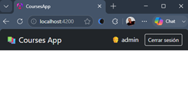
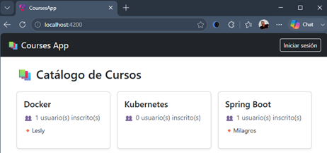

# 🔐 Sección 20: Kubernetes — Security JWT con OAuth 2.1 — Angular

> #### 📚 Nota
> Esta documentación es la continuación del archivo `20.1.kubernetes_security_jwt_oauth2.1.md`. Se creó este archivo
> adicional dado que el anterior ya había crecido considerablemente.

---

## 🌐 Configurando CORS en `gateway-server` (WebFlux)

### 🤔 ¿Qué es CORS?

**CORS** (*Cross-Origin Resource Sharing*) es un **mecanismo de seguridad implementado por los navegadores** —no por los
servidores— que restringe, por defecto, que una página web ejecutando JavaScript en un origen determinado pueda leer
respuestas de peticiones hechas hacia un origen distinto.

Un **origen** se define como la combinación exacta de `esquema` + `host` + `puerto`. Esto significa que, aunque
`http://localhost:4200` **(Angular)** y `http://localhost:8090` **(nuestro Gateway)** compartan el mismo host
(`localhost`), **son considerados orígenes completamente distintos**, únicamente por tener puertos diferentes.

Por diseño, el navegador bloquea esta comunicación cross-origin **a menos que el servidor de destino indique
explícitamente**, mediante un conjunto de headers HTTP (`Access-Control-Allow-Origin`,
`Access-Control-Allow-Credentials`, etc.), que confía en ese origen específico. Configurar CORS en nuestro
`gateway-server` es, precisamente, la forma de dar ese permiso explícito.

### 🎯 ¿Por qué solo el Gateway necesita configurarlo?

Porque CORS **solo importa cuando existe comunicación directa entre un navegador y un servidor de origen distinto**. En
nuestra arquitectura, el único componente que recibe peticiones **directamente desde el navegador** (es decir, desde el
código JavaScript de Angular) es el `gateway-server`. Es la única "puerta de entrada" visible para el navegador.

### 🚫 ¿Por qué los microservicios (`user-service`, `course-service`) no lo necesitan?

Porque, como vimos en apartados anteriores, `course-service` y `user-service` **nunca reciben peticiones directas de un
navegador**. Solo son alcanzados de dos formas:

1. Por el propio `gateway-server`, que actúa como proxy reenviando la petición ya autenticada.
2. Entre ellos mismos, en la comunicación interna vía `RestClient`.

En ambos casos, se trata de comunicación **servidor-a-servidor**, y CORS es una restricción que **el navegador aplica
exclusivamente sobre código JavaScript ejecutándose en una página web** — no sobre llamadas HTTP hechas desde otro
proceso backend. Por eso, agregar configuración de CORS en esos microservicios sería completamente inútil: no hay ningún
navegador de por medio en esas llamadas.

### 🖼️ CORS configurado vs. no configurado — comparación visual

#### ❌ Sin CORS configurado en el Gateway:


#### ✅ Con CORS correctamente configurado:


### 💡 Resolviendo una duda clave: ¿el backend procesa la petición aunque no tenga CORS configurado?

La respuesta depende del **tipo de petición HTTP** que realice el navegador:

#### 📌 1️⃣ Peticiones Simples (Simple Requests — e.g. GET o POST básico de formulario)

El navegador **sí permite que la petición real salga y llegue al backend** — el backend **sí la recibe, sí la procesa, y
sí genera una respuesta completa**, exactamente como si CORS no existiera. El bloqueo ocurre **después**:
cuando la respuesta regresa al navegador, este revisa si trae el header `Access-Control-Allow-Origin` correspondiente.
Si no lo encuentra (porque no configuramos CORS), **el navegador descarta esa respuesta antes de entregársela al código
JavaScript** que hizo la petición — pero el servidor ya hizo todo su trabajo "por detrás". Esto explica por qué, en
Postman o curl, esa misma petición sin CORS configurado **funciona perfectamente**: esas herramientas no son navegadores
y no aplican esta restricción.
> ⚠️ **Conclusión:** En este escenario, **el backend sí procesa la petición**; lo único que impide CORS es que el
> navegador entregue la respuesta al código JavaScript del frontend.

#### 📌 2️⃣ Peticiones Complejas (Non-Simple Requests — e.g. PUT, DELETE, o POST con Content-Type: application/json)

Aquí el navegador es más cauteloso: antes de enviar la petición real, envía primero una petición de verificación previa
llamada **preflight** (`OPTIONS`), preguntándole al servidor: *"¿Permitirías este origen, este método, y estos
headers?".* **Solo si el servidor responde afirmativamente a ese preflight**, el navegador procede a enviar la petición
real. Si el servidor no tiene CORS configurado, el preflight recibe una respuesta sin los headers esperados, y **en este
caso la petición real ni siquiera llega a salir del navegador.**
> 🔒 **Conclusión:** En este escenario, **el backend jamás procesa la petición real**, porque el navegador la bloquea
> antes de enviarla.

### ⚠️ Un matiz crítico: Gateway Reactivo (WebFlux) vs. Servlet

Como usamos un Spring Cloud Gateway reactivo (basado en WebFlux y Netty), la forma de definir el `@Bean` de CORS difiere
de la de Spring MVC Servlet tradicional:

- En **Spring MVC Servlet**, se suele usar `CorsFilter` junto con `UrlBasedCorsConfigurationSource`.
- En **Spring WebFlux / Gateway**, debemos usar en su lugar `CorsWebFilter`, del paquete
  `org.springframework.web.cors.reactive` — la contraparte reactiva del filtro clásico.

Necesitamos configurar CORS en nuestro `gateway-server` antes de avanzar hacia Angular: sin esto, ni siquiera la primera
petición (`/api/users/me`) podrá completarse exitosamente desde el navegador.

### 📦 ¿Dónde ubicamos esta configuración?

Existen dos opciones razonables:

- **Dentro del mismo `SecurityConfig`:** válido, ya que CORS y seguridad están conceptualmente relacionados (de hecho,
  Spring Security necesita saber si existe una `CorsConfigurationSource` para aplicarla en su propio filtro).
- **Una clase separada, `CorsConfig`:** más limpio si queremos mantener SecurityConfig enfocado exclusivamente en
  autenticación/autorización, separando la preocupación de "qué orígenes pueden hablarme" como algo independiente.

En nuestro caso, como CORS en este proyecto existe únicamente por la relación con Angular (no es una preocupación
genérica aplicable a "toda petición HTTP"), y `SecurityConfig` ya concentra bastante contenido, optamos por una clase
separada — más fácil de ubicar y modificar el día que cambie el dominio de producción, sin necesidad de tocar el archivo
de seguridad.

### 🔧 Implementación

````java
/**
 * Configuración global de CORS (Cross-Origin Resource Sharing) para el API Gateway Reactivo (WebFlux).
 *
 * Centraliza las políticas de acceso entre orígenes para asegurar que la aplicación Frontend (Angular)
 * pueda comunicarse libremente con el backend a través del Gateway sin ser bloqueada por el navegador.
 */
@Configuration
public class CorsConfig {

    @Value("${custom.frontend.angular.base-url}")
    private String frontendAngularBaseUrl;

    @Bean
    public CorsWebFilter corsWebFilter() {
        CorsConfiguration corsConfig = new CorsConfiguration();

        // Especifica el origen explícito permitido para comunicarse con este Gateway (URL de Angular).
        // IMPORTANTE: Cuando allowCredentials es 'true', la especificación de W3C prohíbe el uso de wildcard "*".
        corsConfig.setAllowedOrigins(List.of(this.frontendAngularBaseUrl));

        // Define los verbos HTTP permitidos para consumir la API desde el cliente
        corsConfig.setAllowedMethods(List.of(
                HttpMethod.GET.name(),
                HttpMethod.POST.name(),
                HttpMethod.PUT.name(),
                HttpMethod.DELETE.name(),
                HttpMethod.PATCH.name(),
                HttpMethod.OPTIONS.name()
        ));

        // Cabeceras que el navegador podrá enviar explícitamente en sus peticiones
        corsConfig.setAllowedHeaders(List.of(
                HttpHeaders.AUTHORIZATION,  // Permitido para enviar tokens Bearer / Credenciales
                HttpHeaders.CONTENT_TYPE,   // Permitido para enviar payloads JSON ('application/json')
                HttpHeaders.ACCEPT,         // Permitido para solicitar tipos de respuesta explícitos
                "X-Requested-With"          // Permitido para identificadores de peticiones AJAX (si los usas)
        ));

        // Permite que el navegador envíe credenciales (en nuestro caso una cookie de
        // sesión HTTP-Only (SESSION)) en las peticiones cross-origin. Es indispensable en nuestro patrón BFF, ya que Angular
        // autentica al usuario mediante la cookie HttpOnly SESSION emitida por el Gateway. Si este valor fuera false, el
        // navegador nunca enviaría dicha cookie y todas las peticiones llegarían al Gateway como anónimas
        corsConfig.setAllowCredentials(true);

        // El navegador almacenará en caché la respuesta del preflight (OPTIONS)
        // durante una hora, evitando repetir esa comprobación en cada petición
        corsConfig.setMaxAge(Duration.ofHours(1));

        UrlBasedCorsConfigurationSource source = new UrlBasedCorsConfigurationSource();
        // Aplica esta configuración de CORS a todas las rutas expuestas por el Gateway
        source.registerCorsConfiguration("/**", corsConfig);

        return new CorsWebFilter(source);
    }
}
````

#### 🔎 Detalle de cada configuración

- 🌍 `corsConfig.setAllowedOrigins(...)`: especifica el origen explícito permitido para comunicarse con este Gateway (la
  URL de Angular). Reutilizamos la misma property `custom.frontend.angular.base-url` que ya usamos en
  `PostLogoutController` y en `oauth2LoginSuccessHandler()` — evitando así tener ese valor repetido y desincronizado en
  distintos lugares del código.

  > ⚠️ **Importante:** cuando `allowCredentials` es `true`, la especificación W3C prohíbe el uso del
  > comodín `"*"` en `allowedOrigins`. Esto no es una limitación arbitraria de Spring — es una restricción de
  > seguridad del propio estándar CORS: permitir credenciales (cookies) hacia *"cualquier origen"* anularía por
  > completo el propósito de esta protección, ya que cualquier sitio malicioso podría hacer peticiones autenticadas
  > en nombre del usuario. Por eso estamos obligados a declarar el origen de Angular de forma explícita.

- 🔧 `corsConfig.setAllowedMethods(...)`: define los verbos HTTP permitidos para consumir la API desde el cliente.
- 📋 `corsConfig.setAllowedHeaders(...)`: define los headers que Angular podrá enviar explícitamente en sus peticiones.

  > 💡 **Nota:** no incluimos aquí `Origin`, `Access-Control-Request-Method` ni `Access-Control-Request-Headers`,
  > ya que son headers que el propio navegador gestiona automáticamente durante la negociación CORS (especialmente
  > en el preflight `OPTIONS`) — nunca son enviados manualmente por nuestro código Angular, por lo que no tiene
  > sentido "permitirlos" explícitamente aquí.

- 🍪 `corsConfig.setAllowCredentials(true)`: permite que el navegador envíe credenciales (en nuestro caso, la cookie de
  sesión `HttpOnly` llamada `SESSION`) en las peticiones cross-origin. Es indispensable en nuestro patrón BFF, ya que
  Angular autentica al usuario precisamente mediante esa cookie, emitida por el Gateway. Si este valor fuera `false`, el
  navegador **nunca enviaría dicha cookie**, y todas las peticiones llegarían al Gateway como anónimas — rompiendo por
  completo el mecanismo de sesión que construimos.
- ⏱️ `corsConfig.setMaxAge(Duration.ofHours(1))`: cachea la respuesta del preflight (`OPTIONS`) durante 1 hora. Sin este
  valor, el navegador repetiría una petición `OPTIONS` adicional antes de cada petición real (GET, POST, etc.) hacia el
  Gateway, duplicando innecesariamente la cantidad de llamadas de red. Con esta caché, mientras dure ese tiempo, el
  navegador reutiliza el resultado del preflight anterior para la misma combinación `origen` + `método` + `headers`,
  evitando ese round-trip extra y mejorando el rendimiento percibido por el usuario.
- 🛣️ `source.registerCorsConfiguration("/**", corsConfig)`: aplica esta configuración de CORS a todas las rutas
  expuestas por el Gateway, sin excepción.

---

# 🅰️ Angular: Creando nuestra aplicación frontEnd

---

Antes de comenzar con la implementación de nuestra aplicación en Angular, es importante tener perfectamente identificado
el conjunto de endpoints que el backend expone a través del `gateway-server`. Este inventario será nuestro contrato
entre frontend y backend, y servirá como base para planificar el desarrollo de la interfaz de usuario.

Una vez identificado ese inventario, definiremos una hoja de ruta dividida en distintas fases. Cada fase tendrá un
objetivo claro y un punto de verificación antes de avanzar a la siguiente, permitiéndonos validar el funcionamiento de
cada parte del sistema de forma incremental.

## 📋 Inventario de endpoints (todos vía Gateway, `http://localhost:8090`)

### 🔑 Autenticación

| Endpoint        | Método | Acceso      | Propósito                                                                 |
|-----------------|--------|-------------|---------------------------------------------------------------------------|
| `/auth/login`   | GET    | Público     | Inicia el flujo OAuth 2.1 (navegación real, no mediante `fetch`).         |
| `/logout`       | POST   | Autenticado | Cierra sesión (envío mediante formulario, no mediante `fetch`).           |
| `/api/users/me` | GET    | Público     | Devuelve el estado de autenticación, username y roles del usuario actual. |

### 📘 Cursos (`/api/v1/courses`)

| Endpoint                         | Método | Regla        |
|----------------------------------|:------:|--------------|
| `/`                              |  GET   | Público      |
| `?loadRelations=true`            |  GET   | Público      |
| `/{courseId}`                    |  GET   | `ROLE_USER`  |
| `/{courseId}?loadRelations=true` |  GET   | `ROLE_USER`  |
| `/`                              |  POST  | `ROLE_ADMIN` |
| `/{courseId}`                    |  PUT   | `ROLE_ADMIN` |
| `/{courseId}`                    | DELETE | `ROLE_ADMIN` |
| `/{courseId}/users/{userId}`     |  POST  | `ROLE_ADMIN` |
| `/{courseId}/users`              |  POST  | `ROLE_ADMIN` |
| `/{courseId}/users/{userId}`     | DELETE | `ROLE_ADMIN` |

### 📗 Usuarios (`/api/v1/users`)

| Endpoint    | Método | Regla                        |
|-------------|:------:|------------------------------|
| `/`         |  GET   | `hasAnyRole('USER','ADMIN')` |
| `/{userId}` |  GET   | `ROLE_USER`                  |
| `/`         |  POST  | `ROLE_ADMIN`                 |
| `/{userId}` |  PUT   | `ROLE_ADMIN`                 |
| `/{userId}` | DELETE | `ROLE_ADMIN`                 |
| `/by-ids`   |  GET   | Público (uso interno)        |
| `/info`     |  GET   | Público                      |

## 🗺️ Propuesta de hoja de ruta

Al igual que en la construcción del backend, desarrollaremos el frontend de manera incremental. Cada fase tendrá un
objetivo concreto y un punto de verificación antes de continuar con la siguiente, evitando construir una gran cantidad
de funcionalidades para descubrir demasiado tarde que algún aspecto fundamental (como el login o la autorización) no
funciona correctamente.

Durante el desarrollo utilizaremos las principales características recomendadas del Angular moderno (v22), ya que
representan el enfoque oficial del framework y simplifican considerablemente la implementación de aplicaciones SPA.

Trabajaremos principalmente con:

- `RxJS`, para comunicarnos con el backend y manejar operaciones asíncronas mediante `HttpClient`.
- `Signals`, para almacenar y exponer el estado de la aplicación (usuario autenticado, roles, listas cargadas,
  indicadores de carga, etc.).
- `Standalone Components`, junto con la nueva sintaxis de plantillas (`@if`, `@for`, etc.), para reducir el código
  repetitivo y evitar la necesidad de utilizar `NgModule`.

### 🏗️ Fase 0 — Esqueleto del proyecto

- Generar el proyecto de Angular (`ng new`), configurar Bootstrap, estructura de carpetas básica (`core/`, `features/`,
  `shared/`).
- Configurar `HttpClient` con un interceptor funcional que agregue `withCredentials: true` a todas las peticiones hacia
  el Gateway.
- Definir el `environment` con la URL base del Gateway (`http://localhost:8090`).

### 🔑 Fase 1 — Flujo de sesión (el más crítico, va primero y solo)

- Servicio `AuthService`: método para consultar `/api/users/me` (estado actual).
- Botón/link "Iniciar sesión" → navegación real hacia `/auth/login` (no `HttpClient`, recuerda que es
  `window.location.href`).
- Botón "Cerrar sesión" → formulario oculto + submit hacia `/logout`.
- Navbar simple que muestre condicionalmente ambos botones según el estado de `/api/users/me`.
- ✅ **Punto de verificación:** poder loguearte, ver tu username reflejado, y desloguearte — sin ninguna pantalla de
  negocio aún.

### 📘 Fase 2 — Cursos: vista pública

- Servicio `CourseService` con el método para `GET /api/v1/courses`.
- Construir la pantalla principal mostrando el listado de cursos (con o sin usuarios asociados mediante
  `loadRelations=true`).
- ✅ **Punto de verificación:** ver el listado sin estar logueado.

### 👤 Fase 3 — Rutas protegidas por autenticación (cualquier rol)

- Implementar un guard de autenticación que impida acceder a determinadas rutas cuando no exista una sesión activa.
- Crear la vista de detalle de curso (`GET /{courseId}?loadRelations=true`).
- Crear la vista de detalle de usuario (`GET /{userId}`).
- ✅ **Punto de verificación:** comprobar que un usuario no autenticado es redirigido al login y que un usuario
  autenticado puede acceder normalmente.

### 🔐 Fase 4 — Rutas protegidas por rol `ADMIN`

- Implementar un guard de autorización basado en los roles obtenidos desde `/api/users/me`.
- Construir los formularios para crear, editar y eliminar cursos.
- Construir los formularios para crear, editar y eliminar usuarios.
- Implementar la asignación y desasignación de usuarios a cursos.
- Mostrar u ocultar las opciones administrativas según el rol del usuario autenticado.
- ✅ **Punto de verificación:** un usuario con solo `ROLE_USER` no debe poder ver ni acceder a estas rutas; un
  `ROLE_ADMIN` sí.

### 🎨 Fase 5 — Pulido final

- Implementar un manejo global de errores HTTP (`401` → redirigir al login, `403` → mostrar mensaje de falta de
  permisos).
- Agregar indicadores de carga (*loading states*), mensajes de confirmación y aplicar los estilos finales utilizando
  Bootstrap.

---

## 🏗️ Fase 0 — Esqueleto del proyecto

En esta primera fase construiremos la base sobre la que se desarrollará toda la aplicación frontend. El objetivo no es
implementar funcionalidad de negocio todavía, sino dejar preparado el proyecto con la estructura, herramientas y
dependencias necesarias para las siguientes fases.

### 🛠️ Instalación de herramientas

- 📖 Documentación oficial y referencia: [Angular Installation Guide.](https://angular.dev/installation)
- 🟢 **Node.js:** versión `24.18.1` (LTS actual).
- 🅰️ **Angular CLI:** instalación global de la herramienta de línea de comandos:
  ````bash
  $ npm install -g @angular/cli
  ````
- ✅ Verificación de la instalación:
  ````bash
  $ ng version
  
       _                      _                 ____ _     ___
      / \   _ __   __ _ _   _| | __ _ _ __     / ___| |   |_ _|
     / △ \ | '_ \ / _` | | | | |/ _` | '__|   | |   | |    | |
    / ___ \| | | | (_| | |_| | | (_| | |      | |___| |___ | |
   /_/   \_\_| |_|\__, |\__,_|_|\__,_|_|       \____|_____|___|
                  |___/
  
  
  Angular CLI       : 22.1.2
  Node.js           : 24.18.1
  Package Manager   : npm 11.16.0
  Operating System  : win32 x64 
  ````

### 📦 Creación del proyecto `courses-app`

Dentro de nuestro repositorio principal (`docker-kubernetes-2026`), crearemos un nuevo directorio llamado `frontend`,
donde alojaremos toda la aplicación Angular.

Desde dicho directorio ejecutamos:

````bash
D:\programming\spring\01.udemy\02.andres_guzman\08.docker_kubernetes\docker-kubernetes-2026\frontend (feature/section-20)           
$ ng new courses-app --skip-git                                                                                                     
✔ Which stylesheet system would you like to use? Sass (SCSS)     [ https://sass-lang.com/documentation/syntax#scss                ] 
✔ Do you want to enable Server-Side Rendering (SSR) and Static Site Generation (SSG/Prerendering)? No                               
✔ Which AI tools should Angular integrate with? https://angular.dev/ai/develop-with-ai None                                         
CREATE courses-app/.prettierrc (173 bytes)                                                                                          
CREATE courses-app/angular.json (2126 bytes)                                                                                        
...                                                                               
CREATE courses-app/public/favicon.ico (15086 bytes)                                                                                 
✔ Packages installed successfully.                                                                                                  
````

#### 📌 Aspectos Clave de la Generación:

- 🚫 `--skip-git`: Evita que Angular inicialice un sub-repositorio Git automático. Toda la solución (backend,
  infraestructura, frontend y documentación) se gestiona bajo el repositorio principal `docker-kubernetes-2026`.
- 🖥️ `SSR / SSG = No`: garantiza una arquitectura **SPA pura**, con renderizado exclusivamente del lado del cliente.
  Esto evita conflictos con el manejo de la cookie de sesión gestionada por el Gateway BFF — un servidor SSR ejecutaría
  código en Node.js sin acceso directo al navegador del usuario, complicando innecesariamente el manejo de cookies
  `HttpOnly` en nuestro escenario.
- 🗂️ **Consolidación del `.gitignore`:** el contenido del `.gitignore` local generado por Angular se unifica con el
  `.gitignore` de la raíz del repositorio principal, evitando subir artefactos como `node_modules/`, `.angular/` o
  `/dist`.

> 💡 **Importante:** aunque usemos `--skip-git`, Angular sigue generando automáticamente un archivo `.gitignore`
> local. Lo recomendable es revisar su contenido y trasladar las reglas que aún no existan hacia el `.gitignore` de
> la raíz del repositorio, manteniendo así una única configuración centralizada para todo el proyecto.

### 🚀 Levantando la aplicación de desarrollo

Para iniciar el servidor de desarrollo local, con recarga en vivo y apertura automática en el navegador (`-o`):

````bash
D:\programming\spring\01.udemy\02.andres_guzman\08.docker_kubernetes\docker-kubernetes-2026\frontend\courses-app (feature/section-20)
$ ng serve -o
Initial chunk files | Names         | Raw size
main.js             | main          | 48.78 kB |
styles.css          | styles        | 96 bytes |

                    | Initial total | 48.87 kB

Application bundle generation complete. [1.415 seconds] - 2026-07-31T21:23:52.330Z

Watch mode enabled. Watching for file changes...
NOTE: Raw file sizes do not reflect development server per-request transformations.
  ➜  Local:   http://localhost:4200/
  ➜  press h + enter to show help
4:23:53 p. m. [vite] (client) [optimizer] bundling dependencies...
````

📍 Punto de acceso por defecto: `http://localhost:4200/`.

### 🎨 Agregando Bootstrap 5

Para este proyecto no construiremos una interfaz visual compleja — el objetivo principal es demostrar el funcionamiento
del flujo OAuth 2.1, la autenticación mediante el patrón BFF, y el consumo de nuestros microservicios. Por eso, usaremos
Bootstrap únicamente para disponer rápidamente de una interfaz agradable, sin invertir tiempo en desarrollar estilos CSS
propios.

La forma más sencilla es incluir Bootstrap mediante CDN dentro de `src/index.html`:

````html

<link href="https://cdn.jsdelivr.net/npm/bootstrap@5.3.8/dist/css/bootstrap.min.css" rel="stylesheet"
      integrity="sha384-sRIl4kxILFvY47J16cr9ZwB07vP4J8+LH7qKQnuqkuIAvNWLzeN8tE5YBujZqJLB" crossorigin="anonymous">
<script src="https://cdn.jsdelivr.net/npm/bootstrap@5.3.8/dist/js/bootstrap.bundle.min.js"
        integrity="sha384-FKyoEForCGlyvwx9Hj09JcYn3nv7wiPVlz7YYwJrWVcXK/BmnVDxM+D2scQbITxI"
        crossorigin="anonymous"></script> 
````

Con esto, podemos usar todas las clases CSS y componentes JavaScript que ofrece Bootstrap, sin instalar ninguna
dependencia adicional vía npm.

> ⚠️ **Nota:** al usar Bootstrap vía CDN en lugar de instalarlo como dependencia npm, la aplicación depende de que
> ese CDN esté disponible en tiempo de ejecución. Para este proyecto de aprendizaje es una simplificación
> completamente aceptable; en un proyecto productivo real, normalmente se instalaría vía npm install bootstrap
> para tener control total sobre la versión y no depender de un servicio externo.

### 📁 Estructura de carpetas recomendada (`src/app/`)

Esta será la jerarquía modular que crearemos dentro de `src/app/`. Adicionalmente, generaremos ya los primeros archivos
dentro de `core/`:

````
src/app/
├── core/
│   ├── interceptors/
│   │   └── credentials-interceptor.ts
│   ├── models/
│   │   └── user-session.model.ts
│   └── services/
│       └── auth.service.ts
├── features/
│   ├── auth/
│   ├── courses/
│   └── users/
├── shared/
│   └── components/
│       ├── navbar/
│       └── not-found/ 
├── app.config.ts
├── app.routes.ts
└── app.ts
````

Con los siguientes comandos generamos los archivos propuestos en la jerarquía anterior:

````bash
D:\programming\spring\01.udemy\02.andres_guzman\08.docker_kubernetes\docker-kubernetes-2026\frontend\courses-app (feature/section-20)
$ ng g interceptor core/interceptors/credentials --skip-tests
CREATE src/app/core/interceptors/credentials-interceptor.ts (161 bytes)
````

````bash
D:\programming\spring\01.udemy\02.andres_guzman\08.docker_kubernetes\docker-kubernetes-2026\frontend\courses-app (feature/section-20)
$ ng g s core/services/auth.service --skip-tests
CREATE src/app/core/services/auth.service.ts (91 bytes)
````

> 📝 Solo el archivo `user-session.model.ts` lo crearemos manualmente — el CLI de Angular no cuenta con un
> schematic propio para generar `interfaces/modelos` TypeScript planos.

### ⚙️ Configuración y definición de entornos de la aplicación

Para centralizar nuestras propiedades de configuración, generamos los environments con el siguiente comando:

````bash
D:\programming\spring\01.udemy\02.andres_guzman\08.docker_kubernetes\docker-kubernetes-2026\frontend\courses-app (feature/section-20)
$ ng g environments
CREATE src/environments/environment.ts (31 bytes)
CREATE src/environments/environment.development.ts (31 bytes)
UPDATE angular.json (2357 bytes)
````

El directorio `src/environments/` contendrá el archivo base `environment.ts`, que representa la **configuración
predeterminada para producción**. Adicionalmente, se genera `environment.development.ts`, destinado a desarrollo y
pruebas locales.

Este es el enfoque recomendado en Angular moderno (v22): `ng g environments` crea ambos archivos y **configura
automáticamente** los `fileReplacements` correspondientes dentro de `angular.json`, de modo que Angular sustituye
`environment.ts` por `environment.development.ts` automáticamente cuando ejecutamos `ng serve` (modo desarrollo).

#### `src/environments/environment.ts` (producción)

````typescript
export const environment = {
    gatewayServerUrl: ''
};
````

#### `src/environments/environment.development.ts` (desarrollo)

````typescript
export const environment = {
    gatewayServerUrl: 'http://localhost:8090'
};
````

### 🔌 Interceptor Funcional Global (`credentials-interceptor.ts`)

Este interceptor **clona automáticamente todas las peticiones salientes** para forzar el atributo
`withCredentials: true`. Sin esto, el navegador **omitiría el envío** de la cookie `HttpOnly SESSION` requerida por el
Gateway BFF, y ninguna petición autenticada funcionaría correctamente.

````typescript
import {HttpInterceptorFn} from '@angular/common/http';

export const credentialsInterceptor: HttpInterceptorFn = (req, next) => {
    // Adjunta obligatoriamente la bandera withCredentials en cada petición enviada al Gateway
    const clonedRequest = req.clone({
        withCredentials: true,
    });
    return next(clonedRequest);
};
````

> 💡 **Recordatorio conceptual:** como vimos anteriormente, `withCredentials: true` es lo que le indica al
> navegador que **debe incluir las cookies** en una petición cross-origin (recordemos que Angular corre en el
> puerto `4200` y el Gateway en el `8090` — orígenes distintos). Sin esta bandera, aunque CORS esté correctamente
> configurado en el backend, el navegador simplemente no adjuntaría la cookie `SESSION`, y cada petición llegaría
> al Gateway como si fuera anónima.

### 🌐 Configuración del cliente HTTP global (`src/app/app.config.ts`)

Angular no crea automáticamente un `HttpClient` disponible para toda la aplicación. En las aplicaciones standalone,
debemos registrarlo explícitamente mediante `provideHttpClient(...)`. Aprovecharemos este mismo punto para registrar
también nuestro interceptor global, de manera que todas las peticiones HTTP compartan el mismo comportamiento desde el
inicio del proyecto.

Actualizamos `app.config.ts` para registrar el `HttpClient` junto con nuestro `credentialsInterceptor`:

````typescript
import {ApplicationConfig, provideBrowserGlobalErrorListeners} from '@angular/core';
import {provideRouter} from '@angular/router';
import {provideHttpClient, withInterceptors} from '@angular/common/http';

import {routes} from './app.routes';
import {credentialsInterceptor} from './core/interceptors/credentials-interceptor';

export const appConfig: ApplicationConfig = {
    providers: [
        provideBrowserGlobalErrorListeners(),
        provideRouter(routes),
        // Configuración moderna de HttpClient para Angular 22, con nuestro interceptor funcional registrado
        provideHttpClient(withInterceptors([credentialsInterceptor])),
    ],
};
````

> 🧩 **Nota sobre el enfoque `provide*`:** esta forma de configurar la aplicación (`provideRouter`,
> `provideHttpClient`, etc.) es el estilo estándar de las aplicaciones `standalone` en Angular moderno — cada
> "capacidad" de la aplicación (routing, HTTP, manejo global de errores) se registra explícitamente como una
> función `provide...()`, reemplazando lo que en el enfoque clásico de `NgModule` se declaraba dentro del arreglo
> `imports` del `AppModule`.

### ✅ Punto de verificación final de la Fase 0

1. ☑️ El proyecto compila sin errores al ejecutar `ng serve`.
2. ☑️ Las clases de Bootstrap se aplican correctamente en la vista (se puede confirmar agregando temporalmente un botón
   con clase `btn btn-primary` en `app.html` y verificando que se vea estilizado).
3. ☑️ Las peticiones `HttpClient` llevan configurado por defecto el envío de la cookie `HttpOnly SESSION`, gracias al
   interceptor — verificable más adelante, en la Fase 1, cuando consumamos `/api/users/me` por primera vez.

## 🔑 Fase 1 — Flujo de sesión (AuthService, Modelos y Navbar)

El objetivo de esta fase es tener una aplicación capaz de: saber si hay una sesión activa, mostrar el botón correcto
(Iniciar/Cerrar sesión), y ejecutar ambos flujos correctamente contra el `gateway-server` — sin ninguna pantalla de
negocio todavía.

### 1️⃣ Modelo de Datos: `UserSession`

Creamos manualmente el archivo en `src/app/core/models/user-session.model.ts`. Esta interfaz representa fielmente el
contrato JSON que expone el `gateway-server` en `/api/users/me`:

````typescript
// src/app/core/models/user-session.model.ts
export interface UserSession {
    authenticated: boolean;
    username?: string;
    roles?: string[];
}
````

- `authenticated`: Determina si existe una sesión `OAuth 2.1` válida en la cookie `SESSION` del `gateway-server`.
- `username`: Identificador único del usuario (p. ej., `"admin"` o `"user"`).
- `roles`: Arreglo de cadenas con los permisos del usuario (p. ej., `["ROLE_ADMIN", "ROLE_USER"]`).

> 💡 `username` y `roles` son opcionales (`?`) porque, cuando `authenticated` es `false`, el backend no los
> incluye en la respuesta (recordemos el `Map.of("authenticated", false)` que definimos en el `UserInfoController`).

### 2️⃣ Servicio de Autenticación: `AuthService` — estado centralizado con Signals

Este servicio concentra todo el estado de autenticación de la aplicación, usando **signals** (el enfoque recomendado en
Angular moderno para estado reactivo, reemplazando lo que antes se resolvía con `BehaviorSubject`).

En Angular 22, la inyección de dependencias y el estado reactivo han dado un salto de simplicidad:

1. **Decorador `@Service()` (Novedad de Angular 22):** Reemplaza al tradicional `@Injectable({ providedIn: 'root' })`
   para declarar un `singleton` global disponible en toda la aplicación de forma más intuitiva.
2. **Uso de `inject()`:** Inyecta dependencias (`HttpClient`) de manera funcional sin necesidad de declarar
   constructores extensos.
3. **Uso de `Signals`:** Almacena el estado de la sesión de manera reactiva y síncrona para la interfaz.

Actualizamos `src/app/core/services/auth.service.ts`:

````typescript
// src/app/core/services/auth.service.ts
import {computed, inject, Service, signal} from '@angular/core';
import {HttpClient} from '@angular/common/http';
import {catchError, Observable, of, tap} from 'rxjs';
import {environment} from '../../../environments/environment';
import {UserSession} from '../models/user-session.model';

const UNAUTHENTICATED_SESSION: UserSession = {authenticated: false};

@Service()
export class AuthService {
    private readonly http = inject(HttpClient);
    private readonly baseUrl: string = environment.gatewayServerUrl;

    // 🔒 Estado privado: nadie fuera de este servicio puede modificarlo directamente
    private readonly userSession = signal<UserSession>(UNAUTHENTICATED_SESSION);

    // 📖 Exposición pública, de solo lectura, mediante computed signals
    readonly isAuthenticated = computed(() => this.userSession().authenticated);
    readonly username = computed(() => this.userSession().username);
    readonly roles = computed(() => this.userSession().roles ?? []);

    /**
     * Consulta el estado de sesión actual contra el gateway-server y actualiza el signal interno.
     * Se usa tanto al arrancar la aplicación como después de un login/logout.
     *
     * Importante: este método NUNCA propaga un error hacia quien lo suscribe. Si el Gateway no
     * responde (caído, red interrumpida, etc.), se asume un estado "no autenticado" por defecto,
     * en vez de dejar que el error se propague. Esto es crítico porque este método se usa dentro
     * de provideAppInitializer, y un Observable que emite error ahí bloquea el arranque completo
     * de la aplicación (pantalla en blanco).
     */
    fetchCurrentUser(): Observable<UserSession> {
        return this.http.get<UserSession>(`${this.baseUrl}/api/users/me`).pipe(
            tap((userSession: UserSession) => this.userSession.set(userSession)),
            catchError((error) => {
                console.error('Error al recuperar la sesión del usuario actual:', error);
                this.userSession.set(UNAUTHENTICATED_SESSION);
                return of(UNAUTHENTICATED_SESSION);
            }),
        );
    }

    /**
     * Inicia el flujo de login. Navegación REAL del navegador (no HttpClient),
     * ya que el flujo OAuth2 involucra múltiples redirects que HttpClient no puede seguir
     * correctamente al tratarse de una petición AJAX.
     */
    login(): void {
        window.location.href = `${this.baseUrl}/auth/login`;
    }

    /**
     * Cierra la sesión. Igual que el login, se dispara mediante un formulario HTML real
     * con método POST, no mediante HttpClient — por la misma razón: son varios redirects
     * encadenados (Gateway -> Authorization Server -> Gateway -> Angular) que solo el
     * navegador puede seguir correctamente como navegación de página completa.
     */
    logout(): void {
        const form = document.createElement('form');
        form.method = 'POST';
        form.action = `${this.baseUrl}/logout`;
        document.body.appendChild(form);
        form.submit();
    }

    /**
     * Verifica si el usuario actual posee un rol específico.
     * @param role Nombre del rol SIN el prefijo "ROLE_" (ej: "ADMIN", "USER")
     */
    hasRole(role: string): boolean {
        return this.roles().includes(`ROLE_${role}`);
    }
}
````

#### 🔎 Puntos clave de este servicio:

- 🔐 **Encapsulamiento:** el signal `userSession` es `private` — nadie fuera del servicio puede alterarlo directamente.
  El resto de la aplicación solo puede leer el estado mediante los `computed` públicos (`isAuthenticated`, `username`,
  `roles`), nunca escribirlo. Esto evita que cualquier componente "mienta" sobre el estado de sesión.
- 🌐 **`fetchCurrentUser()` retorna el `Observable`, no se suscribe internamente:** esto le da flexibilidad a quien lo
  consuma (por ejemplo, en el `app.config.ts` que veremos abajo, o en un componente) para decidir cuándo suscribirse y
  qué hacer con el resultado:
    - `catchError(...)`: intercepta cualquier error del `HttpClient` (conexión rechazada, `500`, timeout, lo que sea)
      antes de que llegue a quien se suscribió.
    - `of(UNAUTHENTICATED_SESSION)`: en vez de dejar que el error se propague, retornamos un nuevo Observable que emite
      un valor exitoso — tratamos "no pude confirmar la sesión" como equivalente a "no hay sesión". Es una decisión de
      diseño razonable: si no podemos confirmar autenticación, lo más seguro es asumir que el usuario no está
      autenticado, no dejar la aplicación colgada.
    - `UNAUTHENTICATED_SESSION` como constante: evita repetir `{ authenticated: false }` en dos lugares (el
      `signal` inicial y el fallback de error), reduciendo la posibilidad de que ambos se desincronicen si en el futuro
      cambia la forma del objeto.
    - `this.userSession.set(...)` también dentro del `catchError`: importante — si no actualizáramos el signal aquí, y
      el usuario ya tenía una sesión activa previa en el signal (por ejemplo, llamamos a este método de nuevo más tarde
      y en ese momento el Gateway falla), se quedaría con el estado viejo de "autenticado" de forma incorrecta.
      Actualizarlo explícitamente a `false` en el error es lo más seguro.
- 🖱️ **`login()` y `logout()` no usan `HttpClient`:** es una decisión deliberada y ya la justificamos en el backend —
  son navegaciones reales de página, no llamadas AJAX.

### 3️⃣ Cargar la sesión al arrancar la aplicación

Necesitamos que, apenas Angular arranque en el navegador, se consulte `/api/users/me` antes de que se renderice
cualquier componente que dependa de saber si hay sesión (como el navbar). Para esto usamos
`provideAppInitializer`, la API moderna de Angular para este propósito (reemplaza al antiguo token
`APP_INITIALIZER`).

````typescript
// src/app/app.config.ts
import {ApplicationConfig, inject, provideAppInitializer, provideBrowserGlobalErrorListeners} from '@angular/core';
import {provideRouter} from '@angular/router';
import {provideHttpClient, withInterceptors} from '@angular/common/http';
import {firstValueFrom} from 'rxjs';

import {routes} from './app.routes';
import {credentialsInterceptor} from './core/interceptors/credentials-interceptor';
import {AuthService} from './core/services/auth.service';

export const appConfig: ApplicationConfig = {
    providers: [
        provideBrowserGlobalErrorListeners(),
        provideRouter(routes),
        // Configuración moderna de HttpClient para Angular 22, con nuestro interceptor funcional registrado
        provideHttpClient(withInterceptors([credentialsInterceptor])),

        // Consulta el estado de sesión ANTES de que la aplicación termine de arrancar
        provideAppInitializer(() => {
            const authService = inject(AuthService);
            return firstValueFrom(authService.fetchCurrentUser());
        }),
    ],
};
````

#### 🔎 Detalles importantes:

- ⏳ `provideAppInitializer` registra una función que Angular ejecuta antes de renderizar la aplicación, y espera a que
  se resuelva (si retorna una `Promise`) antes de continuar. Así garantizamos que, cuando el navbar se renderice por
  primera vez, el estado de `AuthService` ya esté actualizado — evitando un parpadeo donde primero se muestre
  `"Iniciar sesión"` y luego cambie a `"Cerrar sesión"` una fracción de segundo después.
- 🔄 `firstValueFrom(...)`: convierte el `Observable` de `fetchCurrentUser()` en una `Promise`, que es lo que
  `provideAppInitializer` espera recibir.
- 🛡️ **No hay riesgo de "colgar" la aplicación:** como `/api/users/me` es público y siempre responde `200 OK` (ya sea
  `authenticated: true` o `false`), esta llamada nunca debería fallar bajo circunstancias normales.

### 4️⃣ Componente Navbar

Generamos el componente Standalone para el menú superior con la CLI:

````bash
D:\programming\spring\01.udemy\02.andres_guzman\08.docker_kubernetes\docker-kubernetes-2026\frontend\courses-app (feature/section-20)
$ ng g c shared/components/navbar --skip-tests
CREATE src/app/shared/components/navbar/navbar.ts (198 bytes)
CREATE src/app/shared/components/navbar/navbar.scss (0 bytes)
CREATE src/app/shared/components/navbar/navbar.html (22 bytes)
````

````typescript
// src/app/shared/components/navbar/navbar.ts
import {Component, inject} from '@angular/core';
import {RouterLink} from '@angular/router';
import {AuthService} from '../../../core/services/auth.service';

@Component({
    selector: 'app-navbar',
    imports: [RouterLink],
    templateUrl: './navbar.html',
    styleUrl: './navbar.scss',
})
export class Navbar {
    protected readonly authService = inject(AuthService);
}
````

````html
<!-- src/app/shared/components/navbar/navbar.html -->
<nav class="navbar navbar-expand-lg navbar-dark bg-dark px-3">
    <a class="navbar-brand" routerLink="/courses">📚 Courses App</a>

    <div class="ms-auto d-flex align-items-center gap-3">
        @if (authService.isAuthenticated()) {
        <span class="text-white"> 👨 {{ authService.username() }} </span>
        <button class="btn btn-outline-light btn-sm" (click)="authService.logout()">
            Cerrar sesión
        </button>
        } @else {
        <button class="btn btn-outline-light btn-sm" (click)="authService.login()">
            Iniciar sesión
        </button>
        }
    </div>
</nav>
````

#### 🔎 Detalles importantes:

- 🧩 `RouterLink`: en el componente se importa `RouterLink` para poder utilizar la directiva `routerLink` en el
  `template`. Esta directiva permite realizar navegación interna entre rutas de Angular sin recargar la página,
  delegando el cambio de vista al `Router` en lugar de provocar una nueva petición HTTP como ocurriría con un enlace
  HTML tradicional (`href`).
- 🆕 **`inject(AuthService)` en vez de inyección por constructor:** es el estilo moderno recomendado en Angular para
  standalone components — más conciso, y evita tener que declarar un constructor solo para inyección de dependencias.
- 🆕 **`@if` / `@else`:** la nueva sintaxis de control de flujo en templates (reemplaza a `*ngIf`), más legible y con
  mejor rendimiento al no depender de directivas estructurales.
- ⚡ **Signals llamados como funciones (`authService.isAuthenticated()`, `authService.username()`):** en Angular, los
  signals se "leen" invocándolos como funciones dentro del template — Angular detecta automáticamente esa lectura y
  vuelve a renderizar el fragmento correspondiente cuando el signal cambia, sin necesidad de Zone.js.

### 5️⃣ Componente NotFound

Generamos el componente Standalone para la pantalla de `NotFound` con la CLI:

````bash
D:\programming\spring\01.udemy\02.andres_guzman\08.docker_kubernetes\docker-kubernetes-2026\frontend\courses-app (feature/section-20)
$ ng g c shared/components/notFound --skip-tests
CREATE src/app/shared/components/not-found/not-found.ts (209 bytes)
CREATE src/app/shared/components/not-found/not-found.scss (0 bytes)
CREATE src/app/shared/components/not-found/not-found.html (25 bytes)
````

````typescript
// src/app/shared/components/not-found/not-found.ts
import {Component} from '@angular/core';
import {RouterLink} from '@angular/router';

@Component({
    selector: 'app-not-found',
    imports: [RouterLink],
    templateUrl: './not-found.html',
    styleUrl: './not-found.scss',
})
export class NotFound {
}
````

````html
<!-- src/app/shared/components/not-found/not-found.html -->
<div class="text-center py-5">
    <h2>404 — Página no encontrada</h2>
    <a routerLink="/courses" class="btn btn-primary mt-3">Volver al catálogo</a>
</div>
````

### 6️⃣ Integrando el Navbar en el componente raíz

Incluimos el component `Navbar` en el componente raíz para que se muestre en toda la aplicación.

````typescript
// src/app/app.ts
import {Component, signal} from '@angular/core';
import {RouterOutlet} from '@angular/router';
import {Navbar} from './shared/components/navbar/navbar';

@Component({
    selector: 'app-root',
    imports: [RouterOutlet, Navbar],
    templateUrl: './app.html',
    styleUrl: './app.scss'
})
export class App {

    protected readonly title = signal('courses-app');

}
````

````html
<!-- src/app/app.html -->
<!-- Navbar Principal -->
<app-navbar/>

<!-- Contenido de las vistas (Rutas) -->
<main class="container mt-4">
    <router-outlet/>
</main>
````

> 📝 Por ahora `<router-outlet />` quedará vacío, ya que aún no definimos ninguna ruta con componente — eso
> comienza en la `Fase 2`, con la pantalla de cursos. Es normal ver la página en blanco debajo del navbar en este
> punto.

### ✅ Punto de verificación de la Fase 1

1. Levanta los microservicios backend (`gateway-server` en `8090` y `authorization-server`).
2. Ejecutar `ng serve -o` y confirmar que, al cargar `http://localhost:4200`, el navbar muestra el botón
   `"Iniciar sesión"` (sin errores de CORS en la consola — si aparecen, revisar la configuración de
   `CorsWebFilter` del Gateway).
3. **Dar clic en `"Iniciar sesión"`:** debe navegar por completo (recarga de página) hacia el formulario de login del
   `authorization-server`, y tras autenticarte, regresar a `http://localhost:4200` con el navbar ahora mostrando tu
   `username` y el botón `"Cerrar sesión"`.
4. **Recargar la página manualmente (`F5`):** el navbar debe seguir mostrando la sesión activa — confirma que
   `provideAppInitializer` está consultando correctamente `/api/users/me` en cada arranque de la aplicación.
5. **Dar clic en `"Cerrar sesión"`:** debe navegar (recarga completa) a través de `Gateway` → `Authorization Server` →
   `Gateway` → `Angular`, terminando de vuelta en `http://localhost:4200` con el navbar mostrando nuevamente
   `"Iniciar sesión"`.



Con estos cuatro pasos verificados, tenemos la confirmación de que **todo el flujo de sesión BFF funciona correctamente
desde un navegador real** — el mismo mecanismo que usaremos, sin cambios, para proteger las pantallas de negocio en las
siguientes fases.

### 🎯 Estado Actual del Proyecto y Arquitectura de Sesión

Llegados a este punto, la aplicación Angular cuenta con una integración limpia y resiliente basada en el patrón
`BFF (Backend-For-Frontend)`. La relación entre cliente e infraestructura de seguridad queda establecida de la siguiente
manera:

````
[Gateway BFF :8090] <--- (Cookie HttpOnly SESSION) ---> [Angular SPA :4200]
                                                              │
                                                   ├── credentialsInterceptor
                                                   ├── provideAppInitializer
                                                   └── AuthService (Signals) 
````

#### 🔎 Explicación Técnica del Flujo de Arquitectura:

1. **Gestión de Sesión vía Cookie `HttpOnly` (`Gateway BFF :8090` ↔ `Angular SPA :4200`):**  
   La SPA en Angular nunca maneja ni almacena tokens JWT manualmente (evitando vulnerabilidades en `localStorage` o
   `sessionStorage`). Toda la autenticación se gestiona mediante la cookie de sesión `SESSION` emitida por el Gateway en
   el puerto `8090`.

2. **`credentialsInterceptor` (Capa de Red):**  
   Actúa como el puente de transporte en cada petición HTTP hacia `http://localhost:8090`. Clona automáticamente cada
   solicitud e inyecta la cabecera `withCredentials: true`, forzando al navegador a incluir la cookie de sesión cruzada
   en cada consulta de forma transparente.

3. **`provideAppInitializer` (Capa de Arranque del Framework):**  
   Garantiza el determinismo en la interfaz. Antes de que Angular renderice el primer píxel del DOM o resuelva cualquier
   ruta, ejecuta `fetchCurrentUser()` y bloquea el renderizado hasta resolver la sesión contra `/api/users/me`. Esto
   elimina el parpadeo (layout shift) y asegura que la aplicación nazca sabiendo si el usuario es anónimo o autenticado.

4. **`AuthService` con `Signals` (Capa de Estado Reactivo Interno):**  
   Concentra el estado de la sesión de forma inmutable. La aplicación lee el estado a través de computed signals de solo
   lectura (`isAuthenticated`, `username`, `roles`), mientras que los flujos de `login()` y `logout()` delegan la
   navegación de página completa al navegador para procesar los redireccionamientos de `Spring Security` y `OAuth 2.1`.

## 📘 Fase 2 — Cursos: vista pública

El objetivo de esta fase es construir la primera pantalla de negocio real: **el listado de cursos**, consumible **sin
necesidad de autenticación** (recordemos que `GET /api/v1/courses` está registrado como `permitAll()` tanto en el
Gateway como a nivel de query param `loadRelations=true`, ya que el path es el mismo).

### 1️⃣ Modelos de datos: `Course` y `User`

Como el endpoint de cursos puede devolver usuarios anidados (cuando `loadRelations=true`), necesitamos dos interfaces
relacionadas.

````typescript
// src/app/core/models/user.model.ts
export interface User {
    id: number;
    name: string;
    email: string;
    //password: string; no lo mapeamos
}
````

````typescript
// src/app/core/models/course.model.ts
import {User} from "./user.model";

export interface Course {
    id: number;
    name: string;
    users?: User[];
}
````

> 💡 **Nota:** estas interfaces reflejan el `CourseResponse` y `UserResponse` que ya definimos en el backend
> (`course-service`). Si nuestros DTOs tienen campos adicionales (por ejemplo, `description` en `Course`), debemos
> ajustar esta interfaz para que coincida exactamente — TypeScript no valida en tiempo de ejecución que el JSON real
> cumpla la interfaz, así que una discrepancia aquí no lanzará un error inmediato, solo datos `undefined` silenciosos.

### 2️⃣ Servicio: `CourseService`

````bash
D:\programming\spring\01.udemy\02.andres_guzman\08.docker_kubernetes\docker-kubernetes-2026\frontend\courses-app (feature/section-20)
$ ng g s core/services/course.service --skip-tests
CREATE src/app/core/services/course.service.ts (93 bytes)
````

````typescript
// src/app/core/services/course.service.ts
import {HttpClient, HttpParams} from '@angular/common/http';
import {inject, Service} from '@angular/core';
import {Observable} from 'rxjs';

import {environment} from '../../../environments/environment';
import {Course} from '../models/course.model';

@Service()
export class CourseService {
    private readonly http = inject(HttpClient);
    private readonly baseUrl = `${environment.gatewayServerUrl}/api/v1/courses`;

    /**
     * Obtiene el listado de cursos.
     * @param loadRelations Si es true, cada curso incluye la lista de usuarios asociados
     *                       (dispara, en el backend, la llamada interna course-service -> user-service).
     */
    findAllCourses(loadRelations: boolean = false): Observable<Course[]> {
        const params = new HttpParams().set('loadRelations', loadRelations);
        return this.http.get<Course[]>(this.baseUrl, {params});
    }
}
````

**🔎 Puntos clave:**

- 🧩 **`HttpParams` en vez de concatenar el query string manualmente:** es la forma idiomática de Angular para construir
  parámetros de URL — evita errores de escape de caracteres y hace el código más legible que
  `${baseUrl}?loadRelations=${loadRelations}`.
- 📤 **El servicio retorna el `Observable` sin suscribirse:** mismo principio que aplicamos en `AuthService` — la
  responsabilidad de "cuándo" y "qué hacer" con el resultado queda del lado del componente que lo consume.
- 🔓 **No hay lógica de autenticación aquí:** como este endpoint es público, no necesitamos ningún manejo especial — el
  `credentialsInterceptor` igual adjunta `withCredentials: true` (no está de más, aunque no haya sesión, ya que si el
  usuario sí está logueado, esta misma llamada también funcionaría igual).

### 3️⃣ Componente: `LayoutPage`

Creamos un componente **Layout** que actuará como contenedor de todas las pantallas pertenecientes al feature
**Courses**. Su principal responsabilidad es proporcionar un punto común donde renderizar las rutas hijas mediante un
`RouterOutlet`, además de servir como lugar para incorporar, en el futuro, elementos compartidos del módulo como la
barra de navegación, un menú lateral, breadcrumbs o cualquier otra interfaz común.

````bash
D:\programming\spring\01.udemy\02.andres_guzman\08.docker_kubernetes\docker-kubernetes-2026\frontend\courses-app (feature/section-20)
$ ng g c features/courses/layoutPage --skip-tests
CREATE src/app/features/courses/layout-page/layout-page.ts (217 bytes)
CREATE src/app/features/courses/layout-page/layout-page.scss (0 bytes)
CREATE src/app/features/courses/layout-page/layout-page.html (27 bytes)
````

````typescript
// src/app/features/courses/layout-page/layout-page.ts
import {Component} from '@angular/core';
import {RouterOutlet} from '@angular/router';

@Component({
    selector: 'app-layout-page',
    imports: [RouterOutlet],
    templateUrl: './layout-page.html',
    styleUrl: './layout-page.scss',
})
export class LayoutPage {
}
````

````html
<!-- src/app/features/courses/layout-page/layout-page.html-->
<router-outlet/>
````

### 4️⃣ Componente: `CoursesList`

````bash
D:\programming\spring\01.udemy\02.andres_guzman\08.docker_kubernetes\docker-kubernetes-2026\frontend\courses-app (feature/section-20)
$ ng g c features/courses/courses-list --skip-tests
CREATE src/app/features/courses/courses-list/courses-list.ts (221 bytes)
CREATE src/app/features/courses/courses-list/courses-list.scss (0 bytes)
CREATE src/app/features/courses/courses-list/courses-list.html (28 bytes)
````

````typescript
// src/app/features/courses/courses-list/courses-list.ts
import {Component, inject, OnInit, signal} from '@angular/core';
import {finalize} from 'rxjs';
import {CourseService} from '../../../core/services/course.service';
import {Course} from '../../../core/models/course.model';

@Component({
    selector: 'app-courses-list',
    imports: [],
    templateUrl: './courses-list.html',
    styleUrl: './courses-list.scss',
})
export class CoursesList implements OnInit {
    private readonly courseService = inject(CourseService);

    // 📦 Estado local del componente, expresado con signals
    protected readonly courses = signal<Course[]>([]);
    protected readonly loading = signal<boolean>(true);
    protected readonly errorMessage = signal<string | null>(null);

    ngOnInit(): void {
        this.loadCourses();
    }

    loadCourses(): void {
        this.loading.set(true);
        this.errorMessage.set(null);

        this.courseService
            .findAllCourses(true)
            .pipe(finalize(() => this.loading.set(false)))
            .subscribe({
                next: (courses: Course[]) => this.courses.set(courses),
                error: (error: unknown) => this.errorMessage.set('No se pudo cargar el listado de cursos'),
            });
    }
}
````

````html
<!-- src/app/features/courses/courses-list/courses-list.html -->
<h2 class="mb-4">📚 Catálogo de Cursos</h2>

@if (loading()) {
<div class="d-flex justify-content-center py-5">
    <div class="spinner-border text-primary" role="status">
        <span class="visually-hidden">Cargando...</span>
    </div>
</div>
} @else if (errorMessage()) {
<div class="alert alert-danger" role="alert">
    {{ errorMessage() }}
</div>
} @else if (courses().length === 0) {
<div class="alert alert-info" role="alert">No hay cursos registrados todavía.</div>
} @else {
<div class="row g-3">
    @for (course of courses(); track course.id) {
    <div class="col-md-4">
        <div class="card h-100 shadow-sm">
            <div class="card-body">
                <h5 class="card-title">{{ course.name }}</h5>
                @if (course.users) {
                <p class="card-text text-muted mb-2">
                    👥 {{ course.users.length }} usuario(s) inscrito(s)
                </p>

                @if (course.users.length > 0) {
                <ul class="list-unstyled small">
                    @for (user of course.users; track user.id) {
                    <li>🔸{{ user.name }}</li>
                    }
                </ul>
                }
                }
            </div>
        </div>
    </div>
    }
</div>
}
````

**🔎 Puntos clave:**

- 🔄 `OnInit` en vez de disparar la carga en el constructor:** es la práctica recomendada en Angular — el constructor
  debe usarse solo para inyección de dependencias, nunca para lógica con efectos secundarios (como una petición HTTP).
  `ngOnInit()` se ejecuta después de que Angular termina de inicializar las propiedades del componente, garantizando un
  punto de arranque predecible.
- 🎯 **Tres signals de estado (`courses`, `loading`, `errorMessage`) en vez de uno solo:** es un patrón muy común en
  aplicaciones reales — separar "los datos", "si está cargando" y "si hubo un error" permite que el template represente
  claramente los cuatro estados posibles de cualquier pantalla que consume una API: cargando, error, vacío, y con datos.
  Si combináramos todo en un único signal, el template se volvería más difícil de leer.
- 🔁 `@for (course of courses(); track course.id)`**:** la nueva sintaxis de control de flujo para listas (reemplaza a
  `*ngFor`). El `track course.id` es obligatorio en la nueva sintaxis (a diferencia de `trackBy` que era opcional en
  `*ngFor`) — le indica a Angular cómo identificar de forma única cada elemento, optimizando el re-renderizado cuando la
  lista cambia (evita destruir y recrear elementos del DOM que no cambiaron).
- 🪆 `@for` **anidado:** usamos un segundo `@for` dentro del primero para listar los usuarios de cada curso — cada nivel
  de anidamiento necesita su propio `track`.

> 💡 **Nota sobre un enfoque más moderno (Angular 22):** Angular 22 introduce `httpResource()`, una API que
> combina la petición HTTP y el manejo de estados (loading/error/data) directamente en un signal, sin necesitar
> `ngOnInit()` ni suscribirse manualmente. Es una alternativa válida y muy idiomática para este mismo caso. Optamos
> por el enfoque manual con `subscribe()` en esta fase porque es más explícito para fines de aprendizaje y es el
> patrón que también usarás en las fases con formularios (`Fase 4`), donde `httpResource()` no aplica tan
> naturalmente.

### 5️⃣ Configurando ruta hija (`courses.routes.ts`)

````typescript
// src/app/features/courses/courses.routes.ts
import {Routes} from '@angular/router';

export default [
    {
        path: '',
        loadComponent: () => import('./layout-page/layout-page').then((m) => m.LayoutPage),
        children: [
            {
                path: '',
                loadComponent: () => import('./courses-list/courses-list').then((m) => m.CoursesList),
            },
        ],
    },
] satisfies Routes; // Desde desde TypeScript 4.9 se prefiere 'satisfies' sobre 'as' porque verifica el tipo y conserva una inferencia más precisa.
````

**🔎 Puntos clave y verificación:**

- ✅ `export default` en vez de una constante nombrada (`export const COURSES_ROUTES`): es una variante totalmente
  válida — Angular no exige un nombre específico para el arreglo de rutas, solo que sea exportado y que su forma sea
  compatible con `Routes`. Usar `export default` simplifica un poco el `import` en el archivo padre, como veremos en el
  punto 6.
- 🧩 `satisfies Routes` en vez de `as Routes`: buena elección. Ambas opciones permiten que el arreglo sea tratado como
  `Routes`, pero tienen un comportamiento distinto. Con `export default [...] as Routes`, TypeScript realiza una **type
  assertion** ("confía en mí, esto es un `Routes`"), por lo que puede ocultar ciertos errores de tipos y además pierde
  parte de la información inferida del objeto literal. En cambio, con `export default [...] satisfies Routes`,
  TypeScript verifica que el arreglo realmente cumpla el contrato de `Routes`, sin modificar el tipo inferido de sus
  elementos. Esto conserva un autocompletado más preciso y comprobaciones de tipos más estrictas, por lo que desde
  TypeScript 4.9 suele ser la opción recomendada cuando solo se quiere validar que un valor cumple una determinada
  forma.
- 🏗️ `LayoutPage` como contenedor con rutas hijas: este es el patrón más importante que agregaste, y es exactamente cómo
  se hace en el mundo real cuando un grupo de rutas comparte un elemento visual común (un layout, una barra lateral,
  breadcrumbs, etc.). Funciona así:
    - La ruta padre (`path: ''`) carga `LayoutPage`, cuyo único contenido es un `<router-outlet />` propio (anidado,
      distinto al `<router-outlet />` de `app.html`).
    - Sus children (en este caso, `CoursesList` en `path: ''`) se renderizan dentro de ese `router-outlet` anidado.
    - Aunque en este momento `LayoutPage` no agrega ningún elemento visual adicional (su HTML es solo
      `<router-outlet />`), este es el punto de extensión donde, en el futuro, podrías agregar algo común a todas las
      rutas de cursos — por ejemplo, un breadcrumb "`Cursos > ...`" o una barra de filtros compartida entre
      `CoursesList` y `CourseDetail`.

Aunque por ahora agrega una capa de anidamiento sin beneficio visual inmediato, es una base sólida y muy común en
proyectos reales para preparar el feature ante ese tipo de necesidades futuras, sin tener que reestructurar las rutas
después.

### 6️⃣ Configurando ruta principal (`app.routes.ts`)

````typescript
// src/app/app.routes.ts
import {Routes} from '@angular/router';

export const routes: Routes = [
    {path: '', redirectTo: '/courses', pathMatch: 'full'},
    {
        path: 'courses',
        loadChildren: () => import('./features/courses/courses.routes'),
    },
    {
        path: '404',
        loadComponent: () => import('./shared/components/not-found/not-found').then((m) => m.NotFound),
    },
    {path: '**', redirectTo: '/404'},
];
````

**🔎 Puntos clave y verificación:**

- ✅ `loadChildren: () => import('./features/courses/courses.routes')`, sin `.then((m) => m.COURSES_ROUTES)`:
  esto es correcto y es exactamente la consecuencia de haber usado `export default` en el paso anterior. Cuando el
  archivo importado tiene un `export default`, Angular sabe reconocer automáticamente ese valor por defecto como el
  arreglo de rutas — no hace falta extraerlo manualmente con `.then(...)`. Si hubieras usado una constante nombrada en
  vez de `export default`, ahí sí habrías necesitado el `.then((m) => m.COURSES_ROUTES)`
  para extraer esa propiedad específica del módulo importado.
- 🧭 `pathMatch: 'full'`, en lenguaje sencillo: le dice al Router "esta regla de redirección solo aplica cuando la URL
  completa es exactamente esta, ni un carácter más". Sin esa palabra, el comportamiento por defecto de Angular es tratar
  `path: ''` como un prefijo — es decir, coincidiría con cualquier URL que empiece de cierta forma, incluyendo
  `/courses`, `/courses/5`, `/users/2`, etc. (porque técnicamente todas
  "empiezan" después de una cadena vacía). Con `pathMatch: 'full'`, en cambio, esa regla solo se activa cuando el
  usuario visita literalmente la raíz del sitio (`http://localhost:4200/`) y nada más — dejando que el resto de rutas
  (`/courses`, `/courses/5`, etc.) sigan su propio camino sin ser interceptadas por esta redirección.
- 🚧 `path: '**'` como última entrada: el orden importa aquí — Angular evalúa las rutas en el orden en que aparecen en el
  arreglo, y `**` (wildcard, "cualquier cosa") coincide con absolutamente cualquier URL que no haya sido capturada por
  una regla anterior. Por eso debe ser siempre la última entrada del arreglo: si la pusiéramos primero, capturaría todo
  el tráfico antes de que las demás rutas (`courses`, `404`) tuvieran oportunidad de coincidir.

### ✅ Punto de verificación de la Fase 2

1. Para ejecutar en local debemos modificar los siguientes archivos:
    - business-domain/course-service/src/main/java/dev/magadiflo/course/app/config/RestClientConfig.java
    - business-domain/course-service/src/main/resources/application.yml
    - business-domain/user-service/src/main/java/dev/magadiflo/user/app/config/RestClientConfig.java
    - business-domain/user-service/src/main/resources/application.yml
    - infrastructure/gateway-server/src/main/resources/application.yml
2. Levanta el backend completo (`authorization-server`, `gateway-server`, `user-service`, `course-service`).
3. **Sin iniciar sesión:** ejecuta `ng serve -o` y confirma que `http://localhost:4200` muestra directamente el listado
   de cursos (sin redirigir a login, ya que el endpoint es público).
4. **Verifica el estado de carga:** al recargar la página, debería verse brevemente el spinner antes de que aparezcan
   las tarjetas de curso (si tu conexión local es muy rápida, puedes simular una carga lenta desde las
   `DevTools` del navegador, pestaña Network, con `throttling`).
5. **Verifica los usuarios asociados:** si algún curso tiene usuarios inscritos (los que hayas creado en pruebas
   anteriores con curl/Postman), deben aparecer listados dentro de la tarjeta correspondiente — confirmando que la
   llamada interna `course-service → user-service` (`/by-ids`) funciona correctamente incluso sin sesión activa.
6. **Prueba el estado de error:** apaga temporalmente el `gateway-server` y recarga Angular — debe mostrarse el mensaje
   de error en rojo, no una pantalla en blanco ni un error sin manejar en consola.



Con esto, confirmamos que Angular puede consumir exitosamente nuestro backend para datos públicos, manejando
correctamente los tres estados de una pantalla real (carga, error, datos) — la base sobre la que construiremos las
pantallas protegidas en la Fase 3.

### 🎯 Estado Final de la Fase 2 y Arquitectura de Integración

Con la implementación de esta fase, la arquitectura de la aplicación añade la capa de negocio pública:

````
                                           ┌──> [course-service]
                                           │       │
[Angular SPA :4200] ─── (GET /api/v1/courses?loadRelations=true) ───> [Gateway BFF :8090] ─┤ (RestClient)
                                           │       ↓
                                           └──> [user-service]
````

1. **Ruta Pública:** La vista de cursos es completamente accesible sin login.
2. **Consumo a través de Gateway:** `HttpClient` emite la petición al Gateway (`8090`), el cual redirige internamente a
   `course-service`.
3. **Composición de Datos (Relations):** Si `loadRelations=true`, el `course-service` consulta internamente a
   `user-service` para traer el listado de usuarios inscritos y enviar un JSON unificado a Angular.
4. **Resiliencia e Interfaz Reactiva:** La vista reacciona dinámicamente a los estados de cargando, error de red o lista
   vacía mediante `Signals` y el bloque `@for` / `@empty`.
