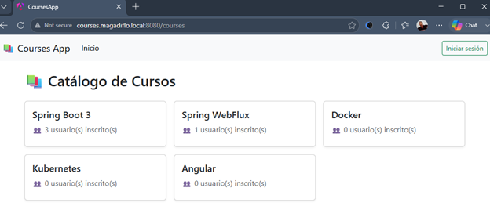
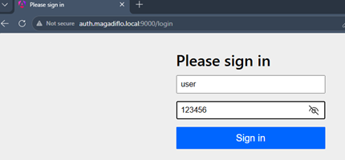
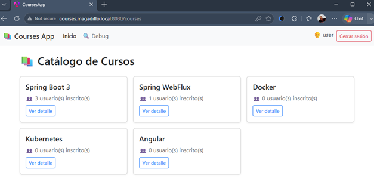
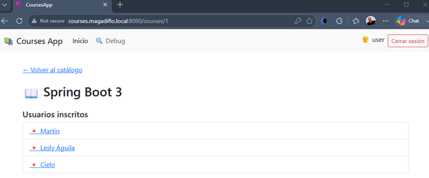
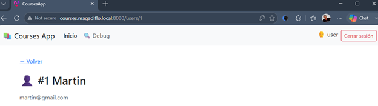
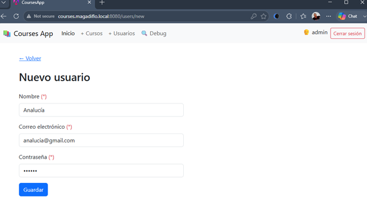
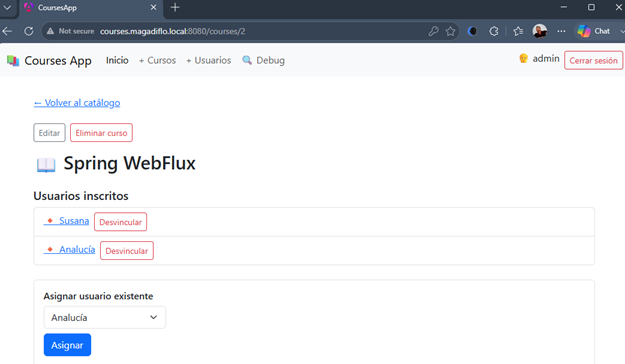

# 🔐 Sección 20: Kubernetes — Security JWT con OAuth 2.1 — Minikube

---

## 🎯 ¿Qué haremos en esta sección?

En secciones anteriores construimos y aseguramos nuestra arquitectura completa de microservicios —tanto el backend como
el frontend de Angular 22 aplicando el patrón BFF (Backend For Frontend)— utilizando OAuth 2.1 con tokens JWT. Toda esa
arquitectura funcionaba correctamente en nuestro entorno de desarrollo local.

En esta sección daremos el paso final: desplegar toda esa arquitectura asegurada dentro de Kubernetes utilizando
Minikube. Esto incluye:

| Componente                | Acción                                                                                            |
|---------------------------|---------------------------------------------------------------------------------------------------|
| 🔐 `authorization-server` | Parametrizar variables de entorno, dockerizar y desplegar en Kubernetes.                          |
| 🌐 `gateway-server`       | Parametrizar (cliente OAuth2 + servidor de recursos), dockerizar y desplegar.                     |
| 📚 `course-service`       | Parametrizar (servidor de recursos), dockerizar y esplegar con la seguridad integrada.            |
| 👤 `user-service`         | Parametrizar (servidor de recursos), dockerizar y esplegar con la seguridad integrada.            |
| 🅰️ Frontend Angular 22     | Generar la imagen de producción en Nginx, configurar la URL del Gateway e integrar en Kubernetes. |

El flujo completo —desde que el usuario se autentica en el `authorization-server` hasta que accede a los recursos
protegidos a través del `gateway-server` mediante cookies de sesión `HTTP-Only`— funcionará íntegramente dentro del
clúster de `Minikube`.

De forma simplificada, nuestra arquitectura quedará así:

```text
                         Minikube
┌─────────────────────────────────────────────────────────────┐
│                                                             │
│  Angular ──────► Gateway Server ──────► course-service      │
│      │                  │                                   │
│      │                  └─────────────► user-service        │
│      │                                                      │
│      └────────────── OAuth2 ─────────► Authorization Server │
│                                                             │
└─────────────────────────────────────────────────────────────┘
```

> 💡 Aunque los componentes estarán desplegados dentro del mismo clúster, debemos distinguir entre las **URLs internas
> de Kubernetes**, utilizadas por las aplicaciones para comunicarse entre sí, y las **URLs externas**, utilizadas por el
> navegador del usuario. Esta diferencia será especialmente importante en el flujo OAuth2.

---

## ⚙️ Configurando Variables de Entorno en `gateway-server`

Hasta ahora hemos configurado las direcciones del `Authorization Server` y del propio `Gateway Server` de forma fija *(
hardcoded)* en el archivo `application.yml`, lo cual funciona perfectamente para pruebas en local. Sin embargo, cuando
despleguemos en Kubernetes, esas direcciones estarán determinadas por la resolución de nombres DNS de los
`Services` dentro del clúster y por la URL externa de acceso.

Para evitar modificar manualmente el archivo `application.yml` en cada entorno (Local, Docker Compose, Kubernetes,
etc.), **parametrizaremos dichas URLs mediante variables de entorno con valores de respaldo (fallbacks).**
Esto nos permite seguir el principio de *Build Once, Deploy Anywhere:* usamos exactamente la misma imagen Docker en
cualquier entorno, alterando únicamente los valores inyectados desde fuera mediante un `ConfigMap`, un `Secret` o
variables en el `Deployment`.

> 💡 Este enfoque sigue el principio de **Configuración Externa** (Externalized Configuration de los 12-Factor Apps)
> que ya aplicamos previamente en los microservicios `user-service` y `course-service`.

### 📝 Nuevas variables de entorno en el `application.yml`

A continuación, agregamos y externalizamos las propiedades clave para la comunicación OAuth2/OIDC y el intercambio
CORS/BFF:

| Variable de entorno               | Valor por defecto (local) | Descripción                                                                                                             |
|-----------------------------------|---------------------------|-------------------------------------------------------------------------------------------------------------------------|
| `CONTAINER_PORT`                  | `8090`                    | Puerto en el que escucha el servidor Spring Cloud Gateway.                                                              |
| `AUTHORIZATION_SERVER_ISSUER_URI` | `http://localhost:9000`   | URI del `Authorization Server` usada tanto como `issuer-uri` del Resource Server como del proveedor OAuth2 del cliente. |
| `ANGULAR_BASE_URL`                | `http://localhost:4200`   | URL base del frontend Angular, utilizada para configurar el origen permitido en CORS y las redirecciones del flujo BFF. |

Estas variables de entorno tienen valores por defecto para el entorno local, pero pueden ser sobrescritas fácilmente al
inyectarlas desde Kubernetes.

> ⚠️ **Importante: `client-secret` también debe externalizarse.**
>
> Aunque durante el desarrollo local podemos mantener temporalmente un valor por defecto como `123456`, no debemos
> dejar una credencial real escrita directamente en `application.yml`.
>
> En Kubernetes, `GATEWAY_CLIENT_SECRET` deberá proporcionarse mediante un `Secret`, no mediante un `ConfigMap`.
> De esta manera podemos mantener la misma imagen Docker y cambiar la credencial según el entorno sin modificar el
> código ni reconstruir la imagen.

````yml
server:
  port: ${CONTAINER_PORT:8090}
  error:
    include-message: always

spring:
  application:
    name: gateway-server
  cloud:
    gateway:
      server:
        webflux:
          default-filters:
            - TokenRelay
          routes:
            - id: course-service-route
              uri: lb://svc-course-service
              predicates:
                - Path=/api/v1/courses/**
            - id: user-service-route
              uri: lb://svc-user-service
              predicates:
                - Path=/api/v1/users/**
  security:
    oauth2:
      resourceserver:
        jwt:
          issuer-uri: ${AUTHORIZATION_SERVER_ISSUER_URI:http://localhost:9000}
      client:
        registration:
          gateway-client-registration:
            provider: authorization-server-provider
            client-id: gateway-client
            client-secret: ${GATEWAY_CLIENT_SECRET:123456}
            authorization-grant-type: authorization_code
            redirect-uri: "{baseUrl}/login/oauth2/code/{registrationId}"
            scope: openid, profile
        provider:
          authorization-server-provider:
            issuer-uri: ${AUTHORIZATION_SERVER_ISSUER_URI:http://localhost:9000}


custom:
  frontend:
    angular:
      base-url: ${ANGULAR_BASE_URL:http://localhost:4200}
````

**🔍 Puntos clave de la configuración**

- 🔁 **Doble uso de `AUTHORIZATION_SERVER_ISSUER_URI`:** La variable se reutiliza en dos bloques distintos dentro de
  Spring Security porque el Gateway desempeña dos roles de seguridad simultáneos:
    - Como `Resource Server` (`resourceserver.jwt.issuer-uri`): Valida que las firmas y la validez de los tokens JWT
      recibidos correspondan con la clave pública emitida por ese emisor (`issuer`).
    - Como `OAuth2 Client` (`provider.authorization-server-provider.issuer-uri`): Utiliza el protocolo OIDC Discovery
      leyendo el endpoint `/.well-known/openid-configuration` para autodescubrir de manera dinámica las rutas de
      `/oauth2/authorize`, `/oauth2/token`, `/oauth2/jwks`, etc.

- 🌐 **Soporte para el patrón BFF (`ANGULAR_BASE_URL`):** Permite que las políticas CORS de Spring WebFlux acepten
  solicitudes cruzadas desde el origen exacto donde corre Angular, habilitando la transferencia segura de cookies de
  sesión `HTTP-Only` con la propiedad `SameSite/Credentials`.

#### 🌐 Una consideración importante sobre `issuer-uri` en Kubernetes

Aquí debemos hacer una distinción que será fundamental cuando creemos los `Services` de Kubernetes. Dentro del clúster,
el Gateway podría comunicarse con el Authorization Server mediante un nombre como:

> `http://svc-authorization-server:9000`

Sin embargo, no debemos asumir automáticamente que ese será el valor correcto de `issuer-uri`.

El `issuer-uri` representa la identidad del `Authorization Server` y participa en el flujo OAuth2/OIDC. En nuestro caso,
el Gateway inicia un flujo de login que termina provocando una **redirección del navegador hacia el Authorization
Server.**

Por lo tanto, la URL utilizada como issuer debe ser coherente con la dirección que el cliente puede utilizar durante el
flujo OAuth2, no simplemente con un DNS interno que solamente pueda resolver otro Pod.

> ⚠️ Esto significa que durante la configuración de Kubernetes tendremos que analizar cuidadosamente la diferencia
> entre la `URL interna del Service` y la `URL externa mediante la cual el navegador accederá al Authorization Server`.

Este punto será especialmente importante cuando configuremos el `Authorization Server`, el `Ingress` o la forma en que
expondremos los servicios desde Minikube.

#### 🔄 ¿Qué conseguimos con esta configuración?

Con estas modificaciones, el `gateway-server` deja de depender de valores escritos directamente en su configuración y
queda preparado para recibirlos desde el entorno donde se ejecute.

Por ejemplo, localmente podemos mantener:

```text
AUTHORIZATION_SERVER_ISSUER_URI=http://localhost:9000
ANGULAR_BASE_URL=http://localhost:4200
```

Mientras que en Kubernetes podremos proporcionar otros valores desde los recursos correspondientes. La ventaja principal
es que **la imagen Docker del Gateway no necesita cambiar entre entornos**:

```text
                  Misma imagen
                       │
          ┌────────────┼────────────┐
          ▼            ▼            ▼
        Local       Minikube      Producción
          │            │            │
          ▼            ▼            ▼
       Config.       Config.       Config.
       local         K8s           externa
```

> ✅ Este es precisamente uno de los objetivos de externalizar la configuración: **el artefacto desplegable permanece
> igual y lo que cambia es la configuración proporcionada por el entorno de ejecución**.

Además, el `TokenRelay` que ya utilizábamos continúa funcionando: Spring Cloud Gateway puede actuar como consumidor
OAuth2 y retransmitir el access token del usuario hacia los servicios protegidos que se encuentran detrás del Gateway.

Con esto dejamos preparado el `gateway-server` para el siguiente paso: **construir su imagen Docker y posteriormente
inyectar estos valores mediante la configuración de Kubernetes**.

## 🐳 Reconstruyendo la imagen Docker de `gateway-server` y publicándola en Docker Hub

Dado que hemos modificado el archivo `application.yml` del `gateway-server` para desacoplar las URLs mediante variables
de entorno y externalizar sus secretos, es necesario **reconstruir su imagen de Docker y publicarla en el registro
remoto de Docker Hub.** Esto permitirá que el clúster de Kubernetes (Minikube) pueda descargar (pull)
la versión actualizada de la aplicación.

### 1️⃣ Construcción de la imagen Docker (Docker Build)

Ejecutamos el comando `docker image build` especificando la ruta relativa donde se encuentra el contexto del
microservicio y asignándole la etiqueta (tag) correspondiente a nuestro repositorio de Docker Hub:

````bash
D:\programming\spring\01.udemy\02.andres_guzman\08.docker_kubernetes\docker-kubernetes-2026 (feature/section-20)                                   
$ docker image build -t magadiflo/gateway-server .\infrastructure\gateway-server                                                                   
[+] Building 97.3s (24/24) FINISHED                                                                                                                
 => [internal] load build definition from Dockerfile                                                                                               
...                                                                             
 => [runner 7/7] COPY --from=builder /app/application ./                                                                                           
 => exporting to image                                                                                                                             
 => => exporting layers                                                                                                                            
 => => writing image sha256:1d111991e0b08e979d551d61a964da9db15d153e14fece35090e48559323db36                                                       
 => => naming to docker.io/magadiflo/gateway-server                                                                                                
````

> 💡 **Importante:** la imagen contiene la aplicación y sus archivos necesarios para ejecutarse, pero no contiene los
> valores específicos de configuración de Kubernetes que definimos anteriormente.
>
> Por ejemplo, `AUTHORIZATION_SERVER_ISSUER_URI`, `ANGULAR_BASE_URL` y `GATEWAY_CLIENT_SECRET` serán proporcionados
> posteriormente por Kubernetes mediante variables de entorno.
>
> Esto es precisamente lo que buscamos: **la misma imagen podrá utilizarse en diferentes entornos cambiando únicamente
> su configuración externa.**

### 2️⃣ Publicación de la imagen en Docker Hub (Docker Push)

Una vez generada la imagen localmente, la subimos a Docker Hub utilizando el comando `docker push`:

````bash
D:\programming\spring\01.udemy\02.andres_guzman\08.docker_kubernetes\docker-kubernetes-2026 (feature/section-20)
$ docker push magadiflo/gateway-server                                                                          
Using default tag: latest                                                                                       
The push refers to repository [docker.io/magadiflo/gateway-server]                                              
5a67b0226bc2: Pushed                                                                                            
d92737fc61c9: Pushed                                                                                            
3cf7de9cb822: Pushed                                                                                            
9fa94b08903a: Pushed                                                                                            
...                                                                           
48a38f60a6ee: Layer already exists                                                                              
31ad4a471c68: Layer already exists                                                                              
latest: digest: sha256:1f6ef068c5a7d9a8e07b4f9913a3eb2fa86c8417c46370ef77c22de4b7c5fd48 size: 2616               
````

### ✅ Resultado

El `gateway-server` ya está **dockerizado** y publicado en **Docker Hub.** Sin embargo, todavía no hemos configurado sus
variables de entorno dentro de Kubernetes. Esto lo haremos posteriormente mediante los recursos de Kubernetes
correspondientes, principalmente:

- 📦 `Deployment` → ejecutará el contenedor.
- ⚙️ `ConfigMap` → proporcionará configuración no sensible.
- 🔐 `Secret` → proporcionará `GATEWAY_CLIENT_SECRET`.
- 🌐 `Service` → permitirá exponer y descubrir el Gateway dentro del clúster.

De esta manera, mantenemos separadas las responsabilidades:

```text
Imagen Docker
     │
     │ contiene
     ▼
Aplicación + configuración base
     │
     │ recibe desde Kubernetes
     ▼
Variables de entorno
     │
     ├── AUTHORIZATION_SERVER_ISSUER_URI
     ├── ANGULAR_BASE_URL
     ├── GATEWAY_CLIENT_SECRET
     └── CONTAINER_PORT
```

Con esto, **`gateway-server` queda preparado para ser desplegado posteriormente dentro de Minikube**.

## ☸️ Configuración de Objetos de Kubernetes para el `gateway-server`

Una vez parametrizada la aplicación y publicada su imagen en Docker Hub, procedemos a crear los manifiestos declarativos
de Kubernetes (`ConfigMap`, `Secret` y `Deployment`) para desplegar el `gateway-server` en nuestro clúster de Minikube.

### 🗺️ ConfigMap: `gateway-server-config-map.yml`

Declaramos los valores no confidenciales de las variables de entorno:

````yml
apiVersion: v1
kind: ConfigMap
metadata:
  name: cm-gateway-server
data:
  container_port: '8090'
  authorization_server_issuer_uri: http://svc-authorization-server:9000
  angular_base_url: http://localhost:4200 # valor temporal — se actualizará al configurar Angular en Kubernetes
````

#### 🔍 Sobre los valores definidos

📌 **`authorization_server_issuer_uri: http://svc-authorization-server:9000`**

Este valor corresponde al `Service` de Kubernetes que crearemos cuando lleguemos a la configuración del
`authorization-server`. Es importante notar que aquí incluimos **explícitamente el puerto `9000`**, a diferencia de cómo
resolvemos los servicios en `user-service` y `course-service` (clase `RestClientConfig`).

El valor `http://svc-authorization-server:9000` está compuesto por dos partes:

- `svc-authorization-server`: nombre DNS del Service de Kubernetes que expondrá al `authorization-server` dentro del
  clúster.
- `9000`: puerto mediante el cual ese Service recibirá las peticiones.

> 💡 **¿Por qué aquí sí necesitamos el puerto?**
>
> En los microservicios `user-service` y `course-service` usamos `@LoadBalanced` junto con
> `Spring Cloud LoadBalancer`. Este mecanismo intercepta el nombre lógico del servicio
> (ej. `svc-user-service`), consulta la API de Kubernetes para obtener las IPs de los Pods
> y aplica balanceo de carga — **resolviendo automáticamente el puerto** gracias a la
> integración con el `DiscoveryClient`.
>
> En el `gateway-server`, la comunicación con el `authorization-server` no pasa por
> `Spring Cloud LoadBalancer` — se realiza directamente mediante el DNS interno de
> Kubernetes. En ese caso, el DNS resuelve el nombre del `Service` a su `ClusterIP`, pero
> **no infiere el puerto automáticamente**. Por eso es obligatorio especificarlo:

| Mecanismo                      | ¿Necesita puerto explícito? | Ejemplo                                |
|--------------------------------|-----------------------------|----------------------------------------|
| `@LoadBalanced` (Spring Cloud) | ❌ No                       | `lb://svc-user-service`                |
| DNS interno de Kubernetes      | ✅ Sí                       | `http://svc-authorization-server:9000` |

📌 **`angular_base_url: http://localhost:4200`**

> 🚨 **Valor temporal:** Este valor se actualizará más adelante cuando tengamos la
> aplicación Angular corriendo dentro de Kubernetes. En ese momento, la URL correcta será
> la del `Service` que exponga el Pod de Angular — similar a como obtenemos las URLs de los
> demás microservicios. Por ahora lo dejamos con el valor local para continuar avanzando.

> ⚠️ **Importante:** `angular_base_url` no debe apuntar al nombre interno del `Service` de Angular, como
> `http://svc-angular:80`. Esta URL es utilizada por el `gateway-server` para mecanismos como CORS, pero quien realiza
> la petición HTTP hacia el Gateway es el navegador del usuario, que se encuentra fuera de la red interna de Kubernetes.
>
> Por ello, su valor debe corresponder a la URL externa con la que el navegador accederá al frontend Angular.
> Cuando lleguemos a la exposición del frontend mediante Minikube, podremos determinar el valor definitivo.
>
> Por ejemplo, si finalmente ejecutamos `minikube service svc-angular --url` y obtenemos:
>
> `http://127.0.0.1:58469`
>
> esa sería la URL que conceptualmente debería utilizarse como origen del frontend. Sin embargo, como esta URL puede
> cambiar, no la fijaremos todavía.

### 🔐 Secret: `gateway-server-secret.yml`

Declaramos los valores confidenciales codificados en Base64. Podemos obtener el valor codificado con el siguiente
comando en `Git Bash`:

````bash
magadiflo@SysEngJava MINGW64 ~
$ echo -n "123456" | base64
MTIzNDU2
````

> ⚠️ **Nota:** La opción `-n` en `echo` es fundamental para evitar agregar un salto de línea (`\n`) invisible al final
> del texto antes de codificarlo.

Creamos el archivo `gateway-server-secret.yml`:

````yml
apiVersion: v1
kind: Secret
metadata:
  name: sec-gateway-server
type: Opaque
data:
  gateway_client_secret: MTIzNDU2   # 123456 en Base64
````

### 📦 Deployment: `gateway-server-deployment.yml`

Actualizamos la especificación del `Deployment` mapeando las variables de entorno que Spring Boot espera
(`CONTAINER_PORT`, `AUTHORIZATION_SERVER_ISSUER_URI`, `GATEWAY_CLIENT_SECRET`, `ANGULAR_BASE_URL`) hacia sus respectivas
referencias en el `ConfigMap` y el `Secret`.

````yml
apiVersion: apps/v1
kind: Deployment
metadata:
  name: d-gateway-server
spec:
  replicas: 1
  selector:
    matchLabels:
      app: d-gateway-server
  template:
    metadata:
      labels:
        app: d-gateway-server
    spec:
      containers:
        - image: magadiflo/gateway-server:latest
          name: c-gateway-server
          ports:
            - containerPort: 8090
          env:
            - name: CONTAINER_PORT
              valueFrom:
                configMapKeyRef:
                  name: cm-gateway-server
                  key: container_port
            - name: AUTHORIZATION_SERVER_ISSUER_URI
              valueFrom:
                configMapKeyRef:
                  name: cm-gateway-server
                  key: authorization_server_issuer_uri
            - name: ANGULAR_BASE_URL
              valueFrom:
                configMapKeyRef:
                  name: cm-gateway-server
                  key: angular_base_url
            - name: GATEWAY_CLIENT_SECRET
              valueFrom:
                secretKeyRef:
                  name: sec-gateway-server
                  key: gateway_client_secret
````

**📊 Resumen de variables inyectadas**

| Variable de entorno               | Fuente      | Descripción                                                                       |
|-----------------------------------|-------------|-----------------------------------------------------------------------------------|
| `CONTAINER_PORT`                  | `ConfigMap` | Puerto interno del contenedor.                                                    |
| `AUTHORIZATION_SERVER_ISSUER_URI` | `ConfigMap` | URI del `Authorization Server` para validación JWT y descubrimiento de endpoints. |
| `ANGULAR_BASE_URL`                | `ConfigMap` | URL base del frontend Angular (temporal).                                         |
| `GATEWAY_CLIENT_SECRET`           | `Secret`    | Credencial confidencial del cliente OAuth2.                                       |

````text
┌─────────────────────────┐      ┌─────────────────────────┐
│    cm-gateway-server    │      │   sec-gateway-server    │
│  (container_port, etc.) │      │ (gateway_client_secret) │
└────────────┬────────────┘      └────────────┬────────────┘
             │                                │
             └───────────────┬────────────────┘
                             ▼
              ┌──────────────────────────────┐
              │      c-gateway-server        │
              │  (Deployment / Pod K8s)      │
              └──────────────────────────────┘
````

> ✅ Con estos tres manifiestos, el `gateway-server` queda completamente configurado dentro del ecosistema de
> Kubernetes, listo para enlazar sus dependencias con el `authorization-server` y el frontend en los siguientes pasos.

## ⚙️ Configurando Variables de Entorno en `authorization-server`

Al igual que hicimos con el `gateway-server`, parametrizaremos las configuraciones del `authorization-server`
mediante variables de entorno para que pueda adaptarse al entorno de Kubernetes.

En este caso necesitamos tres valores dinámicos:

| Variable de entorno               | Descripción                                                                                      |
|-----------------------------------|--------------------------------------------------------------------------------------------------|
| `GATEWAY_CLIENT_SECRET`           | Credencial del cliente `gateway-client` registrado en el servidor de autorización.               |
| `GATEWAY_SERVER_BASE_URL`         | URL base del `gateway-server`, usada para construir los `redirectUri` y `postLogoutRedirectUri`. |
| `AUTHORIZATION_SERVER_ISSUER_URI` | URI que identificará al `authorization-server` como emisor (`iss`) en los tokens JWT generados.  |

### 💻 Cambios en `SecurityConfig`

Inyectamos la interfaz `Environment` de Spring para acceder a las variables de entorno en tiempo de ejecución:

````java

@RequiredArgsConstructor
@Configuration
public class SecurityConfig {

    private final Environment environment;

    /* other codes */

    @Bean
    public RegisteredClientRepository registeredClientRepository() {
        RegisteredClient gatewayClient = RegisteredClient.withId(UUID.randomUUID().toString())
                .clientId("gateway-client")
                .clientSecret("{noop}" + this.environment.getProperty("GATEWAY_CLIENT_SECRET"))
                .clientAuthenticationMethod(ClientAuthenticationMethod.CLIENT_SECRET_BASIC)
                .authorizationGrantType(AuthorizationGrantType.AUTHORIZATION_CODE)
                .authorizationGrantType(AuthorizationGrantType.REFRESH_TOKEN)

                // OAuth Debugger (pruebas)
                .redirectUri("https://oauthdebugger.com/debug")
                // Entorno local
                .redirectUri("http://localhost:8090/login/oauth2/code/gateway-client-registration")
                // Kubernetes
                .redirectUri(String.format(
                        "%s/login/oauth2/code/gateway-client-registration",
                        this.environment.getProperty("GATEWAY_SERVER_BASE_URL")
                ))

                // Entorno local
                .postLogoutRedirectUri("http://localhost:8090/post-logout")
                // Kubernetes
                .postLogoutRedirectUri(String.format(
                        "%s/post-logout",
                        this.environment.getProperty("GATEWAY_SERVER_BASE_URL")
                ))
                .scope(OidcScopes.OPENID)
                .scope(OidcScopes.PROFILE)
                .clientSettings(ClientSettings.builder().requireAuthorizationConsent(false).build())
                .build();

        return new InMemoryRegisteredClientRepository(gatewayClient);
    }

    /* other codes */

    @Bean
    public AuthorizationServerSettings authorizationServerSettings() {
        String issuerUri = Objects.requireNonNull(
                this.environment.getProperty("AUTHORIZATION_SERVER_ISSUER_URI")
        );

        return AuthorizationServerSettings.builder()
                .issuer(issuerUri)
                .build();
    }
}
````

**🔍 Puntos clave del código**

- **Múltiples `redirectUri` y `postLogoutRedirectUri`:**  
  Spring Authorization Server permite registrar **varias URIs de redirección** en un mismo cliente. Al momento de
  procesar la solicitud, compara la URI recibida con las registradas y usa la que coincide — por eso podemos mantener
  las URIs de desarrollo y pruebas junto con la de Kubernetes sin conflicto alguno.

- **Parametrización del `authorizationServerSettings()`:**  
  Este es un punto crítico. El valor del `issuer` definido aquí será incluido en el claim `iss` de cada `access_token`
  generado. Para que el `gateway-server` acepte los tokens como válidos, ese valor debe coincidir exactamente con lo
  configurado en:
    ````text
    security.oauth2.resourceserver.jwt.issuer-uri
    security.oauth2.client.provider.authorization-server-provider.issuer-uri 
    ````

> 📌 **Valor pendiente de confirmar:** El valor exacto de `AUTHORIZATION_SERVER_ISSUER_URI` lo definiremos con certeza
> más adelante. Como referencia, en el `gateway-server-config-map.yml` lo habíamos establecido provisionalmente como
> `http://svc-authorization-server:9000`, pero este valor podría cambiar una vez que tengamos claro qué URL tendrá el
> `Service` del `authorization-server` dentro del clúster de Kubernetes.

### 💡 Sobre la organización de variables compartidas entre servicios

Me preguntas si está bien repetir `AUTHORIZATION_SERVER_ISSUER_URI` en el `ConfigMap` de cada servicio. Es una pregunta
muy válida. Aquí hay dos enfoques y sus implicaciones:

| Enfoque                       | Descripción                                                                                | ¿Cuándo usarlo?                                                                                                                                         |
|-------------------------------|--------------------------------------------------------------------------------------------|---------------------------------------------------------------------------------------------------------------------------------------------------------|
| **Un ConfigMap por servicio** | Cada microservicio tiene su propio ConfigMap con sus variables, aunque algunas se repitan. | ✅ Recomendado — mantiene el **principio de responsabilidad única**: cada ConfigMap pertenece a un servicio y puede evolucionar de forma independiente. |
| **ConfigMap compartido**      | Un solo ConfigMap con las variables comunes, referenciado por varios servicios.            | ⚠️ Puede ser útil, pero crea **acoplamiento** entre servicios — si cambias el ConfigMap, afectas a todos los que lo usan.                               |

**Recomendación: un ConfigMap por servicio**, repitiendo la variable si es necesario. La "duplicación" es mínima y el
beneficio de mantener cada servicio independiente es mayor.

> 💡 Piénsalo así: si en el futuro el `gateway-server` apunta a un `authorization-server` diferente, solo tendrías que
> modificar su propio ConfigMap — sin afectar al `authorization-server` ni a otros servicios.

> 💡 Un `ConfigMap` no debe entenderse como un repositorio central de todas las variables del sistema. Es preferible
> que cada aplicación declare explícitamente la configuración que necesita, manteniendo cada Deployment lo más
> independiente posible.
>
> 🎯 **En resumen:** mantendremos los manifestos `ConfigMap` y `Secret` independientes para cada servicio.

## 🐳 Creación del Dockerfile, Imagen y Publicación en Docker Hub para el `authorization-server`

Al igual que con el `gateway-server`, necesitamos dockerizar el `authorization-server`. La única diferencia respecto a
los demás microservicios es el puerto expuesto: `9000`.

### 📄 Dockerfile del `authorization-server`

Reutilizamos la misma estructura multi-stage que usamos en los otros microservicios, modificando únicamente el puerto
expuesto a `9000`:

````dockerfile
FROM eclipse-temurin:25-jdk-alpine AS dependencies
WORKDIR /app
COPY ./mvnw ./
COPY ./.mvn ./.mvn
COPY ./pom.xml ./
RUN sed -i -e 's/\r$//' ./mvnw && ./mvnw dependency:go-offline
COPY ./src ./src
RUN ./mvnw clean package -DskipTests

FROM eclipse-temurin:25-jre-alpine AS builder
WORKDIR /app
COPY --from=dependencies /app/target/*.jar ./app.jar
RUN java -Djarmode=layertools -jar app.jar extract

FROM eclipse-temurin:25-jre-alpine AS runner
WORKDIR /app
RUN mkdir ./logs
COPY --from=builder /app/dependencies ./
COPY --from=builder /app/spring-boot-loader ./
COPY --from=builder /app/snapshot-dependencies ./
COPY --from=builder /app/application ./
EXPOSE 9000
ENTRYPOINT ["java", "org.springframework.boot.loader.launch.JarLauncher"]
````

### 🔨 Construyendo la imagen

Ejecutamos el comando de construcción desde la raíz del proyecto:

````bash
D:\programming\spring\01.udemy\02.andres_guzman\08.docker_kubernetes\docker-kubernetes-2026 (feature/section-20)                                   
$ docker image build -t magadiflo/authorization-server .\infrastructure\authorization-server                                                       
[+] Building 80.5s (23/23) FINISHED                                                                                                                
 => [internal] load build definition from Dockerfile                                                                                               
 => => transferring dockerfile: 847B                                                                                                               
 => [internal] load metadata for docker.io/library/eclipse-temurin:25-jdk-alpine                                                                   
 => [internal] load metadata for docker.io/library/eclipse-temurin:25-jre-alpine                                                                   
...                                                                         
 => [runner 6/7] COPY --from=builder /app/snapshot-dependencies ./                                                                                 
 => [runner 7/7] COPY --from=builder /app/application ./                                                                                           
 => exporting to image                                                                                                                             
 => => exporting layers                                                                                                                            
 => => writing image sha256:17eaa01596291eeca54243fd89c63435cf923d72db69cdae8bb9f2a25e442926                                                       
 => => naming to docker.io/magadiflo/authorization-server                                                                                          
````

### 🏷️ Creando el repositorio en Docker Hub

Antes de publicar la imagen, creamos un nuevo repositorio en [Docker Hub](https://hub.docker.com/) con el nombre
`authorization-server`. Una vez creado, el repositorio quedará disponible como `magadiflo/authorization-server`.

> 📌 Este paso es necesario porque Docker Hub no crea repositorios automáticamente al hacer `push` si no existen
> previamente — a diferencia de registros privados como GitHub Container Registry o AWS ECR.

### 🚀 Publicando la imagen en Docker Hub

````bash
D:\programming\spring\01.udemy\02.andres_guzman\08.docker_kubernetes\docker-kubernetes-2026 (feature/section-20)
$ docker push magadiflo/authorization-server                                                                    
Using default tag: latest                                                                                       
The push refers to repository [docker.io/magadiflo/authorization-server]                                        
845ac315c1d9: Pushed                                                                                            
bb3b00bfbc4d: Pushed                                                                                            
...                                                            
48a38f60a6ee: Mounted from magadiflo/gateway-server                                                             
31ad4a471c68: Mounted from magadiflo/gateway-server                                                             
latest: digest: sha256:bf97f959a51cfcfdb1356b1c81106fd11a0a3daf9dc290127e6f75f29884f090 size: 2615               
````

> 💡 Las capas marcadas como `Mounted from magadiflo/gateway-server` son reutilizadas
> directamente desde la imagen base compartida — Docker Hub no las sube nuevamente, haciendo
> el push más rápido y eficiente.

## ☸️ Configuración de Objetos de Kubernetes para el `authorization-server`

Para desplegar el servidor de autorización en nuestro clúster de Kubernetes, definimos sus manifiestos correspondientes
organizando la configuración, secretos, la carga de trabajo (*Deployment*) y su exposición (*Service*).

### 🗺️ ConfigMap: `authorization-server-config-map.yml`

Definimos en el `ConfigMap` las variables de entorno de configuración general (no sensibles), como las URLs internas de
comunicación dentro del clúster:

````yml
apiVersion: v1
kind: ConfigMap
metadata:
  name: cm-authorization-server
data:
  gateway_server_base_url: http://svc-gateway-server:8090
  authorization_server_issuer_uri: http://svc-authorization-server:9000
````

> 💡 Ambos valores usan el nombre del `Service` de Kubernetes seguido del puerto, ya que la comunicación entre estos
> componentes ocurre a través del DNS interno del clúster — sin `Spring Cloud LoadBalancer` de por medio, por lo que el
> puerto debe especificarse explícitamente.

### 🔐 Secret: `authorization-server-secret.yml`

Para los datos sensibles (como credenciales y secretos de cliente de OAuth2), utilizamos un objeto `Secret` de tipo
`Opaque`. Los valores en el manifiesto se almacenan codificados en Base64 (`123456` ⟶ `MTIzNDU2`):

````yml
apiVersion: v1
kind: Secret
metadata:
  name: sec-authorization-server
type: Opaque
data:
  gateway_client_secret: MTIzNDU2   # 123456 en Base64
````

### 📦 Deployment: `authorization-server-deployment.yml`

Configuramos el despliegue de los pods del `authorization-server` inyectando las variables de entorno desde el
`ConfigMap` y el `Secret` creados previamente.

````yml
apiVersion: apps/v1
kind: Deployment
metadata:
  name: d-authorization-server
spec:
  replicas: 1
  selector:
    matchLabels:
      app: d-authorization-server
  template:
    metadata:
      labels:
        app: d-authorization-server
    spec:
      containers:
        - image: magadiflo/authorization-server:latest
          name: c-authorization-server
          ports:
            - containerPort: 9000
          env:
            - name: AUTHORIZATION_SERVER_ISSUER_URI
              valueFrom:
                configMapKeyRef:
                  name: cm-authorization-server
                  key: authorization_server_issuer_uri
            - name: GATEWAY_SERVER_BASE_URL
              valueFrom:
                configMapKeyRef:
                  name: cm-authorization-server
                  key: gateway_server_base_url
            - name: GATEWAY_CLIENT_SECRET
              valueFrom:
                secretKeyRef:
                  name: sec-authorization-server
                  key: gateway_client_secret
````

**📊 Resumen de variables inyectadas**

| Variable de entorno               | Fuente      | Descripción                                                                                                              |
|-----------------------------------|-------------|--------------------------------------------------------------------------------------------------------------------------|
| `AUTHORIZATION_SERVER_ISSUER_URI` | `ConfigMap` | URI del propio `authorization-server` — define el claim `iss` en los JWT emitidos.                                       |
| `GATEWAY_SERVER_BASE_URL`         | `ConfigMap` | URL base del `gateway-server` — usada para construir los `redirectUri` y `postLogoutRedirectUri` del cliente registrado. |
| `GATEWAY_CLIENT_SECRET`           | `Secret`    | Credencial confidencial del cliente `gateway-client`.                                                                    |

### 🌐 Servicio: `authorization-server-service.yml`

Finalmente, necesitamos un `Service` que proporcione una dirección estable para acceder al `authorization-server`.

````yml
apiVersion: v1
kind: Service
metadata:
  name: svc-authorization-server
spec:
  ports:
    - port: 9000
      protocol: TCP
      targetPort: 9000
  selector:
    app: d-authorization-server
  type: LoadBalancer
````

💡 Usamos `type: LoadBalancer` para que el `authorization-server` sea accesible desde fuera del clúster — necesario para
que el navegador del usuario pueda redirigirse al servidor de autorización durante el flujo OAuth2 (login, consent,
etc.). A diferencia de los servicios de base de datos que solo necesitan `ClusterIP`, el `authorization-server` debe ser
accesible externamente porque el navegador interactúa directamente con él.

> ☸️ **Todavía no aplicamos ningún manifiesto.**  
> En esta etapa únicamente dejamos preparados los objetos necesarios para el `authorization-server`. Más adelante,
> cuando toda la arquitectura esté configurada, aplicaremos los recursos progresivamente y verificaremos la comunicación
> entre los componentes.

## ⚙️ Configurando Variables de Entorno en `course-service`

Recordemos que tanto `course-service` como `user-service` fueron configurados como **OAuth 2.1 Resource Servers**. Esto
significa que ambos son responsables de validar los tokens de acceso JWT recibidos en las peticiones a sus recursos
protegidos.

Como parte de esa configuración, cada **Resource Server** necesita conocer el **issuer esperado** de los tokens. Este
valor debe coincidir con el atributo `iss` incluido en los JWT emitidos por nuestro `authorization-server`.

Hasta ahora, `course-service` tenía esta dirección configurada directamente en `application.yml`. Como vamos a desplegar
la aplicación en Kubernetes, debemos externalizarla mediante una variable de entorno.

### 📝 Nueva variable de entorno en el `application.yml`

Anteriormente, ya teníamos parametrizado este archivo. Sin embargo, al incorporar **OAuth 2.1** agregamos la dirección
del `authorization-server` directamente en la configuración del **Resource Server.**

Ahora reemplazaremos ese valor fijo por una variable de entorno:

| Variable de entorno               | Descripción                                                                                                                                                                                       |
|-----------------------------------|---------------------------------------------------------------------------------------------------------------------------------------------------------------------------------------------------|
| `AUTHORIZATION_SERVER_ISSUER_URI` | URI que identificará al `authorization-server` como emisor (`iss`) en los tokens JWT generados. Debe coincidir con el valor del atributo `iss` de los JWT emitidos por el `authorization-server`. |

````yml
server:
  port: ${CONTAINER_PORT:8002}
  error:
    include-message: always

spring:
  application:
    name: course-service
  # API Versioning (Spring Boot 4). Ver información en user-service
  mvc:
    api-version:
      required: true
      supported: 1,2
      use:
        path-segment: 1
  datasource:
    url: jdbc:postgresql://${DB_HOST}:${DB_PORT}/${DB_NAME}
    username: ${DB_USERNAME}
    password: ${DB_PASSWORD}
  jpa:
    hibernate:
      ddl-auto: update
    properties:
      hibernate:
        format_sql: true
  cloud:
    kubernetes:
      secrets:
        enable-api: true
      discovery:
        all-namespaces: true
  security:
    oauth2:
      resourceserver:
        jwt:
          issuer-uri: ${AUTHORIZATION_SERVER_ISSUER_URI:http://localhost:9000}

custom:
  user-service:
    base-url: http://${K8S_USER_SERVICE_NAME}

logging:
  level:
    dev.magadiflo.course.app: debug
    org.hibernate.SQL: debug
````

> ⚠️ **Importante:** el valor definitivo de `AUTHORIZATION_SERVER_ISSUER_URI` todavía dependerá de cómo expongamos
> nuestro `authorization-server` en Kubernetes. El valor `http://svc-authorization-server:9000` representa la dirección
> interna del `Service`; sin embargo, nuestro `authorization-server` también participa directamente en el flujo
> `OAuth 2.1/OIDC` con el navegador. Por ello, más adelante debemos definir correctamente su `issuer` público y
> asegurarnos de que dicho valor sea coherente con el `iss` de los `JWT` y con la configuración de los demás
> componentes.

## 🐳 Reconstruyendo la imagen Docker de `course-service` y publicándola en Docker Hub

Dado que hemos modificado el archivo `application.yml` del `course-service` es necesario **reconstruir su imagen de
Docker y publicarla en el registro remoto de Docker Hub.**

### 1️⃣ Construcción de la imagen Docker (Docker Build)

Ejecutamos el comando `docker image build` especificando la ruta relativa donde se encuentra el contexto del
microservicio y asignándole la etiqueta (tag) correspondiente a nuestro repositorio de Docker Hub:

````bash
D:\programming\spring\01.udemy\02.andres_guzman\08.docker_kubernetes\docker-kubernetes-2026 (feature/section-20)                                   
$ docker image build -t magadiflo/course-service .\business-domain\course-service                                                                  
[+] Building 99.7s (23/23) FINISHED                                                                                                                
 => [internal] load build definition from Dockerfile                                                                                               
 => => transferring dockerfile: 799B                                                                                                               
 => [internal] load metadata for docker.io/library/eclipse-temurin:25-jdk-alpine                                                                   
...                                                                               
 => [runner 5/7] COPY --from=builder /app/spring-boot-loader ./                                                                                    
 => [runner 6/7] COPY --from=builder /app/snapshot-dependencies ./                                                                                 
 => [runner 7/7] COPY --from=builder /app/application ./                                                                                           
 => exporting to image                                                                                                                             
 => => exporting layers                                                                                                                            
 => => writing image sha256:b968db44ccab822900653c43b5761ad6aafb550ad61ed785a78e9f8978e2e3b8                                                       
 => => naming to docker.io/magadiflo/course-service                                                                                                                                                                                             
````

### 2️⃣ Publicación de la imagen en Docker Hub (Docker Push)

Una vez generada la imagen localmente, la subimos a Docker Hub utilizando el comando `docker push`:

````bash
D:\programming\spring\01.udemy\02.andres_guzman\08.docker_kubernetes\docker-kubernetes-2026 (feature/section-20)
$ docker push magadiflo/course-service                                                                          
Using default tag: latest                                                                                       
The push refers to repository [docker.io/magadiflo/course-service]                                              
55b93325450d: Pushed                                                                                            
1b34789a8bcd: Pushed                                                                                            
...                                                                          
48a38f60a6ee: Layer already exists                                                                              
31ad4a471c68: Layer already exists                                                                              
latest: digest: sha256:049bbb1de1150f4868b456da5fcb84602ec02bd1f5a2d373e6ecfccfdbac6fe9 size: 2617                            
````

## ☸️ Configuración de Objetos de Kubernetes para el `course-service`

Una vez publicada la nueva imagen, actualizamos los manifiestos de Kubernetes para proporcionar al contenedor la nueva
variable de entorno. Por el momento solo actualizaremos los archivos, aún no los aplicaremos.

### 🗺️ ConfigMap: `course-service-config-map.yml`

Agregamos la configuración correspondiente a `AUTHORIZATION_SERVER_ISSUER_URI`:

````yml
apiVersion: v1
kind: ConfigMap
metadata:
  name: cm-course-service
data:
  container_port: '8002'
  db_host: svc-postgres
  db_port: '5432'
  db_name: db_course_service
  k8s_user_service_name: svc-user-service
  authorization_server_issuer_uri: http://svc-authorization-server:9000 # Nueva configuración agregada
````

### 📦 Deployment: `course-service-deployment.yml`

Inyectamos la nueva variable de entorno desde el `ConfigMap`.

````yml
apiVersion: apps/v1
kind: Deployment
metadata:
  name: d-course-service
spec:
  replicas: 1
  selector:
    matchLabels:
      app: d-course-service
  template:
    metadata:
      labels:
        app: d-course-service
    spec:
      containers:
        - image: magadiflo/course-service:latest
          name: c-course-service
          ports:
            - containerPort: 8002
          env:
            - name: CONTAINER_PORT
              valueFrom:
                configMapKeyRef:
                  name: cm-course-service
                  key: container_port
            - name: DB_HOST
              valueFrom:
                configMapKeyRef:
                  name: cm-course-service
                  key: db_host
            - name: DB_PORT
              valueFrom:
                configMapKeyRef:
                  name: cm-course-service
                  key: db_port
            - name: DB_NAME
              valueFrom:
                configMapKeyRef:
                  name: cm-course-service
                  key: db_name
            - name: DB_USERNAME
              valueFrom:
                secretKeyRef:
                  name: sec-course-service
                  key: db_username
            - name: DB_PASSWORD
              valueFrom:
                secretKeyRef:
                  name: sec-course-service
                  key: db_password
            - name: K8S_USER_SERVICE_NAME
              valueFrom:
                configMapKeyRef:
                  name: cm-course-service
                  key: k8s_user_service_name
            - name: AUTHORIZATION_SERVER_ISSUER_URI
              valueFrom:
                configMapKeyRef:
                  name: cm-course-service
                  key: authorization_server_issuer_uri
````

> ✅ Con esto, `course-service` queda preparado para ejecutarse como **Resource Server dentro de Kubernetes**,
> recibiendo desde el exterior de la imagen Docker la dirección del `issuer` que deberá utilizar para validar los JWT.

## ⚙️ Configurando Variables de Entorno en `user-service`

### 📝 Nueva variable de entorno en el `application.yml`

| Variable de entorno               | Descripción                                                                                                                                                                                       |
|-----------------------------------|---------------------------------------------------------------------------------------------------------------------------------------------------------------------------------------------------|
| `AUTHORIZATION_SERVER_ISSUER_URI` | URI que identificará al `authorization-server` como emisor (`iss`) en los tokens JWT generados. Debe coincidir con el valor del atributo `iss` de los JWT emitidos por el `authorization-server`. |

````yml
server:
  port: ${CONTAINER_PORT:8001}
  error:
    include-message: always

spring:
  application:
    name: user-service
  profiles:
    active: ${SPRING_PROFILES_ACTIVE:default}
  # API Versioning (Spring Boot 4)
  mvc:
    api-version:
      # Obliga a que todas las peticiones incluyan una versión.
      # Si el cliente no la envía, la solicitud fallará (generalmente con un 400 Bad Request).
      required: true

      # Define qué versiones son válidas en tu aplicación.
      # En este caso, solo aceptará peticiones marcadas como versión 1 o 2.
      supported: 1,2
      use:
        # Indica que la versión se debe extraer de un segmento de la ruta (URL).
        # El valor 0 es el índice del segmento de ruta donde se espera la versión. Por ejemplo:
        # Para una estructura de URL como /{versión}/resource, use 0.
        # Para una estructura de URL como /api/{versión}/resource, use 1.
        path-segment: 1
  datasource:
    url: jdbc:mysql://${DB_HOST}:${DB_PORT}/${DB_NAME}
    username: ${DB_USERNAME}
    password: ${DB_PASSWORD}
  jpa:
    hibernate:
      ddl-auto: update
    properties:
      hibernate:
        format_sql: true
  cloud:
    kubernetes:
      secrets:
        enable-api: true
      discovery:
        all-namespaces: true
      config:
        sources:
          - name: cm-user-service
  config:
    import: 'kubernetes:'
  security:
    oauth2:
      resourceserver:
        jwt:
          issuer-uri: ${AUTHORIZATION_SERVER_ISSUER_URI:http://localhost:9000}

management:
  endpoints:
    web:
      exposure:
        include: '*'
  endpoint:
    health:
      show-details: always
      probes:
        enabled: true
  health:
    livenessstate:
      enabled: true
    readinessstate:
      enabled: true

custom:
  course-service:
    base-url: http://${K8S_COURSE_SERVICE_NAME}

logging:
  level:
    dev.magadiflo.user.app: debug
    org.hibernate.SQL: debug
  file:
    name: /app/logs/${spring.application.name}.log
````

## 🐳 Reconstruyendo la imagen Docker de `user-service` y publicándola en Docker Hub

### 1️⃣ Construcción de la imagen Docker (Docker Build)

Ejecutamos el comando `docker image build` especificando la ruta relativa donde se encuentra el contexto del
microservicio y asignándole la etiqueta (tag) correspondiente a nuestro repositorio de Docker Hub:

````bash
D:\programming\spring\01.udemy\02.andres_guzman\08.docker_kubernetes\docker-kubernetes-2026 (feature/section-20)                                   
$ docker image build -t magadiflo/user-service .\business-domain\user-service                                                                      
[+] Building 93.7s (24/24) FINISHED                                                                                                                
 => [internal] load build definition from Dockerfile                                                                                               
 => => transferring dockerfile: 904B                                                                                                               
 => [internal] load metadata for docker.io/library/eclipse-temurin:25-jre-alpine                                                                   
...                                                                         
 => [runner 6/7] COPY --from=builder /app/snapshot-dependencies ./                                                                                 
 => [runner 7/7] COPY --from=builder /app/application ./                                                                                           
 => exporting to image                                                                                                                             
 => => exporting layers                                                                                                                            
 => => writing image sha256:1ff091550e945c319d6d3ec4ca389452ff934ee8497049b55c1dc81bb68cc0b2                                                       
 => => naming to docker.io/magadiflo/user-service                                                                                                                                                                                                                                                                                             
````

### 2️⃣ Publicación de la imagen en Docker Hub (Docker Push)

Una vez generada la imagen localmente, la subimos a Docker Hub utilizando el comando `docker push`:

````bash
D:\programming\spring\01.udemy\02.andres_guzman\08.docker_kubernetes\docker-kubernetes-2026 (feature/section-20) 
$ docker push magadiflo/user-service                                                                             
Using default tag: latest                                                                                        
The push refers to repository [docker.io/magadiflo/user-service]                                                 
16ca429410fe: Pushed                                                                                             
...
48a38f60a6ee: Layer already exists                                                                               
31ad4a471c68: Layer already exists                                                                               
latest: digest: sha256:713d84894f2996facd1361952e0f5df83ca229706b5b5e9ae5b21f6335aba6d7 size: 2617                                       
````

## ☸️ Configuración de Objetos de Kubernetes para el `user-service`

### 🗺️ ConfigMap: `user-service-config-map.yml`

Agregamos la configuración correspondiente a `AUTHORIZATION_SERVER_ISSUER_URI`:

````yml
apiVersion: v1
kind: ConfigMap
metadata:
  name: cm-user-service
data:
  container_port: '8001'
  db_host: svc-mysql
  db_port: '3306'
  db_name: db_user_service
  k8s_course_service_name: svc-course-service
  authorization_server_issuer_uri: http://svc-authorization-server:9000 # Nueva configuración agregada 
  spring_profiles_active: dev
  user-service.yml: |-
    config:
      text: Configuraciones del perfil activo [default] desde [user-service-config-map.yml]
  user-service-dev.yml: |-
    config:
      text: Configuraciones del perfil activo [dev] desde [user-service-config-map.yml]
  user-service-prod.yml: |-
    config:
      text: Configuraciones del perfil activo [prod] desde [user-service-config-map.yml]
````

### 📦 Deployment: `user-service-deployment.yml`

Inyectamos la nueva variable de entorno desde el `ConfigMap`.

````yml
apiVersion: apps/v1
kind: Deployment
metadata:
  name: d-user-service
spec:
  replicas: 3
  selector:
    matchLabels:
      app: d-user-service
  template:
    metadata:
      labels:
        app: d-user-service
    spec:
      containers:
        - image: magadiflo/user-service:latest
          name: c-user-service
          ports:
            - containerPort: 8001
          resources:
            requests:
              memory: '512Mi'
              cpu: '400m'
            limits:
              memory: '1024Mi'
              cpu: '1000m'
          readinessProbe:
            httpGet:
              path: /actuator/health/readiness
              port: 8001
              scheme: HTTP
            initialDelaySeconds: 15
            periodSeconds: 10
            timeoutSeconds: 5
          livenessProbe:
            httpGet:
              path: /actuator/health/liveness
              port: 8001
              scheme: HTTP
            initialDelaySeconds: 15
            periodSeconds: 10
            timeoutSeconds: 5
          env:
            - name: MY_POD_NAME
              valueFrom:
                fieldRef:
                  fieldPath: metadata.name
            - name: MY_POD_IP
              valueFrom:
                fieldRef:
                  fieldPath: status.podIP
            - name: SPRING_PROFILES_ACTIVE
              valueFrom:
                configMapKeyRef:
                  name: cm-user-service
                  key: spring_profiles_active
            - name: CONTAINER_PORT
              valueFrom:
                configMapKeyRef:
                  name: cm-user-service
                  key: container_port
            - name: DB_HOST
              valueFrom:
                configMapKeyRef:
                  name: cm-user-service
                  key: db_host
            - name: DB_PORT
              valueFrom:
                configMapKeyRef:
                  name: cm-user-service
                  key: db_port
            - name: DB_NAME
              valueFrom:
                configMapKeyRef:
                  name: cm-user-service
                  key: db_name
            - name: DB_USERNAME
              valueFrom:
                secretKeyRef:
                  name: sec-user-service
                  key: db_username
            - name: DB_PASSWORD
              valueFrom:
                secretKeyRef:
                  name: sec-user-service
                  key: db_password
            - name: K8S_COURSE_SERVICE_NAME
              valueFrom:
                configMapKeyRef:
                  name: cm-user-service
                  key: k8s_course_service_name
            - name: AUTHORIZATION_SERVER_ISSUER_URI
              valueFrom:
                configMapKeyRef:
                  name: cm-user-service
                  key: authorization_server_issuer_uri
````

## 🅰️ Llevando la Aplicación Angular 22 a Kubernetes

> 📚 **Referencias utilizadas**  
> Para la dockerización de la aplicación Angular y la incorporación de variables de entorno dinámicos, se tomaron como
> referencia las siguientes fuentes:
>
> 1. [Angular language-specific guide](https://docs.docker.com/guides/angular/#containerize-an-angular-application) —
     guía oficial de Docker, base del `Dockerfile` utilizado.
> 2. [Docker and Angular Part 2: Environment Variables and Share Docker Images](https://www.telerik.com/blogs/docker-angular-part-2-environment-variables-share-docker-images)
> 3. [Dynamically Injecting Environment Variables in a Dockerized Angular Application](https://shadynagy.com/dynamically-injecting-environment-variables-in-dockerized-angular/)
>
> El `Dockerfile` se construyó tomando como base la *guía oficial de Docker (referencia 1)*. Sin embargo, dado que esta
> aplicación requiere variables de entorno dinámicas —que la guía oficial no contempla—, se adaptó ese Dockerfile
> incorporando ideas de las referencias 2 y 3, ajustadas al caso concreto de este proyecto.

### 🎯 El Problema: Variables de Entorno en Angular

Angular es un framework de **frontend**: el resultado de `ng build` no es una aplicación que se ejecute en un servidor,
sino un conjunto de **archivos estáticos** (`.js`, `.css`, `.html`) que el navegador descarga y ejecuta del lado del
cliente.

Esto marca una diferencia fundamental frente a un backend (como los microservicios `user-service` o `gateway-server`):
un backend puede leer variables de entorno del sistema operativo en cada request, porque su código corre en el servidor
en todo momento. Angular, en cambio, no tiene ese lujo — una vez que `ng build` termina, el contenido de los archivos
generados queda fijo. No hay ningún proceso corriendo del lado del servidor que pueda "leer una variable" cuando el
navegador pide la app; solo hay archivos estáticos siendo servidos tal cual.

Esto genera un conflicto real con la forma en que se despliegan aplicaciones en Kubernetes. El patrón recomendado por la
metodología `12-Factor App` —ampliamente adoptada en la industria— establece que la configuración (URLs, credenciales,
endpoints) **debe vivir fuera del código y variar según el entorno de despliegue**, sin necesidad de recompilar o
reconstruir la aplicación para cada ambiente. En Kubernetes, esto se traduce en el uso de `ConfigMaps`:
objetos que almacenan configuración y se inyectan a los Pods como variables de entorno, sin tocar la imagen del
contenedor.

El objetivo, entonces, es lograr que **una misma imagen Docker** de esta aplicación Angular pueda desplegarse en
distintos ambientes (local, desarrollo, producción en Minikube) simplemente cambiando el valor de un ConfigMap, sin
reconstruir nada.

El archivo `environment.ts` de Angular, en su forma tradicional, no resuelve esto — está pensado para diferenciar
configuración en tiempo de compilación (`development` vs `production`), no en tiempo de ejecución del contenedor:

```typescript
// environment.ts — valor vacío, se llenará en tiempo de ejecución
export const environment = {
    gatewayServerUrl: ''
};
```

Aquí se optó deliberadamente por dejar el valor vacío en el código fuente. La responsabilidad de poblarlo se traslada
por completo al mecanismo que se explica a continuación.

### 💡 La Solución: `env.js` + `envsubst` + `Nginx`

Existen varias formas de resolver este problema (más adelante se comentan brevemente las alternativas evaluadas). La que
se implementó finalmente combina tres piezas que trabajan en conjunto, sin necesidad de modificar el código de arranque
de Angular (`app.config.ts`) ni las reglas de caché de Nginx:

Flujo resumido:

````
ConfigMap (K8s) 
      │
      ▼
Variable de entorno inyectada al contenedor
      │
      ▼
envsubst reemplaza el placeholder dentro de env.js
      │
      ▼
Nginx sirve el env.js ya resuelto
      │
      ▼
El navegador lo carga ANTES del bundle de Angular
      │
      ▼
Angular lee window.__env al inicializar environment.ts
````

| Pieza                      | Rol                                                                                                                                                                                                                                                       |
|----------------------------|-----------------------------------------------------------------------------------------------------------------------------------------------------------------------------------------------------------------------------------------------------------|
| `env.js`                   | Archivo JavaScript con placeholders (`${VARIABLE}`) que se carga antes que el bundle de Angular y expone la configuración de runtime mediante `window.__env`.                                                                                             |
| `envsubst`                 | Utilidad estándar de Linux (parte del paquete `gettext`) que sustituye placeholders de la forma `$VARIABLE` o `${VARIABLE}` por el valor real de esa variable de entorno, tomándolo del entorno del proceso que la ejecuta.                               |
| `Nginx`                    | Servidor web que corre dentro del contenedor y sirve los archivos estáticos ya compilados de Angular.                                                                                                                                                     |
| `configure-runtime-env.sh` | Script que se ejecuta **cada vez que arranca un contenedor** (no en tiempo de build). Corre `envsubst` para generar la versión definitiva de `env.js` — y del `index.html`, como se verá más adelante— justo antes de que Nginx empiece a servir tráfico. |

> ⚠️ **Punto clave que distingue esta solución de un simple "hardcodeo con pasos extra":** la sustitución con `envsubst`
> ocurre en **tiempo de arranque del contenedor** (`ENTRYPOINT`), no en tiempo de construcción de la imagen
> (`RUN` durante el `docker build`). Esta diferencia es la que permite que una sola imagen Docker sirva para
> **múltiples ambientes** — el mismo artefacto se reutiliza en local, desarrollo y producción, y solo cambia la
> variable de entorno que cada `Deployment` de Kubernetes le inyecta vía `ConfigMap`.

### 1️⃣ Configurando Angular para leer variables en tiempo de ejecución

#### Paso 1: Crear el archivo `public/assets/env.js`

Creamos este archivo con un **placeholder** que será reemplazado por `envsubst` cuando se inicie el contenedor:

````javascript
(function (window) {
    window.__env = window.__env || {};
    window.__env.gatewayServerUrl = '${GATEWAY_SERVER_BASE_URL}';
})(window);
````

**Explicación línea por línea:**

- `(function (window) { ... })(window);` — es una **IIFE** (*Immediately Invoked Function Expression*), es decir, una
  función que se define y ejecuta inmediatamente. Permite encapsular el código para no crear variables innecesarias en
  el ámbito global y recibe `window` como parámetro para trabajar explícitamente con el objeto global del navegador.
- `window.__env = window.__env || {};` — crea el objeto `__env` dentro de `window` si todavía no existe. Si `__env` ya
  existe, conserva su contenido en lugar de sobrescribirlo. De esta forma, Angular podrá acceder posteriormente a la
  configuración mediante `window.__env`.
- `window.__env.gatewayServerUrl = '${GATEWAY_SERVER_BASE_URL}';` — inicialmente, contiene literalmente el texto
  `${GATEWAY_SERVER_BASE_URL}` como un string. **No es JavaScript quien reemplaza este valor**, sino que es un
  placeholder que será procesado posteriormente por `envsubst` cuando se inicie el contenedor. Por ejemplo, si la
  variable de entorno contiene `http://gateway-server:8080`, el archivo terminará teniendo:
  ````javascript
  window.__env.gatewayServerUrl = 'http://gateway-server:8080'; 
  ````
  Así, **Angular no necesita conocer el valor de la URL durante el build.** El valor se incorpora cuando el contenedor
  se inicia, permitiendo utilizar la misma imagen en diferentes entornos.

> 🔒 **Nota de seguridad:** exponer configuración en `window` es seguro siempre y cuando el valor expuesto sea
> información no sensible (URLs base, feature flags, nombres de ambiente). Nunca se deben inyectar aquí secretos,
> tokens o credenciales — cualquier persona puede abrir las DevTools del navegador y leer `window.__env`. Para este
> proyecto, `gatewayServerUrl` es información pública por naturaleza (es la URL a la que el propio navegador ya se
> conecta abiertamente), por lo que no representa un riesgo.

#### Paso 2: Cargar `env.js` en el `index.html`

Agregamos el script **antes** del bundle de Angular para que la variable esté disponible cuando la app arranque:

````html
<!doctype html>
<html lang="en">
<head>
    <meta charset="utf-8"/>
    <title>CoursesApp</title>
    <base href="/"/>
    <meta name="viewport" content="width=device-width, initial-scale=1"/>
    <link rel="icon" type="image/x-icon" href="favicon.ico"/>
    <link
            href="https://cdn.jsdelivr.net/npm/bootstrap@5.3.8/dist/css/bootstrap.min.css"
            rel="stylesheet"
            integrity="sha384-sRIl4kxILFvY47J16cr9ZwB07vP4J8+LH7qKQnuqkuIAvNWLzeN8tE5YBujZqJLB"
            crossorigin="anonymous"
    />
    <!-- 🔑 Cargar variables de entorno ANTES que el bundle de Angular -->
    <script src="assets/env.js?version=${ENV_CONFIG_VERSION}"></script>
</head>
<body>
<app-root></app-root>
<script
        src="https://cdn.jsdelivr.net/npm/bootstrap@5.3.8/dist/js/bootstrap.bundle.min.js"
        integrity="sha384-FKyoEForCGlyvwx9Hj09JcYn3nv7wiPVlz7YYwJrWVcXK/BmnVDxM+D2scQbITxI"
        crossorigin="anonymous"
></script>
</body>
</html>
````

**Puntos clave de este archivo:**

- El `<script src="assets/env.js?...">` se coloca dentro del `<head>`, antes de que Angular CLI inyecte automáticamente
  el bundle de la aplicación (`main-*.js`, que Angular agrega al final del `<body>` durante el build). Este orden no es
  casual: al ser un `<script>` sin los atributos `defer`, `async` ni `type="module"`, el navegador bloquea el parseo del
  resto del HTML hasta terminar de descargar y ejecutar `env.js`. Esto garantiza, por especificación del propio HTML —no
  por una convención de Angular—, que `window.__env` ya existe con datos cuando el bundle de Angular arranca a
  continuación.
- Los `<link>` y `<script>` de Bootstrap cargados desde `cdn.jsdelivr.net` incluyen el atributo `integrity`, que
  contiene un hash criptográfico (SHA-384) del contenido esperado del archivo. Esto es una práctica de seguridad llamada
  Subresource Integrity (SRI): si el CDN fuera comprometido y el archivo se alterara, el navegador detecta que el hash
  no coincide y rechaza ejecutar ese script, protegiendo la aplicación de código inyectado por terceros.
- El parámetro `?version=${ENV_CONFIG_VERSION}` es, igual que en `env.js`, un placeholder que `envsubst` resuelve en
  tiempo de arranque del contenedor — su propósito se explica en el recuadro siguiente.

> 💡 **¿Por qué el parámetro `?version=`?**  
> El navegador cachea agresivamente los archivos JavaScript por defecto. Si dos contenedores distintos (por ejemplo,
> uno con `GATEWAY_SERVER_BASE_URL=http://api-v1.com` y otro recreado después con
> `GATEWAY_SERVER_BASE_URL=http://api-v2.com`) sirven el archivo con el mismo nombre y la misma URL (`assets/env.js`),
> el navegador puede seguir usando la copia que ya tiene guardada en caché, ignorando que el contenido cambió del lado
> del servidor.
>
> Al agregar un *query string* dinámico (`?version=1786725934`, por ejemplo un timestamp o el ID del build),
> cada vez que se reconstruye o se reinicia el contenedor, ese valor cambia. Para el navegador,
> `assets/env.js?version=1786725934` y assets`/env.js?version=1786725999` son URLs distintas, así que no hay ambigüedad
> posible: siempre se solicita el archivo de nuevo al servidor, sin necesidad de deshabilitar el cacheo del archivo
> en Nginx ni tocar su configuración.
>
> Esta técnica se conoce como **cache busting** y es una práctica estándar en despliegues web — es la misma idea
> detrás de los nombres de archivo con hash que Angular genera automáticamente para sus bundles (`main-7XK2AB9F.js`),
> solo que aquí se aplica manualmente porque `env.js` no pasa por el proceso de build de Angular.

#### Paso 3: Leer la variable en `environment.ts`

```typescript
export const environment = {
    gatewayServerUrl: (window as any).__env?.gatewayServerUrl || ''
};
```

**Explicación línea por línea:**

- `(window as any)` — en TypeScript, el objeto `window` tiene un tipo estricto que no conoce de antemano la propiedad
  `__env` (esa propiedad no forma parte de la definición estándar del DOM, se agrega dinámicamente vía `env.js`). El
  type assertion `as any` le indica al compilador de TypeScript: "confía en mí, accede a esta propiedad sin validar su
  tipo". Es un escape controlado y deliberado del sistema de tipos, necesario porque `__env` es información que solo
  existe en tiempo de ejecución, nunca en tiempo de compilación.
- `.__env?.gatewayServerUrl` — el operador `?.` (optional chaining) evita un error si `__env` no existiera por algún
  motivo (por ejemplo, si `env.js` no llegó a cargar). En vez de lanzar una excepción (Cannot read property
  `gatewayServerUrl` of `undefined`), la expresión completa simplemente se evalúa como `undefined`.
- `|| ''` — si el valor anterior resultó `undefined` (o cualquier valor "falsy"), se usa una cadena vacía como respaldo.
  Esto evita que la aplicación falle al arrancar por falta de configuración; simplemente el `baseUrl` de los servicios
  que dependen de `environment.gatewayServerUrl` quedará vacío, lo cual es más fácil de diagnosticar (un error de red
  claro) que una excepción no controlada durante el arranque.

> 💡 En un entorno sin Kubernetes ni Docker —por ejemplo, si alguien abriera el `index.html` compilado directamente
> sin pasar por el contenedor— `window.__env` no existiría, `gatewayServerUrl` quedaría como cadena vacía, y la
> aplicación cargaría igual, aunque las peticiones HTTP fallarían por apuntar a una URL relativa vacía.
> Es un comportamiento predecible y fácil de depurar, en lugar de una pantalla en blanco.

### 2️⃣ Creando el archivo `.dockerignore`

El archivo `.dockerignore` funciona de forma análoga a un `.gitignore`, pero aplicado al proceso de construcción de una
imagen Docker: **le indica al build qué archivos y carpetas debe excluir al copiar el contexto del proyecto hacia el
contenedor.**

**✅ Beneficios de definir un buen `.dockerignore`:**

- **Reduce el tamaño de la imagen** — carpetas como `node_modules` o `dist` no necesitan viajar dentro del contexto de
  build; se regeneran dentro del contenedor.
- **Acelera el proceso de compilación** — Docker calcula un hash del contexto de build para decidir si puede reutilizar
  capas cacheadas; menos archivos innecesarios significa builds más rápidos y cachés más estables.
- **Evita filtrar información sensible** — archivos como `.env`, `.git` o claves locales jamás deberían terminar
  empaquetados dentro de una imagen que luego se sube a un registry (Docker Hub, GitHub Container Registry, etc.), donde
  podrían quedar expuestos a cualquiera con acceso a esa imagen.

Esta configuración se tomó tal cual de la guía oficial de Docker:
[Angular language-specific guide](https://docs.docker.com/guides/angular/#step-3-create-the-dockerignore-file). Se creó
el archivo `.dockerignore` en la raíz del proyecto Angular, con las exclusiones estándar recomendadas (`node_modules`,
`dist`, archivos de control de versiones, variables de entorno locales, entre otros).

````dockerignore
# ================================
# Node and build output
# ================================
node_modules
dist
out-tsc
.angular
.cache
.tmp

# ================================
# Testing & Coverage
# ================================
coverage
jest
cypress
cypress/screenshots
cypress/videos
reports
playwright-report
.vite
.vitepress

# ================================
# Environment & log files
# ================================
*.env*
!*.env.production
*.log
*.tsbuildinfo

# ================================
# IDE & OS-specific files
# ================================
.vscode
.idea
.DS_Store
Thumbs.db
*.swp

# ================================
# Version control & CI files
# ================================
.git
.gitignore

# ================================
# Docker & local orchestration
# ================================
Dockerfile
Dockerfile.*
.dockerignore
docker-compose.yml
docker-compose*.yml

# ================================
# Miscellaneous
# ================================
*.bak
*.old
*.tmp
````

### 3️⃣ Creamos el archivo `nginx.conf`

Para servir la aplicación Angular de forma eficiente dentro del contenedor, se utiliza una configuración personalizada
de `Nginx`, optimizada en varios frentes:

- 🚀 **Rendimiento** — mediante ajustes de conexión y keep-alive.
- 🗜️ **Compresión gzip** — para reducir el tamaño de los archivos transferidos al navegador.
- 🧭 **Compatibilidad con el enrutamiento del lado del cliente** — las SPA (Single Page Applications) como Angular
  manejan sus propias rutas en el navegador (Angular Router), por lo que Nginx debe redirigir cualquier ruta desconocida
  hacia `index.html` para que sea Angular quien decida qué mostrar.
- 📦 **Cacheo agresivo de assets estáticos** — los archivos JS/CSS que Angular genera con hash en el nombre
  (`main-7XK2AB9F.js`) pueden cachearse de forma permanente, porque si su contenido cambia, su nombre también cambia.

Esta configuración también se tomó tal cual de la guía oficial de Docker:
[Angular language-specific guide](https://docs.docker.com/guides/angular/#step-4-create-the-nginxconf-file), sin ninguna
modificación adicional.

Creamos un archivo llamado `nginx.conf` en la raíz del directorio de nuestro proyecto de Angular y agregamos el
siguiente contenido:

````bash
worker_processes auto;

pid /tmp/nginx.pid;

events {
    worker_connections 1024;
}

http {
    include       /etc/nginx/mime.types;
    default_type  application/octet-stream;

    client_body_temp_path /tmp/client_temp;
    proxy_temp_path       /tmp/proxy_temp_path;
    fastcgi_temp_path     /tmp/fastcgi_temp;
    uwsgi_temp_path       /tmp/uwsgi_temp;
    scgi_temp_path        /tmp/scgi_temp;

    # Logging
    access_log off;
    error_log  /dev/stderr warn;

    # Performance
    sendfile        on;
    tcp_nopush      on;
    tcp_nodelay     on;
    keepalive_timeout  65;
    keepalive_requests 1000;

    # Compression
    gzip on;
    gzip_vary on;
    gzip_proxied any;
    gzip_min_length 256;
    gzip_comp_level 6;
    gzip_types
        text/plain
        text/css
        text/xml
        text/javascript
        application/javascript
        application/x-javascript
        application/json
        application/xml
        application/xml+rss
        font/ttf
        font/otf
        image/svg+xml;

    server {
        listen       8080;
        server_name  localhost;

        root /usr/share/nginx/html;
        index index.html;

        # Angular Routing
        location / {
            try_files $uri $uri/ /index.html;
        }

        # Static Assets Caching
        location ~* \.(?:ico|css|js|gif|jpe?g|png|woff2?|eot|ttf|svg|map)$ {
            expires 1y;
            access_log off;
            add_header Cache-Control "public, immutable";
        }

        # Optional: Explicit asset route
        location /assets/ {
            expires 1y;
            add_header Cache-Control "public, immutable";
        }
    }
}
````

### 4️⃣ Creamos el archivo `configure-runtime-env.sh`

Este script es el corazón de toda la estrategia de configuración en tiempo de ejecución. Es el punto donde convergen dos
cosas que hasta ahora existían como piezas separadas: el **placeholder** dentro de `env.js` / `index.html`, y el valor
real que llega al contenedor a través de la variable de entorno `GATEWAY_SERVER_BASE_URL` (inyectada, en Kubernetes,
desde un `ConfigMap`).

A diferencia de una instrucción `RUN` del `Dockerfile` —que se ejecuta una sola vez, durante la construcción de la
imagen—, este script se define como `ENTRYPOINT` (se explicará en la sección del `Dockerfile`), lo que significa que se
ejecuta cada vez que arranca un nuevo contenedor a partir de esa imagen. Esta distinción es la que permite que una misma
imagen Docker, sin reconstruirse, sirva distintos valores de `GATEWAY_SERVER_BASE_URL` simplemente arrancando
contenedores con distintas variables de entorno.

````bash
#!/bin/sh

envsubst '${GATEWAY_SERVER_BASE_URL}' < /usr/share/nginx/html/assets/env.js > /tmp/env.js \
  && mv /tmp/env.js /usr/share/nginx/html/assets/env.js

echo "✓ env.js configurado"

export ENV_CONFIG_VERSION=$(date +%s)
envsubst '${ENV_CONFIG_VERSION}' < /usr/share/nginx/html/index.html > /tmp/index.html \
  && mv /tmp/index.html /usr/share/nginx/html/index.html

echo "✓ index.html configurado"

exec "$@"
````

**Explicación línea por línea:**

- `#!/bin/sh` — el shebang: le indica al sistema operativo con qué intérprete debe ejecutarse este archivo. Se usa
  `/bin/sh` (y no `/bin/bash`) porque la imagen base `nginxinc/nginx-unprivileged`, al estar construida sobre Alpine
  Linux, no incluye Bash por defecto — sí incluye `sh` (provisto por BusyBox), que es suficiente para las operaciones de
  este script.
- `envsubst '${GATEWAY_SERVER_BASE_URL}' < /usr/share/nginx/html/assets/env.js > /tmp/env.js` — aquí ocurre la
  sustitución real. Se desglosa en tres partes:
    - `envsubst '${GATEWAY_SERVER_BASE_URL}'` — le dice a la herramienta que solo reemplace ocurrencias de esa variable
      pubtual, ignorando cualquier otro texto con forma de placeholder (`${ALGO_MAS}`) que pudiera existir por error en
      el archivo. Es una medida de seguridad: sin esa lista explícita, `envsubst` reemplazaría cualquier variable de
      entorno que coincida por nombre, lo cual podría filtrar información no deseada si el contenedor tuviera otras
      variables de entorno definidas.
    - `< /usr/share/nginx/html/assets/env.js` — redirección de entrada: toma como fuente el archivo `env.js` que fue
      copiado dentro de la imagen durante el build (todavía con el placeholder sin resolver).
    - `> /tmp/env.js` — redirección de salida: escribe el resultado (ya con el valor real sustituido) en un archivo
      temporal, no directamente sobre el original.
    - **Lo que esa línea dice es:** *toma el contenido de `env.js` → busca `${GATEWAY_SERVER_BASE_URL}`
      → lo reemplaza por el valor de la variable de entorno → escribe el resultado en `/tmp/env.js`.*
- El `&&` significa **"ejecuta el segundo comando solamente si el primero terminó correctamente".**
- `mv /tmp/env.js /usr/share/nginx/html/assets/env.js` — reemplaza el archivo original por la versión ya procesada.
  > 💡 **¿Por qué no escribir directamente sobre el archivo original con `envsubst ... > env.js`?** Porque en `sh`,
  > la redirección `>` trunca (vacía) el archivo de destino antes de que el comando termine de leerlo. Si el archivo
  > de entrada y el de salida fueran el mismo (`envsubst < env.js > env.js`), se corre el riesgo de leer un archivo
  > que ya se está vaciando al mismo tiempo, dejando un resultado vacío o corrupto. Escribir primero a un archivo
  > temporal y luego mover (`mv`) es el patrón seguro y estándar para este tipo de sustituciones in-place.
- `export ENV_CONFIG_VERSION=$(date +%s)` — genera un valor único cada vez que el contenedor arranca: `$(date +%s)`
  obtiene el **timestamp Unix actual** (segundos transcurridos desde el 1 de enero de 1970), por ejemplo `1786725934`.
  El comando `export` lo convierte en una variable de entorno disponible para los procesos hijos de este script —
  necesario para que `envsubst`, en la siguiente línea, pueda leerla.
- `envsubst '${ENV_CONFIG_VERSION}' < /usr/share/nginx/html/index.html > /tmp/index.html` y
  `mv /tmp/index.html /usr/share/nginx/html/index.html` — exactamente el mismo patrón aplicado antes a `env.js`, mismo
  pero sobre `index.html`: reemplaza el placeholder `${ENV_CONFIG_VERSION}` que se dejó preparado en el
  `<script src="assets/env.js?version=${ENV_CONFIG_VERSION}">` (visto en la sección anterior) por el timestamp recién
  generado. El resultado: cada arranque de contenedor produce un `index.html` que apunta a una URL de `env.js` distinta
  (`?version=1786725934`), forzando al navegador a descartar cualquier copia en caché.
  > ⚠️ **Requisito de permisos:** como este script se ejecuta con el usuario `nginx` (según se definirá más adelante
  > en el `Dockerfile`), dicho usuario necesita permisos para modificar el contenido de `/usr/share/nginx/html`.
  > Esto es necesario porque `mv` no solo debe poder acceder al archivo `index.html`, sino también modificar el
  > directorio que lo contiene. Por ello, durante la construcción de la imagen ejecutamos
  > `RUN chown -R nginx:nginx /usr/share/nginx/html`, asignando a `nginx` como propietario del directorio, sus
  > subdirectorios y todos los archivos contenidos en él. La opción `-R` hace que el cambio se aplique de forma
  > recursiva a todo el árbol. De esta manera, cuando el contenedor arranca y el script se ejecuta como `nginx`, este
  > puede realizar los `mv` necesarios sin requerir privilegios de `root`.
- `exec "$@"` — esta es la línea más importante del script y merece una explicación detallada.

#### 🔑 Entendiendo `exec "$@"`

Para entender esta línea hay que entender cómo interactúan, dentro de un mismo `Dockerfile`, las instrucciones
`ENTRYPOINT` y `CMD`:

````dockerfile
ENTRYPOINT ["/configure-runtime-env.sh"]
CMD ["nginx", "-c", "/etc/nginx/nginx.conf", "-g", "daemon off;"]
````

Cuando ambas instrucciones están presentes, Docker no las ejecuta como pasos independientes: `CMD` se pasa como
argumentos al proceso definido en `ENTRYPOINT`. Es decir, lo que realmente se ejecuta al arrancar el contenedor es,
conceptualmente:

````bash
/configure-runtime-env.sh nginx -c /etc/nginx/nginx.conf -g "daemon off;"
````

Dentro del script, `"$@"` es una variable especial de shell que representa **"todos los argumentos recibidos por el
script, preservando cada uno como una palabra separada"**. En este caso, `"$@"` equivale exactamente a:
`nginx -c /etc/nginx/nginx.conf -g "daemon off;"` — es decir, todo lo que venía definido en `CMD`.

Entonces, `exec "$@"` significa: **"toma esos argumentos (el comando de Nginx) y ejecútalos ahora".** Pero hay un matiz
clave en la palabra exec que no es evidente a primera vista:

- Sin `exec` (simplemente escribiendo `"$@"` o `nginx -c ...` a secas), el comando de Nginx se ejecutaría como un
  proceso hijo del script `configure-runtime-env.sh`. El script seguiría existiendo como el proceso principal (PID 1)
  del contenedor, con Nginx corriendo "por debajo" de él.
- Con `exec`, el proceso de Nginx **reemplaza por completo** al proceso del script — no se crea un proceso nuevo, sino
  que el propio proceso que estaba corriendo el script `sh` se convierte en el proceso de Nginx, heredando su mismo PID.

**¿Por qué importa esto?** Porque en Docker, el proceso con `PID 1` dentro del contenedor es el que recibe las señales
del sistema (como `SIGTERM`, que Docker/Kubernetes envían al hacer `docker stop` o al terminar un Pod de forma
controlada). Si Nginx no fuera el PID 1 —si quedara como un proceso hijo del script—, esas señales de apagado llegarían
primero al script (que ya terminó su trabajo y no sabe qué hacer con ellas), y Nginx podría no enterarse nunca de que
debe cerrarse de forma ordenada, forzando a Docker/Kubernetes a esperar el tiempo límite y matarlo de forma abrupta
(`SIGKILL`). Usar `exec` garantiza que Nginx reciba correctamente las señales de apagado y pueda cerrar sus conexiones
de forma ordenada — un detalle pequeño en apariencia, pero que en producción marca la diferencia entre un despliegue
limpio y contenedores que tardan segundos de más en reiniciarse o que pierden conexiones abruptamente.

> 📌 **En resumen:** `exec "$@"` es lo que permite que este script actúe como una capa de "preparación" transparente:
> hace su trabajo (generar `env.js` e `index.html` con los valores correctos), y luego se convierte él mismo en el
> proceso de `Nginx`, como si el script nunca hubiera existido desde la perspectiva del sistema operativo del
> contenedor.

### 5️⃣ Creamos el archivo `Dockerfile` multi-stage

El `Dockerfile` es el plano de construcción de la imagen: una lista ordenada de instrucciones que Docker ejecuta paso a
paso para producir el contenedor final. Esta versión usa una técnica llamada **multi-stage build** (construcción en
múltiples etapas), que conviene entender antes de leer el código.

> 🏗️ **¿Qué es un multi-stage build y por qué se usa aquí?**  
> Compilar una aplicación Angular requiere herramientas pesadas: `Node.js`, `npm`, todas las dependencias del proyecto
> (`node_modules`, que puede pesar cientos de MB). Pero nada de eso se necesita para servir la aplicación ya compilada
> — una vez que Angular genera los archivos estáticos finales (`.js`, `.css`, `.html`), lo único que hace falta es un
> servidor web como `Nginx`.
>
> Un **multi-stage build** permite usar una imagen pesada (`Node.js`) **solo durante la compilación**, y luego copiar
> únicamente el resultado final (los archivos estáticos) hacia una imagen mucho más liviana (`Nginx`), descartando
> todo lo demás — `Node.js`, `npm`, `node_modules`, el código fuente en `TypeScript`, etc. El resultado es una imagen
> final mucho más pequeña y con menos superficie de ataque de seguridad, porque no contiene herramientas ni archivos
> que ya no se necesitan en producción.

Creamos el archivo `Dockerfile` en la raíz de nuestra aplicación de Angular con el siguiente contenido:

````dockerfile
# ============================================
# Stage 1: Build the Angular Application
# ============================================
ARG NODE_VERSION=24.18.1-alpine
ARG NGINX_VERSION=alpine3.22

# Utiliza una imagen ligera de Node.js para compilar la aplicación.
# La versión puede personalizarse mediante el ARG NODE_VERSION.
FROM node:${NODE_VERSION} AS builder
# Establece /app como directorio de trabajo dentro del contenedor.
WORKDIR /app
# Copia primero los archivos de dependencias para aprovechar la caché de Docker.
COPY package.json package-lock.json ./
# Instala las dependencias de forma limpia y reproducible mediante npm ci.
# Utiliza una caché de npm para acelerar compilaciones posteriores.
RUN --mount=type=cache,target=/root/.npm npm ci
# Copia el resto del código fuente de la aplicación en el contenedor.
COPY . .
# Compila la aplicación Angular para producción.
RUN npm run build

# ============================================
# Stage 2: Prepare Nginx to Serve Static Files
# ============================================
FROM nginxinc/nginx-unprivileged:${NGINX_VERSION} AS runner
# Copia la configuración personalizada de Nginx.
COPY nginx.conf /etc/nginx/nginx.conf
# Cambia a root para realizar las operaciones administrativas necesarias
# durante la construcción de la imagen.
USER root
# Copia los archivos generados durante el build de Angular al directorio
# que Nginx utiliza para servir contenido estático.
COPY --from=builder /app/dist/*/browser /usr/share/nginx/html
# Asigna nginx como propietario y grupo de todo el contenido de /html
# (directorio, subdirectorios y archivos gracias a -R, que indica recursividad).
# USER root permite realizar este cambio de propietarios.
RUN chown -R nginx:nginx /usr/share/nginx/html
# Copia el script de inicialización que configurará las variables
# de entorno en tiempo de ejecución.
COPY configure-runtime-env.sh /configure-runtime-env.sh
# Convierte los saltos de línea de Windows (CRLF) a Unix (LF) para evitar
# problemas de ejecución y marca el script como ejecutable.
RUN sed -i 's/\r$//' /configure-runtime-env.sh && chmod +x /configure-runtime-env.sh

# Cambia a un usuario sin privilegios para ejecutar el contenedor
# y seguir las mejores prácticas de seguridad.
USER nginx
# Documenta que el contenedor utiliza el puerto 8080 para el tráfico HTTP.
# La imagen nginx-unprivileged utiliza el puerto 8080 en lugar del puerto 80.
# EXPOSE no publica el puerto; únicamente documenta el puerto utilizado por el contenedor.
EXPOSE 8080
# Ejecuta el script de inicialización al iniciar el contenedor.
# El script finaliza con exec "$@", por lo que ejecutará el comando definido en CMD.
ENTRYPOINT ["/configure-runtime-env.sh"]
# Inicia Nginx utilizando la configuración personalizada y lo mantiene
# ejecutándose en primer plano como proceso principal del contenedor.
CMD ["nginx", "-c", "/etc/nginx/nginx.conf", "-g", "daemon off;"]
````

#### Stage 1: Explicación línea por línea:

- `ARG NODE_VERSION=...` y `ARG NGINX_VERSION=...` — declaran variables de build (distintas a las variables de entorno
  del contenedor en runtime que vimos antes). Un `ARG` solo existe durante la construcción de la imagen, no dentro del
  contenedor ya corriendo. Aquí se usan para fijar, en un solo lugar, qué versión exacta de `Node.js` y de `Nginx` se va
  a usar, con un valor por defecto que puede sobreescribirse al momento del build con
  `docker build --build-arg NODE_VERSION=...` ., sin tener que editar el archivo.
- El sufijo `-alpine` en ambas versiones indica que se usan variantes basadas en Alpine Linux, una distribución de Linux
  extremadamente ligera (unos 5 MB), muy usada en contenedores para mantener las imágenes pequeñas.
- `FROM node:${NODE_VERSION}` — le dice a Docker: "empieza esta etapa a partir de la imagen oficial de Node.js", en la
  versión definida por el `ARG` de arriba.
- `AS builder` — le pone un nombre a esta etapa (`builder`). Este nombre se usa más adelante para poder copiar archivos
  desde esta etapa hacia la siguiente, sin tener que arrastrar toda la imagen de Node.
- `WORKDIR /app` — define `/app` como el directorio de trabajo dentro del contenedor: a partir de esta línea, cualquier
  instrucción que use rutas relativas (como el COPY siguiente) las interpretará como relativas a `/app`. Si esa carpeta
  no existe todavía dentro de la imagen, Docker la crea automáticamente.
- `COPY package.json package-lock.json ./` — copia únicamente estos dos archivos primero, antes que el resto del código
  fuente. Esto es una técnica deliberada de optimización, relacionada con cómo funciona el sistema de caché por capas de
  Docker: cada instrucción del `Dockerfile` genera una "capa", y Docker reutiliza una capa ya construida si detecta que
  nada relevante cambió desde el build anterior. Como las dependencias (`package.json`) cambian con mucha menos
  frecuencia que el código fuente de la aplicación, separarlas así permite que Docker reutilice la capa de `npm ci` (que
  suele tardar varios minutos) en la mayoría de los builds, y solo la vuelva a ejecutar cuando realmente cambian las
  dependencias.
- `RUN --mount=type=cache,target=/root/.npm npm ci` — ejecuta `npm ci` (instalación limpia y reproducible de
  dependencias, a diferencia de `npm install`, que puede modificar el `package-lock.json;` `npm ci` respeta ese archivo
  al pie de la letra, garantizando que todos los builds instalen exactamente las mismas versiones). El flag
  `--mount=type=cache,target=/root/.npm` es una función de BuildKit (el motor moderno de Docker) que reutiliza una caché
  persistente de paquetes de npm entre builds distintos (no solo entre capas del mismo build), acelerando instalaciones
  futuras incluso si el `package-lock.json` cambió.
- `COPY . .` — copia el resto del código fuente del proyecto (todo lo que no fue excluido por `.dockerignore`) hacia
  `/app` dentro del contenedor. Se hace después de instalar dependencias, precisamente para no invalidar la caché de
  `npm ci` cada vez que cambia una línea de código.
- `RUN npm run build` — ejecuta el script de build definido en `package.json`, que internamente corre `ng build` en modo
  producción. Este comando genera los archivos estáticos finales (`HTML`, `CSS`, `JS minificados`) dentro de una carpeta
  `dist/`.

#### Stage 2: Explicación línea por línea:

- `FROM nginxinc/nginx-unprivileged:${NGINX_VERSION} AS runner` — aquí empieza la segunda etapa, con nombre `runner`. Es
  completamente independiente de la primera: no hereda nada de `Node.js`, `npm` ni el código fuente — parte de cero,
  desde la imagen de `Nginx`.
- Se usa específicamente `nginxinc/nginx-unprivileged` en vez de la imagen estándar `nginx`. La diferencia clave: la
  imagen estándar de `Nginx`, por defecto, ejecuta el servidor como usuario `root` dentro del contenedor — si un
  atacante lograra explotar una vulnerabilidad en `Nginx`, tendría privilegios de administrador dentro del contenedor.
  La variante `unprivileged` está preconfigurada para correr como un usuario normal sin privilegios especiales (llamado
  `nginx`) y escuchar en el puerto `8080` en vez del puerto `80` (los puertos por debajo del `1024` requieren
  privilegios de root en Linux para ser usados). Esto sigue el principio de seguridad de mínimo privilegio: el proceso
  solo tiene los permisos estrictamente necesarios para hacer su trabajo.
- `COPY nginx.conf /etc/nginx/nginx.conf` — copia el archivo de configuración personalizado (visto en la sección
  anterior) hacia la ruta donde Nginx espera encontrar su configuración principal, reemplazando la configuración por
  defecto que trae la imagen.
- `USER root` — cambia el usuario activo dentro del contenedor a `root`, temporalmente, solo para poder ejecutar las
  siguientes instrucciones administrativas (copiar archivos y cambiar sus dueños). La imagen `nginx-unprivileged`
  arranca por defecto como usuario `nginx`, que no tiene permisos suficientes para estas operaciones de preparación
  durante el build.
- `COPY --from=builder /app/dist/*/browser /usr/share/nginx/html` — este es el paso donde ocurre la "magia" del
  multi-stage build: `--from=builder` le indica a Docker que copie archivos no desde el sistema local, sino desde la
  etapa anterior (`builder`), específicamente desde `/app/dist/ */browser` (la carpeta donde Angular deja el resultado
  final del build) hacia `/usr/share/nginx/html`, que es la ruta estándar donde `Nginx` busca los archivos que debe
  servir. El asterisco `(*)` en la ruta existe porque Angular, en versiones recientes, genera la salida dentro de una
  subcarpeta con el nombre del proyecto (por ejemplo `dist/courses-app/browser`), y este comodín evita tener que
  escribir ese nombre exacto a mano.
- Nota que aquí no se usa `--chown=nginx:nginx` (a diferencia de versiones anteriores que vimos) — por eso es necesario
  el paso siguiente.
- `RUN chown -R nginx:nginx /usr/share/nginx/html` — `chown` (change owner, cambiar propietario) reasigna la propiedad
  de archivos y carpetas a un usuario y grupo distintos. Aquí, `nginx:nginx` significa "usuario nginx, grupo nginx".
- El flag `-R` significa recursivo: aplica el cambio no solo a la carpeta `/usr/share/nginx/html` en sí, sino a todos
  los archivos y subcarpetas que contiene.
- Este paso es indispensable porque, como se explicó en la sección del script `configure-runtime-env.sh`, ese script
  necesita sobrescribir `env.js` e `index.html` cada vez que arranca el contenedor — y el contenedor corre como usuario
  `nginx` (no root), por lo que ese usuario necesita ser el dueño de esos archivos para poder modificarlos.
- `COPY configure-runtime-env.sh /configure-runtime-env.sh` — copia el script de inicialización a la raíz del sistema de
  archivos del contenedor.
- `RUN sed -i 's/\r$//' /configure-runtime-env.sh && chmod +x /configure-runtime-env.sh`
    - `sed -i 's/\r$//' /configure-runtime-env.sh` — normaliza los saltos de línea del script, eliminando cualquier
      carácter de retorno de carro (\r) que pudiera haberse colado si el archivo se editó en un sistema Windows. Es un
      paso preventivo: sin él, el script podría fallar con un error como `no such file or directory` al intentar
      ejecutarse, un problema clásico y confuso de diagnosticar si no se sabe qué buscar (el mensaje de error no
      menciona nada relacionado con saltos de línea).
    - `chmod +x /configure-runtime-env.sh` — otorga permisos de ejecución al script. Sin este permiso, el sistema
      operativo se niega a ejecutarlo directamente como programa, aunque su contenido sea válido.
    - Ambos comandos están unidos con `&&` en una sola instrucción `RUN` — esto es una práctica común para reducir la
      cantidad de capas que genera la imagen (cada RUN separado crea una capa nueva), manteniendo la imagen más
      compacta.
- `USER nginx` — cambia el usuario activo de vuelta a `nginx` (el usuario sin privilegios), ahora que ya se terminaron
  todas las operaciones que requerían ser `root`. **A partir de aquí, y durante toda la ejecución del contenedor en
  producción, ningún proceso corre como `root`** — esta es la aplicación práctica del principio de mínimo privilegio
  mencionado antes.
- `EXPOSE 8080` — documenta, a nivel de metadatos de la imagen, que el contenedor espera recibir tráfico en el puerto
  `8080`. Es importante aclarar que `EXPOSE` no abre ni publica realmente ningún puerto — es únicamente informativo, una
  especie de "nota" para quien lea el `Dockerfile` o inspeccione la imagen. El puerto se publica de verdad recién al
  ejecutar el contenedor con `docker run -p 8080:8080 ...` (o su equivalente en `Kubernetes`, un `Service`).
- `ENTRYPOINT ["/configure-runtime-env.sh"]` — define el proceso principal que se ejecuta siempre que arranca un
  contenedor de esta imagen — en este caso, el script de configuración de variables de entorno en runtime, explicado a
  fondo en la sección anterior.
- `CMD ["nginx", "-c", "/etc/nginx/nginx.conf", "-g", "daemon off;"]` — define los argumentos por defecto que se le
  pasan a ese `ENTRYPOINT`. Como se explicó anteriormente, dentro del script esos argumentos se reciben como
  `"$@"`, y la última línea del script (`exec "$@"`) los ejecuta — en este caso, arrancando Nginx con la configuración
  personalizada.
    - `nginx` — la aplicación que vamos a ejecutar, es decir, el binario (programa ejecutable) de nuestro servidor web
      Nginx. Es el proceso que queda corriendo dentro del contenedor, sirviendo los archivos estáticos de la aplicación
      Angular en el puerto 8080.
    - `-c /etc/nginx/nginx.conf` — el flag `-c` (de configuration) le indica a Nginx qué archivo de configuración usar,
      en lugar de buscar el que trae por defecto en su ubicación estándar. Aunque en este caso el archivo copiado ya se
      colocó precisamente en `/etc/nginx/nginx.conf` (la ruta por defecto que Nginx buscaría de todas formas), se
      declara explícitamente por dos razones prácticas:
        - **Claridad y trazabilidad:** cualquiera que lea el CMD sabe de inmediato, sin tener que investigar,
          exactamente qué archivo de configuración está en uso — no depende de conocer de memoria cuál es la ruta por
          defecto de esta imagen en particular.
        - **Robustez ante cambios de imagen base:** si en el futuro se cambiara la imagen base a una variante de Nginx
          que por defecto busque su configuración en otra ruta, este flag garantiza que siga apuntando al archivo
          correcto sin sorpresas.
    - El flag `-g "daemon off;"` le indica a Nginx que no se ejecute en modo demonio (es decir, que no se lance a sí
      mismo en segundo plano y termine el proceso padre). Esto es obligatorio en contenedores: Docker necesita que el
      proceso principal (`PID 1`) se mantenga corriendo en primer plano de forma indefinida; si `Nginx` se fuera a
      segundo plano como normalmente hace en un servidor tradicional, Docker interpretaría que el proceso principal
      terminó y apagaría el contenedor inmediatamente después de arrancar.

#### 📌 Resumen del flujo completo, de principio a fin:

1. Se construye la app Angular con Node.js (`Stage 1`), generando archivos estáticos.
2. Se descartan Node.js y todo lo demás; solo se copian esos archivos estáticos hacia una imagen limpia de Nginx
   (`Stage 2`).
3. Se ajustan permisos para que el usuario sin privilegios nginx pueda modificar `env.js` e `index.html` más adelante.
4. Se construye la imagen final, lista para subirse a un registry y desplegarse en cualquier ambiente.
5. Cada vez que un contenedor arranca a partir de esa imagen (en Docker local o como Pod en Kubernetes), primero corre
   `configure-runtime-env.sh` (inyectando el valor real de `GATEWAY_SERVER_BASE_URL` y generando un nuevo `?version=`),
   y luego ese mismo script se convierte en el proceso de Nginx gracias a `exec "$@"`.

### 6️⃣ Construyendo y publicando la imagen en Docker Hub

#### Crear repositorio en Docker Hub

Antes de hacer el push, creamos el repositorio `courses-app` en [Docker Hub](https://hub.docker.com/) — quedará como
`magadiflo/courses-app`.

#### Construir la imagen

```bash
D:\programming\spring\01.udemy\02.andres_guzman\08.docker_kubernetes\docker-kubernetes-2026 (feature/section-20)                    
$ docker image build -t magadiflo/courses-app .\frontend\courses-app                                                                
[+] Building 34.1s (19/19) FINISHED                                                                                                 
 => [internal] load build definition from Dockerfile                                                                                
 => => transferring dockerfile: 3.03kB                                                                                              
 => [internal] load metadata for docker.io/nginxinc/nginx-unprivileged:alpine3.22                                                   
 => [internal] load metadata for docker.io/library/node:24.18.1-alpine                                                              
 => [auth] library/node:pull token for registry-1.docker.io                                                                         
 => [internal] load .dockerignore                                                                                                   
 => => transferring context: 1.11kB                                                                                                 
 => [builder 1/6] FROM docker.io/library/node:24.18.1-alpine@sha256:f70403e87646dc51b45295f4b8b70cdad0b63d2297c4c9899119b03f7af7a6b3
 => [internal] load build context                                                                                                   
 => => transferring context: 340.01kB                                                                                               
 => [runner 1/6] FROM docker.io/nginxinc/nginx-unprivileged:alpine3.22                                                              
 => CACHED [builder 2/6] WORKDIR /app                                                                                               
 => [builder 3/6] COPY package.json package-lock.json ./                                                                            
 => [builder 4/6] RUN --mount=type=cache,target=/root/.npm npm ci                                                                   
 => [builder 5/6] COPY . .                                                                                                          
 => [builder 6/6] RUN npm run build                                                                                                 
 => CACHED [runner 2/6] COPY nginx.conf /etc/nginx/nginx.conf                                                                       
 => [runner 3/6] COPY --from=builder /app/dist/*/browser /usr/share/nginx/html                                                      
 => [runner 4/6] RUN chown -R nginx:nginx /usr/share/nginx/html                                                                     
 => [runner 5/6] COPY configure-runtime-env.sh /configure-runtime-env.sh                                                            
 => [runner 6/6] RUN sed -i 's/\r$//' /configure-runtime-env.sh && chmod +x /configure-runtime-env.sh                               
 => exporting to image                                                                                                              
 => => exporting layers                                                                                                             
 => => writing image sha256:7dde0d86876f6d215e1698e794066e9019307985d493b16741b01a5df30b1713                                        
 => => naming to docker.io/magadiflo/courses-app                                                                                    
```

#### Publicar en Docker Hub

```bash
$ docker push magadiflo/courses-app                                                               
Using default tag: latest                                                                         
The push refers to repository [docker.io/magadiflo/courses-app]                                   
f7a6572aabe6: Pushed                                                                              
2da74c709b03: Pushed                                                                              
...                                          
d6ba75832fd1: Mounted from nginxinc/nginx-unprivileged                                            
256f393e029f: Mounted from nginxinc/nginx-unprivileged                                            
latest: digest: sha256:606f4bed6491d5de3abe561642d234cf45fd5738ee8e874795518971c8542e38 size: 3238
```

### 7️⃣ Objetos de Kubernetes para el Frontend Angular

#### 🗺️ ConfigMap: `courses-app-config-map.yml`

````yml
apiVersion: v1
kind: ConfigMap
metadata:
  name: cm-courses-app
data:
  gateway_server_base_url: http://svc-gateway-server:8090 # valor temporal — se actualizará con la URL real del gateway
````

> 📌 **Valor temporal:**  
> Este valor se actualizará con la URL real del servicio `svc-gateway-server` una vez que lo tengamos disponible en
> Minikube (ej. la URL generada por `minikube service svc-gateway-server --url`).

#### 📦 Deployment: `courses-app-deployment.yml`

```yaml
apiVersion: apps/v1
kind: Deployment
metadata:
  name: d-courses-app
spec:
  replicas: 1
  selector:
    matchLabels:
      app: d-courses-app
  template:
    metadata:
      labels:
        app: d-courses-app
    spec:
      containers:
        - image: magadiflo/courses-app:latest
          name: c-courses-app
          ports:
            - containerPort: 8080
          env:
            - name: GATEWAY_SERVER_BASE_URL
              valueFrom:
                configMapKeyRef:
                  name: cm-courses-app
                  key: gateway_server_base_url
```

#### 🌐 Service: `courses-app-service.yml`

```yaml
apiVersion: v1
kind: Service
metadata:
  name: svc-courses-app
spec:
  ports:
    - port: 8080
      protocol: TCP
      targetPort: 8080
  selector:
    app: d-courses-app
  type: LoadBalancer
```

### 📊 Resumen del flujo completo

````
ConfigMap (gateway_server_base_url: http://svc-gateway-server:8090)
↓ inyecta variable de entorno
Deployment → Pod → contenedor Nginx
↓ configure-runtime-env.sh ejecuta envsubst
env.js: window.__env.gatewayServerUrl = 'http://svc-gateway-server:8090'
↓ Angular lee al arrancar
environment.ts: gatewayServerUrl = window.__env.gatewayServerUrl
↓
Servicios Angular usan la URL correcta del Gateway ✅ 
````

> 💡 **Nota:**  
> Hasta este punto, las URLs definidas en las distintas variables de entorno son temporales y se han establecido
> únicamente como valores provisionales. En el siguiente apartado analizaremos nuestra arquitectura desplegada y
> definiremos las URLs definitivas que utilizaremos en cada comunicación entre los componentes.

## 🧱 Preparando el Terreno: Aplicando `Secrets` y `Services`

Antes de arrancar con la implementación de nuestra solución (`hosts` + `hostAliases`), es necesario dejar una base
mínima funcionando en el clúster. En este punto del proyecto ya tenemos escritos los archivos de los distintos objetos
de Kubernetes para nuestros microservicios, pero **todavía no los hemos aplicado**.

Vamos a aplicar, únicamente, los `Secrets` y `Services` de tres componentes puntuales: `gateway-server`,
`authorization-server` y `courses-app`.

> 🤔 **¿Por qué solo estos dos tipos de objeto, y no `ConfigMap` ni `Deployment` todavía?**
>
> La razón es intencional: los `Secrets` y `Services` que aplicaremos aquí **ya no van a modificarse** durante el
> resto de esta guía — sus valores (credenciales, puertos, selectores) son estables y no dependen de la solución que
> estamos construyendo.
>
> Los `ConfigMap` y `Deployment`, en cambio, **sí los modificaremos más adelante**, cuando lleguemos a la
> implementación paso a paso, porque ahí es donde definimos las URLs (`issuer-uri`, `angular_base_url`, etc.) y los
> `hostAliases` que dependen directamente de la solución que estamos documentando en este artículo. Aplicarlos ahora
> significaría tener que volver a tocarlos innecesariamente en un par de pasos más.
>
> Adicionalmente, hay una razón puramente práctica: **necesitamos que los `Services` ya existan** para poder obtener
> su `CLUSTER-IP` (indispensable para configurar los `hostAliases` que veremos en el Paso 3), y **necesitamos que los
> `Secrets` ya existan** porque los `Deployment` que aplicaremos después los referencian mediante `secretKeyRef` — si
> el `Secret` no existe todavía, el Pod fallará al intentar montar esa variable de entorno.

### 📦 Aplicando los `Secrets`

```bash
D:\programming\spring\01.udemy\02.andres_guzman\08.docker_kubernetes\docker-kubernetes-2026 (feature/section-20)
$ kubectl apply -f .\kubernetes\secrets\gateway-server-secret.yml -f .\kubernetes\secrets\authorization-server-secret.yml
```

### 🌐 Aplicando los `Services`

```bash
D:\programming\spring\01.udemy\02.andres_guzman\08.docker_kubernetes\docker-kubernetes-2026 (feature/section-20)
$ kubectl apply -f .\kubernetes\services\authorization-server-service.yml -f .\kubernetes\services\courses-app-service.yml
```

> 💡 Nota que aquí solo aplicamos los `Services` de `authorization-server` y `courses-app` explícitamente — el
> `Service` del `gateway-server` lo asumimos ya aplicado en una etapa previa del proyecto (recuerda que este mismo
> Service es el que usamos en ejemplos anteriores de esta guía, como al consultar `/api/users/me`). Si en tu caso
> aún no lo tienes aplicado, agrégalo también en este mismo comando.

Con estos objetos ya en el clúster, tenemos lo mínimo necesario para poder avanzar: `Services` con sus `CLUSTER-IP`
asignadas (que usaremos en los `hostAliases`) y `Secrets` disponibles para cuando los `Deployment` los necesiten.

### 🔄 Actualiza el `Service` de `course-service` y `user-service`

Antes de pasar a la implementación paso a paso para definir las URLs definitivas que estaremos utilizaremos en nuestros
objetos de Kubernetes, vamos a realizar una actualización en los `Services` de los microservicios `course-service` y
`user-service`.

Hasta este momento, los `Services` `svc-course-service` y `svc-user-service` han estado utilizando el tipo
`LoadBalancer`. Esta configuración fue útil durante la etapa inicial de desarrollo, ya que nos permitía acceder
directamente a estos microservicios desde nuestra máquina local y realizar pruebas sin necesidad de utilizar el
`gateway-server`.

Sin embargo, nuestra arquitectura ha evolucionado. Ahora contamos con el microservicio `gateway-server`, que será el
**punto de entrada de las peticiones externas hacia nuestra arquitectura**.

Por este motivo, ya no es necesario exponer directamente `course-service` y `user-service` hacia el exterior del
clúster. Mantener estos servicios como `LoadBalancer` implicaría tener múltiples puntos de entrada a nuestra
arquitectura, cuando lo que buscamos es centralizar el acceso a los microservicios a través del `gateway-server`.

### 🏗️ ¿Por qué utilizaremos `ClusterIP`?

En Kubernetes, un `Service` de tipo `ClusterIP` proporciona una **dirección IP virtual accesible dentro del clúster**.
Esto permite que otros componentes que se encuentren dentro de Kubernetes puedan comunicarse con el servicio, pero sin
exponerlo directamente hacia el exterior.

Por lo tanto, la comunicación quedará conceptualmente de la siguiente manera:

```text
              🌐 Petición externa
                       │
                       ▼
          ┌─────────────────────────┐
          │   svc-gateway-server    │
          │      LoadBalancer       │
          └────────────┬────────────┘
                       │
                       ▼
          ┌─────────────────────────┐
          │   Pods de gateway-server│
          │      gateway-server     │
          └────────────┬────────────┘
                       │
               Red interna de
                 Kubernetes
                       │
          ┌────────────┴────────────┐
          │                         │
          ▼                         ▼
┌──────────────────┐      ┌──────────────────┐
│ svc-user-service │      │svc-course-service│
│    ClusterIP     │      │    ClusterIP     │
└────────┬─────────┘      └────────┬─────────┘
         │                         │
         ▼                         ▼
┌──────────────────┐      ┌──────────────────┐
│ Pods de          │      │ Pods de          │
│ user-service     │      │ course-service   │
└──────────────────┘      └──────────────────┘
```

De esta forma, los microservicios `user-service` y `course-service` **dejan de ser puntos de entrada externos** y pasan
a ser servicios internos de nuestra arquitectura.

> 💡 **Importante:** utilizar `ClusterIP` no significa que exclusivamente el `gateway-server` pueda comunicarse con estos
> servicios. Cualquier componente que tenga conectividad dentro del clúster y conozca el `Service` podría acceder a
> ellos.
> Lo que conseguimos es que **estos servicios ya no tengan una exposición externa mediante un `LoadBalancer`**.

### 🔧 Modificando el `type` en los Services de usuarios y cursos

Vamos a cambiar el tipo de ambos `Services` de `LoadBalancer` a `ClusterIP`.

#### 👤 `user-service-service.yml`

````yml
apiVersion: v1
kind: Service
metadata:
  name: svc-user-service
spec:
  ports:
    - port: 8001
      protocol: TCP
      targetPort: 8001
  selector:
    app: d-user-service
  type: ClusterIP
````

#### 📚 `course-service-service.yml`

````yml
apiVersion: v1
kind: Service
metadata:
  name: svc-course-service
spec:
  ports:
    - port: 8002
      protocol: TCP
      targetPort: 8002
  selector:
    app: d-course-service
  type: ClusterIP
````

📌 **¿Qué cambió?**

El único cambio necesario en ambos manifiestos es:

```yml
type: ClusterIP
```

`ClusterIP` es, de hecho, el tipo predeterminado de un `Service` en Kubernetes. Esto significa que si no especificáramos
el atributo `type`, Kubernetes crearía el `Service` como `ClusterIP`.

En nuestro caso lo dejamos explícitamente declarado porque queremos que la configuración sea clara y fácilmente
identificable en el manifiesto.

### 🚀 Aplicamos los cambios en los Services

Ahora aplicamos nuevamente los manifiestos para que Kubernetes actualice los `Services` existentes:

````bash
$ kubectl apply -f .\kubernetes\services\user-service-service.yml -f .\kubernetes\services\course-service-service.yml
service/svc-user-service configured
service/svc-course-service configured
````

El mensaje `configured` indica que Kubernetes encontró los `Services` existentes y aplicó la nueva configuración. No
estamos creando nuevos `Services`; estamos **actualizando los que ya existen**.

### 🔎 Listando los Services

Podemos comprobar el resultado utilizando:

````bash
$ kubectl get services
NAME                       TYPE           CLUSTER-IP       EXTERNAL-IP   PORT(S)          AGE
kubernetes                 ClusterIP      10.96.0.1        <none>        443/TCP          121d
svc-authorization-server   LoadBalancer   10.98.33.132     <pending>     9000:30900/TCP   17h
svc-course-service         ClusterIP      10.104.20.240    <none>        8002/TCP         100d
svc-courses-app            LoadBalancer   10.105.199.140   <pending>     8080:30080/TCP   17h
svc-gateway-server         LoadBalancer   10.97.53.167     <pending>     8090:30090/TCP   40d
svc-mysql                  ClusterIP      10.100.3.217     <none>        3306/TCP         116d
svc-postgres               ClusterIP      10.102.167.67    <none>        5432/TCP         100d
svc-user-service           ClusterIP      10.98.119.92     <none>        8001/TCP         110d 
````

Podemos observar que `svc-course-service` y `svc-user-service` ahora aparecen como `ClusterIP`. Además, `EXTERNAL-IP`
aparece como `<none>`, lo que refleja que estos `Services` ya no están configurados para proporcionar una exposición
externa mediante `LoadBalancer`.

Por otro lado, mantenemos como `LoadBalancer` los `Services` que todavía necesitamos utilizar como puntos de acceso
desde fuera del clúster:

- 🔐 `svc-authorization-server`
- 🚪 `svc-gateway-server`
- 🖥️ `svc-courses-app`

De esta manera, los microservicios internos dejan de estar expuestos directamente y nuestra arquitectura comienza a
tener una separación más clara entre **componentes accesibles externamente** y **componentes internos del clúster**.

## 🗺️ Un Dominio, Dos Mundos: Resolviendo URLs Externas e Internas en Kubernetes | hosts y hostAliases

### 🔍 El Problema Real: La Doble Naturaleza del `issuer-uri`

En una arquitectura OAuth 2.1 con Spring Authorization Server, la propiedad `issuer-uri` no es un simple dato de
configuración: es la **identidad oficial** del servidor de autorización. Todo token JWT emitido lleva este valor grabado
en su claim `iss`, y cualquier servicio que reciba ese token **debe validar que el `iss` coincida exactamente** con el
`issuer-uri` configurado localmente — de lo contrario, Spring Security rechaza el token por completo.

El problema surge porque este mismo valor cumple **dos roles distintos**, con audiencias distintas:

| Rol                               | ¿Quién accede?                                                         | URL necesaria                                                 |
|-----------------------------------|------------------------------------------------------------------------|---------------------------------------------------------------|
| 🌐 **Login / Redirects OAuth2**   | El navegador del usuario (fuera del clúster)                           | Una URL pública, alcanzable desde Windows                     |
| 🔐 **Validación JWT / Discovery** | Los Pods internos (`gateway-server`, `user-service`, `course-service`) | Una URL alcanzable **desde dentro** del clúster de Kubernetes |

> ⚠️ **Un detalle que rompe la solución "obvia":** `http://127.0.0.1` dentro de un **contenedor** dentro de un Pod
> apunta al **propio contenedor**, no a nuestra máquina Windows. Por eso la URL que obtenemos con
> `minikube service <nombre-del-servicio> --url` (basada en `127.0.0.1`) funciona perfecto desde el navegador, pero es
> **inútil** para la comunicación interna entre Pods — cada Pod que la use terminará intentando conectarse a sí mismo.

**En resumen:** necesitamos que **un mismo hostname** apunte a dos IPs distintas según quién pregunte, sin dejar de ser,
a ojos de Spring Security, el mismo `issuer` en ambos casos.

### 💡 Las Alternativas Disponibles

Antes de decidir, vale la pena comparar los caminos posibles para resolver este conflicto:

| Alternativa                            | Descripción                                                                                                                              | Complejidad | ¿Recomendada?                               |
|----------------------------------------|------------------------------------------------------------------------------------------------------------------------------------------|-------------|---------------------------------------------|
| 🏠 **Archivo `hosts` + `hostAliases`** | Asignar un nombre DNS personalizado (ej. `auth.magadiflo.local`) que resuelva tanto desde Windows como desde dentro del clúster.         | Baja        | ✅ Sí — ideal para Minikube/desarrollo      |
| 🚪 **Ingress Controller**              | Usar un Ingress (ej. Nginx Ingress) para exponer todos los servicios bajo un mismo dominio, con enrutamiento basado en el header `Host`. | Media       | ✅ Es el estándar en entornos reales        |
| 🚇 Solo `minikube tunnel`              | Asigna IPs/puertos reales a los Services `LoadBalancer`, pero los Pods internos siguen sin poder resolver `127.0.0.1`.                   | Media       | ❌ No resuelve el problema por sí solo      |
| 🧩 **`jwk-set-uri` separado**          | Configurar la validación JWT con un `jwk-set-uri` interno y dejar el `issuer-uri` apuntando a la URL externa por separado.               | Media       | ⚠️ Es un workaround, no una solución limpia |

**Para nuestro caso — Minikube + entorno de desarrollo local — la alternativa elegida es: Archivo `hosts` +
`hostAliases`.**

Es la opción de menor complejidad, no requiere instalar componentes adicionales en el clúster (como un Ingress
Controller), y nos permite entender a fondo el mecanismo de resolución de nombres en Kubernetes antes de dar el salto a
una solución más cercana a producción (que exploraremos en la siguiente entrega de esta serie, usando Ingress).

### ✅ La Solución: Hostname Fijo con Archivo `hosts`

**La idea central es simple:** en lugar de depender de `http://127.0.0.1:XXXX` (obtenido con
`minikube service <nombre-del-servicio> --url`, cuyo puerto **cambia cada vez que se ejecuta el comando**), definimos un
**hostname fijo y estable**, por ejemplo `auth.magadiflo.local`, y hacemos que:

- 🖥️ **Nuestra máquina Windows** lo resuelva a `127.0.0.1`, a través del archivo `hosts` del sistema operativo.
- ☸️ **Los Pods del clúster** lo resuelvan a la `CLUSTER-IP` interna del Service del servidor de autorización, a través
  de la configuración `hostAliases` en cada Deployment.

De esta forma, **el nombre es el mismo en ambos mundos**, pero cada uno lo traduce a la IP que realmente necesita para
llegar al destino — y como Spring Security solo compara el string del `issuer` (no la IP subyacente), la validación
funciona sin conflicto, sin importar por qué camino de red haya llegado la petición.

### 🔀 Diferencia entre `minikube tunnel` vs varios `minikube service <nombre-del-servicio> --url`

Hasta este punto, desde los desarrollos anteriores, siempre he utilizado el comando
`minikube service <nombre-del-servicio> --url`, que nos retorna una URL similar a `http://127.0.0.1:XXXX`. Con esta URL
podemos realizar peticiones desde nuestro navegador o máquina Windows hacia dentro del clúster, y hasta ahora nos ha
funcionado bien. Sin embargo, en la siguiente lección veremos que estaremos usando otra opción: `minikube tunnel`. En
este apartado explicaremos la diferencia entre ambos y por qué elegiremos usar `minikube tunnel` de ahora en adelante.

#### 🎯 ¿Qué hace cada comando, exactamente?

**`minikube service <nombre-del-servicio> --url`**

Este comando abre, bajo el capó, una especie de **túnel temporal punto a punto** hacia un único Service. Cada vez que lo
ejecutas, Minikube negocia un **puerto local aleatorio** en tu máquina Windows para redirigir el tráfico hacia ese
Service específico dentro del clúster. Por eso, si lo corres dos veces, es muy probable que obtengas dos puertos
distintos (`59811` en una ejecución, `61234` en la siguiente).

Además, **cada Service necesita su propia ejecución del comando**, en su propia terminal — si tienes tres Services
(`authorization-server`, `gateway-server`, `courses-app`), necesitas tres terminales abiertas simultáneamente, cada una
"sirviendo" un Service distinto.

**`minikube tunnel`**

**Este comando trabaja a un nivel distinto:** en lugar de abrir túneles individuales por Service, crea una **ruta de red
completa** entre tu máquina Windows y la red interna del clúster, y le asigna una `EXTERNAL-IP` real a **todos los
Services de tipo `LoadBalancer` a la vez**, con **un solo comando corriendo en una sola terminal**.

La diferencia más importante para nuestro caso es esta: `minikube tunnel` **respeta el puerto original definido en cada
Service** (`9000` para el `authorization-server`, `8090` para el `gateway-server`, `8080` para `courses-app`), en lugar
de asignar uno aleatorio. Esto es porque el túnel opera enrutando tráfico a nivel de red hacia la IP del Service, no
abriendo conexiones individuales con puertos improvisados como hace `--url`.

#### 📊 Comparativa

| Característica                             | `minikube service --url`                 | `minikube tunnel`                                                                 |
|--------------------------------------------|------------------------------------------|-----------------------------------------------------------------------------------|
| 🎯 Alcance                                 | Un solo Service por ejecución            | Todos los Services `LoadBalancer` a la vez                                        |
| 🔢 Puerto expuesto                         | Aleatorio/efímero en cada ejecución      | El mismo puerto definido en el Service (`9000`, `8090`, `8080`)                   |
| 🖥️ Terminales necesarias                   | Una por cada Service que quieras exponer | Una sola, para todos los Services                                                 |
| 🔁 Estabilidad entre reinicios             | ❌ Cambia cada vez                       | ✅ Se mantiene igual mientras no cambies el Service                               |
| 🔐 Requiere privilegios elevados (Windows) | No                                       | Sí (PowerShell como Administrador) o No con Cmder (no requiere ser Administrador) |

#### 🤔 Por qué esto es crítico para nuestra solución

Recordemos que nuestra estrategia depende de tener **URLs predecibles y fijas**: el `issuer-uri`, el
`redirect-uri` registrado en el cliente OAuth2, el origen permitido en CORS, y las entradas de nuestro archivo
`hosts` — todos estos valores estarán **hardcodeados en nuestros `ConfigMap`s**, apuntando a un puerto específico
(`auth.magadiflo.local:9000`, `gateway.magadiflo.local:8090`, etc.).

Si usáramos `minikube service --url`, tendríamos que **actualizar manualmente esos `ConfigMap`s cada vez** que el puerto
cambiara (que sería en cada reinicio del comando) — algo completamente inviable para un flujo de trabajo real.

Con `minikube tunnel`, en cambio, el puerto **siempre coincide con el definido en el Service** (`spec.ports.port`), así
que una vez configurado correctamente, **no necesitamos tocar nada más**, sin importar cuántas veces reiniciemos el
túnel, el clúster, o nuestra máquina.

> ⚠️ **Nota:** Recuerda que esta estabilidad depende de **no eliminar los Services ya aplicados**. Mientras el Service
> exista, su `CLUSTER-IP` (usada en nuestros `hostAliases`) se mantiene fija. Pero si llegas a eliminar y volver a crear
> un Service (no un Pod, un **Service**), Kubernetes le asignará una `CLUSTER-IP` **distinta** a la anterior. Si eso
> ocurre, es indispensable actualizar esa nueva IP en todos los `hostAliases` que la referencien — de lo contrario,
> volveremos a caer en el mismo error de `Connection refused` que ya resolvimos antes, esta vez por una IP
> desactualizada en lugar de un hostname desactualizado.

> 💡 **En resumen:** `minikube service --url` es útil para pruebas rápidas y puntuales de un solo Service, mientras
> que `minikube tunnel` es la herramienta adecuada cuando necesitas **exponer varios Services de forma estable y
> simultánea**, que es exactamente nuestro caso.

### 🛠️ Implementación Paso a Paso

#### 1️⃣ Paso 1: Ejecutar `minikube tunnel`

Antes de ejecutar el comando `minikube tunnel`, veamos cómo se encuentran nuestros `Services` actualmente:

```bash
$ kubectl get services
NAME                       TYPE           CLUSTER-IP      EXTERNAL-IP   PORT(S)          AGE
kubernetes                 ClusterIP      10.96.0.1       <none>        443/TCP          122d
svc-authorization-server   LoadBalancer   10.98.206.248   <pending>     9000:32422/TCP   10h
svc-course-service         ClusterIP      10.104.20.240   <none>        8002/TCP         101d
svc-courses-app            LoadBalancer   10.109.85.31    <pending>     8080:31126/TCP   10h
svc-gateway-server         LoadBalancer   10.100.195.9    <pending>     8090:32278/TCP   10h
svc-mysql                  ClusterIP      10.100.3.217    <none>        3306/TCP         117d
svc-postgres               ClusterIP      10.102.167.67   <none>        5432/TCP         101d
svc-user-service           ClusterIP      10.98.119.92    <none>        8001/TCP         111d 
````

🔎 Fijémonos en la columna `EXTERNAL-IP`: todos los Services cuyo `TYPE` es `LoadBalancer` (`svc-authorization-server`,
`svc-courses-app`, `svc-gateway-server`) muestran `<pending>`. Esto es esperado — **Minikube no tiene un balanceador de
carga real como lo tendría un proveedor cloud** (AWS, GCP, Azure), así que cualquier Service `LoadBalancer` se queda
"pendiente" de que algo le asigne una IP externa. Ese "algo" es precisamente lo que hace `minikube tunnel`.

> 📘 **Concepto:** en un clúster real de Kubernetes en la nube, un Service `LoadBalancer` provisiona automáticamente
> un balanceador de carga externo (por ejemplo, un Elastic Load Balancer en AWS). En Minikube, como corremos todo en
> nuestra máquina local, no existe tal infraestructura — por eso Kubernetes necesita ayuda externa para simular ese
> comportamiento, y esa ayuda es el comando `minikube tunnel`.

Procedemos a ejecutar el comando:

````bash
$ minikube tunnel
* Tunnel successfully started

* NOTE: Please do not close this terminal as this process must stay alive for the tunnel to be accessible ...

* Starting tunnel for service svc-authorization-server.
* Starting tunnel for service svc-courses-app.
* Starting tunnel for service svc-gateway-server.
````

☝️ **Nota algo importante: solo se abrió túnel para los Services de tipo `LoadBalancer`** — nuestros Services
`ClusterIP` (`svc-user-service`, `svc-course-service`, `svc-mysql`, `svc-postgres`) quedan fuera, porque **no están
diseñados para recibir tráfico externo** — son de uso exclusivamente interno del clúster, y así deben permanecer.

Tal como lo explicamos en el apartado anterior, con **un solo comando** levantamos los tres Services a la vez —a
diferencia de `minikube service <nombre-del-servicio> --url`, que requeriría tres terminales distintas— y además cada
uno conserva **su puerto original** (`9000`, `8080`, `8090`), en lugar de uno aleatorio.

> ⚠️ **Importante:** este comando debe quedar corriendo en su propia terminal, sin cerrarla, mientras trabajamos.
> Si la cierras (o apagas tu máquina), el túnel se cae y todas las URLs externas dejan de responder hasta que lo
> vuelvas a ejecutar.

Verifiquemos nuevamente el **estado de los Services**, ahora **con el túnel activo:**

````bash
$ kubectl get services
NAME                       TYPE           CLUSTER-IP      EXTERNAL-IP   PORT(S)          AGE
kubernetes                 ClusterIP      10.96.0.1       <none>        443/TCP          122d
svc-authorization-server   LoadBalancer   10.98.206.248   127.0.0.1     9000:32422/TCP   10h
svc-course-service         ClusterIP      10.104.20.240   <none>        8002/TCP         101d
svc-courses-app            LoadBalancer   10.109.85.31    127.0.0.1     8080:31126/TCP   10h
svc-gateway-server         LoadBalancer   10.100.195.9    127.0.0.1     8090:32278/TCP   10h
svc-mysql                  ClusterIP      10.100.3.217    <none>        3306/TCP         117d
svc-postgres               ClusterIP      10.102.167.67   <none>        5432/TCP         101d
svc-user-service           ClusterIP      10.98.119.92    <none>        8001/TCP         111d
````

✅ Ahora la columna `EXTERNAL-IP` de los tres Services `LoadBalancer` está poblada, y el valor que Minikube les asignó es
`127.0.0.1`. Esto significa que, por ejemplo, si quisiéramos hacer una petición desde nuestra máquina Windows hacia el
`gateway-server`, bastaría con usar: `http://127.0.0.1:8090`.

Sin embargo — y aquí retomamos el problema de fondo que motivó todo este documento — **`127.0.0.1` no es una URL
utilizable desde dentro de los Pods**, y tampoco es una URL "amigable" ni estable a nivel semántico (no nos dice qué
servicio es). Por eso, en el siguiente paso, vamos a mapear un hostname legible (`gateway.magadiflo.local`,
`auth.magadiflo.local`, `courses.magadiflo.local`) hacia esta IP, usando el archivo `hosts` de Windows.

#### 2️⃣ Paso 2: Modificar el Archivo `hosts` de Windows

Usando nuestra línea de comandos (`Cmder`) en modo **administrador**, ejecutamos el siguiente comando para abrir el
archivo `hosts` en el Bloc de notas. Al abrirlo en modo administrador, podremos editarlo y guardarlo sin problemas de
permisos (este archivo es de sistema, y Windows bloquea su edición si no tienes privilegios elevados).

```bash
$ notepad C:\Windows\System32\drivers\etc\hosts
```

Nos situamos al final del archivo y agregamos:

````text
#...
#
# Minikube — Servicios locales de Kubernetes (Agregado por Martín)
127.0.0.1  auth.magadiflo.local
127.0.0.1  gateway.magadiflo.local
127.0.0.1  courses.magadiflo.local
# Fin de Minikube — Servicios locales de Kubernetes (Agregado por Martín)
````

> 💡 Usamos `127.0.0.1` porque, como vimos en el paso anterior, `minikube tunnel` expone nuestros Services
> `LoadBalancer` precisamente en esa dirección. El hostname fijo es lo que nos permite que la URL **no cambie entre
> sesiones**, sin importar cuántas veces reiniciemos el túnel — mientras `minikube tunnel` siga asignando
> `127.0.0.1`, nuestros hostnames seguirán apuntando al lugar correcto.

> 📝 **Buenas prácticas:** comentar el bloque agregado (como hicimos arriba, indicando quién y para qué lo agregó) es
> una buena costumbre en archivos de sistema compartidos — facilita identificar qué líneas son "nuestras" si en el
> futuro necesitamos limpiarlas o depurar un conflicto con otro proyecto.

Una vez modificado, guardamos el archivo y lo cerramos. Por si acaso, procedemos a limpiar la caché DNS de Windows
ejecutando este comando:

````bash
$ ipconfig /flushdns
````

##### 🧹 ¿Qué hace exactamente `ipconfig /flushdns` y por qué es necesario?

Windows mantiene una **caché local de resoluciones DNS**: cada vez que tu sistema resuelve un nombre (por ejemplo,
`google.com` → una IP), guarda ese resultado temporalmente para no tener que repetir la consulta en cada petición,
ahorrando tiempo. El problema es que esta caché **no distingue entre resoluciones que vienen de un servidor DNS real y
las que vienen del archivo `hosts`** — ambas se cachean de la misma forma.

Esto genera un caso particular: si en algún momento **antes** de editar el archivo `hosts` intentaste acceder a
`auth.magadiflo.local` (por ejemplo, sin querer, o probando algo), Windows pudo haber cacheado un resultado de
"host no encontrado" para ese nombre. Si eso ocurrió, **aunque ahora el archivo `hosts` ya tenga la entrada correcta,
Windows podría seguir usando esa respuesta negativa cacheada** en lugar de volver a leer el archivo.

`ipconfig /flushdns` vacía por completo esa caché, forzando a Windows a **resolver cada nombre desde cero** en la
siguiente petición — lo que garantiza que lea el archivo `hosts` actualizado, sin arrastrar ningún resultado viejo. Por
eso decimos que se hace "por si acaso": en la mayoría de los casos no es estrictamente necesario (si es la primera vez
que usas ese hostname, no hay nada cacheado que limpiar), pero es un paso barato y rápido que **elimina por completo esa
posible fuente de confusión**, evitándonos perder tiempo diagnosticando un problema que en realidad era solo una caché
desactualizada.

Antes de finalizar este apartado, explicaremos por qué usamos el **mismo dominio base** para los tres hostnames, en
lugar de nombres completamente independientes. Pero antes, es importante recordar cómo está compuesta una URL.

##### 🧬 Anatomía de un Dominio

**Tomemos `www.google.com` como ejemplo:**

````text
www  .  google  .  com
├─┤     ├────┤     ├─┤
sub-    dominio    TLD
dominio  base      (Top-Level Domain) 
````

- 🔹 **TLD (`com`, `org`, `local`, etc.):** el sufijo final del dominio.
- 🔹 **Dominio registrable (o "eTLD+1"):** el TLD más el nombre justo antes de él → `google.com`.
- 🔹 **Subdominios:** son las etiquetas que aparecen antes del dominio registrable y permiten crear distintas áreas o
  servicios dentro de un dominio. Por ejemplo, en `www.google.com`, `mail.google.com` y `drive.google.com`, los
  subdominios son respectivamente `www`, `mail` y `drive`.

Todos los subdominios que comparten `google.com` como base son considerados **"same-site"** entre sí por el navegador,
porque `google.com` es el dominio registrable común.

##### 🚫 Por qué `.local` No Funciona Igual que `.com`

Aquí está el detalle clave: el navegador **no decide "same-site" solo mirando el último segmento** (`.com`,
`.local`, etc.) — usa una lista oficial llamada **Public Suffix List (PSL)**, que define qué sufijos son "públicos"
(es decir, sufijos bajo los cuales cualquier persona u organización puede registrar un dominio: `.com`, `.org`,
`.net`, `.co.uk`, etc.).

`.local` **no está en esa lista** — es un TLD reservado/ficticio que nosotros mismos inventamos para desarrollo local.
Como el navegador no lo reconoce como un "sufijo público" real, **trata todo el nombre completo como si fuera el dominio
base**.

Entonces, si en nuestros nombres usáramos solo:

````text
auth.local     → dominio base = "auth.local" (todo el string, porque .local no cuenta como TLD público)
gateway.local  → dominio base = "gateway.local"
courses.local  → dominio base = "courses.local"
````

Serían **3 dominios base completamente distintos**, aunque los tres terminen en `.local`. Por eso serían cross-site
entre sí — es como comparar `google.com` con `facebook.com`: ambos terminan en `.com`, pero no son "same-site".

##### 🔗 La Solución: un Nivel Intermedio Común

En nuestro caso, creamos un nivel intermedio insertando un nombre común antes del `.local`:

```text
auth.magadiflo.local    → dominio base = "magadiflo.local"
gateway.magadiflo.local → dominio base = "magadiflo.local"
courses.magadiflo.local → dominio base = "magadiflo.local"
````

Ahora los tres comparten el mismo dominio base (`magadiflo.local`), aunque técnicamente `.local` siga sin ser un TLD
público — lo importante es que ahora **coincide el sufijo completo no-público más un nivel** entre los tres, y el
navegador los trata como **same-site entre sí** (subdominios de un mismo sitio).

Es, literalmente, el mismo patrón que usan empresas reales. Por ejemplo, Google:

- `accounts.google.com` (*Servicio de Autenticación*)
- `mail.google.com` (*Servicio de Correo*)
- `drive.google.com` (*Servicio de Almacenamiento*)

Todos comparten `google.com` como dominio base, y por eso las cookies de sesión de Google pueden funcionar de forma
coherente entre sus distintos subdominios sin conflictos de `SameSite`.

##### 🍪 Conclusión: Por Qué Esto Es Indispensable para Nuestras Cookies de Sesión

Necesitamos, sí o sí, que el dominio base sea el mismo para los tres hostnames, y la razón de fondo tiene que ver con
cómo funciona la política `SameSite` de las cookies en los navegadores modernos.

Nuestro flujo de autenticación (patrón BFF) depende de una **cookie de sesión** que el `gateway-server` genera tras el
login, y que Angular debe **reenviar automáticamente** en cada petición posterior (por ejemplo, al consultar
`/api/users/me`). El navegador decide si envía o no esa cookie en una petición cross-origin **basándose en si el origen
que hace la petición y el origen que la recibe son considerados el mismo "sitio"** — y esa evaluación se hace
comparando, precisamente, el **dominio base (eTLD+1)** de ambos.

- ✅ **Con el mismo dominio base** (`magadiflo.local` compartido entre `courses.magadiflo.local` y
  `gateway.magadiflo.local`): el navegador los considera **same-site**. Esto permite que la cookie de sesión,
  configurada con el valor por defecto `SameSite=Lax`, se envíe correctamente incluso en peticiones AJAX (`fetch`/
  `XMLHttpRequest`) hechas desde Angular hacia el Gateway.

- ❌ **Con dominios base distintos** (como hubiera pasado con `courses-app.local` y `gateway.local`, dos strings
  completamente independientes a ojos del navegador): el navegador los trata como **sitios distintos (cross-site)**. En
  ese escenario, `SameSite=Lax` **bloquea el envío de la cookie** en peticiones hechas vía JavaScript — aunque CORS esté
  correctamente configurado y la petición reciba una respuesta `200 OK`, la cookie simplemente nunca viaja, y el backend
  interpreta cada petición como si viniera de un usuario anónimo.

En otras palabras: **CORS controla si el navegador deja pasar la respuesta; `SameSite` controla si el navegador envía la
cookie en primer lugar.** Son dos mecanismos de seguridad independientes, y ambos deben estar alineados para que la
autenticación funcione. Unificar el dominio base bajo `magadiflo.local` es precisamente lo que nos permite satisfacer la
condición de `SameSite` sin tener que recurrir a configuraciones más permisivas (y menos seguras) como `SameSite=None`,
que además exigiría HTTPS obligatorio incluso en nuestro entorno de desarrollo local.

#### 3️⃣ Paso 3: Actualizar los `ConfigMap`s con las URLs Definitivas

Con nuestros hostnames fijos ya resolviendo correctamente desde Windows (Paso 2), toca actualizar **todos** los
`ConfigMap` del proyecto para que dejen de apuntar a valores temporales (`localhost`, IPs de Minikube, etc.) y usen en
su lugar nuestros dominios definitivos.

> 📘 **Recordatorio conceptual:** cada valor que cambiamos aquí termina inyectado como variable de entorno dentro de
> los Pods, gracias a `configMapKeyRef` en los `Deployment`. Como vimos antes, este valor **se copia al pod en el
> momento de su creación** — modificar el `ConfigMap` no actualiza automáticamente los Pods ya corriendo. Por eso,
> después de aplicar estos cambios, será indispensable reiniciar (`rollout restart`) o reaplicar los `Deployment`
> correspondientes, algo que veremos en el paso siguiente.

##### 📄 `cm-user-service`

```yaml
apiVersion: v1
kind: ConfigMap
metadata:
  name: cm-user-service
data:
  container_port: '8001'
  db_host: svc-mysql
  db_port: '3306'
  db_name: db_user_service
  k8s_course_service_name: svc-course-service
  authorization_server_issuer_uri: http://auth.magadiflo.local:9000
  spring_profiles_active: dev
  user-service.yml: |-
    config:
      text: Configuraciones del perfil activo [default] desde [user-service-config-map.yml]
  user-service-dev.yml: |-
    config:
      text: Configuraciones del perfil activo [dev] desde [user-service-config-map.yml]
  user-service-prod.yml: |-
    config:
      text: Configuraciones del perfil activo [prod] desde [user-service-config-map.yml]
```

🔑 **El único valor relevante para nuestra solución es `authorization_server_issuer_uri`**, ahora apuntando a
`http://auth.magadiflo.local:9000`. Este es el valor que `user-service` usará como **resource server** para validar los
JWT recibidos (comparando el claim `iss` del token contra este `issuer-uri`, y descubriendo el `jwk-set-uri`
automáticamente vía `/.well-known/openid-configuration`).

> 💡 Nota que `k8s_course_service_name` tiene como valor `svc-course-service` — un nombre **sin dominio, sin
> `.local`, y sin `hostAliases` de por medio**. Esto es intencional: esta variable se usa para la **comunicación
> interna entre microservicios** (`user-service` → `course-service`), y dentro del clúster, Kubernetes resuelve
> automáticamente el nombre corto de un Service gracias a **CoreDNS**, sin necesitar ningún truco adicional. Incluso
> si el valor solo trae el nombre del Service (sin puerto), es porque probablemente la comunicación interna se
> apoya en **Spring Cloud LoadBalancer**, que resuelve el puerto automáticamente a partir del nombre registrado.
>
> Este es un buen contraste para entender el problema que resolvimos: `svc-course-service` **no necesita** el
> tratamiento de `hosts`/`hostAliases` porque **nunca es accedido desde fuera del clúster** — solo el
> `authorization-server` tiene esa doble necesidad (externa e interna), y por eso es el único que requirió toda esta
> solución.

##### 📄 `cm-course-service`

```yaml
apiVersion: v1
kind: ConfigMap
metadata:
  name: cm-course-service
data:
  container_port: '8002'
  db_host: svc-postgres
  db_port: '5432'
  db_name: db_course_service
  k8s_user_service_name: svc-user-service
  authorization_server_issuer_uri: http://auth.magadiflo.local:9000
```

Análogo al caso anterior: `k8s_user_service_name` se mantiene como nombre corto interno (`svc-user-service`), y
`authorization_server_issuer_uri` se actualiza al hostname definitivo, ya que `course-service` también actúa como
resource server.

##### 📄 `cm-gateway-server`

```yaml
apiVersion: v1
kind: ConfigMap
metadata:
  name: cm-gateway-server
data:
  container_port: '8090'
  authorization_server_issuer_uri: http://auth.magadiflo.local:9000
  angular_base_url: http://courses.magadiflo.local:8080
```

Aquí actualizamos **dos** valores, porque el `gateway-server` cumple un doble rol:

- 🔐 `authorization_server_issuer_uri`: lo usa como **resource server**, para validar JWT de peticiones que llegan con un
  Bearer token directo (por ejemplo, desde `curl` o Postman), y también como **cliente OAuth2** para descubrir los
  endpoints de autorización/token del Authorization Server.
- 🌍 `angular_base_url`: lo usa para registrar el **origen permitido en CORS** — recordemos que este valor debe coincidir
  **exactamente** con el origen desde el cual el navegador ejecuta las peticiones de Angular, o el navegador bloqueará
  las respuestas.

##### 📄 `cm-authorization-server`

```yaml
apiVersion: v1
kind: ConfigMap
metadata:
  name: cm-authorization-server
data:
  gateway_server_base_url: http://gateway.magadiflo.local:8090
  authorization_server_issuer_uri: http://auth.magadiflo.local:9000
```

Este es el `ConfigMap` más importante de todo el ejercicio, ya que contiene **la variable que originó todo este
documento**:

- 🆔 `authorization_server_issuer_uri`: define la **identidad propia** del Authorization Server. Este es el valor que se
  graba en el claim `iss` de cada JWT que emite, y el que expone en su endpoint de discovery
  (`/.well-known/openid-configuration`). Como vimos en las pruebas anteriores, este es el valor que debe coincidir
  **exactamente** entre lo que ve el navegador y lo que ven los Pods internos — y gracias a nuestro hostname fijo
  (`auth.magadiflo.local`) resuelto de dos formas distintas, ahora sí lo logramos.
- ↪️ `gateway_server_base_url`: el Authorization Server la usa para construir la URL de redirección **de vuelta**
  hacia el `gateway-server`, una vez que el usuario completa el login exitosamente (el famoso `redirect_uri` del flujo
  `authorization_code`).

##### 📄 `cm-courses-app`

```yaml
apiVersion: v1
kind: ConfigMap
metadata:
  name: cm-courses-app
data:
  gateway_server_base_url: http://gateway.magadiflo.local:8090
```

El `ConfigMap` más simple de todos: `courses-app` (nuestra SPA de Angular) solo necesita saber **una cosa**, la URL del
`gateway-server`, que es el único backend con el que interactúa directamente (recordemos que, según nuestra
arquitectura, Angular nunca habla directo con `user-service` ni `course-service` — todo pasa a través del Gateway). Este
valor se usa tanto para las peticiones normales de datos (`/api/...`) como para iniciar el flujo de login
(`/auth/login`) y logout (`/logout`).

> ⚠️ Recordemos que este valor **no** necesita `hostAliases` en el `Deployment` de `courses-app`, porque estas URLs
> se consumen desde el **navegador del usuario** (JavaScript ejecutándose en el cliente), no desde el contenedor del
> Pod en sí. El navegador ya resuelve `gateway.magadiflo.local` correctamente gracias al archivo `hosts` que
> configuramos en el Paso 2.

#### 4️⃣ Paso 4: Actualizar los `Deployment`s con los `hostAliases`

Con los `ConfigMap` ya actualizados, el último paso es indicarle a cada Pod interno **cómo resolver**
`auth.magadiflo.local` hacia la IP correcta dentro del clúster. Esto lo logramos con `hostAliases`, que funciona de
forma equivalente al archivo `hosts` de Windows, pero a nivel de cada Pod — Kubernetes inyecta esas entradas
directamente en el `/etc/hosts` del contenedor al momento de crearlo.

> 🔑 **¿De dónde sale la IP `10.98.206.248`?**
>
> Es el `CLUSTER-IP` del Service `svc-authorization-server`, el mismo que vimos al principio de esta guía con
> `kubectl get services`. Este valor es interno del clúster — nunca es visible ni accesible desde fuera de
> Kubernetes — y es justamente el complemento perfecto de lo que configuramos en el archivo `hosts` de Windows: allá
> usamos `127.0.0.1` (alcanzable solo desde nuestra máquina), aquí usamos el `CLUSTER-IP` (alcanzable solo desde
> dentro del clúster). Mismo hostname, dos IPs, cada una resuelta según quién pregunta.
>
> ⚠️ Como ya lo mencionamos en una nota anterior: si en algún momento **eliminas y vuelves a crear** el Service
> `svc-authorization-server` (no basta con eliminar el Pod), Kubernetes le asignará un `CLUSTER-IP` nuevo, y tendrás
> que actualizar manualmente este valor en los tres `Deployment` que lo usan — de lo contrario, volverás a caer en
> el mismo error de `Connection refused` que ya diagnosticamos anteriormente.

Necesitamos aplicar este bloque en **todos los Deployment que actúan como resource server** o que necesitan comunicarse
directamente con el `authorization-server`: `gateway-server`, `course-service` y `user-service`.
`courses-app` queda fuera, ya que —como explicamos en el paso anterior— sus peticiones se ejecutan desde el navegador
del usuario, no desde el propio Pod.

```yaml
hostAliases:
  - ip: "10.98.206.248"
    hostnames:
      - "auth.magadiflo.local"
```

##### 📄 `d-gateway-server`

````yml
apiVersion: apps/v1
kind: Deployment
metadata:
  name: d-gateway-server
spec:
  replicas: 1
  selector:
    matchLabels:
      app: d-gateway-server
  template:
    metadata:
      labels:
        app: d-gateway-server
    spec:
      hostAliases:
        - ip: "10.98.206.248"
          hostnames:
            - "auth.magadiflo.local"
      containers:
        - image: magadiflo/gateway-server:latest
          name: c-gateway-server
          ports:
            - containerPort: 8090
          env:
            - name: CONTAINER_PORT
              valueFrom:
                configMapKeyRef:
                  name: cm-gateway-server
                  key: container_port
            - name: AUTHORIZATION_SERVER_ISSUER_URI
              valueFrom:
                configMapKeyRef:
                  name: cm-gateway-server
                  key: authorization_server_issuer_uri
            - name: ANGULAR_BASE_URL
              valueFrom:
                configMapKeyRef:
                  name: cm-gateway-server
                  key: angular_base_url
            - name: GATEWAY_CLIENT_SECRET
              valueFrom:
                secretKeyRef:
                  name: sec-gateway-server
                  key: gateway_client_secret
````

El `gateway-server` es, de los tres, el que **más depende** de esta configuración: al iniciar, intenta resolver
automáticamente `${AUTHORIZATION_SERVER_ISSUER_URI}/.well-known/openid-configuration` para descubrir los endpoints de
autorización, token, JWK Set, etc. Sin el `hostAliases`, este arranque falla por completo.

##### 📄 `d-course-service`

````yml
apiVersion: apps/v1
kind: Deployment
metadata:
  name: d-course-service
spec:
  replicas: 1
  selector:
    matchLabels:
      app: d-course-service
  template:
    metadata:
      labels:
        app: d-course-service
    spec:
      hostAliases:
        - ip: "10.98.206.248"
          hostnames:
            - "auth.magadiflo.local"
      containers:
        - image: magadiflo/course-service:latest
          name: c-course-service
          ports:
            - containerPort: 8002
          env:
            - name: CONTAINER_PORT
              valueFrom:
                configMapKeyRef:
                  name: cm-course-service
                  key: container_port
            - name: DB_HOST
              valueFrom:
                configMapKeyRef:
                  name: cm-course-service
                  key: db_host
            - name: DB_PORT
              valueFrom:
                configMapKeyRef:
                  name: cm-course-service
                  key: db_port
            - name: DB_NAME
              valueFrom:
                configMapKeyRef:
                  name: cm-course-service
                  key: db_name
            - name: DB_USERNAME
              valueFrom:
                secretKeyRef:
                  name: sec-course-service
                  key: db_username
            - name: DB_PASSWORD
              valueFrom:
                secretKeyRef:
                  name: sec-course-service
                  key: db_password
            - name: K8S_USER_SERVICE_NAME
              valueFrom:
                configMapKeyRef:
                  name: cm-course-service
                  key: k8s_user_service_name
            - name: AUTHORIZATION_SERVER_ISSUER_URI
              valueFrom:
                configMapKeyRef:
                  name: cm-course-service
                  key: authorization_server_issuer_uri
````

`course-service`, al ser un **resource server puro** (no cliente OAuth2), usa este `hostAliases` únicamente para validar
los JWT que recibe: al arrancar, también consulta el endpoint de discovery del Authorization Server para obtener la
clave pública (`jwk-set-uri`) con la que verifica la firma de cada token entrante.

##### 📄 `d-user-service`

````yml
apiVersion: apps/v1
kind: Deployment
metadata:
  name: d-user-service
spec:
  replicas: 3
  selector:
    matchLabels:
      app: d-user-service
  template:
    metadata:
      labels:
        app: d-user-service
    spec:
      hostAliases:
        - ip: "10.98.206.248"
          hostnames:
            - "auth.magadiflo.local"
      containers:
        - image: magadiflo/user-service:latest
          name: c-user-service
          ports:
            - containerPort: 8001
          resources:
            requests:
              memory: '512Mi'
              cpu: '400m'
            limits:
              memory: '1024Mi'
              cpu: '1000m'
          readinessProbe:
            httpGet:
              path: /actuator/health/readiness
              port: 8001
              scheme: HTTP
            initialDelaySeconds: 15
            periodSeconds: 10
            timeoutSeconds: 5
          livenessProbe:
            httpGet:
              path: /actuator/health/liveness
              port: 8001
              scheme: HTTP
            initialDelaySeconds: 15
            periodSeconds: 10
            timeoutSeconds: 5
          env:
            - name: MY_POD_NAME
              valueFrom:
                fieldRef:
                  fieldPath: metadata.name
            - name: MY_POD_IP
              valueFrom:
                fieldRef:
                  fieldPath: status.podIP
            - name: SPRING_PROFILES_ACTIVE
              valueFrom:
                configMapKeyRef:
                  name: cm-user-service
                  key: spring_profiles_active
            - name: CONTAINER_PORT
              valueFrom:
                configMapKeyRef:
                  name: cm-user-service
                  key: container_port
            - name: DB_HOST
              valueFrom:
                configMapKeyRef:
                  name: cm-user-service
                  key: db_host
            - name: DB_PORT
              valueFrom:
                configMapKeyRef:
                  name: cm-user-service
                  key: db_port
            - name: DB_NAME
              valueFrom:
                configMapKeyRef:
                  name: cm-user-service
                  key: db_name
            - name: DB_USERNAME
              valueFrom:
                secretKeyRef:
                  name: sec-user-service
                  key: db_username
            - name: DB_PASSWORD
              valueFrom:
                secretKeyRef:
                  name: sec-user-service
                  key: db_password
            - name: K8S_COURSE_SERVICE_NAME
              valueFrom:
                configMapKeyRef:
                  name: cm-user-service
                  key: k8s_course_service_name
            - name: AUTHORIZATION_SERVER_ISSUER_URI
              valueFrom:
                configMapKeyRef:
                  name: cm-user-service
                  key: authorization_server_issuer_uri
````

Mismo caso que `course-service`: `user-service` es resource server y necesita resolver `auth.magadiflo.local` para
descubrir la configuración del Authorization Server y validar los tokens entrantes.

> 📌 Nota que este Deployment define `replicas: 3`. Vale la pena aclarar cómo se relaciona esto con `hostAliases`:
> aunque `hostAliases` se define una sola vez dentro del `template` del Deployment, Kubernetes no crea "un Pod
> compartido" para las 3 réplicas — crea **3 Pods completamente independientes**, cada uno con su propio namespace
> de red y, por lo tanto, su propio archivo `/etc/hosts`. Como los 3 Pods se generan a partir del mismo `template`,
> cada uno recibe, **de forma independiente**, su propia copia de la entrada `auth.magadiflo.local`, garantizando
> que las 3 réplicas puedan resolver el hostname sin importar cuál de ellas atienda una petición determinada.

Con este último paso, los tres componentes (`gateway-server`, `course-service`, `user-service`) ya son capaces de
resolver `auth.magadiflo.local` desde dentro del clúster, mientras que nuestro navegador lo resuelve gracias al archivo
`hosts` de Windows. **El mismo hostname, dos caminos de red distintos, un único `issuer` consistente** — el problema que
dio origen a este documento, resuelto.

### 🗺️ Mapa Final de URLs Definitivas

Antes de aplicar todo en el clúster, es útil tener un mapa visual completo de cómo se conectan todos los componentes,
distinguiendo claramente **qué ruta usa cada uno**: la ruta externa (navegador → Windows → Minikube) o la ruta interna
(Pod → Pod, dentro del clúster).


🔎 **Puntos clave a resaltar del diagrama:**

- 🧭 **Ruta externa (líneas punteadas superiores):** el navegador nunca habla directamente con Kubernetes — siempre pasa
  primero por la resolución del archivo `hosts` de Windows, y de ahí, el tráfico es enrutado por `minikube
  tunnel` hacia el Service correspondiente dentro del clúster.
- 🔗 **Ruta interna (líneas gruesas):** `gateway-server`, `user-service` y `course-service` alcanzan al
  `authorization-server` usando el **mismo hostname** que usa el navegador (`auth.magadiflo.local`), pero resuelto
  internamente vía `hostAliases` hacia el `CLUSTER-IP` — nunca a través del túnel ni de Windows.
- 🔁 **Comunicación entre microservicios de dominio (líneas punteadas inferiores):** `user-service` y
  `course-service` se comunican **entre sí, en ambos sentidos**, usando sus respectivos `RestClient` configurados con el
  esquema `lb://` (`lb://svc-user-service` y `lb://svc-course-service`). El prefijo `lb://` indica que la resolución del
  nombre y el balanceo de carga entre réplicas está delegado a **Spring Cloud LoadBalancer**, que internamente resuelve
  `svc-user-service`/`svc-course-service` como nombres DNS estándar de Kubernetes (vía CoreDNS), sin necesitar ningún
  `hostAliases` — a diferencia del `authorization-server`, estos Services **nunca**
  necesitan ser accedidos desde fuera del clúster, por lo que no sufren el problema de doble resolución que motivó todo
  este documento.
- 🅰️ **`courses-app` no tiene flecha hacia ningún Pod interno:** porque, como vimos, el código de Angular corre en el
  navegador del usuario, no dentro del Pod — sus peticiones (hacia `gateway-server`) salen directamente desde la máquina
  del usuario, siguiendo la ruta externa.

### 🚀 Aplicar Todos los Objetos en Kubernetes

Con el mapa completo claro, aplicamos todos los objetos pendientes. Recordemos que `Secrets` y `Services` ya fueron
aplicados en un apartado anterior, así que aquí solo faltan los `ConfigMap` (recién actualizados) y los
`Deployment` (con sus `hostAliases` ya configurados):

```bash
# ConfigMaps
$ kubectl apply -f .\kubernetes\configmaps\user-service-config-map.yml
$ kubectl apply -f .\kubernetes\configmaps\course-service-config-map.yml
$ kubectl apply -f .\kubernetes\configmaps\gateway-server-config-map.yml
$ kubectl apply -f .\kubernetes\configmaps\authorization-server-config-map.yml
$ kubectl apply -f .\kubernetes\configmaps\courses-app-config-map.yml

# Secrets (ya lo habíamos aplicado en un apartado anterior)
$ kubectl apply -f .\kubernetes\secrets\gateway-server-secret.yml
$ kubectl apply -f .\kubernetes\secrets\authorization-server-secret.yml

# Services (ya lo habíamos aplicado en un apartado anterior)
$ kubectl apply -f .\kubernetes\services\authorization-server-service.yml
$ kubectl apply -f .\kubernetes\services\courses-app-service.yml

# Deployments
$ kubectl apply -f .\kubernetes\deployments\authorization-server-deployment.yml
$ kubectl apply -f .\kubernetes\deployments\gateway-server-deployment.yml
$ kubectl apply -f .\kubernetes\deployments\courses-app-deployment.yml
$ kubectl apply -f .\kubernetes\deployments\course-service-deployment.yml
$ kubectl apply -f .\kubernetes\deployments\user-service-deployment.yml
```

> 💡 **El orden importa parcialmente:** aplicar primero los `ConfigMap` (y tener ya los `Secrets`/`Services` desde
> antes) asegura que, cuando Kubernetes cree los Pods a partir de los `Deployment`, todas las referencias
> (`configMapKeyRef`, `secretKeyRef`) ya existan y los Pods puedan arrancar sin errores de referencia faltante.

### ✅ Verificando la Resolución de `auth.magadiflo.local`: en Windows y Dentro de Kubernetes

Con todo aplicado, repetimos la validación que hicimos al principio de esta guía, pero ahora sobre el despliegue
completo y definitivo — confirmando una vez más que ambos "mundos" resuelven el mismo hostname correctamente.

#### 🖥️ Desde Windows

````bash
$ ping auth.magadiflo.local

Pinging auth.magadiflo.local [127.0.0.1] with 32 bytes of data:
Reply from 127.0.0.1: bytes=32 time<1ms TTL=128
Reply from 127.0.0.1: bytes=32 time<1ms TTL=128
Reply from 127.0.0.1: bytes=32 time<1ms TTL=128
Reply from 127.0.0.1: bytes=32 time<1ms TTL=128

Ping statistics for 127.0.0.1:
    Packets: Sent = 4, Received = 4, Lost = 0 (0% loss),
Approximate round trip times in milli-seconds:
    Minimum = 0ms, Maximum = 0ms, Average = 0ms
````

✅ Windows resuelve `auth.magadiflo.local` directamente a `127.0.0.1`, gracias a la entrada que agregamos en el archivo
`hosts` en el Paso 2. Aquí sí podemos usar `ping` sin problema porque estamos resolviendo un nombre a nivel de sistema
operativo — no estamos atravesando la capa de Services de Kubernetes (recordemos que **ahí** sí `ping`
fallaba, porque un `ClusterIP` es una IP virtual que solo entiende TCP/UDP, no ICMP).

#### ☸️ Dentro del Clúster de Kubernetes

````bash
$ kubectl exec -it d-gateway-server-658cdb4fd7-xdrjh -- wget -qO- http://auth.magadiflo.local:9000/.well-known/openid-configuration
{"issuer":"http://auth.magadiflo.local:9000","authorization_endpoint":"http://auth.magadiflo.local:9000/oauth2/authorize","token_endpoint":"http://auth.magadiflo.local:9000/oauth2/token","token_endpoint_auth_methods_supported":["client_secret_basic","client_secret_post","client_secret_jwt","private_key_jwt","tls_client_auth","self_signed_tls_client_auth"],"jwks_uri":"http://auth.magadiflo.local:9000/oauth2/jwks","userinfo_endpoint":"http://auth.magadiflo.local:9000/userinfo","end_session_endpoint":"http://auth.magadiflo.local:9000/connect/logout","response_types_supported":["code"],"grant_types_supported":["authorization_code","client_credentials","refresh_token","urn:ietf:params:oauth:grant-type:token-exchange"],"revocation_endpoint":"http://auth.magadiflo.local:9000/oauth2/revoke","revocation_endpoint_auth_methods_supported":["client_secret_basic","client_secret_post","client_secret_jwt","private_key_jwt","tls_client_auth","self_signed_tls_client_auth"],"introspection_endpoint":"http://auth.magadiflo.local:9000/oauth2/introspect","introspection_endpoint_auth_methods_supported":["client_secret_basic","client_secret_post","client_secret_jwt","private_key_jwt","tls_client_auth","self_signed_tls_client_auth"],"code_challenge_methods_supported":["S256"],"tls_client_certificate_bound_access_tokens":true,"dpop_signing_alg_values_supported":["RS256","RS384","RS512","PS256","PS384","PS512","ES256","ES384","ES512"],"subject_types_supported":["public"],"id_token_signing_alg_values_supported":["RS256"],"scopes_supported":["openid"]}
````

📎 **Desglosando el comando:**

> 📝 Aunque en el comando real las banderas `-q` y `-O` aparecen agrupadas bajo un único guion (`-qO-`), a
> continuación las explicamos por separado, como si cada una se usara de forma independiente (`-q`, `-O-`) — el
> comportamiento es idéntico en ambos casos, es solo una forma más compacta de escribirlo.

| Fragmento                                            | ¿Qué hace?                                                                                                                                                                                                                                                                                                                                                                 |
|------------------------------------------------------|----------------------------------------------------------------------------------------------------------------------------------------------------------------------------------------------------------------------------------------------------------------------------------------------------------------------------------------------------------------------------|
| `kubectl exec -it d-gateway-server-658cdb4fd7-xdrjh` | Ejecuta un comando **dentro** del contenedor de ese Pod específico, como si abriéramos una terminal directamente ahí. El `-it` habilita modo interactivo con terminal (útil para ver la salida en tiempo real).                                                                                                                                                            |
| `-- wget -qO- ...`                                   | Todo lo que sigue al `--` es el comando que se ejecuta **dentro** del contenedor, no en tu máquina Windows. Usamos `wget` en lugar de `curl` porque, como vimos antes, la imagen base de este contenedor no trae `curl` instalado.                                                                                                                                         |
| `-q`                                                 | Modo silencioso — oculta la barra de progreso y mensajes de estado de `wget`, dejando solo el contenido de la respuesta.                                                                                                                                                                                                                                                   |
| `-O-`                                                | La bandera `-O` (mayúscula) le indica a `wget` dónde guardar el contenido descargado, y espera como argumento un nombre de archivo. El **segundo guion** (`-`, el que va después de la `O`) es ese argumento — en convención Unix, un guion solo como nombre de archivo significa "salida estándar" (stdout), es decir, la terminal, en lugar de un archivo real en disco. |
| `http://auth.magadiflo.local:9000/...`               | La URL que el Pod intenta resolver — gracias al `hostAliases`, esto se traduce internamente al `CLUSTER-IP` de `svc-authorization-server`.                                                                                                                                                                                                                                 |

✅ El resultado confirma que el Pod del `gateway-server` resuelve exitosamente `auth.magadiflo.local` y obtiene la
configuración del Authorization Server — con el campo `"issuer"` **idéntico** al que vimos desde Windows. Esta es la
prueba definitiva de que la solución funciona de punta a punta.

### 📊 Resumen de la Solución

| Componente             | URL desde navegador                   | URL desde Pod interno                                                           |
|------------------------|---------------------------------------|---------------------------------------------------------------------------------|
| `authorization-server` | `http://auth.magadiflo.local:9000`    | `http://auth.magadiflo.local:9000` ✅ (mismo hostname, gracias a `hostAliases`) |
| `gateway-server`       | `http://gateway.magadiflo.local:8090` | `http://svc-gateway-server:8090`                                                |
| `courses-app`          | `http://courses.magadiflo.local:8080` | N/A (no se accede desde otros Pods)                                             |
| `user-service`         | No expuesto externamente              | `lb://svc-user-service`                                                         |
| `course-service`       | No expuesto externamente              | `lb://svc-course-service`                                                       |

> 💡 **¿Por qué esto funciona para el `issuer-uri`?** El hostname `auth.magadiflo.local` resuelve a `127.0.0.1` en
> Windows (vía el archivo `hosts`), y el túnel de Minikube enruta ese tráfico hacia el clúster. Desde dentro del
> clúster, los Pods también resuelven `auth.magadiflo.local`, pero gracias al `hostAliases` definido en sus
> `Deployment`, que traduce ese mismo hostname directamente al `CLUSTER-IP` del Service de autorización — sin pasar
> por el túnel ni por Windows en ningún momento.

> ⚠️ **En un entorno de producción real**, este mismo problema se resuelve normalmente con un dominio DNS real y un
> certificado TLS válido, donde el mismo hostname es accesible tanto desde Internet como desde dentro del clúster
> vía DNS interno o un Ingress Controller — sin necesidad de trucos como `hostAliases` con IPs hardcodeadas. Para
> Minikube y desarrollo local, sin embargo, la combinación de `hosts` + `hostAliases` es una solución sólida,
> didáctica y suficiente.

### 🧪 Comprobando el funcionamiento de nuestro despliegue en Kubernetes

En esta sección vamos a comprobar que nuestro despliegue en Kubernetes funcione correctamente de punta a punta,
interactuando con nuestra aplicación de Angular y verificando que las operaciones típicas (login, consultas, creación,
asignación de datos, etc.) se comporten como se espera con toda la solución de resolución de dominios ya en su lugar.

#### 🚇 Iniciando `minikube tunnel`

El primer paso es ejecutar el comando `minikube tunnel` y dejarlo corriendo en su propia terminal. Como ya vimos, esto
es lo que nos permite hacer peticiones desde nuestra máquina Windows hacia el clúster de Kubernetes, con los puertos
fijos que configuramos en nuestros `Service`s.

````bash
$ minikube tunnel
* Tunnel successfully started

* NOTE: Please do not close this terminal as this process must stay alive for the tunnel to be accessible ...

* Starting tunnel for service svc-authorization-server.
* Starting tunnel for service svc-courses-app.
* Starting tunnel for service svc-gateway-server.
````

#### 🔍 Verificando el Estado de los Objetos

Este apartado es opcional — simplemente lo documentamos como una fotografía del estado actual de nuestros objetos de
Kubernetes, útil como referencia si en el futuro necesitas comparar o depurar algo.

##### 📦 Deployments

````bash
$ kubectl get deployment
NAME                     READY   UP-TO-DATE   AVAILABLE   AGE
d-authorization-server   1/1     1            1           2d11h
d-course-service         1/1     1            1           49d
d-courses-app            1/1     1            1           2d11h
d-gateway-server         1/1     1            1           42d
d-mysql                  1/1     1            1           56d
d-postgres               1/1     1            1           56d
d-user-service           3/3     3            3           49d
````

##### 🧊 Pods

````bash
$ kubectl get pods
NAME                                      READY   STATUS    RESTARTS         AGE
d-authorization-server-5cbf8d5888-7j2fl   1/1     Running   5 (8m30s ago)    40h
d-course-service-5cfcfcbd9d-ztng7         1/1     Running   1 (8m30s ago)    11h
d-courses-app-8bfb586d6-jbcck             1/1     Running   5 (8m30s ago)    40h
d-gateway-server-658cdb4fd7-xdrjh         1/1     Running   2 (5m13s ago)    11h
d-mysql-6989d9c76-pqh5m                   1/1     Running   47 (8m30s ago)   54d
d-postgres-6f8f76ff47-vxpt9               1/1     Running   48 (8m30s ago)   54d
d-user-service-5c9689f86f-fwtpw           1/1     Running   5 (2m45s ago)    11h
d-user-service-5c9689f86f-mmqp7           1/1     Running   7 (2m45s ago)    11h
d-user-service-5c9689f86f-vq4hz           1/1     Running   5 (2m56s ago)    11h
````

✅ Confirmamos que **las 3 réplicas** de `user-service` están, en efecto, `Running` y listas (`1/1` cada una) —
recordemos que, como vimos en el Paso 4, cada una de estas réplicas cuenta con su propia entrada de `hostAliases`
en su `/etc/hosts` individual, así que las tres pueden validar JWT sin importar cuál atienda la petición.

##### 🌐 Services

````bash
$ kubectl get services
NAME                       TYPE           CLUSTER-IP      EXTERNAL-IP   PORT(S)          AGE
kubernetes                 ClusterIP      10.96.0.1       <none>        443/TCP          123d
svc-authorization-server   LoadBalancer   10.98.206.248   127.0.0.1     9000:32422/TCP   34h
svc-course-service         ClusterIP      10.104.20.240   <none>        8002/TCP         102d
svc-courses-app            LoadBalancer   10.109.85.31    127.0.0.1     8080:31126/TCP   34h
svc-gateway-server         LoadBalancer   10.100.195.9    127.0.0.1     8090:32278/TCP   34h
svc-mysql                  ClusterIP      10.100.3.217    <none>        3306/TCP         118d
svc-postgres               ClusterIP      10.102.167.67   <none>        5432/TCP         102d
svc-user-service           ClusterIP      10.98.119.92    <none>        8001/TCP         112d
````

✅ Los tres `Service` de tipo `LoadBalancer` muestran `EXTERNAL-IP: 127.0.0.1`, confirmando que `minikube tunnel`
está activo y funcionando — este es el prerrequisito para que nuestros hostnames en el archivo `hosts` de Windows puedan
resolver correctamente hacia el clúster.

#### 🖱️ Interactuando con Nuestra Aplicación

Con todo verificado, es momento de probar el flujo completo desde la perspectiva de un usuario real.

Ingresamos a `http://courses.magadiflo.local:8080`, y gracias a las rutas configuradas en Angular, somos redireccionados
automáticamente a `/courses`. Observamos que se muestra el catálogo de cursos junto con la cantidad de usuarios
inscritos en cada uno — recordemos que este listado es **público**, no requiere autenticación. Notamos también que el
botón todavía dice "Iniciar Sesión", confirmando que aún no hay una sesión activa.



Damos clic en "Iniciar Sesión" y, automáticamente, somos redireccionados a `http://auth.magadiflo.local:9000/login`
— este es el `authorization-server` sirviendo su formulario de login. Ingresamos las credenciales de un usuario
registrado.



Tras un login exitoso, el flujo OAuth2 (código de autorización → intercambio por token → cookie de sesión vía BFF)
nos devuelve a la pantalla principal, con el listado de cursos. La diferencia ahora es notoria: cada curso muestra un
botón adicional de **"Ver detalle"**, habilitado únicamente para usuarios autenticados.



Al ver el detalle de un curso, además de su información general, se listan los nombres de los usuarios inscritos en él.



Cada usuario inscrito tiene un enlace habilitado, que nos permite navegar hacia el detalle de ese usuario en particular.



Para probar los permisos por rol, iniciamos sesión con un nuevo usuario: `admin`. A diferencia del usuario anterior,
este sí tiene habilitadas las opciones de **agregar, eliminar y modificar** información en el sistema. Por ejemplo, aquí
agregamos un nuevo usuario:



Y finalmente, asignamos ese usuario recién creado a uno de los cursos existentes:



✅ Con este recorrido completo —desde la carga pública del catálogo, pasando por el login OAuth2 vía BFF, hasta
operaciones autenticadas con control de roles— confirmamos que toda la solución de resolución de URLs (`hosts` +
`hostAliases` + dominio base compartido) funciona correctamente en un flujo real de usuario, cerrando el objetivo que
nos planteamos al inicio de este documento.
