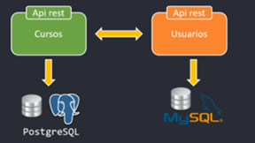
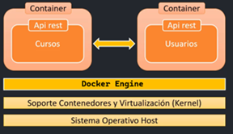
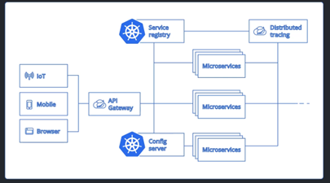

# 🚀 Microservicios | Guía completa de Docker & Kubernetes

> **Guía de Aprendizaje Profundo**  
> **Autor del Curso:** Andrés Guzmán (Udemy, 2026)  
> **Stack Técnico:** Java 25 ☕ | Spring Boot 4.0.3 🍃 | Docker 🐳 | Kubernetes ☸️

---

## 🗺️ Panorama General del Proyecto

En esta sección sentaremos las bases de la arquitectura de microservicios, evolucionando desde el desarrollo local hasta
la orquestación en la nube.

### 🏗️ 1. Construcción de la Base: Microservicios Nucleares

Iniciaremos con el diseño y desarrollo de dos microservicios que interactúan entre sí:

- `course-service`: Gestionará el catálogo de cursos.
- `user-service`: Además de definir datos de autenticación, lo usaremos como alumno.
- Comunicación: Utilizaremos `RestClient` para establecer comunicación entre microservicios.

### 📦 2. Contenerización con Docker

Transformaremos nuestras aplicaciones Java en unidades portables y ligeras.

* **Optimización para Java 25**: Utilizaremos imágenes base *multi-stage* para reducir el tamaño del contenedor.
* **Isolation**: Cada servicio correrá en su propio entorno aislado, asegurando que "funcione en mi máquina y en
  cualquier lugar".

### ☸️ 3. Orquestación con Kubernetes (K8s) & Minikube

Llevaremos nuestros contenedores al siguiente nivel mediante la orquestación profesional, simulando un entorno de
producción real desde nuestra estación de trabajo.

- **🛡️ Auto-scaling & Healing:** Configuraremos K8s para que nuestros microservicios sean "autocurativos" (se reinician
  solos si fallan) y escalen horizontalmente según la demanda de tráfico.
- **⚖️ Gestión de Cargas (Traffic Management):** Implementación de objetos de K8s:
    * **Deployments:** Para el ciclo de vida de los Pods.
    * **Services:** Para el balanceo de carga interno.
- **🚜 Minikube (Local Cluster):** Utilizaremos `Minikube` como nuestro hipervisor de Kubernetes local.
  Esto nos permite probar manifiestos de YAML, volúmenes persistentes y redes de clúster sin incurrir en costos de nube.

### ☁️ 4. Sinergia: Kubernetes + Spring Cloud

Finalmente, integraremos lo mejor de ambos mundos para una arquitectura robusta.

- **Native Integration**: Aprovecharemos **Spring Cloud Kubernetes** para el *Service Discovery* y la gestión de
  configuraciones dinámicas (*ConfigMaps* y *Secrets*) de forma nativa en el clúster.
- **Spring Boot 4 Features**: Explotaremos las mejoras en la observabilidad y los *Health Checks* optimizados para
  entornos de orquestación modernos.

## ⚙️ Estrategia de Configuración: "Manual Control First"

Para este proyecto, aunque operamos bajo el motor de **Spring Boot 4.0.3**, mantendremos un enfoque de configuración
manual y explícito.

### 🎯 Filosofía de Trabajo

* **Fidelidad al Curso:** Seguiremos la configuración manual de archivos `application.yml` y variables de entorno tal
  como se explica en Spring Boot 3.
* **Transparencia:** Evitaremos automatismos excesivos (como `@ServiceConnection`) para comprender cómo fluyen los datos
  entre Docker, Kubernetes y Spring.
* **Compatibilidad:** Solo aplicaremos cambios obligatorios de Spring Boot 4 si la versión anterior queda obsoleta o es
  incompatible con Java 25.

## 🛠️ Stack Tecnológico Definido

| Tecnología       | Versión     | Rol en el Proyecto                                  |
|:-----------------|:------------|:----------------------------------------------------|
| **Java**         | 25          | Lenguaje base (Uso de Virtual Threads por defecto). |
| **Spring Boot**  | 4.0.3       | Framework de microservicios.                        |
| **Docker**       | Latest      | Contenerización de servicios.                       |
| **Minikube**     | v1.x+       | Orquestación local (K8s).                           |
| **Maven/Gradle** | Actualizado | Gestión de dependencias y build.                    |
